# Part 01 — Roadmap for Backend from First Principles

> [!info] Video Reference
> **Watch:** [1. Roadmap for backend from first principles](https://www.youtube.com/watch?v=0Rwb4Xmlcwc)
> **Duration:** 31 min 24 sec · **Views:** 692,142 · **Published:** 2024-09-23 · **Uploader:** Sriniously · **Playlist:** Part 1 of 29

> [!abstract] In this chapter
> This is the roadmap video for the entire *Backend from First Principles* series. The author lays out why backend engineering is far more than writing CRUD APIs, explains the two problems students face (scattered resources and framework-locked thinking), and then walks through **every topic** the series will cover — from HTTP and routing through databases, caching, security, scaling, and DevOps — so you know exactly what to expect in the 30–40 videos to come.

**Where it fits:** This is the entry point of the whole course. It sets the map for everything that follows; move on to [[02 - Walk the Path of a True Backend Engineer]] for the vision and end goal of the series. If you ever lose the big picture, return here — [[_00 - Backend from First Principles - Index]] is the master index of the entire playlist.

---

## Video Timeline

| Timestamp | Section |
|-----------|---------|
| 0:00 | Roadmap intro |
| 02:22 | A high-level understanding |
| 02:51 | HTTP protocol |
| 04:25 | Routing |
| 05:04 | Serialisation and deserialisation |
| 07:13 | Authentication and authorisation |
| 08:45 | Validation and transformation |
| 12:03 | Middlewares |
| 14:03 | Request context |
| 15:28 | Handlers, controllers and services |
| 15:45 | CRUD deepdive |
| 16:33 | RESTful architecture and best practices |
| 17:08 | Databases |
| 17:44 | Business logic layer (BLL) |
| 18:51 | Caching |
| 20:04 | Transactional emails |
| 20:19 | Task queuing and scheduling |
| 21:35 | Elasticsearch |
| 22:33 | Error handling |
| 23:16 | Config management |
| 24:07 | Logging, monitoring and observability |
| 25:13 | Graceful shutdown |
| 25:50 | Security |
| 26:23 | Scaling and performance |
| 27:36 | Concurrency and parallelism |
| 27:47 | Object storage and large files |
| 27:59 | Real-time backend systems |
| 28:06 | Testing and code quality |
| 28:50 | 12 factor app |
| 28:55 | OpenAPI standards |
| 29:58 | Webhooks |
| 30:39 | DevOps for backend engineers |

---

## [00:00] Roadmap intro

The video opens by defining the true scope of backend engineering — and immediately pushing back against a common misconception.

### Backend engineering is much more than CRUD APIs

> "Backend engineering is a very wide scope... it is much more than building a set of CRUD APIs."

A **CRUD API** is an interface that lets a client Create, Read, Update, and Delete resources (think basic endpoints like `POST /users`, `GET /users`). Many beginners assume that mastering these four operations *is* backend development. The author says the real definition is far broader: backend engineering is about building:

- **Reliable** code bases — systems that behave correctly and predictably even under failure.
- **Scalable** code bases — systems that keep working as users, data, and traffic grow.
- **Fault tolerant** code bases — systems that survive partial failures (a crashed dependency, a timeout, a flaky network) without taking everything down.
- **Maintainable** code bases — code that other engineers (and future-you) can read, change, and extend over long periods of time.
- **Efficient** systems — systems that make good use of CPU, memory, network, and storage.

So the underlying theme is *engineering in production*, not just writing endpoints.

### The first problem: scattered resources

The author then describes the classic experience of starting out. If you wanted to learn backend development today there are "at least 1,000 resources" out there — books, videos, bootcamps, forums. The real difficulty is **not finding content, but deciding**:

- How do you decide **what to learn**?
- How do you **prioritise** one topic over another?
- How do you **see the big picture** — when and how do all these different concepts actually come together?

Because people start with a limited scope of training — from a *college*, a *boot camp*, or a *simple copy-paste course* — they never get that map. They "eventually build on top of that with trial and error and with the help of other developers over time." That patchwork path is why it takes people **years** to get their heads around these concepts and principles: they are assembling the picture piece by piece without ever having seen the whole.

### The author's own struggle

The author has lived this. When he started out as a backend engineer he had to constantly search for resources, learn from other developers, read a lot of books on backend development, and study **hundreds of open-source code bases** to see how people in the industry actually build stuff. It was a very time-consuming procedure — exactly the pain this series is designed to remove.

### The second problem: framework-locked thinking

The second problem is that people start backend development **from a particular language or framework point of view** — it could be Express (Node.js), Spring Boot (Java), or Ruby on Rails (Ruby). The flaw with this is fundamental:

> "You look at the problems that you solve with the lens of your particular language and ecosystem, and there are blind spots in that."

Concretely: imagine you worked with **Ruby on Rails for years**, and one day your company decides to migrate to **Golang** for performance reasons. How much of your knowledge transfers? If you only ever learned Rails conventions (how *it* does routing, how *it* does the database layer), almost none of it transfers. But if you understand the *underlying systems* — what routing actually is, what an ORM is doing, what HTTP means — then the concepts transfer easily and you just re-learn the syntax.

### The response: this series

So the author decided to put together a **comprehensive list of videos based on the foundational concepts of a backend system** — not on any single framework. The material is drawn from:

- Various books he has read over the years.
- The open-source code bases he has studied.

The promise of the episode (and the series): build a **big-picture mental model** of backend systems from first principles, so that language and framework become merely the last, easiest layer to pick up.

> [!tip] Why this framing matters
> The rest of this chapter is a **tour** of that map. Each of the 32 sections below is one area the author will teach from first principles in the coming videos. You are not expected to master them today — this note is your orientation guide for the course.

---

## [02:22] A high-level understanding

Before any deep dives, the author starts with a bird's-eye view of how backend systems work "behind the scenes" — specifically, the journey of a single request.

### What will be covered

The video will look at how a **request from the browser flows through different hops**:

1. The request leaves your browser.
2. It travels through the **network** and **firewalls** over the **internet**.
3. It is **routed** to a backend server situated in a **remote AWS server** (a real machine in the cloud).
4. The server processes it and **responds** to the request.

You'll look closely at what the response looks like too. This gives you a pretty vivid idea of:

- How **systems communicate**.
- How a **client communicates with a server**.
- How the **server responds**.

This high-level picture is the foundation every later topic slots into — every request that touches your backend follows this arc. The next few segments (HTTP, routing, serialisation, middleware) are all refinements of parts of this single flow.

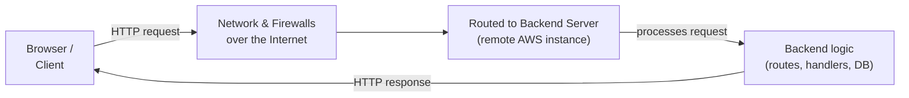

> **What this diagram shows:** The complete round trip of a request. The client (browser) sends an HTTP request; that request crosses the public internet, passing through firewalls and routers; it is delivered to a remote backend server hosted in the cloud (e.g. an AWS instance); the server runs its backend logic (routing the request to the right handler, talking to databases, etc.); and finally an HTTP response travels back over the same hops to the browser. Every subsequent topic in this series lives somewhere inside this loop — understanding it first is why the author starts here.

---

## [02:51] HTTP protocol

Next the author moves to **HTTP (HyperText Transfer Protocol)** — the language of client–server communication on the web. He lists everything the upcoming HTTP video will unpack, which makes this one of the densest sections of the roadmap.

### What is HTTP and what will be covered

**HTTP** *is* how a client and server talk: the client sends a request, the server returns a response. The roadmap itemises exactly what that topic will teach:

- **What is the role of HTTP?** How communication is established through HTTP between client and server.
- **How raw HTTP messages look.** The byte-level structure of a real HTTP request line and header block, with no framework sugar in the way.
- **HTTP headers** — what role they play and the different types:
  - **Request headers** (sent by the client to describe the request).
  - **Representation headers** (describe what the body represents — its format, length, language).
  - **General headers** (apply to the message as a whole, both directions).
  - **Security headers** (protect the client/server, e.g. CSP, HSTS).
- **HTTP methods** — GET, POST, PUT, DELETE — and crucially **when to use them**, what their **semantics** are, and what principles sit behind them.
- **CORS flow** — the Cross-Origin Resource Sharing rules and how they work.
  - How a **simple request** differs from a **pre-flight request**.
  - What a pre-flight request looks like going from the browser to the server and back to the browser. (See the vault notes [[CORS]] and [[Preflight request]].)
- **HTTP responses** — their structure and the **different status codes** a server returns, when to return which type of code, and the **most commonly used status codes**.
- **HTTP caching** — different caching techniques using HTTP: **ETags**, and **max-age headers**.
- **HTTP versions** — the differences between **HTTP/1.1, HTTP/2.0, and HTTP/3.0**.
- **Content negotiation** — how client and server agree on a format using different headers.
- **Persistent connections** — how HTTP keeps a connection alive across multiple requests instead of opening a new one each time.
- **HTTP compression** — the different compression techniques: **gzip**, **deflate**, **br (Brotli)** — and which one is most commonly used.
- **The security aspect** — **SSL/TLS** and **HTTPS**.

> [!note] A quick walk-through of the timeline
> The roadmap listed these in *roughly* the order future videos will cover them, and the rest of the playlist follows this list closely. Your own revision of HTTP should mirror it: messages → headers → methods → CORS → status codes → caching → protocol versions → negotiation → compression → TLS. All of it is also summarised in the companion note [[HTTP]].

### Why this matters for a backend engineer

HTTP is the *contract* between your backend and every client that talks to it. Almost every bug you'll debug — wrong status code, missing CORS header, sluggish response, caching confusion — is an HTTP problem first. Understanding the raw protocol (not just a framework's `.get()` helper) means you can reason about any stack: Express, Spring Boot, Rails, Go's `net/http`, or a hand-rolled server.

---

## [04:25] Routing

Once a request arrives over HTTP, somebody has to decide *what to do with it*. That somebody is **routing**.

### What routing is

Routing **maps URLs to server-side logic**. When a client asks for `GET /users/42`, routing is what connects that specific URL + method combo to the exact function/handler that should serve it.

### What the roadmap says will be covered

- **The connection between routing and HTTP methods** — the same URL path can behave differently depending on whether it's hit with `GET`, `POST`, `PUT`, or `DELETE`. (This is the seed of the RESTful design topic later at [16:33].)
- **The different components of a route**:
  - **Path** — the URL path itself (`/users/42`).
  - **Path parameters** — variable parts inside the path (`42` in `/users/42`).
  - **Query parameters** — the `?key=value` pairs appended to a URL.
- **Different types of routes:**
  - **Static routes** — fixed paths like `/about` that match literally.
  - **Dynamic routes** — paths with placeholders like `/users/:id`.
  - **Nested routes / hierarchical routes** — resources organised through parent/child relationships, e.g. `/users/:id/posts/:postId`.
  - **Catch-all / wildcard routes** — match everything under a prefix, often used for 404 fallbacks or SPAs.
  - **Regular-expression-based routes** — paths matched by regex patterns for advanced control.
- **API versioning using HTTP** — the different versioning techniques (URI versioning like `/v1/...`, header versioning, query-string versioning, media-type versioning — all revisited in the REST section at [16:33]); what is the **best way to deprecate an old version**, and what are the industry best practices.
- **Route grouping** — the benefits of grouping routes to share **versioning**, **permissions**, and **common middleware**.
- **How to secure routes** — only the right users/roles should reach protected endpoints.
- **Route matching performance** — optimising how the router finds the right handler quickly as the route table grows.

> [!note] Direct link
> Routing gets its own full chapter later in the playlist; the vault has a quick companion note at [[Routing]]. For now, keep the core definition: **routing = matching (method + URL components) to server-side logic**, with parameters, wildcards, groups, versioning, and performance as the levers you tune.

### Why this matters for a backend engineer

Routing is the **front door** of your application. Bad routing design (no grouping, no versioning, unclear parameter conventions) makes every later feature — auth, middleware, permission checks, API evolution — harder and more dangerous to ship. It's also one of the first things that differs between frameworks, so understanding it *conceptually* (not by memorising Express or Rails syntax) is exactly the language-agnostic skill this series promises.

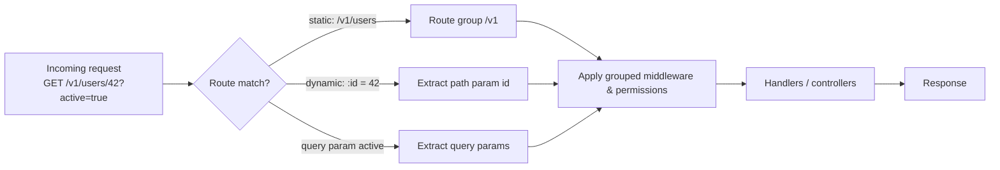

> **What this diagram shows:** An example of routing in action. A request `GET /v1/users/42?active=true` enters the router, which checks the URL against its route table. The path prefix `v1` matches a route group (which bundles common versioning, permissions, and middleware), the segment `42` is captured as a dynamic path parameter, and `active=true` is parsed as a query parameter. The router then passes the request through the group's middleware, into the matching handler, and onward toward a response — the same pipeline the middleware section ([12:03]) zooms into later.

---

## [05:04] Serialisation and deserialisation

Every time your server sends or receives data over the network, it must translate between its own in-memory representation and a representation the wire can carry. That translation is **serialisation and deserialisation**.

### Definitions (from the transcript)

> **Serialisation** — "how, before sending it over to the network, our server translates the data into a particular format" — i.e. *outgoing*, converting native data into a transferable format.

> **Deserialisation** — how the server **translates data it received from the client over the internet into its own native format** — i.e. *incoming*, converting the wire format back into native objects.

In short: *serialise goes out, deserialise comes in.* The transcript's captions spell it inconsistently ("DC realization", "der serialization"); both are the same concept of **deserialisation**.

### What the roadmap says will be covered

- **The need for it and how it helps with interoperability** — two machines built with different languages can still exchange data if they agree on a common wire format.
- **The different formats used:**
  - **Text-based formats:** JSON, XML — human-readable, easy to inspect.
  - **Binary formats:** Protobuf (Protocol Buffers) — compact and fast.
  - The **performance differences** between the two, and **when to use which**.
- **How different programming languages implement serialisation/deserialisation** — the idiomatic API in each ecosystem.
- **A deep dive on JSON**, the popular text-based format:
  - The **structure of JSON** and its data types: **strings, numbers, booleans, arrays, objects**.
  - How **nested objects and collections** are handled.
  - How deserialising into **native data structures** works — e.g. a **Python dictionary**, **Go structs**, or a **JavaScript object**.
  - **Common errors** when dealing with JSON: handling **missing or extra fields**, **null values**, **date serialisation issues**, and **time-zone issues**.
  - **Custom serialisation** — implementing custom logic before serialising/sending data into JSON.
- **Error handling in serialisation/deserialisation** — invalid data, **data conversion errors**, **unknown fields**.
- **Security concerns** — for example **injection attacks**; *why it's important to validate data before deserialising it*, and **JSON-schema validation** before processing trusted data.
- **Performance aspects** — reducing serialised data through **compression**, eliminating **unnecessary fields**, and the **serialisation performance** gap between text-based and binary formats.
- **The readability vs. performance trade-off:** with a text-based format you can open the payload and read it directly; that "does not work the same in binary formats" — but binary formats are faster. *When* you use a binary format and *when* you use a text-based format is exactly that valid trade-off.

> [!note] Keep this rule of thumb from the video
> Text formats (JSON/XML) trade speed and size for **readability and debuggability**; binary formats (Protobuf) trade readability for **size and speed**. Choose deliberately per use case — external public APIs usually favour JSON; internal, high-volume service-to-service calls often use Protobuf.

### Why this matters for a backend engineer

Serialisation sits on the boundary of *every* request and response your system handles. Mistakes here show up as subtle bugs — dates shifting by a time zone, nulls blowing up handlers, payloads ballooning, or security holes when unvalidated JSON is deserialised straight into business objects. Getting the pipeline right (validate → deserialise → transform) is a core backend skill, and it leads directly into the next two topics.

---

## [07:13] Authentication and authorisation

The topics of **authentication** (who are you?) and **authorisation** (what are you allowed to do?) are the security backbone of any backend.

### Why we use it

Because almost nothing in a real system should be available to *anyone*: users have identities, and identities have permissions. Authentication and authorisation are how a backend knows and enforces both.

### What the roadmap says will be covered

- **Different types of authentication — stateful vs. stateless:**
  - **Basic authentication** — username/password sent on every request.
  - **Bearer-token authentication** — a token presented in place of credentials.
- **Sessions, JWTs (JSON Web Tokens), cookies** — the mechanisms that carry identity across requests. (Guard against the transcript's "jws" → it means **JWT**.)
- **Deep dive on the OAuth2 protocol** and **OpenID Connect** — the industry-standard delegation and identity protocols (transcript "oo protocol" → **OAuth 2.0**).
- **How API keys work** — simple, long-lived tokens for machine clients.
- **How multi-factor authentication (MFA) works** (transcript "multiactor").
- **Salting, hashing, and different cryptographic techniques used in authentication** — how passwords must be stored (salted + hashed, never plaintext).
- **Authorisation models:**
  - **RBAC** — Role-Based Access Control (users have roles; roles have permissions).
  - **ABAC** — Attribute-Based Access Control (permissions decided by attributes of user/resource/environment).
  - **ReBAC** — Relationship-Based Access Control (permissions derived from relationships between entities). (Transcript "aack rback reback" → ABAC and ReBAC.)
- **Best security practices:**
  - **Securing cookies** (flags like `HttpOnly`, `Secure`, `SameSite`).
  - Avoiding **CSRF** (Cross-Site Request Forgery), **XSS** (Cross-Site Scripting), and **MITM** (Man-in-the-Middle) attacks.
  - **Audit logging** — recording authentication/authorisation events for audits and monitoring: **failed login attempts, privilege escalation, and access to sensitive resources**.
- **Error-message hardening:**
  - Avoiding leakage of information to attackers through detailed error messages (don't reveal why a login failed).
  - **Consistency in responses across different failure modes** — e.g. the same generic error for "no such user" and "wrong password".
  - **Rate limiting** (limit login attempts per client) and **account lockout**.
  - **Avoiding timing attacks** — an attacker can "exploit time differences in error responses to infer valid credentials"; e.g. an error for a wrong password can take longer than an error for an unknown username, because password checks run a hashing/cryptographic function that takes a little time. Observing that tiny timing difference lets an attacker **guess valid usernames**. "Even though that's very difficult, we don't want to keep any security holes."

### Why this matters for a backend engineer

Identity is the single most-targeted part of any backend. Sloppy authentication means data breaches; sloppy authorisation means privilege escalation. These topics will each be expanded into dedicated videos later in the series — this roadmap entry tells you the shape of that future content (stateful vs stateless, token types, the OAuth/OIDC flow, password storage, the authorisation model zoo, and the hardening checklist).

---

## [08:45] Validation and transformation

Before any user-supplied data may touch your business logic, it must be checked (**validation**) and reshaped (**transformation**). This segment itemises the full toolbox.

### The different types of validation

- **Syntactic validation** — is the value *well-formed*? Examples from the video: checking whether a string **is an email or not**, whether it is a **valid phone number**, whether it is a **valid date format**.
- **Semantic validation** — is the value *meaningful in context*? Examples: a **date of birth cannot be in the future**; the **age of a person should be between 1 and 120**.
- **Type validation** — does the input match the expected type? Whether it is a **string, an integer, an array, or an object** — "these types of checks are called type validation."

### Client-side vs. server-side validation

The video makes a sharp distinction:

- **Client-side validation improves user experience** by providing **instant feedback** (the form marks errors before hitting the server).
- **Server-side validation is the true security implementation**, "because that is the gateway to your business logic." Even if the client already validates, every backend *must* validate independently — a malicious client can skip client-side checks entirely.

### Best practices for validation (as listed in the roadmap)

- **Failing fast** — reducing unnecessary processing by **returning early** on the first bad input.
- **Keeping consistency between frontend validation and backend validation** — the two should agree, or users get confusing double-standards.
- **Validation pipeline** — where validation and transformation are bundled into a single ordered stage before handlers receive data.

### Transformation (and friends)

- **Type casting / conversion** — converting **string to number** or **number to string**. Why? Because "in query parameters or path parameters whatever we receive is a string" — so if a handler expects a numeric `id`, the pipeline must convert the string into a number **before** it reaches the handler. The video explicitly calls that conversion step **a transformation**.
- **Date formats** — the frontend might send a different format, or the backend might expect a **timestamp**; that conversion is handled in the validation pipeline too.
- **Normalisation** — cleaning values into a canonical shape: **converting an email to lowercase**, **trimming whitespace** from a string, **adding a country code to a phone number**.
- **Sanitisation (for security)** — neutralising harmful input, e.g. sanitising a user-submitted string **to prevent SQL injection**.
- **Complex validation logic** — validation that spans multiple fields, e.g. a form with **password** and **confirm password** where the two strings must match (relationship-based validation).
- **Conditional validation** — rules that depend on other values: a **partner name** field might only be required **if `married` is true**.
- **Chain validation** — a sequence of transforms, e.g. "converting a string to lowercase, then removing special characters, and then checking its length."

### Error handling in validation

- Sending **meaningful error messages** to the frontend so the user can fix them.
- **Aggregating all validation errors in one response** for client-side display.
- **Obfuscating error messages** — "instead of saying 'invalid password' we'll have to say 'invalid credentials'" to prevent different types of attacks (this is the information-leakage theme from the auth section).
- **Gracefully handling failed transformations** — e.g. an **invalid JSON** payload or a **failed date conversion**, returned to the user as a meaningful message.

### Performance trade-offs

- Validation costs CPU and time; optimise by **returning early** and **avoiding redundant validations** (don't validate the same value twice in one request).

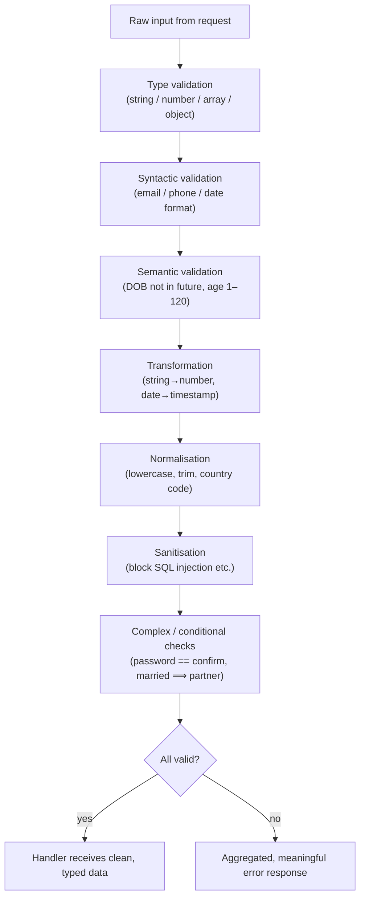

> **What this diagram shows:** The recommended order of a validation + transformation pipeline. Raw input first goes through simple type checks, then syntactic checks (is it an email/phone/date), then semantic checks (meaningful values like a past birth date). Next, transformations convert values to the types handlers expect (e.g. string IDs to numbers, dates to timestamps), normalisation canonicalises values, and sanitisation strips dangerous content. Complex and conditional rules are checked last. If anything fails, the pipeline fails fast and returns an aggregated, meaningful, and appropriately obfuscated error; otherwise the handler receives clean, typed data. This mirrors exactly how validators like Joi, Zod, or class-validator work in practice.

### Why this matters for a backend engineer

Validation is your first line of defence against garbage *and* against attackers; transformation is what lets trustworthy, correctly-typed data flow through your layers. Together they define the quality of your API's contract with the outside world.

---

## [12:03] Middlewares

**Middleware** is the pluggable machinery that wraps request handling — code that runs *around* your route handlers.

### What a middleware is and when to use them

A **middleware** is a function that sits in the request cycle, before and/or after the final handler, to perform cross-cutting work. Common use cases (all listed in the video): logging, authentication, validation, CORS, rate limiting, compression, error handling, and body parsing. You use middleware whenever **many routes need the same behaviour**, so you don't repeat that behaviour in every handler.

### The role of middleware in the request cycle

- **Pre-request middleware** — runs as the request enters (e.g. log it, authenticate it).
- **Post-response middleware** — runs after the handler has prepared the response (e.g. add headers, compress the body).
- **Chaining** — middlewares execute "in a sequence, passing control to the next middleware until the request reaches its final handler." Each middleware calls the **`next` function** to continue the chain, or **exits the middleware early**.
- A middleware can **short-circuit the request pipeline** — e.g. by handling **404 errors** itself instead of passing the request onward.

### Ordering matters

The video gives a canonical order that must be respected:

> "We have to log the request → check whether the user is authenticated → do validation → do route handling → do error handling."

The transcript also interlaces this with the **[08:45]** theme: route handling itself includes validation. The point stands: **the order of middleware affects both performance and security** of the application.

### Common middlewares enumerated in the video

- **Security middlewares** that add security headers like:
  - **`X-Content-Type-Options`** (transcript "X content type").
  - **Strict-Transport-Security** (HSTS).
  - **Content-Security-Policy** (CSP).
- **CORS middlewares** — adding appropriate **CORS headers** to every single request or response.
- **CSRF protection middleware** — to avoid CSRF attacks.
- **Rate-limit middleware**.
- **Authentication middleware** — to **reuse route-protecting logic across our apps**.
- **Logging and monitoring middlewares** — for request logging or **structured logging**, for observability and easier debugging in production.
- **Error-handling middleware** — catches and **formats application-level errors** for consistent API responses.
- **Compression / performance middlewares** — compress response bodies to **reduce the size of data sent over the network**.
- **Data-passing middlewares** — parse incoming request bodies: **JSON**, **URL-encoded forms**, and **file uploads**; handles **multipart data** for file uploads.

### Performance & scalability of middleware

- Keep middlewares **lightweight and efficient** (best practice).
- Ensure middleware is applied in the **correct order** — "how middleware order can affect the performance and security of the application."

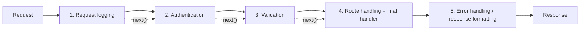

> **What this diagram shows:** A typical middleware chain for one request. The request first hits request-logging middleware, then authentication middleware (verifies who the user is), then validation middleware (checks the input), then the route handler itself. As each middleware finishes its job it calls `next()` to hand control to the following stage. Finally, error-handling/response middleware formats the outcome — catching anything that broke earlier and normalising the response. This is the ordering the video stresses: log first, authenticate, validate, handle, then format errors — because order changes both security and performance.

### Why this matters for a backend engineer

Middleware is how you stop repeating security, logging, parsing, and formatting code in every handler. A well-orded, lightweight middleware stack keeps apps secure, consistent, and fast; a disordered or heavy one leaks security holes, duplicate logic, and latency.

---

## [14:03] Request context

The **request context** is the metadata that travels with a single request through the whole application.

### Definition (from the transcript)

> "Request context basically means the metadata that is often passed through application middlewares, controllers, and services. It is kind of a **request-scoped state** — the state is only valid for that request."

So: a temporary, request-scoped state object that middlewares write to and later layers read from — without needing to pass dozens of arguments between functions.

### What the roadmap says will be covered

- **The lifecycle of a request** — maintaining state **for the duration of a request**.
- **Sharing data across different layers of the application without coupling** — how context provides that *temporary, request-scoped state* and lets layers cooperate loosely.
- **Components of a request context:**
  - **Request metadata** — the HTTP method, the URL, headers, query parameters, and the body.
  - **Session and user information** — e.g. in the authentication middleware we fetch user information, "and then we add it to the request context. So for that request scope, the user's information is injected into the context."
  - **Tracking and logging information** — like unique **request IDs** or **trace IDs**.
  - **Request-specific data** — custom data injected during the request lifecycle, like **caching data** or the results of **permission checks**.
- **Use cases** — authentication, **rate limiting**, **tracing**, **logging**.
- **The connection between middlewares and request contexts** — middlewares are the primary *writers* of request context; handlers and services are the primary *readers*.
- **Timeouts** — the different types: **request timeouts**, **custom timeouts**, and **cancellation signals** (how a request can be abandoned cleanly).
- **Best practices:**
  - **Keeping it lightweight** to prevent memory overhead.
  - **Ensuring context data is cleaned up** after the request lifecycle, to **prevent memory leaks**.
  - **Avoiding tightly coupling components through context**, or over-relying on it for passing data.

### Why this matters for a backend engineer

Without request context, plumbing identity, tracing IDs, and request metadata through every function signature becomes unmanageable. With it — used carefully — you get clean separation between layers (see the layering discussion at [17:44]) and full traceability of each request. The caution from this roadmap entry is the key lesson: context is *request-scoped state*, not a place to stash global data.

---

## [15:28] Handlers, controllers and services

Now the author moves from *how* requests flow to *who* organises the code that processes them.

### What will be covered

- **The MVC pattern** — Model-View-Controller, the classic organisational pattern for separating data (model), presentation (view), and control flow (controller).
- **What handlers, controllers, and services are**, and **the responsibilities of all of them**:
  - **Handlers / controllers** — the layer that receives a request, interacts with the rest of the app, and returns a response. (In this series' terminology they act as the *presentation* layer.)
  - **Services** — the layer that holds and executes the actual *doing* (business logic), typically called from controllers. The relationship between all of them is expanded in the BLL section at [17:44].
- **Reducing code with middleware** — reusing cross-cutting work (like auth or logging) so controllers stay thin.
- **Centralized error handling in handlers** and **consistent success and error message formats** — and how to implement them **in controllers**.

### Why this matters for a backend engineer

Consistent structure across every endpoint is what makes a code base *maintainable* (recall the intro's definition). If every controller formats errors differently, debugging and API consumers suffer. Centralised error handling and uniform message formats are the practical payoff of good controller design.

---

## [15:45] CRUD deepdive

The author zeroes in on the "bread and butter" of backend work: **CRUD** — Create, Read, Update, Delete.

### How CRUD operations map to HTTP methods

The video maps each operation to its HTTP method *and* the typical status codes:

- **POST** — usually used for **creation and submissions**; status code is usually **201 Created**, or **400 Bad Request** if the input is bad.
- **GET** — usually associated with **fetching a list of resources** or **fetching a single resource**.
- **PUT and PATCH** — used to **update resources** (PUT: full replacement; PATCH: partial update ⇢ *inferred — the video names both without spelling out the distinction here; the full REST chapter covers it*).
- **DELETE** — to **delete resources**.

### Features around CRUD (as listed in the roadmap)

- **How to implement pagination** — splitting large result sets into pages.
- **How to implement a search API**.
- **How to do sorting** and **how to do filtering**.

### Best practices for CRUD APIs

- **Strict validation.**
- **Consistent response formatting.**
- **Limiting payload** sizes.
- **Redacting sensitive fields** from responses.
- **Error handling.**
- **Authentication and authorisation** applied to CRUD endpoints.

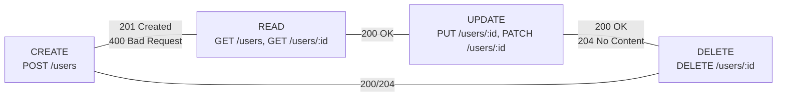

> **What this diagram shows:** The four CRUD operations and their conventional HTTP bindings. Create is expressed with `POST` (answered with 201 Created, or 400 on bad input), Read with `GET` on a collection or a single resource (200 OK), Update with `PUT`/`PATCH` on the resource URL, and Delete with `DELETE`. In REST-style backends these operations rotate around a single *resource* (here `users`), which is why the diagram is circular — every operation targets the same conceptual entity through a distinct method + path combination.

### Why this matters for a backend engineer

CRUD is the 80% of everyday API work, and its conventions become the contract your clients depend on. The mapping table above is the baseline that the next topic (RESTful architecture) formalises into design principles.

---

## [16:33] RESTful architecture and best practices

**REST (Representational State Transfer)** is the architectural style most web APIs follow. The roadmap lists what the REST deep-dive will teach.

### What will be covered

- **What RESTful architecture is** and **best practices for implementing REST APIs**.
- The **principle of designing APIs around resources** — nouns, not verbs (`/users`, `/orders`), and **sticking to HTTP semantics** (`GET` reads, `POST` creates, etc.).
- **Best practices for filtering and pagination.**
- **The different types of versioning:**
  - **URI versioning** (`/v1/users`).
  - **Header versioning** (custom header says the version).
  - **Query-string versioning** (`?version=1`).
  - **Media-type versioning** (version embedded in `Accept`/`Content-Type`).
  - (Recall that trade-offs and deprecation strategy were previewed in the routing section at [04:25].)
- **Designing APIs with the OpenAPI spec in mind** — the contract-first approach (expanded at [28:55]).
- **Content negotiation** — agreeing on response formats via headers (from the HTTP section).
- **Capturing exceptions and providing meaningful messages**.
- **Supporting client-side caching with ETags**.
- **Optimizing large requests and responses**.

### Why this matters for a backend engineer

RESTful discipline is what makes an API predictable to thousands of external developers. Following resource-oriented design, proper versioning, and HTTP semantics means clients can *guess* how your API works — and guard-railed responses mean failures are communicated rather than silent.

---

## [17:08] Databases

The author calls databases **a *very important* topic** — the persistence layer that stores everything your application owns.

### What will be covered

- **Relational and non-relational databases** — what the **differences** are, and **when to use which**.
- **Theoretical concepts:**
  - **ACID** — Atomicity, Consistency, Isolation, Durability: the guarantees that make relational transactions trustworthy.
  - **CAP theorem** — Consistency, Availability, Partition tolerance: you can have at most two of the three under a network partition.
- **Basic querying and joins** — SQL basics and how to combine tables.
- **Database design best practices** — **schema design** and **indexing**.
- **Optimisation methods** — **query optimization**, **caching**, and **connection pooling**.
- **Data integrity** — **constraints and validations**, **transactions**, and **concurrency** control.
- **ORMs** — how they work, **whether to use one**, and the **tradeoffs** (productivity vs. control/performance).
- **Database migrations** — versioning changes to your schema safely.

### Why this matters for a backend engineer

Databases are where your data *lives*; almost every engineering decision — schema, indexes, transactions, ORM choice, migration policy — affects correctness and performance long after the initial build. Choosing relational vs. non-relational correctly up front prevents painful rewrites. The series dedicates a full chapter (Postgres-focused) to this later in the playlist.

---

## [17:44] Business logic layer (BLL)

The BLL is where the *core rules of your business* live. This is the video's "architectural heart" moment: it explains the **three-layer model** of a typical backend.

### The layers of a request cycle

The transcript groups the layers of the request cycle explicitly:

- **Presentation layer** — includes **validation**, **routing**, **middlewares**, and **handlers/controllers**, because they "deal with user's data — whether it is accepting user's data or sending user's data."
- **Business logic layer (BLL)** — "the middle one," which "deals with our core business logic."
- **Data access layer** — "deals with databases — performing queries or inserts or deletions." The **BLL uses the data access layer behind the scenes.**

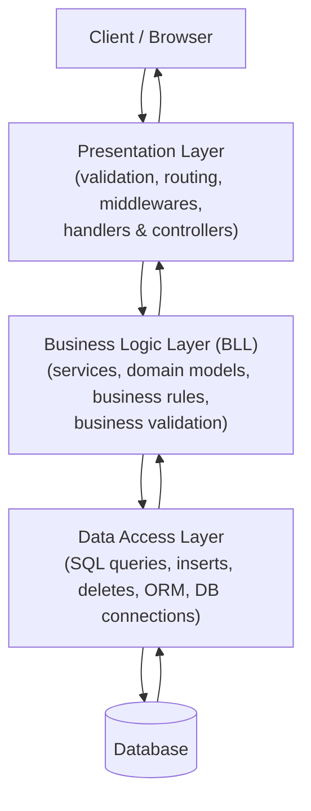

> **What this diagram shows:** The classic three-layer backend architecture. A client's request enters through the presentation layer, which validates and routes it (routing, middlewares, handlers/controllers). The presentation layer hands off to the business logic layer, which applies the core business rules of the application. When the business logic needs data it calls the data access layer, which actually runs queries (selects, inserts, deletes) against the database. The response then travels back up the same layers in reverse: database → data access layer → business logic → presentation layer → client. The BLL never touches the database directly — it always goes through the data access layer behind the scenes.

### What will be covered (from the roadmap)

- **The role of the BLL.**
- **Design principles:**
  - **Separation of concerns.**
  - **Single responsibility** — each component has one reason to change.
  - **Open-closed** — open for extension, closed for modification.
  - **Dependency inversion** — depend on abstractions, not concrete implementations.
- **Components of the BLL:**
  - **Services** — orchestrate operations.
  - **Domain models** — represent core entities like **a user** or **an order**.
  - **Business rules** (transcript "business tools" → **business rules**).
  - **Business validation logic** — rules like "an order total must be positive," as opposed to the pure input validation of [08:45].
- **Service-layer design best practices.**
- **How to handle errors properly** and **how to propagate errors from the service layer to the presentation layer** — the seam where internal failures become client-visible responses.

### Why this matters for a backend engineer

The BLL is the *reason a backend exists* — every rule your company has (pricing, eligibility, workflows) lives here. Keeping it free of HTTP and database concerns (per the design principles above) is what makes that logic testable and portable across languages, which is the whole thesis of this series.

---

## [18:51] Caching

Caching is about storing *copies of results* so repeated work becomes fast. The roadmap gives a deep list of what the caching video will teach.

### The need for caching, and how it differs from database persistence

Caching is **not** the same as persistence: a database *durably* stores truth, while a cache stores **recently/computationally expensive results** for faster reads. Caching exists to reduce latency and load.

### Types of caching

- **Memory caching** — in-process, e.g. an app's own RAM.
- **Browser caching** — the client stores responses/static assets.
- **Database caching** — results reused at the DB layer.
- **Client-side caching vs. server-side caching** — the two broad categories and their different needs.

### Strategies

- **Caching strategies:** (transcript "cash" is consistently a captioning artifact for "cache"):
  - **Cache-aside** — app reads cache first, fills it on miss.
  - **Write-through** — writes go to cache *and* DB at once.
  - **Write-behind / write-back** — writes go to the cache first and are flushed to the DB asynchronously (transcript "right behind or right back").
  - **Read-through** — cache loads missing data from the DB itself.
- **Eviction strategies:**
  - **LRU** (Least Recently Used).
  - **LFU** (Least Frequently Used).
  - **TTL** (Time To Live).
  - **FIFO** (First In, First Out).
- **Cache invalidation:**
  - **Manual cache invalidation.**
  - **TTL invalidation** (expiry).
  - **Event-based invalidation** (invalidate when data changes).

### Levels of caching

- **Level 1 (L1)** — **in-memory**, fast and small.
- **Level 2 (L2)** — **network/distributed** (e.g. Redis), larger and slower.
- **Hierarchical caching** — combines L1 and L2: "frequently used data is stored in a fast small cache (level 1) and less frequently used data is stored in a slower, larger cache (level 2)."

### Caching for web apps and databases

- **Web apps:** caching **static assets** or **API responses using headers** (ties into the HTTP caching preview at [02:51]).
- **Databases:** **query caching** — "storing the results of heavy joins in Redis."
- **Cache hit / cache miss ratio** — the metric of how well your cache is working, and **how to optimise it**.

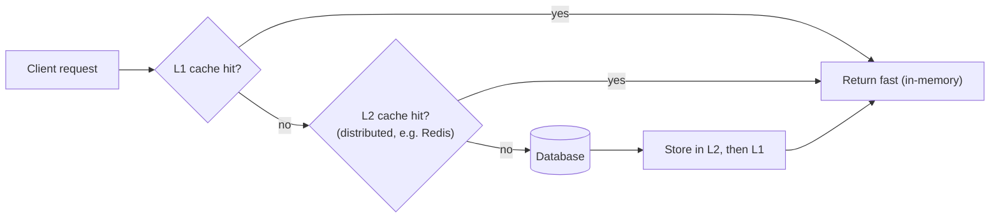

> **What this diagram shows:** Hierarchical (two-level) caching in action. A request first checks the fast, in-memory Level-1 cache; on a hit the response returns immediately. On a miss it checks the larger Level-2 distributed cache (e.g. Redis); again a hit returns fast, and only a double-miss falls through to the database. The freshly retrieved result is written back into Level 2 and Level 1 so the next identical request is fast. The ratio of hits to misses against the total requests — the *cache hit/miss ratio* — tells you how effectively this pipeline is serving traffic.

### Why this matters for a backend engineer

Caching is the single biggest latency lever a backend engineer controls, and also the biggest source of subtle bugs (stale data) when done badly. Knowing the strategy/eviction/invalidation space tells you *which knob to turn* per use case.

---

## [20:04] Transactional emails

Email that a *system* sends as a direct result of a user action — order confirmations, password resets, receipts — is called a **transactional email** (as opposed to bulk marketing email).

### What will be covered

- **The use cases of transactional emails** and their common use-cases (welcome emails, order confirmations, password resets, notifications ⇢ *inferred from the general context of the later use-case list*).
- **The anatomy of a transactional email:**
  - The **subject** line.
  - The **preheader** (the short preview text shown after the subject).
  - The **body header**.
  - The **main content**.
  - A **CTA** (Call To Action — the button/link the reader is meant to press).
  - The **footer**.
- **Personalisation with different dynamic parameters** — injecting the user's name, order details, and other per-recipient values into the template.

### Why this matters for a backend engineer

Transactional emails are part of your product's reliability surface: a missed password-reset email is a support ticket or a lost user. Understanding the anatomy and personalisation mechanics is needed before you can build templating, delivery retries, and provider integrations properly.

---

## [20:19] Task queuing and scheduling

Some work doesn't belong in the HTTP request/response cycle at all; it should be **deferred** to a queue or run on a **schedule**.

### Common use cases for task queuing

- **Sending emails** and **processing image files.**
- **Third-party API integration** — like **payment processing** or **webhooks**.
- **Offloading heavy computation** — like **batch processing**.

The video's example of batch processing is memorable: *a user clicks a button to "clear all my data"*. To do that, the backend must execute different queries against **different tables** to clear all the user's data — "and that might take some time." So instead of blocking the request:

> "Instead of blocking the request we return the response instantly, and we trigger a background job by pushing into the task queue."

### Common use cases for scheduling

- Running **database backups**.
- **Recurring notifications and reminders**.
- **Data synchronization**.
- **Maintenance-related issues**, for example **clearing logs or caches**.

### Components of a task queue

- **Producer** — pushes tasks in.
- **Queue** — holds pending tasks.
- **Consumer** — pulls and executes tasks.
- **Broker** — the intermediary that stores/coordinates them.
- **Backend** — stores results/state of tasks.

### Task relationships and advanced behaviour

- **The flow of a task** through the queue.
- **Dependencies** — e.g. **chain dependencies** (task A then task B) or **parent-child relationships**.
- **Task groups** — executing multiple tasks **concurrently** and **waiting for all of them to complete** at the same time.
- **Error handling and retries** in task queues.
- **Task prioritisation and rate limiting** — e.g. giving importance to a task like **payment processing** *before* you process a task like **sending notifications**.

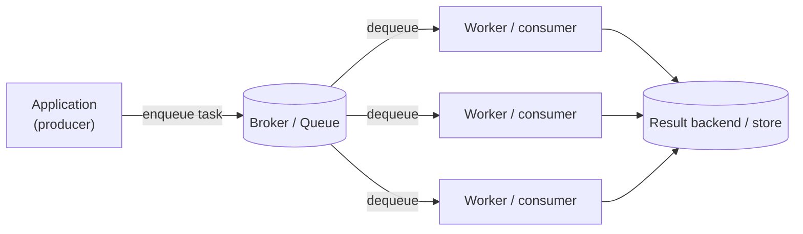

> **What this diagram shows:** The anatomy of a task queue. The application acts as a producer, pushing tasks into a broker-managed queue when a job should run in the background (for example after a user clicks "clear all my data"). One or more workers (consumers) pull tasks off the queue and execute them; multiple workers let tasks run concurrently. As tasks finish, their results and status are recorded in a result backend. Because the response to the user was returned instantly and only a lightweight task was enqueued, the heavy or slow work no longer blocks the request — and tasks like payment processing can be prioritised over lower-stakes jobs like sending notifications.

### Why this matters for a backend engineer

Queueing moves slow, flaky, or expensive work out of the request path — improving latency and fault tolerance. Scheduling keeps background maintenance (backups, log clearing, reminders) automatic. Later chapters of the playlist go deep on both.

---

## [21:35] Elasticsearch

**Elasticsearch** is a distributed search engine, and the roadmap devotes a dense section to it.

### Why use Elasticsearch and how it works

- **Why:** ordinary databases aren't built for rich, fuzzy, full-text search at scale; a search engine is.
- **How it works behind the scenes**, with the techniques involved:
  - **Inverted index** — a map from every term to the documents containing it.
  - **Term frequency and inverse document frequency** — scoring how important a term is in a document vs. across the corpus.
  - **Segments and shards** — the storage units Elasticsearch splits indexed data into (segments) and distributes across nodes (shards).

### Use cases

- **Type-ahead experience** — search-as-you-type suggestions.
- **Log analytics**.
- **Social media search** — full-text search for **user profiles, posts, and comments**.

### What will be covered

- **Creating and managing indexes.**
- **Searching and querying** — **basic search**, **full-text search**, and **relevance scoring**.
- **Optimising search performance** by tweaking:
  - **`text` vs. `keyword` fields** (analyzed for search vs. treated as an exact unit).
  - **Analyzers** — how text is tokenised/normalised before indexing.
  - **Boosting** — weighting some fields higher than others.
  - **Pagination** of results.
- **Advanced search patterns** — **filtering**, **aggregation** (facets/grouped stats), and **fuzzy search** (tolerant of typos).
- **Kibana** — how it works and how to use Elasticsearch in a **user-friendly way**.
- **Best practices:**
  - **Defining field mappings explicitly** (rather than relying on dynamic mapping).
  - **Optimising the number of shards.**
  - **Indexing data in batches.**
  - **Avoiding wildcard queries** (expensive).

### Why this matters for a backend engineer

Any product with search — user search, product search, log exploration, feed filtering — needs a search engine's query features and relevance semantics. Understanding inverted indexes and scoring makes you able to choose, tune, and debug Elasticsearch instead of treating it as a magic box.

---

## [22:33] Error handling

**Error handling** is how a backend responds when something goes wrong — deliberately, not defensively.

### The different types of errors in our apps

- **Syntax errors** — code that doesn't parse (caught at compile/load time).
- **Runtime errors** — failures while code executes (invalid operations, missing resources, network failures).
- **Logical errors** — the code runs but computes the wrong result; the hardest to catch because nothing "throws."

### Error-handling strategies

- **Fail-safe** — errors yield a safe, neutral outcome rather than a crash.
- **Fail-fast** — fail as soon as a problem is detected (recall this also appeared in validation at [08:45]).
- **Graceful degradation** — the system keeps partially working around a failed component.
- **Prevention of errors** — designing so errors don't happen in the first place.

### Best practices for error handling

- **Catching errors early.**
- **Not swallowing errors** — never silently discard them.
- **Custom error types** — matching kinds of failure to typed errors.
- **Failing gracefully.**
- **Logging errors** and **using stack traces** to diagnose.

### Global error handlers and user-facing errors

- **How global error handlers work** — a single, central catch for anything uncaught.
- **Handling user-facing errors appropriately** — providing **friendly error messages** and **actionable feedback**.

### Monitoring, logging, and alerts

- The **importance of monitoring and logging in error handling**.
- **Tools** like **Sentry** or the **ELK stack** (Elasticsearch, Logstash, Kibana).
- **Different error alerts** — **email-based alerts** and **Slack-based alerts**.

### Why this matters for a backend engineer

Error handling is what makes a system *fault tolerant* — one of the core goals named in the intro ([00:00]). Structured, honest error handling also powers observability: an error you log well is an error you can fix.

---

## [23:16] Config management

The roadmap turns to the settings your application runs under: **configuration**.

### What config management is

> It provides **flexibility** and **decouples environment-specific settings from application logic.**

Config management is the discipline of keeping *values that change between environments* (dev/staging/prod) out of your code.

### Use cases

- **Different environments** — dev vs. staging vs. production use different config.
- **Safely managing sensitive data** — **API keys, database passwords, private certificates**.
- **Dynamically enabling and disabling features** — **without changing the codebase** (this is feature flags).

### Types of configs

- **Static configs** — e.g. **DB credentials** and **API endpoints** (fixed per environment).
- **Dynamic configs** — e.g. **feature flags** and **rate limits** (can change at runtime).
- **Sensitive configs** — **credentials, tokens, secrets**.

### Sources of configs

- **Env file** (`.env`).
- **JSON** or **YAML** files.
- **Environment variables** vs. **command-line flags** vs. **static files** — and the differences between using each.

### Best practices

- Separate config from code.
- Never commit secrets.
- Choose the right source per kind of config (.env for environment secrets, files for structured settings, and secret managers for the most sensitive values ⇢ *inferred — the video names the categories and sources; the "choose per kind" synthesis is the author's own standard practice, flagged here for clarity*).

### Why this matters for a backend engineer

Config bugs — a wrong database URL, a flipped feature flag in production — are notorious "works on my machine" failures. Decoupling config from code is what lets the *same* codebase run safely anywhere, and it is one of the pillars of the 12-Factor App methodology at [28:50].

---

## [24:07] Logging, monitoring and observability

The author calls this **a very important topic** — the discipline of understanding what a running system is doing.

### The differences between logging, tracing, monitoring, and observability

- **Logging** — recording discrete events.
- **Tracing** — following one request's path across components (recall the trace IDs in the request context at [14:03]).
- **Monitoring** — watching metrics over time and alerting when they cross thresholds.
- **Observability** — the *systemic* property that you can ask questions about any state of the system from its outputs (logs, metrics, traces combined).

### Logging in depth

- **Types of logging:**
  - **System logging** — OS/infrastructure events.
  - **Application logging** — your code's own events.
  - **Access logs** — who hit which endpoint.
  - **Security logs** — security-relevant events.
- **Levels of logs:** **debug, info, warn, error, fatal** (transcript "one" → **warn**).
- **Structured vs. unstructured logging** — machines can parse structured logs (key-value/JSON) far more easily.
- **Best practices:**
  - **Centralized logging**.
  - **Log rotation and retention** (size/disposal policies).
  - **Contextual and meaningful logs**.
  - **Avoiding sensitive data** in logs — like **passwords and API keys**.

### Monitoring in depth

- **Types of monitoring:**
  - **Infrastructure monitoring** — servers, networks, disk, CPU.
  - **Application performance monitoring (APM)** — response times, error rates inside the app.
  - **Uptime monitoring** — is the service reachable?
- **Tools:** **Prometheus** (metrics collection) and **Grafana** (dashboards).
- **Alerts and notifications:**
  - **Defining thresholds** and **creating alerts**.
  - **Avoiding alert fatigue** — only create **actionable alerts**, and ensure **alerts are meaningful and necessary**.

### Observability in depth

- **The three pillars of observability:**
  1. **Logs.**
  2. **Metrics.**
  3. **Traces.**
- **Best practices around them**, plus the **security and compliance of log management** (who can see logs, how long you must keep them, what must be redacted).

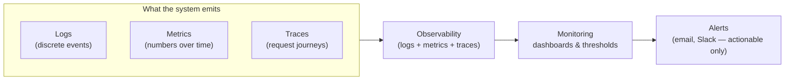

> **What this diagram shows:** How the pieces stack. A running backend emits three kinds of signals — logs (discrete events at levels from debug to fatal), metrics (numeric values measured over time, collected by tools such as Prometheus), and traces (the path of a single request across services, identified by trace IDs). Combined, these three give you observability: the ability to reconstruct and interrogate any state of the system. On top of observability sit monitoring (dashboards via Grafana plus threshold rules) and, from monitoring, alerting (email or Slack notifications) — with the video's caution that alerts should be meaningful and actionable to avoid alert fatigue.

### Why this matters for a backend engineer

You cannot debug what you cannot see. Structured logging, sane monitoring, and alert hygiene are what make production incidents survivable — and they recur throughout the rest of the series (error handling, Elasticsearch for logs, distributed systems).

---

## [25:13] Graceful shutdown

What happens when your server is told to stop? **Graceful shutdown** is the controlled way to do it.

### Why we need it and how it works

A sudden kill (SIGKILL) drops in-flight requests mid-processing and abandons open resources. Graceful shutdown lets the server wind down cleanly. (The transcript spells the signals as "sigor signant and sill" → the actual signals are **SIGTERM**, **SIGINT**, and **SIGKILL** — see below.)

### Use cases

- **Server restarts** — e.g. deploying a new version.
- **Scaling in cloud environments** — instances being scaled in/down.
- **Microservices** — one service stopping without hurting the rest.
- **Long-running jobs** — letting a background job finish at a safe checkpoint.

### How it works: signal handling

- **SIGTERM** — "please shut down" (the normal, graceful request).
- **SIGINT** — Ctrl+C interrupt.
- **SIGKILL** — forced kill; cannot be caught or handled gracefully.

### The steps of a graceful shutdown

1. **Capture a signal** (e.g. SIGTERM).
2. **Stop accepting new requests**.
3. **Complete in-flight requests**.
4. **Close external resources** — database connections, any open files, etc.
5. **Terminate the app**.

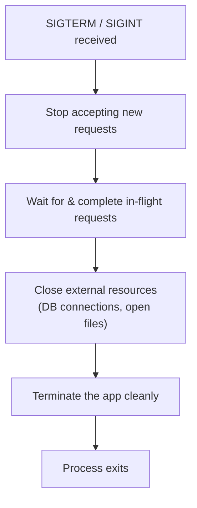

> **What this diagram shows:** The ordered sequence of a graceful shutdown. When the process receives a termination signal (SIGTERM from the orchestrator, or SIGINT from Ctrl+C), it first stops accepting new requests so nothing new enters. It then waits for and completes the requests already in flight. Once the work drains, it closes external resources such as database connections and open files, then finally terminates the application and exits. Notice what a *non*-graceful shutdown skips — a brute-force kill (SIGKILL) jumps straight to termination, abandoning in-flight requests and leaking or corrupting resources.

### Why this matters for a backend engineer

In modern deployments (Kubernetes scaling pods up/down, rolling deploys), your process receives SIGTERM _constantly_. Without graceful shutdown you get dropped requests, interrupted writes, and corrupted state — with it, zero-downtime operations become routine.

---

## [25:50] Security

The security section of the roadmap surveys the attack landscape and the principles for defending against it.

### Attacks to avoid

- **SQL injection** — injecting SQL through inputs.
- **NoSQL injection** — the same idea against NoSQL databases.
- **XSS** (Cross-Site Scripting) — injecting scripts.
- **CSRF** (Cross-Site Request Forgery) — forcing a logged-in user to perform unintended actions.
- **Broken authentication** — flaws in login/session handling.
- **Insecure deserialisation** — trusting serialised data from untrusted sources.

### Principles of secure software design

- **Least privilege** — give every actor only the access it needs.
- **Defense in depth** — layer multiple independent protections.
- **Fail secure** — on failure, default to *closed*, not open.
- **Secure defaults** — safe configuration out of the box.
- **Separation of duties** — no single actor can complete a critical process alone.
- **Security by design** — bake security in from the start, not as an afterthought.

### Practical controls named in the roadmap

- **Importance of input validation and sanitisation** (ties to [08:45]).
- **Rate limits**.
- **Content Security Policy (CSP).**
- **CORS** configuration.
- **SameSite cookies** (transcript "same side cookie").
- **The importance of monitoring security events** (ties to [24:07]).

### Why this matters for a backend engineer

Security is a property of the *whole* system, not a feature. Understanding attack classes and design principles turns security from a checklist into a way of thinking — which is exactly the "first principles" approach of the series. Vulnerabilities like SQL injection and insecure deserialisation crop up repeatedly in later chapters (databases, serialisation, auth).

---

## [26:23] Scaling and performance

This is the topic of making your backend fast and able to grow.

### Performance metrics

- **Response time** — how fast requests are answered.
- **Resource utilization** — CPU, memory, disk, network usage.
- **Identifying bottlenecks** — finding the part of the system that caps everything else.

### Database optimisation (per the roadmap)

- Avoiding the **N+1 query problem** (one query per row instead of one join/batch).
- Ensuring **proper use of joins**.
- Using **lazy loading where appropriate** — loading related data only when actually needed.
- Using **database indexes** to speed up read operations on frequently queried fields — e.g. **indexing foreign keys or search fields**.

### Engineering practices

- **Processing data in batches** to minimise database load and improve performance for large data sets.
- **Avoiding memory leaks** — **closing file handles**, **closing database connections**, or **cleaning up after a long process**.
- **Minimising network overhead** — **reducing payload size** and **using compression**.

### Testing and best practices

- **Performance testing and profiling.**
- **Focusing on clear, maintainable code first, without premature optimization.**
- **Writing modular code** so individual components can be optimised "without affecting the entire system."
- **Graceful degradation** — "if a particular resource that's under load is unavailable, the system degrades gracefully without crashing."
- **Offloading non-critical tasks** — like **sending emails or logging** — to **background processes or task queues** to free resources for more critical operations.

### Why this matters for a backend engineer

Scaling is an end-to-end discipline: write clean code, index and batch at the database, cache aggressively, offload work to queues, and only then profile specific hot paths. The order of priorities the author lists — correctness and maintainability *before* micro-optimisation — is exactly the first-principles battle order.

---

## [27:36] Concurrency and parallelism

Two related but distinct ways to go faster, defined clearly in the roadmap:

- **Concurrency** — dealing with *many tasks at once* (interleaving progress). It shines for **I/O-bound tasks**: while one request waits on the network or a database, the CPU works on another.
- **Parallelism** — *doing multiple things simultaneously*, on multiple cores. It shines for **CPU-bound tasks** like heavy computation.

> Transcript note: "how concurrency helps in I/O bound task and how parallelism helps in CPU bound tasks."

### Why this matters for a backend engineer

Backend workloads are mostly I/O bound (waiting on databases, caches, external APIs), which is why event loops/goroutines/async runtimes are so effective — and why understanding the concurrency/parallelism distinction stops you reaching for threads when you need async, or vice versa. It is also the setup for the real-time systems topic next.

---

## [27:47] Object storage and large files

Not everything belongs in a relational database.

### What will be covered

- **Common use cases of object storage** — like **AWS S3** (the canonical object store): storing images, videos, documents, backups.
- **Managing large files with chunking and streaming** — breaking big uploads/downloads into pieces and moving data incrementally.
- **Multipart file uploads** — the mechanism for uploading large files in parts (recall the multipart mention in the middleware section at [12:03]).

### Why this matters for a backend engineer

Serving and storing large binaries through your app server (instead of object storage) murders bandwidth and memory. Knowing when to hand files to S3 and how to stream/chunk them keeps your API fast and your infrastructure cheap.

---

## [27:59] Real-time backend systems

Some backends must push data to clients the moment it happens, not on request.

### What will be covered

- **WebSockets** — full-duplex, persistent connections where both sides can push at any time.
- **Server-Sent Events (SSE)** — one-way server→client streaming over plain HTTP (transcript "servers and events").
- **Pub/Sub architecture** — publish/subscribe: producers publish events and subscribers receive them, decoupling senders from receivers ("pubs of architecture").

### Why this matters for a backend engineer

Chats, live dashboards, notifications, collaborative editing, and streaming feeds are all built on these primitives. Real-time systems change the mental model from "answer requests" to "maintain long-lived channels," and they come with their own scaling and failure concerns — a dedicated chapter later in the playlist.

---

## [28:06] Testing and code quality

How do you know your backend works — and keeps working? This roadmap section lists the full testing ecosystem.

### Types of testing

- **Unit testing** — individual functions/units in isolation.
- **Integration testing** — units working together (DB, APIs, etc.).
- **End-to-end (E2E) testing** — the full system as a user would experience it.
- **Functional testing** — behaviour against requirements.
- **Regression testing** — ensuring new changes don't break old behaviour.
- **Performance testing.**
- **Load and stress testing** — behaviour under expected and extreme load.
- **User acceptance testing (UAT)** — does it satisfy the end user/business.
- **Security testing.**

### Development process and tooling

- **Test-driven development (TDD)** — write tests first, then make them pass.
- **Automating tests in CI/CD environments** — every push runs the suite.
- **Managing code quality with linting and formatting tools.**

### Measures of code quality and coverage

- **Code coverage** — what percentage of code paths tests exercise.
- **Cyclomatic complexity** — "measures the complexity of a function by counting the number of possible paths through the code."
- **Maintainability index** — "quantifies how easy it is to maintain a code base based on the complexity, lines of code, and other factors."

### Why this matters for a backend engineer

Testing is the safety net that makes every other topic in this roadmap *safe to do*. Refactoring, scaling, and security work all become tractable when a broad, automated test suite backs them. And complexity metrics give you an objective signal for when a function is too tangled to maintain.

---

## [28:50] 12 factor app

The author calls this **a very interesting set of principles**: the **12-Factor App** methodology.

### What will be covered

- The full set of principles for building modern, deployable, portable software-as-a-service applications — such as storing config in the environment, treating processes as stateless, and managing dependencies explicitly.

> [!note] About this entry
> In this roadmap video the 12-Factor App is *announced* (with the "very interesting set of principles" framing) rather than explained item-by-item — the actual walkthrough of all twelve factors gets its own dedicated chapter later in the playlist (indexed as Chapter 27 in the MOC). This mention, placed right before OpenAPI and Webhooks, signals that the series' production-readiness arc is organised around industry-standard methodologies.

### Why this matters for a backend engineer

The 12 factors are the industry's shared answer to "how do we write apps that deploy cleanly, scale, and don't leak surface-specific assumptions?" Concepts it formalises — env-driven config, decoupled services, log streaming, one-codebase-per-app — have appeared throughout this roadmap (config at [23:16], logging at [24:07]) and recur in the DevOps section next.

---

## [28:55] OpenAPI standards

**OpenAPI** is the standard way to describe a REST API in a machine-readable document.

### The need, benefits, and use cases

- **Why the standard exists** and **why we should stick to it** — one reliable source of truth for an API's contract.
- **Benefits** — unambiguous documentation; the document *is* the contract.
- **Use cases** — **documentation automation** and the **ecosystem surrounding it** like **Swagger**, **...** and **Postman**.

### History and versions

- **The Swagger → OpenAPI transition** — Swagger was the original spec name; it became the OpenAPI Specification (OAS) under the OpenAPI Initiative, while *Swagger* now names the tooling (Swagger UI, Swagger Editor) around it.
- **The different versions currently active** — and specifically **the new features of OpenAPI 3.0 and 3.1**.

### Key concepts of an OpenAPI document

- **API paths** (transcript "API pass") — the endpoints.
- **The request and response definitions.**
- **Parameters.**
- **Schemas** — the shape of data exchanged.

### Structure of an OpenAPI document

- **Metadata** (title, version, description).
- **Paths**.
- **Components** — reusable definitions (schemas, parameters, responses).
- **Security definitions** — how the API authenticates.
- **Responses**.

### Tooling and methodology

- **Tools surrounding OpenAPI:** **Swagger UI**, **Postman** (and the wider ecosystem).
- **Best practices:** **avoiding duplication** and **sticking to standards.**
- **API-first development** — "define your OpenAPI spec first, and then you start creating the APIs" — the contract drives the implementation rather than the other way around.

### Why this matters for a backend engineer

OpenAPI turns an API into something *provable and testable*: clients can generate SDKs, docs auto-build, and mock servers can emulate the API before it exists. API-first development is a modern workflow differentiator — and it was already referenced in the REST section at [16:33].

---

## [29:58] Webhooks

A **webhook** is the reverse of an API call: instead of the client asking the server for data, the *server pushes* data to a client's URL when an event happens.

### Use cases

- **Sending notifications**.
- **Third-party integrations** — your system telling another service (or being told by one) about events.

### API vs. webhook for the same use case

- With an **API**, the client may have to use **polling** — repeatedly asking "is there anything new?" — which is **client-side initiated**.
- With a **webhook**, the call is **pushed**: **server-side initiated** the moment the event occurs. The server calls *you*.

### Key components of a webhook

- **Webhook URL** — where the event is delivered.
- **Event triggers** — which events cause a delivery.
- **Payload** — the data sent.
- **HTTP method** — usually POST.
- **Response handling** — what the receiver must return (typically a fast 2xx to acknowledge, ⇢ *inferred from standard practice*).

### Best practices (as listed in the roadmap)

- **Webhook signature verification** — verifying that a delivery genuinely came from the claimed sender.
- **Using HTTPS** — encrypting delivery.
- **Quick response** — the receiver acknowledges fast so senders don't retry needlessly.
- **Retry logic** — what happens when a delivery fails or times out.
- **Logging** — keeping records of deliveries.
- **Testing webhooks with ngrok** — the tool that exposes a local server to the public internet for receiving real webhook test calls (transcript "enro" → **ngrok**).

### Real-world use cases named in the video

- **Stripe payment processing** (transcript "STP" → **Stripe**).
- **GitHub webhooks**.
- **Slack** and **Discord** integrations.
- **Twilio** (transcript "TWU" → **Twilio**).

### Why this matters for a backend engineer

Webhooks are how modern platforms talk to each other asynchronously — payment confirmations from Stripe, code events from GitHub, messages into Slack/Discord. Both *consuming* webhooks securely (verifying signatures) and *providing* them (delivery, retries, logging) are core integration skills, and async patterns here connect to task queues at [20:19].

---

## [30:39] DevOps for backend engineers

The roadmap closes with the DevOps concepts a backend engineer should be familiar with.

### Core concepts

- **Continuous Integration (CI)** — automatically building and testing every change.
- **Continuous Delivery (CD)** — code is always in a deployable state.
- **Continuous Deployment** — deploy every change automatically (the strongest level).
- **Infrastructure as Code (IaC)** — managing infrastructure (servers, networks) through versioned, reviewable code.
- **Config management** — the config discipline from [23:16], now as an operational practice.
- **Version Control** — the foundation everything flows through (e.g. Git).

### Tools

- **Creating containers with Docker** — packaging the app with its dependencies.
- **Orchestrating containers with Kubernetes** — managing many containers across a cluster.
- **CI/CD pipelines** — automating the build → test → deploy journey.

### Scaling and deployment

- **Horizontal scaling vs. vertical scaling:**
  - **Horizontal** — add more instances/machines.
  - **Vertical** — make the existing machine bigger.
- **Deployment strategies:**
  - **Blue-green deployment** (transcript "red green" → **blue-green**): two environments; flip traffic from old to new instantly.
  - **Rolling deployment**: update instances gradually, a few at a time.

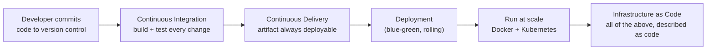

> **What this diagram shows:** The DevOps pipeline a backend engineer works inside. A developer commits to version control. Continuous integration builds the code and runs the test suite on every change. Continuous delivery guarantees the result is always deployable, and deployment applies it to production — via strategies such as blue-green (flip traffic between two identical environments) or rolling (gradual instance-by-instance updates). The running application is packaged in containers (Docker) and orchestrated at scale by Kubernetes. And ideally the whole chain — environments, configs, clusters — is represented as versioned, reviewable code through infrastructure-as-code. This is the delivery layer that productionises everything else the roadmap covered.

### Why this matters for a backend engineer

Modern backend engineers don't just write code — they ship it. Knowing CI/CD, IaC, containers, orchestration, and deployment strategy is what turns your code into a *reliable, scalable, maintainable system* — the exact definition of backend engineering from the very first minute of this video.

> And with that, the roadmap closes the loop: "this is all the concepts that we are going to cover in the next 30 or 40 videos, so stay tuned."

---

## Key Takeaways

- **Backend engineering ≠ CRUD APIs.** The real definition covers **reliable, scalable, fault-tolerant, maintainable** code bases and **efficient** systems ([00:00]).
- **Two learning problems this series fixes:** (1) hundreds of scattered resources with no big picture, and (2) framework-locked thinking (e.g. knowing Rails but unable to transfer knowledge to Go). The cure is **first-principles, language-agnostic understanding of the underlying systems**.
- **The mental model:** a request flows Browser → network/firewalls → remote server (e.g. AWS) → backend logic → response ([02:22]). Almost every later topic is a refinement of one hop in this loop.
- **HTTP** is the contract between client and server: raw messages, headers (request, representation, general, security), methods (GET/POST/PUT/DELETE), CORS/pre-flight, status codes, caching (ETags, max-age), HTTP/1.1 vs 2 vs 3, content negotiation, persistent connections, compression (gzip/deflate/br), and SSL/TLS/HTTPS ([02:51]).
- **Routing** maps method + URL components (path, path params, query params) to server-side logic, with static/dynamic/nested/catch-all/regex route types, versioning, grouping, security, and match performance to consider ([04:25]).
- **Serialisation/deserialisation** translate data for the wire: text formats (JSON/XML) trade speed for readability; binary formats (Protobuf) trade readability for speed. Validate *before* deserialising; watch for dates, time zones, nulls, unknown fields ([05:04]).
- **Authentication** (who you are) vs. **authorisation** (what you may do): stateful/stateless, basic/bearer, sessions/JWT/cookies, OAuth2 + OpenID Connect, API keys, MFA, salting & hashing; RBAC/ABAC/ReBAC; hardening (audit logs, rate limiting, account lockout, generic error messages, timing-attack resistance) ([07:13]).
- **Validation and transformation** is the gateway to business logic: syntactic, semantic, and type checks; client-side validation is UX, **server-side validation is security**. Transform (type-cast), normalise, sanitise, run complex/conditional/chained checks, *fail fast*, and aggregate meaningful errors ([08:45]).
- **Middlewares** wrap the request cycle in a chain (log → authenticate → validate → handle → format errors). Order affects security and performance; keep them lightweight ([12:03]).
- **Request context** is request-scoped state carried through middlewares/controllers/services (method, URL, headers, body, user info, request/trace IDs, custom data). Keep it light, clean it up, and don't over-couple through it ([14:03]).
- **Handlers/controllers/services** implement the MVC split; centralise error handling and keep response formats consistent ([15:28]).
- **CRUD ↔ HTTP:** POST (create, 201/400), GET (read list/single), PUT/PATCH (update), DELETE (delete). Pair with pagination, search, sorting, filtering, strict validation, payload limits, and field redaction ([15:45]).
- **RESTful architecture** = design around resources + stick to HTTP semantics; version via URI/header/query/media-type; design with OpenAPI in mind; support content negotiation, ETags, and meaningful exceptions ([16:33]).
- **Databases:** relational vs non-relational, ACID, CAP, joins, schema design, indexing, query optimisation, connection pooling, constraints, transactions, ORMs (with tradeoffs), migrations ([17:08]).
- **Three-layer architecture:** Presentation layer (validation, routing, middlewares, handlers/controllers) → **Business Logic Layer** (services, domain models, business rules/validation) → **Data Access Layer** (database queries). Apply separation of concerns, single responsibility, open-closed, dependency inversion ([17:44]).
- **Caching** ≠ persistence. Types (memory/browser/database, client vs server), strategies (cache-aside, write-through, write-back, read-through), eviction (LRU/LFU/TTL/FIFO), invalidation (manual/TTL/event-based), levels (L1 in-memory, L2 distributed, hierarchical), query caching in Redis, and cache hit/miss ratios ([18:51]).
- **Transactional emails** have a defined anatomy (subject, preheader, body header, main content, CTA, footer) and are personalised with dynamic parameters ([20:04]).
- **Task queues & scheduling** offload slow work: return instantly, then process in background (emails, image processing, payment/webhook integration, batch jobs like "clear all my data"). Components: producer, queue, consumer, broker, backend. Support dependencies, groups, retries, prioritisation, rate limiting ([20:19]).
- **Elasticsearch** powers search via inverted index, TF-IDF scoring, segments/shards. Use cases: typeahead, log analytics, social search. Optimise with mappings, analyzers, boosting, batching, controlled shards, no wildcard abuse ([21:35]).
- **Error handling:** syntax vs runtime vs logical errors; fail-safe/fail-fast/graceful-degradation/prevention; catch early, don't swallow, custom error types, global handlers, friendly user-facing messages, and monitoring (Sentry, ELK) with email/Slack alerts ([22:33]).
- **Config management** decouples environment settings from code: static (DB creds, endpoints), dynamic (feature flags, rate limits), sensitive (secrets). Sources: `.env`, JSON/YAML, env vars, CLI flags, static files ([23:16]).
- **Logging, monitoring, observability:** logs (system/app/access/security; debug→fatal; structured > unstructured), monitoring (infrastructure/APM/uptime; Prometheus + Grafana; actionable alerts against alert fatigue), and the three pillars **logs + metrics + traces** ([24:07]).
- **Graceful shutdown** = stop accepting → finish in-flight → close resources → exit (SIGTERM/SIGINT, not SIGKILL). Needed for restarts, cloud scaling, microservices, long jobs ([25:13]).
- **Security:** know the attacks (SQL/NoSQL injection, XSS, CSRF, broken authentication, insecure deserialisation) and the principles (least privilege, defense in depth, fail secure, secure defaults, separation of duties, security by design) plus controls (input sanitisation, rate limits, CSP, CORS, SameSite cookies, event monitoring) ([25:50]).
- **Scaling & performance:** response time and resource utilisation; kill N+1 queries, join properly, lazy-load, index foreign keys/search fields; batch processing; avoid leaks (files, connections); compress payloads; performance-test; write clean code first, no premature optimisation; degrade gracefully; offload non-critical work to queues ([26:23]).
- **Concurrency** serves I/O-bound work; **parallelism** serves CPU-bound work ([27:36]).
- **Object storage** (e.g. S3) with chunking/streaming and multipart uploads handles large files ([27:47]).
- **Real-time backends** = WebSockets, Server-Sent Events, and pub/sub ([27:59]).
- **Testing & code quality:** the whole pyramid (unit → integration → E2E; plus functional, regression, performance, load/stress, UAT, security), TDD, CI/CD automation, linting/formatting, cyclomatic complexity, maintainability index, coverage ([28:06]).
- **12-Factor App** — a very interesting (and famous) set of principles to be covered in full later ([28:50]).
- **OpenAPI** standardises API contracts (Swagger → OpenAPI history, 3.0/3.1, paths/components/schemas/security/responses), enables documentation automation and API-first development ([28:55]).
- **Webhooks** are server-pushed events (vs. client-polled APIs): URL, triggers, payload, method, response handling; secure with signatures + HTTPS, quick responses, retries, logging, tested via ngrok. Real-world: Stripe, GitHub, Slack, Discord, Twilio ([29:58]).
- **DevOps for backend engineers:** CI/CD/CD, infrastructure as code, config management, version control, Docker + Kubernetes, horizontal vs vertical scaling, blue-green and rolling deployments ([30:39]).
- The series will cover all of this across **the next 30–40 videos** — this roadmap is the map, not the territory.

---

## Related Notes

- **MOC:** [[_00 - Backend from First Principles - Index]]
- **Previous:** none — this is the first chapter (start from the [[_00 - Backend from First Principles - Index | MOC]])
- **Next:** [[02 - Walk the Path of a True Backend Engineer]]
- **Quick-reference draft notes in the vault:** [[HTTP]], [[Routing]], [[CORS]], [[Preflight request]], [[Understanding of backend systems]], [[3 way handshake]], [[_Roadmap]]

---

> [!note] Source fidelity
> This note is written from the video transcript of ["1. Roadmap for backend from first principles"](https://www.youtube.com/watch?v=0Rwb4Xmlcwc) (video ID: `0Rwb4Xmlcwc`). Auto-captions contained transcription errors that were corrected for sense: "der serialization"/"DC realization" → deserialisation; "jws" → JWT; "oo protocol" → OAuth 2.0; "multiactor" → multi-factor; "aack rback reback" → ABAC and ReBAC; "cash" → cache; "one" (log level) → warn; "sigor signant and sill" → SIGTERM/SIGINT/SIGKILL; "right behind/right back" → write-behind/write-back; "red green" → blue-green; "enro" → ngrok; "STP" → Stripe; "TWU" → Twilio; "API pass" → API paths; "business tools" → business rules; "servers and events" → server-sent events; "pubs of architecture" → pub/sub; "X content type" → X-Content-Type-Options. Lines marked ⇢ *inferred* are editorial clarifications where the caption was genuinely ambiguous. Metadata (duration, views, publish date) sourced from the video's summary file (`01_summary.txt`): 1,884 seconds (31 min 24 sec), 692,142 views, published 2024-09-23, uploader Sriniously.