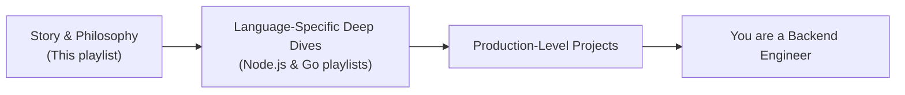

# Part 02 — Walk the Path of a True Backend Engineer

> [!info] Video Reference
> **Watch:** [Walk the path of a true backend engineer](https://www.youtube.com/watch?v=3qFjZbFRSAU)
> **Duration:** 3 min 53 sec · **Views:** 156,514 · **Published:** 2024-09-23 · **Uploader:** Sriniously

> [!abstract] In this Chapter
> This is the "vision statement" video for the entire *Backend from First Principles* series. Before diving into any technical content, the author lays out what the playlist is about, what he expects from you as a learner, and what the end result of this journey looks like: the ability to design, build, and maintain production-grade backend systems from scratch — with language-agnostic understanding that goes far beyond any single framework.

---

## Video Timeline

| Timestamp | Section |
|-----------|---------|
| 0:00 | Intro |
| 0:11 | Expectations |
| 0:45 | Story Philosophy |
| 1:30 | Implementation |
| 2:50 | Production |

---

## [00:00] Intro

The video opens by setting the stage: before getting to the "meat" of the series, the author wants you to know **exactly what to expect** from these videos and how to learn from them. This isn't a tutorial you passively watch — it's a structured path with a clear destination.

---

## [00:11] Expectations

The author states his goal clearly: in this playlist he wants to tell **the story of backend engineering** — the philosophies behind it, the big questions, and the inner workings and collaborations between different components and machines.

### Why this matters

Most backend tutorials jump straight into frameworks. The author argues that the narration in this series will help you:

- **See the big picture** of a production-grade backend.
- **Appreciate the concepts** that are abstracted away by the languages, runtimes, frameworks, and libraries you use every day.

### Language-agnostic skills

This playlist is explicitly about **the story and philosophy** of backend engineering — the first step toward becoming a backend engineer with **language-agnostic skills**. These are skills that go beyond frameworks or any particular library you work with daily.

> [!tip] Key principle
> Once you have the foundations clear — once you start to see the **common patterns** behind every backend application and understand how the dots connect — *that* is the best time to talk about implementations.

---

## [00:45] Story Philosophy

The author's teaching philosophy rests on three pillars:

### 1. First-principles thinking

Instead of memorizing framework-specific patterns, you learn *why* things are built the way they are. When you understand the underlying principles, you can work in **any** ecosystem because the patterns are universal.

### 2. Story-based narration

Concepts are taught as a coherent story — each topic builds on the previous one, with no skipped steps. The author compares it to a narrative: you follow the journey from "what is a backend?" all the way to "here is a production system."

### 3. No skipped steps

Every concept is explained from the ground up. If you've ever felt lost because a tutorial assumed knowledge you didn't have, this series is designed to eliminate that gap. ⇢ *inferred*: this is why the series starts with conceptual videos like [[01 - Roadmap for Backend from First Principles]] and [[03 - What is a Backend, How Do They Work and Why Do We Need Them]] before any code.

---

## [01:30] Implementation

Once the philosophy and story are established, the series moves to **implementation** — seeing how all those principles come together to create a complete backend application in actual code.

### The roadmap at a glance

The journey from learner to production engineer follows a clear three-phase structure:

> What this diagram shows: The learning path has three sequential phases. First, you internalise the **story and philosophy** — the universal principles of backend engineering (this playlist). Second, you pick a language ecosystem (Node.js or Go) and dive deep into implementation details like databases, drivers, and migrations. Third, you combine everything into **production-level projects** from end to end. By the end you can confidently call yourself a backend engineer.

### Choosing the language ecosystem

At the implementation stage the author plans to release **two parallel versions**:

| Version | Language | Driver example (PostgreSQL) |
|---------|----------|-----------------------------|
| 1 | **Node.js** | `postgres.js` |
| 2 | **Go (Golang)** | `pgx` |

He chose these because they are the two languages he has **firsthand, daily professional experience** in.

### Deep dives per principle

Each concept playlist video will have an associated **implementation-specific** video in the next playlist. For example:

- **Concept:** Databases, drivers, and migrations — the concepts backend engineers deal with day to day.
- **Implementation:** A deep dive on PostgreSQL using the JavaScript driver (`postgres.js`) or the Go driver (`pgx`), covering every single concept around that topic.

---

## [02:50] Production

The third and final phase is where **everything comes together**: all the concepts, all the language-specific deep dives, all the philosophies — distilled into **production-grade projects** built from end to end with industry standards and best practices.

### What "production-grade" means here

The author defines a production-grade system by two qualities:

1. **Scalability** — systems that start from zero users and scale to a million users.
2. **Maintainability** — systems that people can maintain over a long period of time.

You will build **quite a few** of these projects, which you can follow along with if you want.

### The promise

> [!quote]
> By the end of this journey — if you decide to take it, and if you internalised everything and followed along with all the projects — you should be safely able to call yourself a backend engineer, and you should be able to go out there and build real systems.

---

## Key Takeaways

- This playlist teaches the **story and philosophy** of backend engineering — language-agnostic foundations that apply everywhere.
- The author's philosophy: learn from first principles, through a narrative, with **no skipped steps**.
- After the philosophy playlist, you move to **language-specific implementations** (Node.js and Go).
- The end goal is building **production-grade, scalable, maintainable systems** from scratch.
- Frameworks, runtimes, and libraries are abstractions on top of universal principles — this series teaches you what's underneath.
- By the end, you should be able to confidently call yourself a backend engineer and build real, scalable systems.

---

## Related Notes

- **MOC:** [[_00 - Backend from First Principles - Index]]
- **Previous:** [[01 - Roadmap for Backend from First Principles]]
- **Next:** [[03 - What is a Backend, How Do They Work and Why Do We Need Them]]

---

> [!note] Source Fidelity
> All content above is derived from the video transcript of ["Walk the path of a true backend engineer"](https://www.youtube.com/watch?v=3qFjZbFRSAU) (video ID: `3qFjZbFRSAU`). Transcript lines marked ⇢ *inferred* are editorial clarifications where the caption transcription was ambiguous or contained errors (e.g. "impation" corrected to "implementation", "goang" corrected to "Golang", "goine" corrected to "Golang", "postgress" corrected to "PostgreSQL", "postgress js" corrected to "postgres.js"). Metadata (duration, views, publish date) sourced from the video's summary file.
