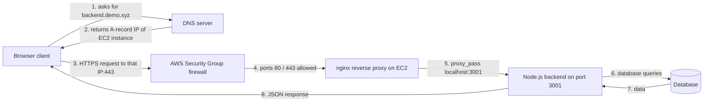
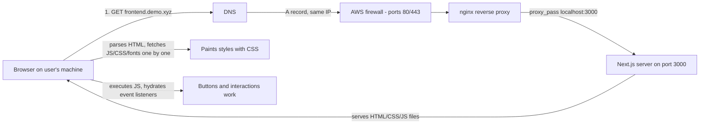
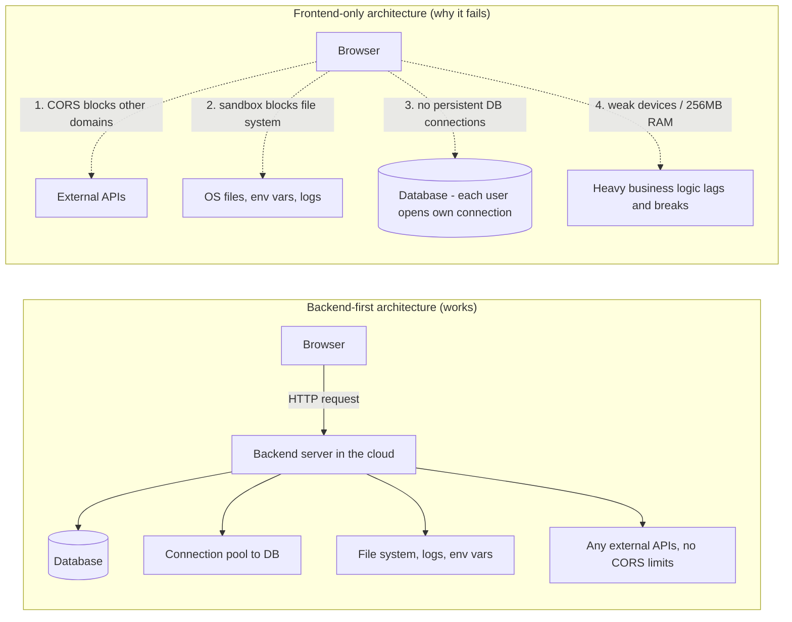

# Part 03 — What is a Backend, How Do They Work and Why Do We Need Them?

> [!info] Video reference
> - **Part 03 of 29** in the playlist [[_00 - Backend from First Principles - Index]]
> - **Watch on YouTube:** [3. What is a Backend, how do they work and why do we need them?](https://www.youtube.com/watch?v=6Ss4dJD9Kzg)
> - **Duration:** 19:01 | **Views:** 202,097 | **Likes:** 4,732 | **Published:** 2024-09-24
> - **Speaker/Channel:** Sriniously
> - **Description (head):** "In this video I want to show a very high level overview of whats, hows and whys of backend systems."

> [!abstract] In this chapter
> This chapter is the "big picture" episode of the course. It gives the traditional definition of a backend, traces a real request all the way from a browser to a server running in AWS (through DNS, a firewall, a reverse proxy and a port-forwarded application), explains *why* we need backends at all (they collapse to one word: **data**), walks through how a frontend loads in the browser, and then answers the question every beginner asks: **why can't we just write all the backend logic in the frontend?** The answer runs through sandboxing, CORS, database connections and compute power — and sets up the entire rest of the series.

---

## Video timeline

| Timestamp | Section |
|-----------|---------|
| 0:00   | What is a backend? |
| 0:56   | How backends work? |
| 7:30   | Why do we need backends? |
| 10:20  | How frontends work? |
| 12:40  | Why can't we write backend logic in frontends? |

---

## [00:00] What is a backend?

Let's start by picturing a backend **in its traditional definition**: a backend is a *computer* which is **listening for incoming requests** — HTTP, WebSocket, gRPC, or any other kind of request — **through an open port** accessible over the Internet.

A few terms need defining before that sentence makes sense:

- **Port** — a numbered "door" on a computer through which network traffic enters or leaves. The video mentions ports like **80** (the default for plain HTTP) and **443** (the default for HTTPS — the encrypted version of HTTP). The caption reads *"whether it is 0 or 443"* — that "0" is ⇢ *inferred* to be **80**, since these two ports are the ones a web server exposes. *We'll cover ports and the TCP/IP stack in depth in later chapters.*
- **HTTP / HTTPS** — the protocol browsers and servers use to talk to each other over the web. See the vault notes [[HTTP]] and [[3 way handshake]].
- **WebSocket** — a protocol that keeps a long-lived, two-way connection open between client and server (covered properly later in *[[25 - Real-Time Backends]]*).
- **gRPC** — a high-performance remote-procedure-call framework, an alternative to HTTP for server-to-server communication.
- **Client / frontend** — any program on the other end of the Internet that connects to the server to send or receive data — a browser, a mobile app, or even another server.

The port must be accessible *over the Internet*, so that **clients (or other frontends) can connect to it, send data to it, or receive data from it**, depending on the kind of request.

Why do we call it a **server**? Because it *serves* something. It **provides content**: static files such as **images, JavaScript files, HTML files**, or **JSON** data. It *also accepts data* if the client sends something back. That, says the video, is a "fair definition" of what a backend is and how it works.

But for this course, the presenter wants us to reach a **holistic view** — to actually see the components *physically*, and understand how they work **behind the scenes**. So the rest of the chapter walks the whole flow of a real request, end to end.

---

## [00:56] How backends work

### The demo setup

The presenter has a **backend server deployed in AWS** (Amazon Web Services). We'll use that as the running example. The backend serves some **sample data** — in the demo, a list of `users`.

To watch this traffic, we open the browser's **network toolbar** (developer tools → Network tab) and refresh the page again. For a clean result, **disable the cache** so that every request is really sent to the server and we get the *appropriate status code* rather than a cached copy. We see the request start from the browser, reach the server, and the response come back. (The fine details of *request* and *response* messages are saved for a later video — this one is about the *journey*.)

### Step 1 — The domain name

The request starts at a **domain name**. In the intro, the transcript reads *"the domain name Senus doxyz"* — the auto-captions garble the presenter's domain name, which is one of several subdomains under his own domain; ⇢ *inferred* as something like `backend.demo.<his-domain>`. We focus on the *concepts*.

A **domain name** is the human-friendly address (`backend.demo.xyz`) that a browser understands, but the Internet itself doesn't — the Internet addresses computers by **IP address** (a numeric address like `203.0.113.7`). The bridge between the two is **DNS**.

### Step 2 — DNS: turning names into addresses

The first thing the browser does is consult a **DNS server** (Domain Name System). This is like the Internet's phonebook: it answers "which IP address belongs to this domain name?"

The video shows the presenter's DNS settings, where **different types of DNS records** are defined. DNS is a huge topic on its own, but we only need the basics:

- **A record** — points a domain/subdomain to a *particular IP address*.
- **CNAME record** — points a domain/subdomain to *another domain name or subdomain* (an alias, rather than an IP directly).

In the demo there are **two A records**; one of them is `backend.demo`, which points to a specific IP address. Where does that IP come from?

### Step 3 — The server: an EC2 instance

That specific IP address belongs to an **EC2 instance** in AWS. In the AWS Console → EC2 → **Instances**, we find the deployed instance. Its **public IP address** matches exactly the IP we saw in the DNS config. So the subdomain `backend.demo` → that IP → that EC2 instance. The request reaches the instance **through this IP**.

### Step 4 — The firewall (AWS Security Group)

Before the request can enter the computer itself, it must pass through a **firewall** — here, the **AWS-native firewall** in the form of a **Security Group** assigned to the instance. A security group lets us specify:

- which **ports** we want to allow,
- which ports should be **accessible over the internet**.

In the demo, **three kinds of ports are allowed**. One is used to **log into the AWS instance via a terminal/command line** to perform operations — this is SSH, ⇢ *inferred* as **port 22**. The other two are the web ports:

- **80** — to allow **HTTP** traffic
- **443** — to allow **HTTPS** traffic

This is critical: if we *don't* allow ports 80/443, **AWS blocks the request right there at the firewall** and it never reaches the server. So the firewall is an important hop in the journey.

### Step 5 — Reverse proxy (nginx) and the web server

Once the request lands inside the EC2 instance, it meets a **reverse proxy** — the instance runs **nginx** (captioned *"enginex" / "engx"*).

> **Reverse proxy**: a server that **sits in front of other servers**, so that we can manage **different types of redirects or configs from a centralized space**, instead of changing the config on every single server.

We're also using **certbot** (captioned *"sbot"*) to assign **SSL certificates** automatically, so that HTTPS works. That's not central to this demo. The parts to focus on in the nginx config are:

1. It is **listening on port 80** in the AWS instance, and **redirecting that traffic to port 443** — i.e., any plain-HTTP request is pushed to the HTTPS endpoint.
2. The block defines the **domain name with `server_name`** — this subdomain (`backend.demo`). Whatever request comes to this domain (already routed there by DNS), nginx handles.
3. Requests to this domain are **redirected to `localhost:3001`** — the port **our Node.js server** is running on. `localhost` (a.k.a. `127.0.0.1`) is the machine talking to itself, i.e., the EC2 instance's own loopback address.

### Step 6 — The application process (pm2 + Node.js)

We take a look at running processes with **`pm2 list`** (PM2 is a **process manager** — it keeps our apps running, restarts them on crash, and shows their status). We see **two processes running**: one for the **frontend**, one for the **backend**, and the backend one is a **Node.js server**. This Node process on `localhost:3001` is the **final hop** of the request.

We can verify it from the instance itself: `curl localhost:3001/users` returns **the same response** we get from the browser.

**Key insight about the topology:** from the point of view of the EC2 instance, the Node server is running on **`localhost`**. We use **nginx + domain names to route requests from the Internet down to our local server**. The server itself doesn't need a public address — nginx is the public face, and the app listens privately on the loopback interface.

> **What this diagram shows:** The browser gives a human-readable domain to a DNS server and gets back the numeric IP of the EC2 instance. Following that IP, the HTTPS request passes the AWS security-group firewall (which only lets ports 80 and 443 through), arrives at nginx, gets forwarded to the private `localhost:3001` where the Node.js process listens, and that process can read/write a database and return the JSON response back up the chain to the browser.

### Step 7 — Same response, local development included

The presenter summarises the whole trip:

> Request starts in the **browser** → goes to the **DNS server** → then to the **AWS servers** → through a **firewall** → reaches the **AWS instance** → the request reaches **nginx** → finally forwarded to **localhost:3001** (our final server).

The request travels through all these hops until it finally reaches the application. And on your own machine during development, the same story is much shorter: open the browser, go to `localhost:3000/users`, and you'll see **the same response** the deployed AWS server returns. The only difference in development is that most of the hops (DNS, firewall, nginx) collapse away because you are the machine.

Now we have "a fair idea of how a request looks and travels over the internet and reaches the server." But *why* do we need these backends in the first place?

## [07:30] Why do we need backends?

### The Instagram "like" example

To make it concrete, the presenter gives an example everyone has lived: **scrolling through your Instagram feed**. You come across a friend's post, you tap the **like button** — and on the other side, **your friend gets a notification** that you liked their post.

Between your finger pressing the button and your friend receiving the notification, what actually happened?

That is exactly where the **concept of the backend** comes into play:

1. You click the like button.
2. **The app sends a request to the server.**
3. **The server parses the request** and works out **who the user is** — it finds your name/ID.
4. It **persists (saves) the action** — "user X liked post Y" — somewhere. Usually that "somewhere" is **a database**.
5. It then **checks which user's post you liked** — finds that user's ID.
6. It **triggers an action** that **sends a notification** to that user.
7. Your friend gets a notification **on their phone**.

> **What this diagram shows:** One tap on a like button is behind the scenes a small choreography performed by a central server: identify the actor, persist the fact ("this like happened") in a database, look up the other party, and fire off a notification. None of this is possible between two phones directly — it needs a shared, trusted middleman who owns the data.

### All those interactions need a centralized computer

Every one of the interactions between your click and your friend's notification **has to happen on some kind of server** — a **centralized computer that has all kinds of information about all the users**.

Think about it: your app is designed and **customized according to your needs** — your profile, the people you follow, the actions you can perform on your account. Likewise, your friend only ever receives the notifications that are **intended for them**. But the *server* has to hold **all the information, of all kinds, about all kinds of state**, for *everybody*. That's why it must be **centralized**: one authoritative place where the state of the whole system lives.

### The one-word answer: data

If you try to condense the responsibility and use of a backend down to **a single word**, it is this:

> **Data.**

- the need to **fetch data**,
- the need to **receive data**,
- the need to **persist data** somewhere,
- and **every kind of action that deals with data**.

Anything involving data in a meaningful, shared, durable way is backend territory.

### The question that leads to the rest of the video

And now the presenter raises the obvious objection: **"why not just do everything on the frontend?"**

After all, a frontend is *also* a computer (or a device, depending on what you're using — a phone, a laptop, a desktop). So:

- Why not connect **directly to the database** from there?
- Why not perform **every kind of action that servers do** right on the client?
- Since everything is **distributed everywhere**, wouldn't we get **better performance** — technically speaking?

The presenter agrees it's an *excellent* question. To answer it — why we can't move all backend functionality into the frontend — we first have to see **how frontends actually work behind the scenes**.

## [10:20] How frontends work

### Same deployment, different application

To compare fairly, the presenter demos a frontend end to end. It's a **Next.js application** (a JavaScript/React-based framework) **deployed in the same AWS EC2 instance**. Again we open the **network toolbar** and hit refresh.

### What the browser actually does

Looking at the network records:

1. **The first thing the browser fetches is the first document — an HTML file.** It calls the domain name and, looking at the response, it is HTML.
2. After the primary HTML file arrives, the browser fetches **all the resources the HTML references** — **JavaScript files, images, fonts, CSS files** — and each one comes down as a **separate request**.

### DNS, firewall, nginx — same story, different port

In the DNS records we have an entry for a subdomain (⇢ *inferred* to be `frontend.demo.<his-domain>`), pointing to **the same public IP** as the backend — it's the **same EC2 instance**. As usual, **ports 443 and 80** must be allowed through the **security group** for HTTPS/HTTP traffic.

The nginx config is mostly identical to the backend's — same SSL/certbot handling — but with two differences:

- it is **listening for a different domain** (`frontend.demo`), and
- whatever traffic arrives, it **redirects to `localhost:3000`** — not `3001` — where the **Next.js frontend server** is running.

That frontend server **serves the files**: the JS, CSS, and HTML files are **sent over the network to the browser**.

### Painting and hydrating

Once the browser has the main HTML file, it does the following:

- It **goes through all the resources** — the JavaScript files, the CSS files, the fonts — and **fetches them one by one**.
- Once all the **CSS** is fetched, the browser **paints the window**: that's how we get all the styles — the black background, the fonts, the button styling.
- Once all the **JavaScript** files are fetched, the browser **hydrates all the event listeners** — for buttons and any other kind of interaction. That is why the button works and, for example, redirects you to another page: the browser fetched the JS, attached the event listeners, and only then did the button start working.

> **What this diagram shows:** A frontend request rides the *same* DNS → firewall → nginx path, but instead of landing on a data-serving Node process it lands on a Next.js server that *ships files*: an HTML document plus its CSS and JavaScript. The heavy lifting of running that code happens in the browser — it paints the page from the CSS and executes the JavaScript to attach the interactivity. The server sends *code*; the browser runs it.

### The key difference between frontend and backend

> Whatever frontend logic you have written — whatever JavaScript — is **fetched by the browser from our server and executed by the browser in our machine** — in the **client's machines**.

The **browser is the runtime** for frontend code. Compare that with the backend we saw earlier (the Node server in the EC2 instance):

- **Backend:** we send a request → the *server* processes it → the server sends us the *result*. The actual processing happened **on the server**.
- **Frontend:** a server sends us the *code*, but the **browser runs** that code. Whatever logic is run, **it is run by the browser**.

That is the key distinction of the whole chapter: in the backend the *result* moves across the network; in the frontend the *code* moves across the network and executes in the client's runtime. And that fact explains everything about why backend logic can't live in the frontend — which is the next (and final) question.

## [12:40] Why can't we write backend logic in frontends?

Since the browser is a real runtime too, why not write the backend logic there? The presenter lists a **couple of issues** that we find in browser runtimes — starting with what a browser runtime actually is.

### Browser runtimes are sandboxed environments

**Browser runtimes are often sandbox environments** — isolated from our operating system. The OS processes, the **file system** — everything is an **isolated environment**. Practically, this means the code can only access a **limited amount of resources**:

- the **DOM** — the Document Object Model, the in-memory tree of the page,
- **browser APIs** — such as **`localStorage`** and **cookies**,
- **external APIs** — *but only if* the external API sends back all the **required headers**.

### CORS — the browser's security policy

Those "required headers" relate to **CORS** (Cross-Origin Resource Sharing). We haven't covered headers yet in the course — that's a future video in much more depth — but you can *imagine CORS as a policy, a security policy of browsers*:

> CORS **restricts JavaScript code from calling external APIs** — APIs that are **not on the same domain as the current one**.

Concretely: our frontend app lives on `frontend.demo.<domain>` (caption read *"frontend demo doxyz"*, ⇢ *inferred*). So the page **can fetch resources / call external APIs only if they are in the same domain**. If we try to **call a different domain**, the **browser blocks the request because of the CORS policy**. There are ways to get around that — via **HTTP headers** — which the course explores later. See the vault notes [[CORS]] and [[HTTP]] for reference.

### Why the sandboxing makes sense

All this sandboxing and security restriction is not paranoid — it makes complete sense. Think about what a browser is really doing:

> It is **fetching code from a remote server and executing it in the user's browser**.

If it isn't careful enough (isolated enough), the remote code could easily **access data or files from the user's computer** — which is a bad thing. Imagine: you open a website whose code you know nothing about. If browsers didn't isolate environments, that code could:

- **access your file system**,
- **copy all your files and sensitive details**,
- **send them to its servers**.

That's a very scary idea — and the precise reason browsers ship all these **security policies**.

> [!tip] Why this matters for your mental model
> A browser is a hostile-environment host: it runs code it downloaded from strangers, on behalf of a user who never reviewed it. Every capability the browser grants — and every capability it *withholds* — is a security decision. The file system, the OS processes, and unrestricted network access are deliberately off-limits. That single fact is why backend work can never fully move to the frontend.

### Reason 1 — Security

The first reason we can't write backend logic in the frontend is **security**, obviously:

- The **security policies of browsers are so restrictive**, and
- **a backend often needs to access the underlying file system** — whether to **write to a log file** or **access environment variables** (e.g., configuration, secrets).

Browsers won't allow that. For a backend server that is a huge restriction.

### Reason 2 — You can't freely call external APIs

- From the browser you **cannot call external APIs whenever you want** — *unless* that API sends back all the appropriate **CORS headers**.
- And **we don't control all external APIs**, so we can't guarantee those headers exist. That's a big deal breaker.
- Backend servers often need to **connect to other servers and fetch data from multiple places**. The CORS restriction makes that plan impossible in the browser — another reason backends need a non-browser runtime.

### Reason 3 — Databases

- The **server runtime has access to all native database drivers** — for example **`pg`** (the driver for **PostgreSQL**) and the official **MongoDB** driver. (The caption reads *"PG for postgis"* — ⇢ *inferred* to be **Postgres**.)
- These drivers are written to work in environments that can **handle socket connections, handle binary data, and maintain persistent connections** — **things browsers cannot do**.
- We'll explore exactly how backend servers talk to databases in later chapters, but the key idea to understand now is **connection pooling**: backend servers maintain a **list of connections** — a **connection pool** — to the database server.
- Why a pool? Because **backend servers receive thousands and thousands of requests per second**. If every request created and destroyed its own database connection, **the database server would get overwhelmed** — it can't handle that load. So drivers are written to hold a pool of reusable connections.
- **Browsers are not designed to maintain persistent connections to databases.** Even if they were, **each user would open their own direct connection to the database**, overwhelming the database server with too many open connections. There is also **no easy way to manage connection pooling or efficient query execution from the browser environment**.

### Reason 4 — Computing power

- **Frontend applications are everywhere**: a smartphone, a desktop, a laptop — any environment you can imagine. It could be a device with **256 MB of RAM and a single-core processor**.
- Such a user **might not have enough computing power to perform heavy business logic** — things would **start to lag, and sometimes break**, because of the load.
- In contrast, a **centralized backend server that serves a large number of clients** can have its **memory and CPU increased easily whenever we want** — so we can **deal with the load** head-on.

### Conclusion

We could continue this list as long as we like, but this is enough for a fair idea:

> Keeping backend logic in the frontend is **not a good idea** — that's *assuming* we could even do it in the first place.

> **What this diagram shows:** On the left, the backend-first architecture centralises the heavy work: one server (or fleet) holds the database connection pool, touches the file system and secrets safely, and talks to any external API without CORS because it is not a browser. On the right, pushing every job into the frontend hits four walls: CORS blocks foreign domains, the sandbox denies OS/file access, browsers can't hold persistent database connections (and millions of direct connections would crush the database), and weak client devices simply don't have the compute for heavy logic.

### Where this leaves us

We have now seen **what a backend is, why we need it, and how it works at a very high level**. According to the presenter this is a *very good place to be* before starting the journey of learning backend engineering — because we finally know *what we are learning and why*. The next videos explore **what those first-principles are, and why we should learn backend engineering in this particular order and way**.

---

## Key Takeaways

- A **backend** is a computer listening for requests (HTTP/WebSocket/gRPC) on an open, internet-accessible port that *serves* content (static files or JSON) and accepts data from clients.
- A request travels through many hops: **browser → DNS → server IP → firewall (security group) → reverse proxy (nginx) → application server on a private `localhost` port → database**, and the response travels back the same way.
- **DNS** maps names to addresses: **A records** point to an IP; **CNAME records** point to another domain or subdomain. Ports **80 (HTTP)** and **443 (HTTPS)** are the ones publicly opened; port **22 (SSH)** is used to administer the instance.
- A **reverse proxy (nginx)** sits in front of other servers to centralise redirects/config per domain; here nginx listens on 80/443, terminates SSL (via certbot), and forwards to the app on `localhost:3001` (backend) or `localhost:3000` (frontend). **PM2** manages the processes.
- The entire purpose of a backend collapses to one word: **data** — fetching it, receiving it, persisting it, and every action that deals with it. This is why backends must be **centralized** (the Instagram "like → notification" flow cannot work between two devices directly).
- **Frontends work the opposite way to backends:** the server sends *code* (HTML/CSS/JS) and the **browser executes** it on the client machine — the browser is the runtime. CSS files paint the page; JS files hydrate event listeners once fetched.
- Backend logic **cannot** live in the frontend because of:
  1. **Security/sandboxing** — browsers are isolated from the OS/file system; backends need file access (logs, env vars).
  2. **CORS** — browsers block calls to other domains unless the target sends the right headers; backends must talk to many external APIs.
  3. **Databases** — only server runtimes have native drivers with sockets, binary data and **persistent connections / connection pools**; browsers can't, and per-user direct connections would overwhelm the DB.
  4. **Computing power** — client devices can be as weak as 256 MB RAM / single-core; a centralized server can be scaled up (CPU/RAM) on demand.

---

## Related Notes

- **Course:** [[_00 - Backend from First Principles - Index]]
- **Previous:** [[02 - Walk the Path of a True Backend Engineer]]
- **Next:** [[04 - Benefits of Learning Backend Engineering from First Principles]]
- **Vault reference notes:** [[Understanding of backend systems]] · [[HTTP]] · [[CORS]] · [[3 way handshake]] · [[Routing]]

---

> [!note] Source fidelity
> This note is written from the full timestamped transcript of the video (https://www.youtube.com/watch?v=6Ss4dJD9Kzg). Where the auto-generated captions were unclear — such as the presenter's exact domain name, the "0 or 443" port caption, and "PG for postgis" — the meaning was inferred and marked with ⇢ *inferred*.