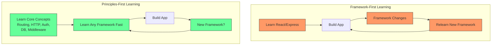

# Part 04 — Benefits of Learning Backend Engineering from First Principles

> [!info] Video Reference
> **Series:** [Backend from First Principles](https://www.youtube.com/watch?v=6fqZs5Z3k9A) — Episode 4 of 29
> **Channel:** Sriniously · **Published:** 2024-09-25 · **Duration:** ~10 min
> **Views:** 103,330 · **Likes:** 3,415

> [!abstract] In This Chapter
> This chapter argues that learning backend engineering from first principles — understanding the foundational building blocks that underpin every backend system — is a "fool-proof strategy" that pays dividends throughout your career. Through several realistic scenarios, Sriniously demonstrates how first-principles knowledge gives you the ability to see the big picture in unfamiliar codebases, onboard into new languages and frameworks in days instead of weeks, avoid the burnout cycle of syntax fatigue, choose the right tool for the job rather than defaulting to your current stack, and ultimately become a more versatile and employable software engineer — not merely a framework-specific developer.

---

## The Problem: Scenarios Where Framework Knowledge Falls Short

### [00:00] Scenario 1 — A Front-End Developer in a Backend Codebase

Imagine you are a newly joined software engineer — perhaps a front-end developer by trade — and you have been asked to fix a bug in the backend codebase. Immediately, several challenges surface:

- The backend may be written in a language you are unfamiliar with.
- Even if the language is one you know, the bigger question is: *where do you even start?*
- Where do you look for the issue without getting lost in the complexity of the code?

If your only knowledge is tied to a specific framework — say you know React or Next.js inside out — that knowledge does not help you navigate a Go or Rust backend. You are lost.

### [00:09] Scenario 2 — Building an API from Scratch

Now imagine a different situation: you have been tasked to create an API from scratch. How do you form the mental map of the codebase? How do you stick to established standards and ensure you are not breaking anything? Without first-principles understanding, you would rely heavily on boilerplate tutorials and copy-paste patterns, never truly understanding *why* the code is structured the way it is.

### [00:32] Scenario 3 — Switching Languages as a Backend Engineer

A third scenario: you are a backend engineer working in TypeScript or Go, and you are suddenly asked to jump into a different language — say Rust or Python. How do you get up to speed quickly without wasting hours looking through docs of different libraries? Maybe FastAPI or Pydantic for Python, Axum for Rust, or an ORM like SQL Alchemy or Diesel.

The question becomes: *how do you apply your existing knowledge in a new environment without reinventing the wheel?*

### [01:05] The Answer: First Principles

This is where learning backend from first principles becomes invaluable. The ability to break down complex systems into their most basic and universal components gives you a **massive edge** — regardless of the specific language, framework, or tool in use.

---

## Benefit 1 — Seeing the Big Picture

### [01:19] Decomposing Unfamiliar Systems

When you enter an existing codebase, instead of being overwhelmed by its structure or the complexity of its engineering, you can mentally separate out the different parts of the system and work on them in an isolated way. First-principles knowledge lets you identify:

- **The core logic** — the business rules and domain-specific computations.
- **The routing layers** — how HTTP requests are mapped to handler functions.
- **The database connections** — how data is persisted, queried, and transformed.
- **The over-engineered pieces** — code that adds complexity without proportional value.

By filtering out these layers of noise, you can start making changes or fixing bugs with confidence.

### [01:52] Pattern Recognition: What Senior Engineers Do

This is something you might have noticed in senior engineers, CTOs, or engineering leaders (CTOs or "cosos" ⇢ *inferred: likely "eng leaders" or "CTOs"*) — they can look at any code or any particular codebase and quickly get a fair idea of what is going on or where the bug could be. A human brain is very good at picking up patterns, and senior engineers subconsciously pick up these architectural patterns. They do not have to use this skill deliberately — it comes from years of exposure.

### [02:14] Why Wait? Deliberate Practice from Day One

The speaker's key question is: **why wait for years of experience?** You can deliberately practice this skill from day one and get good at it in, say, six months to one year. By consciously studying how backend systems are structured — by learning the universal patterns of routing, middleware, authentication, data persistence — you can compress a decade of pattern recognition into months of focused study.

---

## Benefit 2 — Faster Onboarding

### [02:24] Core Concepts Beat Library-Specific Docs

When you understand the first principles behind backend engineering — how HTTP works, how databases interact with APIs, how requests flow through middleware — you can dive into *any* language or framework and find your way around it. You no longer need to spend hours going over library-specific docs.

Once you have learned the core concepts behind:

- **Authentication** — how identity is verified and sessions are managed
- **Routing** — how URLs map to handler functions
- **Middleware** — how requests are intercepted and transformed
- **Database interaction** — how data is queried, stored, and migrated

…the syntax becomes secondary. You focus on the **logic** instead of the **syntax**, which allows you to develop a deep sense of familiarity with a codebase much faster than if you are focused solely on syntax or language-specific features.

---

## Benefit 3 — 10× Faster in New Projects

### [03:08] From Understanding to Production Speed

When you start a new project from scratch, having backend knowledge grounded in first principles helps you move with incredible speed and precision. You will be able to create MVPs with production-quality code far faster because you will be working from a deep understanding of the system's needs — not just following boilerplate tutorials.

### [03:25] Knowing What to Build

First-principles knowledge means you already know how to:

- Structure your routes effectively
- Set up database connections properly
- Implement critical functionalities like caching, error handling, and logging

You do these things without constantly referencing documentation. The patterns are internalized.

### [03:44] Case Study: Building a Rust Backend from Node.js

The speaker gives a concrete example: suppose you work as a Node.js developer and you want to transition into a Rust backend engineer. The typical approach would be to look for a complete end-to-end project tutorial — at least four or five hours long — that covers building a backend in Rust with production-quality standards.

The problem is that Rust is a relatively new language in the backend space, and the amount of project-based resources available for Rust is far less than what exists for Node.js. You might find yourself constantly worrying: *I'm not finding any projects, I'm not finding any good resources.* You are good at basic syntax — handling data structures in Rust, writing basic programs — but how do you cross that threshold and actually build an end-to-end production-quality project?

### [05:16] The Principles-Based Approach

This is where the principles come in. Imagine you already understand the different layers of the backend as concepts:

1. **Routing** — URL mapping and handler registration
2. **Middleware** — request interception and transformation
3. **Database interactions** — ORM patterns and query building
4. **Logging** — structured output and observability
5. **Error handling** — graceful failure and recovery
6. **Async code** — concurrency and non-blocking I/O

You understand all these components clearly as concepts and in the abstract. So what is the next step? You learn basic syntax for Rust, start a Rust project with whatever layout is recommended by the community, and then **target each component separately**.

You know how production-quality code looks for routing. You know how it looks for validation. You know how it looks for data interactions, repository patterns, handlers, and authentication/authorization. You know all the good patterns. Now you just have to convert your Rust-based syntax into those patterns.

For example, you want to tackle validation. You look up how to do validations in Rust. You will most probably find a library or some kind of standard library pattern for implementing validations. Now you know the syntax *and* you already know the best practices and patterns. You mix them together. Now you have a module of validation in Rust that is production-quality. You keep repeating this pattern for every single module — authentication, REST API logic — and in no time, in two to three days, you will have a fully fledged production-quality codebase in Rust.

---

## Benefit 4 — Avoiding Syntax Fatigue

### [03:48] The Burnout Cycle of Syntax-First Learning

Learning a new language can be overwhelming enough on its own. But if you are unsure of *what* concepts to learn next after grasping the syntax — or if you do not know how to apply that syntax to solve actual backend engineering problems — this can lead to frustration or even burnout.

First-principles knowledge reduces this **syntax fatigue**. Once you understand the fundamental building blocks, switching between languages is no longer a daunting task. You know the problems you are solving; now it is just about applying the right syntax and libraries.

### [04:22] Syntax Is Secondary to Understanding

The key insight is a shift in perspective:

| Approach | Focus | Result |
|---|---|---|
| Syntax-first | Learning language features, library APIs, and boilerplate patterns | Fragile knowledge; breaks when the language or framework changes |
| Principles-first | Learning the universal problems backend systems solve and their common solutions | Durable knowledge; transfers across languages, frameworks, and stacks |

When you approach learning this way, syntax fatigue evaporates. You stop feeling overwhelmed by new languages because you already understand what the language needs to *do* — you just need to learn how it does it.

---

## Benefit 5 — Choosing the Right Tool for the Job

### [06:47] The Danger of Language Labels

This is something the speaker sees engineers struggle with every day. We get stuck with our labels: "I am a Node.js backend developer," or "I am a Ruby backend developer." When we face a requirement to build a module that demands very high concurrency or very low latency, we default to whatever language we usually work with because it is the only one we feel confident in.

The confidence to reach out for the best tool is missing.

### [07:20] Understanding Core Problems Unlocks Tool Selection

By understanding the core problems backend engineering solves — data persistence, request handling, security, scaling — you gain the ability to choose the right tool for the right job. You will not be limited by your framework, language, or library. You will know:

- **Which tool to use** — Redis for caching, PostgreSQL for relational data, MongoDB for unstructured data, Kafka for real-time event streaming
- **Which language to use** — Go for high-concurrency services, Rust for performance-critical systems, Python for data-heavy ML pipelines
- **Which framework to use** — depending on the project's needs, not your personal familiarity

This independence from your current tech stack is what separates a versatile engineer from a one-tool developer.

---

## Benefit 6 — More Employable

### [07:57] Versatility Equals Employability

In today's rapidly changing tech landscape, being able to apply your backend knowledge across languages and frameworks makes you incredibly versatile — and thus more employable. Employers want engineers who can:

- Think critically and independently
- Join any team and begin contributing value quickly
- Adapt to new technologies without lengthy ramp-up periods

By mastering backend principles, you become that adaptable engineer who is not confined by a specific language or stack, but instead has the ability to solve problems in any environment.

### [08:32] Start Today, Not After Years of Experience

The good news is that you do not need to wait for years of experience to develop these skills. You can start deliberately practicing today by focusing on the core concepts that remain the same across every backend system — routing, database design, authentication.

You can build your own **internal compass** for navigating new territories. The goal is not just to solve problems when they arise, but to do so with confidence and efficiency. With time, you will develop a natural instinct for approaching any backend codebase or project, no matter how unfamiliar it may seem at first.

---

## The Big Picture: From Framework Developer to True Software Engineer

### [09:05] The Transformation

Learning backend from first principles elevates you from a **framework-specific developer** to a **true software engineer** — one who is not limited by a particular stack or toolset, but who understands the core problems backend engineering solves.

This freedom allows you to:

- Explore new languages, frameworks, and architectures with ease
- Position yourself as a valuable asset on any engineering team
- Build robust, scalable, and maintainable systems in any environment

Whether you are a front-end developer looking to expand your skill set, or a backend engineer wanting to transition into a new language, learning from first principles will supercharge your growth and empower you to build production-quality systems anywhere.

### [09:46] What "First Principles" Means

When the speaker says *principles*, he does not mean a list of rules or best practices. By **first principles** he means the foundational blocks or foundational components around which the rest of the codebase revolves at all times — no matter how small or how big the project is. Think of it as a **generic map of the backend engineering territory** which helps you find your way.

The rest of this course will start exploring that map.

---

## Visual: Framework Churn vs. First-Principles Foundation

**What this diagram shows:** The left side illustrates the cycle that framework-first developers are trapped in — every time a framework changes (or a new one becomes popular), they must relearn the entire stack from scratch. The right side shows the principles-first approach: once you invest in learning the universal building blocks of backend systems, every new framework becomes a matter of learning syntax, not concepts. The foundational knowledge is durable and compounds over time, while framework knowledge decays and must be continually renewed.

---

## Key Takeaways

1. **First-principles knowledge is a "fool-proof strategy"** — it works regardless of the language, framework, or tech stack you encounter.
2. **Seeing the big picture** — you can mentally decompose any unfamiliar codebase into routing, logic, data, and middleware layers, making even complex systems navigable.
3. **Faster onboarding** — when you understand core concepts like HTTP, database interaction, and middleware, any new framework becomes learnable in days, not weeks.
4. **10× faster in new projects** — you know how to structure routes, handle errors, implement caching, and set up databases without relying on tutorials.
5. **Syntax fatigue disappears** — you focus on *what* problems need solving, not *how* a specific language expresses them.
6. **Right tool for the job** — you are no longer locked into your current stack; you can evaluate Redis vs. PostgreSQL vs. MongoDB vs. Kafka based on the problem, not your familiarity.
7. **Greater employability** — employers seek engineers who can adapt to any environment, not just those who know one framework.
8. **From developer to engineer** — first-principles learning transforms you from a framework-specific developer into a true software engineer.
9. **Start now** — you do not need years of experience to build these skills; deliberate practice from day one compresses the learning curve dramatically.
10. **First principles = foundational blocks** — not a list of rules, but the universal components (routing, auth, data persistence, error handling) around which every backend system revolves.

---

## Related Notes

- **Course Index:** [[_00 - Backend from First Principles - Index]]
- **Previous:** [[03 - What is a Backend, How Do They Work and Why Do We Need Them]]
- **Next:** [[05 - Understanding HTTP for Backend Engineers]]
- See also: [[Understanding of backend systems]]

---

> [!note] Source Fidelity
> This chapter was produced from the full timestamped transcript of the video. Content follows the speaker's structure and arguments faithfully. Timestamps are approximate (derived from transcript line positions, not frame-accurate playback). Minor caption artifacts (e.g. duplicate lines in auto-captions) have been cleaned. Marked with ⇢ *inferred* where the transcript was ambiguous or contained likely transcription errors (e.g. "cosos" interpreted as a reference to CTOs or engineering leaders).
