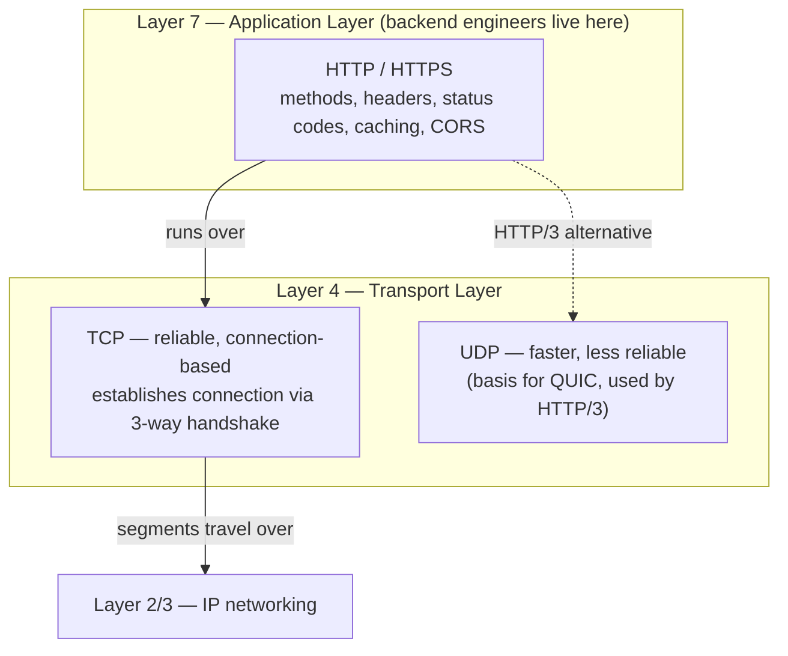
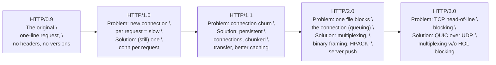
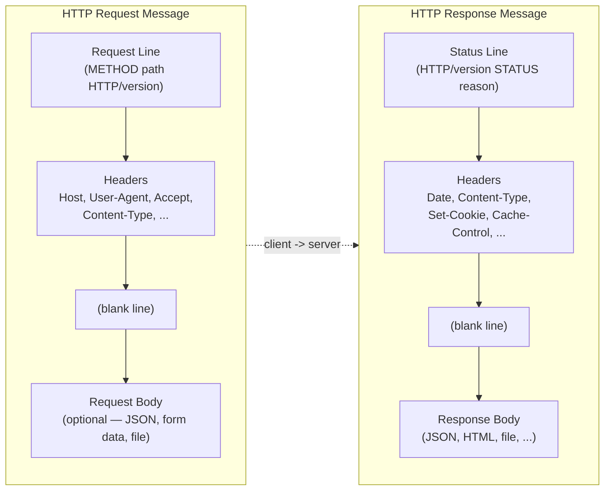
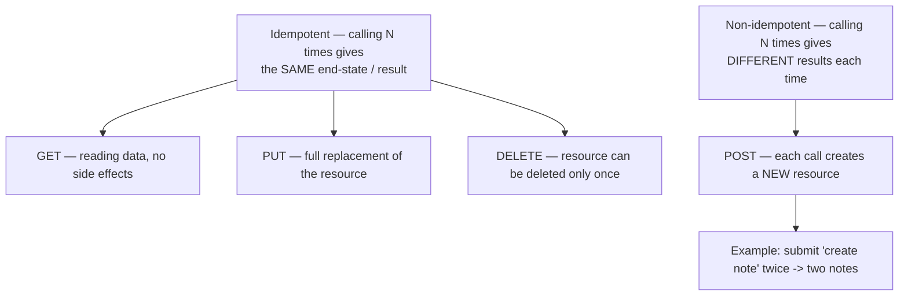
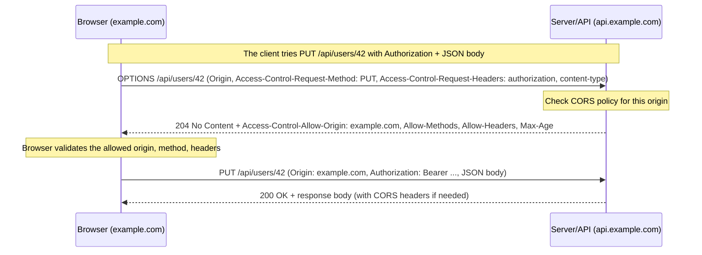
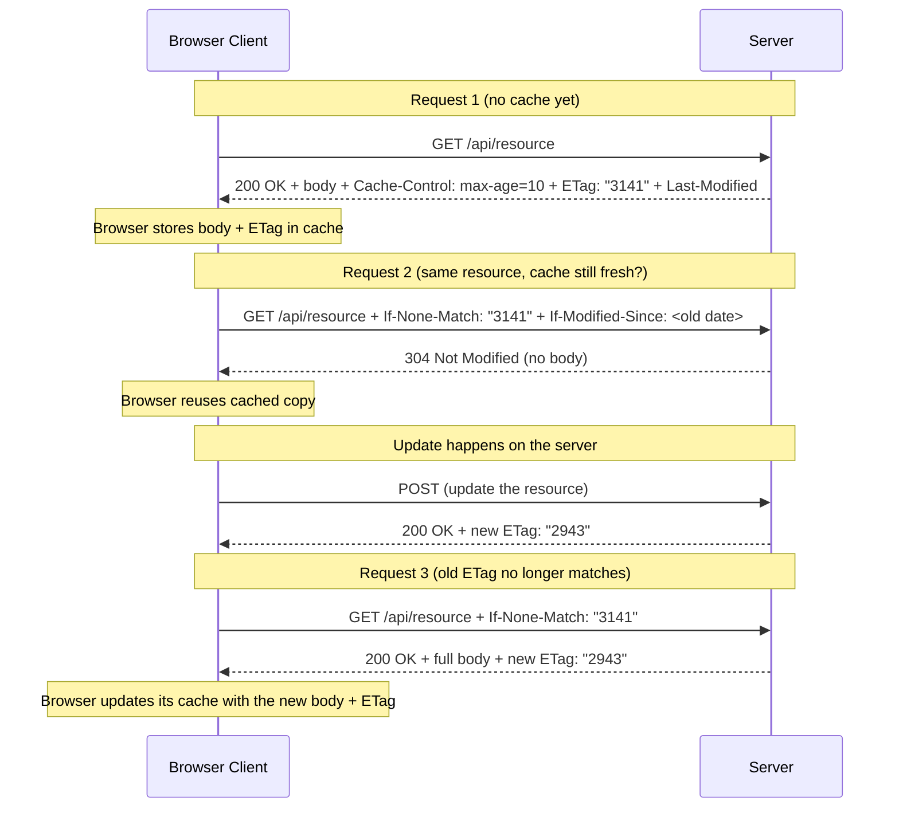
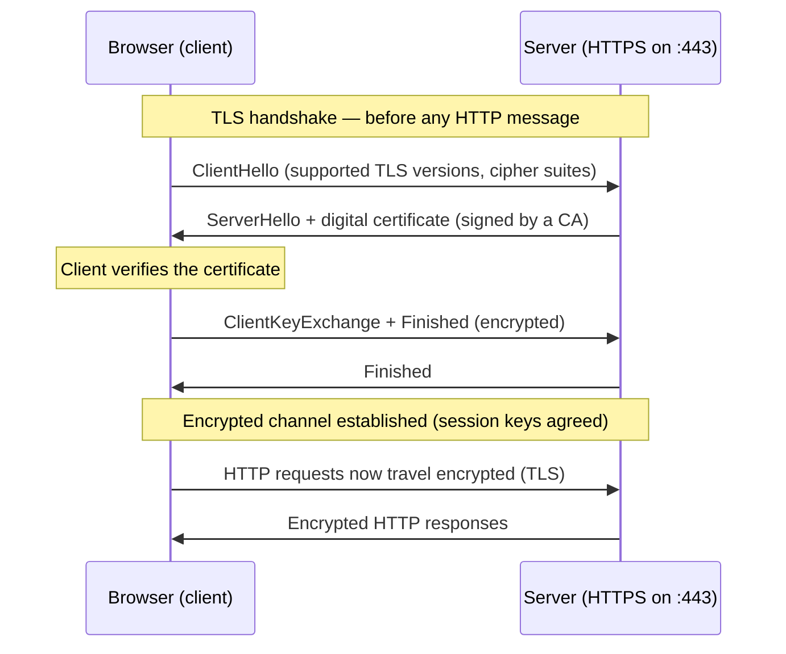

# Part 05 — Understanding HTTP for Backend Engineers

> [!info] Video reference
> **Title:** 5. Understanding HTTP for backend engineers, where it all starts
> **Channel:** Sriniously · **Playlist:** Backend from First Principles (video 05 of 29)
> **URL:** https://www.youtube.com/watch?v=a3C1DMswClQ
> **Published:** 2024-09-27 · **Duration:** 01:18:13 (4693 s) · **Views:** ~252.5k · **Likes:** ~5.3k

> [!abstract] In this chapter
> This is the foundational HTTP deep-dive of the course. It starts with the *why* — what problem HTTP solves, why we need a protocol at all, and the two ideas at the heart of HTTP (statelessness and the client–server model). It then walks through the evolution of HTTP from 0.9 to 3.0, dissects the anatomy of request and response messages, and spends a long time on **headers** (what they are, how they are categorized, and why they exist — including the parcel-shipping analogy). Next comes **HTTP methods** (GET, POST, PUT, PATCH, DELETE, OPTIONS), the crucial distinction between **idempotent and non-idempotent** operations, and a full treatment of the **OPTIONS method and CORS** — both the simple-request flow and the preflight flow, followed by a live Burp Suite demo. The middle of the video is a complete tour of **HTTP response status codes** (1xx through 5xx) plus a demo, then a practical walkthrough of **HTTP caching** (Cache-Control, ETag, Last-Modified, 304), **content negotiation**, **HTTP compression**, **persistent connections / keep-alive**, **multipart uploads and chunked streaming**, and finally a conceptual introduction to **SSL, TLS and HTTPS**.

## Video timeline

| Time | Section |
|------|---------|
| 0:00 | Intro |
| 0:15 | HTTP intro |
| 5:46 | Evolution of HTTP |
| 7:29 | HTTP messages |
| 9:09 | Why do we need HTTP headers |
| 11:22 | Types of HTTP headers |
| 16:23 | HTTP methods |
| 18:03 | Idempotent vs non-idempotent |
| 20:07 | OPTIONS method and CORS workflow |
| 29:44 | CORS demo with burp suite |
| 38:51 | Response status codes |
| 52:20 | Response status codes demo |
| 55:20 | HTTP caching |
| 1:02:29 | HTTP content negotiation |
| 1:06:53 | HTTP compression |
| 1:08:51 | Persistent connections and keep-alive |
| 1:11:04 | Multipart data and chunked transfer |
| 1:15:18 | SSL, TLS and HTTPS |

---

## [0:00] Intro

The video opens with a framing statement that defines the scope of the entire course: **backend is huge**. If we started discussing every single component that could possibly be part of a backend system, we would be stuck here for years. So instead of trying to be exhaustive, the series deliberately talks about only the topics that are used in the **majority of real-world codebases** — roughly 90% of them. Everything else (the deep rabbit holes) is acknowledged, pointed at, and left for the viewer to explore independently.

With that scope in mind, the first topic is **HTTP — the protocol through which our browsers talk to our servers**, either to send data to the server or to receive data from it. The presenter stresses that HTTP is *one* of many ways (and protocols) that clients and servers use to communicate — but it is by far **the most used one**, so it is the focus of this chapter.

---

## [0:15] HTTP intro

### What HTTP is

**HTTP (HyperText Transfer Protocol)** is the medium through which a client—typically a web browser or an application—initiates a conversation with a server. The whole exchange happens so that data can be **sent** to the server or **received** from it. But before we think about the mechanics, the video establishes the **two ideas at the heart of the HTTP protocol**, because everything else in the chapter builds on them:

1. **Statelessness** ("tessness" in the auto-captions ⇢ *inferred*).
2. **The client–server model**.

### Idea 1: Statelessness

**Statelessness** means HTTP has **no memory of past interactions**. Each HTTP request carries *all* the necessary information for the server to process it — the headers, the URL, the method — and **after the server responds, it forgets about the request**. If the client makes another request, the server treats it as a completely **new and unrelated event**.

An immediate consequence is that HTTP requests are **self-contained**. Because the server does not remember past requests, every request must include all the data the server needs to handle that specific interaction: authentication tokens, session information, cookies, etc. For example, in the case of accessing a user profile, the client has to provide credentials like **cookies or tokens on every single request** so the server can know *which* user is requesting the data.

#### Why statelessness is a good thing

- **Simplicity.** A stateless design simplifies server architecture because the server does not need to store session information. Storing sessions would otherwise require additional resources (memory, storage) and additional complexity (how to look sessions up, expire them, replicate them across instances, etc.).
- **Scalability.** Because no single server needs to keep track of a session, it becomes easy to **distribute requests across multiple servers** (load balancing). Any server in a pool can handle any request independently.
- **Fault tolerance.** If a server crashes, it does not affect the state of a client interaction — there is **no session or memory of a request that needs to be restored**.

However, precisely because HTTP is stateless, developers often have to build **state-management techniques on top of it** — cookies, sessions, or tokens — to maintain continuity where it is actually needed, such as user logins or shopping carts. The presenter notes that these mechanisms are explored **later in this series**. Statelessness is the default; state is a deliberate, add-on construction.

### Idea 2: The client–server model

In a typical HTTP request flow there are always two roles:

- **The client** — typically a web browser or an application. The client **initiates** the communication by sending a request to the server. The client is responsible for providing all the information the server needs: the **URL of the resource**, the **headers**, and so on.
- **The server** — hosts resources such as websites, APIs, or other content, and **waits** for incoming requests from clients. When the server receives a request, it **processes it** and sends back the appropriate response: a web page, data, an error message, a JSON file, a text file, or any other kind of content.

> [!important] Who starts the conversation
> The HTTP protocol states that **communication is always initiated by the client**, in order to get some kind of response from the server. A server never proactively starts an HTTP conversation; it reacts.

Throughout the rest of the discussion, the presenter says we can safely assume that **HTTP and HTTPS are interchangeable**, because HTTPS — to oversimplify it — is just a **more secure version of HTTP**. The underlying principles are the same; HTTPS only adds security features like encryption and security certificates (TLS), which border more into the network-engineering domain and are revisited at the end of the video.

### The transport layer: TCP and the OSI model

To send a request (or receive a response), the client and the server first need to establish some kind of **connection mechanism** — otherwise, what is the medium of the communication? That medium comes from the transport layer. The video introduces the **OSI model**, which is often referenced when talking about sending and receiving data over a network.

- **HTTP uses TCP.** TCP (Transmission Control Protocol) is a **transmission protocol** that provides a reliable, connection-based channel. Note that HTTP does not strictly *require* the underlying transport protocol to be connection based — it only requires it to be **reliable**, i.e. it should not lose messages, and at minimum it should present an error in such cases. Between the two most common transport protocols on the internet, **TCP and UDP**, TCP is considered the more reliable one, so HTTP relies on TCP.
- **We live in the application layer.** The OSI model stacks network functionality into layers. As backend engineers we deal almost exclusively with the **top layer — layer 7, the application layer**. Concepts such as the **TCP 3-way handshake** (which is used to establish connections) and **TLS encryption** belong to lower layers, i.e. they are mostly **network-engineering concepts**. It is good to know they exist, but fully exploring them would be a rabbit hole. The course therefore stays at the application layer, with only a brief nod to what happens below — "TCP uses something like a 3-way handshake, which if you're curious about you can look up and study more."



**What this diagram shows:** OSI-style view of where HTTP lives. HTTP sits at the application layer (where backend engineers work), and it relies on TCP at the transport layer for a reliable, ordered channel. HTTP/3 later switches the transport to QUIC over UDP, which is why UDP appears as the dashed alternative.

---

## [5:46] Evolution of HTTP

Throughout the years there have been **different versions of HTTP**, and each one kept redefining how clients and servers send and receive data. The video walks through the major milestones and explains, for each step, the *problem* that version solved and the *solution* it introduced.

### HTTP/1.0 — each request gets its own connection (the problem: inefficiency)

In HTTP/1.0, **each request opened a new connection**. This led to **inefficiencies**, because a TCP connection had to be established and then closed for *every single* request–response pair. Establishing and tearing down connections is expensive (the 3-way handshake, resource allocation, etc.), so this slowed performance noticeably — especially for a page that needs many resources (HTML, CSS, JS, images).

### HTTP/1.1 — persistent connections, chunked transfer, better caching (the fix)

HTTP/1.1 introduced **persistent connections**, which allow **multiple requests and responses over the same TCP connection** — the connection is established once, before the first request, and then reused. This significantly improved performance. HTTP/1.1 also added:

- **Chunked transfer encoding** (streaming bodies in pieces instead of needing a known total length up front).
- **Better caching mechanisms** (the `Cache-Control` header family).

HTTP/1.1 is described as the **currently most-used** HTTP version in the wild.

### HTTP/2.0 — multiplexing, binary framing, header compression, server push

HTTP/2.0 introduced **multiplexing**: multiple requests *or* responses can travel over a **single connection** concurrently. To do this it moved away from text-based messages and used something called **binary framing** instead of text. It also added:

- **Header compression** — the video mentions "Edge pack" ⇢ *inferred*: **HPACK**.
- **Server push** — allowing servers to send resources (e.g. CSS/JS) to the client **before** the client even requests them.

### HTTP/3.0 — QUIC over UDP (the fix for head-of-line blocking)

HTTP/3.0 is built on **QUIC**, a transport-layer protocol that runs **over UDP instead of TCP**. Designing it over UDP improved performance with:

- **Faster connection establishment** (fewer round trips).
- **Reduced latency**.
- **Better handling of packet loss**.

HTTP/3.0 also continues to support multiplexing **without head-of-line blocking** — which is still a problem in HTTP/2.0. (In HTTP/2, if one stream's packet is lost on a TCP connection, the loss can block later packets that belong to other streams.)

The presenter concludes the history with a "what to remember" instruction: deep-diving the network layers is again a rabbit hole. What we actually need to internalize is simply that, in all of these versions, **clients and servers establish some kind of network connection, and messages are sent and received over it.** That is all you need to remember for now.



**What this diagram shows:** The five major HTTP versions in chronological order, each box naming the dominant problem it faced and the core technical solution it introduced — from text-only responses in 0.9, through per-request connections in 1.0, persistent + chunked in 1.1, the multiplexing/binary redesign in 2.0, and finally QUIC-over-UDP in 3.0.

---

## [7:29] HTTP messages

Now that we have mentioned *messages*, let's look at exactly **what HTTP messages look like**. There are two kinds:

- **Request message** — sent by the client to the server.
- **Response message** — received by the client from the server.

The video intentionally shows *more complex* examples (messages with more parameters) so that every component can be explained one by one.

### Anatomy of an HTTP request message

```http
POST /api/users HTTP/1.1
Host: myapp.example.com
User-Agent: Mozilla/5.0 (X11; Linux x86_64)
Accept: application/json
Content-Type: application/json
Content-Length: 50

{"name": "Alice", "email": "alice@example.com"}
```

Walking through the components:

- **Request method** — e.g. `POST`. Tells the server what kind of action the client wants (covered in depth at [16:23]).
- **Resource URL (path)** — e.g. `/api/users`. The path of the resource we are requesting from the server.
- **HTTP version** — e.g. `HTTP/1.1`. Says which version of the protocol we are speaking; 1.1 is the currently most-used version.
- **Host header** — the domain of the server we are talking to (in a real example, the frontend's target domain).
- **Headers** — all of the `Key: value` lines (covered starting at [9:09]).
- **A blank line** — a blank line after all the headers **signifies that the headers are over and the body starts**. This is an important structural detail: the blank line is the delimiter between metadata and content.
- **Request body** — some information the client wants to send to the server (e.g. a JSON payload). Not every request has a body — GET typically has none.

### Anatomy of an HTTP response message

```http
HTTP/1.1 200 OK
Date: Thu, 10 Sep 2026 12:00:00 GMT
Content-Type: application/json
Content-Length: 32

{"id": 1, "name": "Alice"}
```

Walking through the components:

- **HTTP version** — e.g. `HTTP/1.1`.
- **Status code** — e.g. `200`, which basically means okay.
- **Status text (reason phrase)** — e.g. `OK`, the human-readable form of the status code.
- **Response headers** — metadata about the response.
- **Blank line** — again separating headers from body.
- **Response body** — the actual content (JSON, HTML, a file, etc.).



**What this diagram shows:** Side-by-side anatomy of the two HTTP message shapes. Both follow the same skeleton — a starting line, headers, a mandatory blank line (which marks the end of metadata and start of payload), and a body — but they differ in the starting line: requests begin with `METHOD path HTTP/version`, responses with `HTTP/version STATUS phrase`.

---

## [9:09] Why do we need HTTP headers

Headers are a major part of both requests and responses, so before diving into their types we need to understand *why* they exist as a **separate section** — why not put all this information in the URL or in the request body? Why create another level of abstraction?

### Headers are key-value pairs

On a high level, **headers are key–value pairs** of different parameters that are sent over a request or received over a response. Each header is written as:

```
Key: value
```

(for example `Content-Type: application/json` — the key is `Content-Type`, the value is `application/json`).

### The parcel-shipping analogy (the core intuition)

The video explains the *raison d'être* of headers with a real-life example: **we send and receive parcels**. A parcel carries the address, phone number, state, PIN code, and other details of the recipient. The key question: **do we keep those details inside the package, or do we write them on top of it?**

We write them **on top**. Why? Because the people who carry the parcel from the sender to the receiver — the couriers, the sorting machines, the different modes of transmission — **need to know different pieces of information without opening the package**, so they can successfully transmit it. If all that metadata were buried inside the parcel, every courier would have to open it just to see who the recipient is, again and again, on each hop. Keeping the address and recipient information **on top of the parcel** gives everyone a quick way to check the metadata about the package.

**HTTP headers can be thought of exactly like that** — metadata written on the outside of the envelope — but they have even more uses.

Why not put it in the URL? The URL identifies *what* resource we want. Why not in the body? The body is the *payload itself* — the actual data being transmitted. Headers are the **metadata about the request/response** that both sides (and any intermediary, like proxies) need to interpret everything else: how the body is encoded, who is asking, what format is acceptable, how long the content may be cached, whether the connection should stay open, etc.

---

## [11:22] Types of HTTP headers

There are *a lot* of different headers, so the video categorizes them into a few groups. The categories used in the video are:

1. **Request headers** — sent by the client to the server.
2. **General headers** — used in both requests and responses.
3. **Representation headers** — deal with the representation of the resource being transmitted (the body).
4. **Security headers** — control browser security behavior.
5. **Custom headers** (extensibility) — application-defined extension headers.

### 1. Request headers (client → server)

Sent by the client to the server to provide information **about the request itself**. They help the server understand the client's **environment, preferences, and capabilities**. Examples:

- **`User-Agent`** — identifies what kind of client is making the request: a browser, Postman, a server-to-server call, a mobile app, etc.
- **`Authorization`** — sends credentials such as a **Bearer token** to the server to identify the user (and influence access-control decisions).
- **`Accept`** — tells the server what kind of content the client is expecting: JSON, text, an HTML file, etc. (This is the basis of content negotiation — see [1:02:29].)

### 2. General headers (used in both request and response)

Headers that appear in **both requests and responses** and carry metadata about **the message itself**:

- **`Date`** — the date of the message.
- Caching mechanism headers — e.g. `Cache-Control: no-cache` or `max-age=...`.
- **`Connection`** — connection info: whether to keep the connection alive or to close it (`keep-alive` vs `close`).

General headers contain information about the **request message or response message** as a whole, not about one side in particular.

### 3. Representation headers (about the body / representation of the resource)

These deal primarily with the **representation of the resource being transmitted** — whether it is a request body or a response body. They ensure clients and servers know **how to interpret and process** the request/response:

- **`Content-Type`** — describes the **media type** of the request or response: `application/json`, `text/html`, etc.
- **`Content-Length`** — describes the **size of the resource in bytes**.
- **`Content-Encoding`** — specifies any encoding applied, such as **gzip or deflate** (see HTTP compression, [1:06:53]).
- **`ETag`** — a **unique identifier** (usually a hash of the representation) that is mostly used for **caching** (see [55:20]).

### 4. Security headers

Headers that **enhance the security** of the request/response exchange by controlling behaviors like *content loading, cookies, and encryption*:

- **`Strict-Transport-Security` (HSTS)** — ensures the client **only communicates with the server over HTTPS**, preventing **protocol-downgrade attacks** (a man-in-the-middle forcing HTTP).
- **`Content-Security-Policy` (CSP)** — restricts the **sources from which content like JavaScript, CSS, and images can be loaded**, helping prevent **cross-site scripting (XSS)** attacks.
- **`X-Frame-Options`** — prevents the web page from being embedded in an **iframe**, mitigating **clickjacking** attacks.
- **`X-Content-Type-Options`** — ensures the browser does **not try to guess the MIME type** of the content (does not do "MIME sniffing"), preventing **MIME-sniffing attacks**. The common value is `nosniff`.
- **`Set-Cookie` with `HttpOnly` / `Secure` flags** — secures cookies: `HttpOnly` makes them **inaccessible from JavaScript** (so a stolen script cannot read them), and `Secure` ensures they are **only sent over HTTPS**.

Together, **security headers help protect the client and the server from a variety of attacks** by controlling how the browser behaves with resources and by enforcing security policies.

### Two big ideas about headers

After the categories, the presenter distills two ideas worth internalizing:

1. **Extensibility.** HTTP is highly extensible because **headers can be easily added or customized without altering the underlying protocol**. We only have to add some metadata, and the whole flow of the interaction changes based on it. Headers can be defined and used for various purposes, making HTTP **adaptable to new technologies and use cases**:
   - *Security enhancements* — e.g. HSTS and forced secure connections.
   - *Custom headers* — developers can create application-specific headers like `X-Custom-Header` for their own use cases (this is where the old `X-` prefix convention comes from).
   - *Content negotiation* — `Accept`, `Accept-Language`, and `Accept-Encoding` let servers serve different versions of content depending on the client's preference.
2. **Remote control.** HTTP headers act as **a kind of remote control on the server side**: they allow the client to send instructions or preferences to the server, **influencing how the server responds or processes requests**:
   - **Content-type negotiation** — the client can request a specific format with `Accept` (say "I want HTML" and the server sends HTML; say "I want JSON" and the server sends JSON).
   - **Caching and expiration control** — the server can use headers like `Cache-Control` or `Expires` to control how long a resource is cached by the client.
   - **Authentication** — the client authenticates itself via the `Authorization` header, influencing access-control decisions.

So headers are not just passive labels: they are the mechanism by which client and server **negotiate behavior**. We explore them in more depth in the demos later in the chapter.

---

## [16:23] HTTP methods

The next component of an HTTP message is the **HTTP method**. HTTP methods exist to represent the **different kinds of actions** that a client — a browser or an API consumer — can request on a server. Instead of every request doing the same thing, **methods define the intent** of the interaction. The keyword here is **intent**: it gives a clear **semantic meaning** to each type of action, and it is pretty intuitive.

### The main methods

| Method | Intent | Notes |
|--------|--------|-------|
| **GET** | Fetch some data from the server. | Should **not modify anything** on the server. Typically no body. |
| **POST** | Create some data on the server. | Has a request body (that's how user data reaches the server). |
| **PATCH** | Update *some* data. | The request body carries the data to update; a **selective/partial** update — an "append" or "selective replacement" action. |
| **PUT** | Update data too — but by **complete replacement**. | Whatever data comes in the request body should **completely replace** the previous instance. |
| **DELETE** | Delete a resource from the server. | As the name suggests. |
| **HEAD** | Same as GET, but returns only headers, no body ⇢ *inferred (standard semantics; used for checking existence/metadata)*. | — |
| **OPTIONS** | Fetch the **capabilities** of the server for a cross-origin request. | Almost never used directly by developers, but visible in the browser network tab in **preflight requests** (see [20:07]). |

### PUT vs PATCH — the important nuance

The video emphasizes a very common developer mistake. Both PUT and PATCH are used to update data, but they differ in semantics:

- **PUT = complete replacement.** Whatever is in the request body replaces the entire previous resource. Sending a partial object via PUT would wipe out the fields you didn't send.
- **PATCH = partial / selective replacement.** Think of it as an **append or selective-replacement** action. You send only the fields you want to change (e.g. on a user profile page where the user updates just their name).

> [!warning] The thumb rule
> **Always use PATCH unless you have a specific use case for PUT.** A lot of developers use PUT when they should be using PATCH, and that goes against the semantics. Use PUT only when you truly mean "replace the whole resource with what I send you."

### Example request bodies showing the semantic difference

Putting the user with id `42` — the whole object replaces the stored user:

```http
PUT /api/users/42 HTTP/1.1
Content-Type: application/json

{"name": "Alice", "email": "alice@example.com", "age": 30}
```

Partially updating the same user — only the `name` field changes, everything else is untouched:

```http
PATCH /api/users/42 HTTP/1.1
Content-Type: application/json

{"name": "Alicia"}
```

---

## [18:03] Idempotent vs non-idempotent

A prevalent idea in the context of HTTP methods is **idempotency** ("emp poent and nonm poent" ⇢ *inferred*: idempotent / non-idempotent).

### Definition

**Idempotent** means that an HTTP method **can be called multiple times and we can expect the same kind of result**. Repeating the same request produces the same observable outcome — it does not create additional side effects on the second, third, or nth call.

**Non-idempotent** means the outcome **differs depending on how many times the call is made** — each repetition creates a new, different effect.

### Which methods are idempotent, and why

- **GET** is obviously idempotent. You are fetching data from the server; **it does not matter how many times you fetch it — the data should be the same**. You should not be able to modify any data on the server with a GET.
- **PUT** is idempotent. PUT **completely replaces** the resource. It does not matter how many times you replace the old data with the new data — the final result is always the same. Replacing is replace: `PUT` once or a hundred times leaves the resource identical.
- **DELETE** is idempotent. You can only delete a resource once — after that it is already deleted. You cannot perform the action multiple times and expect different results: **the result will always be the same** (the resource is gone). (Strictly, the first call returns success and later calls might return 404, but the **state** the delete produces — resource absent — is the same, which is what idempotency is about.)

### Why POST is NOT idempotent

**POST is considered non-idempotent** because each submission **creates a new resource**. Example from the video: a user creates a note using your app. They submit a POST request to create a new note:

- **First submission** → the request goes through, the response is successful, and **a new note is created**.
- **Second submission** → **another new note** is created.

Two submissions of the *same* request produce **two different results** — there are now twice as many notes. Because the same kind of request produces different results, POST is non-idempotent.

This is precisely why naively retrying a POST can cause duplicate resources (double-submitting a form, duplicate charges, etc.), and why idempotency keys are often introduced at the application level for such operations.



**What this diagram shows:** The idempotency classification used in the video. GET, PUT, and DELETE are idempotent (repeatable with the same net effect), while POST is non-idempotent because every invocation creates a brand-new resource.

---

## [20:07] OPTIONS method and CORS workflow

After all the standard methods, there is one other method with a very interesting use case: **OPTIONS**. As a developer you probably **won't use OPTIONS directly**, but you will **see it once in a while in the browser network tab** — in **preflight requests**. This ties into **CORS**, the **cross-origin resource sharing** flow, which was mentioned in brief earlier in the course as part of the **same-origin policy** that browsers enforce.

### Same-origin policy and CORS

By default, browsers follow the **same-origin policy**: it **restricts web pages from making requests to a domain different from the one serving the web page**.

- **CORS (Cross-Origin Resource Sharing)** is a **security mechanism enforced by browsers** to control how web applications interact with resources hosted on **different domains** (cross-origin).
- **Without CORS, browsers block** the request made from a web application running on one origin (like `example.com`) to a *different* origin (like `api.example.com`) **for security reasons**.
- **CORS allows servers to specify who can access their resources and how** in a cross-origin request.

There are **two types of flows** for a cross-origin request:

1. **Simple request flow.**
2. **Preflight request flow.**

### Flow 1: The simple request

Setup: our frontend client is at the domain `example.com`; our server (API) is at the domain `api.example.com`. We make a GET request.

1. The client sends the request.
2. The **browser automatically adds the `Origin` header** to indicate the origin of the request (`Origin: https://example.com`).
3. The request is a **simple method** — usually **GET, POST, or HEAD**.
4. The request reaches the server.
5. The **server checks the `Origin` header against its CORS policy**. If the origin is allowed:
   - The server includes the **`Access-Control-Allow-Origin`** header in the response.
6. The server responds with the resource, including the necessary CORS headers (e.g. `Access-Control-Allow-Origin`).
7. The **browser looks for this header when it parses the response**. The browser sees that our domain (`example.com`) is different from the host domain (`api.example.com`), so it checks whether the server's response carries `Access-Control-Allow-Origin` with either:
   - **The client's domain** (`https://example.com`), or
   - **`*`** (star), which means "allow all origins".
8. If either condition is true, **the browser lets the response through** to the JavaScript client that requested the resource.

**What if the server does NOT respond with the CORS header?** If the server did not add the corresponding CORS headers — or did not allow this particular domain as a client — then the server **excludes `Access-Control-Allow-Origin` entirely from the response**. When the browser parses the response it sees **the absence of this header** and **blocks this particular response from being passed** to the JavaScript code. You get an error in the console and in the network tab — a **CORS error**.

Example of a simple request that the browser **lets through**:

```http
GET /resource HTTP/1.1
Host: api.example.com
Origin: https://example.com
```

```http
HTTP/1.1 200 OK
Access-Control-Allow-Origin: https://example.com
Content-Type: application/json

{ ... }
```

### Flow 2: The preflight request

For many real-world requests — especially **JSON APIs** — a simple request is not enough. The browser first has to ask the server for permission in a **preflight request**: a request made *before* the original request, used to **inquire about some capabilities and to let the server know about the client's capabilities**.

#### When does a request qualify as a preflight request?

The browser checks **three conditions** — if the request is a cross-origin request **and any one of these three is true**, the browser will do a preflight first. The three conditions are:

1. **The method is not GET, POST, or HEAD** — for example a **PUT** or **DELETE** request.
2. **The request includes non-simple headers.** Non-simple headers are basically anything apart from the "general" / simple request headers — for example an **`Authorization`** header, or any **custom header** (`X-Custom-Header` etc.). 
3. **The request has a `Content-Type` other than** one of the "simple" content types:
   - `application/x-www-form-urlencoded`
   - `multipart/form-data`
   - `text/plain`

   These three are the "general" / simple content types. Crucially, **`application/json` is NOT one of them** — so requesting JSON data (as most frontend→backend apps do all the time) means your request will be treated as a **preflight request**. Since as backend/frontend engineers we mostly deal with JSON, *most of our requests are preflight requests*.

#### What the preflight request looks like

The preflight is made with the **OPTIONS method**, and it looks something like this:

```http
OPTIONS /api/users/42 HTTP/1.1
Host: api.example.com
Origin: https://example.com
Access-Control-Request-Method: PUT
Access-Control-Request-Headers: authorization, content-type
```

Explanation of each part:

- **`OPTIONS /api/users/42 HTTP/1.1`** — the method is OPTIONS, with the appropriate resource URL and HTTP version.
- **`Host`** — the header of our API.
- **`Origin`** — the domain of the front end (`https://example.com`).
- **`Access-Control-Request-Method: PUT`** — literally asking the server: *"I am making a cross-origin request — do you support this particular method (PUT) for this route?"*
- **`Access-Control-Request-Headers: authorization, content-type`** — also asks: *"do you support these particular headers if they are needed?"*
- **No request body.** The preflight request **does not include actual data** — no request body. It is just a **general inquiry** to the server about its capabilities.

#### What the preflight response looks like

If the server is properly handling the CORS flow (i.e. it supports cross-origin requests), it responds something like this:

```http
HTTP/1.1 204 No Content
Access-Control-Allow-Origin: https://example.com
Access-Control-Allow-Methods: GET, POST, PUT, DELETE
Access-Control-Allow-Headers: authorization, content-type
Access-Control-Max-Age: 86400
```

If the server **does not handle CORS**, it **won't respond with these headers**, and the request is **automatically blocked by the browser**.

Walking through the four important response headers:

1. **`Access-Control-Allow-Origin: https://example.com`** — *"yes, I allow the client's domain (`example.com`) as a valid cross-origin origin."* It can also be `*`, meaning *"I allow all types of clients to make requests to me."* **This is the one*valid* condition the browser checks first.**
2. **`Access-Control-Allow-Methods: GET, POST, PUT, DELETE`** — the browser asked *"do you allow PUT for this resource?"* The server answers with the list of methods it allows for this route. The browser checks it off against what it asked.
3. **`Access-Control-Allow-Headers: authorization, content-type`** — the browser asked *"do you allow the `Authorization` header?"* (and, implicitly, the content-type). The server answers with the list of non-simple headers it supports.
4. **`Access-Control-Max-Age: 86400`** — *"don't make any more preflight requests to me for a while; these configs will stay the same for at least the next 24 hours, so cache this permission."* This **saves bandwidth** for both servers and clients, because the browser won't re-run a preflight before every request.

#### The full preflight sequence

1. Browser sends the **OPTIONS preflight** with `Access-Control-Request-Method` (and `Access-Control-Request-Headers`).
2. Server responds with **204 No Content** plus the `Access-Control-Allow-*` headers.
3. (204 = "no content" — appropriate because the preflight is a general inquiry with no request or response body.)
4. The browser **checks off all these conditions**.
5. If everything matches, **the browser sends the final request** — the **original request the client wanted to make** (e.g. the PUT with its real body).
6. The server responds to the original request with whatever operations are required.



**What this diagram shows:** The complete preflight CORS flow. The browser first sends an OPTIONS probe asking about the method and headers it intends to use; the server answers with a 204 plus the `Access-Control-Allow-*` capabilities; the browser validates them, and only then fires the actual PUT request with its real payload.

This simple-request flow **combined with** the preflight-request flow constitutes the whole CORS flow. Understanding these two flows is all you need to understand how CORS works behind the scenes, why those headers matter, and how browsers react to them.

---

## [29:44] CORS demo with burp suite

### The rules of engagement for all demos in this series

Before the demo, the presenter makes a methodological point that applies to **all demos in the whole series**:

- **No code.** Everything is learned from **first principles**, and the rule for that is: *understand the concepts first — how the underlying mechanism works — before we dive into code.* We must understand the **what** before the **how**.
- **Language-agnostic.** It does not matter what language or framework the server is written in (Node.js, Go, whatever). For each demo the presenter explains *what* was changed on the server and *why* — it could be implemented in any language.

### What is Burp Suite?

The tool used for this demo is **Burp Suite** — a tool **used by ethical hackers**. It has a lot of features, but the one used here is **HTTP intercepting / visualizing HTTP traffic**: it offers a very nice set of features for inspecting the raw HTTP traffic between a browser and a server.

### Demo setup

There is a **simple frontend app** (any language) with two things to demonstrate:

1. The **simple request** CORS flow.
2. The **preflight request** CORS flow.

And each is shown as it actually appears in a **real browser environment** (plus Burp's view of request/response).

### Demo part 1 — the simple request

The frontend fires a simple request and renders the response. Inspecting the request and response:

- **The request** shows the familiar components: method, URL, headers, and the response shows the status code, response headers, and response body.
- **Why is this a cross-origin request?** The first parameter the browser checks is the **origin**. Here:
  - `Origin` = `http://localhost:5173` (the front end's origin).
  - `Host` = `http://localhost:3000` (the API port).
  - Because host and origin are on **different ports of localhost**, the browser considers this **cross-origin**. According to the **same-origin policy**, you can only make requests from `localhost:5173` to `localhost:5173` based on the default rules — different port means a different origin.
- **The two important request headers** to focus on: `Origin` (the front end's origin) and `Host` (the domain/port the client wants to connect to).
- **The response**: the thing to focus on is the **`Access-Control-Allow-Origin`** header. As explained, since it's a cross-origin request, the browser checks whether the response has this header and whether it contains the front end's port (`5173`), or `*`. It has the front end's port, so **the browser lets the response through and does not block it** — the response is now expected/allowed. That is why the front end is able to get the response and render it.

#### Removing the header — the CORS error

To prove the point, the presenter **removes the `Access-Control-Allow-Origin` header from the server** for the simple request, refreshes, clears history, fires the same request again (with caching disabled, so we see a fresh request):

- The response now looks like the normal response **but without the CORS header**.
- **The browser blocks the response** — it says "CORS error".
- Inspecting the request/response in Burp shows: cross-origin request (origin `5173`, host `3001`) and the server **does not return the `Access-Control-Allow-Origin` header** — because it was removed.
- For that reason, the browser blocked the request because of a **CORS error**.

That is the whole simple-request flow.

### Demo part 2 — the preflight request

The presenter re-enables CORS on the server, then fires the request that triggers a preflight. In the network trail we immediately see **two requests for every operation**:

1. First: the **OPTIONS request** — the preflight.
2. Then: the **original request**.

#### Examining the preflight (OPTIONS) request

- **Method:** OPTIONS.
- It is a cross-origin request (the referrer/origin and host are on different ports).
- The server responds with **status code 204 No Content** — appropriate because the preflight is just a general inquiry; preflight requests have **no request bodies and no response bodies**.
- The response carries `Access-Control-Allow-Origin` with the front end's domain/port — so the browser allows that response to go through (first condition satisfied).

#### Why was a preflight fired at all?

Investigating the *original* request shows all three preflight triggers are satisfied (any one would have been enough):

1. The method is **not** a simple method (GET/POST/HEAD) — it is a **PUT**.
2. The request includes an **`Authorization` header** — that counts as a non-simple header, ruling it out of the "simple" class.
3. The **`Content-Type` is `application/json`** and it is sending a JSON request body — not one of the three simple content types.

#### Examining the preflight response headers

The preflight response showed:

- **`Access-Control-Allow-Origin`** — allows the client's origin/port, so the browser lets the response through.
- **`Access-Control-Allow-Methods: GET, POST, PUT, DELETE`** — the capabilities of the server: these methods are allowed.
- **`Access-Control-Allow-Headers: content-type, authorization`** — the two non-simple headers that the server supports (matching what the client asked for in `Access-Control-Request-Headers`).
- **`Access-Control-Max-Age: 0`** — set to **0 for testing purposes**. The presenter explains the contrast: if you cache this for, say, 5 minutes, then no further preflight requests are fired within that window (`Access-Control-Max-Age` is exactly what prevents repeated preflights; setting it to 0 forces a preflight every time).
- **`Content-Length: 0`** — because there is no content in a preflight response.

#### The original request after a successful preflight

Since the preflight was successful (204 = success status), the browser let it go through and fired the **original request**:

- **PUT** method
- the resource URL
- `Origin` header
- `Authorization` header
- `Host` header
- a **request body**
- and the server responded with a 200 + **response body**

And that's how the preflight request flow looks in practice.

> [!note] Simple + preflight = the whole CORS picture
> The simple-request flow (Origin header + Access-Control-Allow-Origin on the response) and the preflight flow (OPTIONS + Access-Control-Allow-Methods/Headers/Max-Age + the real request after) together form the entirety of CORS. When you see `Origin`, `Access-Control-*` headers, and OPTIONS requests in the network tab, you now know exactly what is happening and why.

---

## [38:51] Response status codes

### Why status codes exist

HTTP **response status codes** exist to communicate the result of a request **in a standardized way**. Instead of opening the body or reading the whole message, you can **just look at the status code** and immediately know whether the request was successful, what the state of the server is, and roughly what went wrong.

The video makes the point vivid with an imagined pre-standard world: clients would have to **guess the outcome of a request based on the content of the response** ("If the request was successful I expected this structure; if it failed, this other structure; if the server crashed, a null object..."). That led to **inconsistencies and inefficiencies**. Status codes solve this by providing a **universal language** that all clients and servers understand.

Concretely, status codes:

- **Quickly inform the client** whether the request was successful, resulted in an error, or requires further action.
- **Help clients handle errors** with specific codes. Examples from the video:
  - A **401** tells the client the user hit an *unauthorized access* path → the app can **log the user out** and ask them to log in again.
  - A **400** (bad request from invalid form data) → the client can ask the user to **fix their form submission** and resubmit.
- **Standardize across every web service.** Whether you build the server in Python, Go, Rust, JavaScript, or Ruby, you must follow the standard: success → 200, created → 201, etc.

### The shape of status codes

Status codes are **three-digit numbers** whose first digit splits them into categories:

| Range | Category |
|-------|----------|
| **1xx** | Informational responses |
| **2xx** | Success responses |
| **3xx** | Redirection |
| **4xx** | Client errors |
| **5xx** | Server errors |

### 1xx — Informational responses

The server sends these to indicate it has received the **headers** and the client can proceed (e.g. to send the request body):

- **100 Continue** — commonly used in **large uploads**: the client sends the headers first; if the server is okay with the request it replies `100 Continue`, and the client then sends the rest of the body.
- **101 Switching Protocols** — indicates the server is **switching protocols** as requested by the client, such as **upgrading from HTTP to WebSocket**.

The presenter notes 1xx codes are not the most-used in day-to-day life, and the focus should be on the **2xx, 4xx, and 5xx** categories.

### 2xx — Success responses

- **200 OK** — the most common code. The request **was successful** and the server is **returning the requested resource or performing the requested action** (e.g. a successful GET that retrieves a resource).
- **201 Created** — the request **has been fulfilled and resulted in the creation of a new resource** (e.g. a POST request or a new form submission).
- **204 No Content** — the request **was successful but there is no content** to return; any useful info rides in the **headers**. Seen in the CORS flow: an OPTIONS preflight gets `204`. It is also sometimes used for **DELETE** requests: "I've deleted it, but there is no content to return — just assume the request was successful."

### 3xx — Redirection

- **301 Moved Permanently** — the requested resource has been **permanently moved to a new URL**, and **future requests should use that new URL**. Example: if you had a route `/user` and moved it to `/person`, you add a `301` on `/user` to redirect to `/person` for **backwards compatibility** — so old users/applications still hitting the old route don't break. Permanent redirect.
- **302 Found (temporary redirect)** — the resource is **temporarily located at a different URL**, but the client should **continue to use the original URL** for future requests. Example: running a campaign for a couple of hours — you redirect a route to a new route to catch new traffic or show a different UI, but you plan to **revert the change** later, so you tell the client "for now I'm redirecting, but later use the original route."
- **304 Not Modified** — the resource **has not been modified** since the last time the client requested it. Mostly used in conjunction with **conditional GET requests** and **ETags** to allow efficient caching. (Demonstrated at [55:20].)
- **307 / 308** ⇢ *inferred as adjacent codes with the same semantics as 302/301 but preserving the HTTP method across the redirect; not explicitly shown in the video but part of the same redirect family.*

### 4xx — Client errors

These are the errors a backend engineer will **most often deal with**, because they are triggered by some *behavior of the client*:

- **400 Bad Request** — the client sent **invalid or illogical data**. Examples: you expect a number and the client sends an array or string; you expect an email and the client sends a phone number. The message is: *"there is something wrong with your request format — fix it and make a new request."*
- **401 Unauthorized** — the request **requires authentication**, but the client has either **failed to provide valid credentials or is not authenticated at all**. Example: you expect a **JWT token**, and either the token **has expired**, or the client **did not send the token in the first place**. That's when you respond 401.
- **403 Forbidden** — the server **understood the request but refuses to authorize** it. This can happen **even if the client is authenticated**. Example: you are user A and you try to delete a resource belonging to user B — the server says "you don't have the necessary permissions to perform this action." 
- **404 Not Found** — arguably **the most famous status code**. Fired when the client requests a resource that is **unavailable** — either the **URL is incorrect** or the **resource has been deleted**.
- **405 Method Not Allowed** — fired when an **invalid HTTP method is used**, e.g. trying to PUT to a resource that only accepts GET or POST. Often caused by **typos** — doing PATCH when you meant PUT, or PUT when you meant POST.
- **409 Conflict** — the request **conflicts with the current state** of the resource. Example: your app lets users create folders, and folder names must be **unique**. When a user tries to create a folder with a name that already exists, you respond `409` so the client understands "a folder with that name already exists — try a new name."
- **429 Too Many Requests** — mostly used for **rate limiting**: if the client tries to make **too many requests in a particular interval** (e.g. your server allows at most 60 requests per client per second, and the client exceeds it), respond `429`.

> [!important] 401 vs 403 — the distinction
> - **401 Unauthorized** = *"I don't know who you are"* — authentication failed or is missing (no token, expired token, invalid token).
> - **403 Forbidden** = *"I know who you are, but you are not allowed to do this"* — you are authenticated, but you lack the required permissions (e.g. user A trying to delete user B's resource).

### 5xx — Server errors

- **500 Internal Server Error** — the most famous of the 5xx. Used for **unexpected conditions on the server**: some process broke, or an **unhandled exception** was raised. Instead of returning an empty response, breaking, or hanging the request, you respond `500` so the client knows something went wrong on the server.
- **501 Not Implemented** — the server **does not support the requested HTTP method or functionality**, but it **plans to add it soon**. It communicates intent: "currently not supported, but it might be in the future."
- **502 Bad Gateway** — seen in **proxies** (like **nginx**). When a server acts as a proxy (load balancer or reverse proxy) and the **upstream server returns an invalid response**, the proxy returns `502`. This is **not returned intentionally** by application code — it is handled mostly by proxies and load balancers.
- **503 Service Unavailable** — the service is **temporarily unable to handle the request** — e.g. during **high traffic** or **maintenance**. It says: "the service is unavailable right now — try again later."
- **504 Gateway Timeout** — similar to 502 but specifically: the **upstream server failed to respond within the timeout period**. Example: nginx is in front of your origin server; nginx couldn't get a response from the origin in time, so nginx responds `504` — *it did not receive any response from our original server, that's why it says timeout.*

The presenter closes with a scope statement: **these are basically all the response codes you need to know** to work with **95% of use cases**.

---

## [52:20] Response status codes demo

To solidify the theory, a quick demo: there is a **frontend app** that emulates several kinds of responses, and a **server** running which responds with different status codes. The presenter fires all the requests and then examines the responses one by one.

**A structural observation first:** before each original request, there is an **OPTIONS (preflight) request**. This is because these are **cross-origin requests** — the browser needs to perform a preflight to support them. So the network trail alternates OPTIONS and the real request.

Then, going through the **original requests**:

- **200 OK** — the request was successful. Status code `200`.
- **POST → 201 Created** — even though this is a mock request/response, this is what a successful creation looks like: the resource was **created** successfully and the status code is `201`.
- **400 Bad Request** — the demo server responds with *"bad request: missing required data"*. (The auto-captions transcribe this line as "401 bad request" ⇢ *inferred:* 400 Bad Request, matching the demo's "missing required data" message.)
- **401 Unauthorized** — typically means **either you have not included the token** (the JWT token, or the cookie, or whatever authentication mechanism you use), **or even if you included it, it has expired / is no longer valid**.
- **403 Forbidden** — you are trying to perform some action which **you are not authorized to do** — "you do not have access."
- **404 Not Found** — "*not found: the requested resource could not be found.*"
- **409 Conflict** — "*resource already exists*." As in the earlier example: you already have a folder, and you try to create a folder with the same name again — the server responds `409`.
- **500 Internal Server Error** — the server just says *"internal server error"* **without letting the client know too much information**, for security reasons.
- **503 Service Unavailable** — "*please try again later.*"

That demo covers most of the status codes discussed above.

---

## [55:20] HTTP caching

### What HTTP caching is

**HTTP caching** is a technique to **store copies of responses for reuse**, reducing the need to repeatedly request the same resource from the server. Reusing old data when the data hasn't changed:

- **Improves load times.**
- **Reduces bandwidth** (the client doesn't need to download the same bytes again, and the server doesn't need to send them).
- **Decreases server load** (fewer requests hit the application).

The video demonstrates caching by **following the request cycle in a browser** — a real "trail" of requests.

### The first request (cache miss / fill)

When the page first renders, a **GET** request goes to the endpoint (e.g. `/api/resource`). The response — a `200` — comes back with the resource in the body plus **three important caching headers**:

```http
HTTP/1.1 200 OK
Cache-Control: max-age=10
ETag: "3141"
Last-Modified: Tue, 09 Sep 2026 10:00:00 GMT
Content-Type: application/json

{ ... }
```

1. **`Cache-Control: max-age=10`** — the server says: *"you should maintain the cache for this resource for a maximum of 10 seconds."* (This is a very short TTL; in production TTLs are usually far longer.)
2. **`ETag: "3141"`** — basically a **hash**. For the sake of the example a random number is used, but real ETags are usually **hashes computed from the response** — the server took the response, hashed it, and sent the hash in the `ETag` header. It uniquely identifies this exact version of the response.
3. **`Last-Modified`** — *"this is the last time this resource was modified."* Judging from this date we can decide whether to reuse the cached copy or fetch a new one.

### The second request (cache validation)

When the client does a **fetch** for the same resource again, the request now carries **two conditional headers**:

```http
GET /api/resource HTTP/1.1
If-None-Match: "3141"
If-Modified-Since: Tue, 09 Sep 2026 10:00:00 GMT
```

The client is saying to the server:

> "If the ETag (the hashed version of the response object) of this resource is **not the same** as the one I have in my browser cache — or if the resource **has been modified after** this date (`If-Modified-Since`), i.e. I have the outdated version — **then send me the updated resource**. Otherwise, I'll just use my cached version."

The server checks `If-None-Match` (which echoes the ETag) and `If-Modified-Since` (which echoes `Last-Modified`). Since the resource still matches either the ETag or the last-modified state, the server sends back:

```http
HTTP/1.1 304 Not Modified
ETag: "3141"
```

**`304 Not Modified`** means *"the requested resource has not been modified since the last time you fetched it — go ahead and use your cached version."* The browser uses the old data; no body is re-downloaded.

### The update scenario (cache invalidation in action)

Then the demo **updates the resource**:

1. The presenter fires an **update resource** request. (Ideally this should have been a PATCH or PUT, but for the sake of the example a **POST** was fired.) The server responds **200**, and importantly sends a **new ETag: "2943"**.
2. Next, the client does a **GET** carrying the **old ETag "3141"** (the cached version) in `If-None-Match` plus the old `If-Modified-Since`.
3. The server responds **200 instead of 304** — because **the resource HAS been modified** since that old state (we just updated it). The 200 comes with the new updated ETag `"2943"` and a fresh `Last-Modified`.
4. The client fetches again, now using the **fresh ETag "2943"** and the new `Last-Modified`.
5. The server checks again; since this matches the **current/latest version**, it responds **304 Not Modified** — the client can use its cache.

### The full caching dance in one picture



**What this diagram shows:** The conditional-GET cache-validation loop. Initial response populates the cache with an ETag and timestamp; subsequent requests carry `If-None-Match`/`If-Modified-Since`; an unchanged resource yields `304 Not Modified` (reuse cache), while a changed resource yields a fresh `200` with a new ETag (update cache).

### Caveats and modern practice

The presenter is careful to add nuance:

- In a **production setting**, HTTP caching gets **a lot more complicated** because **the server has to manually implement and manage all the ETags**. If the server forgets to update an ETag, **the client will continue using the cached version with the outdated resource** — which is a real problem (stale data, broken UI).
- Today there are **better solutions** for caching on the client side, e.g. **React Query** — a complete client-side caching library. The client gets **complete power over when to use a cached resource and when to refetch**, at what intervals, etc. In the presenter's opinion this is a **much better solution compared to traditional HTTP-based caching** for dynamic data.
- Still, it is good to know that HTTP-based caching exists and is perfectly usable **when the use case is simple enough**.

---

## [1:02:29] HTTP content negotiation

Content negotiation is a topic that always comes up in the client–server model: **how clients and servers exchange information about the type, encoding, and representation of the content**. It is basically a mechanism **by which client and server agree on the best format for exchanging data**.

High-level idea: the client indicates its **preferred format** — JSON, XML, or HTML — and the server will try to respond with a **compatible format**; if that is not available, it falls back to a **fallback format**.

### The three types of content negotiation

1. **Media type (format) negotiation** — the client specifies the desired format through the **`Accept`** header: `Accept: application/json` or `Accept: application/xml`.
2. **Language negotiation** — the client requests content in a specific language through the **`Accept-Language`** header: English or Spanish (e.g. `Accept-Language: en` or `es`).
3. **Encoding negotiation** — the client specifies which encodings it supports through the **`Accept-Encoding`** header: gzip, deflate, etc. The server responds with that compression format. (HTTP compression is a subtopic of this — see [1:06:53].)

Quality values (`q=` weights), which let a client express *relative preference* among options, are part of real-world `Accept` header grammar ⇢ *inferred*: the video does not demo `q` values but they are the standard mechanism for "prefer, but accept fallbacks."

### The demo

Setup: a server running to demonstrate the different types of content negotiation, and a **frontend client** through which requests are fired; we observe how request headers and responses change.

**Default case:** language = English, format = JSON, preferred encoding = gzip.

The request:

```http
GET /resource HTTP/1.1
Accept-Language: en
Accept: application/json
Accept-Encoding: gzip, deflate, br, zstd
```

- **`Accept-Language: en`** — "we prefer the English language."
- **`Accept: application/json`** — "the format is JSON."
- **`Accept-Encoding: gzip, deflate, br, zstd`** — the encodings the browser supports (gzip, deflate, br, and zstd; the captions transcribe it as "JZ defl VR and zsd" ⇢ *inferred*: gzip, deflate, br, zstd).

The server responds with the resource **in English, in JSON format**.

**Change 1 — language:** switch `Accept-Language` to `es` (Spanish). The only thing that changed is the accept-language value; the server is able to update the response and returns the same content **in Spanish**.

**Change 2 — format:** switch `Accept` from `application/json` to `application/xml`, keep language = Spanish. The response comes back **in XML and in Spanish**.

### Why content negotiation matters

The benefits are exactly what you'd hope:

- The **client can tell the server its preferences** — both the **format of the data** and the **language of the data**.
- Depending on those preferences, the server can **send the compatible representation**, **making the client's life easier** by sticking to its preferences.

(Note: multi-language responses in this demo are enabled simply because the demo server was built to serve several languages/formats — a useful reminder that content negotiation only works when the server actually *has* multiple representations to choose from.)

---

## [1:06:53] HTTP compression

HTTP compression is an interesting topic that falls under the same umbrella as content negotiation. Formats include **gzip, deflate, or other formats** (e.g. Brotli/br).

### Why compression is needed

The video demonstrates with a concrete change: the demo server's JSON response is replaced by a **very large file — 11,000 entries**.

- **With compression enabled:** firing the request yields a response whose size is **3.8 MB**, and the response headers show **`Content-Encoding: gzip`** — because the client said (via `Accept-Encoding`) that it accepts gzip, the server compressed the response with gzip before sending it.
- **With compression disabled:** the presenter disables compression on the server side and fires the *same* request. The **same file with the same 11,000 entries** is now **26 MB** — a huge increase in size.

The arithmetic does the talking: **3.8 MB vs 26 MB**. Imagine every client having to download that 26 MB file — a massive waste of bandwidth. With compression, the server sends far fewer bytes; the **browser/client decompresses them** and reconstructs the **exact same response**.

Key mechanics:

- The client advertises what it can decode via **`Accept-Encoding`** (part of content negotiation).
- The server chooses a format it supports (and that the client accepts) — commonly **gzip**, sometimes **deflate** or **br (Brotli)**.
- The server marks the body with **`Content-Encoding`** (e.g. `gzip`) so the client knows how to decode it.
- The trade-off: compression costs **a little CPU** on each side, in exchange for large **bandwidth savings** — the classic CPU-versus-bandwidth trade-off that makes compression so valuable for large or text-heavy responses.

---

## [1:08:51] Persistent connections and keep-alive

This is a topic that exists behind the scenes — "it's good to know that it exists", and we usually won't have to work with it directly, but the default values work fine.

### The problem, in HTTP/1.0

In the **early days of HTTP, specifically HTTP/1.0**, *each* request–response cycle required a **separate connection to the server**. This created inefficiencies, because **establishing and closing TCP connections is resource-intensive and slow** — every request pays the cost of a fresh TCP connection setup + teardown (including the 3-way handshake and, for HTTPS, the TLS handshake too ⇢ *inferred context*).

### The fix, in HTTP/1.1 — persistent connections

To address this, **persistent connections were introduced in HTTP/1.1**: a **single TCP connection can be reused for multiple requests and responses**, avoiding the overhead of opening and closing a connection for every interaction.

The mechanism that enables this is a header called **keep-alive**. Keep-alive **allows the client and server to reuse the same connection for multiple request–responses** until one of them decides to close it.

### Key points to remember

1. **In HTTP/1.1, connections are persistent by default.** You don't have to do anything explicitly: connections **remain open for further requests unless explicitly closed**. Multiple requests and responses can be sent over a single connection. This **reduces latency and saves resources**, since fewer connections need to be established.
2. **The keep-alive header still sometimes appears.** While persistent connections are the default in HTTP/1.1, the `Connection: keep-alive` header is still used to **explicitly ask the server to keep the connection open**. This header can also include options:
   - **`timeout`** — how long the connection should remain open.
   - **`max`** — how many requests can be sent before the connection is closed.
   (e.g. `Keep-Alive: timeout=5, max=100` ⇢ *inferred example, standard form of these params*.)
3. **`Connection: close`** — when specified, the connection is **closed after the response is sent**. This is the default behavior in **HTTP/1.0**, and it can still be explicitly enforced in HTTP/1.1.

Practical takeaway: most of the time, the **defaults work fine** and we don't need to touch these headers at all — but knowing they exist explains a lot of the network tab behavior (why one connection can serve dozens of requests) and the performance benefit of reusing connections.

---

## [1:11:04] Multipart data and chunked transfer

The last practical topic: **handling large requests and responses** — how the server takes in large requests (files: video, image, audio, any kind of file that is very large compared to a typical JSON body) and how the client receives large responses in the same way. The demo has **two parts**: sending a large request to the server (multipart), and receiving a large response from the server (streaming/chunked).

### Part 1: `multipart/form-data` — sending large files to the server

**Multipart** is usually used for **sending large files or any kind of files from the client to the server**. The difference from a typical JSON request body: in a multipart request, **the file's binary data is transferred to the server in parts** — different parts within one body. That is why it is called *multipart*.

The demo: a picture is selected in the frontend and uploaded.

**The request looks like this:**

```http
POST /api/upload HTTP/1.1
Content-Type: multipart/form-data; boundary=----WebKitFormBoundary7MA4YWxkTrZu0gW
Content-Length: 84352

------WebKitFormBoundary7MA4YWxkTrZu0gW
Content-Disposition: form-data; name="file"; filename="photo.jpg"
Content-Type: image/jpeg

<binary data of the file...>
------WebKitFormBoundary7MA4YWxkTrZu0gW--
```

- It is a **POST** request with a **`Content-Length`** and a **`Content-Type: multipart/form-data`** — and the important part: the **`boundary`** parameter.
- **Why do we need the boundary?** Since the binary data of the file is transferred **in parts**, we need to specify **what separates the parts** — a delimiter. The boundary string is that separator.
- Looking inside the body: **the delimiter appears at the start** of the binary data, and its **next occurrence is at the end**, when all the binary data ends. That is exactly the use of the `boundary` parameter — it frames each part of the request body.

The idea to internalize: **whenever we want to transfer large files to the server, we should use multipart requests.** The server reads the file (probably stores it, does whatever processing is desired) and responds with some details of the file to confirm the upload was successful.

### Part 2: chunked streaming — receiving large responses from the server

For receiving large responses, the demo sets up a **large text file on the server** and streams it to the client **in chunks**.

**The flow:** clicking "stream data" shows the client **receiving chunks continuously from the server**. The request is a normal GET. The response has three things to notice:

```http
HTTP/1.1 200 OK
Content-Type: text/event-stream
Connection: keep-alive
```

1. **`Content-Type: text/event-stream`** — not a normal text `Content-Type`; it declares the server will **stream the data to the client through different events**.
2. **`Connection: keep-alive`** — keep the connection alive **until all the data is sent**.
3. Because of these headers, the client **keeps scrolling and receiving chunks** until the whole file is transferred — the server keeps sending data in chunks, and the client keeps **appending** everything it receives, **constructing the whole text file** as it goes.

This is how you transfer a large file from a server to a client using **chunked transfer** / a **text/event stream** (SSE — Server-Sent Events style): no single giant payload, no `Content-Length` for the total stream; instead the connection stays open and data is pushed piece by piece.

> [!note] Content-Length vs chunked
> With chunked transfer encoding, the response does **not** carry an upfront `Content-Length` for the whole body — the length of the *stream* isn't known in advance, so data is delivered in chunks until the stream ends. This is the inverse of the multipart upload, where the client **does** know `Content-Length` before sending.

---

## [1:15:18] SSL, TLS and HTTPS

A brief idea of what these terms mean — SSL, TLS, HTTPS — is the final topic. We won't explicitly work with them at the application level, but it's good to know what they are.

### SSL (Secure Sockets Layer)

**SSL was the original protocol for securing communication** between a client (like a web browser) and a server. It **encrypts data** so that sensitive information like **passwords or credit card numbers cannot be intercepted** by attackers. SSL was the original encryption mechanism between client and server. **Currently SSL is outdated** due to security vulnerabilities, and it has been **replaced by TLS**.

### TLS (Transport Layer Security)

**TLS is the modern, more secure version of SSL** — the modern encryption client and servers use for data transmission. It:

- **Encrypts data in transit**, ensuring that any data sent between client and server is **protected from interception and tampering**.
- Uses **certificates to authenticate the server** and establish an encrypted connection — preventing **eavesdropping and data breaches**.
- Is **continuously updated with newer versions** offering better security; the **current recommended version is TLS 1.3** ("TLS 1." in the captions ⇢ *inferred*: TLS 1.3).

Certificates relate to the concept of **Certificate Authorities (CAs)** — trusted third parties that issue and vouch for the certificate a server presents during the handshake ⇢ *inferred context*: the video mentions certificates as the mechanism for server authentication but does not expand into CA hierarchy.

### HTTPS

**HTTPS** is basically **HTTP plus the security features provided by SSL/TLS**. Initially the underlying mechanism was SSL; **now it is TLS** — HTTPS is the one that uses TLS. When you visit a website using HTTPS, **TLS encrypts the communication between your browser and the server**, protecting sensitive data like **login credentials** from being intercepted by attackers. HTTPS conventionally runs on **port 443** (as opposed to plain HTTP's port 80) ⇢ *inferred context; not stated explicitly in the video but standard*.

### The TLS handshake, conceptually

At a conceptual level (as covered in the video — certificates authenticate the server, then an encrypted connection is established), the flow looks like:



**What this diagram shows:** a simplified TLS handshake. The client and server agree on parameters in a ClientHello/ServerHello exchange, the server presents its CA-signed certificate so the client can authenticate it, both sides derive session keys, and only after that handshake completes does actual HTTP traffic flow — fully encrypted and tamper-proof.

The presenter's closing note on the topic: *"that much information is more than enough — that's all you need to know about TLS and HTTPS to work at the application level."*

### The wrap-up

The video closes by recapping that a lot of ground was covered, and advises **rewatching some of the sections** to internalize them. The key message: this is all you need to know about HTTP **at least** to work on backend systems — there is more to read about HTTP, TLS, or TCP if you want, but if you internalize this much and can **visualize the whole flow of all the components** discussed today — including what components come into play in different flows — you are good to go, and you'll be able to **debug most backend issues** because you understand how the system works behind the scenes.

---

## Key Takeaways

- **HTTP is a stateless, client-initiated protocol.** Statelessness (no memory of past interactions, self-contained requests) buys simplicity, scalability, and fault tolerance; state management (cookies/sessions/tokens) is layered on top where needed. Communication is always initiated by the client, which talks to the server over **TCP** (HTTP/3 uses QUIC over UDP instead).
- **HTTP evolved to fix its own performance problems:** 1.0's per-request connections → 1.1's *persistent connections* + *chunked transfer* + better caching; → 2.0's *multiplexing* with binary framing + HPACK header compression + server push; → 3.0's *QUIC over UDP*, killing head-of-line blocking.
- **A message is: a start line + headers + a blank line + a body.** Requests start with `METHOD path HTTP/version`; responses with `HTTP/version STATUS reason`. The blank line separates metadata from payload.
- **Headers are the parcel label, not the parcel.** They are key–value metadata kept "on top" so anyone handling the message can read it without opening the body. Categories: **request** (User-Agent, Authorization, Accept), **general** (Date, Cache-Control, Connection), **representation** (Content-Type, Content-Length, Content-Encoding, ETag), plus **security** headers (HSTS, CSP, X-Frame-Options, X-Content-Type-Options, Set-Cookie HttpOnly/Secure) and custom/extensible headers. Headers give clients remote control over how servers respond (content negotiation, caching directives, authentication).
- **Methods express intent:** GET reads, POST creates (has a body), DELETE deletes, PUT **replaces the whole resource**, PATCH does a **partial update** (use PATCH unless you truly need PUT). Idempotent = same result no matter how many times you call it: **GET, PUT, DELETE are idempotent; POST is not** (each POST creates a new resource — hence duplicate-submission bugs).
- **OPTIONS powers CORS.** Browsers enforce the same-origin policy; servers grant access via `Access-Control-Allow-Origin`. If the request uses a non-simple method/headers, or a `Content-Type` like `application/json`, the browser first sends an **OPTIONS preflight** carrying `Access-Control-Request-Method`/`Access-Control-Request-Headers`; a compliant server replies `204` with `Access-Control-Allow-Origin`, `-Allow-Methods`, `-Allow-Headers`, and `Access-Control-Max-Age` (which caches the permission and saves preflights).
- **Status codes are the universal language of request outcomes:** 1xx informational (100 Continue, 101 Switching Protocols), 2xx success (200 OK, 201 Created, 204 No Content), 3xx redirection (301 permanent, 302 temporary, 304 Not Modified), 4xx client errors (400, 401 vs 403, 404, 405, 409, 429), 5xx server errors (500, 501, 502, 503, 504). **401 = not authenticated; 403 = authenticated but not allowed.**
- **HTTP caching = store + validate.** Servers send `Cache-Control` (e.g. `max-age`), `ETag`, and `Last-Modified`; clients revalidate with `If-None-Match` and `If-Modified-Since`; an unchanged resource yields **304 Not Modified** (reuse cache), a changed one yields a fresh 200 with a new ETag. It's simple but brittle (deadlines: forgetting to update ETags → stale caches); modern client-side libraries like React Query give more control.
- **Content negotiation + compression make responses cheaper to transfer.** Clients declare preferences via `Accept` (format), `Accept-Language`, and `Accept-Encoding`; the server picks a compatible representation (demonstrated: JSON→XML, English→Spanish) and compresses large bodies (gzip: **3.8 MB vs 26 MB** for the same 11,000-entry file) with `Content-Encoding`.
- **Connections are reused; big payloads get special handling.** HTTP/1.1 keeps connections open by default (`Connection: keep-alive`, with `timeout`/`max` options; `Connection: close` reverts to one-shot). Large files are sent to servers with **`multipart/form-data`** (binary data split into parts delimited by a **boundary**), and large responses are **streamed in chunks** (`Content-Type: text/event-stream`, `Connection: keep-alive`) instead of one giant body.
- **HTTPS = HTTP + TLS.** SSL was the original secure channel but is outdated; **TLS** (current recommended version TLS 1.3) encrypts data in transit, uses certificates to authenticate the server, and protects passwords/login credentials from interception and tampering. HTTPS runs over TLS.

## Related Notes

- **MOC:** [[_00 - Backend from First Principles - Index]]
- **Previous:** [[04 - Benefits of Learning Backend Engineering from First Principles]]
- **Next:** [[06 - What is Routing in Backend]]
- **Quick notes in the vault:** [[HTTP]], [[CORS]], [[Preflight request]], [[3 way handshake]]

> [!note] Source fidelity
> This chapter is a faithful, detailed study note of the video *"5. Understanding HTTP for backend engineers, where it all starts"* (Sriniously, Backend from First Principles, published 2024-09-27, https://www.youtube.com/watch?v=a3C1DMswClQ). It follows the video's chapter markers and preserves its examples (parcels, notes/folders, `/user → /person`, the Burp Suite CORS demo, the caching request trail, the 11,000-entry compression demo, the multipart upload, and the chunked-stream download). Obvious auto-caption transcription errors were corrected (e.g. *CORS/corse/course*, *idempotent/impotent*, *ETag/dag*, *HPACK/Edge pack*); ambiguous spots are marked with ⇢ *inferred* and supplemented with standard protocol detail where the video only gestured at a concept. Timestamps in the section headers match the video's chapter markers. All screenshots, exact byte sizes, and code for the demos live in the original video; this note reproduces their request/response shapes as code blocks for reference.