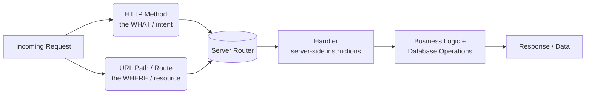
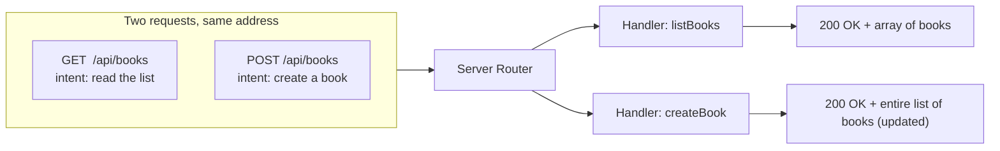
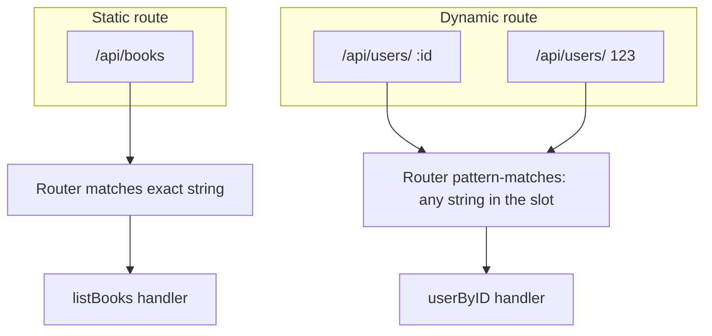
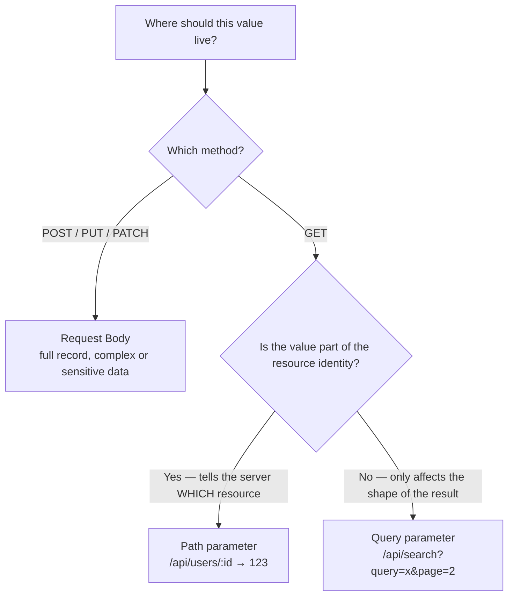
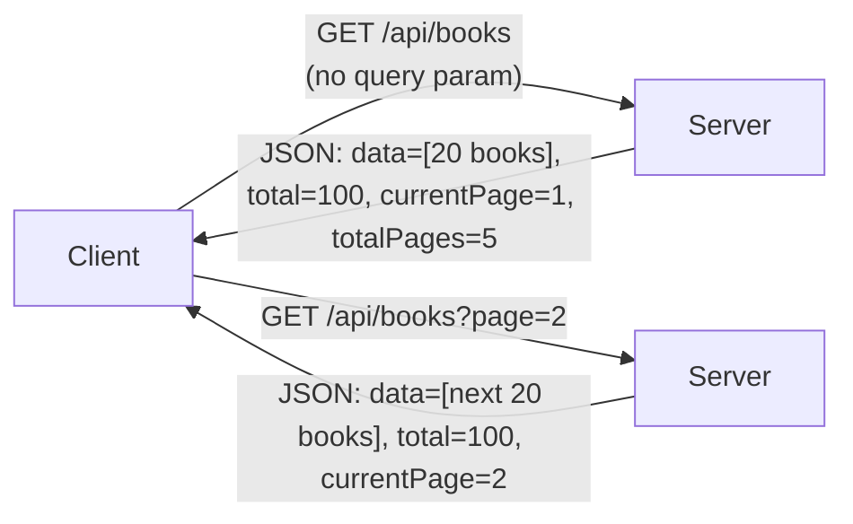
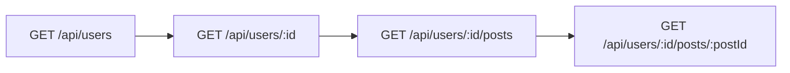
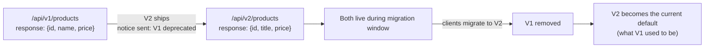
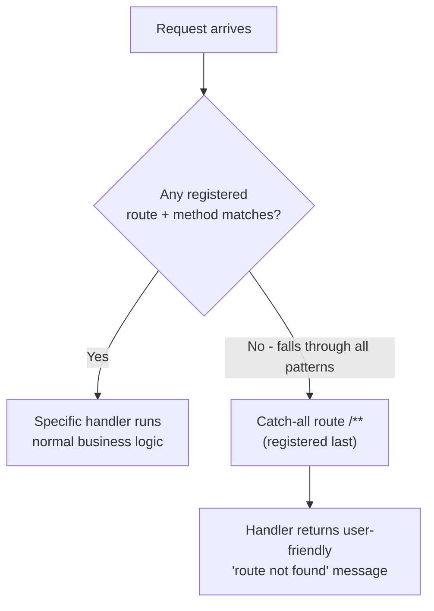
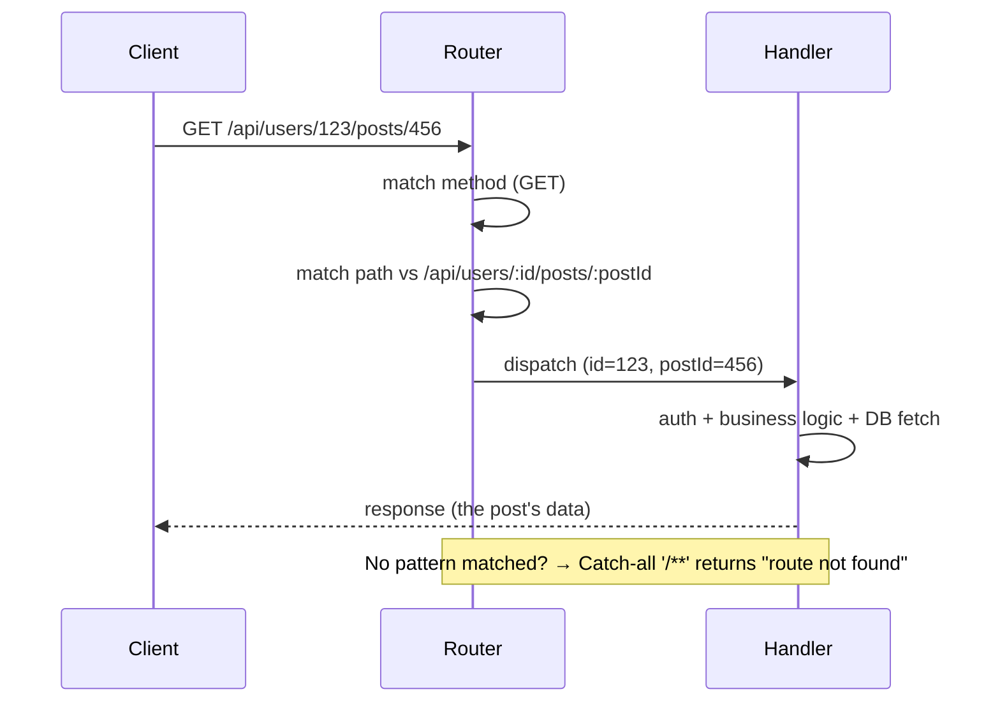

# Part 06 — What is Routing in Backend?

> [!info] Video reference
> - **Part 06 of 29** in the playlist [[_00 - Backend from First Principles - Index]]
> - **Watch on YouTube:** [6. What is Routing in Backend? How Requests Find Their Way Home](https://www.youtube.com/watch?v=SubuU1iOC2s)
> - **Duration:** 24:03 | **Views:** 91,254 | **Likes:** 2,172 | **Published:** 2024-12-09
> - **Speaker/Channel:** Sriniously
> - **Description (head):** "In this video we understand what is routing, the concepts behind and what are some components of routing."

> [!abstract] In this chapter
> This chapter answers a deceptively simple question: when a request arrives at a server, **how does the server know which piece of code should handle it?** The answer is *routing* — the mapping of a request (its HTTP method + its URL path) to a specific *handler* (the server-side logic that executes). We first nail the mental model (*HTTP methods express the "what" of a request, routing expresses the "where"*), then tour every component of routing one by one: **static routes**, **dynamic routes**, **path parameters**, **query parameters**, the *body vs path vs query* decision, **nested routes**, **route versioning and deprecation**, and finally the **catch-all route** that answers requests no route matches (the 404). Every concept is demonstrated against the presenter's familiar **BB Suite React app**, and the video — like the whole course — is deliberately **framework-agnostic**: the conventions shown apply to Java, Python, Node.js, Go, Rust and any other server language.

---

## Video timeline

| Timestamp | Section |
|-----------|---------|
| 0:00   | The "what" and "where" of a request — why routing exists |
| 0:52   | Definition: routing = mapping URL + method to server-side logic |
| 2:02   | Demo setup (BB Suite interface + React app) |
| 2:17   | First demo request: `GET /api/books` |
| 3:21   | Same route, different method: `POST /api/books` |
| 4:12   | Method + route = a unique key for a handler |
| 4:32   | Static routes |
| 5:25   | Dynamic routes and path parameters (`/api/users/:id`) |
| 8:20   | Readability — the whole idea of REST |
| 9:14   | Query parameters (`/api/search?query=...`) |
| 10:25  | Why query params exist (GET has no body) |
| 12:30  | Pagination example: `?page=` & `?limit=` |
| 15:09  | Nested routes (`/api/users/:id/posts/:postId`) |
| 18:54  | Route versioning and deprecation (`/api/v1/products` vs `/api/v2/products`) |
| 22:14  | Catch-all route (`/**`) and 404 handling |
| 23:39  | Summary — what you now need for any backend codebase |

---

## [00:00] The "what" and "where" of a request

Every HTTP request carries two fundamental ideas inside it, and confusing them is the single most common beginner mistake. The previous chapter ([[05 - Understanding HTTP for Backend Engineers]]) established that **HTTP methods describe your *intent*** — and that intent is itself the *action* you want to perform on a resource: fetch some data, add some data, update some data, or delete some data.

The presenter now introduces the partner concept with an elegant pair of sentences:

> **HTTP methods express the *what* of a request** — your intent, your action, what you want to do on that particular resource (or what you want to tell the server your intention is).
>
> **Routing expresses the *where* of a request** — where you want to send your intention; *which resource* you want to perform your intent on.

Put differently: you must tell the server *what* to do, and *where* to do it. Both pieces are required. A `GET` without a target address is meaningless — fetch *what*? And an address without a method is ambiguous — *what* should happen at that address? Routing is the half of the request that answers "**where do you want to go inside the server?**".

### The running example

The first concrete example in the video:

- the request's **method** is `GET` — your intention is *fetching / getting some data from the server*;
- the **route path / URL path** is `/api/users` — the address of the resource;
- in response, the server returns **an array of users**.

Read aloud, this URL literally says: *"I want to fetch some data. My action is fetching. And from where? From the list of users."* The path (in this case `/api/users`) *is the resource* — the server's word for the thing you are addressing.

> **Resource** — a named thing the server can serve or act upon (a collection of users, a single user, a book, a product). The presenter says we'll learn much more about resources when we study REST API concepts (in *[[11 - Complete REST API Design]]*); for now we can just treat the route path as the address of a resource.

### Putting it together: the request → handler mapping

The two halves combine into one complete instruction:



> **What this diagram shows:** A request arrives carrying two ingredients — an HTTP method (the *intent*, e.g. `GET`) and a URL path (the *route*, e.g. `/api/users`). The **router** inside the server looks at *both* and maps this exact combination to a particular **handler** — a set of server-side instructions. The handler performs the business logic and any database operations that are needed, and the result (the data) is returned to the client as the response.

### The working definition

The video's own summary, delivered early and worth memorising:

> **Routing is basically mapping URL parameters to server-side logic.** And that's all there is to it.

A request is *greedy* in the sense that it carries everything the server needs to make this decision: the method, the URL path, and (as we'll see later) parameters and a body. The server inspects them, maps the combination to the right handler, and that handler does whatever the route demands — business logic, database operations — then returns the data.

---

## [02:02] Demo setup: the BB Suite interface

To make these ideas concrete, the presenter fires up the familiar **BB Suite interface** (the API-testing tool seen throughout the series) together with a **React app**. The React app is used purely to *demonstrate* the routing concepts — it is the client that sends the requests; the backend server receives them. Then the presenter "fires" a series of APIs and analyses what each request and response shows.

---

## [02:17] First demo request: `GET /api/books`

The first request is a `GET`. Looking at the request/response panel, we recognise a part we already learned about in the HTTP chapter:

- the **HTTP method** — this is our *intent* / the *action* we want to perform (`GET` here, but the video notes it could just as well be `PATCH` or any other method);
- the **route** — the *address* of our request: "where do you want to go in the server?" — in this case **`/api/books`**.

> "Books" is called a **resource**. (The transcript caption at this moment reads *"/ API / SL books books is called a resource"* — the doubled word is a caption artifact; the speaker is simply explaining that "books" is the resource.)

When the request goes through, the server responds with data. In the demo the server just sends back some *filler* data to make the mechanics visible, but the presenter stresses: *"typically this is what happens — you send a request, the server does some kind of authentication if it's there, then it sends the data."* (Authorization/authentication is covered in depth in *[[08 - Authentication and Authorization for Backend Engineers]]*.)

---

## [03:21] Same route, different method: `POST /api/books`

The next request uses `POST`:

- the **intention** is `POST`;
- the **route is still the same**: `/api/books`.

The request goes through the server, creates another book (whatever the resource is), and returns **all the resources again** in the response.

The striking observation: **the route part is identical across the two requests, yet the server does two completely different things.** In the first request — `GET /api/books` — the server *lists* books. In the second — `POST /api/books` — the server *creates* a book and returns the updated list. The only difference was the method.

### Method + route = a unique key



> **What this diagram shows:** Two requests share the exact same URL path `/api/books`, but because their HTTP methods differ (`GET` vs `POST`), the router maps them to **two different handlers** — one that lists books and one that creates a book. The method is not decoration; it is half of the routing *key*.

How the server reasons about this, in the presenter's words:

1. The server **first checks what the method is**.
2. Then it **checks the route**.
3. It **concatenates these two** and forms a **unique routing logic** — a unique path.

`GET` + `POST` with the same route will **never clash**, because the methods differentiate the two routes. This is the kernel of how "routing as a mapping" actually behaves in a real server: the method and the route together form the **key**, and that key maps to a **particular handler**.

## [04:32] Static routes

With the basics of routing settled, the video turns to **different types of routes**. The first two examples we already saw — `GET /api/books` and `POST /api/books` — are examples of what are called **static routes**.

> **Static route** — a route with *no variable parameters* inside it. The path is a fixed, constant string. Every request to that path hits the same handler and produces the same kind of response.

Why "static"? *"For obvious reasons — because they don't have any variable parameters inside the route."* There is no part of `/api/books` (the presenter's example is `/api/books`; the caption garbles it as *"SL aa/ books"*) that you could substitute or change:

- the string `/api/books` **stays consistent** — it is a *constant*;
- there is no **dynamic parameter** to think about;
- every request to this route returns **this kind of response** — the same shape of data.

> **What "dynamic" would mean** — a *variable* part of the path whose actual value changes from request to request (a user ID, an order number, a search term). A route with none of those is static. The distinction matters because matching a static route is a trivial string comparison, while matching a dynamic route requires *pattern matching* — which we now cover.

---

## [05:25] Dynamic routes and path parameters

The next two requests in the demo:

- request #1: **`GET /api/users/123`**, and
- request #2: (fired alongside it) similarly shaped.

Take the first. The method is `GET`. The route is `/api/users/123`. What is that `123`? It is *supposed to express* **the ID of the user** — the application of this API endpoint is: *we can fetch the details of one particular user using the ID of the user inside the route parameter*.

When we make this request, the server can **extract this particular ID from the route path** and do whatever operation it wants with it — for instance, *fetching the user from the database* and returning the user's details. In this demo, the server simply fetches the user ID and echoes it back in the response, purely to *demonstrate that it got the ID from the route path*.

The video deliberately stays out of code for most of the episode ("in this video we are not going to get too much into the code, we just want to understand the concepts behind it") — but it makes **one exception**, and it is the most important code snippet of the chapter.

### The route-matching code: the `:id` convention

```js
// How the route-matching part of a server looks
r.get("/api/users/:id", (request) => {
  // whatever handler is waiting to respond to this kind of route
});
```

Read the presenter's annotation of this code:

- `r.get(...)` — this part matches the **method** in the server (here: `GET`);
- `/api/users/...` — this part matches the **route**;
- `:id` — the *dynamic parameter placeholder*.

So the server is saying: *"if any request comes in **with the method `GET`** and **with the route `/api/users`** and **with any kind of string in the next position**, route it to this Handler — whatever Handler is waiting to respond to that kind of route."* The **colon** (`:`) marks a slot that accepts *any string* that arrives in that position.

### The industry-wide convention

> **The colon convention**: you will find `:paramName` in *any* kind of server — Java, Python, Node.js, Go, Rust — "it does not matter". This is the industry-wide practice: `:id` says *"this is a dynamic parameter that the user is going to send in place of `id`"*.

In our demo request, `GET /api/users/123`:

1. the **method** matched (`GET` == `GET`);
2. the **path segments** matched segment-by-segment — `/api`, then `/users`;
3. the segment `123` — which *looks* like a number but — **got inserted into the `:id` slot**.

### Numbers, special characters: everything becomes a string

A crucial detail the presenter calls out: *"in route parameters, or in route paths, whatever — number, special characters — everything is converted into a string."* So even though `123` reads like an integer, inside the routing layer it is treated as a **string** and inserted into the `:id` slot as such. (If the handler needs a real number — to query a database with an integer ID — *parsing/converting* the string is the handler's job; that topic comes up in *[[07 - Serialization and Deserialization for Backend Engineers]]*.)

### It is clearly readable — the whole idea of REST

Stopping to *read* the request — `GET /api/user/123` — the presenter shows how the route reads almost like a sentence:

- **`GET`** → *"fetch me some data"* (the method — what);
- **`/api/user`** → *"where is that data?"* (the route — where);
- **`123`** → *"whose data is that? …It is of the user with ID 123."*

The route is *self-describing*. And the presenter connects this to the philosophy of the entire episode:

> That's the whole idea of **REST APIs** — because they provide a **human-readable construct to routing**. This is what makes an endpoint *communicative*: a client, and a human engineer reading it, can understand what the endpoint does at a glance.

> **Captions note:** the transcript switches between `/api/users/123` and `/api/user/123` (singular) — the speaker uses the plural form for the registered route and the singular form for the natural-language reading. These are the same route; we canonically write **`/api/users/:id`**. ⇢ *inferred* that this alternation is casual speech, not two different routes.

### Terminology: route parameter = path parameter

This kind of route is a **dynamic route**, and the dynamic position has two equally common names:

> **Route parameter** (a.k.a. **path parameter**) — the variable part of a dynamic route, **part of the route itself**, sitting right after a forward slash (`/`). The name tells you *where it lives*: it is inside the *path*.

The presenter flags this as a recurring source of confusion: there are **two different kinds of parameters** with overlapping names — *path parameters* (because they go right after the forward slash, they *are* part of the route) and *query parameters*, which we turn to next.



> **What this diagram shows:** A static route like `/api/books` is compared against the incoming path as an exact string — the router just checks characters match. A dynamic route like `/api/users/:id` is a *pattern*: the router checks `/api` and `/users` literally but treats the final position as a wildcard slot that any string (here `123`) can fill. The matched value becomes a **path parameter** handed to the handler.

## [09:14] Query parameters

For the next demo, the presenter types some value into the API-testing tool and hits the API. The request looks like this:

```
GET /api/search?query=some+value
```

Breaking it into its parts:

- the **method**: `GET` (the intent);
- the **route**: the whole part from `/` — `/api/search?query=some+value` — but split into finer pieces:
  - `/api/search` — the *address route* the server uses — together with the method — to **match a Handler**;
  - `?query=some+value` — the **query part**.

> The presenter notes the URL is "more readable here than here" (the auto-caption is garbled — ⇢ *inferred* to mean the full URL shown in the address bar is more readable than the compressed display inside the tool). The substance: everything after the `?` is the query.

### Anatomy of a query parameter

What follows the `?` is a **key–value pair** (or several):

- `?` — the **question mark**, the marker that says "the query starts here";
- **key** — the parameter name (`query`);
- `=` — the assignment between key and value;
- **value** — what the user typed (`some+value`; the `+` is how spaces get encoded in a query string).

> **Query parameter** — a key–value pair appended to the URL after a `?`, used to send *extra, optional* information along with the request. The server routes the request on the base path (`/api/search`) and reads the query values separately.

---

## [10:25] Why query parameters exist (GET has no body)

The presenter now motivates *why* this mechanism exists — and the explanation is one of the cleanest arguments in the episode.

**Context — the request body.** In `POST` requests — and in `PUT` requests — we have **the body of the request**: a container we can use to send user-defined values into the server. For methods that carry a body, arbitrary data has a natural home.

**The problem — `GET` has no body.** In REST APIs, *"GET requests don't have a body."* So if you want to send some value along with a `GET`, where does it go?

**Option A — stuff it into a path parameter.** Technically possible — the presenter demonstrates: instead of `/api/search?query=some+value`, you could write `/api/search/some+value`. But:

- it is **very hard to maintain**; and
- it **defeats the whole purpose of REST API** — providing *semantic expressions* to API endpoints.

Why does it defeat the purpose? Because path parameters are *semantic*: `/api/users/123` means a specific identity ("the user whose ID is 123"). A random, arbitrary user-typed search string is *not* a resource identity — burying it in the path muddies what the path is trying to *say*.

**Option B — the query parameter.** This is precisely the concept the chapter introduces: *"in query parameters we can send a set of key–value pairs in a request."* Typically used with `GET` (because there is no body) to send **metadata about the request** — the knobs and settings that describe *how* the server should produce the result, without pretending to be part of the address.

### Path parameter vs query parameter vs body — when to use which



> **What this diagram shows:** The choice of where to put a value follows two questions. First, the method: if the request carries a body (`POST`, `PUT`, `PATCH`), that's where substantial or sensitive payload data belongs. For `GET` (which has no body): if the value *identifies the resource* — the specific *which* — it is a **path parameter** (`/users/123`); if it merely *modifies how the server responds* — search terms, page number, sort order — it is a **query parameter** (`?query=...`). Path params are part of *what* you're addressing; query params describe *how* the address should be served.

---

## [12:30] Application example: pagination with query parameters

The video's main application of query parameters is **pagination** — fetching *paginated* data. (The series covers pagination properly later; here the presenter uses the concept because "you must have encountered it at some point".)

### The endpoint and its response

Suppose we have an endpoint that fetches a list of books **in paged format**:

```
GET /api/books
```

When you hit it, the server returns an object — a **JSON** — with roughly this shape:

```json
{
  "data": [
    { "id": 1, "title": "...", "author": "...", "price": 10 }
  ],
  "metadata": {
    "total": 100,
    "currentPage": 1,
    "totalPages": 5,
    "limit": 20
  }
}
```

- inside `data` you have the array of books (this page's chunk);
- alongside it the server returns **a set of metadata about the response** — `total` (how many books exist in total), `currentPage`, `totalPages`, `limit` — the exact fields depend on the implementation, the presenter stresses, "but something like this".

### How the server decides what to send

The **purpose** of these query parameters: *"the server will paginate the data in the response and it will send a chunk of data."*

- Say the **default limit is 20** (there is some default limit).
- The server sends **20 books from the start**, and lets you know:
  - how many books exist **in total** — say **100**;
  - the **current page** — page 1;
  - the **total pages** — dividing 100 by 20 gives **5 pages**.
- These are "all the kinds of values you'll receive from the server".

### The client uses the metadata to make the next request

The key idea — the *round-trip*:

> The client can use the response metadata to make **subsequent requests** according to the client's needs.

To fetch the next page, the client re-requests the same endpoint but **adds a query parameter**:

```
GET /api/books?page=2
```

Because the server's **default** was page 1, the first request could send *no query parameter at all*. But in the second request we want to tell the server: *"we want the response for page two."* In a `GET` request, that information travels **via query parameters**.



> **What this diagram shows:** A paginated API in conversation. The client's first `GET /api/books` needs no query parameter — the server falls back to its default page (page 1) and replies with a page of books *plus* metadata (`total`, `currentPage`, `totalPages`). The client reads that metadata and asks for page 2 via `?page=2`. Query parameters are the *dial* the client turns, and the response metadata is the feedback that tells the client which dial to turn next.

### Other common query-parameter uses

Pagination is one application. "Usually APIs send different kinds of parameters in the query," the presenter adds, naming the classic trio:

- **filtering** by some user-defined parameter;
- **sorting** — "what is the order you want to sort in" — **ascending or descending**;
- plus anything else that is best expressed as a key–value pair about the request.

All of this metadata travels *inside the query parameters, in the form of key–value pairs*. The video calls this "basically the uses and the definition of query parameters" — and "this is what the API typically looks like".

---

## [15:09] Nested routes

### Not a type — a practice

The next topic is **nested routes** — and the presenter is careful to frame it correctly:

> Nested routing is **not really a type of routing** — it's just a *practice* that you will see everywhere. In REST APIs, for a semantic expression, we often have to resort to **nesting** different types of resources. The nested route is typically the *result* of that.

When an API has more than one level of "things" that belong to each other (users *have* posts, posts *have* comments), the flat, one-level style of route isn't enough to *say* what you mean. Nesting the resources in the URL path is how REST expresses that ownership, and therefore how well-architected APIs express it too.

### The demo request

```
GET /api/users/123/posts/456
```

The presenter dissects the request/response:

- the **method** — `GET`;
- the route has **three distinct parts**:
  1. a **static part** — `/api/users` (fixed, no variables);
  2. the **first dynamic route/path parameter** — `123` (the user ID);
  3. the **second dynamic path parameter** — `456` (the post ID).

*Why do we do this?* Again — *to express the semantic meaning*. Reading it in words:

> "We want to do a `GET` operation on this route — `/api/users` with the user whose ID is 123 — we want to fetch the details of this user… and we are fetching the **posts** of that user — and to go one level deep again, a **particular post** with ID 456."

### The escalation: one, two, three levels deep

The presenter walks the nesting ladder, showing how **each level is itself a complete, unique route** with its own handler:

| Route | What it means | What the handler returns |
|-------|---------------|--------------------------|
| `GET /api/users` | the whole collection | list of all users |
| `GET /api/users/123` | one specific user (dynamic parameter added) | information of the user with ID 123 |
| `GET /api/users/123/posts` | all posts *belonging to* that user | all posts of user 123 |
| `GET /api/users/123/posts/456` | one specific post of that user | details of post 456 (of user 123) |

Key observations the presenter makes along this ladder:

1. `/api/users` is **static** — when you do `GET /api/users`, it returns the **list of all users**, because "that's what the handler of that match is doing".
2. `/api/users/123` is a **unique route in itself** — "we added a dynamic parameter" — and on the server side it sees the `GET` method, matches a **different handler**, and that handler returns the information of the user whose ID is 123.
3. At `/api/users/123/posts`, "this **expresses a different meaning altogether** — we are fetching the posts of a user with ID 123, all the user's posts".
4. Full nesting — `/api/users/123/posts/456` — narrows all the way to a **particular post with ID 456**.



> **What this diagram shows:** Nested routes as a series of increasingly specific addresses. Each rung reuses the previous rung and *adds* one more level of resource ownership: collection → one user → that user's posts → one specific post. Every rung is a *distinct route* matching a *distinct handler*; deeper nesting means narrower, more specific handling logic (and, in a well-built route table, a more specific semantic).

### Why the name

*"For obvious reasons this is called a **nested route** — because we **nest** different types of information at different levels to express different semantic meanings, and it results in different kinds of responses."*

And the practical note to end the section: nested routing **is pretty convenient**, and "you will see it getting used pretty much everywhere" — any REST API **with even a medium level of complexity** uses it.

## [18:54] Route versioning and deprecation

"Next up we have an interesting concept called **route versioning and deprecation**." The presenter fires two APIs and analyses them side-by-side.

### The two requests

- **`GET /api/v1/products`** — "it looks pretty much like our earlier request, except it has this keyword which is **`v1`**";
- **`GET /api/v2/products`** — same shape, but **`v2`**.

> **Route versioning** — a very common practice in API endpoints — servers which have a REST API interface — where a **version number is embedded in the route path** (`/api/v1/products` vs `/api/v2/products`) to distinguish different flavours of the same interface.

### Why the responses differ: the demo

Compare the two responses:

**v1 — `GET /api/v1/products`:**
```json
{
  "data": [
    { "id": 1, "name": "...", "price": 10 }
  ]
}
```
The response has a `data` field, an array, and each object (JSON) has **`id`, `name`, `price`**.

**v2 — `GET /api/v2/products`:**
```json
{
  "data": [
    { "id": 1, "title": "...", "price": 10 }
  ]
}
```
Again `data` and an array — but each object now has **`id`, `title`, `price`**: the field **`name` became `title`**.

"This is a pretty trivial example," the presenter concedes — the *real* use of versioning is far more consequential. The story proceeds in steps.

### The motivating scenario: changing requirements, breaking changes

The presenter's scenario:

> You have an API endpoint and you are returning data in a particular format. Later, **new requirements come in** — say you were earlier serving a **web app**, and in the future you are serving a **React Native app** — *an Android app or a Flutter app* — for that entity or that device. You had to **change the response of your data**.

This is the crisis every live API eventually faces: your response format was *locked in* by clients that already depend on it (the existing web app), but new clients need a different shape. What do you do?

### Option 1 — change the whole route *(bad)*

Your first option: **change the whole route** — change the whole *route-matching part*. Say you rename it:

```
GET /api/new-products
```

Problems: you break everything that already uses the old address, and the URL no longer describes the resource clearly.

### Option 2 — add versioning *(the point of this section)*

Your second option — and the practice the chapter teaches — is to **encode the version in the path**:

- **version one** of our API served responses in the old format;
- new requirements came in;
- **version two** serves the new format.

### The two payoffs of versioning

The presenter lists them explicitly:

1. **It expresses your intention very clearly.** "You have the version-one response, and you have the version-two response" — the contract between client and server is visible *in the URL itself*. Nobody has to guess which format you're using.
2. **You did not have to change your whole route.** You did not have to do `/api/new-products` — the version prefix absorbs the change, and the rest of the path stays meaningful.

### Eventually deprecating an old version

The killer feature is the *lifecycle* it enables — **deprecation**:

> You can **eventually deprecate V1** — send a notice to your frontend engineers that after V2 is released, **V1 is deprecated**. In the next release, all the engineers can eventually **migrate to V2** — they have this **window**, a particular window of opportunity to migrate the request endpoints to the V2 format — and eventually you **completely get rid of V1**, and you make **V2 "the V1"** (V2 becomes the new base/current version).



> **What this diagram shows:** The versioning lifecycle. V1 serves the world; when requirements change, V2 ships alongside it with a new response shape. During the migration window *both* routes live, so existing clients are never abruptly broken. After the frontend/Android/Flutter clients migrate to V2, the team removes V1 entirely, and V2 takes over as the stable "current" version — the whole cycle can then repeat for V3.

### The summary sentence

The presenter's closing point makes the strategic value explicit:

> You have a **very stable and complete workflow** to add new structure to your API endpoints, and to add **breaking changes** to your API endpoints — using this workflow, your engineers (your client) have a **window** where they have the opportunity to migrate to the new structure. **That's the use of route versioning and deprecation.**

---

## [22:14] The catch-all route (404 handling)

"In the end," the presenter says, "we have something called the **catch-all route**." And the demo is revealing: they send a request to a route *the server does not serve at all*:

```
GET /api/v3/products
```

### What happens when no route matches

At this point, "the server does not serve responses for this route — **it does not have a handler**; it does not cater to requests coming into this endpoint." The presenter describes every server's strategy:

> Typically what the server will do is — in the end, after serving all the different routes and all the methods associated with those routes — register a **catch-all**:

```
API /api/**        →  (registered last)
```

"**Whatever request**, after going through all the previous route-matching algorithms, **reaches here**, will be mapped to a Handler" — and that handler sends **a user-friendly message**:

> *"The route which you are requesting — this route **does not exist** — this route is **not found**."*



> **What this diagram shows:** The routing decision every server makes. Each request is compared against the table of registered routes (method + path patterns, in the order they were registered). If one matches, its handler runs. If *nothing* matches, the request "falls through" the table until it reaches the **catch-all** — a wildcard route registered *last* — whose handler returns a friendly "route not found / doesn't exist" message instead of giving up silently.

### Why bother — the alternative behavior

Why do servers add a catch-all at all? Because of **what would otherwise happen**:

> "Instead of just sending a **null response** — which is the default behavior **if you don't do catch-all handling** — we are just sending a **user-friendly message** to let the client know that **we don't cater to this endpoint**."

A silent null is uninformative and dangerous: the client can't tell a "route really doesn't exist" from an "internal error swallowed it". The catch-all converts an implicit failure into an *explicit, human-readable contract* — the HTTP-level equivalent of a **404 Not Found** response. ("That's all catch-all route is about.") The presenter teaches it as the final, defensive layer every routed server should have: *specific handlers first, catch-all last.*

---

## [23:39] Summary — what you now know about routing

The presenter wraps the whole chapter in a single sentence of scope:

> "With that we have covered **pretty much all the concepts that one needs to know before diving deep** into different kinds of routing — and all the components of routing, like **query parameters, path parameters**, and all the **nested dynamic parameters**."

And the payoff is stated plainly — this chapter's material is the *entry ticket* to any real backend codebase:

> "That's all pretty much you need to know to **get into a backend code base**, and **understand the routing parts**, and **make changes to it**, and **add new things**."

## Putting it all together — how a request "finds its way home"

Let's trace the whole journey once, end-to-end, with one concrete routing example — the exact kind of URL a real backend router handles every day:

```
GET /api/users/123/posts/456
```

1. **The request arrives** at the server, carrying its two routing ingredients: the method `GET` (*the what*) and the path `/api/users/123/posts/456` (*the where*).
2. **The router reads them both.** It holds a table of registered route patterns — static segments, dynamic `:param` slots, and per-method entries. The server checks the method, then walks the path segment by segment: `/api` matches, `/users` matches, `123` fills the `:id` slot, `/posts` matches, `456` fills the `:postId` slot.
3. **A handler is chosen.** That exact `(GET, /api/users/:id/posts/:postId)` combination maps to *one* handler — the code responsible for "fetch a single post of a single user".
4. **The handler extracts the parameters** — `id = "123"`, `postId = "456"` (strings, per the routing layer) — and runs the server-side logic: authentication if present, then the database operation that fetches the post.
5. **The response travels back.** The handler returns the data; the server sends it to the client.

If no registered pattern had matched, the request would have *fallen through* the table to the **catch-all** (`/**`), which answers "this route does not exist" instead of leaking a null.



> **What this diagram shows:** The complete journey of one request. The client sends `GET /api/users/123/posts/456`. The router matches the method, pattern-matches the path (resolving `:id` → `123` and `:postId` → `456`), and dispatches to the one handler registered for that combination. The handler does authentication plus business/database logic and returns data to the client. The side-note: any request that fails every pattern falls through to the catch-all, which politely reports the route was not found. This is routing's entire job in one picture: **turn (method, path) into (handler), let the handler do the work, and send the result home.**

---

## Key Takeaways

- **Routing is the "where" half of a request.** HTTP methods express the *what* (intent/action); the *route* expresses the *where* (which resource/address). Routing is "mapping URL parameters to server-side logic."
- **Method + route = a unique key.** The server checks the method, checks the path, concatenates them, and maps that combination to one handler. `GET /api/books` and `POST /api/books` are *two different routes* that never clash.
- **Static routes** have no variable parts (`/api/books`) — the path is a constant string and always produces the same kind of response.
- **Dynamic routes** contain variable positions written with the industry-wide **colon convention** (`/api/users/:id`). Any string arriving in that slot is captured as a **path parameter** — and route values are *always strings* in the routing layer, even if they look like numbers.
- **Path parameters live in the path** (right after a forward slash) and carry *semantic identity* ("the user with ID 123"). **Query parameters** live after `?key=value` and carry *metadata about the request* (search terms, page, limit, sort order, filters).
- **Why query params exist:** `GET` requests have no body, and cramming arbitrary user input into the path (e.g. `/api/search/somevalue`) is hard to maintain and defeats REST's semantic, human-readable routing. So `GET` uses query parameters.
- **Body vs path vs query:** body (for `POST`/`PUT`/`PATCH` and rich payloads) vs path (values that *identify the resource*) vs query (values that shape *how* the response is produced) — see [[09 - Validations and Transformations for Backend Engineers]] for what happens to this data next.
- **Nested routes** (`/api/users/:id/posts/:postId`) are a *practice*, not a type: nesting resources at different levels expresses ownership and yields distinct semantic meanings — a distinct handler at every rung. Used in essentially every medium-complexity REST API.
- **Route versioning** (`/api/v1/products` → `/api/v2/products`) expresses intent clearly, avoids renaming whole routes, and enables a **deprecation window**: old clients migrate during the window, then the old version is removed and the new one becomes current.
- **The catch-all route** (`/**`), registered last, catches everything that matches nothing and returns a user-friendly "route not found" message — instead of the default null response. It is the HTTP-world's 404.
- All of this is **framework-agnostic**: the same conventions (`:param`, static vs dynamic, query strings, catch-alls) appear in Java, Python, Node.js, Go and Rust backends alike.

---

## Related Notes

- **Map of contents:** [[_00 - Backend from First Principles - Index]]
- **Prev:** [[05 - Understanding HTTP for Backend Engineers]] — where the "what" of requests (methods, headers, status codes) comes from
- **Next:** [[07 - Serialization and Deserialization for Backend Engineers]] — what happens to the data travelling along these routes
- **Also relevant (later):** [[11 - Complete REST API Design]] (resources, versioning in full depth), [[08 - Authentication and Authorization for Backend Engineers]] (the pipelines routes dispatch into), [[10 - Controllers, Services, Repositories, Middlewares and Request Context]] (what a handler actually does)
- **Vault quick notes:** [[Routing]], [[HTTP]]

---

> [!note] Source fidelity
> This note is written from the video transcript. Where the auto-generated captions were unclear, the meaning was inferred and marked with ⇢ *inferred* (for example, the `/api/user` vs `/api/users` alternation and the garbled "SL aa/ books" reading of `/api/books`). All routes, examples, definitions and conventions come directly from the video; the code snippet shown is the presenter's illustrative route-matching snippet, and the JSON examples reconstruct the response shapes the presenter describes aloud.