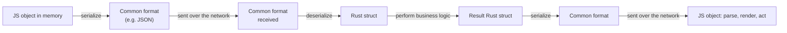
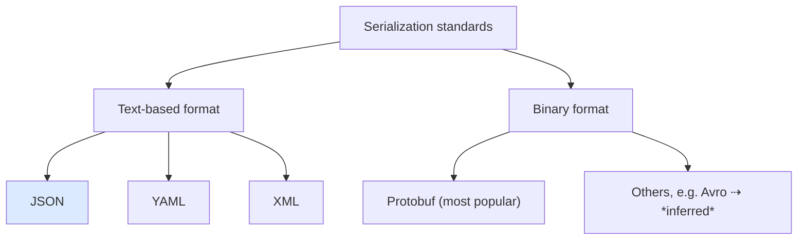
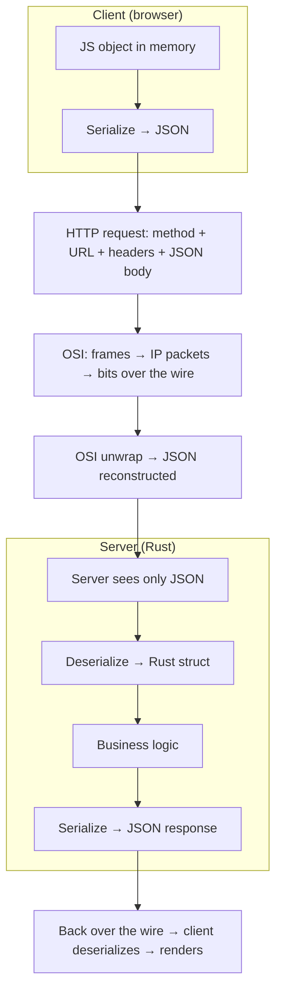

# Part 07 — Serialization and Deserialization for Backend Engineers

> [!info] Video reference
> **Title:** 7. Serialization and Deserialization for backend engineers
> **Channel:** Sriniously (playlist: *Backend from First Principles*, video 07 of 29)
> **URL:** https://www.youtube.com/watch?v=vzg90tY3uM0
> **Published:** 2024-12-11 · **Duration:** 21:48 · **Views:** ~71.4k
> **Description hook:** "In this video we understand what is serialization and deserialization, where do we use it, why do we use it and the importance of it."

> [!abstract] In this chapter
> - What serialization (object in memory → one common, agreed text/binary form) and deserialization (that form → object again) actually are.
> - **Why** the network forces this: in-memory data is typed, nested and specific to one language, while transmission requires a flat, shared, language-agnostic format.
> - **Where** the signal lives in the stack: your backend only ever sees JSON at the application layer; everything below (frames, IP packets, bits) is the OSI model's business, not yours.
> - The two families of serialization standards — **text-based** (JSON, YAML, XML) vs **binary** (Protobuf and friends) — and the trade-offs between them.
> - **JSON, dissected**: the grammar (braces, double-quoted string keys, legal value types, nesting), why keys are always strings, and why it reads like a JavaScript object.
> - A **live walkthrough** of the `POST /api/books` request/response from the earlier routing demo, watched through Postman's HTTP history.
> - The full client→server→client serialization flow, plus inferred extensions (storage, caching, queues, edge cases, security) clearly marked as beyond the video.

---

## Section 1 — Why "making sense of data" is the whole problem

### [00:00] The setup: client, server, and the request

The video opens by re-establishing the picture from earlier chapters. We have a **client** — say a browser like Chrome — which in typical technical language is called the **front end**. We usually communicate with a **server** running either on our own machine (`localhost`) or somewhere remote in the cloud — AWS, GCP, Azure, anywhere.

The client and the server communicate over the network. There are several means of doing this:

- **HTTP** — our traditional REST API endpoints;
- **gRPC**;
- **WebSockets**.

Because this series focuses on HTTP / traditional REST-style communication, the video fixes the client as a **JavaScript app** — React, Angular, Vue, or any JavaScript framework or library. Most client-side apps are built with JavaScript and are highly interactive.

To send a request to the server, the client makes an HTTP request (covered in the previous videos). A **GET request** looks roughly like:

```
GET /some-path HTTP/1.1
Host: domain.com
```

A **POST request** has the same shape but carries more: the URL, then the **headers**, and below the headers the **request body**. That is how the front end sends the server all the information the client wants to transmit. The server responds with some response that the *client* must be able to parse and make sense of.

> The entire focus of this session is precisely that: **how clients and servers make sense of the data being sent and received.**

### [00:04] The cross-language question: a JavaScript client and a Rust server

To make the problem concrete, the video proposes that the client is a **JavaScript app** while the server is built in **Rust**. In JavaScript, we send something like an object in the request body:

```js
// JavaScript client — an object we want to send
{
  name: "some string"
}
```

The request body reaches the Rust server. The question is: *how does the server take this data and make sense of it — in its own format, its own data types?* JavaScript and Rust have **completely different data types**:

- **JavaScript** is a completely dynamic language; it is **not compiled**.
- **Rust** is **very strict about types** and is a **compiled** language — all its data types are different from JavaScript's.

So how does "one data type transmitted over a network" reach another machine somewhere on the internet, get understood, drive business logic, produce a response, and then get read back by the client for rendering UI or further logic? That single question is what serialization answers.

### [00:04] A quick OSI-model orientation

Before talking about data transmission over the internet, the video recommends a high-level grasp of the **OSI (Open Systems Interconnection) model**. CS students may already know it; if you don't, you don't need to master it (IP packets, data frames, etc.), but a broad overview of how the layers cooperate to transmit data over hardware is worth having.

```mermaid
flowchart TB
    A["Application layer — where your JSON lives"] --> B["Intermediate layers — data frames, IP packets, transmission ⇢ (per OSI)")
    B --> C["Physical layer — bits (0/1) sent as voltage/light signals"]

    style A fill:#dbeafe
    style C fill:#ecfccb
```

**What this diagram shows:** data leaving your application is progressively repackaged as it travels down the OSI stack — from the application layer (the level you actually write code in) through intermediate layers that produce things like data frames and IP packets, all the way down to the physical layer, where everything becomes bits transmitted as electrical or optical signals. The identical unwrapping happens in reverse on the receiving machine. The video deliberately does not go deeper — it points to the many good YouTube/external resources for a fuller OSI explanation, and declares the deep dive out of scope for this chapter.

---
## Section 2 — The solution: a shared standard

### [00:06] The problem restated

The problem, asked plainly: imagine you must devise a technique (or, in technical terminology, a **protocol**) so that two machines in different locations, connected over the internet (say, over the cloud), can send data to each other and **both parse it and make sense of it in a way that is language-agnostic**.

The obvious and common solution is to figure out a **common standard** — which is just a fancy way of saying: come up with a set of **rules**, and ask both the client and the server to agree that this is the format in which the client sends data and in which the server sends its response. Under that agreement:

1. When sending data, the client **transforms/ converts** whatever it has in its own language (e.g., JavaScript) into this standard format and sends it over the network.
2. When receiving, the server takes the data **from that standard** and converts it into *its own* representation — for example a **struct in Rust** — and understands the data well enough to do whatever it needs to do.
3. When sending the response, the server converts its data (the Rust struct) **back into the common format** and sends it over the internet.
4. The client reads it, **parses it into JavaScript**, and does whatever it needs to do.



**What this diagram shows:** the full round trip of one exchange. Every time data crosses a machine boundary, it must first be lifted out of the sending language's native in-memory representation into the agreed common format (**serialization**), then dropped back into the receiving language's native representation (**deserialization**). The server's Rust struct lives only inside the server; the JS objects live only inside the client; over the wire there is only the common format.

### [00:08] First summary — the definition

Combining the two halves of the operation:

> **Serialization and deserialization** are basically converting data **to and from a common format** so that during **transmission** (and, we'll get to this later, **storage**) it is **domain-agnostic** / in this case **language-agnostic** — meaning machines, servers, and clients from different domains, different languages, and different environments can make sense of the data and respond to it.

Key words to hold onto from this section: *common format*, *transmission or storage*, *language-agnostic (domain-agnostic)*.

## Section 3 — Picking the tools the industry actually uses

### [00:09] "Backend is a huge domain" — the most-used-technologies strategy

The video pauses to make an important meta-note: backend is a genuinely huge domain with **hundreds of technologies** in use in the industry, and it is impossible to understand the concepts behind all of them. The strategy for this video and the whole playlist is to go with the **most used** technologies, because once you are fluent in the mainstream choices you can learn the others along the way as your career progresses.

- **Data transmission:** HTTP, WebSockets, gRPC, etc. → the series sticks with **HTTP**, because REST APIs remain the most common means of communication between clients and servers on the internet. Solid HTTP experience is the foundation from which other technologies can be learned.
- **Databases:** relational (PostgreSQL, MySQL, SQLite) and non-relational (MongoDB, DynamoDB from AWS — among many options) → the series will use **PostgreSQL (Postgres)**: one of the most popular relational databases, used by a lot of companies, and mostly the first choice these days for startups and enterprises.
- **Serialization standards:** the most-used one gets used "80% of the time" (the video declines to commit to a precise number) — and that one is **JSON**.

## Section 4 — The two families of serialization formats

### [00:11] Text-based vs binary formats

Serialization standards split into two broad families:



**What this diagram shows:** there are two flavours of serialization standard. Text-based formats (JSON, YAML, XML) encode data as human-readable characters, while binary formats encode it as compact non-human-readable bytes. The most popular binary format is Protobuf *(the transcript's "protuff" is a mispronunciation of Protobuf; it also names "a etc" formats — rendered here as Avro, marked as inferred)*. Some binary formats get used less for direct HTTP communication but definitely get used for serialization in general. For the rest of the chapter the focus is exclusively on **JSON**, the most popular choice for text-based communication between clients and servers.

*(The video sketches the taxonomy but does not enumerate the trade-offs in words; the following comparison table is an inferred elaboration of the points it implies.)*

| Property | Text-based (JSON / YAML / XML) | Binary (Protobuf, MessagePack, Avro…) |
|---|---|---|
| Human readability | High — designed to be read ⇢ *inferred* | None without tooling ⇢ |
| Size on the wire | Larger (repeats keys, whitespace) ⇢ | Compact — field numbers instead of names ⇢ |
| Parsing speed | Slower (must scan text, allocate strings) ⇢ | Faster — fixed wire layout ⇢ |
| Schema / evolution | Implicit and loose ⇢ | Usually explicit (e.g., `.proto` schema) ⇢ |
| Typical use | REST APIs, configs, logs | Microservice-internal, RPC (gRPC), high-throughput ⇢ |

**What this diagram shows:** a quick side-by-side of why teams choose one family over the other — text maximizes inspectability and simplicity at the cost of bytes and speed; binary maximizes bytes and speed at the cost of readability and (often) requiring a shared schema.

---
## Section 5 — JSON, line by line

### [00:13] What JSON is

**JSON** stands for **JavaScript Object Notation**. From the looks and behavior of it, JSON is very similar to a JavaScript object — which explains the name — but it is **not limited to JavaScript** and is used everywhere. Real-world uses the video names:

- **Configuration files**;
- **HTTP REST API transmission** between clients and servers;
- **Log files** — JSON is a very popular choice for logging application data / server data during runtime.

This chapter narrows the focus to the *transmission* use case.

A typical JSON object looks like this (assembled from the transcript's examples, with the extra fields shown as they look on screen):

```json
{
  "name": "some string",
  "age": 30,                        ⇢ illustrative
  "isActive": true,                 ⇢ illustrative
  "tags": ["x", "y"],               ⇢ illustrative
  "address": {
    "country": "India",
    "phoneNumber": 3456
  }
}
```

Its defining properties:

- **Human readable.** JSON "was made to be human readable" — this is one of its strong points.
- **Fundamental data types.** The value types are basic and familiar to anyone with even a little programming experience.
- It has a **starting brace** `{` and an **ending brace** `}`.
- **All keys are inside double quotes and are strings.** You cannot make any other data type a key: *the keys will always be double-quoted strings*.
- Values can be a **string**, a **number**, a **boolean**, an **array**, or **another object** (so JSON supports nesting — a nested object follows the exact same rules: double-quoted string keys, and the same allowed value types).

The rules compress into a short checklist the video repeats twice, because these are the things you must remember:

1. There has to be a starting brace and an ending brace.
2. Keys are inside double quotes, and they are strings.
3. Values can be a string, a number, a boolean, an array, or a nested object with the same characteristics.

### [00:16] Live demo: watching the earlier books API through Postman

The video re-runs the demo from the previous video (the routing chapter), but this time pays attention to the **format of the request and response**. Using the **Postman** interface, it hits the **`POST /api/books`** endpoint, opens the **HTTP history**, expands the request, and inspects it.

The **request** shows exactly the previously-discussed JSON format:

```json
{
  "id": 5,            ⇢ a number
  "title": "...",     ⇢ a string
  "author": "..."     ⇢ a string
}
```

Braces, keys double-quoted as strings, and values in number and string form. *("one key which is an array", the response key name and actual values are not stated — the concrete `books` name below is inferred. What the video stresses is the shape, not the field names.)* This text gets transmitted over the network.

The **server** receives this request JSON, understands it, takes the `id`/`title`/`author` information, adds it (performs the create business logic), and responds with **another JSON**:

```json
{
  "books": [           ⇢ array key name inferred; transcript says "one key which is an array"
    { "id": 1, "title": "...", "author": "..." },
    { "id": 2, "title": "...", "author": "..." }
  ]
}
```

The response has an opening brace and closing brace, one key whose value is an **array**, and each element of that array is itself an **object in JSON format** — keys double-quoted, values in number and string formats. The client receives this, parses it, understands it, and the demo shows it **rendered** in the client UI.

### [00:17] The backend engineer's mental model: JSON is your whole world at the application layer

Linking the demo back to the OSI discussion: going deep into the OSI model, we know the application-layer data gets converted into **data frames**, into **IP packets**, through the **transmission layer**, and finally into **bits** (0s and 1s) that travel as voltage signals over optical fiber, etc.

The mental model the video wants you to keep is deliberately simple:



**What this diagram shows:** where serialization sits in the request path. The client turns its in-memory objects into a JSON string and hands that string to HTTP; everything below the application layer (frames, packets, bits) is out of your hands. The wire delivers bits, the OSI machinery unwraps them, and the server — at the application layer — again sees only JSON. The server never sees frames or packets; the client never does either. "Whatever format it gets converted into after this point is not of your concern" — as a backend engineer, the application layer converts data into JSON and back, and that's the extent of your responsibility.

---
## Section 6 — The complete picture and final summary

### [00:20] One flowing loop

In real-life scenarios, serialization/deserialization **does not have a lot of concepts**. It is a *phenomenon* in the backend world that exists — you need to know that it exists and see it once, and that is most of the battle. The whole flow, end to end:

1. **JSON gets transmitted** by the client to the server.
2. The server **parses it, understands it, makes sense of it** (deserialization).
3. The server runs its **business logic** and responds with **appropriate data** — again in JSON.
4. The client **parses the response, understands it, makes sense of it** (deserialization again), renders it / does its own logic.

This entire loop is called *serialization and deserialization*, and it is both the client *and* the server that perform both halves depending on which direction they are sending.

### [00:21] The final definition

> **Serialization and deserialization** are the techniques using which data is converted into a **common format** — a **standard format** — so that clients can send data to the server in that format, and the server can receive that data, make sense of it, parse it, perform its business logic, and then send its response *again in that common format*, so the client can do the same thing on its side. They are about dealing with **a standard format so that data is understandable across domains and languages**. That's all there is to it.

| Term | Direction | Example in this chapter |
|---|---|---|
| **Serialize** | In-memory object → common (wire/disk) format | JS object → JSON string |
| **Deserialize** | Common (wire/disk) format → in-memory object | JSON string → Rust struct |
| Common format | The agreed intermediate representation | JSON (or binary, e.g., Protobuf) |

### [00:20] Where else serialization shows up (beyond the video — inferred)

The video mentions that serialization applies "during transmission **or storage**" and promises the storage part later, but the rest of this subsection is an *inferred* elaboration — the exact examples below are standard practice, not stated on screen:

- **Request body parsing** — every `POST/PUT/PATCH` body must be deserialized (⇢ *inferred*).
- **API responses** — every response the server sends must be serialized (⇢ *inferred*).
- **Storing to a database** — rows in Postgres/MySQL are a serialization of your objects; JSON columns do it textually (⇢ *inferred*).
- **Caching (e.g., Redis)** — values cached as strings require serialize on write / deserialize on read (⇢ *inferred*).
- **Message queues** — messages on Kafka/RabbitMQ/SQS travel serialized and must be deserialized by consumers (⇢ *inferred*).
- **Session storage** — user sessions are commonly serialized to a store (⇢ *inferred*).

### Common serialization mistakes, validation, and edge cases (inferred, from the video's rules)

Because the video states the JSON rules so firmly, the common mistakes follow directly from them (each marked ⇢ *inferred*):

- Keys not in double quotes, or in single quotes — **invalid JSON** (⇢ single quotes are invalid in JSON).
- Keys as non-strings (numbers, etc.) — not allowed; keys are always strings.
- Missing closing brace, or trailing commas where the spec forbids them — parse failures (⇢ JSON forbids trailing commas).
- Numbers beyond JavaScript's `Number.MAX_SAFE_INTEGER` (e.g., 64-bit IDs) lose precision on the client — usually handled by treating such IDs as strings (⇢ *inferred*).
- **Dates/timezones** — JSON has no date type, so dates are serialized as ISO strings (or epoch numbers) with the timezone made explicit (⇢ *inferred*).
- **Unicode/escaping** — non-ASCII text must be escaped correctly inside double-quoted strings (⇢ *inferred*).
- **Validation** — deserialization is the natural chokepoint for validating that incoming data matches what the server expects before business logic runs (⇢ *inferred*).
- **Security** — deserializing untrusted payloads can be an attack surface (e.g., unsafe deserialization gadgets in some languages), and unbounded payload sizes can exhaust memory; production backends cap body sizes (⇢ *inferred*).

## Key Takeaways

- **Serialization** = converting an in-memory object (typed, nested, pointer-based) into a common byte/text form that can be stored or transmitted; **deserialization** = the reverse conversion back into a language-native structure.
- We need it because in-memory representations are **not portable**: JS and Rust (for example) have completely different data types, and neither can read the other's raw memory.
- The mechanism is a **shared standard** — an agreed set of rules — so the exchange is **language-agnostic / domain-agnostic**.
- Serialization applies to **transmission and storage**: request bodies, responses, databases, caches, message queues, sessions.
- Formats split into **text-based** (JSON, YAML, XML) and **binary** (Protobuf and others); text is human-readable, binary is compact/fast.
- **JSON** = JavaScript Object Notation, similar to a JS object but universal. Rules: opening + closing braces; keys always double-quoted **strings**; values can be string, number, boolean, array, or nested object.
- As a backend engineer your mental model is: **application layer ⇄ JSON; everything below (frames → packets → bits) is the OSI model's concern, not yours.** The server only ever reads JSON.
- Real knockout summary of the chapter: JSON flows client→server, is deserialized, drives business logic, is re-serialized, and the client deserializes it again — *that whole loop is serialization and deserialization*.

## Related Notes

- **MOC:** [[_00 - Backend from First Principles - Index]]
- **Previous:** [[06 - What is Routing in Backend]] — the `/api/books` demo re-used here.
- **Next:** [[08 - Authentication and Authorization for Backend Engineers]]
- Related in series: [[01 - Introduction to Backend Development]] · HTTP notes from the networking chapters (request line, headers, request body).

> [!note] Source fidelity
> This chapter was written from the full timestamped transcript of the video `07_vzg90tY3uM0` ("7. Serialization and Deserialization for backend engineers", Sriniously). All definitions, examples, the Postman demo, the JSON rules, the OSI mental model, and both summary quotes come verbatim (or near-verbatim) from the transcript. Caption typos ("protuff", "crais/colonia" → braces, "sttb" → text-based) were corrected. Anything in **⇢ *inferred*** (the text-vs-binary trade-off table, concrete JSON field values/key names such as `books`, the Rust struct, and the mistakes/edge-cases/security/storage sections) is an elaboration beyond what the video states, extrapolated from its rules so the notes have no loose ends.