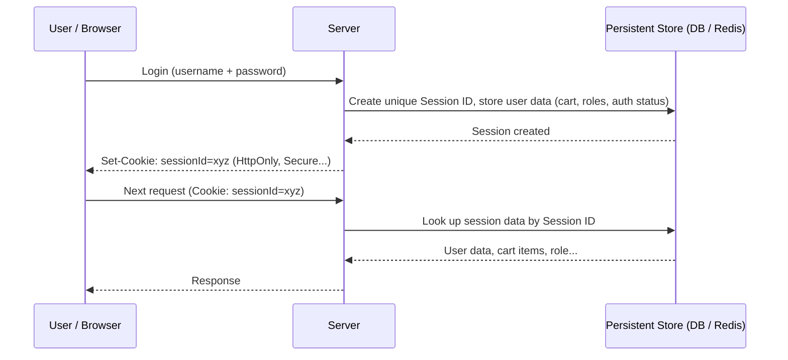
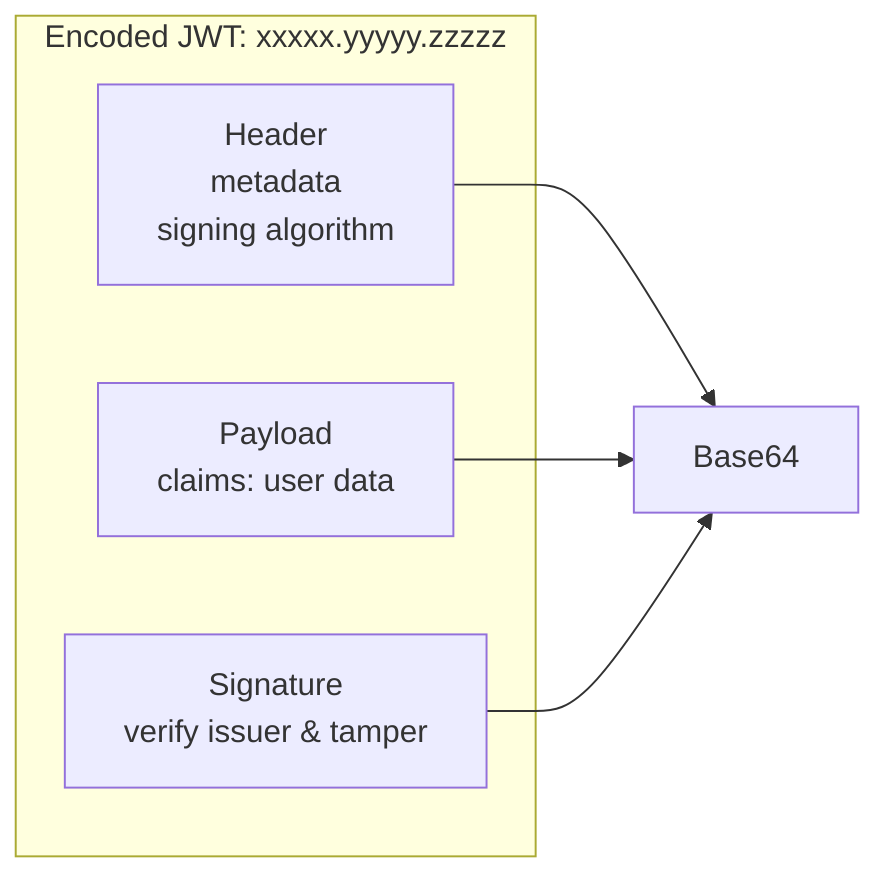
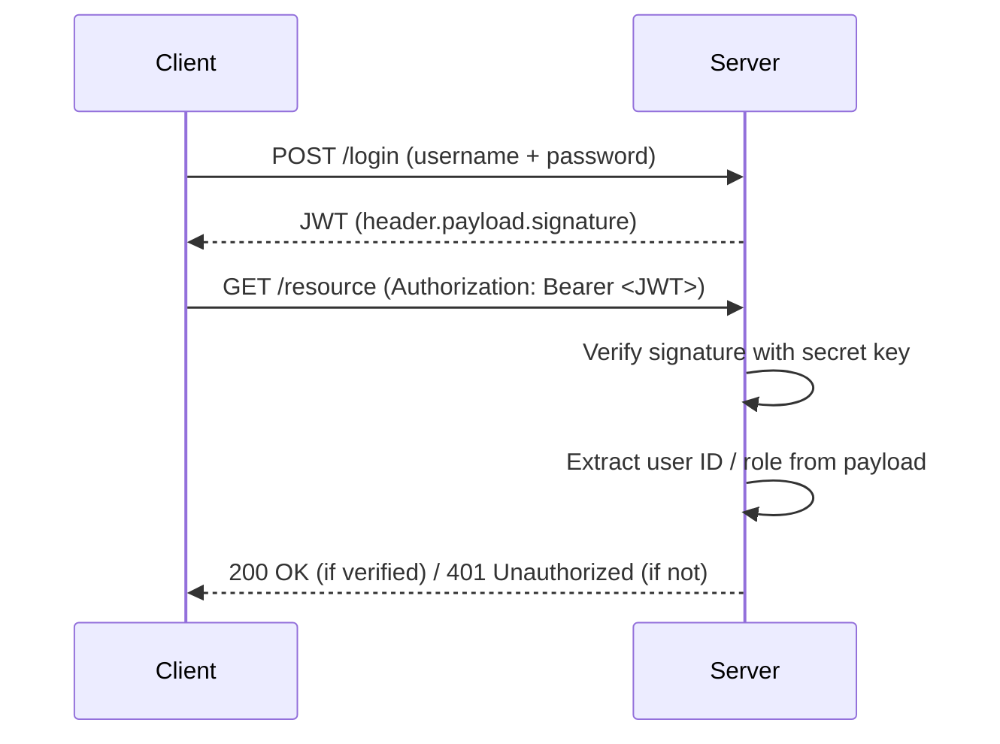
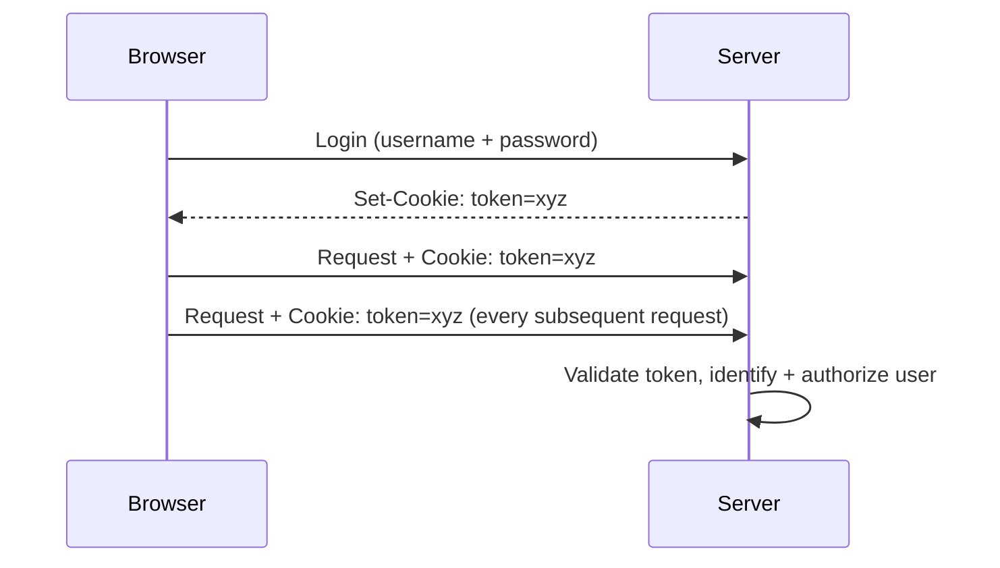
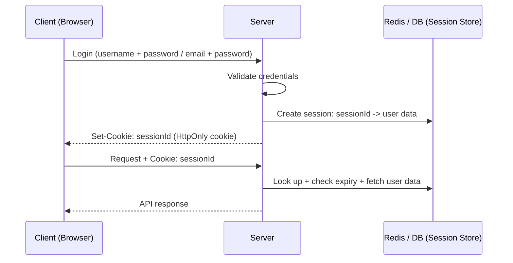
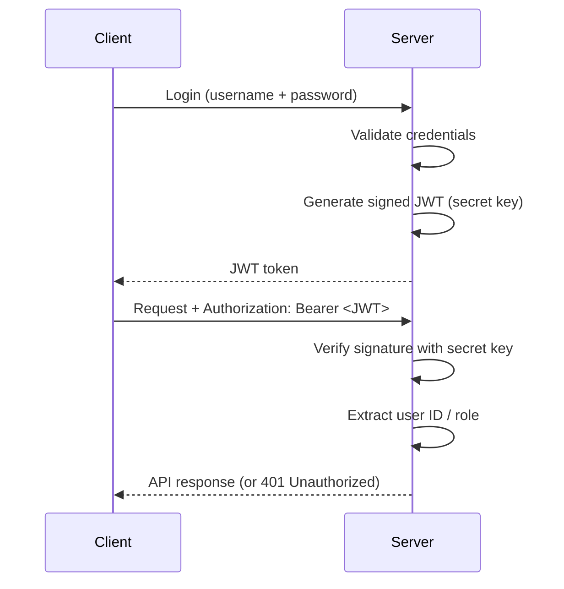
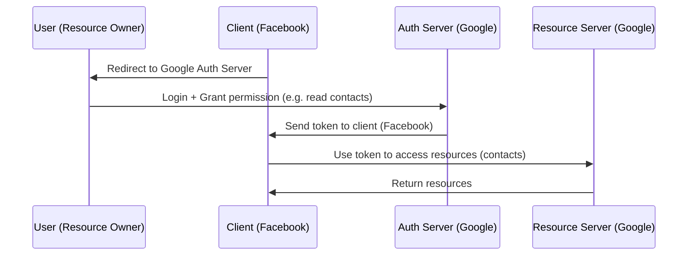
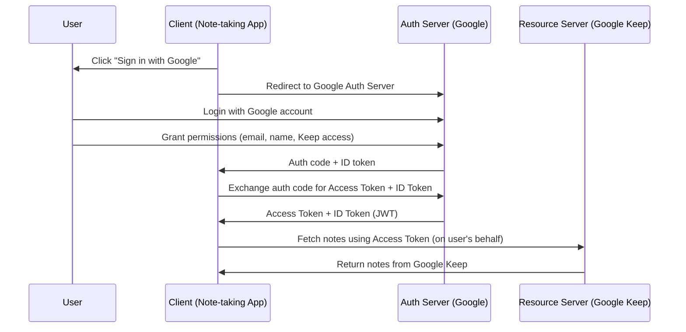
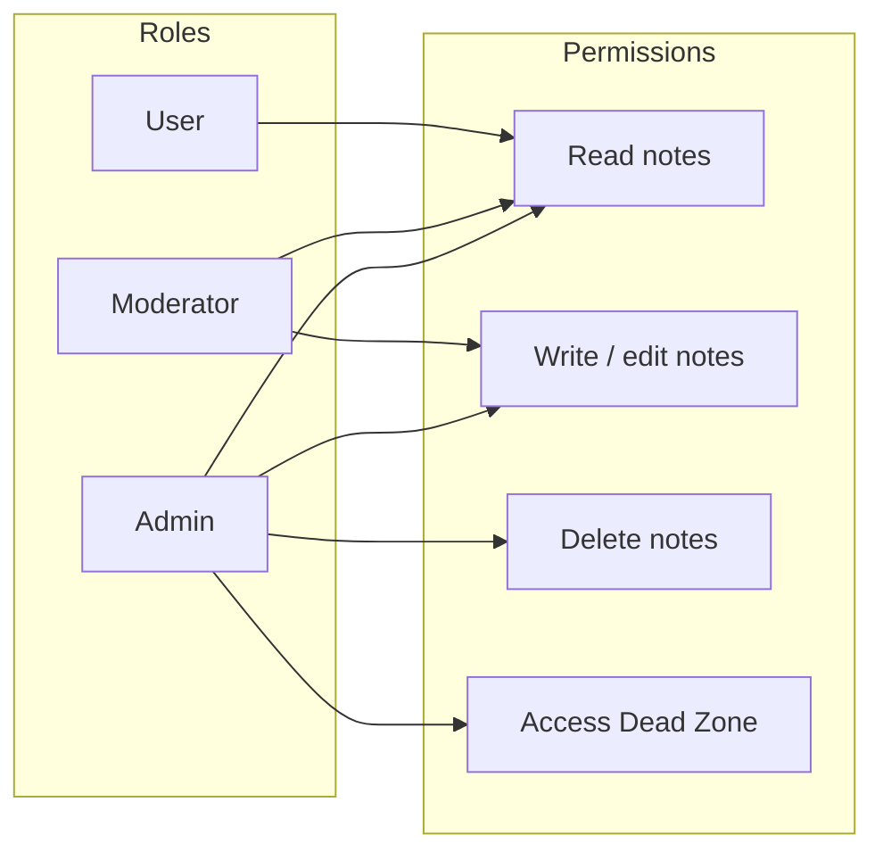
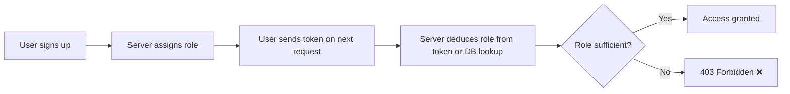

# Part 08 — Authentication and Authorization for Backend Engineers

> [!info] Video Reference
> **Series:** [Backend from First Principles](https://www.youtube.com/watch?v=A95rliroC8Q) — Episode 8 of 29
> **Channel:** Sriniously · **Published:** 2024-12-23 · **Duration:** ~96 min
> **Views:** 137,246 · **Likes:** 2,906

> [!abstract] In This Chapter
> This chapter covers the complete identity story of a backend: what **authentication** (who are you?) and **authorization** (what may you do?) mean, how they evolved from simple credentials to modern sessions, tokens and JWTs, and why passwords are never stored in plain text. It goes deep into cookies and their security attributes (HttpOnly, Secure, SameSite), the anatomy of a JWT (header, payload, signature; HS256 vs RS256), OAuth 2.0 and OpenID Connect, role-based access control, and the threats every backend engineer must defend against — account enumeration through error messages, timing attacks, brute force and token theft.

---

## Table of Contents

- [What are Authentication and Authorization?](#what-are-authentication-and-authorization)
- [The History of Authentication — a Timeline](#the-history-of-authentication--a-timeline)
- [The Three Recurring Components](#the-three-recurring-components)
- [Session-Based Authentication and Cookies](#session-based-authentication-and-cookies)
- [Token-Based Authentication — The Birth of JWTs](#token-based-authentication--the-birth-of-jwts)
- [JWT — Anatomy, Signing, and a Practical Walkthrough](#jwt--anatomy-signing-and-a-practical-walkthrough)
- [Cookies and Their Security Attributes](#cookies-and-their-security-attributes)
- [Stateful vs. Stateless Authentication](#stateful-vs-stateless-authentication)
- [API Key-Based Authentication](#api-key-based-authentication)
- [OAuth 2.0 and OpenID Connect](#oauth-20-and-openid-connect)
- [Authorization — RBAC](#authorization--rbac)
- [Error Messages, Password Storage and Timing Attacks](#error-messages-password-storage-and-timing-attacks)
- [Key Takeaways](#key-takeaways)
- [Related Notes](#related-notes)
- [Resources](#resources)

---

## What are Authentication and Authorization?

### [00:00] The Two-Sentence Summary

Authentication and authorization is perhaps the area of backend engineering we encounter **every single day**. Everyone has logged into platforms, signed up to different services — those are all **authentication flows**. The whole topic collapses into two sentences:

- **Authentication** is "a mechanism to assign an identity to a subject." In technical terms it answers the question **"Who are you?"** in a given context — where the context can be a platform, a website, an operating system, or a phone. The process of finding the answer to *who are you?* is authentication.
- **Authorization** is the process of finding the answer to **"What can you do?"** in that same context — all your capabilities, all your permissions, in technical jargon.

> **What this diagram shows:** The subject first proves identity through authentication. Only once identity is established can the system evaluate authorization — the set of capabilities and permissions granted to that identity. Authentication must come first; authorization builds on top of it.

---

## The History of Authentication — a Timeline

### [02:00] Pre-Industrial Societies — Implicit Trust

The story starts in pre-industrial societies, where authentication was **intrinsic** — it was *implied*. A person's identity was the same as their **recognition**: a respected community member (say, a village elder) could vouch for a person, and deals were sealed with a **handshake** — an act symbolizing mutual recognition and agreement. This was authentication based on **human contextual trust**: it relied on humans and on *trust*.

But as populations grew and interactions extended beyond familiar circles, this implicit-trust mechanism **failed to scale**. A village elder is not trusted in other villages, other countries, other continents. This marked the beginning of the search for **explicit authentication** — proofs of identity that could function independently of any personal acquaintance.

### [04:00] Medieval Period — Wax Seals

Medieval society needed a system that scaled beyond personal recognition, and it produced the **wax seal**. Attached to letters and agreements as a form of authentication, the seal was an early **cryptographic mechanism**: a unique pattern pressed into wax that acted as a signature (the medieval analogue of today's digital and handwriting-based signatures).

Seals functioned as the first widely adopted **authentication tokens** — physical representations of identity that relied on **possession** (*something you have*): if you possessed the seal, you were authenticated. But seals were prone to **forgery**, marking the first recorded instance of **authentication bypass attacks** (skipping authentication with malicious intent). Forging seals led to more sophisticated mechanisms — **watermarks** and **encrypted codes** in trade documentation — which set the foundation for **cryptographic thinking**.

### [06:36] Industrial Revolution — Pass Phrases and Shared Secrets

During the Industrial Revolution, communication systems evolved and the **telegraph** became critical infrastructure. With it came the need for secure message validation. Telegraph operators used **pre-agreed pass phrases** — an early form of **shared secrets**. These were effectively **static passwords**: fixed, non-dynamic strings agreed upon in advance.

This shifted the underlying principle of authentication from *something you possess* (the seal) to *something you know* — knowledge held inside your brain or exchanged in written/verbal communication. It was one step in the evolution towards what we call the **password** today.

### [08:43] Mid-20th Century — Mainframes and the First Digital Passwords

With mainframe computing in the mid-20th century, authentication entered its **first digital phase**:

- In **1961**, researchers at **MIT's Project MAC**, working on the **Compatible Time-Sharing System (CTSS)**, introduced the concept of **passwords for multi-user systems** — so multiple users could share a computer without sharing each other's data.
- Tragically (with hindsight), they stored passwords **in plain text** — a critical vulnerability. This became visible when one of them **printed the password file** on paper.
- That incident marked the *genesis of secure password storage mechanisms*, and motivated the philosophy we hold today: **never store passwords in plain text**.

### [10:22] Hashing — Irreversible Fixed-Length Representations

That philosophy led to **hashing**: cryptographic algorithms that transform a plain-text string into an **irreversible, fixed-length representation** (a *hash*). Key properties:

- The length of the hash is constant regardless of input — a 3-character string and a 100-character string produce the same-length hash (for a given algorithm).
- The same string always produces the same hash.

This era aligned authentication with the core tenets of information security: **confidentiality, integrity, and availability** (the CIA triad).

### [11:42] The 1970s — Asymmetric Cryptography and Kerberos

In the 1970s, cryptographic research exploded, driven by giants like **Whitfield Diffie and Martin Hellman**. Their **Diffie–Hellman key exchange** introduced **asymmetric cryptography**, enabling two parties to establish a shared secret over an *untrusted medium*. Asymmetric cryptography became the backbone of modern authentication protocols and **PKI** (Public Key Infrastructure) systems.

This era also produced **Kerberos** — a **ticket-based authentication** protocol relying on trusted third parties to issue tickets that verified both the user's and the service's identity. Kerberos is the direct **precursor to today's token-based authentication** systems.

### [13:05] The 1990s — MFA and Biometrics

As the internet grew in the 1990s, simple username/password systems were no longer strong enough against the rising tide of **brute-force and dictionary attacks**. This led to **MFA** — Multi-Factor Authentication — combining different principles:

| Factor | Description | Examples |
|---|---|---|
| **Something you know** | Knowledge-based secrets | Passwords, PINs |
| **Something you have** | Physical possession | Smart cards, OTP generators |
| **Something you are** | Biometric identification | Fingerprints, retina scans |

Combining these layers provides combined security for all kinds of applications. **Biometric authentication** emerged as a groundbreaking development, leveraging pattern-recognition algorithms and statistical models to identify users by unique physical traits — though it introduced new challenges: **false positives, false negatives, and template security**. Biometrics alone was not the one-stop solution to every emerging problem.

### [15:04] The 21st Century and the Future

The rise of **cloud computing, mobile devices, and API-based architectures** demanded advanced authentication frameworks — none of the earlier methods were enough on their own. The modern components we still use today include:

- **OAuth 2.0** and **JWTs** (both covered in detail later in this chapter)
- **Zero trust architecture**
- **Passwordless authentication** (e.g. **WebAuthn**), which eliminates passwords entirely, relying on public/private keys stored in hardware devices

And looking ahead, candidates for the future of authentication include:

- **Decentralized identity** (using technologies like blockchain) — promising but still in early experimental stages
- **Behavioral biometrics**
- **Post-quantum cryptography** — since quantum computers, once they become common enough, could break current algorithms like RSA. Post-quantum cryptography is the field of cryptographic techniques that remain *secure even against quantum computers*; some candidate algorithms already exist.

---

## The Three Recurring Components

### [18:34] Sessions, JWTs, and Cookies

Before diving into authentication proper, it helps to introduce the **three components** that recur throughout the entire video — the building blocks of almost every authentication/authorization flow:

1. **Sessions** — server-side memory that lets a stateless HTTP protocol behave statefully.
2. **JWTs (JSON Web Tokens)** — self-contained, signed tokens.
3. **Cookies** — the browser mechanism for carrying identity information on every request.

---

## Session-Based Authentication and Cookies

### [19:01] Why Sessions Exist — HTTP Is Stateless

HTTP was designed to be **stateless**: it treats every request as an isolated interaction, remembers nothing about previous requests, and every request carries all the information the server needs. By design, HTTP had **no memory of past exchanges**. That was ideal for the early web of static pages and images — read-only data where nobody needed continuity between requests.

But as the web transitioned to **dynamic content**, statelessness became a bottleneck. Highly interactive websites — e-commerce sites that must remember your **cart items**, or any site that must keep you **logged in while navigating** between pages — needed **stateful interactions**. That was not a need when HTTP was designed, so the concept of the **session** came into play: a way to establish **temporary server-side context** for each user.

### [21:29] How Sessions Work — Three Phases

> **What this diagram shows:** On login the server creates a **unique session ID** and stores it *alongside* the relevant user data (role, name, cart items, authentication status) in a persistent store. The session ID is sent to the browser as a cookie; every subsequent request carries that cookie; the server uses the session ID to fetch the session record from the store. Sessions are **short-lived** — if a session expires (say after 15 minutes) the server simply creates a new session on the next login.

### [24:05] The Storage Evolution of Sessions

| Era | Storage | Characteristics |
|---|---|---|
| Early implementations | **File-based sessions** | Simple, but serious scalability issues as users grew |
| Growing web apps | **Database-backed sessions** | Faster lookups, persistent storage across server restarts |
| Distributed architectures | **Distributed in-memory stores** — Redis, Memcached | Data kept in RAM instead of disk; much faster than DB lookups |

Sessions are **still used today** for exactly the same purpose: giving servers some kind of memory about the user.

## Token-Based Authentication — The Birth of JWTs

### [26:40] Why JWT Replaced Pure Sessions

By the mid-2000s, web applications had grown into **globally distributed systems**, and stateful session systems became a bottleneck:

1. **Memory / storage overhead** — retaining session data for thousands, millions, even billions of users became a large overhead for servers.
2. **Replication latency** — in distributed architectures, synchronizing session data across servers in different regions introduced **latency** (delays in authenticating the user) and **consistency challenges**.

Developers sought a solution that could **offload state from the server** while maintaining security and integrity. The answer was **JWT** (JSON Web Token), formalized in **2015** as a *stateless* mechanism for **transferring claims** between two parties or systems.

### [28:03] The Key Innovation — Self-Contained Tokens

The key innovation was that JWTs are **self-contained**: a single token contains the user's data (user ID, role) **and** the cryptographic signature in one string, **Base64-encoded**. This eliminated the need for any server-side session lookup on every request.

---

## JWT — Anatomy, Signing, and a Practical Walkthrough

### [28:30] The Three Parts of a JWT

> **What this diagram shows:** A JWT is a Base64-encoded string with three dot-separated parts. The **header** carries metadata (notably the signing algorithm). The **payload** carries the claims — the actual user data. The **signature** lets the server cryptographically verify that the token came from the right issuer and has not been tampered with.

**Part 1 — Header**: specifies metadata about the JWT itself, such as the **signing algorithm** used when the token was created. This tells the server how to verify the signature.

**Part 2 — Payload**: the actual data stored in the token. It follows conventional fields:

- **`sub`** (subject) — where the **user's ID** is stored (from your database, from an auth provider, or any other context — it is just a storage field).
- **`iat`** (issued-at) — when the JWT was issued.
- **Optional fields** — e.g. the user's **name**, or their **role** (admin, member, editor, viewer, writer — whatever the RBAC model uses).
- You can store different kinds of information in different fields in the payload.

**Part 3 — Signature**: used to verify that *you* are the one who issued the token and that the data hasn't been tampered with. It is produced with a **secret key** that only you possess:

- If someone modifies the JWT, verification with your secret key **will fail**, because the signature no longer matches the (changed) content — the token is no longer tamper-proof, and you know it is not a valid JWT.

### [31:00] How JWT Verification Works — and Why It's Stateless

Because the user data lives *inside* the token, the server no longer needs a session store:

- The whole session verification mechanism becomes **stateless**.
- Verification happens **on every request**, is very **lightweight**, and **saves storage cost**.

> **What this diagram shows:** The client logs in and receives a signed JWT. On every subsequent request it sends the token in an `Authorization` header. The server verifies the signature with its secret key and reads the user's identity directly from the payload — no database or Redis lookup needed. This is what makes JWT authentication *stateless*.

### [33:01] The Tradeoffs — Token Theft and Revocation

The stateless design brought two major disadvantages:

1. **Token theft / impersonation** — if someone has access to your JWT, they can **impersonate you** and perform actions on your behalf.
2. **No revocation mechanism** — until a token expires, there is no built-in way to invalidate it. The blunt fix (changing the server's secret key) forces *every* user on the platform to log in again just to invalidate *one* user's token — a serious inconvenience.

### [34:33] The Hybrid Approach — Statelessness + Statefulness

To work around the revocation problem, teams often adopt a **hybrid approach** combining statelessness with statefulness:

1. User logs in; server issues a JWT which the client stores.
2. On each request, the client sends the JWT (in an `Authorization` header or a cookie).
3. The server verifies the JWT with its secret key and identifies the user **from the token alone** — no additional storage lookup.
4. The server maintains a **blacklist of revoked tokens** in persistent storage (Redis, Memcached, or a database). This lets you *temporarily block* a user or *revoke* their access when, say, their account is hacked or they behave maliciously.

**The tension:** the whole point of JWT was statelessness — yet maintaining a revocation blacklist means doing persistent-storage lookups after all. Which raises the natural question: if you're doing storage lookups anyway, **why not just use a fully stateful approach**, which gives you revocation for free and is generally considered more secure?

### [37:00] A Practical Industry Recommendation

The speaker's pragmatic advice:

- **When learning backend engineering**, it's a great idea to **implement your own auth** to deeply understand how the pieces work, the tradeoffs, and the advantages/disadvantages.
- **In production**, for a medium-to-large complex system, **go with an external auth/identity provider** — Auth0, or modern alternatives like **Clerk** — and let *their* engineers worry about the algorithm, the hashing, the salting, and all the security details. Unless you are *very confident* in your own authentication workflows, an external provider is the safer default.

---

## Cookies and Their Security Attributes

### [38:24] What a Cookie Is

A **cookie** is a way of storing a piece of information — any string, any value — **in a user's browser, from the server side**. This is the important part: using cookies, servers can store information in client browsers.

- Browsers enforce a nice security property: **a cookie is only accessible to the server that set it** — one server cannot read another server's cookies.
- A cookie set by a server gets **sent with all subsequent requests** to that server.
- This whole workflow automates the process of the server sending a token to the client and the client sending it back on every request.

> **What this diagram shows:** After a successful login the server sets a cookie (containing a JWT or session ID) in the browser. The browser automatically attaches that cookie to every subsequent request, letting the server authenticate and authorize the user for the whole session without the client manually managing the token.

In the authentication workflow: after the user authenticates, the server sets a cookie holding an **authorization token** — a JWT or a session ID (implementation-dependent). On every subsequent request the browser (Chrome, Firefox, etc.) sends the cookie, and the server validates the token's authenticity and authorizes the user.

### Cookies vs. Local Storage

A quick note from the JWT portability discussion: JWTs *can* be stored in local storage, **but you should not do that** — they belong in cookies, which the browser sends automatically on every request and which are the safer carrier for tokens.

---

## Stateful vs. Stateless Authentication

### [42:05] Stateful Authentication — How It Works

> **What this diagram shows:** In stateful authentication, the server validates the credentials, generates a **session ID**, and stores it bundled with the user's data in a session store (Redis, or a database). The session ID is returned to the client in an **HttpOnly cookie**. Every subsequent request carries the cookie; the server looks up the session in the store, checks its expiry, and identifies/authorizes the user.

Key points:

- Most platforms use **Redis** for the session store because of its fast read/access time vs. traditional databases.
- The cookie is set as an **HttpOnly cookie** — meaning **JavaScript cannot access** the session ID's value.
- The session ID itself can be "any cryptographically random string," *or even a JWT token* — it depends on the implementation.

### [44:35] Stateless Authentication — How It Works

> **What this diagram shows:** In stateless authentication the server validates the credentials, signs a JWT with its **secret key**, and returns it to the client. The client sends the JWT in the standard `Authorization` header. The server verifies the signature (no storage lookup needed), reads the identity from the payload, and responds — returning `401 Unauthorized` / `403 Forbidden` if verification fails.

Key points:

- The server's **secret key** must be **stored securely** so it can sign and verify JWTs.
- It is a **self-sustainable, self-containing token** carrying the user's info — that's why it's called a *stateless* method.

### [47:03] Choosing Between Them — Pros and Cons

| Aspect | Stateful | Stateless |
|---|---|---|
| **Control over sessions** | **Centralized control**, real-time information about all active sessions | No server-side session awareness |
| **Revocation** | **Easy** — revoke a session, log out a user instantly (you hold the session) | **Complex** — no way to revoke until expiry |
| **Scalability** | Limited; latency & consistency challenges across regions | **Excellent** — no session store dependency; ideal for distributed/microservice architectures and mobile apps (where cookies aren't a thing) |
| **Best fit** | Applications with strict session requirements; most standard web apps | Distributed architectures, microservices, mobile-friendly apps, third-party integrations |
| **The speaker's take** | Most applications **should** use stateful auth for its security + convenience of revocation | Great for scalability & simplicity, but revocation is painful |

### [49:56] The Hybrid Recommendation

The speaker recommends a **hybrid approach** to get the best of both:

- **Browser/web apps** → authenticate with **stateful** authentication (comfortable, secure, easy revocation).
- **Mobile apps, API clients, third-party integrations** between servers → adopt **stateless** authentication for **scalability and simplicity**.

This lets you beat the cons of both methods.

---

## API Key-Based Authentication

### [50:26] How API Keys Work

API keys cater to a *completely different* set of use cases than stateful/stateless user authentication. The workflow:

1. You log into a platform's UI and click **"Generate an API key."**
2. You receive a **cryptographically safe random string** (a key).
3. You can use that key to access the server **programmatically** — without going through the UI.

The primary reason for API keys: **programmatic access**. The clearest example is **ChatGPT**:

- Regular users interact via the ChatGPT UI — they type in a search bar and get a nicely rendered response.
- But behind that UI, in the cloud, are **many servers** responsible for generating responses.
- **OpenAI also offers API keys** so that people who don't want to use the ChatGPT UI — developers building *their own* UI or server — can get **programmatic access** to the GPT models (GPT-4, GPT-3.5, etc.) directly from their own code.

So API keys let a server-to-server or developer-to-server relationship work, independent of any user session or browser.

### [54:31] Why API Keys Exist — Machine-to-Machine Communication

The standard client-to-server interaction (browser → server, with a UI the user interacts with visually) requires human triggers: a login form, typing a username and password, handling tokens. That is *client-to-server*, *human-in-the-loop* interaction.

**Machine-to-machine** interaction is different: a server talks directly to another server, with no UI and no human involvement. Consider this example:

- You have your own platform with a UI, backed by your own server.
- A user in your UI types: "Summarize this paragraph for me."
- Your server needs to use the summarization capability of **ChatGPT's** server to do that.
- Your server sends a request to ChatGPT's server, and ChatGPT's server identifies your server's identity, its plan, remaining quota, and authorized access — all using an **API key** you generated on ChatGPT's platform.
- Your server gets the ChatGPT response and sends it back to the user's UI.

In this scenario: your server → ChatGPT's server is *machine-to-machine*, *programmatic* interaction. There is no browser login flow — you simply provide the machine a secret key, store it in a secure location (an environment variable), and send it with every request.

### [57:00] API Key Advantages

- **Easy to generate**: a single click on "Generate API key" in the platform UI, and you get a cryptographically safe random string.
- **Ideal for machine-to-machine communication**: no need for a human login form — the key identifies the requesting machine directly.
- **Permission-scoped and expiry-based**: API keys can be created with specific permissions and an expiry date, so access is confined to only what you explicitly grant.

---

## OAuth 2.0 and OpenID Connect

### [58:10] The Problem — Why We Needed Something New

Up until now, all authentication methods assumed a simple setup: you create an account with a username/password, authenticate yourself, get a token, and you're done. But as the number of platforms you visit increases, **the number of credentials you create and remember grows** — and that creates two serious problems:

1. **Security risk**: password reuse was extremely common (the same password, like `123456` or `password`, across many sites). A single breach on one site compromised many accounts elsewhere.
2. **Credential fatigue**: managing a huge number of account credentials was overwhelming for a single user.

### [59:45] The Delegation Problem — One Platform Accessing Another's Resources

Beyond user fatigue, a new class of problem emerged: **delegation** — one website needing access to resources hosted on another website. Examples:

- A **travel app** (hotel/flight booking) wants access to your **Gmail** to programmatically scan your flight tickets.
- A **social media app** wants to import contacts from your **Google Contacts** or from another social platform.

One website needs **programmatic** access to resources on another platform.

### [01:01:17] The Disastrous Early Solution — Sharing Passwords

The initial, crude solution was **sharing passwords**: users would literally give their password to the requesting platform so it could access the resource. This was disastrous because:

1. Sharing a password gives **full, unrestricted access** to everything in the account — not just the contacts or the calendar you wanted to share.
2. Revoking access is **impossible without changing your password everywhere** — since the other platform now knows it.

### [01:03:04] The Birth of OAuth — Sharing Tokens, Not Passwords

In **2007**, engineers from companies like Google and Twitter solved this by standardizing a way for users to grant limited access from one platform to another *without sharing passwords*. The key insight: **share tokens with specific permissions**, not passwords with full access.

A token could grant, for example, *read access to contacts only* — not the ability to delete contacts, not access to Google Photos, not the ability to add to your calendar. This made delegation **permission-scoped** and **revocable**.

### [01:05:11] OAuth 1.0 — The Four Roles

OAuth introduced four key roles:

| Role | What it is | Example |
|---|---|---|
| **Resource Owner** | The user who owns the data | You (the person whose Google contacts we want) |
| **Client** | The app requesting access | Facebook |
| **Resource Server** | The server hosting the resources | Google (the contacts live there) |
| **Authorization Server** | The server that issues the token | Google's auth server (authenticates you, issues the token) |

### [01:06:10] OAuth 1.0 Flow

> **What this diagram shows:** The client redirects the user to the authorization server (Google). The user authenticates and grants specific permissions. The authorization server issues a token to the client. The client uses that token to request resources from the resource server (also Google, in this example) — specifically, only the resources the token grants access to.

OAuth 1.0 solved the password-sharing problem, but it had limitations: the flow was **complex for developers to implement**, and the cryptographic signatures were **error-prone**.

### [01:07:55] OAuth 2.0 — Simplification and Flexibility

OAuth 2.0 arrived around **2010** with two key improvements:

1. **Bearer tokens** — simpler to implement than OAuth 1.0's cryptographic signatures (more vulnerable in some ways, but far easier to work with).
2. **Multiple flows for different device/app types**:

| Flow | Use case |
|---|---|
| **Authorization Code Flow** | Server-side apps (most common) |
| **Implicit Flow** | Browser-based apps (now discouraged due to security risks) |
| **Client Credentials Flow** | Machine-to-machine (no user involvement) |
| **Device Code Flow** | Devices with limited input (e.g. Smart TVs, where you can't type a password) |

OAuth 2.0 was **great for authorization** — the delegation problem of sharing access — but it **did not solve the problem of authentication** (telling a platform *who you are*, not just *what you can do*).

### [01:11:04] OpenID Connect (OIDC) — Filling the Authentication Gap

In **2014**, **OpenID Connect** (OIDC) was built on top of OAuth 2.0 to fill exactly that gap. OIDC extended OAuth 2.0 by introducing an **ID token** — which is simply a **JWT** containing identity information:

- **`sub`** — user ID
- **`iat`** — when they logged in
- **`iss`** (issuer) — who issued the token
- Name, email, profile picture, and other claims

This is what powers the "Sign in with Google" / "Sign in with Facebook" / "Sign in with Discord" buttons you see everywhere.

### [01:13:24] OIDC + OAuth 2.0 — A Complete Workflow

> **What this diagram shows:** The note-taking app uses OIDC to authenticate the user via Google (the auth server), then gets an ID token (JWT with the user's identity) and an access token. With the access token it can access resources (like Google Keep notes) on behalf of the user — but *only* the resources the user granted permission for.

Think of OAuth 2.0 and OIDC together as **security guards and key makers of the digital age**: they ensure no one — user or platform — gets more access than they need or have asked for. Together, these two technologies transformed the internet from a password-sharing chaos into a secure, modern, interconnected system.

### [01:17:23] When to Use Which Authentication Type

| Type | Best for |
|---|---|
| **Stateful (sessions)** | Web app authentication workflows — most SaaS products, where server-side session data is stored |
| **Stateless (JWT)** | APIs, scalable distributed systems where tokens carry user info, mobile-friendly apps |
| **OAuth 2.0 / OIDC** | Third-party integrations, login via external providers (Google, Facebook, Discord, etc.) |
| **API keys** | Server-to-server / machine-to-machine communication, single-purpose client API access |

In the speaker's experience, you will use **stateful** and **stateless** authentication most of your time when building APIs.

---

## Authorization — RBAC

### [01:19:13] The One-Line Summary

The one-line summary of authorization (already introduced at the start): **authentication is "who are you"** — the identity of the user. **Authorization is "what can you do"** — all the permissions, all the capabilities you have in a given platform.

### [01:19:48] The Need for Authorization — A Practical Example

The speaker illustrates why authorization matters with a note-taking platform:

A user logs into a note-taking platform with credentials (authenticated) and can create, delete, and update notes. That's normal functionality. But as the **creator of the platform**, you need additional capabilities that regular users should not have:

- Access to a **"Dead Zone"** — notes that have been deleted for 30 days and are scheduled for permanent removal, but you as admin still need programmatic access to.
- A separate **Admin UI** with capabilities not granted to all users.
- A way to grant those special permissions to a small team of people who maintain the platform.

A naive solution is to embed a special "god mode string" in API requests. This is catastrophically bad:
1. If intercepted, an attacker gains unrestricted platform access.
2. Sharing those capabilities with additional users means managing multiple special strings — the system becomes complex, fragile, and increasingly insecure.

Authorization means: **not all users in a platform have the same level of access**. Some users have more capabilities, some have less, some have completely different sets of capabilities. In a **multi-tenant architecture** — where an organization admin can assign read-only or read-write access to different members — this becomes even more important.

### [01:24:36] Role-Based Access Control (RBAC)

**RBAC** stands for **Role-Based Access Control**, the most famous authorization technique and the one you should be familiar with as a backend engineer. In a typical platform you have different roles — a **user role**, an **admin role**, a **moderator role** — and *different roles are assigned different sets of permissions*:

> **What this diagram shows:** Read permission is granted to every role (a typical user role only gets read). The moderator role gets read and write. The admin role gets everything, including special access like the Dead Zone. You can define custom roles with their own set of permissions, as granular as you want, per resource — e.g. users may read/write/delete normal notes while only admins can touch Dead Zone notes.

### [01:25:56] The RBAC Workflow

> **What this diagram shows:** A user's role is determined early in the request cycle (from the token or a database lookup), attached to the request, and passed to subsequent middleware/logic. If the user's role doesn't permit access to the resource (e.g. Dead Zone), the server returns `403 Forbidden` — "you don't have enough permission to perform this task."

The server checks the user's identity and role at the entry point (first middleware), attaches role information to the request, and downstream middleware or handlers decide whether the user can access a specific resource based on that role.

---

## Error Messages, Password Storage and Timing Attacks

### [01:27:54] Never Send Specific Error Messages During Authentication

During the authentication workflow, there will be instances where you must send error messages to the client. Common mistakes:

- "User not found" → attacker learns the username doesn't exist, moves to the next target
- "Incorrect password" → attacker confirms the username is valid and can now brute-force the password with dictionary attacks
- "Account locked due to too many failed attempts" → attacker learns the account exists and is temporarily frozen

**Always send a generic message** — e.g. `"Authentication failed"` — regardless of whether the username is wrong, the password is wrong, or the account is locked. This keeps the attacker guessing. User-friendly messages are fine for other workflows (validations, non-security APIs), but during authentication, generic messages are mandatory.

### [01:30:37] Timing Attacks — What They Are

Even with generic error messages, an attacker can exploit **timing differences** in the server's response. Here's why:

In a typical authentication workflow, the server performs steps sequentially:

1. **Find user** by email/username → if user not found, the system terminates here (fast).
2. **Check if account is locked** (if applicable).
3. **Hash the password** (the expensive cryptographic step) and compare to the stored hash → this step dominates the response time.

### [01:31:45] How Passwords Are Stored and Verified

When you sign up to a platform, your password is **never stored in plain text**. It is run through a **cryptographically safe hashing algorithm**, and only the resulting hash is stored in the database:

- The server has **no way to recover the plain-text value** of your password — even the server itself cannot read it back.
- On login, the server hashes the password you provide with the **same algorithm** and compares the result against the stored hash.
- If the two match, the password is correct; if they differ, it is incorrect.

That hashing step is deliberately **computationally expensive**, and — as we'll see in a moment — that expense is exactly what a timing attack exploits. ⇢ *inferred*: modern backends use deliberately slow key-derivation functions such as bcrypt, scrypt or Argon2 — in this video the speaker references them only indirectly, leaving "the algorithm, the hash, the salt" to the auth provider.

### [01:33:01] Why the Response Time Leaks

If the username is invalid, the server fails at step 1 and responds quickly. If the username is valid but the password is wrong, the server hashes the password (step 3) before failing — the response takes measurably longer.

An attacker can measure this **response time difference** (~200ms or more, depending on hashing cost) to determine whether a username is valid, even without knowing the password. This turns a generic error message into a specific one — purely through timing.

### [01:34:41] Defending Against Timing Attacks

Two defenses:

1. **Constant-time comparison functions**: Cryptographically secure functions where execution time does not vary based on input similarity. For password hash comparison, use your language's built-in constant-time string comparison (⇢ *inferred*: e.g. `crypto.timingSafeEqual` in Node.js or `subtle.ConstantTimeCompare` in Go).

2. **Simulate a response delay**: Even if the username is invalid and you would normally respond immediately, add a fake delay — `setTimeout` in Node.js or `time.Sleep` in Go, as the video suggests — so that all responses take roughly the same time. This masks the timing difference an attacker would exploit.

## Key Takeaways

> [!abstract] Key Takeaways
> - **Authentication** is "who are you?" — verifying identity. **Authorization** is "what can you do?" — checking permissions.
> - **Session-based auth** (stateful): server stores session data, client holds a session ID in a cookie. Best for web apps.
> - **Token-based auth** (stateless/JWT): server encodes identity in a signed token the client holds. Best for APIs and distributed systems.
> - **JWT anatomy**: three Base64-URL parts — Header (algorithm), Payload (claims: `sub`, `iat`, `iss`, plus optional claims like name or role), Signature.
> - **OAuth 2.0**: solves *delegation* — letting one platform access another's resources via scoped, revocable tokens. Great for authorization, not authentication.
> - **OpenID Connect** (OIDC): builds on OAuth 2.0 by adding **ID tokens** (JWTs with identity info), solving the authentication gap. This powers "Sign in with Google/Facebook/Discord."
> - **RBAC**: permissions are assigned to roles (User, Moderator, Admin), users are assigned to roles. The most common authorization model.
> - **Password storage**: never store plaintext passwords — hash them with a cryptographically safe algorithm the server can't reverse; on login, hash and compare. In production, let an auth provider handle the algorithm/salt details.
> - **Error messages**: always return generic `"Authentication failed"` — never reveal whether the username or password was wrong.
> - **Timing attacks**: attackers can measure response time to infer whether a username exists. Defend with constant-time comparisons and simulated delays.
> - **Hybrid approach** (recommended): sessions for web apps, JWTs for APIs, OAuth/OIDC for third-party login, API keys for machine-to-machine.

## Related Notes

> [!info] Related Notes
> - [[07 - Serialization and Deserialization for Backend Engineers]] — token encoding and JSON serialization are tightly linked to JWT understanding
> - [[09 - Validations and Transformations for Backend Engineers]] — input validation, password strength rules, and error handling in practice

## Resources

> [!tip] Explore Further — links from the video description
> - PortSwigger Web Security Academy — [Access control](https://portswigger.net/web-security/access-control) and [Authentication](https://portswigger.net/web-security/authentication)
> - OWASP Cheat Sheets — [Authentication](https://cheatsheetseries.owasp.org/cheatsheets/Authentication_Cheat_Sheet.html), [Authorization](https://cheatsheetseries.owasp.org/cheatsheets/Authorization_Cheat_Sheet.html), [Password Storage](https://cheatsheetseries.owasp.org/cheatsheets/Password_Storage_Cheat_Sheet.html), and the [full index](https://cheatsheetseries.owasp.org/index.html)
> - [JWT.io](https://jwt.io/) — debug, decode and verify JWTs
> - [FusionAuth education blog](https://fusionauth.io/blog/category/education/)
> - [Ping Identity — authorization methods](https://www.pingidentity.com/en/resources/identity-fundamentals/authorization/authorization-methods.html)
> - [Wikipedia — Hash function](https://en.wikipedia.org/wiki/Hash_function)
> - [Discord community](https://discord.gg/NXuybNcvVH)
> - [Fascinating Tech History](https://www.fascinatingtechhistory.xyz/)

## Source Fidelity

> [!info] Source Fidelity
> This chapter is derived from a 96-minute video lecture in the *Backend from First Principles* course by Sriniously. Transcript was processed through full-context analysis across four passes to ensure comprehensive coverage of all topics discussed in the lecture. A few standard terms (e.g. specific hashing algorithms, constant-time library names) have been added where the transcript was glitchy or generic; these are marked with the symbol ⇢ *inferred*.