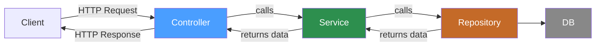
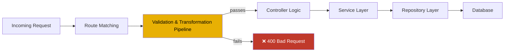
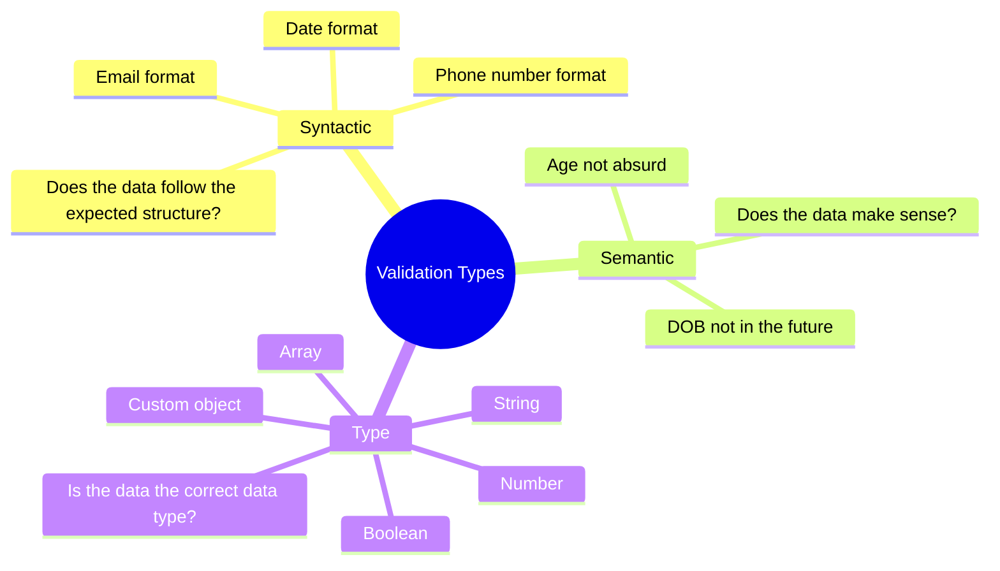
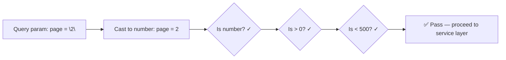
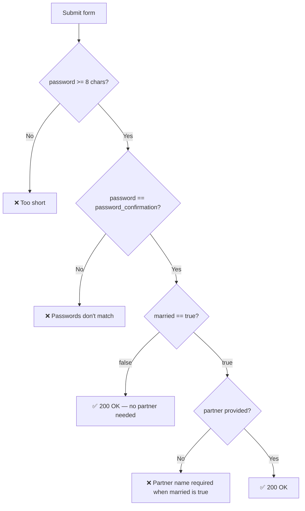
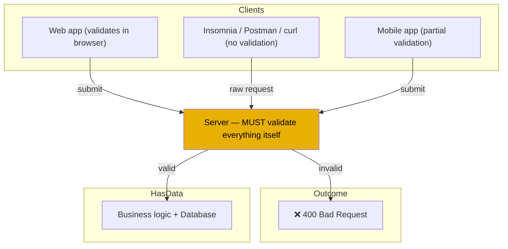
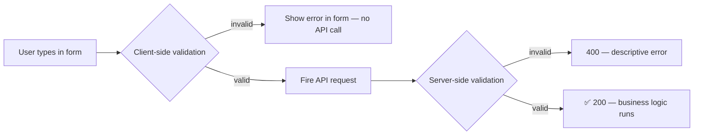

# Part 09 — Validations and Transformations for Backend Engineers

> [!info] Video reference
> - **Part 09 of 29** in the playlist [[_00 - Backend from First Principles - Index]]
> - **Watch on YouTube:** [9. Validations and transformations for backend engineers](https://www.youtube.com/watch?v=qedj_JjjL-U)
> - **Duration:** 42:47 | **Views:** 51,763 | **Likes:** 1,370 | **Published:** 2025-01-12
> - **Speaker/Channel:** Sriniously
> - **Description (head):** "In this video we understand what is the role of validation and transformation pipeline in a backend app."

> [!abstract] In this chapter
> This chapter is about **keeping a set of rules and guidelines in mind while designing your APIs**, specifically relating to *data integrity and security*. The speaker introduces the concept of a **validation and transformation pipeline** — a middleware or utility that inspects and reshapes every piece of incoming client data (JSON payloads, query parameters, path parameters, headers) *before* any business logic runs. We learn three categories of validation (**syntactic**, **semantic**, and **type**), several concrete transformation operations (lowercasing emails, prepending phone country codes, casting query strings to numbers), complex cross-field validation rules (password confirmation, conditional partner fields), and the crucial distinction between **client-side validation** (for user experience) and **server-side validation** (for security and data integrity). Every concept is demonstrated live in Insomnia against a local server.

---

## Video timeline

| Timestamp | Section |
|-----------|---------|
| 0:00   | What are validations and transformations? |
| 0:22   | Where they sit in the backend architecture |
| 2:00   | Why we separate controller from service layer |
| 3:50   | Validations happen *before* significant logic |
| 5:02   | The "why": data from clients must match expected structure |
| 7:00   | Example: validating a `name` field step by step |
| 9:47   | What happens without validation (database errors, 500s) |
| 12:30  | Using 400 Bad Request instead of 500 |
| 13:35  | Demo: syntactic validation (email, phone, date) |
| 15:43  | Three types of validation: syntactic, semantic, type |
| 15:58  | Syntactic validation explained (email structure, phone structure) |
| 18:00  | Semantic validation explained (DOB in future, absurd age) |
| 19:36  | Type validation explained (string, number, boolean, array) |
| 20:42  | What is transformation? (converting data to desired format) |
| 22:10  | Example: query params arrive as strings, need casting |
| 25:00  | Cast = forcing one data type into another |
| 26:24  | Demo: syntactic validation in Insomnia |
| 28:03  | Demo: semantic validation (future DOB, age > 120) |
| 30:18  | Demo: complex cross-field validation (password confirmation, conditional partner) |
| 33:13  | Demo: transformation (lowercase email, prepend phone prefix, date reformat) |
| 35:23  | Demo: type validation (string, number, array of strings, boolean) |
| 37:24  | Client-side vs server-side validation |
| 38:40  | Frontend validation = UX; backend validation = security & data integrity |
| 40:15  | A server can have many clients — never depend on the front end |
| 42:00  | Summary |

---

## [00:00] What are validations and transformations?

This video is about **keeping a set of rules or guidelines in mind while designing your APIs**. These rules are mostly related to **data integrity** and **security** — and that is exactly where *validations* and *transformations* come into play.

Before diving in, we need to understand *where* these concepts are applied in a typical backend architecture.

## [00:22] Where validations and transformations fit in the backend architecture

Recall the layered architecture from earlier chapters. In a typical backend we have different layers of execution:

- **Repository layer** (bottom) — deals with database connections, query executions, insertions, deletions, and everything related to persistent storage (relational databases, Redis, or any other kind of database).
- **Service layer** (middle) — executes business logic: calling one or more repository methods, sending notifications, firing webhooks, and so on. A typical service method calls one or more repository methods to interact with the databases.
- **Controller layer** (top) — calls the service method associated with a particular route, receives data back, and returns it to the client over the HTTP connection.

The controller layer is deliberately separated from the service layer because we want to keep **HTTP-related concerns in a different layer** — what error code to return, what success code to return, what format the data should be in, and *what validations we need to do*. All the data that comes from clients and all the data that goes out to clients lives in the controller layer; internally it calls the service layer, which in turn may or may not call the repository layer depending on requirements.



**What this diagram shows:** A simplified three-layer backend architecture. The client communicates only with the controller layer. The controller delegates business logic to the service layer, which delegates data access to the repository layer. Data flows back up the same chain.

### [03:50] The pipeline's entry point: before significant logic runs

So where exactly do validations and transformations happen?

> **Validations and transformations happen at the exact point where client data enters the server, *before* any significant logic is executed in the controller layer and *before* calling any service methods.**

When a request arrives at the server the first thing that happens is **route matching** — the matching algorithm determines which controller method is associated with the route. After the route is matched, and *before* we start executing any business logic in the controller, the **first step** is to run validations and transformations. This is often implemented as:

- A **middleware** function that runs before the controller method, or
- A reusable **utility function** that is called explicitly at the top of every controller method.

Either way, the idea is the same: a validation and transformation pipeline inspects the incoming data against a declared *schema* — a definition of what fields are expected, what types they should be, what constraints they must satisfy — and either passes the data through or rejects it immediately with an error.



**What this diagram shows:** The validation and transformation pipeline is the *gatekeeper* between route matching and any real business logic. If the data does not satisfy the declared constraints, the request is rejected immediately with a client-error status code — the service and repository layers are never reached.

---

## [05:02] Why validation matters: protecting against unexpected data

Imagine a server with many different clients scattered all over the world — different users making API calls, sending HTTP connections. The idea behind validations and transformations is:

> **Whatever data the clients send — JSON payloads, query parameters, path parameters, headers — before they enter our server, we want to make sure all of this data is in the *expected format*.**

That means: we want to ensure that whatever data this particular API needs, the user is sending it in the exact format that the API expects.

### [07:00] Step-by-step example: validating a `name` field

Suppose our API expects a JSON payload with a field called `name` which is a **string**. We can add further restrictions: the string's length must be between 5 and 100 characters. The validation pipeline checks this in layers:

1. **Presence** — Is there a field called `name` in the JSON payload? If not → send an error immediately that the `name` field is required.
2. **Type** — If `name` is present, is its value a string? (What if the client sent an array or a number instead?) If not a string → send an error.
3. **Length / range** — If the value is a string, is its length between 5 and 100 characters? If too long (e.g. a whole paragraph) → send an error. If too short (e.g. two characters) → send an error.

This ensures the data structure matches what the business logic needs *before* we do anything significant with it.

## [09:47] What happens without validation: the 500 trap

To see why validation is essential, consider what happens when it is *absent*.

Suppose we did **not** have a validation pipeline and a client sent `{ "name": 0 }` — a number instead of a string. Without validation:

1. The data reaches the controller layer. No validation, so it passes through.
2. The controller calls the service layer, which executes the business logic.
3. The service calls the repository, which tries to insert the value `0` into the `name` column of the books table.

In PostgreSQL (or any relational database), the `name` column was created with a data type constraint — for example:

```sql
CREATE TABLE books (
    name TEXT NOT NULL
);
```

The database expects `TEXT` (a string), but we are inserting a **number**. The database call **fails**. Depending on error handling, the client receives a **500 Internal Server Error** — "something went wrong in the server, something unexpected happened."

> **This is very poor user experience for a basic form API.** A 500 error tells the client nothing useful about *what* was wrong with their input.

The correct approach: validate at the entry point, and if the data does not satisfy constraints, return a **400 Bad Request** with a clear error message explaining *what* is wrong — "the `name` field is required", "expected a string but received a number", "length must be between 5 and 100 characters." This way the client knows exactly how to fix their request and retry.

### Summary of the validation pipeline concept

| What | Where | When |
|------|-------|------|
| Client sends data (JSON body, query params, path params, headers) | Controller layer | Before any significant logic or service calls |
| Validation & transformation pipeline runs | Between route matching and controller logic | First step after route is matched |
| If data satisfies constraints | Proceed to service layer | Execute business logic |
| If data fails constraints | Return `400 Bad Request` | Client receives actionable error message |
| If validation is skipped and bad data reaches DB | Database call fails | Client receives `500 Internal Server Error` |

---

## [13:35] Demo: the validation pipeline in action (syntactic validation)

The speaker demonstrates validation using **Insomnia** (an API client) against a server running on `localhost`. The endpoint is `POST /api/valid/syntactic`.

### First attempt: empty JSON payload

Sending `{}` (an empty JSON body) immediately returns an error array. The API expects **three required fields**: `email`, `phone`, and `date`. Because none are provided, the validation pipeline rejects the request right away with descriptive errors for each missing field.

> **Side benefit:** Even if API documentation is not available, the validation error messages serve as *implicit documentation* — they tell the client exactly which fields are expected and what constraints they must satisfy.

### Second attempt: wrong types and formats

The speaker fills in the fields but with intentionally wrong data:

| Field | Sent value | Error |
|-------|-----------|-------|
| `email` | `"randomstring"` | "Invalid email format" |
| `phone` | `12345` (number) | "Expected string, received number" |
| `date` | `"2025-01-11"` | ✓ valid |

Two errors are returned — the email does not match the expected email structure, and the phone was sent as a number instead of a string.

### Fixing the email

Changing the email to `test@test.com` satisfies the email format constraint. Only the phone error remains.

### Fixing the phone

Wrapping the phone value in quotes (`"12345"`) makes it a string. Now all three fields pass. The API returns **200 OK** with the submitted data.

---

## [15:43] Three types of validation

The speaker identifies three main categories of validation that backend engineers encounter most often. These are not exhaustive — there can be more depending on requirements — but these cover the vast majority of cases.



**What this diagram shows:** The three pillars of validation — syntactic (structure/format), semantic (real-world sense), and type (data type correctness) — each answer a distinct question about the incoming data.

### [15:58] Syntactic validation

**Syntactic validation** checks whether a provided string satisfies a particular *structure* or *format*. It does not ask whether the value "makes sense" in a real-world context — only whether it *looks right* according to a pattern.

Examples:

- **Email** — Does the string follow the pattern `local-part@domain.tld`? The validation algorithm checks for the presence of `@`, a domain name, and a top-level domain (`.com`, `.org`, `.co.in`, etc.). There are thousands of possible TLDs, and the algorithm validates against the known structure.
- **Phone numbers** — Does the string follow the expected format? Typically a country code followed by a specific number of digits. Country codes vary worldwide, and the expected digit count changes per country.
- **Dates** — Does the string follow the format the API expects? For example `YYYY-MM-DD` (year-month-day). The validator checks whether the string matches this structure.

### [18:00] Semantic validation

**Semantic validation** checks whether the provided data *makes sense* in a real-world context — beyond just fitting a format.

Examples:

- **Date of birth in the future** — A DOB field syntactically validates as `2030-06-12` (valid date format), but a person's date of birth *cannot be in the future*. Semantic validation rejects it.
- **Absurd age** — An age field receives `365`. Syntactically it is a valid number, but semantically it makes no sense. The validation pipeline should reject this.
- **Logical age range** — Ages are typically between 1 and ~120. A value of `430` is syntactically a valid number but semantically nonsensical.

> **Key insight:** Syntactic and semantic validation answer different questions. *Syntactic* asks "does the data follow the expected pattern?" while *semantic* asks "does the data make sense in the real world?"

### [19:36] Type validation

**Type validation** is the most fundamental — it checks whether the data type matches what the API expects.

- Is this field a **string** or was a number/boolean/array sent instead?
- Is this field a **number** or was a string sent?
- Is this field a **boolean** (`true`/`false`) or was a string sent?
- Is this field an **array** or was something else sent?
- Is this field a **custom JSON object** with its own nested type requirements?

Type validation is what caught the earlier demo case where the phone number was sent as a numeric value `12345` instead of the string `"12345"`.

---

## [20:42] What is transformation?

If validation is about *checking* whether data meets requirements, **transformation** is about *changing* data to meet those requirements — or to prepare it for the service layer.

> **Transformation = converting data into a desirable format** — either before validation, after validation, or both — so that the data is in the structure the server expects.

Validations and transformations are typically paired in a **single pipeline**. This keeps all input-data logic in one place: the validation requirements, the operations performed on the data, and any defaults or normalizations — all live together. You don't have to hunt through different parts of the codebase to understand what happens to incoming data.

### [22:10] Example: query parameters always arrive as strings

Consider a paginated API: `GET /bookmarks?page=2&limit=20`. The query parameters `page` and `limit` are semantically numbers, but **all query parameter values arrive at the server as strings by default** — this is how URLs work. The string `"2"` and the number `2` are different things.

Our validation schema says:

| Field | Type | Constraints |
|-------|------|------------|
| `page` | number | `> 0` and `< 500` |
| `limit` | number | `> 0` and `< 10000` |

The request arrives with `page = "2"` (a string) and `limit = "20"` (a string). The validation immediately fails on the first check: *expected number, received string*.

### [25:00] Casting: forcing one type into another

**Cast** (short for *type casting*) means forcing one data type to convert into another. In this example the server needs to cast the string `"2"` into the number `2`, and `"20"` into the number `20`, *before* executing the range validations (`> 0`, `< 500`, etc.).

This cast is a transformation — the data changes form as it passes through the pipeline. The pipeline might work like this:



**What this diagram shows:** The transformation (casting) happens *first*, converting the string into a number. Only *after* the cast can the range validations be meaningfully evaluated.

### Transformation can happen before or after validation

The speaker notes that transformation is flexible:

- **Before validation** — Cast string query params to numbers so type checks pass, then validate ranges.
- **After validation** — Once the data passes syntactic/semantic checks, normalize it (e.g. lowercase an email, trim whitespace, prepend a phone country code).

Either way, all of this happens inside the **same validation and transformation pipeline**, keeping input-data concerns in one place.

---

## [26:24] Demo: syntactic validation in Insomnia (full walkthrough)

The speaker walks through a complete example of syntactic validation against an endpoint that expects `email`, `phone`, and `date`:

1. **Empty payload** `{}` → errors: "email is required", "phone is required", "date is required"
2. **Wrong email format** (`"randomstring"`) → "Invalid email format"
3. **Phone as number** (`12345`) → "Expected string, received number"
4. **Fix email** to `test@test.com` → email error resolved
5. **Fix phone** to `"12345"` (string) → phone error resolved
6. **Date** `"2025-01-11"` → already valid ✓
7. All three pass → **200 OK**

This demonstrates that syntactic validation enforces structural rules: the email must look like an email, the phone must be a string matching a phone format, and the date must match the expected date format.

---

## [28:03] Demo: semantic validation

A different endpoint expects two fields: `date_of_birth` and `age`.

### Semantic rule 1: DOB cannot be in the future

| Field | Value | Result |
|-------|-------|--------|
| `date_of_birth` | `"1995-06-12"` | ✓ Valid — a reasonable past date |
| `age` | `43` | ✓ Valid — logical age |

→ **200 OK**, the same data is returned.

Now change `date_of_birth` to `"2026-06-12"`:

> **Error: "Date of birth cannot be in the future."**

The date format is perfectly valid (syntactic check passes), but semantically it makes no sense for a date of birth to be in the future.

### Semantic rule 2: age must be logical

Revert the date but change `age` to `430`:

> **Error: "Number must be less than or equal to 120."**

A logical age range is 1 to ~120. Even though a one-year-old won't be hitting the API, the constraint enforces semantic sanity. This is why it is called *semantic* validation — it checks whether the values make sense in a real-world context.

---

## [30:18] Demo: complex/cross-field validation

A third endpoint is about **complex validation** — rules that depend on *relationships between multiple fields*. It expects three fields: `password`, `password_confirmation`, and `married` (a boolean).

### Case 1: passwords must match, and meet a minimum length

The speaker first submits:

| Field | Value |
|-------|-------|
| `password` | `"Srd"` |
| `password_confirmation` | `"AnotherString"` (different) |
| `married` | `false` |

Two errors come back:

- **`password`**: "String must contain at least 8 characters" *(length constraint — the password `"Srd"` is too short)*
- **`password_confirmation`**: "Passwords don't match" *(cross-field constraint — the two strings differ)*

Fixing by making the password at least 8 characters and copying it into both fields → all password checks pass.

### Case 2: conditional partner field

Now set `married` to `true`. A new error appears:

> **Error: "Partner name is required when married is true."**

When `married` is `false`, the `partner` field is **optional**. But when `married` is `true`, the *conditional constraint* kicks in and `partner` becomes required. Providing `partner: "some name"` → **200 OK** with all submitted values echoed back.

> **Key insight:** Validation rules can be **complex and conditional**. Depending on service-layer requirements, we can define:
> - Cross-field equality constraints (e.g. *password == password_confirmation*)
> - Conditional required fields (e.g. *partner required iff married == true*)



**What this diagram shows:** The evaluation order of the complex validation rules. Length check first, then the equality check, then the conditional partner rule that depends on the value of the `married` boolean.

---

## [33:13] Demo: transformation

Back to an endpoint expecting `email`, `phone`, and `date` — but this time the *transformation* behavior is on display. The speaker submits intentionally "messy" values:

| Field | Sent value | What the server did |
|-------|-----------|-------------------|
| `email` | Mixed case, e.g. `test@Test.com` | **Lowercased** — returned in all lowercase |
| `phone` | `12345` (no `+` prefix) | **Prefixed** — returned `+12345` |
| `date` | A valid date in one format | **Reformatted** — calculated and returned in a different date format |

The point: the user sent data in an *unexpected but valid* format. The server's transformation pipeline changed the data according to the requirements of the service layer:

- The email was normalized to **all lowercase** before any executions — because of this, even though the client sent uppercase characters, the returned value is `test@test.com`.
- The phone number was normalized by **adding the `+` country code prefix** to the value before returning it.
- The date was converted into a different representation.

> **Definition (as stated in the video):** "The process of converting data into a desirable format is called *transformation*." After the client sends data in a payload, the server can perform operations on it — lowercasing, prefixing, reshaping dates — to transform it into a form that suits the service layer, *before* performing any business logic with it.

---

## [35:23] Demo: type validation

The final API demo expects four fields, each enforcing a *data type*:

| Field | Expected type |
|-------|--------------|
| `string_field` | string |
| `number_field` | number |
| `array_field` | array (of strings) |
| `bool_field` | boolean |

The speaker first sends *all four* fields as strings → errors:

- `string_field` → ✓ passes
- `number_field` → ❌ "Expected number, received string"
- `array_field` → ❌ "Expected array, received string"
- `bool_field` → ❌ "Expected boolean, received string"

Fixing `number_field` to `10` resolves the number error. Adding an array `[1, 2]` resolves the array *type* check, but now a **nested type validation** kicks in:

> `array_field[0]` — element zero is expected to be a **string**, but `1` is a number.

So the array itself can carry its own per-element constraints. Changing the array to strings `["1", "2"]` → all errors resolved → **200 OK**, with the server echoing back the string value, the number value, the array of strings, and the boolean (`true` or `false`).

> **Key insight:** Type validation can be **nested** — an array field can enforce that *each element* satisfies an additional type/constraint, not just the array itself.

---

## [37:24] Client-side vs server-side validation: a common misconception

The last and arguably most important point in the video addresses a frequent beginner mistake: **replacing frontend validation with backend validation** (or expecting the frontend to do the backend's job).

### Why the confusion happens

In a typical platform, forms perform client-side validation before submitting. A form field like `name` checks the input on the browser:

- Minimum/maximum number of characters
- Data type matching
- Any other traits the field requires

If validation passes → clicking **Submit** calls the API. If it fails → errors are shown **in the form itself**, and no API call is made.

### The critical distinction

> - **Frontend validation is for UX (user experience)** — giving the user *immediate feedback* that something is wrong with the data. It exists to prevent annoyance, not to secure anything.
> - **Backend (server-side) validation is for security and data integrity** — it is the *mandatory* validation whose purpose is to keep the system safe and the data consistent.

You need **both**, every time. "For all interactions, for all APIs, we need both the front-end validation and the server-side validation."

### Why the backend can never trust the frontend

A single server can have many different clients:

1. A **convenient web app** that performs all kinds of rich client-side validation.
2. An **API client-based interface** — Postman, Insomnia, `curl`, a mobile app, a third-party script — where **there is no concept of validation at all**, because the client talks directly to the API with no UI layer in between.

If the backend depends on frontend validation for security or data integrity, the *server will break the moment the client changes*.



**What this diagram shows:** The server cannot assume *any* client validated its data — a browser app may validate thoroughly, but an API client sends raw requests with zero validation. The server must independently validate everything it receives, because it is the only common, trusted enforcement point.

> **Rule of thumb (as stated in the video):** "You have to be as strict and as specific as possible in your server-side validation logic, without thinking of what the client validation will look like — because client validation is for the user experience, but server validation is for security and data integrity."

### [40:15] How the two work together

The speaker shows a complimentary frontend interface for one of the demo APIs. Entering an invalid email and an incomplete phone number, then clicking submit:

- **No API call is made** because the frontend detected the problems first and displayed error feedback in the form.
- After fixing the email to a proper format (e.g. `test@gmail.com`), submit **does** fire a real API call — and the server validates independently.

The frontend catches problems *immediately* (good UX); the server catches problems the frontend missed or malicious clients (security + data integrity). This is how client-side and server-side validation work together.



**What this diagram shows:** The two-stage validation flow. The client validates purely for instant feedback (and never sends bad requests), while the server validates as the authoritative security/data-integrity check on everything that reaches it.

## [42:00] Summary

Validation and transformation is not a complex or large topic — it is a **set of rules and guidelines to follow when designing your APIs**:

- **Where:** at the entry point of the server, after route matching, before any significant logic — in a single reusable validation and transformation pipeline (middleware or utility).
- **Why:** data integrity and security; never let unexpected data reach the service/repository layers.
- **What kinds:** syntactic (structure/format), semantic (real-world sense), type (data type correctness), and complex cross-field/conditional rules.
- **Transformation:** casting and normalizing data (string→number, lowercasing emails, adding prefixes, reformatting dates) before/after validation.
- **The golden rule:** server-side validation is authoritative — frontend validation is only ever for UX.

---

## Key Takeaways

1. **The pipeline's position matters.** Validation and transformation runs at the entry point — after route matching, before the controller executes any significant logic or calls the service layer.
2. **Validation and transformation are paired** in a single reusable pipeline (middleware or utility) so all input-data logic lives in one place.
3. **Three core validation types:** *syntactic* (does it follow the structure?), *semantic* (does it make sense?), and *type* (is it the right data type?) — plus complex cross-field rules (equality checks, conditional requirements).
4. **Without validation, bad data reaches the database** and produces a confusing `500 Internal Server Error`; with validation at the entry point, the client gets an actionable `400 Bad Request`.
5. **All query parameters arrive as strings by default** — the server must *cast* them (string → number) as a transformation *before* type/range validation can pass.
6. **Type validation can be nested** — an array may enforce per-element constraints (e.g. an array of strings), not just array-ness.
7. **Frontend validation is for UX only** — immediate feedback without a network round-trip. It is not security.
8. **Server-side validation is for security and data integrity** — it is mandatory, and it must be as strict and specific as possible, independent of whatever the client does.
9. **A server has many clients** (web app, Postman/Insomnia, mobile, third-party scripts); some perform no validation at all — the server is the only trustworthy gatekeeper.
10. **Error messages double as documentation** — validation errors communicate the expected fields and formats when API docs are missing.

---

## Related Notes

- Course index: [[_00 - Backend from First Principles - Index]]
- Previous chapter: [[08 - Authentication and Authorization for Backend Engineers]]
- Next chapter: [[10 - Controllers, Services, Repositories, Middlewares and Request Context]]

> [!note] Source fidelity
> These notes are a detailed tutorial-style transcription of **Sriniously — "9. Validations and transformations for backend engineers"** (part 09 of 29 in the *Backend from First Principles* playlist). Duration: 42:47. All terms, examples, demo payloads, error messages, and quotes reflect the video's actual content. Where the transcript or audio was ambiguous (e.g. exact email/phone string values shown on screen in the Insomnia demos), the details are marked with ⇢ *inferred* or reconstructed from context. Code samples (such as the `CREATE TABLE books` snippet) are illustrative reconstructions of database behavior described verbally, not taken verbatim from the video.
