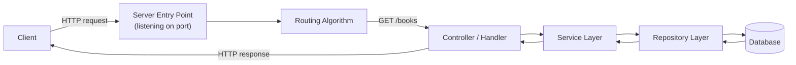
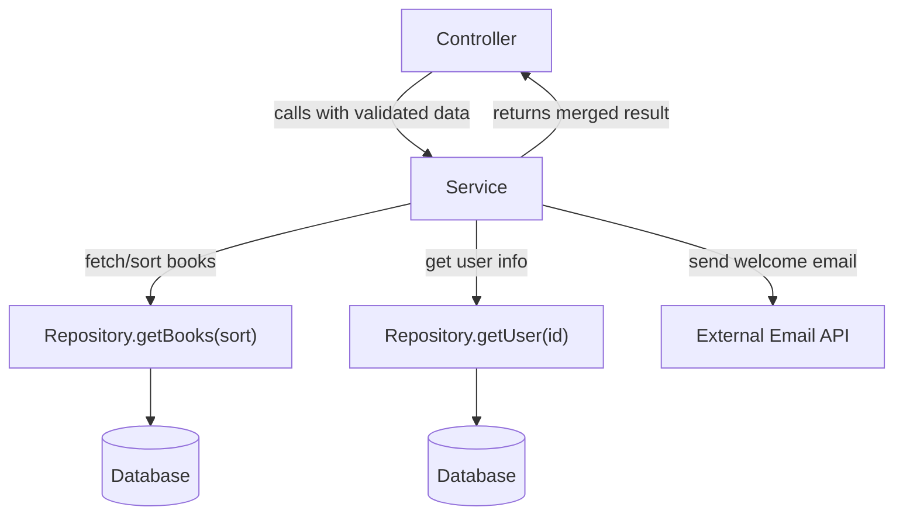
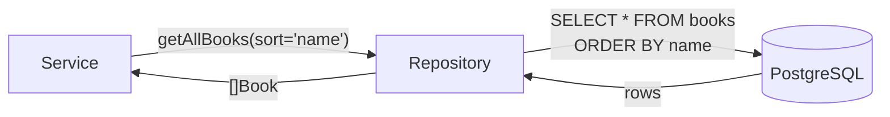
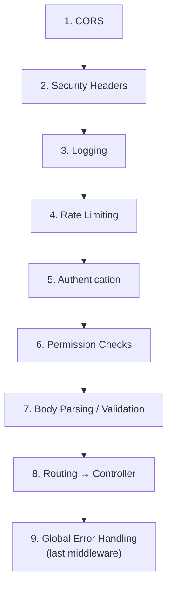
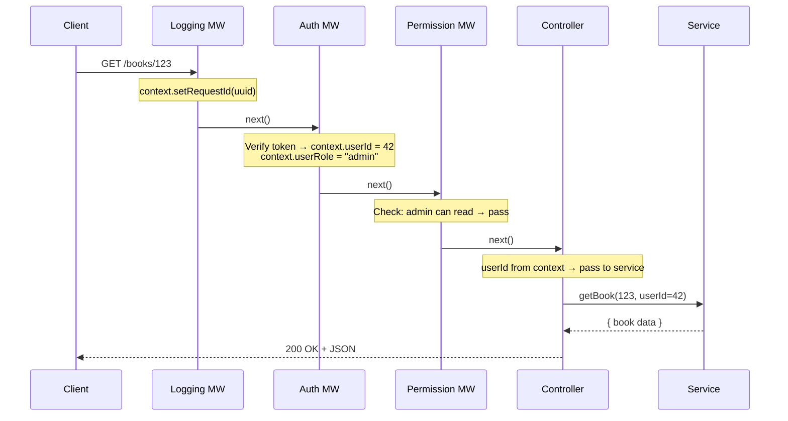
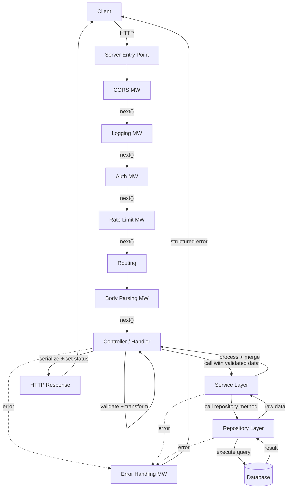

# Part 10 — Controllers, Services, Repositories, Middlewares and Request Context

> [!info] Video reference
> - **Part 10 of 29** in the playlist [[_00 - Backend from First Principles - Index]]
> - **Watch on YouTube:** [What are controllers, services, repositories, middlewares and request context?](https://www.youtube.com/watch?v=hyc-7w3pee8)
> - **Duration:** 59:57 | **Views:** 58,342 | **Published:** 2025-01-16
> - **Speaker/Channel:** Sriniously

> [!abstract] In this chapter
> We trace the full journey of an HTTP request **inside the server** — from the moment the operating system hands it off, through every middleware, controller, service, and repository layer, until a response is sent back. The goal is to understand *why* we decompose server-side code into these distinct layers and how middlewares and request context tie them together into a clean, maintainable pipeline.

---

## Table of Contents

- [The In-Server Request Lifecycle](#The%20In-Server%20Request%20Lifecycle)
- [Handlers / Controllers — The Entry Point](#Handlers%20/%20Controllers%20%E2%80%94%20The%20Entry%20Point)
- [Binding: Deserializing the Request Body](#Binding:%20Deserializing%20the%20Request%20Body)
- [Validation and Transformation](#Validation%20and%20Transformation)
- [Calling the Service Layer](#Calling%20the%20Service%20Layer)
- [The Service Layer — Business Logic and Orchestration](#The%20Service%20Layer%20%E2%80%94%20Business%20Logic%20and%20Orchestration)
- [The Repository Layer — Data-Access Abstraction](#The%20Repository%20Layer%20%E2%80%94%20Data-Access%20Abstraction)
- [Sending the Response Back](#Sending%20the%20Response%20Back)
- [Middlewares — Where They Fit In](#Middlewares%20%E2%80%94%20Where%20They%20Fit%20In)
- [The `next()` Function — Passing Control Forward](#The%20`next()`%20Function%20%E2%80%94%20Passing%20Control%20Forward)
- [Why Use Middlewares?](#Why%20Use%20Middlewares?)
- [Common Middlewares in Detail](#Common%20Middlewares%20in%20Detail)
- [Request Context — A Request-Scoped Shared State](#Request%20Context%20%E2%80%94%20A%20Request-Scoped%20Shared%20State)
- [Complete Request Lifecycle Diagram](#Complete%20Request%20Lifecycle%20Diagram)
- [Key Takeaways](#Key%20Takeaways)
- [Related Notes](#Related%20Notes)

---

## The In-Server Request Lifecycle

### [01:00] What happens between a request arriving and a response being sent?

We have already covered the *external* request lifecycle — DNS resolution, TCP handshake, TLS negotiation, the client serialising a request and the server sending back a response (see [[05 - Understanding HTTP for Backend Engineers]]). What we have **not** covered is what happens **inside the server** from the moment the operating system hands off the HTTP request to the port the server is listening on (3000, 4000, or any configured port) all the way to the response being written back to the wire. This internal journey is called the **in-server request lifecycle**.

Once the request arrives at the server entry point:

1. The OS forwards the request to the port the server is listening on.
2. The server's **routing algorithm** matches the HTTP method + path to a specific route.
3. The route maps to a **handler** (also called a **controller**) — a function pre-defined to process that particular API.
4. The handler extracts data from the request, validates and transforms it, then delegates the actual work to downstream layers (**service**, **repository**).
5. Data flows back up; the handler serialises a response and sends it.

This is the moment to introduce the idea that a single handler doing *everything* is possible but quickly becomes unmanageable. The established design pattern is to split responsibilities across three (or more) distinct components: **handlers/controllers**, **services**, and **repositories**.

> **Why three separate components?**
>
> There is no hard requirement to split — it is a **design pattern** aimed at making the codebase:
> - **Scalable** — new features can be added without touching unrelated code.
> - **Maintainable** — each component has a single, clear responsibility.
> - **Testable** — individual layers can be tested in isolation.
> - **Easier to debug** — the failure point is easier to locate.

---

### [02:08] High-level flow: client → server entry → routing → layers → response



> **What this diagram shows:** A single HTTP request arrives at the server, passes through routing, reaches the controller, which delegates to a service, which calls the repository, which queries the database. Results bubble back up in reverse order until the controller sends the final response to the client.

---

## Handlers / Controllers — The Entry Point

### [03:42] What does a handler/controller do?

After routing, the request reaches the **handler** (or **controller**) — the function mapped to that particular route. In virtually all backend frameworks (Node/Express, Go's `net/http`, Python/Flask/Django, Rust/Actix) the handler receives two default objects injected by the runtime:

| Object | Purpose |
|--------|---------|
| **Request** (`req`) | Carries all inbound data: headers, body, query params, path params, cookies, etc. |
| **Response** (`res`) | Used to write status codes, headers, and the response body back to the client. |

The handler is the **coordinator** of data flow — it *controls* the request lifecycle from start to finish:

1. **Extracts** data from the request object.
2. **Validates and transforms** the data.
3. **Delegates** processing to the service layer.
4. **Receives** the result.
5. **Sends** an appropriate HTTP response.

A good rule of thumb: **the controller should be thin**. It should handle HTTP-specific concerns (parsing, status codes, headers) but never contain business logic. Business logic belongs in the service layer.

```go
// Go example — a thin controller
func GetBooksHandler(w http.ResponseWriter, r *http.Request) {
    sortParam := r.URL.Query().Get("sort")   // extract from request

    books, err := bookService.GetAll(sortParam)
    if err != nil {
        http.Error(w, err.Error(), http.StatusInternalServerError)
        return
    }

    json.NewEncoder(w).Encode(books) // send response
}
```

```javascript
// Node / Express example — a thin controller
app.get('/books', async (req, res) => {
    const sortParam = req.query.sort || 'date';

    try {
        const books = await bookService.getAll(sortParam);
        res.status(200).json(books);
    } catch (err) {
        res.status(500).json({ message: err.message });
    }
});
```

---

## Binding: Deserializing the Request Body

### [08:06] [11:00] Converting JSON into native data structures

The very first responsibility of the controller after receiving the request is **binding** — deserialising the incoming data (typically JSON) into the programming language's native data format:

| Language | Binding target |
|----------|---------------|
| Go | `struct` |
| Python | `dict` or a dataclass |
| JavaScript/Node | already a JS object (middleware like `express.json()` often does this upstream) |
| Rust | `struct` via `serde` |

If deserialization fails (malformed JSON, wrong types), the handler returns a **400 Bad Request** status code immediately — the request terminates here and never reaches downstream layers.

> [!tip] Upstream middleware can handle binding
> In Node/Express apps, a middleware such as `express.json()` or `body-parser` deserialises JSON into JavaScript objects *before* the request reaches the route handler. In Go or Python the controller itself typically performs this step explicitly.

---

## Validation and Transformation

### [12:51] [09:13] Ensuring data is correct and convenient

Once the data is in a native format, the controller **validates** it — checks that:

- All mandatory fields are present.
- Values are in the expected format (type, length, range).
- There is no malicious or unexpected input.

This was covered in depth in [[09 - Validations and Transformations for Backend Engineers]]. After validation, an optional but recommended **transformation** step can modify the data to make it more convenient for downstream layers.

**Example — setting a default sort order:**

A GET `/books` endpoint accepts an optional `sort` query parameter (`name` or `date`). The design pattern is to make all query parameters **optional**. If the client does not send `sort`, the transformation pipeline defaults it to `date`:

```
Validation pipeline:
  Client sends GET /books (no query params)
  → Validation passes (all params are optional ✓)
  → Transformation sets sort = "date" (default)
  → Downstream layers receive a fully-populated struct
```

Without this transformation, every downstream layer would have to check whether `sort` was provided and branch on that — pushing conditional logic deep into the service/repository layers. The transformation keeps the downstream code clean.

> **Key pattern:** Make query parameters optional; use the transformation layer to set sensible defaults.

---

## Calling the Service Layer

### [18:27] Controller → Service: passing validated, transformed data

After binding, validation, and transformation, the controller has a clean, well-typed data structure ready for processing. It now **calls the service layer**, passing:

- The validated/transformed data (request body, query params, path params).
- Any context needed — user ID, user permissions, roles — pulled from the request context (discussed later).

The controller does **not** execute the business logic itself. It hands it off.

---

## The Service Layer — Business Logic and Orchestration

### [18:56] What belongs in the service layer?

The **service layer** is where the actual **business logic** lives. A good test: *if you look at a service method, you should not be able to tell from a glance that it is part of an HTTP API.* The service should:

- Know nothing about HTTP request/response objects, status codes, or headers.
- Take plain data in, process it, and return plain data out.
- Handle orchestration — coordinating multiple repository calls, external API calls, email sending, notifications, etc.



> **What this diagram shows:** A single service method may call multiple repository methods, merge the results, call an external service, and return a combined response — all without the controller needing to know any of those details.

**Example — a service that does NOT touch the database:**

```javascript
// Sending an email — pure service logic, no repository involved
async function sendWelcomeEmail(emailAddress) {
    await emailClient.send({
        to: emailAddress,
        subject: 'Welcome!',
        body: '...'
    });
    return { success: true };
}
```

**Example — a service that orchestrates multiple repository calls:**

```javascript
async function getBooksForUser(userId, sort) {
    const books   = await bookRepo.getAll(sort);   // repository call 1
    const user    = await userRepo.getById(userId); // repository call 2
    // merge, filter, transform as needed
    return { books, userName: user.name };
}
```

### [20:05] Services can also handle non-database operations

Not every service method needs a repository. A service that sends an email, calls an external API, or computes analytics is perfectly valid. The repository layer is only involved when there is a database operation.

---

## The Repository Layer — Data-Access Abstraction

### [21:07] [22:10] The only layer that talks to the database

The **repository layer** is the single point of contact with the database. Its **sole responsibility** is:

1. Take data (filter criteria, sort order, records to insert, IDs to delete).
2. Construct and execute the appropriate database query.
3. Return the raw result.

**Why this separation exists:**

- **Testability** — you can mock the repository in service tests without needing a real database.
- **Single Responsibility** — repository methods do one thing: a single database operation.
- **Swappability** — switching from Postgres to MySQL (or adding a caching layer) only touches the repository, not services or controllers.

> [!important] One repository method = one kind of data
> A method like `getAllBooks()` should always return all books. A separate method `getBookById(id)` should return a single book. You should **not** use an optional parameter in the same function to decide between "return one" or "return many" — that violates single responsibility.

```go
// Go example — repository methods
func (r *BookRepo) GetAll(sort string) ([]Book, error) {
    query := "SELECT * FROM books ORDER BY " + sort
    return r.db.Query(query)
}

func (r *BookRepo) GetByID(id int) (Book, error) {
    query := "SELECT * FROM books WHERE id = $1"
    return r.db.QueryRow(query, id)
}
```



> **What this diagram shows:** The service calls a repository method with a sort parameter. The repository translates that into a SQL query, executes it against the database, and returns the results. The service never writes SQL; the controller never sees the database.

---

## Sending the Response Back

### [24:19] Controller decides the HTTP status and response body

After the service returns, execution is back in the **controller layer**. Now the controller:

1. Checks the service result — was it successful or did it fail?
2. Selects the appropriate **HTTP status code**:
   - `200 OK` — successful read
   - `201 Created` — resource created
   - `204 No Content` — successful delete
   - `400 Bad Request` — client error
   - `401 Unauthorized` — authentication failure
   - `500 Internal Server Error` — server-side failure
3. Constructs and sends the response body (JSON, error message, etc.).

This is why the controller "controls" the data flow — it is responsible for the **data format going in** (parsing, validation) and the **data format going out** (HTTP response).

---

## Middlewares — Where They Fit In

### [26:52] [29:00] Functions that execute between boundaries

So far we have seen the request flow as:

```
Entry → Routing → Controller → Service → Repository → DB
                                                  ↕
                                              Response
```

In reality, **between these boundaries** there are additional functions that execute. We call them **middlewares** (also written as "middleware"). The name comes from their position: they run *in the middle* — between the entry point and the handler, between one handler and the next, or even after the handler before the response is sent.

```mermaid
flowchart TD
    Entry["Request Entry Point"] --> MW1["Middleware 1\n(e.g., CORS)"]
    MW1 -->|next()| MW2["Middleware 2\n(e.g., Logging)"]
    MW2 -->|next()| Routing["Routing"]
    Routing -->|next()| MW3["Middleware 3\n(e.g., Auth)"]
    MW3 -->|next()| MW4["Middleware 4\n(e.g., Rate Limit)"]
    MW4 -->|next()| Handler["Controller / Handler"]
    Handler --> Service["Service Layer"]
    Service --> Repository["Repository Layer"]
    Repository --> DB[("Database")]
    DB --> Repository
    Repository --> Service
    Service --> Handler
    Handler --> MW5["Error Handling Middleware\n(last in chain)"]
    MW5 -->|"response"| Client
```

> **What this diagram shows:** The request passes through a chain of middleware functions — each doing one specific task (CORS, logging, auth, rate limiting) — before it reaches the controller. After processing, the response passes through an error-handling middleware at the end of the chain. Every arrow labelled `next()` represents one middleware calling the next function in the pipeline.

### [30:29] Middlewares receive three things

Like regular handlers, middlewares get request and response objects from the runtime. But they receive one additional argument:

| Argument | Purpose |
|----------|---------|
| `req` (request) | Read data from the incoming request |
| `res` (response) | Modify response headers or send a response early |
| `next()` | **Pass control** to the next middleware (or to the handler) in the chain |

A middleware can:

1. **Read/modify** the request — e.g., attach parsed body, add user info to context.
2. **Read/modify** the response — e.g., add CORS headers, set security headers.
3. **Short-circuit** — send a response immediately without calling `next()` (e.g., 401 for failed auth, 429 for rate limit exceeded).
4. **Call `next()`** to pass control forward.

### [32:25] The `next()` function explained

The `next()` function is the mechanism that chains middleware together. When a middleware calls `next()`, execution moves to the next middleware (or to the routing/handler) in the registered order. If it does **not** call `next()`, the pipeline stops and the middleware can send a response directly.

```
Middleware 1          Middleware 2          Handler
    │                     │                    │
    │──── next() ────→    │                    │
    │                     │──── next() ────→   │
    │                     │                    │
    │                     │    ◄── response ── │
    │    ◄── response ─── │                    │
    │                                               
```

> **Key point:** The order in which you register middlewares determines the execution order. This ordering is critical.

---

## Why Use Middlewares?

### [33:17] Reducing code duplication across hundreds of handlers

A large backend application may have hundreds or thousands of API endpoints, each with its own handler. Many operations need to happen for **every single request**:

- Logging the request method, path, and query params.
- Checking CORS headers.
- Verifying authentication tokens.
- Enforcing rate limits.

Without middlewares, you would have to duplicate this logic inside every handler. Even extracting it into helper functions still requires *calling* those helpers in every handler — that is still redundancy.

Middlewares solve this by extracting **cross-cutting concerns** into functions that sit outside individual handlers. They are:

- **Reusable** — one CORS middleware covers all routes.
- **Composable** — you can add/remove middlewares without touching handler code.
- **Order-sensitive** — the order you register them controls the order they execute.

---

## Common Middlewares in Detail

### [37:15] CORS middleware

**CORS** (Cross-Origin Resource Sharing) is a browser-imposed security mechanism: JavaScript code running on `example.com` cannot fetch resources from `api.example.com` unless the server explicitly allows it by sending the correct `Access-Control-Allow-*` headers.

The CORS middleware:
1. Reads the `Origin` header from the incoming request.
2. Checks if the origin is in the allowed list (e.g., your frontend domain).
3. If allowed → adds the appropriate CORS response headers and calls `next()`.
4. If not allowed → does not add the headers; the browser blocks the response by default.

**Why it is a middleware:** The CORS check must happen for every single API call, before any business logic runs. It only touches request headers and response headers — classic cross-cutting, HTTP-specific logic.

### [41:28] Security headers middleware

This middleware adds security-related headers to every response, such as:

- `Content-Security-Policy`
- `X-Content-Type-Options: nosniff`
- `X-Frame-Options: DENY`

Same pattern: run on every request, modify the response headers, then call `next()`.

### [41:51] Authentication middleware

The **authentication middleware** verifies the user's identity on every request:

1. Extracts a token (JWT, session ID, API key) from the request headers or body.
2. Verifies the token (signature check, database lookup, etc.).
3. **On failure:** sends a `401 Unauthorized` response immediately — the request never reaches the handler.
4. **On success:** extracts user metadata (user ID, role, permissions) and stores it in the **request context**. Then calls `next()`.

```javascript
// Simplified auth middleware
async function authMiddleware(req, res, next) {
    const token = req.headers.authorization?.split(' ')[1];
    if (!token) return res.status(401).json({ error: 'No token provided' });

    try {
        const decoded = jwt.verify(token, SECRET_KEY);
        req.context.userId   = decoded.id;
        req.context.userRole = decoded.role;
        next(); // pass to the next middleware / handler
    } catch {
        return res.status(401).json({ error: 'Invalid token' });
    }
}
```

**Why it is a middleware:** Every protected endpoint needs to verify the token. Doing this in every handler would be massive duplication. The middleware pattern also allows short-circuiting — if the token is invalid, we never waste resources on routing or business logic.

### [43:47] Rate limiting middleware

The **rate limiter** prevents any single client from overwhelming the server:

1. Identifies the client (typically by IP address).
2. Checks how many requests the client has made in a defined time window (e.g., 30 requests per 2 seconds).
3. **If over the limit:** sends a `429 Too Many Requests` response immediately.
4. **If under the limit:** calls `next()`.

**Why it is a middleware:** Rate limiting is a universal, cross-cutting concern that must be checked before any handler runs.

### [44:58] Logging and monitoring middleware

A **logging middleware** captures metadata about each request for debugging and auditing:

- HTTP method (`GET`, `POST`, etc.)
- Request path (`/users`, `/books/123`)
- Query parameters
- Response time
- Status code

This middleware typically:
1. Records the start time.
2. Calls `next()`.
3. After the response is sent, computes the elapsed time and logs the full entry.

### [45:42] Global error handling middleware

The **global error handling middleware** is the *last* middleware in the chain. Its job is to catch any unhandled error that occurred anywhere in the pipeline — in any middleware, handler, service, or repository.

It:
1. Receives the error (typically via Express's `err` parameter, or a Go error).
2. Determines whether it is a client error (`400`-level) or server error (`500`-level).
3. Structures a consistent error response: `{ message, code, status }`.
4. Sends it back to the client.

**Why it must be last:** If the error handling middleware is placed in the middle of the chain, errors that occur *after* it (in later middlewares or handlers) will not be caught. The request flows in one direction — the error handler must be at the end to catch everything.

```mermaid
flowchart LR
    MW1["CORS"] -->|next()| MW2["Logging"]
    MW2 -->|next()| MW3["Auth"]
    MW3 -->|next()| Handler["Handler"]
    Handler --> Service["Service"]
    Service --> DB["Repository → DB"]
    Handler -.->|"error"| ErrMW["Error Handling\nMiddleware"]
    Service -.->|"error"| ErrMW
    ErrMW -->|"structured\nerror response"| Client
```

> **What this diagram shows:** Errors can originate at any layer — handler, service, or repository. They propagate up the call stack until they reach the global error handling middleware, which is positioned as the last middleware in the chain so it can catch them all.

### [48:31] Compression middleware

For large response payloads (e.g., thousands of JSON fields), a **compression middleware** can apply algorithms like Gzip to reduce the payload size during transit. Modern browsers automatically decompress the response. This saves bandwidth and improves latency.

### [49:23] Body parsing / serialization middleware

The deserialization of JSON into native data structures (the "binding" step described earlier) can itself be delegated to a middleware — e.g., `express.json()` in Node. Similarly, validation and transformation can be extracted into a dedicated middleware so the handler only deals with already-validated, fully-typed data.

### [50:00] Typical middleware order



> **What this diagram shows:** The recommended ordering of middlewares. CORS runs first (to reject disallowed origins as early as possible), followed by logging, rate limiting, authentication, and permission checks. The global error handling middleware is registered last. Note: the exact order depends on your application's requirements — the point is to think deliberately about it.

---

## Request Context — A Request-Scoped Shared State

### [51:00] What is request context?

**Request context** is a piece of storage — typically a key-value map — that is **scoped to a single request**. It is:

- **Born** when the request arrives.
- **Dies** when the response is sent.
- **Accessible** to every middleware and handler in the pipeline for that request.

Its purpose: to provide a shared, request-scoped state so that middlewares and handlers can pass information to each other **without tightly coupling** them.



> **What this diagram shows:** A single request passes through three middlewares before reaching the handler. The logging middleware sets a request ID in the context; the auth middleware adds user info; the permission middleware reads that user info from the context to decide if access is allowed. The handler later reads the user ID from the context to pass to the service. At no point do these functions pass values to each other via function arguments — the context is the shared medium.

### [54:25] What goes into the context?

| Key | Set by | Purpose |
|-----|--------|---------|
| `requestId` | Logging/tracing middleware | Unique ID for the request (UUID); used for log correlation, distributed tracing, `X-Request-Id` header on downstream calls |
| `userId` | Authentication middleware | ID of the authenticated user |
| `userRole` | Authentication middleware | Role of the user (admin, user, sales, …) |
| `permissions` | Authentication/permission middleware | Granular permissions (read, write, delete) |
| `deadline` / `cancel` | Timeout middleware | Cancellation signal or deadline for the request |

### [55:47] Why not pass user ID from the client body?

A malicious client could send *someone else's* user ID in the request body to perform unauthorised operations. By extracting the user ID from the **verified token** (in the auth middleware) and storing it in the request context, we ensure the user identity is **trustworthy** — it comes from the server's own verification, not from client-provided data.

### [58:15] Request ID for distributed tracing

A common pattern is to generate a unique request ID (UUID) early in the middleware chain and store it in the context. This ID is then:

- Logged at every layer for easy correlation.
- Forwarded as an `X-Request-Id` header to downstream microservices.
- Used when auditing logs to trace a request across multiple services.

### [59:25] Cancellation and deadlines

The request context can also carry **cancellation signals** and **deadlines**. If a client disconnects or a timeout is exceeded, the context signals downstream operations (database queries, external API calls) to abort — preventing the server from hanging on stale work.

---

## Complete Request Lifecycle Diagram

### [59:51] Putting it all together



> **What this diagram shows:** The complete lifecycle of a request inside the server, from arrival to response. Middlewares (CORS, logging, auth, rate limiting, body parsing) run before the controller. The controller coordinates validation, service calls, and response formatting. The service delegates database work to the repository. Any error at any layer bubbles up to the global error handling middleware at the end of the chain.

---

### How the layers map to typical frameworks

| Concept | Node / Express | Go (`net/http`) | Python / Flask |
|---------|---------------|-----------------|----------------|
| **Controller** | Route handler callback `app.get('/path', handler)` | `http.HandlerFunc` | `@app.route` decorated function |
| **Middleware** | `app.use(fn)` — `(req, res, next)` | `func(http.Handler) http.Handler` | `@app.before_request` or `flask.after_request` |
| **Request context** | `req.context` (custom) or libraries like `cls-rtracer` | `context.Context` (built-in, first-class) | `flask.g` or `contextvars` |
| **Service** | Plain module with exported functions | Package with exported functions | Module with plain functions |
| **Repository** | Plain module querying a DB client | Package with DB client methods | Module using SQLAlchemy/psycopg2 |

> In Go, `context.Context` is passed explicitly as the first argument to every function — making the request-scoped state, cancellation, and deadlines a **first-class language pattern** rather than a framework feature. In Node/Express, the context is typically an ad-hoc object attached to `req` by middleware.

---

## Key Takeaways

- **The in-server request lifecycle** is the journey from the OS handing off the request to the server sending back a response — routing → middlewares → controller → service → repository → database → back.
- **Controllers/handlers** are thin coordinators: they parse requests, validate input, delegate to services, and format HTTP responses. They never contain business logic.
- **Services** contain all business logic and orchestration. They are plain functions that know nothing about HTTP. A single service method may call multiple repository methods, external APIs, or send emails.
- **Repositories** are the only layer that talks to the database. Each method performs exactly one database operation (single responsibility). This makes them testable, replaceable, and clean.
- **Middlewares** are functions that run in the "middle" — between entry and handler, between handlers, or after handlers. They receive `req`, `res`, and `next()`. They reduce code duplication by extracting cross-cutting concerns (CORS, auth, logging, rate limiting, error handling).
- **Middleware ordering matters.** CORS should come first; the global error handling middleware should be last. Think deliberately about the order.
- **A middleware can short-circuit** the pipeline — sending a response (401, 429) without calling `next()`, so the request never reaches the handler.
- **Request context** is a request-scoped key-value store shared across all middlewares and handlers for a single request. It carries user identity, request IDs, permissions, and cancellation signals. It is born with the request and dies with the response.
- **Never trust user-supplied identity fields** — extract user ID from the verified token and store it in the request context.
- This pattern is **framework-agnostic** — it exists across Node/Express, Go, Python/Flask, Rust/Actix, etc., though the implementations differ.

---

## Related Notes

- [[_00 - Backend from First Principles - Index]]
- Previous: [[09 - Validations and Transformations for Backend Engineers]]
- Next: [[11 - Complete REST API Design]]
- [[05 - Understanding HTTP for Backend Engineers]]
- [[08 - Authentication and Authorization for Backend Engineers]]
- [[06 - What is Routing in Backend]]
- [[07 - Serialization and Deserialization for Backend Engineers]]

---

> [!note] Source fidelity
> This note is written from the full video transcript (auto-generated captions). Where the captions were unclear or ambiguous, the meaning was inferred and marked with ⇢ *inferred*. The transcript was approximately 2,841 cue lines; every substantive topic from the video is represented above.
