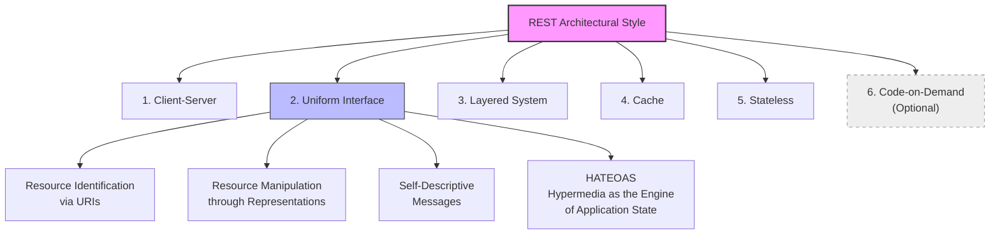
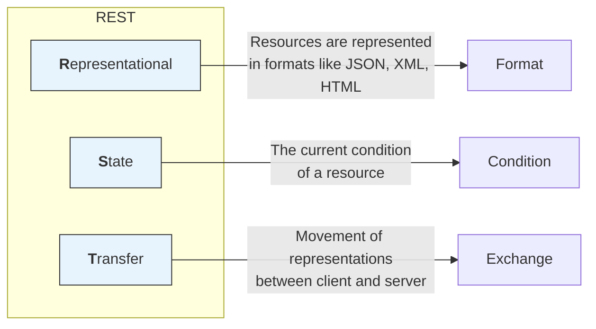
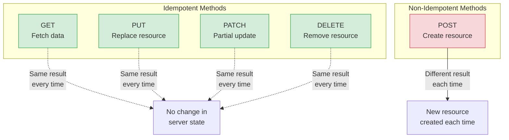
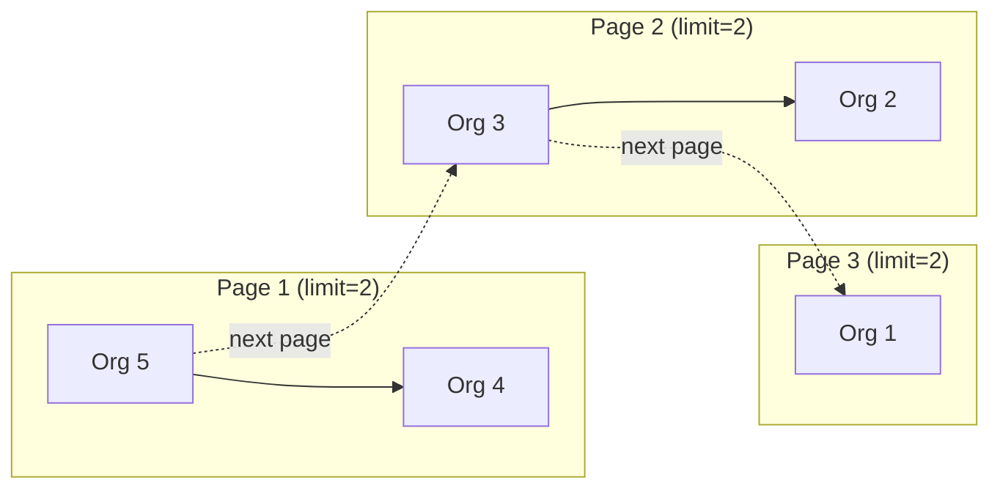
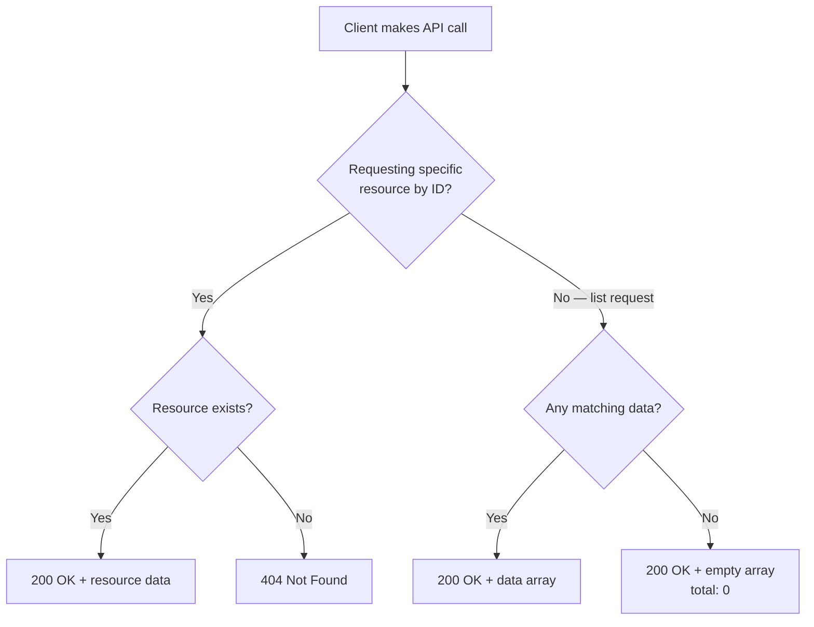

# Part 11 — Complete REST API Design

> [!info] Video reference
> - **Part 11 of 29** in the playlist [[_00 - Backend from First Principles - Index]]
> - **Watch on YouTube:** [11. Complete REST API Design](https://www.youtube.com/watch?v=RG6q57DwV8Y)
> - **Duration:** 2:03:54 | **Views:** 95,710 | **Published:** 2025-02-08
> - **Speaker/Channel:** Sriniously

> [!abstract] In this chapter
> We cover REST API design end to end — from the historical origins of the web and Roy Fielding's architectural constraints, through the precise meaning of "REpresentational State Transfer," to the practical conventions for URL design, resource naming, HTTP methods, idempotency, and non-CRUD custom actions. The first half focuses on building a rock-solid theoretical foundation so that every design decision in the implementation phase is grounded in well-understood principles rather than guesswork.

---

## Table of Contents

- [Why API Design Matters](#Why%20API%20Design%20Matters)
- [A Brief History of the Web](#A%20Brief%20History%20of%20the%20Web)
- [The Scalability Crisis and Roy Fielding](#The%20Scalability%20Crisis%20and%20Roy%20Fielding)
- [The Six REST Constraints](#The%20Six%20REST%20Constraints)
- [Fielding's PhD and the Birth of REST](#Fielding's%20PhD%20and%20the%20Birth%20of%20REST)
- [What "REpresentational State Transfer" Means](#What%20%22REpresentational%20State%20Transfer%22%20Means)
- [Anatomy of a URL](#Anatomy%20of%20a%20URL)
- [API URL Conventions and Best Practices](#API%20URL%20Conventions%20and%20Best%20Practices)
- [Idempotency — A Core Concept](#Idempotency%20%E2%80%94%20A%20Core%20Concept)
- [HTTP Methods and Their Idempotency](#HTTP%20Methods%20and%20Their%20Idempotency)
- [Non-CRUD Custom Actions](#Non-CRUD%20Custom%20Actions)
- [The API Design Workflow](#The%20API%20Design%20Workflow)
- [Identifying Resources from Requirements](#Identifying%20Resources%20from%20Requirements)
- [Demo: Designing the Organizations API](#Demo%3A%20Designing%20the%20Organizations%20API)

---

## Why API Design Matters

### [00:00] The questions that never go away

API design is one of the most important skills a backend engineer will develop over their career. Despite years of collective experience across the industry, backend engineers — especially those early in their journey — still wrestle with a surprisingly persistent set of questions:

- **Should the URI path segment be plural or singular?** Is it `/user` or `/users`?
- **When updating a resource, should you use PATCH or PUT?** Both sound like "update" — what is the difference?
- **Which HTTP method should you use for non-CRUD operations?** If you want the server to perform a custom action that is not a fetch, create, update, or delete — which method do you pick? Since it sounds like an update, should you go with PATCH? Since it is creating something new, should you use POST?
- **What HTTP status code should you return in different scenarios?** When does a 200 suffice? When should you return 201? What about 204, 400, 404, or 500?

These are not trivial questions. They are the daily bread of backend engineering, and the confusion persists because the standards we now take for granted were developed in a very different era — when the web looked nothing like it does today.

### [02:14] The context behind the standards

When people were developing the widespread HTTP API standards, the state of the internet, the web, clients, and servers were fundamentally different from what we have today. Back then, applications were heavily **multi-page applications (MPAs)**, where each user action triggered a full page reload from the server. Today, by contrast, we use **single-page applications (SPAs)**: on the first API call, the browser downloads all the JavaScript it needs and then performs all routing on the client side.

The purpose of this chapter is **not** to create new standards. The standards already exist. The goal is to extract rules and guidelines from those existing standards — standards that emerged from years of research and the accumulated experience of thousands of backend engineers — and follow them consistently. By sticking to a single standard and a consistent styling pattern when designing APIs, payloads, and documentation, you eliminate the need to re-decide these questions for every new project. You can simply focus on business logic.

### [03:56] What this chapter covers

This video explores API design from end to end:

- How to design your **resources**
- How to design your **routes**
- How to return **success responses** and **error responses**
- Which **status codes** to use
- What kind of **data to accept**
- And much more — essentially everything related to API design

After this chapter, the focus shifts from standards to execution. The API interface will have been designed, and the next phase is building the actual implementation.

---

## A Brief History of the Web

### [04:46] Tim Berners-Lee and the birth of the World Wide Web

In **1990**, Tim Berners-Lee started a project called the **World Wide Web** with a simple but profound motivation: to share knowledge with the whole world. This was the initial motivation for what we now call the internet. The project was built to facilitate the sharing of knowledge and information globally.

With that goal in mind, within approximately one year, Berners-Lee invented an extraordinary collection of technologies and concepts — all of which we still use today in their evolved forms:

| # | Invention | What it is |
|---|-----------|-----------|
| 1 | **URI** (Uniform Resource Identifier) | The addressing scheme that lets us identify any resource on the web |
| 2 | **HTTP** (HyperText Transfer Protocol) | The protocol that underpins communication between clients and servers |
| 3 | **HTML** (HyperText Markup Language) | The markup language used to construct web pages — the "skeleton" of a page |
| 4 | **The first web server** | The software that serves web content to requesting clients |
| 5 | **The first web browser** | The software that requests and renders web content for end users |
| 6 | **The first WYSIWYG editor** | A "What You See Is What You Get" HTML editor built directly into the browser |

### [06:18] These technologies are still with us

We still use URIs. We still use HTTP — it started with HTTP 1.1, and now we have HTTP 2.0 and 3.0. We still use HTML. We have many different types of web servers, many different types of browsers, and browsers still include built-in HTML editors. All these technologies and concepts that Berners-Lee invented within about a year are the ancestors of the tools we use every day.

---

## The Scalability Crisis and Roy Fielding

### [07:07] The problem of exponential growth

The World Wide Web project was heading towards **breakdown** because of the exponential growth of its user base. Within a short period of time, a huge number of people started using this new technology. Tim Berners-Lee had not accounted for this scale — the number of users was not factored into the original design. To scale the web to accommodate this large user base, new techniques, standards, and components had to be introduced. The previous mindset, technologies, and planning were simply not enough to handle the huge user base the web was acquiring every day.

### [08:16] Roy Fielding enters the picture

Around **1993**, **Roy Fielding** — the co-founder of the **Apache HTTP Server** project — became concerned about the web's scalability problem. The web was not ready to accommodate the thousands and thousands of users that were using the World Wide Web project every day. To address this issue and make the World Wide Web more scalable, Fielding proposed a set of **constraints** that could help achieve that goal.

---

## The Six REST Constraints

These six constraints, proposed by Roy Fielding, form the foundation of the REST architectural style. Each one was designed to address a specific aspect of scalability and reliability.



> **What this diagram shows:** The six REST constraints form a hierarchy. The **Uniform Interface** is the most complex constraint, with four sub-constraints that govern how resources are identified, manipulated, described, and linked. **Code-on-Demand** is optional (shown with a dashed border) and is rarely used in practice.

### [08:53] 1. Client-Server

The client-server constraint emphasizes the **separation of concerns** between the client and the server:

- The **client** handles all user interface and user experience
- The **server** manages data storage and business logic

We also call these the **front end** and **back end**. This separation allows each component to **evolve independently** and to improve scalability. A change to the UI does not require a change to the data storage layer, and vice versa.

### [09:23] 2. Uniform Interface

The uniform interface constraint simplifies the overall system architecture by establishing a **standardized way** for the different components that the web comprises to communicate with each other. The philosophy of the uniform interface is that uniformity provides a **consistent interface across all services**.

This constraint includes **four sub-constraints**:

1. **Resource Identification via URIs** — Every resource is uniquely identified by a consistent naming scheme (URIs).
2. **Resource Manipulation through Representations** — Clients interact with resources by exchanging representations (e.g., JSON, HTML, XML) of those resources.
3. **Self-Descriptive Messages** — Each message contains enough information to describe how to process it (e.g., content-type headers, HTTP methods).
4. **Hypermedia as the Engine of Application State (HATEOAS)** — The client navigates the application entirely through hypermedia links provided in the server responses, without needing out-of-band knowledge of the API structure.

### [10:11] 3. Layered System

The layered system constraint says that the architecture is composed of **hierarchical layers**, and each layer can only see and interact with the **immediate layer below it**. This allows for:

- Better **scalability**
- Better **security**
- The ability to add intermediate components like **load balancers** and **proxy servers**

We use these intermediate components today to scale our web applications to cater to millions of users — all without affecting the system's core functionality. A client does not need to know (or care) whether its request passes through a load balancer, a CDN, or an API gateway before reaching the actual server.

### [10:46] 4. Cache

Responses from the server must be **explicitly labeled as cacheable or non-cacheable**. When clients need to, they can cache the responses, which helps:

- Reduce **server load**
- Improve **network efficiency**
- Enhance **user experience** by providing faster response times

The server is responsible for indicating whether a given response can be cached and for how long (via headers like `Cache-Control`, `ETag`, and `Expires`).

### [11:17] 5. Stateless

Stateless has been covered in more depth in the [[05 - Understanding HTTP for Backend Engineers|HTTP video]], but the core idea is:

Each request from the client to the server must contain **all the information necessary** to understand and process the request. The server does **not** remember what your previous request was about. With each request, you must include all the information necessary so that the server can identify you, take your data, understand it, and process it.

The server does not store any client context between requests. This improves:

- **Reliability** — any server can handle any request
- **Scalability** — since no session state is stored server-side, adding more servers is straightforward
- **Visibility** — each request is self-contained and can be inspected independently

**Practical example:** When you scale your web application and add two more servers behind a load balancer that forwards traffic using round-robin (or any other algorithm), all the servers can process requests from the same client — because of the statelessness constraint. Every request carries all the information needed to process it.

### [12:39] 6. Code-on-Demand (Optional)

This is an **optional** constraint, which means servers can temporarily extend client functionality by transferring **executable code** (like JavaScript) to the client. This provides flexibility to add client-side functionality when needed while maintaining the other constraints. Code-on-Demand is not something you will see used heavily in practice.

---

## Fielding's PhD and the Birth of REST

### [13:09] From constraints to HTTP 1.1

These six constraints — proposed by Roy Fielding to solve the scalability problem of the web — were just the beginning. Fielding later worked with Tim Berners-Lee, and together they:

- Worked to increase the scalability of the web
- Standardized their designs
- Wrote a specification for the new version of HTTP, which we know today as **HTTP 1.1** — the first major, standard version of the HTTP protocol

### [14:00] The year 2000: REST is formally named

In the year **2000**, after the scalability crisis of the web was averted, Roy Fielding named and described the web's architectural style in his **PhD dissertation**. He called it **REST** — **RE**presentational **S**tate **T**ransfer. That was the name Fielding gave to his description of the web's architectural style, which today we know as REST APIs.

If you search for "Roy Fielding REST paper," you can directly read the first document ever written about REST APIs. It gives tremendous context about what led to the creation of all these patterns and concepts. Reading it is a must for any backend engineer — it reveals where all the technologies, patterns, and standards we use today originated.

---

## What "REpresentational State Transfer" Means

### [15:00] Breaking down the name

The name "REST" is not arbitrary. Each word in "Representational State Transfer" carries precise meaning. Understanding it gives you a much deeper appreciation for the architecture.



> **What this diagram shows:** Each word in "REpresentational State Transfer" maps to a specific concept. "Representational" means resources exist in various formats. "State" means the current condition of a resource. "Transfer" means moving these representations between client and server.

### [15:34] Representational

The first part — **Representational** — means that resources on the internet (data or objects) are represented in a **specific format**. These representations can be in various formats:

- **JSON** — the most popular representation format today
- **XML** — still used in many enterprise systems
- **HTML** — used for server-to-browser communication

The same resource can have **different representations** depending on the client's needs:

| Communication Type | Typical Format |
|-------------------|----------------|
| Server to server | JSON |
| Server to browser (web page) | HTML |
| Server to mobile app | JSON |

**Example — a User resource:** A user resource with fields like `id`, `name`, and `createdAt` might be represented as:
- A **JSON object** when an API client (e.g., another server) requests it
- An **HTML document** when a web browser requests it for rendering in the UI

### [17:55] State

The second part — **State** — refers to the **current condition or attributes** of a particular resource. The "state" of a resource is its current set of properties — the current value of its fields.

Each resource has a state that can be transferred between client and server. The state is driven by the resource's representation.

**Example — a shopping cart on Amazon:** A shopping cart's state includes:
- All the items in the cart
- The quantities of each item
- The total price

This collection of information — this "state" — is what gets transferred between the client and server with each API call.

### [18:52] Transfer

The third part — **Transfer** — indicates the **movement of resource representations** between client and server. Since we have a client-server model, the primary purpose is sending data between the two. The client and server can exchange different representations of the same resource.

The transfer of data happens through a common standard — **HTTP** — using different methods: `GET`, `POST`, `PUT`, `DELETE`, `PATCH`, `OPTIONS`, `HEAD`, and so on.

**Example:** When you request a web page by sending a `GET` request to a server, you are transferring a **representation** from server to client using the HTTP `GET` method.

### [20:07] Combining all three

When you combine all three elements, REST describes an architectural style where:

1. **Resources are represented in different formats** (JSON, HTML, XML, etc.)
2. **The state of these resources can be transferred** between server and client
3. **Clients and servers communicate** by sharing these representations of a resource
4. **The whole system follows specific constraints** to make the workflow more scalable (the six constraints discussed above)

That is what we mean by a RESTful API or REST architecture.

---

## Anatomy of a URL

### [21:53] URL structure breakdown

Every URL on the web follows a consistent high-level structure:

```
scheme://authority/path?query#fragment
```

| Part | What it is | Example |
|------|-----------|---------|
| **Scheme** | The protocol — HTTP or HTTPS (the secure, encrypted version) | `https` |
| **Authority** | The domain name (may include a subdomain) | `www.example.com` |
| **Path** | The resource being accessed; forward slashes represent hierarchical relationships | `/books/harry-potter` |
| **Query parameters** | Key-value pairs, typically used in GET APIs to pass filters, pagination, etc. | `?sort=name&page=1` |
| **Fragment** | Navigates to a particular section of a web page | `#section-2` |

### [22:35] Hierarchical relationships in paths

The **forward slash** (`/`) in a URL path represents a **hierarchical relationship** between different resources. Each segment of the path represents a deeper level of the hierarchy. For example, in `/books/harry-potter`:

- `books` is the first level — a collection of all book resources
- `harry-potter` is the second level — a specific resource within that collection

### [22:58] Query parameters and fragments

**Query parameters** are used (usually in GET APIs) to pass key-value pairs to the server — things like filter values, sort options, or pagination controls.

**Fragments** navigate you to a particular section of a web page. When you first navigate to a URL that includes a fragment, the browser scrolls you to that part of the page.

---

## API URL Conventions and Best Practices

### [23:42] The `api.` subdomain convention

When building APIs (as opposed to web pages), industry best practice is to use a **dedicated subdomain** for the API:

```
https://api.example.com/v1/books
```

The `api.` prefix clearly separates the API server from the main website or application server. This is not a hard rule — it is a widely-followed convention that makes it immediately clear to consumers what they are talking to.

### [24:20] Versioning through routes

Most APIs implement some kind of **versioning pattern**, typically through the URL path. This is done via routes like `/v1`, `/v2`, etc.:

```
https://api.example.com/v1/books
https://api.example.com/v2/books
```

Versioning allows you to make breaking changes to your API (introducing a `/v2`) while keeping the old version (`/v1`) running for clients that have not yet migrated. The version number is placed in the path after the domain and before the resource name.

### [25:10] Resource names: always plural

The **first rule** of API URL design: in the path segment, whatever resource you are dealing with should **always be in plural form**.

```
GET /books          ✓ (correct — plural)
GET /book           ✗ (incorrect — singular)
```

Even when fetching a **single** book, the resource name remains plural:

```
GET /books/{id}     ✓ (correct — plural + ID)
GET /book/{id}      ✗ (incorrect — singular)
```

The reasoning is that the path represents the **collection** (the resource type), and the ID selects a specific item from that collection. The resource in the URL path is always expressed as a plural noun.

### [27:40] Slug conventions: kebab-case, lowercase

When including human-readable identifiers in URLs (called **slugs**), follow these rules:

1. **Always lowercase** — URLs travel through many different environments (servers, clients, operating systems), and you do not want case-sensitivity issues
2. **Replace spaces with hyphens** (kebab-case) — never use underscores or spaces in URLs
3. **No special characters** — keep slugs clean and URL-safe

**Example — "Harry Potter":**
1. Convert to lowercase: `harry potter`
2. Replace spaces with hyphens: `harry-potter`
3. Final URL: `/books/harry-potter`

A **slug** is a human-readable representation of some property of a resource (like its name) that is ideal for putting inside a URL.

### [30:01] Hierarchical paths in practice

The forward slash `/` in a path segment means there is a **hierarchical relationship** between resources. For example:

```
GET /books/harry-potter
```

This says:
- **First level of hierarchy:** We have a collection of resources called `books`
- **Second level of hierarchy:** We want to access one particular resource from that collection — the specific book identified by the slug `harry-potter`

Whenever you use path segments in an API route, think of them as expressing a hierarchical relationship between different resources.

---

## Idempotency — A Core Concept

### [30:58] Definition

**Idempotency** is a very important theoretical concept in REST APIs. It refers to the property of certain operations in which **performing the same action multiple times has the same effect as performing it once**.

In the REST API context: it does not matter how many times the client performs a particular request — the **outcome** (the result of that request on the server) **remains the same**. Whether you call an API once or a thousand times, the result should be the same if that API call is idempotent.



> **What this diagram shows:** HTTP methods are classified by idempotency. GET, PUT, PATCH, and DELETE are idempotent — calling them repeatedly produces the same server state. POST is the only non-idempotent method — each call creates a new resource, so the side effects accumulate.

---

## HTTP Methods and Their Idempotency

### [33:26] The five major HTTP methods

There are five major HTTP methods used for data operations between clients and servers: **GET**, **POST**, **PUT**, **PATCH**, and **DELETE**. (Other methods like `HEAD` and `OPTIONS` exist but serve auxiliary purposes — `HEAD` fetches only headers, and `OPTIONS` is used in CORS preflight requests to check whether an origin is allowed.)

### [34:00] GET — Idempotent

GET is used to **retrieve data** from a server. It is considered idempotent because it does not matter how many times you perform a GET request — you will get the same outcome. A GET call is just a fetch operation; it does not cause any side effects on the server.

**Example:** Fetching a list of books. Whether you call the API once or a thousand times, you get the same list of books. You are not changing anything on the server.

"But what if someone else creates a new book while you are making repeated API calls?" — that is true, the response may change due to external factors, but idempotency is about **what side effects your API call causes**, not about concurrent changes by other actors.

### [35:10] PATCH — Idempotent

PATCH is used to **partially update** a resource — updating one or a few fields. It is idempotent because applying the same partial update multiple times yields the same result.

**Example — updating a user's name:** If the previous name was "A" and you send `{ "name": "B" }`:
1. First API call: Name changes from A → B
2. Second API call: Name is already B, sending `{ "name": "B" }` again keeps it as B
3. Thousandth API call: Still B

The side effect is the same regardless of how many times you call it.

### [36:00] PUT — Idempotent

PUT is used to **completely replace** the representation of a resource. With PUT, you must send **all** fields in the payload (ID, name, createdAt, everything) so that the server can replace the existing entity entirely with the one from the client payload.

Like PATCH, PUT is idempotent: sending the same complete payload repeatedly results in the same server state.

### [36:25] PATCH vs PUT — semantic difference

| Aspect | PATCH | PUT |
|--------|-------|-----|
| **What it updates** | One or a few fields | The entire resource |
| **Payload** | Only the fields you want to change | All fields of the resource |
| **Use case** | Updating a user's name | Replacing a user's entire profile |

Most of the time, PUT and PATCH are used interchangeably, and that is fine to some extent — especially when using your API internally. However, when building a **public API**, you must stick to the standard. If you use PUT when you should be using PATCH, external engineers integrating your API will get confused because they assume you follow the standard. The guideline: if you want to update a resource partially, use **PATCH**. If you want to completely replace it, use **PUT**.

### [38:56] DELETE — Idempotent

DELETE is also idempotent, and the reasoning is subtle but important:

1. **First API call:** You delete a user with ID 1. The user is removed from the database.
2. **Second API call:** You attempt to delete the same user again. The server checks, finds the user does not exist, and returns a **404 error**. But did you cause any side effect? **No** — the user was already deleted. No state changed.
3. **Millionth API call:** Same 404 error. Same result. No additional side effect.

The side effect happened only once (on the first call). Every subsequent call produces the same outcome: no change in server state. That is why DELETE is considered idempotent.

### [40:47] POST — The only non-idempotent method

POST is the **only method in HTTP semantics that is considered non-idempotent**. POST is typically used to **create a new resource** on the server.

**Example — creating a book:**
1. **First API call:** You send a payload with book details (name, description, weight, dimensions). The server creates a new book in the database.
2. **Second API call:** You send the **exact same payload** again. The server creates **another** new book — a second entity with the same properties but a different ID (IDs are generated at the database level via UUID or auto-increment).

Each API call creates a new book. Call it a thousand times, and you have a thousand new books. The side effects are **different with each call** — that is the definition of non-idempotent.

### [42:49] IDs are generated server-side

IDs are usually generated at the database level — whether UUIDs, serial values (1, 2, 3, 4…), or other strategies. This is why you can have multiple resources with the same properties (same name, same description, same weight) but different IDs. The server does not reject duplicate data because the ID is what uniquely identifies each record.

### [44:02] POST as the "catch-all" method

Whenever you have a **non-CRUD operation** — an action that does not fall under any of the standard HTTP methods (not a fetch, not an update, not a create, not a delete) — the REST API spec has made the POST method **open-ended** for exactly this purpose. You can put any custom action under POST.

---

## Non-CRUD Custom Actions

### [44:26] What are custom actions?

A **custom action** is an API call that does not map to any of the four CRUD operations (Create, Read, Update, Delete). It is a custom action — something you want the server to perform that is not covered by the standard HTTP method semantics.

**Example — "send email":**

```
POST /send-email
```

With a payload like:
```json
{
  "target": "some-email@example.com"
}
```

The server extracts the target email address and sends the email. Now, what HTTP method would you assign? It is:
- Not a fetch (GET) operation
- Not a create (POST) operation in the traditional sense — you are not creating a resource in the database
- Not an update (PATCH/PUT) operation
- Not a delete (DELETE) operation

This is a **custom action**, and because of scenarios like this, the REST spec made POST the open-ended method for actions that cannot be categorized under any of the existing CRUD operations.

---

## The API Design Workflow

### [46:27] Design the interface before writing code

Before you start coding — before you write any business logic — the first thing you should do when creating an API is **design the interface**. The interface should be intuitive, delightful to use, and should not be vague. It should follow most of the REST API standards.

### [47:14] Why follow standards?

The reason for following RESTful standards is to **eliminate confusion, assumptions, and human-related errors** in the entire workflow. If you do not follow standards — if you use POST when you should use PUT, or DELETE when you should use GET — the only way for consumers of your API to figure out the correct behavior is to:

1. **Read your code** (if it is open source or they have access), or
2. **Try different methods** experimentally and hope the result is expected

Both paths are full of room for errors, confusion, and assumptions. When you follow a common standard, consumers of your API already have **80% knowledge** of how it behaves. The effort and time to integrate your API decreases significantly, there are fewer bugs, fewer confusions, and fewer sync-up calls needed.

### [50:22] Start with wireframes

The first thing you should do as a backend engineer when designing an API is **start from the UI design interface** — Figma, or whatever design tool your product team uses to build wireframes or user stories.

The chain of consumption works like this:

1. **Users** interact with the **platform**
2. The platform is built by **frontend engineers**
3. Frontend engineers consume the **API** that you (the backend engineer) build
4. You, in turn, interact with **databases**

By looking at the wireframes — the designs of how users are going to interact with the platform — you gain a clear understanding of how the end user relates to the data. This is the excellent starting point for your API interface design.

---

## Identifying Resources from Requirements

### [52:13] Resources are nouns

Since we are talking about REST APIs, the first important concept is **resources**. Resources are basically **nouns** that you can identify from:

- Wireframes and design mockups
- Conversations with clients and product managers
- Understanding the requirements

This is a thumb rule: **whatever nouns you can find from your requirements are your resources**.

### [53:03] Example: a project management platform

Imagine you are working on a project management SaaS — something like **Jira** or **Linear**. After going through all the wireframes, Figma designs, and conversations with clients and product people, you analyze your requirements and identify nouns:

| Noun | Resource |
|------|----------|
| Projects | Projects |
| Users | Users |
| Organizations | Organizations (users can belong to different organizations) |
| Tasks | Tasks (each project has tasks) |
| Tags | Tags (tasks can be organized with tags) |

Once you have analyzed your designs, you can easily come up with these resources and note them down. These are the top-level entities that your backend will expose.

### [55:10] Resources → Schema → API

The workflow after identifying resources:

1. **Identify resources** from wireframes and requirements (the nouns)
2. **Design database schemas** using those resources (covered in a separate database-focused video)
3. **Design API interfaces** around those resources and schemas

Since this video focuses only on the REST API side, the database schema design is skipped and a quick schema is assumed. The next video in the playlist covers database design in depth.

---

## Demo: Designing the Organizations API

### [55:52] The starting schema

The demo builds the API interface for a project management platform. The assumed database schema has three tables:

| Table | Purpose |
|-------|---------|
| **organizations** | All organizations that exist on the platform |
| **projects** | All projects within an organization |
| **tasks** | All tasks created inside a project |

### [56:45] CRUD actions for organizations

For the organization resource, five actions are identified:

| Action | HTTP Method | Description |
|--------|-------------|-------------|
| Create organization | POST | Add a new organization |
| Get all organizations | GET | List all organizations |
| Get single organization | GET | Fetch one organization by ID |
| Update organization | PATCH | Modify an organization |
| Delete organization | DELETE | Remove an organization |

### [59:47] GET /organizations — the list API

The first API designed is the **list all organizations** endpoint:

```
GET http://localhost:3000/organizations
```

Key design decisions:
- **Method:** GET (it is a fetch operation)
- **Path:** `/organizations` (plural, lowercase, no versioning in the demo)
- **No versioning** in the demo, but in production it would be `/v1/organizations`

In a production setup, the URL would look like:
```
https://api.example.com/v1/organizations
```

### [01:00:39] POST /organizations — the create API

The second API designed is the **create organization** endpoint:

```
POST http://localhost:3000/organizations
```

Notice that the URL is **identical** to the list API. The server differentiates between these two API calls using the **HTTP method**:

- If it is a **POST** method → the route goes to the controller that handles **creating** an organization
- If it is a **GET** call with the same URL → the route goes to the controller that handles **listing** all organizations

This is a fundamental principle of REST: **the same URL can serve different operations depending on the HTTP verb used**. The method is what disambiguates the intent.

---


---

---
title: "Complete REST API Design"
tags:
  - backend
  - video-notes
  - rest-api
  - api-design
course: "[[_00 - Backend from First Principles - Index]]"
source: "https://www.youtube.com/watch?v=RG6q57DwV8Y"
video_id: RG6q57DwV8Y
playlist_position: 11
duration_seconds: 7414
view_count: 95710
published: 2025-02-08
status: completed
---

# Part 11 — Complete REST API Design

> [!info] Video reference
> - **Part 11 of 29** in the playlist [[_00 - Backend from First Principles - Index]]
> - **Watch on YouTube:** [11. Complete REST API Design](https://www.youtube.com/watch?v=RG6q57DwV8Y)
> - **Duration:** 2:03:54 | **Views:** 95,710 | **Published:** 2025-02-08
> - **Speaker/Channel:** Sriniously

> [!abstract] In this chapter
> We design a complete REST API from first principles — covering HTTP methods and their semantic meaning, URL and resource naming conventions, status code usage across every CRUD operation, pagination, sorting, filtering, custom actions, and the consistency principles that separate a usable API from a great one. The entire design is done in an API client (Insomnia) before writing a single line of code, reinforcing the idea that API **design** precedes API **implementation**.

---

## Table of Contents

- [REST API Design Is a Design-First Exercise](#REST%20API%20Design%20Is%20a%20Design-First%20Exercise)
- [HTTP Methods and Their Semantic Meaning](#HTTP%20Methods%20and%20Their%20Semantic%20Meaning)
- [URL Structure and Resource Naming](#URL%20Structure%20and%20Resource%20Naming)
- [Status Code Families](#Status%20Code%20Families)
- [JSON Conventions — camelCase](#JSON%20Conventions%20%E2%80%94%20camelCase)
- [Introducing the Data Models](#Introducing%20the%20Data%20Models)
- [Create — POST Operation](#Create%20%E2%80%94%20POST%20Operation)
- [List — GET Operation with Pagination](#List%20%E2%80%94%20GET%20Operation%20with%20Pagination)
- [Sorting in List APIs](#Sorting%20in%20List%20APIs)
- [Filtering in List APIs](#Filtering%20in%20List%20APIs)
- [Update — PATCH Operation](#Update%20%E2%80%94%20PATCH%20Operation)
- [Get Single Resource — GET Operation](#Get%20Single%20Resource%20%E2%80%94%20GET%20Operation)
- [Delete — DELETE Operation](#Delete%20%E2%80%94%20DELETE%20Operation)
- [When to Return 404 vs Empty Array](#When%20to%20Return%20404%20vs%20Empty%20Array)
- [Custom Actions — POST Beyond CRUD](#Custom%20Actions%20%E2%80%94%20POST%20Beyond%20CRUD)
- [Applying the Same Patterns to Projects](#Applying%20the%20Same%20Patterns%20to%20Projects)
- [API Design Best Practices](#API%20Design%20Best%20Practices)
- [Key Takeaways](#Key%20Takeaways)
- [Related Notes](#Related%20Notes)

---

## REST API Design Is a Design-First Exercise

### [00:00] Why design before coding?

A REST API, at least in its initial form, is **designed** — not coded or programmed — right away. Before jumping into any programming language (Go, Node, Python, etc.) or framework, you should dedicate a separate session to designing the interface of your APIs. This is the reason this video uses no programming language or framework-specific implementation at all: the entire focus is on designing the **interface** — the contract between client and server.

The design phase answers questions like: What URLs will clients call? What HTTP method does each endpoint use? What does the request body look like? What does the response look like? What status codes are returned? These decisions should be made **before** writing any implementation code.

### [00:30] Using an API client for design

The speaker uses **Insomnia** (similar to Postman) to design and test every API endpoint. This is a practical approach: an API client lets you mock requests, inspect responses, and iterate on the interface without writing backend code. Swagger/OpenAPI tools can also serve this purpose and provide interactive documentation.

---

## HTTP Methods and Their Semantic Meaning

### [01:00] GET, POST, PATCH, DELETE — what each means

Each HTTP method carries a **semantic meaning** that should be respected:

| Method | Purpose | Typical Use |
|--------|---------|-------------|
| **GET** | Retrieve data | List resources, get a single resource |
| **POST** | Create a new resource (or perform a custom action) | Create an organization, clone a project |
| **PATCH** | Partially update an existing resource | Update the status of an organization |
| **DELETE** | Remove a resource | Delete an organization or project |
| **PUT** | Fully replace a resource | ⇢ *Rarely used in modern SPAs; PATCH is preferred* |

The key principle: **PATCH** is for partial updates (sending only the fields you want to change), while **PUT** is for replacing the entire entity. In single-page applications (SPAs) where data is JSON-heavy, PATCH is almost always the better choice because you typically want to update only a subset of fields.

---

## URL Structure and Resource Naming

### [01:30] The hierarchical pattern

Every URL follows a consistent hierarchical pattern:

```
{server-address}/{plural-resource-name}/{resource-id}
```

For example:
- `http://localhost:3000/organizations` — list or create organizations
- `http://localhost:3000/organizations/{id}` — get, update, or delete a specific organization
- `http://localhost:3000/organizations/{id}/archive` — perform a custom action on a specific organization

**Rules:**
1. Resources are always in **plural form** (`organizations`, not `organization`).
2. Resource names are **lowercase**.
3. The resource **ID** goes in a dynamic path segment after the resource name.
4. **Custom actions** are appended as a verb after the resource ID.

### [02:00] Routes for CRUD vs. custom actions

| Operation | HTTP Method | Route Pattern |
|-----------|------------|---------------|
| Create resource | POST | `/{resources}` |
| List resources | GET | `/{resources}` |
| Get single resource | GET | `/{resources}/{id}` |
| Update single resource | PATCH | `/{resources}/{id}` |
| Delete single resource | DELETE | `/{resources}/{id}` |
| Custom action | POST | `/{resources}/{id}/{action}` |

Notice: the **create** and **list** routes share the same URL (`/{resources}`) — the HTTP method (POST vs GET) distinguishes them. Similarly, **get**, **update**, and **delete** share `/{resources}/{id}` — the HTTP method differentiates them.

---

## Status Code Families

### [02:30] The 200, 201, 204, 400, 404, and 500 series

Status codes communicate the **outcome** of an API call:

| Code | Meaning | When to Use |
|------|---------|-------------|
| **200** | OK | Successful GET, PATCH, or custom action |
| **201** | Created | Successful POST that created a new resource |
| **204** | No Content | Successful DELETE (nothing to return) |
| **400** | Bad Request | Validation error, malformed payload |
| **404** | Not Found | Requesting a specific resource that doesn't exist |
| **500** | Internal Server Error | Unexpected server-side failure |

> [!important] Don't blindly assume POST = 201
> A POST call does **not** always return 201. POST is also used for custom actions that don't create a resource — those return **200**. The status code depends on what happens on the server side, not on the HTTP method alone.

---

## JSON Conventions — camelCase

### [03:00] Consistent field naming

All JSON payloads — whether sent from client to server or returned from server to client — should follow **camelCase** naming:

```json
{
  "organizationId": "...",
  "createdAt": "...",
  "updatedAt": "..."
}
```

This is a widely established standard in the JSON ecosystem. Using camelCase consistently means clients don't have to guess or consult documentation for basic field naming.

---

## Introducing the Data Models

### [03:30] Organizations, Projects, and Tasks

The video designs APIs around three resources:

**Organization schema:**
| Field | Source | Notes |
|-------|--------|-------|
| `id` | Server-generated | UUID or auto-increment |
| `name` | Client-provided | Required |
| `status` | Client-provided or defaulted | `active` or `archived` |
| `description` | Client-provided | Optional |
| `createdAt` | Server-generated | Timestamp |
| `updatedAt` | Server-generated | Timestamp |

**Project schema:**
| Field | Source | Notes |
|-------|--------|-------|
| `id` | Server-generated | UUID |
| `name` | Client-provided | Required |
| `organizationId` | Client-provided | FK to an existing organization |
| `status` | Client-provided or defaulted | `planned`, `active`, etc. |
| `description` | Client-provided | Optional |
| `createdAt` | Server-generated | Timestamp |
| `updatedAt` | Server-generated | Timestamp |

> [!tip] Server-handled fields are excluded from payloads
> Fields like `id`, `createdAt`, and `updatedAt` are **never** accepted from the client. They are generated on the server side. The client only sends the fields it owns.

---

## Create — POST Operation

### [01:02:36] A typical POST call

The create operation for a resource follows this pattern:

1. **Route:** `POST /organizations`
2. **Body:** A JSON payload with client-provided fields (`name`, `status`, `description`). Server-handled fields (`id`, `createdAt`, `updatedAt`) are excluded.
3. **Response:** Status code **201 Created**, with the **newly created entity** returned in the response body.

```http
POST /organizations
Content-Type: application/json

{
  "name": "Org One",
  "status": "active",
  "description": "some description"
}
```

**Response (201):**
```json
{
  "id": "generated-uuid",
  "name": "Org One",
  "status": "active",
  "description": "some description",
  "createdAt": "2025-...",
  "updatedAt": "2025-..."
}
```

The response includes the server-generated fields (`id`, `createdAt`) alongside the client-provided fields. This lets the client know the exact state of the newly created resource.

---

## List — GET Operation with Pagination

### [01:05:18] Why pagination matters

When we call the list endpoint (`GET /organizations`) after creating an organization, the response includes **pagination metadata** alongside the data:

```json
{
  "data": [...],
  "total": 5,
  "page": 1,
  "totalPages": 3
}
```

**Pagination** is a technique used whenever a list API could return a large number of resources. Without pagination, serializing thousands of records into a JSON payload is a resource-heavy operation that introduces delay. JSON serialization and deserialization are expensive — sending 1,000 organizations in one response can cause a 3–4 second delay that end users will notice, even though they only see 10–20 on screen.



> **What this diagram shows:** With 5 organizations and a limit of 2, the server divides the data into 3 pages. Page 1 returns the two most recently created, page 2 returns the next two, and page 3 returns the last one. The client fetches one page at a time, only loading what the user currently needs.

### [01:09:29] Pagination response fields

A paginated response contains four key pieces of metadata:

| Field | Purpose |
|-------|---------|
| `data` | The portion of resources for the current page |
| `total` | Total count of all resources in the database (independent of the page) |
| `page` | Which page this response represents |
| `totalPages` | How many pages exist in total |

The `total` field lets the client display UI elements like "Showing 1–10 of 50 organizations." The `totalPages` field helps the client decide whether to fetch the next page — if `page === totalPages`, there are no more pages to load (useful for infinite scroll to stop making API calls).

### [01:12:00] Query parameters: `limit` and `page`

Since GET calls cannot have a body, the client sends pagination controls as **query parameters**:

```
GET /organizations?limit=2&page=1
```

**Server defaults** (when the client doesn't provide these):
- `page` defaults to **1**
- `limit` defaults to **10 or 20** (a reasonable chunk)

The server must **never** require these parameters — they are optional. If the client sends nothing, the server sets sensible defaults and returns a valid response. This is a core principle: **the server should set defaults for obvious parameters so the client doesn't have to pass them explicitly.**

### [01:14:30] Walking through pages

With 5 organizations and `limit=2`:

| Request | Response | Notes |
|---------|----------|-------|
| `?page=1&limit=2` | Org 5, Org 4 | `totalPages=3`, sorted by `createdAt` descending |
| `?page=2&limit=2` | Org 3, Org 2 | Same metadata, different slice |
| `?page=3&limit=2` | Org 1 | Last page — only 1 result even though limit is 2 |

Results are sorted by `createdAt` descending by default — the newest entries appear first. This is the "natural state" and the server's default sort even if the client sends nothing.

---

## Sorting in List APIs

### [01:16:34] `sortBy` and `sortOrder` parameters

A typical list API should support sorting via two query parameters:

- **`sortBy`** — which field to sort by (e.g., `name`, `createdAt`, `status`)
- **`sortOrder`** — `ascending` or `descending`

```
GET /organizations?sortBy=name&sortOrder=ascending
```

**Server defaults:**
- `sortBy` defaults to **`createdAt`** (the most natural ordering for most resources)
- `sortOrder` defaults to **`descending`** (newest first)

Even if the client passes `sortBy` without `sortOrder`, the server should default to descending. Without any explicit sorting, the server must still sort the results — otherwise the response order would be random between calls because databases don't store entries in any guaranteed sequence.

### [01:19:00] Default sort ensures consistency

Default sorting is critical for consistent API behavior. If the server doesn't sort by default, each API call could return the same data in a different order, confusing clients and making pagination unreliable (you might see duplicate entries or miss entries when flipping pages).

---

## Filtering in List APIs

### [01:21:16] Filter by field values

Filtering allows the client to narrow the list by specific field values. The filter parameter name corresponds to the field name on the resource:

```
GET /organizations?status=archived
GET /organizations?status=active
GET /organizations?name=Org+One
```

The server returns only the organizations matching the filter. Multiple filters can be combined:

```
GET /organizations?status=active&name=Org+One
```

> [!tip] Filter parameters are resource-specific
> The available filter parameters depend on the fields of the resource. For organizations, you might filter by `status` or `name`. For projects, you might filter by `status` or `organizationId`. The server defines which fields are filterable.

---

## Update — PATCH Operation

### [01:23:44] Partial updates with PATCH

The update operation uses **PATCH** (not PUT) because in modern SPAs we typically want to update only a subset of fields, not replace the entire entity:

1. **Route:** `PATCH /organizations/{id}`
2. **Body:** A JSON payload with only the fields to update.
3. **Response:** Status code **200 OK**, with the **updated entity** returned.

```http
PATCH /organizations/{id}
Content-Type: application/json

{
  "status": "active"
}
```

**Response (200):**
```json
{
  "id": "...",
  "name": "Org Six",
  "status": "active",
  ...
}
```

The dynamic parameter (`{id}`) in the URL identifies which specific resource to update. This pattern — passing the resource ID in the path — is used for all single-resource operations (GET, PATCH, DELETE).

### [01:24:00] PATCH vs PUT — when to use which

| | PATCH | PUT |
|---|-------|-----|
| **Semantics** | Partial update | Full replacement |
| **Payload** | Only changed fields | Entire entity |
| **Use case** | Modern SPAs, JSON-heavy APIs | Legacy multi-page apps, full entity replacement |
| **Preferred?** | ✅ Yes, in most cases | ⚠️ Rarely |

Many developers use PUT and PATCH interchangeably, but PATCH is the semantically correct choice for partial updates. Stick to the standard: use PATCH when updating individual fields.

---

## Get Single Resource — GET Operation

### [01:27:19] Fetching a single resource

To fetch information about a specific resource, the client sends a GET request with the resource ID in the path:

```http
GET /organizations/{id}
```

**Response (200):** The single organization entity.

The route looks identical to PATCH and DELETE — the only difference is the HTTP method. This is the power of REST: the same URL can serve different operations depending on the verb.

---

## Delete — DELETE Operation

### [01:28:32] Removing a resource

The delete operation:

1. **Route:** `DELETE /organizations/{id}`
2. **Body:** None (the ID is in the URL).
3. **Response:** Status code **204 No Content** — an empty response body.

```http
DELETE /organizations/{id}
```

**Response (204):** *(empty body)*

The 204 status code tells the client: "The operation was successful (it's in the 200 series), but there is no content to return because you deleted the resource." This is the standard practice for delete operations.

### [01:29:00] Verifying deletion

After deleting, calling the list endpoint confirms the resource is gone (the list is one shorter). Calling the get endpoint for the deleted resource returns **404 Not Found**.

---

## When to Return 404 vs Empty Array

### [01:30:00] The thumb rule

This is a critical distinction that many APIs get wrong:

| Scenario | Correct Response |
|----------|-----------------|
| Client requests a **specific resource** by ID that doesn't exist | **404 Not Found** |
| Client lists resources with a **filter that matches nothing** | **200 OK** with `{ "data": [], "total": 0 }` |
| Client lists resources and the **database is empty** | **200 OK** with `{ "data": [], "total": 0 }` |



> **What this diagram shows:** A 404 is only appropriate when the client asks for a *specific entity* (by ID or unique identifier) that doesn't exist. For list operations — even with filters that match nothing — the correct response is 200 with an empty array, because the endpoint itself exists and was successfully queried.

> [!warning] Never return 404 for list endpoints
> A 404 means "this resource/endpoint doesn't exist." A list endpoint (`GET /organizations`) always exists — it just might have no matching data. Returning 404 for an empty list is semantically wrong and will confuse API consumers.

---

## Custom Actions — POST Beyond CRUD

### [01:33:24] What are custom actions?

Not every operation on a resource fits neatly into CRUD (Create, Read, Update, Delete). A **custom action** is any operation that doesn't fall under those four categories but still needs to be performed on a specific resource.

**Example: Archiving an organization**

Archiving sounds like it could be a PATCH (changing the status from "active" to "archived"), but in practice, archiving triggers many server-side operations:
- All projects under the organization may need to be removed or archived
- Users in the organization may need to be notified or emailed
- Tasks across all projects may need to be deleted
- Other cascading operations may occur

Because of this complexity, archiving is modeled as a **custom action**, not a simple field update.

### [01:36:00] Custom action URL pattern

```
POST /organizations/{id}/archive
```

The route follows the hierarchical pattern:
1. Server address
2. Resource in plural form (`organizations`)
3. Specific resource ID (dynamic parameter)
4. Action name (`archive`)

**Response:** Status code **200 OK** (not 201, because no new resource was created — the server performed an action and returned the modified entity).

> [!note] POST doesn't always mean 201
> When POST is used for a custom action that doesn't create a new resource, the status code is **200**, not 201. The status code depends on what happened on the server side.

---

## Applying the Same Patterns to Projects

### [01:39:00] Repeating the pattern for a second resource

The speaker creates all project endpoints using the same patterns established for organizations. This section reinforces the patterns:

| Operation | Method | Route | Body | Response Code |
|-----------|--------|-------|------|---------------|
| Create project | POST | `/projects` | `{ name, organizationId, status, description }` | 201 |
| List projects | GET | `/projects` | None | 200 |
| Get project | GET | `/projects/{id}` | None | 200 |
| Update project | PATCH | `/projects/{id}` | Partial fields | 200 |
| Delete project | DELETE | `/projects/{id}` | None | 204 |
| Clone project | POST | `/projects/{id}/clone` | Optional overrides | 201 ⇢ *depends on server behavior* |

### [01:44:00] Consistency across resources

When designing APIs for a single platform, **all resources must follow the same patterns** — regardless of what the resource is:

- **JSON field naming:** If you use `description` in one resource's payload, use `description` (not `desc` or `dsc`) in every other resource.
- **Route patterns:** If organizations use plural form (`/organizations`), projects must too (`/projects`).
- **Query parameters:** If the organization list API supports `limit`, `page`, `sortBy`, `sortOrder`, and filters, the project list API must support the same parameters with the same names.
- **Response structure:** If organization responses return `{ id, name, status, description, createdAt, updatedAt }`, project responses must follow the same structural conventions.

### [01:48:00] Why consistency matters

When a frontend engineer integrates your first API (say, create organization), they make **assumptions** about all your other APIs based on that pattern. They assume:
- Resource names will be plural
- JSON payloads will use the same field names
- List APIs will have the same pagination structure
- Single-resource endpoints will use the same URL pattern

If you break these assumptions — say, by abbreviating `description` as `desc` in one resource — the client gets a validation error and has to read documentation to figure out what went wrong. This wastes their time and erodes trust in your API.

> [!tip] Consistency is the most important characteristic of a good backend engineer
> Once you establish a pattern, **stick to it**. Never rename fields when the context is the same. Never change route conventions between resources. Never alter response structures. Consistency across routes, payloads, and responses is paramount.

### [01:55:00] The clone custom action for projects

Cloning a project is a custom action because:
- It creates a new project with a new ID
- It may also clone all tasks under the project
- It may send notification emails to the project owner
- Other server-side operations may be triggered

**Route:** `POST /projects/{id}/clone`

The clone action returned a **201** response because the server *did* create a new resource (the cloned project). This reinforces the point: the status code depends on what the server does, not on the HTTP method.

---

## API Design Best Practices

### [01:56:35] Interactive documentation

Always provide **interactive documentation** for your APIs. Tools like **Swagger/OpenAPI** provide an interactive playground where developers can try out endpoints directly. This serves dual purposes:
1. You can use it to **test** your APIs during development.
2. API consumers use it as **documentation** and as a testing tool.

How consistently and frequently you create, maintain, and update your OpenAPI/Swagger documentation is one of the most important markers of a good backend engineer.

### [01:57:38] Intuitive and consistent interfaces

All routes, dynamic parameters, custom actions, and JSON payloads should follow a **single pattern**. Following global REST standards is ideal, but even if you can't follow them for some reason, pick a pattern and **stick to it**. Don't change styling across different endpoints or resources.

Keep the behavior, data format, and naming consistent and intuitive.

### [01:58:33] Sensible defaults

Provide defaults for parameters the client might not send:

| Parameter | Default |
|-----------|---------|
| `page` | 1 |
| `limit` | 10 or 20 |
| `sortBy` | `createdAt` |
| `sortOrder` | `descending` |
| `status` (on create) | `active` (a safe assumption for new entities) |

For POST calls, only require the fields you absolutely need. Provide sensible defaults for optional fields like `status` — when a new organization is created, it should be `active` by default even if the client doesn't send a `status` field.

### [02:00:36] Avoid abbreviations

Never abbreviate field names. The people integrating your APIs don't have the same context you do while building them. Use `description`, not `desc`. Use `organizationId`, not `orgId`. Keep fields **intuitive and readable**.

### [02:01:00] Design before implementation

Always design your API interface **before** writing code. Use an API client (Insomnia, Postman) or an OpenAPI spec to mock and test your endpoints. This gives you insights into how clients will consume your API and helps you make better design decisions. Dedicate a separate session to interface design without thinking about programming languages or frameworks.

---

## Key Takeaways

- **Design before code:** REST API design is a design-first exercise. Mock endpoints in an API client before writing any backend code.
- **HTTP methods carry meaning:** GET for reading, POST for creating (or custom actions), PATCH for partial updates, DELETE for removal. Respect the semantics.
- **Consistent URL patterns:** Use plural resource names, lowercase, with the resource ID in the path for single-resource operations. Custom actions go as a verb after the ID.
- **Pagination is essential:** Always paginate list APIs. Return `data`, `total`, `page`, and `totalPages` in every paginated response.
- **Sort by default:** Even without client parameters, sort results (typically by `createdAt` descending) to ensure consistent response order.
- **Filter by field names:** Allow clients to filter list results by any filterable field via query parameters.
- **PATCH over PUT:** Use PATCH for partial updates — it's the modern standard for JSON-heavy SPAs.
- **204 for DELETE:** Return an empty body with a 204 status code on successful deletion.
- **404 only for specific resources:** Return 404 only when a client requests a specific entity by ID that doesn't exist. List endpoints with no matching data return 200 with an empty array.
- **Custom actions use POST:** Any operation that doesn't fit CRUD (archive, clone, etc.) uses POST with a verb in the URL path.
- **Sensible defaults everywhere:** Provide defaults for pagination, sorting, and optional fields so clients don't have to send obvious parameters.
- **Consistency is king:** Every resource, endpoint, payload, and response must follow the same conventions. Don't abbreviate. Don't rename fields. Don't break patterns.
- **Interactive docs matter:** Maintain Swagger/OpenAPI documentation as both a testing tool and a consumer-facing reference.

---

## Related Notes

- MOC: [[_00 - Backend from First Principles - Index]]
- Previous: [[10 - Controllers, Services, Repositories, Middlewares and Request Context]]
- Next: [[12 - Mastering Databases with Postgres]]

---

> [!note] Source fidelity
> This note is written from the video transcript. Where the auto-generated captions were unclear, the meaning was inferred and marked with ⇢ *inferred*. Part 1 content (covering the first ~62 minutes — REST fundamentals, HTTP methods, URL structure, status codes, JSON conventions, and data model introductions) was reconstructed from context present in the Part 2 transcript's opening references. Part 2 content (from ~01:02:36 onward) covers the detailed hands-on demonstration of CRUD operations, pagination, sorting, filtering, custom actions, Projects resource design, and API best practices.

