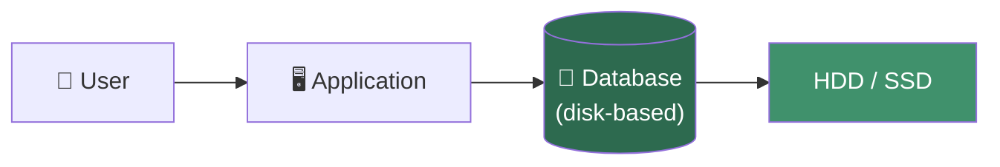
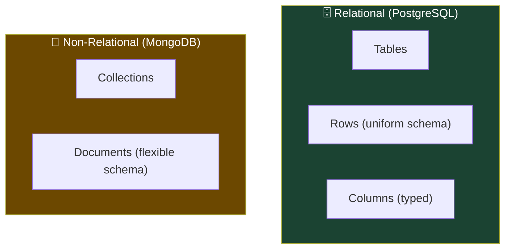
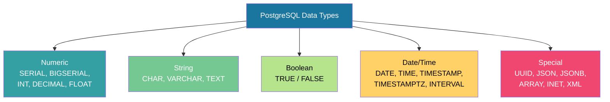
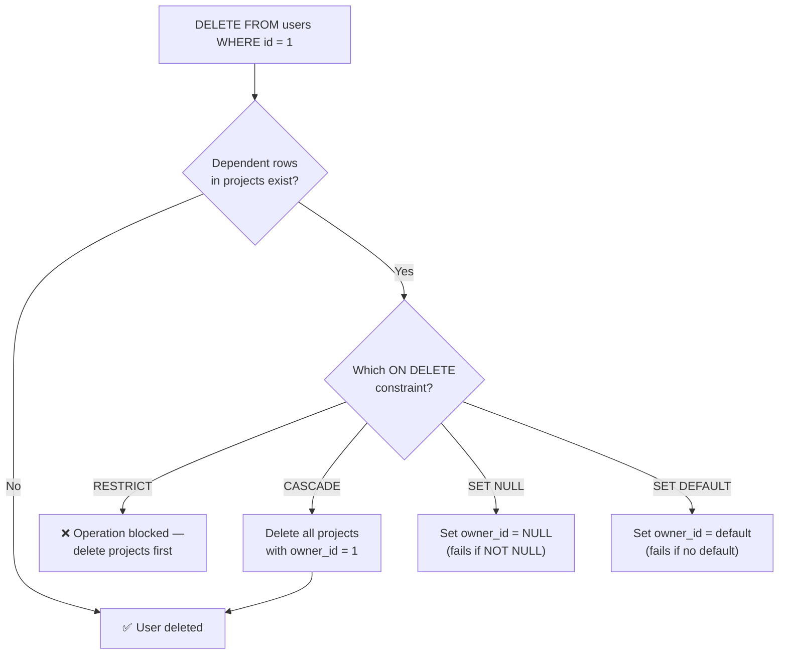
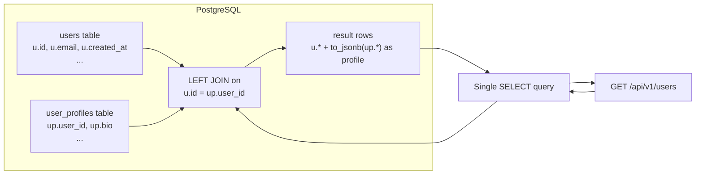
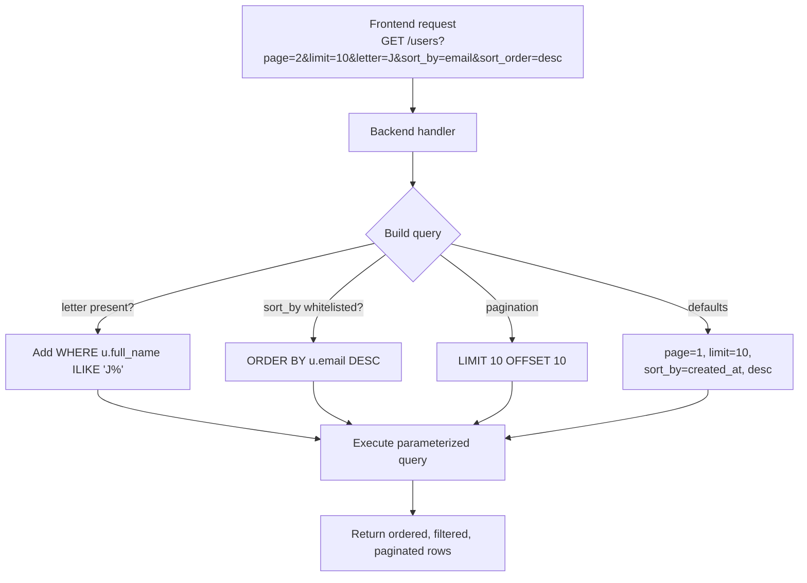
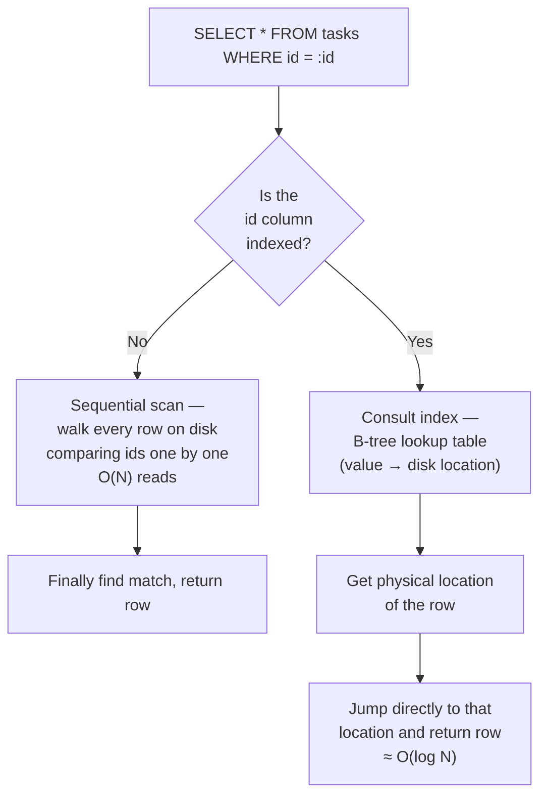

# Part 12 — Mastering Databases with Postgres

> [!info] Video reference
> **12. Mastering Databases with Postgres** by *Sriniously* — playlist position 12 of 29 in *Backend from First Principles*.
> [Watch on YouTube](https://www.youtube.com/watch?v=F7Vwp2Xo5Do) · Duration: ~2 h 45 min · Published 2025-03-03

> [!abstract] In this chapter
> This chapter is a foundational deep-dive into databases from a backend engineer's perspective. We cover *why* databases exist (data persistence), the difference between RAM-based and disk-based storage, what a DBMS is and why we need one, the trade-offs between relational and non-relational (NoSQL) databases, and why **PostgreSQL** is the recommended default. We walk through every major PostgreSQL data type (integers, decimals vs. floats, strings, booleans, dates/timestamps, UUIDs, JSON/JSONB, arrays, and more), discuss naming conventions and primary keys, then model a real-world **project-management platform** database — covering enums, one-to-one relationships, foreign keys, referential integrity, and database migrations using `dbmate`.

---

### [00:00] Why Do We Need Databases?

When building backend systems, interacting with databases is one of the most frequent and important operations you will perform. Understanding the concepts surrounding databases is crucial to being efficient in your job.

#### [00:24] Persistence — The Core Motivation

At its core, a **database** is simply a way to **persist information** across different sessions. Persistence means storing data so that it survives even after the program that created it has been stopped.

A concrete example: think of a to-do list app. You add entries, check off tasks, close the app, and reopen it later — the data is still there in the same state you left it. That is persistence. The information must remain in the expected state even after a considerable amount of time, or across different physical locations.

Without persistence, every time you opened an app you would have to recreate all your data from scratch. You would lose all your progress. Persistence is a fundamental requirement we use in our day-to-day lives.

#### [01:59] What Is a Database?

The term "database" is surprisingly broad. In the simplest sense, **any structured storage** can be considered a database:

| Example | Type |
|---|---|
| Smartphone contact list | Simple structured list |
| Browser `localStorage` | Key-value store |
| Session storage / cookies | Browser-managed persistence |
| A plain text file of notes | The most basic database |

All of these follow the same pattern: a system that offers ways to **Create, Read, Update, and Delete** data — known collectively as **CRUD** operations.

> **Key distinction:** When we say "database" in the context of backend systems, we specifically mean **disk-based databases** — systems that store data on persistent storage (HDD or SSD).



**What this diagram shows:** A user interacts with a backend application, which in turn communicates with a database. The database persists its data on physical disk storage (HDD or SSD), ensuring data survives process restarts.

---

### [04:26] Disk-Based Storage — Why Not RAM?

Disk storage (traditional hard drives or SSDs) is **relatively cheap** compared to RAM. A typical system might have:

- **RAM (primary memory):** 8 GB – 128 GB
- **Disk (secondary storage):** 512 GB – 2 TB+

The trade-off is clear:

| Property | RAM (Primary Memory) | Disk (Secondary Storage) |
|---|---|---|
| Speed | Very fast | Relatively slow |
| Capacity | Limited | Large |
| Cost per GB | Expensive | Cheap |
| Volatility | Volatile (lost on power-off) | Persistent |

RAM is used for **caching** (e.g., Redis, in-memory caches) because fetching and saving data from primary memory is extremely fast. But databases need **space** first and foremost, and can tolerate some speed trade-off. That is why traditional databases — both relational (PostgreSQL, MySQL) and non-relational (MongoDB) — store data on disk.

---

### [08:44] DBMS — Database Management System

Just storing data in some disk-based storage is not enough. We also need efficient ways to **retrieve, modify, and delete** that data, especially when dealing with hundreds or thousands of gigabytes.

A **DBMS** (Database Management System) is software whose sole responsibility is to efficiently provide CRUD operations to clients or users. Beyond basic operations, a DBMS also handles security, scaling, and load balancing.

#### Responsibilities of a DBMS

1. **Data Organization** — Efficiently organize data so that fetching, updating, and creating data are all efficient operations.
2. **Access** — Provide methods for CRUD (Create, Read, Update, Delete) operations.
3. **Integrity** — Maintain the accuracy and validity of data. For example, if a payment amount field should only contain numbers, the DBMS must reject any attempt to insert a string like `"something"` into that field.
4. **Security** — Protect data from unauthorized access. DBMS software supports different users, roles, and access levels.

---

### [12:37] Why Not Just Use Text Files?

Before DBMS software existed, people did try storing data in text files. This approach has several critical limitations:

#### 1. Parsing is Slow and Error-Prone

Every time you want to find a specific data point (e.g., a customer record), you must write application code to:
- Open and read the text file
- Parse every line
- Split and compare each field

This process is extremely slow, and it is also very error-prone — if something goes wrong, you can corrupt your data or return wrong information to users. Languages like JavaScript or Python are relatively slow at file parsing compared to Rust, and even Rust is slower than a purpose-built DBMS.

#### 2. No Structure

Text files have no formal structure. You cannot enforce rules like "this field must be a number." A text file is fluid — it will accept any kind of data in any format. This makes it impossible to enforce data consistency at the storage level.

#### 3. Concurrency Issues

What happens when two people try to update the same value at the same time? Consider an `amount` field with a value of `40`:

- **Person A** reads `40`, wants to *increase* by 20 → expects `60`
- **Person B** reads `40`, wants to *decrease* by 20 → expects `20`

Both read the same value, both start their operation at the same time. When they save, one update will overwrite the other — the final value might be `60` or `20`, depending entirely on CPU scheduling. There is **no consistency guarantee**. A text file simply cannot handle concurrent access.

These challenges motivated the development of DBMS software.

---

### [18:23] Types of DBMS — Relational vs. Non-Relational

On a high level, there are two major types of DBMS:

#### Relational Databases

A relational database organizes data in **tables** composed of **rows** and **columns**. Relationships between different tables are defined using concepts like **foreign keys**.

**Key characteristics:**
- Data is **structured** and inserted into a database with a **predefined schema**
- You cannot arbitrarily insert any kind of data — each piece of data must conform to a specific table's strict schema
- All columns and their data types must be defined beforehand
- This strict schema enforcement gives you **data integrity** — at any point in time, you know the state, types, and relationships of your data
- Interacted with using **SQL** (Structured Query Language)

**Examples:** MySQL, PostgreSQL, SQL Server, SQLite

#### Non-Relational Databases (NoSQL)

Non-relational databases (like MongoDB) do **not** enforce a predefined schema. Two entries in the same collection can follow completely different data structures.

**Terminology comparison:**

| Relational | Non-Relational (MongoDB) |
|---|---|
| Table | Collection |
| Row | Document |
| Column | Field |

**Advantages:**
- Very **flexible schema** — ideal for prototyping and rapid iteration
- You can push any kind of data without worrying about schema upfront
- No need to maintain migrations for schema changes

**Disadvantages:**
- Data integrity challenges — since the schema is not enforced at the database level, you must validate data in your **application code**, which adds complexity and is more error-prone



**What this diagram shows:** Relational databases enforce a rigid table → row → column structure where every row has the same columns and data types. Non-relational databases use collections of documents where each document can have a completely different structure.

#### When to Use Which?

- **Relational (PostgreSQL):** CRM systems, e-commerce platforms, financial data — anywhere you need accurate, consistent data about customers, sales, and relationships between entities.
- **Non-Relational (MongoDB):** Content Management Systems (CMS), blogging platforms, prototyping — anywhere the content structure is dynamic and unpredictable (images, code blocks, YouTube embeds, etc.).

---

### [30:55] Why PostgreSQL?

When you have to choose a database for a backend project, PostgreSQL makes a lot of sense for these reasons:

1. **Open source and free** — Not proprietary software. Companies can host and deploy it on their own servers.
2. **SQL standard compliant** — Queries written in standard SQL will work across Postgres, MySQL, SQL Server, etc. Migration between systems is relatively easy.
3. **Extensible** — The documentation is ~1,400 pages long with extensive feature coverage. It also has a robust extension system.
4. **Reliability and scalability** — Proven at scale by both startups and large companies.
5. **Excellent JSON support** — Postgres offers native `json` and `jsonb` data types with good indexing and query capabilities. This eliminates the primary reason to choose a non-relational database for dynamic data.

> **Note:** While MySQL may have performance advantages in some benchmarks, until you are serving millions of users with a specific bottleneck, PostgreSQL should be your first choice. Its rich feature set and JSON support make it the default for nearly all projects.

---

### [31:55] Prerequisites & Tooling

Before proceeding, it is recommended to learn the basics of SQL and PostgreSQL from dedicated resources. This video focuses on concepts relevant to backend systems rather than repeating beginner SQL tutorials.

**Tool used in this course:** **TablePlus** — a graphical database client with a modern UI, used for interacting with databases, running queries, and exploring data. It is the presenter's daily-driver tool.

**Other common tools:**
- `psql` — PostgreSQL's command-line interface
- pgAdmin — web-based administration tool
- DBeaver, DataGrip, etc.

---

### [33:15] PostgreSQL Data Types

Understanding data types is essential before designing tables. Here is a comprehensive overview:

#### Numeric Types

| Type | Description |
|---|---|
| `SERIAL` | Auto-incrementing integer; commonly used for primary keys. Increments by 1 for each new row. |
| `BIGSERIAL` | Like `SERIAL` but with much higher capacity. Preferred for production primary keys. |
| `SMALLINT` | Small-range integer |
| `INTEGER` | Standard integer |
| `BIGINT` | Large-range integer |
| `DECIMAL(p, s)` / `NUMERIC(p, s)` | Exact-precision decimal numbers. `p` = total digits, `s` = digits after decimal point. |
| `REAL` / `DOUBLE PRECISION` / `FLOAT` | Floating-point (approximate) numbers. Faster but less accurate than decimal. |

**`DECIMAL(10, 2)` explained:**
- `2` means there will always be exactly **2 digits** to the right of the decimal point
- `10` means the **total number of digits** across the entire number cannot exceed 10
- Example: `12345678.90` is valid (10 digits total, 2 after decimal); `123456789.0` is invalid (11 digits)

> [!tip] Decimal vs. Float — When to Use Which?
> - **Use `DECIMAL`** when accuracy matters — e.g., **prices**, financial data. Floating-point numbers can have different representations across systems due to how they are stored and processed.
> - **Use `FLOAT`** (real/double precision) when minor discrepancies don't matter — e.g., area measurements, scientific computations. Floats are significantly faster for storage and computation.

#### String Types

| Type | Description |
|---|---|
| `CHAR(n)` | Fixed-length character. Pads shorter values with spaces to reach length `n`. **Avoid** in most cases — it is an old standard. |
| `VARCHAR(n)` | Variable-length character. `n` is the **maximum** length. Stores only the actual content length. |
| `TEXT` | Variable-length with **no enforced length limit** (theoretical max ~250 MB). Recommended by Postgres docs. |

**`CHAR(10)` example:** Storing `"AB"` pads it to `"AB        "` (8 extra spaces) — wasteful and confusing.

**`VARCHAR(255)` example:** Storing `"AB"` stores exactly `"AB"` — only 2 characters. But if you later need more than 255 characters, you must run a **database migration** to change the column type.

**`TEXT` example:** Storing `"AB"` stores `"AB"`. No arbitrary length limit. Length constraints can be enforced at the **application level** instead.

> [!tip] Recommendation: Use `TEXT`
> PostgreSQL's official documentation recommends `text` over `varchar(n)`. There is **no performance difference** between `varchar` and `text` in Postgres. Using `text` avoids arbitrary magic numbers (like the MySQL convention of `varchar(255)`), makes migrations simpler, and is easier for new team members to understand.

#### Boolean

```sql
boolean  -- stores TRUE or FALSE
```

#### Date & Time Types

| Type | Description |
|---|---|
| `DATE` | Date only (no time) |
| `TIME` | Time only (hour:minute:second) |
| `TIMESTAMP` | Date and time together |
| `TIMESTAMPTZ` | Date, time, **and time zone** information |
| `INTERVAL` | Duration (e.g., `10 days`, `1 week`) |

#### UUID

PostgreSQL offers a native `UUID` type. UUIDs are a popular choice for **primary keys** because they are universally unique, avoiding collisions without coordination.

#### JSON & JSONB

| Type | Description |
|---|---|
| `JSON` | Stored as plain text (key-value format as-is) |
| `JSONB` | Stored in Postgres's **optimized binary format** — faster queries and indexing. Recommended. |

> `JSONB` is a PostgreSQL extension (not SQL standard). In most cases, **use `JSONB`** for the performance advantage.

#### Array Types

PostgreSQL supports storing arrays of any data type:

```sql
INTEGER[]       -- array of integers
TEXT[]          -- array of texts
```

#### Other Types

PostgreSQL also supports network addresses (`INET`, `MACADDR`), geometrical points, XML, and more — though these are less commonly used in typical backend work.



**What this diagram shows:** The main categories of PostgreSQL data types available to backend engineers — numeric types for IDs and measurements, strings for text, booleans for flags, date/time types for temporal data, and special types like UUID, JSON, and arrays.

---

### [53:33] Designing a Database — Project Management Platform

The rest of this chapter models the database for a project-management platform (continuing from the API design in the previous video). The goal is to demonstrate real-world database concepts in PostgreSQL through practical migration files.

---

### [54:19] Database Migrations

In production systems, you cannot simply open a graphical tool and start writing SQL queries. There is no way to track:
- What changes were applied to the database over time
- Who applied them
- How to roll back if something breaks

This is why most database systems follow a **migration** workflow.

#### What Are Migrations?

Migrations are versioned SQL files, typically stored in a folder structure:

```
db/
  migrations/
    001_create_users.sql
    002_create_projects.sql
    003_add_tasks.sql
```

A **migration tool** (e.g., `dbmate`, `golang-migrate`) reads these files in sequential order and executes the SQL statements against your database.

#### Up and Down Migrations

Each migration file has two sections:
- **Up migration** — The forward change (e.g., `CREATE TABLE`, `ALTER TABLE`, `CREATE INDEX`)
- **Down migration** — The **reverse** of that change (e.g., `DROP TABLE`, `DROP INDEX`)

Down migrations allow you to **roll back** to a previous database state if something goes wrong in production.

#### How Migration Tools Track State

The tool creates a special table (e.g., `schema_migrations`) that records which migration number has been applied. When you add a new file `005.sql`, the tool knows to apply only the migrations after the current version (4) and update the tracked version.

#### Why Migrations?

1. **Version control** — Migration files live alongside your code in Git, providing a complete history of database changes.
2. **Rollback** — Down migrations let you revert changes if something breaks.
3. **Consistency** — Everyone on the team applies the same changes in the same order.

---

### [01:01:41] Creating the First Migration with `dbmate`

The migration tool used in this course is **`dbmate`** — a command-line tool that applies database migrations.

#### Setup

1. Create a `.env` file with a `DATABASE_URL` variable pointing to your PostgreSQL instance.
2. Run:
   ```bash
   dbmate new create_users_table
   ```
   This creates a timestamped migration file under `db/migrations/` with `-- +goose Up` and `-- +goose Down` markers.

---

### [01:03:28] Creating Enum Types

The first migration creates **enum** types. Enums restrict a field to a predefined set of allowed values.

```sql
-- +goose Up
CREATE TYPE project_status AS ENUM ('active', 'completed', 'archived');
CREATE TYPE task_status AS ENUM ('pending', 'in_progress', 'completed', 'cancelled');
CREATE TYPE member_role AS ENUM ('owner', 'admin', 'member');

-- +goose Down
DROP TYPE member_role;
DROP TYPE task_status;
DROP TYPE project_status;
```

#### Why Use Enums Instead of `TEXT`?

1. **Data Integrity at the Database Level** — If you try to insert a value that is not in the allowed list, PostgreSQL raises a database-level error. You do not need to validate this in your application code (though you can do both for defense-in-depth).

2. **Documentation** — When a new team member reads the migration files, they can immediately see what values are allowed for each field. If the field were just `TEXT`, they would have to trace through all application code to discover the allowed values.

**Syntax:** `CREATE TYPE <name> AS ENUM (<list of values>);`

---

### [01:08:59] The `users` Table

```sql
CREATE TABLE users (
    id UUID PRIMARY KEY DEFAULT gen_random_uuid(),
    email TEXT NOT NULL UNIQUE,
    full_name TEXT NOT NULL,
    password_hash TEXT NOT NULL,
    created_at TIMESTAMPTZ DEFAULT NOW() NOT NULL,
    updated_at TIMESTAMPTZ DEFAULT NOW() NOT NULL
);
```

#### Key Concepts Demonstrated

**Primary Key (`PRIMARY KEY`):**
A field that uniquely identifies each row in a table. It implicitly enforces two constraints:
- `NOT NULL` — The field cannot be empty
- `UNIQUE` — No two rows can have the same value

We use `UUID` with `DEFAULT gen_random_uuid()` so PostgreSQL automatically generates a unique identifier for each new row. In production systems, `BIGSERIAL` is also common.

**`NOT NULL` Constraint:**
By default, all fields in a PostgreSQL table can hold `NULL` values unless you explicitly say otherwise. More than 70% of your table's fields should have `NOT NULL` — it ensures consistent data state and prevents bugs from automated scripts accidentally inserting nulls.

**`UNIQUE` Constraint:**
Applied to `email` to prevent two users from having the same email address. Attempting to insert a duplicate will raise a database error.

**Default Values (`DEFAULT`):**
- `created_at` defaults to `NOW()` (current timestamp with time zone) — you do not need to manually provide it.
- `updated_at` also defaults to `NOW()` — useful for sorting or showing "last modified" in the UI.

#### Naming Conventions

- **Plural table names** by convention: `users`, `projects`, `tasks` (not `user`, `project`). This is the industry standard, though some teams prefer singular.
- **lowercase and snake_case** for all table and field names: `full_name`, `password_hash`, `created_at`.
- **Avoid camelCase** — PostgreSQL is case-insensitive by nature. If you write `fullName`, Postgres treats it the same as `fullname` unless you use double quotes `"fullName"` everywhere — which makes application code ugly and error-prone.

---

### [01:17:28] One-to-One Relationship — `user_profiles` Table

```sql
CREATE TABLE user_profiles (
    user_id UUID PRIMARY KEY REFERENCES users ON DELETE RESTRICT,
    image_url TEXT,
    bio TEXT,
    phone TEXT,
    created_at TIMESTAMPTZ DEFAULT NOW() NOT NULL,
    updated_at TIMESTAMPTZ DEFAULT NOW() NOT NULL
);
```

#### Why a Separate Table?

The `user_profiles` table stores profile information (image URL, bio, phone number) that is **less frequently accessed and more likely to grow** over time (social media links, websites, projects, etc.). Separating it from the `users` table:

- Keeps the core `users` table lean and stable
- Allows the profile table to grow and evolve without affecting the primary table
- Means profile-related migrations do not touch the critical `users` table

#### One-to-One Relationship

Each row in `users` has **at most one** row in `user_profiles`. This is enforced by making `user_id` both the **primary key** and the **foreign key** — no separate `id` column is needed.

**Foreign key syntax:** `REFERENCES users` — since `id` is the primary key of `users`, Postgres infers the reference automatically (equivalent to `REFERENCES users(id)`).

**Optional fields:** Note that `image_url`, `bio`, and `phone` do **not** have `NOT NULL` — these are optional fields a user may or may not fill in.

---

### [01:20:37] The `projects` Table

```sql
CREATE TABLE projects (
    id UUID PRIMARY KEY DEFAULT gen_random_uuid(),
    name TEXT NOT NULL,
    description TEXT,
    status project_status DEFAULT 'active' NOT NULL,
    owner_id UUID NOT NULL REFERENCES users ON DELETE RESTRICT,
    created_at TIMESTAMPTZ DEFAULT NOW() NOT NULL,
    updated_at TIMESTAMPTZ DEFAULT NOW() NOT NULL
);
```

#### Key Concepts

**Enum in use:** The `status` field uses the custom `project_status` enum type. If you do not provide a value, it defaults to `'active'`.

**Foreign Key with Referential Integrity:**

```sql
owner_id UUID NOT NULL REFERENCES users ON DELETE RESTRICT
```

This defines:
- `owner_id` is a **foreign key** pointing to the `users` table
- `ON DELETE RESTRICT` — **Referential Integrity**: You **cannot** delete a user from the `users` table if they own any projects. PostgreSQL will raise an error, protecting you from orphaned records.

> **Referential Integrity** means protecting data consistency across related tables using the relationships between them. The database itself enforces the rule rather than relying on application logic.

---

### [01:22:34] Referential Integrity — `ON DELETE RESTRICT`

Referential integrity is one of the most important concepts in relational databases. It ensures that relationships between tables remain consistent.

**`ON DELETE RESTRICT`** means: if you try to delete a row from the referenced table (`users`) while other rows in the current table (`projects`) reference it, the delete operation will be **rejected** with an error.

Other common referential integrity options include:
- `ON DELETE CASCADE` — Deleting the referenced row also deletes all referencing rows
- `ON DELETE SET NULL` — Sets the foreign key to `NULL` when the referenced row is deleted
- `ON DELETE SET DEFAULT` — Sets the foreign key to its default value

The choice depends on your business logic — `RESTRICT` is the safest default.

---

### [01:22:34] Relationships Between Tables

Relational databases allow you to define how tables relate to each other. The three fundamental relationship types are:

#### One-to-One
One row in Table A corresponds to exactly one row in Table B (and vice versa).
- Example: `users` ↔ `user_profiles`

#### One-to-Many
One row in Table A corresponds to many rows in Table B, but each row in Table B references only one row in Table A.
- Example: One `user` owns many `projects`; each `project` has one `owner`

#### Many-to-Many
Many rows in Table A correspond to many rows in Table B. This requires a **join table** (also called a junction/pivot table).
- Example: Many `users` can be members of many `projects`

A join table typically contains two foreign keys — one pointing to each table — and together they form a composite primary key:

```sql
CREATE TABLE project_members (
    project_id UUID NOT NULL REFERENCES projects ON DELETE CASCADE,
    user_id UUID NOT NULL REFERENCES users ON DELETE CASCADE,
    role member_role DEFAULT 'member' NOT NULL,
    created_at TIMESTAMPTZ DEFAULT NOW() NOT NULL,
    updated_at TIMESTAMPTZ DEFAULT NOW() NOT NULL,
    PRIMARY KEY (project_id, user_id)
);
```

```mermaid
erDiagram
    USERS ||--o| USER_PROFILES : has
    USERS ||--o{ PROJECTS : owns
    USERS ||--o{ PROJECT_MEMBERS : participates
    PROJECTS ||--o{ PROJECT_MEMBERS : includes
    PROJECTS ||--o{ TASKS : contains

    USERS {
        uuid id PK
        text email
        text full_name
        text password_hash
        timestamptz created_at
        timestamptz updated_at
    }

    USER_PROFILES {
        uuid user_id PK FK
        text image_url
        text bio
        text phone
    }

    PROJECTS {
        uuid id PK
        text name
        text description
        project_status status
        uuid owner_id FK
    }

    PROJECT_MEMBERS {
        uuid project_id PK FK
        uuid user_id PK FK
        member_role role
    }

    TASKS {
        uuid id PK
        text title
        task_status status
        uuid project_id FK
        uuid assignee_id FK
    }
```

**What this diagram shows:** An entity-relationship diagram for the project management platform. Users have optional one-to-one profiles, own multiple projects, and participate in projects through a many-to-many join table (`project_members`). Projects contain multiple tasks, each assigned to a user.

---

## Part 2 — Joins, Indexes, Triggers & Advanced SQL

### [1:22:37] Referential Integrity — ON DELETE Behavior Deep Dive

Picking up where the schema design left off, the instructor returns to the `projects` table and its `owner_id` foreign key to explain **referential integrity constraints** thoroughly. Referential integrity is the mechanism by which the database enforces consistency between related tables using the relationships defined between them.

The concrete scenario: a `users` table with a user whose ID is `1`, and a `projects` table with a row whose `owner_id` is `1` (this user created a project). The question is: what happens when someone tries to `DELETE FROM users WHERE id = 1`?

#### ON DELETE RESTRICT

When the foreign key is declared `ON DELETE RESTRICT`:

```
user (id = 1)          project (owner_id = 1)
[users]                [projects]
```

The database sees a dependent row in `projects` referencing user 1. It checks the referential integrity constraint, finds `RESTRICT`, and **fails the operation**. The delete is rejected with a database-level error. You cannot delete a user who owns projects until those projects are deleted (or reassigned) first.

> Referential integrity lets us put restrictions on operations on some tables using the relationship between those tables — protecting our data from going corrupt or inaccurate.

#### ON DELETE CASCADE

If the foreign key were declared `ON DELETE CASCADE` instead, deleting user 1 would **also delete all projects with `owner_id = 1`**. The database cascades the deletion: user gone, and every associated project gone with them.

#### ON DELETE SET NULL

With `ON DELETE SET NULL`, deleting the user would **set `owner_id` to `NULL`** on all dependent project rows. This fails if the column is declared `NOT NULL` (as `owner_id` is in this schema) — PostgreSQL raises a database-level error rather than violating the constraint.

#### ON DELETE SET DEFAULT

`ON DELETE SET DEFAULT` sets the foreign key column to its **declared default value** when the referenced row is deleted. If no default exists on the column, PostgreSQL raises an error.



**What this diagram shows:** When you delete a referenced user, the DBMS first checks for dependent rows. If none exist the delete succeeds. If they do exist, the declared `ON DELETE` action decides the outcome: RESTRICT blocks it, CASCADE deletes the children, SET NULL/SET DEFAULT adjust the child rows (and error out when the column forbids it).

**Takeaway:** `ON DELETE` is the machinery of referential integrity — these are the day-to-day constraints that protect your data from going corrupt.

### [1:25:30] Tasks Table — Project Cascade, Priority CHECK & Status Enum

The `tasks` table follows the same patterns:

```sql
-- Key excerpts from the tasks table
project_id UUID NOT NULL REFERENCES projects(id) ON DELETE CASCADE,
title TEXT NOT NULL,
description TEXT,
priority INTEGER NOT NULL DEFAULT 1
  CHECK (priority >= 1 AND priority <= 5),
status task_status NOT NULL DEFAULT 'pending',
due_date DATE,
assigned_to UUID REFERENCES users(id) ON DELETE SET NULL
```

- **`project_id`** is a `UUID` (because it stores the `projects.id` values, which are UUIDs) with `NOT NULL` and `ON DELETE CASCADE` — a **task cannot exist without a project** ("no orphan tasks"), and deleting a project deletes its tasks. Demonstrated: project 1 + task 2 (project_id 1); deleting project 1 cascades to task 2.
- **`title`** is `text NOT NULL`; **`description`** is `text` and nullable.
- **`priority`** is an integer enumerating 1, 2, 3, … and cannot be null; it defaults to `1`.

### [1:27:07] The CHECK Constraint — Custom Column Conditions

Beyond the `UNIQUE` (one value per field across the whole table) and `NOT NULL` constraints already covered, PostgreSQL offers the **CHECK** constraint — a *custom condition* on a field:

```sql
priority INTEGER NOT NULL DEFAULT 1
  CHECK (priority >= 1 AND priority <= 5)
```

- If the application passes nothing, the default (`1`) applies.
- If the application passes a value, the transaction only goes through **as long as the CHECK condition is true**.
- A value like `55` is rejected at the database level — nobody can insert a random priority.

This is exactly how the video's schema prevents invalid priorities.

### [1:28:52] The Status Enum

The `status` column uses the custom `task_status` enum type (`pending`, `in_progress`, `completed`, `cancelled`). It is `NOT NULL` and defaults to `'pending'` when not provided.

### [1:29:20] Assigned To — Nullable External Reference

`assigned_to` is a foreign key referencing `users(id)`. Its referential integrity rule: if a user is deleted and their ID appears in `tasks.assigned_to`, PostgreSQL sets `assigned_to` to `NULL` for those rows (ON DELETE SET NULL). Unlike `project_id` (which cannot be null — a task belongs to a project), an assignee is optional.

### [1:29:33] The Foreign Key Constraint as Validation

A nice property of foreign keys: because `assigned_to` (and `owner_id`) are foreign keys, the database enforces that **any value you insert must actually exist** as an `id` in the `users` table. You can pass a well-formed random UUID — but if there's no matching user row, the insertion fails. You cannot smuggle orphan references into the database through application bugs.

### [1:30:42] Relationship Patterns Recap — Implementing Each Type

The second half revisits how each relationship type is physically implemented:

#### One-to-One Relationship

> Take the primary key of the main table and make it the primary key of the second table too — but instead of writing `id`, write `<table>_id`.

In `user_profiles`, the column is `user_id`, which is BOTH the primary key of this table AND a foreign key referencing `users`. Since a primary key is unique, at most one profile can exist per user.

#### One-to-Many Relationship

> Take the `id` field and create another table, but DON'T make that a primary key — keep it as a **foreign key** only, referring to the main table's primary key.

In `tasks`, the column `project_id` is a plain foreign key (not the PK). One project (ID 1) can be referenced by many task rows, each pointing back at it — one-to-many.

#### Many-to-Many Relationship

> Create a linking table holding foreign keys from both tables.

Since neither `projects` nor `users` can hold the other's ID as a single column (many users in many projects), a dedicated `project_members` table is needed — covered in detail next.

### [1:32:55] Project Members — Linking Table with Composite Primary Key

The `project_members` table implements the many-to-many relationship between users and projects. Instead of a single `id` column, it uses a **composite primary key**:

```sql
CREATE TABLE project_members (
  project_id UUID NOT NULL REFERENCES projects(id) ON DELETE CASCADE,
  user_id UUID NOT NULL REFERENCES users(id) ON DELETE CASCADE,
  role member_role NOT NULL DEFAULT 'member',
  created_at TIMESTAMP NOT NULL DEFAULT NOW(),
  updated_at TIMESTAMP NOT NULL DEFAULT NOW(),
  PRIMARY KEY (project_id, user_id)
);
```

Key design decisions:

1. **No standalone `id` column** — removed in favor of the composite key
2. **Both foreign keys use `ON DELETE CASCADE`** — deleting a project or user removes their memberships automatically
3. **Composite primary key `(project_id, user_id)`** implicitly enforces `UNIQUE` + `NOT NULL`, meaning a user cannot be a member of the same project twice

The instructor walks through an example: users 1, 2, 3 and projects 1, 2, 3. Adding user 1 to project 2 creates a single row `(project_id=2, user_id=1)`. This combination is unique — it cannot be duplicated because the composite primary key prevents it.

The `role` column uses the `member_role` enum (`owner`, `admin`, `member`) and is specific to the context of a user being part of a project — not a property of the user or the project alone, but of their *relationship*.

### [1:37:57] Down Migrations — Reverting Changes

Every migration has both `up` and `down` sections. The `down` migration reverses all changes:

```sql
-- Down migration
DROP TABLE IF EXISTS project_members;
DROP TABLE IF EXISTS tasks;
DROP TABLE IF EXISTS projects;
DROP TABLE IF EXISTS user_profiles;
DROP TABLE IF EXISTS users;
DROP TYPE IF EXISTS member_role;
DROP TYPE IF EXISTS task_status;
```

Tables must be dropped in **reverse order** of creation (because of foreign key dependencies), and custom types are dropped after the tables that use them.

### [1:38:41] Applying Migrations

```bash
dbmate up
```

This applies all pending migrations. The tool creates a `schema_migrations` table with a `version` field tracking the current state. When a new migration file is created, dbmate checks the current version and applies only new ones — preventing duplicate execution (which would fail because the tables already exist).

### [1:40:22] Seeding — Populating Test Data

In production, data flows in through user-facing forms and API calls. During development, you need **seed data** to test with. Seeding means writing SQL to populate tables with realistic test records.

Best practice: keep seeding in a **separate migration file**:

```bash
dbmate new seed_data
```

The seed migration uses **CTEs** (Common Table Expressions) for readable, chained inserts:

```sql
WITH inserted_users AS (
  INSERT INTO users (email, full_name, password_hash)
  VALUES
    ('alice@example.com', 'Alice Brown', 'hash1'),
    ('bob@example.com', 'Bob Johnson', 'hash2'),
    ('jane@example.com', 'Jane Smith', 'hash3')
  RETURNING id, email
),
inserted_profiles AS (
  SELECT
    iu.id AS user_id,
    CASE
      WHEN iu.email = 'alice@example.com' THEN 'Full-stack developer'
      WHEN iu.email = 'bob@example.com' THEN 'DevOps engineer'
      ELSE 'Project manager'
    END AS bio
  FROM inserted_users iu
)
INSERT INTO user_profiles (user_id, avatar_url, bio, phone)
SELECT user_id, 'https://example.com/avatar.png', bio, '+1-555-0100'
FROM inserted_profiles;
```

The CTE pattern allows inserting into the `users` table first, capturing the generated IDs, and using those IDs in subsequent inserts for `user_profiles`, `projects`, `tasks`, and `project_members`.

### [1:44:01] Verifying Seed Data

After running `dbmate up`, the instructor opens TablePlus and inspects each table. All tables have rows: users with emails and password hashes, user_profiles with bios, projects, tasks, and project_members — confirming the seeding was successful.

### [1:45:01] Building APIs — GET All Users with JOIN

The instructor shifts to building the database queries behind the application's APIs. The first endpoint is `GET /api/v1/users` — return all users with their profiles embedded.

#### The Query Plan: FROM First

A good habit when writing SQL: **start with the `FROM` clause**, not the `SELECT`. This forces you to clarify where your data is coming from before deciding what you want.

```sql
SELECT
  u.*,
  to_jsonb(up.*) AS profile
FROM users u
LEFT JOIN user_profiles up ON u.id = up.user_id
ORDER BY u.created_at DESC;
```

Breaking it down:

- **`users u`** — assign the alias `u` (one/two-letter aliases make referencing tables repeatedly more convenient)
- **`LEFT JOIN user_profiles up`** on `u.id = up.user_id` — join every user with their profile row
- **`to_jsonb(up.*)`** — convert the entire profile row into a JSON object embedded as a `profile` field
- **`ORDER BY u.created_at DESC`** — return the newest users first

#### Why LEFT JOIN and Not INNER JOIN?

The reason is practical: **a user may never have edited their profile**, so no row exists in `user_profiles`. With an `INNER JOIN`, the user would disappear from the result entirely (both sides must match). With a `LEFT JOIN`, the user appears regardless, with profile fields as `NULL`.

> Most of the joins you'll write in practice are `INNER JOIN` and `LEFT JOIN`.

#### Result Set Shape

The result contains all `users` columns plus a single extra `profile` column holding a JSON object of the profile row. With one database call, the API can return both user and profile data embedded together — no second round-trip needed.



**What this diagram shows:** One API call produces one SQL query. The LEFT JOIN combines rows from `users` (left) and `user_profiles` (right) whenever the IDs match — keeping every user even without a profile. The joined row is serialized to JSON with the profile nested inside.

### [1:51:03] Row Ordering Is Not Guaranteed

The instructor makes an important point: **relational databases do not guarantee row order** in `SELECT` results. Data is stored physically wherever the database decides. Therefore, whenever an API returns a list, you must explicitly `ORDER BY` a column. The convention used here: `ORDER BY u.created_at DESC` so the newest users appear first.

### [1:53:41] Parameterized Queries — The SQL Injection Defense

Before building the "get single user" endpoint, the instructor introduces **parameterized queries**, a crucial security mechanism:

> A parameterized query is a safety mechanism provided by databases. Before running a query, you provide a **slot** and tell the database: "this is my query, and at this position there is an empty slot; before executing, I will fill in the value."

The critical property: whatever value you pass into the slot is **treated strictly as a string/value** — it is **escaped**, never interpreted as SQL. If someone passes `DELETE FROM users` as the value, it remains a literal string, not a database command.

This prevents **SQL injection**, where an attacker concatenates malicious SQL into a query built by string concatenation:

```sql
-- ❌ DANGEROUS: string concatenation of user input
SELECT * FROM users WHERE email = 'user@example.com' OR 1=1;

-- ✅ SAFE: parameterized query
SELECT * FROM users WHERE email = $1;
```

Real-world drivers (Node.js, Go, Rust, Python) and ORMs provide this capability out of the box. In the SQL editor GUI, you define parameters and the tool prompts for values.

### [1:57:13] GET Single User API

For the endpoint `GET /api/v1/users/:user_id`, the query adds a `WHERE` clause with a parameterized slot:

```sql
SELECT
  u.*,
  to_jsonb(up.*) AS profile
FROM users u
LEFT JOIN user_profiles up ON u.id = up.user_id
WHERE u.id = :user_id;
```

The dynamic `user_id` from the URL route flows through the backend layers (handler → service → repository) and into the parameter slot. Strings in SQL must be wrapped in single quotes. Running it returns exactly one user (with their embedded profile).

### [2:00:01] Dynamic Filtering, Sorting & Pagination — List API Capabilities

List endpoints (`GET /api/v1/users`) frequently need to support **dynamic filters**, **dynamic sort**, and **pagination**. The instructor walks through the backend logic:

#### Query Parameter Design

| Parameter | Default | Purpose |
|-----------|---------|---------|
| `page` | 1 (backend) / 0 (offset) | Which page of results |
| `limit` | 10 or 20 | How many rows per page |
| `letter` | null (omit from query) | Filter: first letter of name |
| `sort_by` | `created_at` | Field to sort by |
| `sort_order` | `descending` | Sort direction |

Key insight: in real backend code, you **dynamically construct** the SQL query based on which parameters are present. If `letter` is missing, don't include the `WHERE` clause at all — not include it with `NULL`.

#### Filtering with ILIKE

```sql
WHERE u.full_name ILIKE :letter || '%'
```

`ILIKE` is the case-insensitive version of `LIKE`. With `letter = 'J'`, it matches "Jane Smith" and "John Doe" (names starting with J, ignoring case). The `%` wildcard means "anything after." Testing with `x` returned no results (no names start with X); `a` returned "Alice Brown."

#### Dynamic Sorting

```sql
ORDER BY :sort_by :sort_order
```

Backend practice: **never let users pass arbitrary column names**. Provide a whitelist of allowed sort fields (e.g., `email`, `full_name`, `created_at`). The sort value must match the query's alias, e.g. `u.email` for sorting by email since the query uses alias `u`.

Testing: sorting by email descending returned "John Doe" then "Jane Smith"; ascending reversed the order.

#### Pagination

```sql
LIMIT :limit OFFSET :offset
```

The distinction matters:
- **Backend/page concept:** page 1, page 2, page 3…
- **Database/offset concept:** offset 0, offset 1, offset 2…

Formula: `offset = (page - 1) * limit`. In the video, with limit = 1: page 1 (offset 0) returned Jane Smith; page 2 (offset 1) returned John Doe.



**What this diagram shows:** The backend assembles the SQL dynamically — conditionally adding the filter clause, using a whitelisted sort column, and computing the offset from the requested page. All dynamic values (the letter, limit, offset) go through parameterized slots, never raw concatenation.

### [2:11:39] POST /api/v1/users — INSERT with RETURNING

Creating a user:

```sql
INSERT INTO users (email, full_name, password_hash)
VALUES (:email, :full_name, :password_hash)
RETURNING *;
```

- All values passed as parameterized slots (single-quoted strings in the editor demo)
- `password_hash` would normally be computed by backend code (hashing), shown here as a literal
- **`RETURNING *`** — PostgreSQL's way to get the created row back immediately, giving the API the full user object (including generated UUID, timestamps) for its response

Testing with `test@gmail.com` / `Test Test` created a row, returned it, and it appeared in the table.

### [2:13:58] PATCH User — Partial Updates with Dynamic SET

The update API (`PATCH /api/v1/users/:user_id/profile`) lets a user update their profile. The payload is **partial** — any subset of `bio`, `phone`, `avatar_url` may be sent. Only present fields get updated; others stay untouched.

In real code, the backend checks which allowed fields are present and construct the `SET` clause dynamically. For the demo where the user passed `bio` and `phone`:

```sql
UPDATE user_profiles
SET bio = :bio, phone = :phone
WHERE user_id = :user_id
RETURNING *;
```

The `:user_id` comes from the URL parameter. `RETURNING *` returns the updated row. But the instructor spots a bug — the `updated_at` column still shows the original creation time. This leads to the triggers discussion.

### [2:17:34] The updated_at Problem — Two Solutions

The `updated_at` field should change on every update, but in the previous demo it didn't. Two approaches fix this:

1. **Manual (application code):** every update also sets `updated_at = NOW()` via an extra parameter. Works but is easy to forget and duplicated everywhere.
2. **Triggers (database level):** let the database automatically stamp `updated_at` whenever an UPDATE occurs. No application code involved, impossible to forget.

### [2:19:18] Triggers — Automating updated_at

A **trigger** runs a function automatically when a specified event occurs. The setup:

1. **Create a function** that returns a trigger:

```sql
CREATE OR REPLACE FUNCTION set_updated_at()
RETURNS TRIGGER AS $$
BEGIN
  NEW.updated_at = NOW();
  RETURN NEW;
END;
$$ LANGUAGE plpgsql;
```

The function takes the `NEW` row, sets its `updated_at` to the current timestamp, and returns it.

2. **Attach triggers to each table:**

```sql
CREATE TRIGGER set_users_updated_at
BEFORE UPDATE ON users
FOR EACH ROW
EXECUTE FUNCTION set_updated_at();

CREATE TRIGGER set_user_profiles_updated_at
BEFORE UPDATE ON user_profiles
FOR EACH ROW
EXECUTE FUNCTION set_updated_at();

CREATE TRIGGER set_projects_updated_at
BEFORE UPDATE ON projects
FOR EACH ROW
EXECUTE FUNCTION set_updated_at();

CREATE TRIGGER set_tasks_updated_at
BEFORE UPDATE ON tasks
FOR EACH ROW
EXECUTE FUNCTION set_updated_at();
```

Naming triggers descriptively (e.g., `set_users_updated_at`) makes them easy to drop later in down migrations.

After reapplying with `dbmate up`, re-running the previous UPDATE automatically updated `updated_at` to the current timestamp — the trigger worked.

### [2:19:18] Database Indexes — Why They Matter

The instructor introduces **indexes**, calling this "a very important concept that affects query performance a lot." The intuition comes from **book indexes**:

> A book's index lists chapters and page numbers. To jump to Chapter 4 (page 54), you don't page through 50 pages — you consult the index and jump directly. A database index works the same way: a lookup table mapping a field's value to the **physical disk location** of the row.

#### Without an Index — Sequential Scan

The database physically stores rows scattered across disk. Querying `SELECT * FROM tasks WHERE id = :id` without an index forces a **sequential scan**: the database visits each task record's physical location one by one, comparing IDs, until it finds a match. With only 6 rows this is trivial, but with a million or a billion rows, this becomes catastrophically slow.

#### With an Index — Direct Access

An index is a **lookup table stored contiguously** (in one place, in sorted order) containing:

- The indexed field's value (e.g., task ID)
- The physical disk location of the matching row

With the index, the query engine instantly finds the value and jumps directly to the row's location — a massive speedup.



**What this diagram shows:** Without an index the query scans the whole table row by row across scattered disk locations. With an index, the query follows the index's lookup table straight to the row, turning an O(N) scan into a fast O(log N) pointer chase.

#### Index Properties

1. **Lookup capability:** the index maps values to row locations for direct access
2. **Order:** indexes store values in ascending or descending order — matching the order used by your frequent `ORDER BY` queries avoids a separate sort step

#### When to Create an Index

The instructor gives three guiding conditions. Create an index when a field appears in:

1. **JOIN conditions** (`ON a.id = b.foreign_id`)
2. **WHERE clauses** (filtering)
3. **Sort/ORDER BY clauses** (especially when frequent)

But the critical nuance follows: **frequency matters**. Only index fields involved in *frequently executed* queries.

### [2:31:39] The Index & Trigger Migration

The instructor creates a new migration file (via dbmate) containing all the index and trigger definitions, then walks through each index and its rationale.

```sql
-- Up migration

-- 1. Email index on users
CREATE INDEX idx_users_email ON users (email);

-- 2. created_at index (descending) on users — matches list API default sort
CREATE INDEX idx_users_created_at ON users (created_at DESC);

-- 3. project_id index on tasks — join/filter by project
CREATE INDEX idx_tasks_project_id ON tasks (project_id);

-- 4. assigned_to index on tasks — join/filter by assignee
CREATE INDEX idx_tasks_assigned_to ON tasks (assigned_to);

-- 5. created_at index (descending) on tasks — list tasks newest-first
CREATE INDEX idx_tasks_created_at ON tasks (created_at DESC);

-- 6. status index on tasks — filter by status
CREATE INDEX idx_tasks_status ON tasks (status);

-- 7. Foreign keys in project_members
CREATE INDEX idx_project_members_project_id ON project_members (project_id);
CREATE INDEX idx_project_members_user_id ON project_members (user_id);
```

Each choice maps to a real query pattern:

| Index | Why |
|-------|-----|
| `users(email)` | Find user by email (auth flows, join on email) |
| `users(created_at DESC)` | GET all users sorts by this, frequently called |
| `tasks(project_id)` | "Get all tasks of a project" join/filter |
| `tasks(assigned_to)` | "Get all tasks of a user" join/filter |
| `tasks(created_at DESC)` | GET all tasks sorted newest-first |
| `tasks(status)` | Filter tasks by status (pending, done…) |
| `project_members(project_id)` | Membership lookups by project |
| `project_members(user_id)` | Membership lookups by user |

**Primary keys are already indexed automatically** — no manual index needed on `users(id)`, `projects(id)`, etc.

The down migration reverses everything: drops all indexes, all triggers, and the function, in the proper order.

#### Why the trigger function opens with `BEGIN`

The instructor notes the trigger function uses PostgreSQL's procedural language `plpgsql`, and the function body opens a transaction block (`BEGIN` … `RETURN NEW; END`). This is simply PL/pgSQL function syntax — the function logic runs to update `updated_at` and return the modified row.

### [2:35:05] Indexing Foreign Keys — Continuation of the Migration Walkthrough

The instructor details the reasoning for indexing each foreign key:

**`tasks(project_id)`:** The "fetch all tasks of a project" API needs a query like:

```sql
SELECT * FROM projects p
LEFT JOIN tasks t ON p.id = t.project_id
WHERE p.id = :id;
```

The join condition involves `projects.id` (primary key → auto-indexed) and `tasks.project_id` (foreign key → **not** auto-indexed). Indexing `tasks.project_id` makes this join fast.

**`tasks(assigned_to)`:** The "fetch all tasks of a user" API:

```sql
SELECT * FROM tasks t
WHERE t.assigned_to = :user_id;
```

`assigned_to` is a foreign key, so it isn't auto-indexed. Adding an index speeds up this filter.

**`project_members(project_id)` and `project_members(user_id)`:** Same logic for both lookups (all members of a project; all projects of a user).

### [2:38:46] When NOT to Create an Index — The Overhead

The instructor emphasizes that indexes aren't free. Every index must be **maintained**:

- On every `INSERT` into the table, the index must add an entry
- On every `UPDATE`/`DELETE`, the index must update/remove its entry

This maintenance is extra work on every write operation. With a huge database and many indexes, write operations slow down even though reads speed up. As a backend engineer you must evaluate whether the **performance trade-off is worth it**.

The three-part rule:

1. Is the field in a JOIN condition, WHERE clause, or sort?
2. Is that query **frequently executed**?
3. Is the index maintenance overhead acceptable?

If yes → create the index. If the query later stops being frequent, drop the index. Monitor performance and adjust.

### [2:41:13] Trigger Migration Walkthrough

The trigger function (as shown earlier):

```sql
CREATE OR REPLACE FUNCTION set_updated_at()
RETURNS TRIGGER AS $$
BEGIN
  NEW.updated_at = NOW();
  RETURN NEW;
END;
$$ LANGUAGE plpgsql;
```

Then triggers are created for each table with descriptive names. After `dbmate up`, re-running the earlier UPDATE query showed `updated_at` now correctly matching the current date and time — proving the trigger fired.

### [2:43:56] Wrap-Up — What You'd Do as a Backend Engineer

The instructor explains the remaining APIs (projects, tasks, memberships) follow identical patterns learned here and encourages viewers to write those queries independently. He connects the workflow back to the backend engineering day-to-day:

1. Analyze the incoming API payload
2. Construct a dynamic SQL query depending on the params
3. Use **parameterized queries** to pass user values securely
4. Execute the query and return the data

> "That's pretty much 80% of what you are going to be doing as a backend engineer while dealing with databases."

He acknowledges there's more (transactions, EXPLAIN plans, replication, etc.) but stresses the core patterns covered here form the day-to-day bulk of backend database work.

### [2:45:23] Key Quote

> "You're going to take APIs, analyze what payload is coming from the user, construct a dynamic query, use parameterized queries to securely pass user values, execute, and return the data."

---

## Key Takeaways

- **Referential integrity is spine of relational databases.** `ON DELETE RESTRICT`, `CASCADE`, `SET NULL`, and `SET DEFAULT` decide what happens to child rows when a referenced parent is deleted. Choose based on business logic — RESTRICT protects data, CASCADE propagates deletes, SET NULL tolerates orphans.
- **Relationship patterns map to concrete schema designs:** one-to-one = the parent's primary key reused as the child's primary key (`user_id` in `user_profiles`); one-to-many = a plain foreign key column on the child (`project_id` in `tasks`); many-to-many = a **linking table** with a **composite primary key** of both foreign keys (`project_members`).
- **Constraints are free validation at the database level.** `NOT NULL`, `UNIQUE`, custom enums (`CREATE TYPE ... AS ENUM`), and `CHECK` conditions all reject invalid data even if your application code gets it wrong. Foreign keys additionally guarantee every referenced ID actually exists.
- **Migrations (dbmate) make schema changes versioned and reversible.** Each file has `up` (forward) and `down` (rollback) statements; a `schema_migrations` table tracks the current version so the tool never re-applies completed work. Keep seed data in a separate migration using CTEs + `INSERT ... RETURNING`.
- **Write `FROM` first, then `SELECT`.** Joins (`LEFT JOIN` vs `INNER JOIN`) let one database call fetch related data; `LEFT JOIN` keeps all left-side rows even without a match — essential for "user may have no profile" situations. `to_jsonb(row.*)` embeds a related row as a JSON object.
- **Never trust dynamic values — use parameterized queries.** Slots like `:user_id` are escaped and treated strictly as values, so user input can never become executable SQL. Concatenating strings invites SQL injection.
- **Row order is never guaranteed** in relational databases — always `ORDER BY` explicitly on list APIs (commonly `created_at DESC`).
- **List APIs need dynamic filtering, sorting, and pagination:** conditionally build `WHERE`/`ORDER BY` (whitelist sort columns!), and use `LIMIT`/`OFFSET` with the mapping `offset = (page - 1) * limit`.
- **`RETURNING *`** on `INSERT`/`UPDATE` gives back the created/updated row in one round-trip — perfect for API responses.
- **Indexes turn sequential scans into direct lookups** (a lookup table mapping field value → row's disk location). Create them on fields used in **JOIN conditions, WHERE clauses, or sort orders** — but only for **frequently executed** queries, because every INSERT/UPDATE/DELETE adds index-maintenance overhead.
- **Primary keys are auto-indexed; foreign keys are not.** Indexing FK columns (`tasks.project_id`, `tasks.assigned_to`, `project_members.*`) speeds up the joins that use them.
- **Triggers automate `updated_at`.** A `PL/pgSQL` function (`set_updated_at()`) wired to `BEFORE UPDATE ... FOR EACH ROW` on every table stamps the current timestamp automatically — no error-prone application code needed.
- **The backend database workflow:** analyze the API payload → construct the SQL dynamically → pass user values as parameters → execute → return serialized data.

---

## Related Notes

- **Course index:** [[_00 - Backend from First Principles - Index]]
- **Previous:** [[11 - Complete REST API Design]] — the API design this chapter's queries back
- **Next:** [[13 - Caching, The Secret Behind It All]] — picking up where disk-vs-RAM trade-offs left off
- **Database concepts to review:** [[Understanding of backend systems]]

> [!note] Source fidelity
> These notes were transcribed from *Sriniously*, "12. Mastering Databases with Postgres" (`F7Vwp2Xo5Do`, published 2025-03-03), part of the *Backend from First Principles* series. Timestamps reference moments in the video. Where the transcript was audio-only or ambiguous, interpretations are marked with ⇢ *inferred*. SQL snippets reproduce the on-screen migrations and queries; row examples (e.g., the seeded demo data) are reconstructions consistent with the video.
