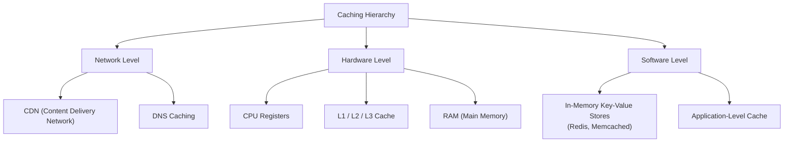
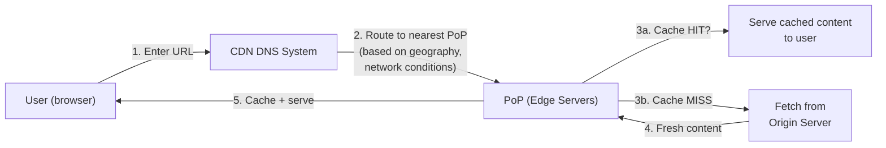
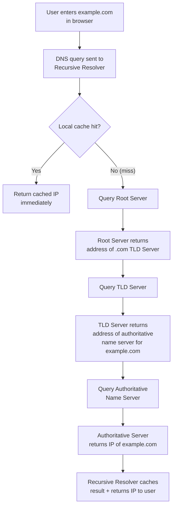
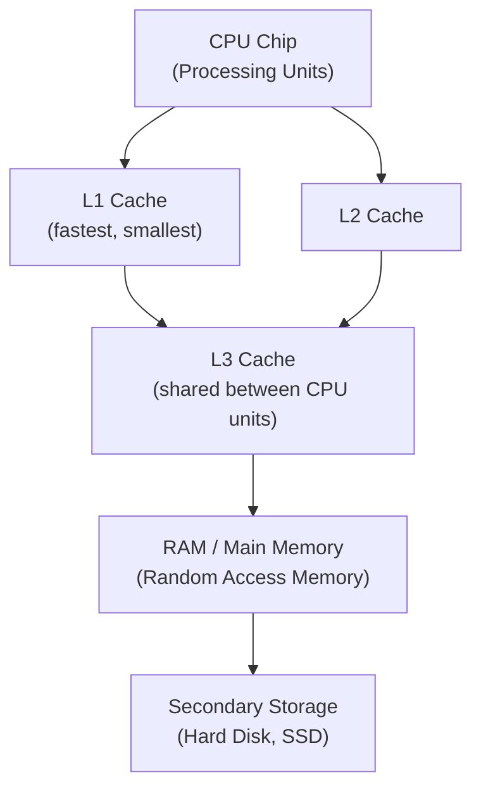
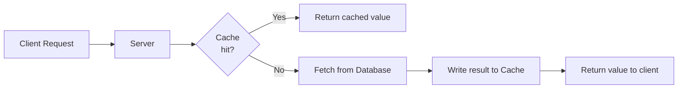
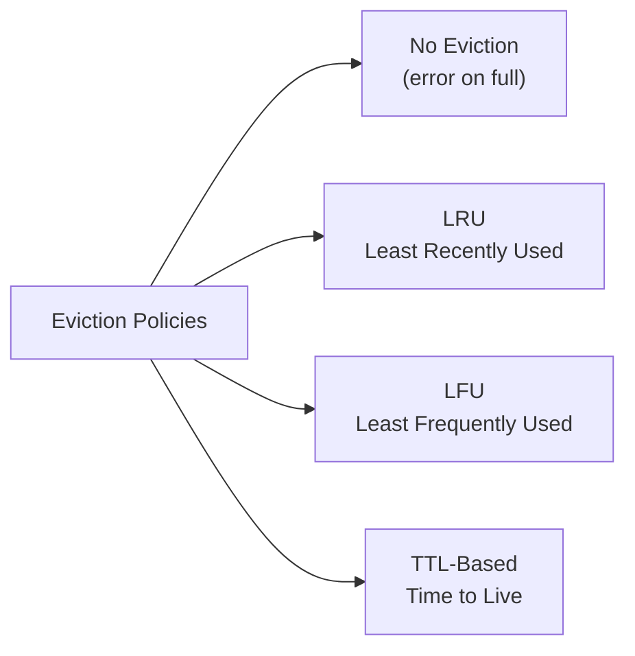
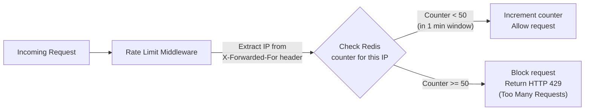

# Part 13 — Caching, The Secret Behind It All

> [!info] Video Reference
> **Title:** 13. Caching, the secret behind it all
> **Channel:** Sriniously · **Playlist:** Backend from First Principles (13/29)
> **Duration:** ~64 min · **Published:** 2025-03-05
> **URL:** [Watch on YouTube](https://www.youtube.com/watch?v=estH64OkwxU)

> [!abstract] In This Chapter
> What caching is and why it matters; real-world examples from Google Search, Netflix, and Twitter/X; the three levels of caching (network, hardware, software); CDN deep-dive; DNS caching hierarchy; CPU cache and RAM fundamentals; in-memory key-value stores (Redis, Memcached); cache-aside and write-through strategies; eviction policies (LRU, LFU, TTL); and practical backend use cases including DB query caching, session storage, API caching, and rate limiting.

---

## [00:00] What Exactly Is Caching?

**Caching** is a mechanism for decreasing the amount of time and effort it takes to perform some amount of work. That is the one-line explanation.

The more technical definition: **caching is keeping a subset of some primary data in a location that is faster to access — one that takes less time and less effort — so that retrieving or operating on that data becomes cheaper**. The subset is chosen based on how frequently the data is used, the probability of its next use, and other parameters. This single technique is a huge factor in the performance of high-performance applications, especially those that track latency in the order of double-digit microseconds or milliseconds.

> [!note] The "subset" keyword
> A cache never holds *all* the data. It holds only the portion that is most likely to be needed soon. Storing everything in cache would defeat the purpose because cache memory (RAM) is far more expensive per gigabyte than disk.

---

## [01:43] Why Caching Exists — Real-World Examples

Caching becomes indispensable in two broad scenarios:

1. **Avoiding repeated heavy computation** — the same expensive result is needed by many clients.
2. **Avoiding large data transfers** to many users when the underlying data changes infrequently.

Let's look at three concrete examples.

### [01:43] Google Search

When you type a query into Google and press Enter, the search engine runs a complex pipeline: crawling, indexing, and ranking **billions** of web pages. This is computationally expensive — it consumes enormous CPU and memory resources.

Consider the query *"what is the weather today"* — it is searched millions of times every day. Without caching, Google's servers would re-run the full ranking pipeline for every single request, leading to very high latency and server load.

Instead, Google uses a **distributed in-memory caching system** whose servers are spread across the globe. The results of ranking algorithms are stored (cached) in these servers. When a user searches:

- **Cache hit** — the system finds the cached result and returns it instantly. Retrieving data from cache is extremely fast — that is the whole point of caching.
- **Cache miss** — the system does not find the result (perhaps the query has never been typed before, or the cache entry expired). It then runs the full ranking workflow, computes the result, and **caches it** so the next user typing the same query gets a fast response.

### [05:48] Netflix

Netflix is a global streaming platform delivering movies, series, and anime to millions of users worldwide. The data volumes are massive — hundreds to thousands of terabytes — because each movie is stored in multiple resolutions (1080p, 720p, 480p, etc.) through a process called **encoding**. The appropriate resolution is dynamically selected based on the user's network speed and device.

Netflix serves this content with minimal buffering and server load by using a **Content Delivery Network (CDN)**:

- Netflix has **originating servers** (origin servers) — for example, in data centers across the US — that hold the actual movie files.
- At strategic locations all over the world, Netflix deploys **edge locations** (edge servers / edge nodes). These are chosen based on infrastructure availability and network connectivity.
- Each edge location holds a **subset** of the Netflix catalog — not everything, that would be prohibitively expensive. Netflix uses **machine-learning algorithms** and trend analysis to decide *which* content to cache at each edge location based on what people in that region are watching.

This is a textbook application of caching: take a subset of primary data, place it closer to the users, and serve it from there to minimize latency and origin-server load.

### [12:23] Twitter / X (Trending Topics)

Twitter (now X) computes **trending topics** by analyzing millions of tweets in real time across the globe. This involves machine-learning algorithms, GPUs, and processing terabytes of data. If Twitter recomputed trends every time a user opened the trending section, the servers would crash under the load of billions of concurrent users.

Instead, Twitter **caches** the computed trending topics. Since trends (e.g., elections in a country) do not change by the second — they persist for hours or days — they are safe to cache. Every few minutes, Twitter recomputes and stores the result in an **in-memory key-value store** like Redis. When users request the trending section, the data is served from cache instantly.

> [!tip] Pattern
> Every example above follows the same pattern: **heavy computation + infrequent change = prime caching candidate**.

---

## [17:10] Three Levels of Caching

As a backend engineer, you will most frequently encounter caching at three levels:

**What this diagram shows:** Caching is not a single technology — it is a concept implemented at every layer of the computing stack, from the network (CDNs, DNS) down through hardware (CPU caches, RAM) to software (Redis, Memcached). A backend engineer interacts most with the software level, but understanding the full stack helps you reason about performance end to end.

> [!note] Software-level caching also relies on hardware caching
> In-memory databases like Redis store their data in RAM, which is itself a form of hardware-level cache relative to disk. So "software caching" is not purely software — it leverages hardware caching to deliver its performance.

---

## [19:02] Network-Level Caching: CDN Deep-Dive

A **Content Delivery Network (CDN)** caches content on servers that are **geographically closer** to end users. These servers are called **edge nodes**, **edge servers**, or simply **edge** — the term "edge" means the computation or content is happening at a server closest to you rather than at a single originating server.

### How a CDN Works (High-Level Flow)

**What this diagram shows:** When a user requests a resource (image, video, web page), the CDN's DNS system routes the request to the nearest **Point of Presence (PoP)** — a collection of edge servers in a particular region. If the content is cached (cache hit), it is served immediately. If not (cache miss), the edge server fetches it from the originating server, caches it, and then serves it.

### Key Concepts

- **Point of Presence (PoP):** A geographic region containing multiple edge servers. "PoP" is just a fancy term for "a cluster of edge servers serving a region."
- **Routing parameters:** The CDN DNS system routes requests based on the user's geographic location, network conditions (stable vs. bad connection), and the available content at each PoP. For example, a user with a poor connection might be routed to a PoP that only holds lower-quality video versions.
- **Cache Hit vs. Cache Miss:** If the requested resource is on the edge server → **cache hit** → serve immediately (happy path). If not → **cache miss** → edge server fetches from the origin server (potentially on another continent), caches it, and serves it.
- **TTL (Time to Live):** CDN content has a TTL — a duration after which the cached copy expires. Companies choose a sensible TTL (e.g., a few hours). After TTL expires, the next request triggers a fresh fetch from the origin server, and the new content gets a fresh TTL.

CDNs are used by Netflix, Vercel, Cloudflare, and countless other platforms to serve video files, images, and static web assets (JavaScript, HTML, CSS) efficiently.

---

## [26:17] Network-Level Caching: DNS

DNS (Domain Name System) queries also make heavy use of caching to minimize the latency of resolving domain names to IP addresses.

### DNS Resolution Walk-Through

Let's say a user enters `example.com` in their browser and presses Enter:

**What this diagram shows:** DNS resolution is a recursive process. A **recursive resolver** (provided by your ISP, or by public DNS services like Google 8.8.8.8 or Cloudflare 1.1.1.1) walks the DNS hierarchy: root server → TLD server → authoritative name server. Caching happens at **every level** to avoid repeating this expensive walk.

### Caching Layers in DNS

1. **Operating System cache** — Windows, macOS, and Linux all maintain a local DNS cache. The OS checks this first, before even reaching the recursive resolver.
2. **Browser cache** — Modern browsers (Chrome, Firefox) maintain their own DNS cache as a second layer.
3. **Recursive resolver cache** — The resolver (ISP or public DNS) caches results so it can skip the full recursive lookup for repeat queries.
4. **Authoritative name server cache** — Some authoritative name servers also cache results to avoid further upstream queries.

The resolver is called "recursive" because it goes deeper and deeper into different servers until it finds the IP address. DNS caching exists because doing the full recursive walk for every single request from billions of users would be prohibitively slow.

---

## [35:02] Hardware-Level Caching

From a computer science perspective, hardware-level caching is well-known:

**What this diagram shows:** The CPU has multiple layers of cache (L1, L2, L3) that store frequently accessed data and computations. L1 is the fastest and smallest, closest to the CPU core. L3 is shared across cores. Below the caches sits RAM, and below that, secondary disk storage. Each level is slower but larger than the one above it.

### Why Arrays Are Fast for Sequential Access

The CPU uses **predictive algorithms** to pre-fetch data into cache. When you traverse an array sequentially (elements stored contiguously in memory), the CPU predicts the access pattern and loads the entire block into L1/L2 cache. This is why sequential array traversal is extremely fast.

### RAM vs. Disk — Why "In-Memory" Matters

| Property | RAM (Random Access Memory) | Hard Disk / SSD |
|---|---|---|
| Access speed | Very fast (single electrical signal) | Slow (mechanical head / NAND) |
| Capacity | Limited (GBs) | Large (TBs) |
| Volatility | **Volatile** — data lost on power-off | **Non-volatile** — persists |
| Access pattern | Random — same speed regardless of direction | Sequential / mechanical seek |

**RAM** is called "random access" because, unlike a hard disk (where a mechanical head physically revolves to find data), RAM uses capacitors and electrical signals to directly access any memory address in roughly constant time. The access speed is the same regardless of which address you read — hence "random" access.

The trade-off is that RAM is **volatile** (data disappears when power is off) and **limited in capacity**. Disk storage is the opposite: slower but persistent and vast. This is why RAM cannot fully replace disk — each has its own role.

> [!important] Why Redis / Memcached are "in-memory"
> Technologies like Redis and Memcached store their data in **RAM** (primary memory), not on disk. This is the core reason they are extremely fast for reads and writes. For **persistence**, they periodically write data to disk in the background (more on this below). But all active data access happens from RAM.

## [41:14] Software-Level Caching: In-Memory Key-Value Stores

In the context of backend development, the software-level caching tools you interact with daily are **in-memory key-value stores** — most notably **Redis** and **Memcached**. Cloud-managed equivalents include **AWS ElastiCache**.

These are called **in-memory, key-value-based, NoSQL databases**. Let's unpack each part of that name:

| Term | Meaning |
|---|---|
| **In-memory** | Data is stored in **RAM** (primary memory), not on disk. This is why reads/writes are extremely fast. |
| **Key-value** | Data is organized as simple key→value pairs. No tables, no strict schema — just a key (string) and an associated value (which can be a string, list, hash, set, sorted set, etc.). |
| **NoSQL** | Unlike relational databases (PostgreSQL, MySQL), these databases do not enforce strict schemas, JOINs, or aggregation pipelines. They are simpler and faster for their specific use cases. |

### How You Use Them

Using Redis from your backend code is straightforward:

1. Install a compatible library for your language (e.g., `node-redis` for Node.js).
2. Connect to the Redis server.
3. **Store:** `SET mykey "myvalue"` (or with TTL: `SETEX mykey 3600 "myvalue"` — expires in 1 hour).
4. **Retrieve:** `GET mykey` — returns the value or nil if expired/missing.
5. **Delete:** `DEL mykey` — explicitly remove a key.

There are no complex SQL queries or aggregations — it is simply store-and-retrieve by key.

### Persistence Behind the Scenes

Although Redis stores data in RAM for speed, it provides persistence mechanisms so data survives restarts:

- **RDB (Redis Database Backup):** Periodic snapshots of the dataset written to disk.
- **AOF (Append-Only File):** Every write operation is logged to disk; on restart, the log is replayed to reconstruct the dataset.

When the program starts, it loads data from disk back into RAM. All active reads and writes happen from RAM. The persistence layer is the responsibility of the caching technology — you do not need to implement it yourself.

---

## [42:52] Caching Strategies

There are two primary caching strategies used in backend development:

### [43:05] Strategy 1 — Lazy Caching (Cache-Aside / Read-Through)

**What this diagram shows:** In lazy caching (also called **cache-aside**), the server first checks the cache. On a hit, it returns immediately. On a miss, it fetches from the primary database, writes the result into the cache, and then returns it. The cache is populated **lazily** — only when a client actually requests the data. You do not proactively predict and pre-fill the cache.

This is the most common pattern. It is "lazy" because you only cache data when someone actually asks for it.

### [44:12] Strategy 2 — Write-Through Caching

In **write-through** caching, every write operation (POST, PUT, PATCH) updates **both the database and the cache simultaneously** in the same execution flow:

1. Client sends a write request.
2. Server updates the primary database.
3. Server **also** updates (or invalidates) the corresponding cache entry.
4. Server returns success.

**Advantage:** The cache is always fresh — you never serve stale data.
**Disadvantage:** Every write operation incurs extra overhead because you must update two systems (DB + cache) in the same request. This is acceptable when cache freshness is critical.

> [!tip] When to use which?
> - **Cache-aside** is the default for most read-heavy, write-light workloads (product pages, user profiles, search results).
> - **Write-through** is preferred when stale data is unacceptable and write frequency is manageable.

---

## [45:14] Eviction Policies

Because RAM is limited (far smaller than disk), an in-memory cache will eventually run out of space. **Eviction policies** define how the cache decides which old data to remove to make room for new entries.

**What this diagram shows:** Four eviction strategies. "No Eviction" simply errors when the cache is full. LRU, LFU, and TTL-based policies each use a different criterion to decide which key to evict when space is needed.

### [46:50] No Eviction

You do not configure any eviction policy. When the cache is full and you try to insert a new key, the system returns an error ("memory full"). This is rarely used in production.

### [47:10] LRU — Least Recently Used

Tracks **when** each key was last accessed. When space is needed:

1. Look at all current keys.
2. Identify the key that was accessed **longest ago**.
3. Evict that key.
4. Insert the new key.

**Example:** Keys 1–4 are in the cache. Key 4 was last accessed yesterday; keys 1–3 were accessed today. Key 5 arrives → key 4 is evicted (it is the least recently used).

### [48:25] LFU — Least Frequently Used

Tracks **how often** each key has been accessed (frequency counter). When space is needed:

1. Look at all current keys.
2. Identify the key with the **lowest access count**.
3. Evict that key.
4. Insert the new key.

**Example:** Key 1 was accessed 5 times, key 2 — 10 times, key 3 — 6 times, key 4 — 23 times. Key 5 arrives → key 1 is evicted (lowest frequency).

### [49:38] TTL-Based Eviction (Time to Live)

Each key is assigned a TTL (time to live) at insertion. When space is needed, the key with the **lowest remaining TTL** (closest to expiring) is evicted. This can also work in the background: keys automatically expire when their TTL reaches zero, freeing space without explicit eviction logic.

> [!note] TTL is also used with cache-aside
> Even outside eviction, TTL is commonly set on cached entries (e.g., "cache this for 1 hour"). After the TTL expires, the next read triggers a cache miss, causing a fresh fetch from the database. This is a form of **time-based cache invalidation**.

---

## [50:24] Use Cases in Backend Development

### [51:38] Use Case 1: Database Query Caching

When you have an **expensive SQL query** (many JOINs, aggregations, millions of rows) that is called frequently — say, on a landing page or dashboard — you can cache its result:

1. First request: run the full query, store the result in Redis with a TTL (e.g., 1 hour).
2. Subsequent requests: check Redis first. On hit, serve from cache. On miss, run the query and cache again.
3. When the underlying data changes: manually invalidate the cache entry or let TTL expire.

**Real-world example:** Amazon caches product details, prices, and inventory data. During a MacBook sale, millions of users hit the product page. Without caching, every request would query the database — an enormous waste since product details rarely change. Caching absorbs the read load.

### [55:45] Use Case 2: Session Storage

After a user authenticates, a session token is generated and stored in Redis. Every subsequent API call verifies the session by looking it up in Redis.

**Why Redis?** Session lookups happen on *every single request*. Storing sessions in a relational database would add unnecessary latency (even 20–30 ms per lookup) and load on the primary database. Redis returns session data in sub-millisecond time.

### [56:58] Use Case 3: API Response Caching (External APIs)

If your backend calls an external API (e.g., a weather API) on every user request, you will quickly hit **rate limits** or rack up **billing** — especially if the data does not change in real time.

**Solution:** Cache the external API response in Redis with a TTL (e.g., 1 hour). All requests within that hour use the cached response. After the TTL expires, the next request triggers a fresh API call, and the result is cached again.

### [58:52] Use Case 4: Rate Limiting

Rate limiting is typically implemented as **middleware** that sits between the incoming request and your route handlers. Here is how it works with Redis:

**What this diagram shows:** A rate-limit middleware extracts the client's IP from the `X-Forwarded-For` header (added by reverse proxies like Nginx). It stores a counter in Redis keyed by IP + time window. If the counter exceeds the limit (e.g., 50 requests per minute), the request is blocked with an HTTP 429 "Too Many Requests" response.

**Why Redis?** Rate limiting requires a fast read-check-increment cycle on *every* request. If you stored the counter in PostgreSQL, every request would trigger a database call — adding latency and flooding the database. Redis handles this in-memory, making it both fast and lightweight.

> [!tip] Rate limiting protects compute-intensive APIs
> Rate limiting is especially important for compute-intensive endpoints. Without it, bots or abusive clients could overwhelm your servers. By storing counters in Redis, the rate-limit check itself adds negligible overhead.

---

## Key Takeaways

- **Caching** = storing a subset of data in a faster-to-access location to reduce time and effort on repeated access.
- **Cache hit** = data found in cache (fast path). **Cache miss** = data not found; must fetch from origin, then populate cache.
- **Three levels of caching:** Network (CDN, DNS), Hardware (CPU L1/L2/L3, RAM), Software (Redis, Memcached).
- **CDNs** cache content at edge locations worldwide. DNS routing directs users to the nearest PoP based on geography and network conditions. TTL ensures freshness.
- **DNS caching** exists at four layers: OS, browser, recursive resolver, and authoritative name servers.
- **RAM** (Random Access Memory) is the foundation of in-memory databases — it offers constant-time random access but is volatile and limited in capacity compared to disk.
- **Redis** and **Memcached** are in-memory, key-value, NoSQL databases. They store data in RAM for speed, with optional disk persistence (RDB/AOF).
- **Cache-aside (lazy caching):** check cache first → miss → fetch from DB → store in cache → return. Most common pattern.
- **Write-through:** update DB and cache simultaneously on every write. Guarantees freshness at the cost of write overhead.
- **Eviction policies** decide what to remove when the cache is full: LRU (least recently used), LFU (least frequently used), TTL-based (closest to expiry), or no eviction (error).
- **Backend use cases:** DB query caching, session storage, external API response caching, and rate-limit counter storage.

---

## Related Notes

- [[_00 - Backend from First Principles - Index]] — Course Index
- [[12 - Mastering Databases with Postgres]] — Previous chapter
- [[14 - Task Queues and Background Jobs]] — Next chapter
- [[05 - Understanding HTTP for Backend Engineers]] — HTTP-level caching headers (Cache-Control, ETag, etc.)

---

> [!note] Source Fidelity
> This chapter was transcribed and adapted from the YouTube video linked above. Every concept, example, and explanation originates from the video. Minor grammar and punctuation have been corrected for readability; ambiguous captions are marked with ⇢ *inferred*. No technical content has been added beyond what the speaker covered.
