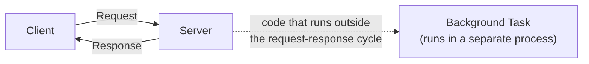
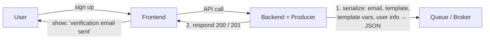
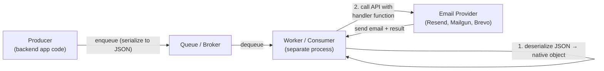
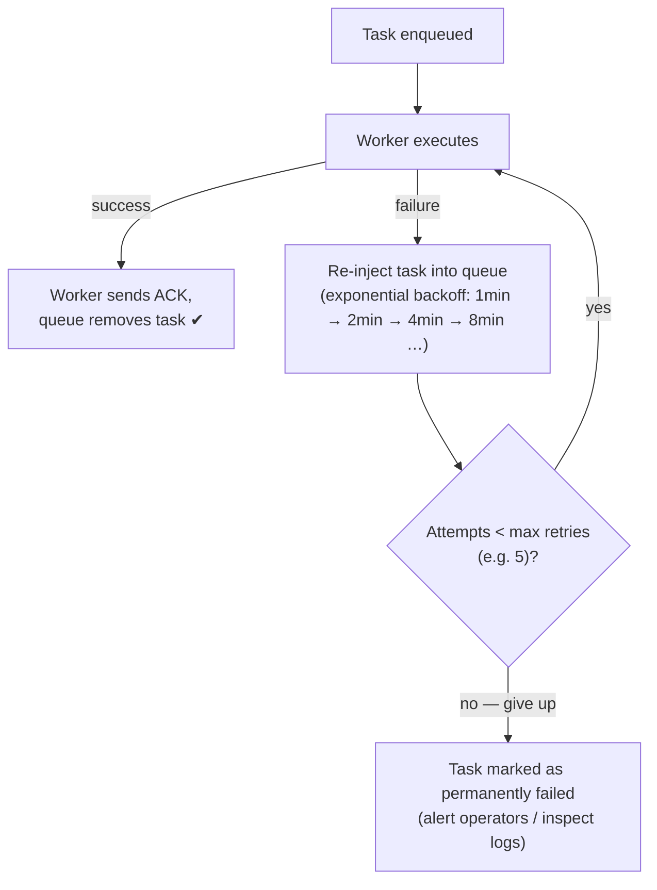
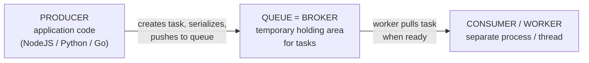
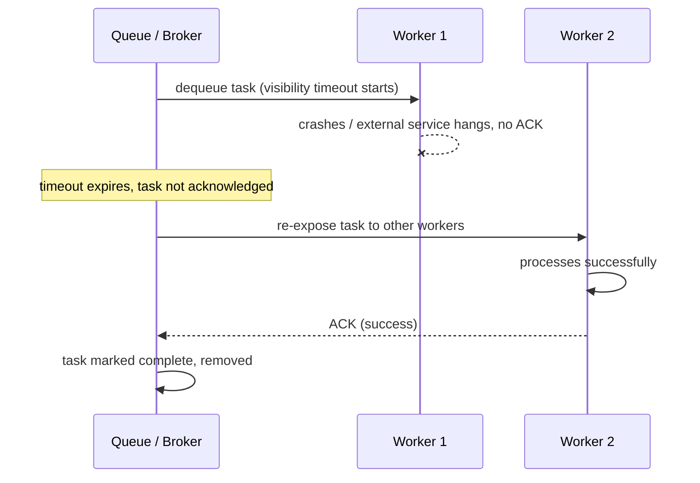
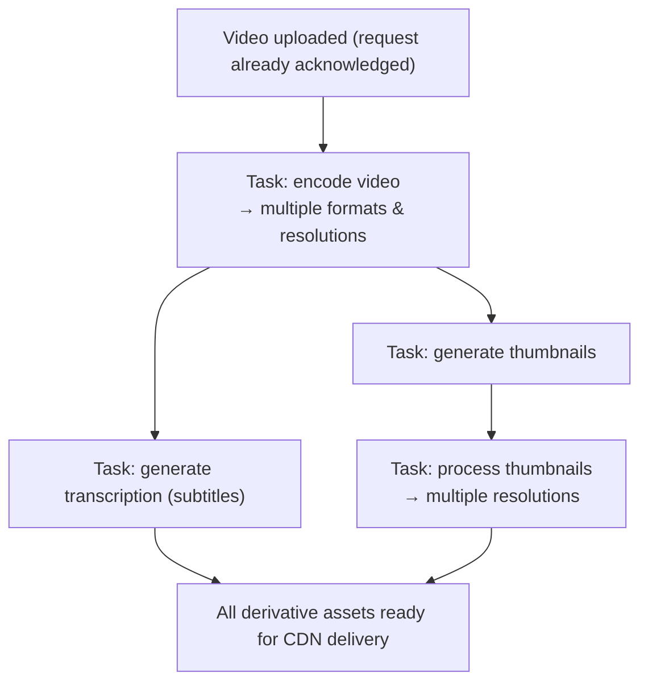
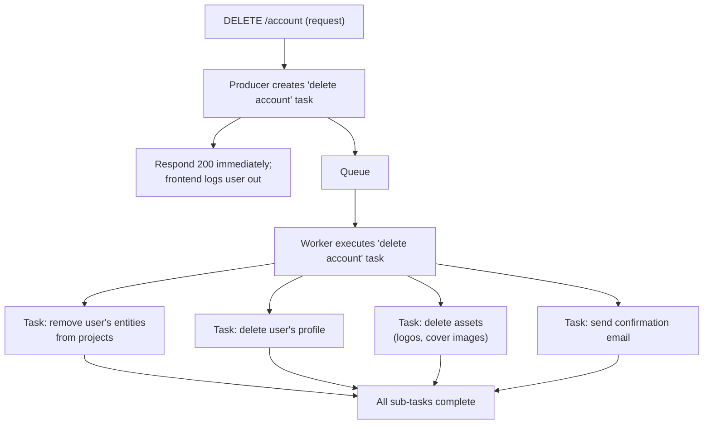

# Part 14 — Task Queues and Background Jobs

> [!info] Video Reference
> **Title:** 14. Task queues and background jobs
> **Channel:** Sriniously · **Playlist:** Backend from First Principles (14/29)
> **Duration:** ~56 min · **Published:** 2025-04-16 · **Views:** 33,406 · **Likes:** 905
> **URL:** [Watch on YouTube](https://www.youtube.com/watch?v=r-nQsyguU1Y)

> [!abstract] In This Chapter
> What background jobs are and why every backend engineer needs them; the signup/verification-email walkthrough that motivates moving work out of the request-response cycle; synchronous vs asynchronous execution and the failure modes of each; the anatomy of a task queue (producer, broker, worker); broker technologies such as RabbitMQ, Redis Pub/Sub, and Amazon SQS; enqueueing/dequeueing, serialization, acknowledgements, and visibility timeouts; retries with exponential backoff; the four kinds of background tasks (one-off, recurring, chain, and batch) illustrated with an LMS video-upload and a delete-account flow; design considerations (idempotency, error handling, monitoring, scaling, ordering, rate limiting); and practical best practices.

---

## [00:00] What Is a Background Task?

A **background task** (also called a **background job**) is, very simply, *any piece of code that runs outside of the request-response life cycle*.

In the classic interaction, a **client** sends a **request** and a **server** returns a **response**. The video pictures it as four actors in a line: request on one side, response on the other, the client on the client side, and the server on the server side. Everything that happens *inside* that round trip is synchronous work — the client is blocked, waiting for the answer.

Anything else — any piece of code, any logic, any workflow that runs *outside* this whole client-server interaction, this whole request-response life cycle — is what we call a **background job** or **background task**.



**What this diagram shows:** The solid arrows are the only work the client waits on — the request in, the response out. The dashed arrow represents any processing the server decides to hand off to a background task; that work happens outside the life cycle, so the client is never held up by it.

Three characteristics make something a good background task:

1. **It does not need to happen immediately.** It is not a mission-critical task that has to be responded to right after being called.
2. **It is not synchronous.** The caller is not waiting on it, so nothing blocks.
3. **It can therefore be offloaded to a separate process** and finished however we have programmed it to finish — and it can respond to whatever client or separate process it was designed to interact with.

Understanding this pattern is important for a backend engineer because it is the foundation for building **scalable and responsive applications** — backends that stay fast even when they take on work that is slow.

---

## [01:39] Why Do We Need Them? The Signup Walkthrough

The video motivates background jobs with the classic example of a **user signing up to a SaaS platform** and receiving a **verification email**.

### The Signup Flow

1. **The user** arrives at the platform and types their **email**, their **name / username**, and their **password**, then clicks **"Sign Up"**.
2. **The frontend** makes a request — an API call — to the **backend server**.
3. **The backend** does the initial processing and validation: it checks the email, the length of the password, the complexity of the password, and so on.
4. If all of that succeeds, the server needs to **send an email to the user**.

### Why a Verification Email?

When you sign up on real platforms, you almost always receive a verification email. It exists to prove that the email address you provided actually belongs to you — that you are not handing over some random email you do not own.

The verification email typically contains one of two things:

- **A link**: clicking it redirects you to the frontend, where you may be asked to confirm the account (or set a new password, etc.), or
- **A code**: a **six- or eight-digit code** — a kind of **one-time password (OTP)** — that you must type back into the front-end interface.

### How Email Sending Actually Works

Sending email is almost never done directly by your own server. Instead, you subscribe to a **third-party platform** — an **email provider** — to send the email for you. The video names modern providers like **Resend**, **Mailgun**, and **Brevo** (⇢ *inferred*; the captions transcribe Brevo as "bravo").

The workflow of sending an email looks like this:

1. You **construct the content** of the email — typically an **HTML template** — and you fill that template with whatever code or link needs to go inside it so the user can verify the email.
2. You **provide the recipient's email address** (the user's address).
3. You provide the **subject**, the **"from" address**, and the other default parameters needed to send an email through an email provider to an SMTP provider.
4. Your backend makes **another API call to a different service** — the email provider's server (e.g., Resend, Mailgun).
5. That server **processes your email**: it checks whether you own this email, whether your **API key** is correct, and so on.
6. If everything is successful, the provider **sends the email** and returns a **response** to your backend stating whether the send succeeded or failed.

The key insight: **your backend calling another backend (the email provider) is the exact piece of interaction we want to offload to a background task.**

```mermaid
sequenceDiagram
    participant U as User
    participant FE as Frontend
    participant BE as Backend (yours)
    participant EP as Email Provider (3rd party)
    U->>FE: Types email, name, password; clicks Sign Up
    FE->>BE: POST /signup (API call)
    BE->>BE: Validate email, password length & complexity
    BE->>EP: API call with HTML template, recipient, subject
    EP-->>BE: Response: success or failure
    BE-->>FE: Response to signup
    FE-->>U: "Verification email sent, check your inbox"
```

**What this diagram shows:** The request-response life cycle that the client cares about is short — User → Frontend → Backend → Frontend → User. The long horizontal excursion to the **Email Provider** and back is the slow, unpredictable part. It is completely outside the control of the client, and it is exactly the part we would like the client not to wait on.

### Why This Interaction Is the Perfect Candidate for Offloading

The provider's server **may not be as responsive as your own server**. You have **no control over other servers**. There can be traffic spikes at the provider, service downtime, or a dozen other reasons the call is slow or fails. If your signup endpoint has to wait on that call, your signup endpoint becomes as slow — or as broken — as the third party.

---

## [06:10] What Goes Wrong If We Do It Synchronously

To make the advantage concrete, the video plays out the synchronous version (all processing done in the same process, in the same request-response life cycle) and assumes the **email provider is down**.

There are two possible failure modes, both bad for user experience.

### Failure Mode 1: No Proper Error Handling

If your code does **not** catch the failure of the email API call properly, then the email provider's failure **propagates into the whole signup request**: the entire signup API itself fails and returns a **500 Internal Server Error**.

The user did nothing wrong, but the signup fails purely because a third party was down. Terrible user experience.

### Failure Mode 2: "Proper" Error Handling That Still Loses the Email

Now add proper error handling. Only the email interaction fails; the **signup API itself succeeds**. The frontend therefore shows the user: *"We have sent you a verification email — use the link to verify your account."*

But the email was **never actually sent** because the provider was down at that moment. So:

1. The platform claims success and the user waits for a verification email that is not coming.
2. The user eventually comes back to the platform and — if the functionality exists — clicks **"Resend email."**
3. If the provider has recovered by then, all is well: the email resends and the account gets verified.
4. If the provider is **still down**, that part of the API fails again — yet the UI again shows *"We have sent you an email."*

You can imagine how that experience goes: the user is stuck in a loop of being told an email was sent when it never was. This is precisely the problem a task queue solves.

---

## [09:30] The Asynchronous Approach: Enqueue the Task, Respond Immediately

Now the video redraws the same scenario the asynchronous way — the flow that a **task queue** enables.

1. The user comes to the frontend, types name and email, and makes the same request to the server.
2. The server does **all the same initial processing**: validation, database calls, storing the initial user data, generating the verification code, constructing the email content.
3. But then, **instead of calling the email provider's API** in that same method, in that same request-response life cycle, it does something different:

   - It takes **all the information needed to send the email** — the HTML template, the verification code, the recipient, the subject, etc.
   - It **packages that information into some format**, e.g. **JSON** — it *serializes* it.
   - It **injects the serialized payload into some kind of queue**. ("Queue" is the intended word; the captions frequently render it as "cube".)
   - **The API call to the email provider does not happen at this point.** The server has simply recorded: *"This is a new task, a new function call that we need to trigger — to execute at some point, somewhere. We don't know exactly when yet."*
4. After pushing the task into the queue, the server **returns** — a success status like **200 or 201**, depending on the semantics you use. 

The user sees, immediately, the screen that says *"We've sent a verification email to your provided email — you can use the link in that email to verify your account."* That is the whole job of the **task-creation side** of the system.



**What this diagram shows:** The backend does two things. First it *pushes a serialized task* into the queue, and then it immediately responds 200/201 to the frontend. From the user's point of view the signup is already done, even though no email has been sent yet. The creation of the task requires no network call to the email provider.

---

## [11:25] The Consumer Side: Pulling and Executing the Task

The other side of the queue is where the task actually gets executed. Here are the pieces:

- **Consumers** — also called **workers**, depending on the framework or language — sit on the far side of the queue.
- A **consumer is a program that runs in a different process** from the main process, from the main backend application. (Depending on language/framework it can be a separate thread or a whole separate codebase, but the core fundamentals are the same.)
- The consumer **constantly monitors the queue for new items** being pushed in. When it finds a new task, it **dequeues** it and starts executing it.



**What this diagram shows:** The producer only ever writes JSON into the queue; it never touches the email provider directly. The worker pulls the task, deserializes it back into a native object, and then — using the handler it has registered — makes the API call to the email provider. The slow third-party work now happens entirely in the worker's process.

Since the producer **serialized all the information** into JSON, the consumer needs to **deserialize** it back into the native format of its language:

- **Python** → deserializes into a **dictionary**
- **JavaScript / NodeJS** → deserializes into an **object**
- **Go** → deserializes into a **struct**

The consumer is typically configured in advance with three things:

1. **Which queue** to pick tasks up from.
2. **What kind of data it expects** to receive in the task payload — this is the *deserialization layer* of the consumer.
3. **A registered handler** — a method, the actual code that runs when given the data it needs. This handler is essentially **the same workflow or function you would have run synchronously**, had you not moved to a background job.

In the email example, the deserialized data contains everything needed to send the email: the **HTML template**, the **sender email**, the **receiver email**, the **subject**, the **user ID**, and user information such as the **user's first name** and **email**. The consumer then **calls the API** of the chosen email provider (Resend, Mailgun, Brevo, etc.), and the provider actually sends the email.

### Why Latency Is Not a Problem Here

All of this processing typically completes in **a few seconds or even milliseconds** when the queue is not backed up. That is plenty for email:

- Verification emails usually **expire after 15 or 20 minutes**.
- Your email is typically delivered in **milliseconds**, or at most **under 5–10 seconds** even when you have lots of traffic and a long queue.

So the user receives the email in time, the delay is invisible, and — crucially — the user was **never made to wait** for it.

---

## [16:48] Failure Handling, Retries, and Exponential Backoff

Now assume the email provider's API call **fails** — the service was down, exactly as in the synchronous scenario.

What happens now? Since the API failed, the **consumer process — the handler registered with the consumer — also fails**, which means **our task has failed**.

Contrast the two worlds:

- **Synchronous:** the request-response life cycle *breaks*. The server returns a **500 Internal Server Error**, and the user's signup is at risk or the UX lies about the email having been sent.
- **Background:** the failure is contained inside the worker. Nothing breaks in the user's request. But the task did not succeed, so there is a decision to make: **what do we do with a failed task?**

### Failed Tasks Are Re-Injected Into the Queue for Retrying

The standard answer — handled by whichever framework you use — is that a failed task is **again injected into the queue for retrying**. The specific frameworks named in the video:

- **Python** → **Celery**
- **NodeJS** → **BullMQ**
- **Go** → **asynq** (⇢ *inferred*; the captions read "async q")

### Retry by Exponential Backoff

For retries, there are various algorithms. One of the most popular is **exponential backoff**:

> After a task fails, wait some interval and try again. If it fails again, increase the waiting time — doubling it each time.

A concrete walkthrough from the video (with a configured maximum of, say, **5 retries**):

1. First attempt fails. Wait **1 minute**, retry.
2. Second failure. Wait **2 minutes**, retry.
3. Third failure. Wait **4 minutes**, retry.
4. Fourth failure. Wait **8 minutes**, retry.
5. ... and so on, up to the **maximum amount of retries configured beforehand**.



**What this diagram shows:** A task is executed by a worker. On success it is acknowledged and removed from the queue. On failure it is pushed back into the queue with a growing delay, until it either succeeds or exhausts the configured maximum number of retries, at which point it is treated as permanently failed.

### Why Exponential Backoff Works So Well in Practice

Big email providers like **Resend or Mailgun** very rarely experience outages lasting 4 or 8 minutes straight. Their downtime is typically measured in **seconds or milliseconds**. So a task might fail once — or at most twice — and by the **third attempt** the external service has almost surely recovered, the retry succeeds, and the email is delivered.

The punchline: **even though the external service was down, we still eventually sent the email successfully** — through this retrying mechanism — **and we were able to do it without ever bothering the user**. That is one of the biggest advantages of background task processing: it bundles in very convenient functionality like **retrying mechanisms and failure detection** almost for free.

---

## [19:25] The Two Core Advantages (Recap So Far)

1. **Faster processing time — responsiveness of the backend application.** We no longer block the actual API call because of some external service or because of some heavy processing.
2. **Retrying mechanisms for tasks that are prone to failing.** Failures are detected and the task is retried intelligently instead of the user experiencing an error.

Pulling it together, the video gives this summary sentence:

> Background tasks allow you to offload **time-consuming and non-critical operations**; because of that, your backend API calls remain **responsive**, they **prevent timeouts caused by dependency on external services**, and the overall **user experience improves significantly**.

---

## [20:20] Major Examples of Background Work in a Typical SaaS Application

### 1. Sending Emails

Already covered in depth: verification emails, and by extension the whole class of third-party-dependent communication. Emails depend on an external service, so they are offloaded to a background task.

### 2. Processing Images or Videos

A user uploads an **image**. The platform needs to **resize it into different formats and dimensions** so the image is **optimized for delivery** depending on the **network conditions** and **device** of the user:

- **Mobile smartphones** usually need **smaller-size** images.
- **Desktop applications** can use **big sizes** — the transcript mentions "2XL, XL" (⇢ *inferred*; the captions read "2 XL XL") — i.e., large image variants.

The storing of the upload happens fast, but generating all those derivatives is CPU-heavy and slow — a perfect background job. The same logic applies to **processing videos**.

### 3. Generating Reports

Enterprise SaaS applications — the example given is a **project management application** — need to send users recurring reports of their statistics: all the stats, all the tasks in progress, all the **completed tasks**, all the **pending tasks** in a sprint, and so on. Such a report:

- must be **constructed** with all the content directly in HTML or generated as a **PDF file**;
- must be **sent** —
  - **daily** at midnight (12:00),
  - **weekly** on Sunday at 12:00,
  - or **monthly**, depending on the user's configuration.

These are commonly driven by **cron jobs**. Framework-level libraries such as **Celery** and **BullMQ** also ship built-in **scheduled-task features** — you configure a particular date and time, and the task is executed again and again at those intervals.

### 4. Sending Push Notifications

Think of the notifications you receive in your smartphone's notification bar from apps like **Swiggy** or **Zomato** — *your delivery partner has reached the restaurant*, and similar. These are **push notifications**: they appear **directly in the notification panel**, not inside the app.

How they work at a high level:

1. When you install the app on your phone, **your device is registered under a push notification service**. That service is usually **provided by the operating system** — **Google has its own** push notification service (for Android), **Apple has its own** (for iOS), etc.
2. The **backend** must **store a code identifying your device** (a device token) in its database.
3. Whenever the backend wants to notify that particular device, it makes a **service call to Google or Apple** depending on the user's operating system.
4. **The external service — not your backend — actually delivers the notification to the phone.** Your backend cannot reach the phone directly; the operating-system service does that on your behalf.

Since this workflow again involves making a **service call to a different, external service**, it is also offloaded to a background task.

---

## [24:57] What Exactly Is a Task Queue?

Now the video turns technical: what is a **task queue**, and how does it actually work?

> **Definition — A task queue is just a system for managing and distributing background jobs or tasks.**

It is the **mechanism**, the behind-the-scenes technology, that **enables you to reliably hand off the work you want to do in the background to a separate process**. It is the core "engine" behind the whole workflow we have been walking through.

The core idea has exactly **three parts**:



**What this diagram shows:** The producer writes tasks into the queue; the queue stores them until a worker is ready; the worker pulls them and executes them. Each of the three boxes has a distinct responsibility, and each can in principle live in a different process, thread, or machine.

### The Producer

The **producer** is **your application code** — NodeJS, Python, Go, whichever language and framework you use. Its responsibility is to **create the task**:

- The creation process bundles **all the information the consumer/worker will need** to process or execute the task.
- The producer **serializes** that information into a **JSON format** (or whatever serializable format the framework/library uses).
- Then the producer **pushes the result into the queue**. That is *all* the producer does.

A task's payload depends on the task type. For an **email task**: the user ID, the user profile information, the user's name, the user's email. For an **image-processing task**: the image. For a **report-sending task**: all the data needed to assemble and send the report.

### The Queue (Also Called the Broker)

The queue **stores these tasks until a worker is ready to process them**. It acts as a **temporary holding area** — tasks sit there between the moment the producer pushes them and the moment a consumer picks them up. The video's analogy: **imagine a to-do list for your backend**. Your application code adds tasks to the to-do list, and the workers or consumers pick them off **one by one** and execute them.

### The Consumer / Worker

The **consumer** runs in a **different process** (or a separate thread — technical details vary by language, framework, and library, but the fundamentals stay the same). It:

1. **constantly monitors the queue** for new items being pushed in;
2. when it finds a new task, it **dequeues** it;
3. and it **executes** the task using the **handler registered** for that particular task.

---

## [27:38] Enqueueing, Dequeueing, and Real Broker Technologies

Two technical verbs come straight from data-structures-and-algorithms (DSA):

- **Enqueue (enq)** — adding a new item into a queue. In the task-queue world, "enqueue the task" means *creating the task and pushing it into the queue*. An important part of enqueueing is that the task content must be **serialized into a serializable format like JSON** — otherwise it could not survive the journey between processes.
- **Dequeue (deq)** — taking an item out of a queue. The worker **dequeues** a task when it pulls it out to start executing.

### What the Queue Actually Is: Underlying Technologies

So far we have talked about "the queue" abstractly. In practice, the broker is almost always a real technology. Examples given in the video:

- **RabbitMQ** — a dedicated message-broker queue.
- **Redis Pub/Sub** — Redis has a very useful **publisher-and-subscriber module** (publish/subscribe) that is commonly used for implementing task queues.
- **Amazon SQS** — the **managed queuing service from AWS**. If you are planning to scale your task-processing system to many **nodes spread across the whole world**, SQS is a good solution: it is a **managed service deployed across multiple regions**, giving you a **very scalable and responsive task-processing system** almost out of the box.

So the queue/broker that actually stores the tasks is usually managed by an underlying technology such as RabbitMQ or Redis Pub/Sub; the producer and consumer are your code on top of it.

### What Matters When a Worker Finishes or Fails

When the worker **completes** the task, it sends an **acknowledgement (ACK)** back to the queue. This tells the queue that the task **was successfully processed and can be removed**.

If the queue does **not** receive an acknowledgement, it must decide what happened — and the frameworks in play let it branch on different parameters:

- If the task was **unresponsive** → the queue uses one kind of retrying mechanism.
- If the task **failed** → the queue uses a different retrying mechanism.

Frameworks such as **Celery, BullMQ, and asynq** all have features in place to manage these edge cases.

---

## [31:27] Acknowledgements and the Visibility Timeout

There is one more important concept in this interaction: the **visibility timeout**. The name comes from Amazon SQS; the mechanism is general.

> **Visibility timeout = the period during which a task is considered "in progress"** by a consumer or worker.

The life cycle works like this:

1. The **publisher pushes a task** into the queue.
2. A **consumer takes the task out** of the queue. From that moment the task is "in progress" — it is held by that consumer, and its visibility timeout begins counting down.
3. The consumer **processes** it.
4. On success, the consumer **sends an acknowledgement** back to the queue, and the **queue removes the task**.
5. To mark the outcome, **someone must send an acknowledgement** — marking the task either as **success** or as **failure**. (The consumer can acknowledge success, or acknowledge failure, or simply never acknowledge at all.)

### The Scenario the Timeout Protects Against

Suppose the worker crashes, or the external service hangs, and the consumer **never sends an acknowledgement within the configured timeout**. The queue cannot afford to lose the task — it never learned whether the work succeeded or failed. So, after the visibility timeout elapses, the queue **makes the task available again to other consumers or workers** so the work can be attempted by someone else.



**What this diagram shows:** Because the consumer already took the task out of the queue and then failed to acknowledge its outcome, the queue cannot know the result. Rather than lose the task, the queue waits out the visibility timeout and re-exposes the task to other workers, who may complete it. The final ACK tells the queue the task is done and safe to remove.

### The "Don't Lose the Task" Principle

Why does this matter so much? Because of the way task-processing systems are designed to work:

> The **publisher pushes** a task into the queue, **consumers take** it out, process it, and the **queue removes** the task — only after the work is acknowledged.

The consumer already took the task out of the queue and was **not able to acknowledge success or failure**. If the queue simply deleted the task, the work would be **lost forever** — a verification email that never gets sent, a report that never gets generated. The visibility timeout exists so that a task that was "checked out but never finished" **does not get lost**; it comes back into rotation until *someone* successfully processes it or the retry budget runs out.

---

## [34:25] The Different Kinds of Background Tasks

Not all background tasks are the same. The video categorizes them into **four kinds**, with real-world examples.

### 1. One-Off Tasks

A **one-off task** is triggered by an event inside the request-response life cycle: something happens in a request, and you want to **execute a single task in the background as a trigger** for that particular scenario.

Examples from the video:

- A user **registered** → send a **verification email**.
- Verification **succeeded** → send a **welcome email**.
- Someone wants to **reset their password** → send an email with a link to reset it.
- In a **social media application**, someone **texts you** → send the user a **notification**.

One-off tasks are the most frequent kind, but the others have their place too.

### 2. Recurring Tasks

**Recurring tasks** are tasks that must be **executed periodically, at specific intervals**.

Examples:

- Sending **daily, monthly, or annual reports** — statistics for the day, month, quarter, or year.
- **Cleanup / maintenance jobs**. Example: a system that uses **stateful authentication** stores every user **session** in a **sessions table** in the database. Over months of logging in and out, the table fills with **abandoned or orphan sessions** — sessions that are not really active but were never deleted. A recurring task runs every **2 or 3 months**, or at the **end or start of every month**, walks through all the stale, inactive sessions, and **deletes them** — freeing storage and keeping the sessions table healthy.

### 3. Chain Tasks

**Chain tasks** have a **parent-child relationship** (a hierarchy) between tasks: a particular task can only be triggered once **its parent task has been triggered and successfully completed first**.

#### The LMS Example: Video Upload on a Learning Management System

An **LMS** is a **Learning Management System** — the video cites platforms like **Udemy**. Imagine your own LMS where instructors upload course videos.

- The instructor clicks **"Upload video"**, selects the file, and presses enter; the video starts uploading.
- **Technically:** the backend **immediately sends an acknowledgement** so the **request is not blocked** while the upload proceeds. The upload itself can go to **S3** using a **pre-signed URL** — implementation detail; what matters is the upload is out-of-band.

Once the video is uploaded, a **number of tasks are triggered**, and they form a chain:

1. **Task: Video processing / encoding.** The video must be processed so it is available in **different resolutions and formats**, to cater to the wide range of **network conditions** and **devices** (720p for poor connections, high resolutions for fast ones, etc.).
2. **Task: Thumbnail generation** — depends on the encoding task. After the video is encoded into a serving format, **thumbnails for the video are generated**.
3. **Task: Thumbnail image processing** — depends on thumbnail generation — the thumbnails are resized into **multiple resolutions** for different devices and network conditions.
4. **In parallel with thumbnails: Transcription generation** — the **audio transcription** extracted from the video so subtitles can be shown while the video plays. This task is **independent of** thumbnail generation, so both can start **in parallel** — but **both depend on the video having been encoded first**.



**What this diagram shows:** A parent-child dependency graph. Encoding is the parent: nothing else can start until it completes. Thumbnail generation and transcription are two *sibling* child tasks that only start once encoding finishes; they can run in parallel because they do not depend on each other. The thumbnail resize is the grandchild. This is task *chaining* — the same shape as a dependency tree or DAG (directed acyclic graph).

This is what the video means by **chain tasks or tasks with a parent-child relationship / hierarchy**: a child can only be triggered once the parent has been triggered **and successfully completed** first.

### 4. Batch Tasks

A **batch task** is a task that, when executed, **triggers a lot of other tasks** — one task fans out into many.

#### Example A: Delete Account (with and without a grace period)

A lot of SaaS platforms offer a **"Delete account"** button. When a user deletes their account, the backend cannot simply walk through **all the user's data in the database** within a single request-response life cycle:

- On a big platform, a user can have **a lot of data**, spread across **different database shards** and even **different regions** (for example, a project management application where the user owns projects, entities, assets, etc.).
- Deleting everything might take **40–50 seconds or even more than a minute** — you cannot **stall or block an API call** for that long.

So the flow is:

1. The **delete-account API call** arrives.
2. The backend **creates a task** — "delete account" — and **pushes it into the queue**.
3. The backend **immediately responds with a 200** ("your account deletion task is in progress").
4. The frontend logs the user out.
5. The consumer responsible for deleting accounts **picks up the task** and starts the deletion:
   - going through all the **projects where the user is the owner**, removing all the user's **entities** from those projects;
   - deleting the user's **profile**;
   - deleting the user's **assets** — logos, cover images;
   - finally **deleting the user account**;
   - then **sending a confirmation email** ("your account has been deleted").

Two flavors:

- **With a grace period (big platforms like AWS):** the API responds 200, the user is logged out, and they are told: *"You have 3 days (or 7 days) to log back in and cancel the deletion; otherwise the account will be permanently deleted."* The actual delete is a scheduled batch job.
- **Without a grace period:** the moment the API call is made, the frontend receives the success response, the user is logged out, and for the user the account is considered deleted permanently — while the heavy lifting happens asynchronously in the background.

**Why is this a *batch* task?** Because the single "delete account" task itself fans out into a **lot of tasks**: deleting the user's entities, deleting the user's assets, and so on — one task triggering many tasks.



**What this diagram shows:** The API request ends almost instantly — the backend creates one "delete account" task, responds 200, and the client is free. Behind the scenes, that one parent task fans out into many child tasks (entities, profile, assets, confirmation email), each of which can be retried independently. The user experienced "deleted in milliseconds"; the real work happened in the background.

#### Example B: Reports at Scale

Another batch example: at **midnight or the end of the week**, you need to send a report to every user of a big platform. With thousands of users, you trigger **thousands of tasks simultaneously**, all doing the same kind of work — *generate report and send to user* — once for every user. Because it happens for a huge number of users at a particular interval, that is also a **batch task**.

---

## [45:44] Design Considerations

Once you are operating a task queue at **scale** — thousands of users, a big platform — the following considerations matter. The video lists six.

### 1. Idempotency

> **Idempotency** means the tasks you create and execute must be designed so they can be **safely executed multiple times without causing any side effects.**

Why does this matter? Because **retries are a fact of life**: a task may fail and the queue will retry it. If the task is not idempotent, a retry can corrupt data or repeat side effects (e.g., *two* confirmation emails, or a double deletion that errors out).

The video's example — **delete account**. The task walks through all the user's entities in the database and removes them (or sets them to null, depending on requirements). The idempotency requirement here is that all of those deletions should be done **within a particular transaction**, so that:

- if something fails partway through — a database error, or an **external service call** that fails mid-deletion;
- then on the **next retry**, the task **starts from scratch, from 0% completion**;
- and no *partial* or *duplicated* side effects remain from the previous attempt.

If necessary, do a **custom (manual) rollback**. The point: **design tasks so they cause no side effects when retried from the beginning.**

### 2. Error Handling

Because everything happens in **a different process**, you must have **robust and extensive error handling** in your task-management system. You cannot just let an exception die with a request-response cycle; you need to:

- **catch** errors,
- **log** errors,
- and **retry failed tasks**.

You must be sure you do not miss any **bottlenecks** or **edge cases**. Errors can be external (the email provider is down) or internal (a bug in your worker); both must be handled explicitly.

### 3. Monitoring

**Monitoring** means continuously tracking the health of the pipeline:

- how many tasks are currently **in the queue**;
- how many tasks **succeeded**;
- how many **failed**;
- what the **major reason** for failures is — external service or internal error.

At all times you need a **complete view of the state of the whole task management system**. The video names the typical stack:

- **Prometheus** for collecting metrics
- **Grafana** for visualizing/monitoring those metrics

The technique: **metrics** — every time a new task is created or something triggers, you **insert a new metrics entry** into the stack, and Grafana shows you what the different metrics currently are for your backend application. Persistence can rely on standard techniques (writing metrics to disk, replication, etc.). Logs, traces, instrumentation, the **Elastic/ELK stack** and related topics are covered in a **different video** of the course (⇢ *inferred* — the video explicitly defers deeper observability material).

### 4. Scalability

Design the system so it can **scale** when load grows. If your user base spikes and suddenly you serve **double the users**, the fix is usually to **add more consumers**:

- add **more nodes to your consumer fleet** — i.e., **scale horizontally**,
- so processing remains **as responsive as ever** even as the queue fills.

### 5. Ordering

If your use case requires it, verify that the **library, framework, and broker you chose support ordered delivery**. Some tasks genuinely must be **executed in a particular order** — not everything can tolerate parallel/out-of-order execution.

### 6. Rate Limiting

If your tasks interact with **external services**, implement proper **rate limiting** on your side to **prevent overloading those services**. Two reasons:

- those services **charge you per API call**;
- those services have **their own API rate limits** — hammering them gets you throttled.

Take both into account while designing your tasks.

---

## [51:30] Best Practices (From the Presenter's Experience)

The video closes the technical part with field-tested best practices — "from my own experience of dealing with these task management systems."

### 1. Keep Tasks Small and Focused

A **single task should be concerned with a single processing unit.** Do not stuff many responsibilities into one task:

- **Divide responsibilities between different tasks**, so that if one task fails it does **not affect other tasks**.
- If one processing step depends on another, use a **chain task** — a parent-child relationship. Then even if the **child fails, the parent does not fail**: the child's failure is a different task, and its **retrying mechanism (e.g., exponential backoff) can handle it in isolation**.
- If you *do* cram everything into one task, then even when the topmost processing succeeds, a failure deeper down means **the whole thing must be repeated from scratch** — wasted CPU, wasted consumer time.

Small, focused tasks are also:
- **easier to scale**,
- **easier to debug and avoid bugs**,
- **easier to monitor**,
- and **easier for the queue to apply retries and other mechanisms** correctly.

### 2. Avoid Long-Running Tasks

If a task takes a **long time to complete**, **break it down into smaller, more manageable chunks**. A task that takes a lot of time is a **signal** that it is time to divide it — either into **concurrent tasks** or into tasks with a **parent-child relationship**, depending on your requirements. (This is essentially the previous point, seen from the "duration" angle.)

### 3. Use Proper Error Handling and Logging

This is **one of the most important things** in background processing:

- Proper error handling **gives your queue a chance to retry** rather than silently dropping work.
- Good logging gives you **all the information you need to debug** what made a task fail — whether it was an **external service** or an **internal error**.
- It makes things **easier to monitor**, **easier to find the problem**, and **gives the queue the signal it needs for its retrying mechanisms**.

### 4. Constantly Monitor Queue Length and Worker Health

Have **alerting systems** in place so you always know the system is running smoothly:

- If the **queue length exceeds a particular limit** → you must scale up (more workers) or otherwise react.
- If **some workers are going down** → you need logs/alerts to identify **exactly what error is causing them to crash**.
- With proper alerting, you are aware **at all times** that your background task management system is healthy.

---

## [55:13] Recap

> Background tasks are essential for building **scalable, reliable, and responsive** backend applications. They allow you to offload **time-consuming and non-critical operations** to improve the **user experience**, to **prevent timeouts**, and to enable **retrying mechanisms** for dependencies on external services and for heavy processing tasks.

That, in one paragraph, is everything a backend engineer needs to know about **task queues** — why they exist, how they work, and how to run them responsibly.

---

## Key Takeaways

- A **background task** is any piece of code that runs **outside the request-response life cycle** — it does not need to happen immediately, it is not synchronous, and it can be offloaded to a **separate process**.
- The canonical motivating example: sending a **verification email** after signup. Done synchronously, a downed email provider either fails the whole signup (no error handling) or lies to the user ("we sent it" when we didn't) even with good error handling.
- The asynchronous fix: the backend **serializes the email payload to JSON**, **enqueues it**, and immediately returns **200/201**. A **consumer/worker in a separate process** **dequeues** it, **deserializes** it into a native object, and calls the email provider — milliseconds to a few seconds later, well within a verification email's 15–20 minute expiry.
- A task queue = a system for **managing and distributing background jobs**. Three parts: **producer** (creates & serializes the task), **queue/broker** (temporary holding area), **consumer/worker** (pulls & executes via a registered handler). Analogy: *a to-do list for your backend*.
- Real brokers/technologies: **RabbitMQ**, **Redis Pub/Sub**, and **Amazon SQS** (managed, multi-region, good for globally distributed scaling). Frameworks: **Celery** (Python), **BullMQ** (NodeJS), **asynq** (Go).
- **Enqueueing** = pushing a serialized task in; **dequeueing** = pulling a task out.
- On completion the worker sends an **acknowledgement (ACK)**; the queue removes the task. If no ACK arrives within the **visibility timeout** (worker crashed / external service hung), the queue **re-exposes the task to other workers** so the work is never lost — the "don't lose the task" principle.
- Failed tasks are **re-injected into the queue and retried with exponential backoff** (1 min → 2 → 4 → 8 …) up to a configured max retries. Since provider downtimes are short, the third attempt almost always succeeds — and the user never noticed.
- The two headline advantages: **backend responsiveness** (API calls are never blocked by slow/heavy work) and **retrying/failure detection** for failure-prone tasks.
- Typical background work in SaaS: **sending emails**, **image/video processing** (multi-resolution derivatives), **report generation** (PDF, cron or scheduled tasks — daily/weekly/monthly), and **push notifications** (backend calls Google/Apple; the OS delivers to the phone).
- Four kinds of tasks: **one-off** (verification email, welcome email, password reset, notification), **recurring** (reports, cleanup — e.g. deleting orphaned auth sessions), **chain** (parent-child: LMS video → encode → thumbnails + transcription → thumbnail resize), and **batch** (one task fans out into many — delete account, weekly reports to thousands of users).
- Design considerations: **idempotency** (tasks must be safely executable multiple times from scratch, with no side effects), **robust error handling**, **monitoring** (queue length, success/failure counts, failure reasons — Prometheus + Grafana), **scalability** (add consumers horizontally), **ordered delivery** when order matters, and **rate limiting** toward external services (they charge per call and throttle you).
- Best practices: keep tasks **small and focused** (single responsibility; chain for dependencies), **avoid long-running tasks** (break into chunks), **log and handle errors thoroughly**, and **constantly monitor queue length and worker health** with alerting.

---

## Related Notes

- [[_00 - Backend from First Principles - Index]]
- [[13 - Caching, The Secret Behind It All]]
- [[15 - Full Text Search Using Elasticsearch]]
- [[03 - What is a Backend, How Do They Work and Why Do We Need Them]]
- [[12 - Mastering Databases with Postgres]]

---

> [!note] Source fidelity
> This note is written from the YouTube video *"14. Task queues and background jobs"* (Sriniously, Backend from First Principles, published 2025-04-16, ~56 min). Auto-generated caption gremlins were corrected; genuinely ambiguous spots are marked with **⇢ *inferred*** (notably "Brevo" for captions' "bravo", "asynq" for "async q", "XL/2XL" image sizes for "2 XL XL", and the statement that the consumer "makes the API call" where captions read "causes pay").