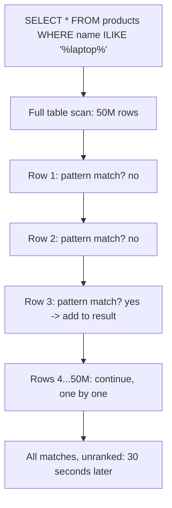
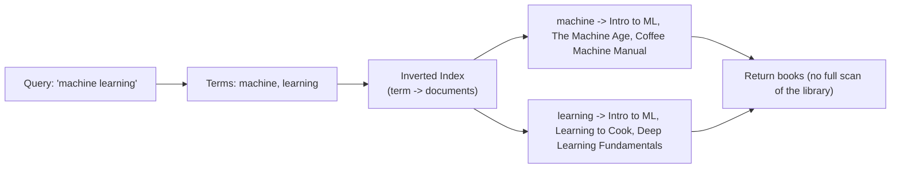
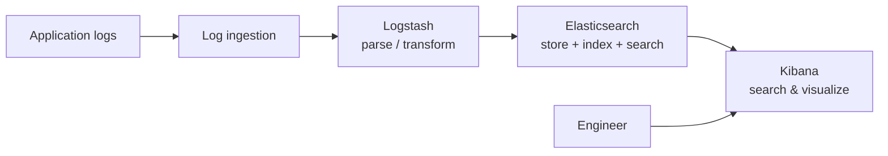
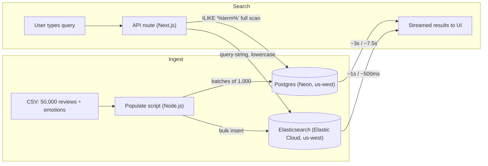

# Part 15 — Full Text Search Using Elasticsearch

> [!info] Video reference
> - **Part 15 of 29** in the playlist [[_00 - Backend from First Principles - Index]]
> - **Watch on YouTube:** [Full text search using Elasticsearch for blazingly fast search](https://www.youtube.com/watch?v=7_sovzAhRSM)
> - **Duration:** 32:07 | **Views:** 22,562 | **Published:** 2025-07-05
> - **Speaker/Channel:** Sriniously

> [!abstract] In this chapter
> We start with a 2005 e-commerce engineer whose simple `LIKE '%laptop%'` search once returned in 50 milliseconds and now — after the company grew to millions of products — takes 30 seconds. From there we rebuild search from first principles: the librarian analogy for relational databases, the **inverted index**, Apache Lucene, Elasticsearch's relevance scoring (field boosting and the **BM25** algorithm), typo-tolerant type-ahead search, the **ELK stack** for log management, and finally a live benchmark on 50,000 reviews comparing a Postgres `ILIKE` scan against an Elasticsearch index.

---

## Table of Contents

- [The 2005 Problem — Naive Search in a Relational Database](#The%202005%20Problem%20%E2%80%94%20Naive%20Search%20in%20a%20Relational%20Database)
- [The Growth Curve — 50 ms Turns into 30 Seconds](#The%20Growth%20Curve%20%E2%80%94%2050%20ms%20Turns%20into%2030%20Seconds)
- [The New Requirements — Speed, Relevance, and Typo Tolerance](#The%20New%20Requirements%20%E2%80%94%20Speed,%20Relevance,%20and%20Typo%20Tolerance)
- [The Librarian Analogy — A Relational Database's Fatal Flaw](#The%20Librarian%20Analogy%20%E2%80%94%20A%20Relational%20Database's%20Fatal%20Flaw)
- [The 2005 Information Explosion](#The%202005%20Information%20Explosion)
- [Decades of Research — Information Retrieval Since the 1960s](#Decades%20of%20Research%20%E2%80%94%20Information%20Retrieval%20Since%20the%201960s)
- [The Inverted Index — Flipping the Search Problem](#The%20Inverted%20Index%20%E2%80%94%20Flipping%20the%20Search%20Problem)
- [Apache Lucene — The Technology Under Elasticsearch](#Apache%20Lucene%20%E2%80%94%20The%20Technology%20Under%20Elasticsearch)
- [Speed and Relevance — What the Index Enables](#Speed%20and%20Relevance%20%E2%80%94%20What%20the%20Index%20Enables)
- [Relevance Scoring and the BM25 Algorithm](#Relevance%20Scoring%20and%20the%20BM25%20Algorithm)
- [The Query DSL — JSON-Based Searching](#The%20Query%20DSL%20%E2%80%94%20JSON-Based%20Searching)
- [Use Case — Typo Tolerance and Type-Ahead Search](#Use%20Case%20%E2%80%94%20Typo%20Tolerance%20and%20Type-Ahead%20Search)
- [Two Options for Building Search in the Backend](#Two%20Options%20for%20Building%20Search%20in%20the%20Backend)
- [Use Case — Log Management and the ELK Stack](#Use%20Case%20%E2%80%94%20Log%20Management%20and%20the%20ELK%20Stack)
- [The Demo — Postgres `ILIKE` vs Elasticsearch on 50,000 Reviews](#The%20Demo%20%E2%80%94%20Postgres%20`ILIKE`%20vs%20Elasticsearch%20on%2050,000%20Reviews)
- [What the Video Does Not Cover](#What%20the%20Video%20Does%20Not%20Cover)
- [Key Takeaways](#Key%20Takeaways)
- [Related Notes](#Related%20Notes)

---

## The 2005 Problem — Naive Search in a Relational Database

### [00:00] Setting the scene: 2005, an e-commerce engineer, ~5,000 products

The video opens with a story. **It is 2005.** You are a software engineer at a rapidly growing e-commerce company — the kind of growth that 2005 and the aftermath of the dot-com boom made possible. Your assignment: build an API that takes a user's input, searches through the company's products, and returns relevant results. Your catalogue at this point is around **5,000 products** — thousands, but not millions.

Life is simple. To implement the feature in a typical **relational database** setup, you write a query like this:

```sql
SELECT * FROM products
WHERE name ILIKE '%laptop%';
```

The **`%` (percentage) symbols** are wildcard characters that mean *"match any characters that come before and come after"* the keyword. So this matches any product whose *name* contains the substring `laptop` — and, extending the same pattern, you could also check the *description* column:

```sql
SELECT * FROM products
WHERE name ILIKE '%laptop%' OR description ILIKE '%laptop%';
```

If the keyword `laptop` appears anywhere in `name` or `description`, the row is returned. The customer searches for "laptop", gets a few results, and everyone moves on. The transcript spells the operator as "I like"; `ILIKE` is PostgreSQL's **case-insensitive** variant of `LIKE` ⇢ *the transcript describes it as "basically a case insensitive search", which is exactly what `ILIKE` does; plain `LIKE` is case-sensitive.*

## The Growth Curve — 50 ms Turns into 30 Seconds

### [01:20] Suddenly: millions of products, and the query that took 50 ms takes 30 seconds

Since it is 2005 and growth is everywhere, your company also grows — rapidly. Suddenly you have **millions of products**. The very straightforward `LIKE` + `%` based search in your relational database — the query that once returned results in, say, **50 milliseconds** — now takes **30 seconds**.

The consequences cascade:

- **Your customers are frustrated** — nobody waits 30 seconds for a search bar.
- **Your manager is frustrated** — everyone is asking you to optimize, and you are clueless about where to even start.
- And the requests do not stop at "make it faster". People want **more** out of the search box.

### [02:01] The new requirements: smarter, relevant, robust, fast

Your stakeholders now want three things on top of raw speed:

1. **Smarter / relevance-based searching.** When someone searches `laptop`, you should show the *most relevant* results first. Instead of showing a **laptop bag** at the top, you want to show a **MacBook Pro** first — the result that is genuinely most relevant to a search for "laptop".
2. **Typo tolerance.** Customers are in a hurry (especially during sale time). Instead of typing `laptop`, they frequently type `lapto` (a typo). You still want to return relevant `laptop` results even though the user typed `lapto` — the system should be **robust enough that typos cannot break it**.
3. **Speed.** All of the above must happen fast — we are talking about *milliseconds*, not seconds.

The transcript summarises the wish-list as: *"We want to make it faster. We want to make it relevant. And we also want to be robust enough that typos cannot break us."*

### [03:05] The birth of a category

> [!info] Why search engines exist
> "With all these requirements, this is the story of why search engines like Elasticsearch came into place because of all these requirements."

Layering these requirements — speed, relevance, typo resilience — on top of a plain relational `LIKE` scan is precisely the problem that full-text search engines were invented to solve.

---

## The Librarian Analogy — A Relational Database's Fatal Flaw

### [03:15] Your Postgres database is a librarian

To build intuition, the video asks you to think of your Postgres database (or whatever relational database you use) as **a librarian**.

- Go to this librarian and ask for the *location* of specific books, or of different categories, and the librarian **knows exactly where every book is located**. That is the "index on known fields" strength of a relational database: precise lookups by a known key are instant.
- But this librarian has **one fatal flaw**.

### [03:41] Fatal flaw #1: topic search means scanning every book

If you ask for the location of a random book — or, better, ask for *books about a topic* — the librarian cannot consult a "topics index". Instead the librarian has to **look through every single book on every single shelf in the whole library, one by one**.

Example from the video: you ask *"I am looking for books about machine learning."* Here is the librarian's process:

1. Picks up the first book — *Harry Potter and the Philosopher's Stone*. Checks: no "machine learning" in the title. Moving on.
2. Picks up *Game of Thrones*. Same check. No. Moving on.
3. Finally finds a book called *Introduction to Machine Learning* — a match, returned.
4. And crucially, the librarian **continues the process to the end**, going through every remaining book one by one, because there could be more matches.

Depending on the size of the library, this takes **a few minutes, a few hours, or even a few days** — imagine a library with **10 million or 1 billion books**. Time is problem one.


> **What this diagram shows:** A topic query forces the librarian to crawl book after book, checking each one for the keyword. Even after a match appears, the search continues to the very end of the catalogue, so total time grows with the number of books.

### [05:01] Fatal flaw #2: no concept of relevance

Even the *ordering* is useless. The librarian has **no concept of relevance**. Consider two matching books:

- Book A is actually **titled** *Introduction to Machine Learning* — highly relevant.
- Book B merely mentions the phrase "machine learning" once, **on its last page**, while the rest of the book is about something else — barely relevant.

The librarian returns both matches **in any order it wants**. It might return Book B first and Book A second, even though anyone asking for "books about machine learning" wants *Introduction to Machine Learning* first — and might not even want Book B at all, because it is pretty irrelevant to the use case.

### [06:01] Back to SQL: what `LIKE '%term%'` actually does

Mapping the librarian back onto a relational database, a query like:

```sql
SELECT * FROM products
WHERE name ILIKE '%laptop%';
```

...is **exactly how the librarian searches a huge library**. The database has to:

1. **Scan every single row** of the table.
2. **Examine every single text field**.
3. **Perform pattern matching character by character** against the `%laptop%` pattern.

It is **thorough** — it will return everything that matches. But it is **painfully slow** (there is no "laptop" index; the scan is proportional to the whole dataset). And second, the **relevance problem**: the database does not know which results are more important than others. It returns matches in essentially a **random order**. A perfectly relevant result may sit at position **1,000 or 10,000**, because the database has *no sense of what the most relevant result is*.



> **What this diagram shows:** A `LIKE '%...%'` query is a full sequential scan — every row is pattern-matched character by character and the final result set is unordered by relevance. Cost grows linearly with table size, which is why 5,000 rows answered in ~50 ms but millions of rows take ~30 s.

---

## The 2005 Information Explosion

### [07:10] Google, Amazon, LinkedIn — nobody can wait 30 seconds

Still in 2005, around the same time your fictional company grows, the **information explosion** happens. The video recalls the giants of the era:

- **Google** was processing (crawling, indexing) **billions of web pages**.
- **Amazon**, as an e-commerce company, was **cataloging millions of products**.
- **LinkedIn** was **indexing millions of profiles**.

These companies **cannot afford to wait 30 seconds** for search results — customers would simply leave the site. 30 seconds is already far too much, and by today's standards even **2 seconds of delay is considered a crazy amount of latency**. For search, the bar is **milliseconds**. Latency at that scale hits **conversion** and the **user base** directly — every lost second is lost money and lost users.

---

## Decades of Research — Information Retrieval Since the 1960s

### [08:21] Search was not a new problem

The answer to the search problem **came from decades of research** — this was not a new problem in 2005. The field is **information retrieval**, and computer scientists had been studying, since the **1960s**, how to:

- get results **fast**, and
- keep those results **relevant**.

The video calls out this research history explicitly as the soil in which Elasti­csearch grew.

### [08:51] The key idea: invert the problem

The revolution came from a single decisive reframing — instead of **searching through the documents to find the terms**, what if we flipped it and used **the terms to find the documents**?

> What if, instead of searching through the books' titles and contents to find "machine learning", we look at it the other way?

That pivot is the birth of the key invention that changed text-based search forever: the **inverted index**.

---

## The Inverted Index — Flipping the Search Problem

### [09:27] The concept is simple (the implementation is not)

Before diving in, the video sets expectations: the *concept* of the inverted index is simple, although the *implementation* involves a lot more math and machinery. For a high-level understanding, it reduces to one sentence:

> We have the terms, and through the terms we find the content.

### [09:42] Building the index: when the books arrive, index their words

Return to the library example. The radical idea: **while storing books on the shelf, on the very first time the books arrive**, we take **all the words** in each book and build an index such that — **for a particular word** — we can immediately find out:

- **which** books use that word, and
- **where exactly** within each book it is used.

Concretely (this is the video's worked example, with simplified page counts — in reality the words would appear *hundreds* of times, but the point holds):

| Term | Postings list (book → where it appears) |
|------|------------------------------------------|
| `machine` | *Introduction to Machine Learning* → pages 1, 15, 23 · *The Machine Age* → pages 5, 89 · *Coffee Machine Manual* → page 1 |
| `learning` | *Introduction to Machine Learning* → pages 1, 16, 24 (3 places) · *Learning to Cook* → 2 places · *Deep Learning Fundamentals* → 3 places |

So the **terms** map directly to the **postings list** — the set of documents (books) containing that term plus the positions where it occurs.

### [11:39] Why "inverted"?

The name comes from inverting the search direction:

- **Forward** search (the librarian, relational `LIKE`): go through the *content* to find the *terms*.
- **Inverted** search: we hold the *terms*, and through the terms we find the *content*.

> "We just inverted the search. That's why it's called the inverted index."

### [12:49] The librarian now just looks stuff up

With the inverted index built, the *same* "machine learning" query becomes two dictionary lookups instead of a billion-book crawl: *machine* → these three books; *learning* → these three books. (The video notes that when it says "librarian" you can mentally substitute "database" — the analogy works for both.)



> **What this diagram shows:** The query is broken into terms, each term is resolved through the inverted index (a dictionary from term → posting list), and the candidate books fall out directly. No book is ever opened during the search — work happened once, up front, when the books were ingested.

The table above and *every* term in this video's worked example use position info (page numbers). Positions matter: they are what let full-text engines support phrase queries and proximity ranking later on ⇢ *the video only hints at "where exactly it is used" — position-level detail is inferred, since the video's worked example stores per-page positions.*

---

## Apache Lucene — The Technology Under Elasticsearch

### [11:53] Elasticsearch is built on a much older idea: Lucene

The transcript then zooms out so that the invert index gets some credit. Elasticsearch:

- is **not a completely new invention**;
- makes use of a technology called **Apache Lucene** (the transcript's auto-caption mangles it a few ways — "Apache Lucine", "Lucion" — everywhere meaning **Lucene**);
- and Lucene is "the key inverted-index-based technology" that Elasticsearch and many other tools rely on.

Elasticsearch is also **not the only full-text search tool**. The video is explicit that:

- modern relational databases — notably **Postgres** — also have support for **full-text search** today;
- most full-text search tools build on top of the same underlying Lucene idea.

So the mental model is: **inverted index (core idea) → Lucene (canonical implementation) → Elasticsearch (a popular distributed tool built on Lucene, but far from the only one).**

---

## Speed and Relevance — What the Index Enables

### [13:13] The index gives speed ...

With the inverted index, the librarian is *faster* — the query is resolved with index lookups, not scans.

### [13:45] ... and it also gives relevance

There is a second, arguably bigger, advantage: **relevance**. Look back at the worked example — for the term `machine`:

- *Introduction to Machine Learning* contains it **3 times** (the video says in reality it would be used in hundreds of places, but three is used for the example);
- *The Machine Age* contains it **2 times**.

That raw *count difference* is the seed of ranking: more occurrences → more relevant. Tools like Elasticsearch expose a whole **relevance scoring** system on top of this, which we cover at [`[16:12]`](#Relevance%20Scoring%20and%20the%20BM25%20Algorithm).

### [13:56] How much of the internals do you actually need?

The video pauses for a pragmatic note. Understanding the underlying architecture is **good** — but:

- if you just want to **use the tool and build a service**, you can easily refer to the docs, take the examples, and use it;
- the key thing you must know is the **decision**: *"if you have a use case like this, go with Elasticsearch or full-text search from Postgres — whatever your typical tech stack is."*
- you do **not** need to fully understand every detail of how the index or the scoring works — that knowledge is "pretty complicated", and unless you are *writing a library about Elasticsearch* or *creating an alternative to Elasticsearch*, it will not help you much. Best practices + knowing when to reach for the tool is enough.

---

## Relevance Scoring and the BM25 Algorithm

### [14:42] Relevance scoring in practice: two boosters from the example

Elasticsearch tools have a feature called **relevance scoring**. The video walks through how ranking emerges from the worked example:

1. **Being in the title counts.** For *Introduction to Machine Learning*, the term `machine` is present on **page 1** — effectively the **title** of the book. The very fact that a term appears in the title gives a **significant boost** to its relevance score. That alone would make this the most relevant book for the query.
2. **Frequency counts.** The term is present **three times** throughout the book. That is *another* significant relevance booster.

Because of those two things (title presence + higher frequency), *Introduction to Machine Learning* comes out **first**. Ranking the other two:

- *The Machine Age* — term in the **title** (one relevance booster) but **not as frequently used** (weaker second booster) → **second place**.
- *Coffee Machine Manual* — term in the **title** but used **very infrequently** → **third place**.

The same logic applies term-by-term for `learning` as well. What matters is the pattern: **title beats body, frequency beats rarity → a score, → a ranked order.**

### [15:51] The promised outcome

> "Using a tool like Elasticsearch can make the experience of search **fast** and also give you this additional advantage of **relevance-based results**."

This is the distinction the video draws sharply: *"We just don't want any result that matches your query. You want the most meaningful result."* A `LIKE` scan gives you *any* match; Elasticsearch gives you the *meaningful, ordered* ones.

### [16:12] BM25 — the algorithm behind the ranking

Elasticsearch ranks documents with an algorithm called **BM25** (BM stands for "Best Matching"). The transcript:

- warns that there is **a lot of theory** behind it;
- recommends treating BM25 as **a tool**: *"if I have a use case like this, I have to go with Elasticsearch — then just refer to the docs, implement the feature and move on"* rather than spending too much time on the theory;
- but adds that **if you are curious, the Elasticsearch docs are a very good place** to learn more.

### [16:50] The four scoring factors BM25 uses

The video names the parameters BM25 uses to sort results:

| Factor | What it checks | Scope |
|--------|----------------|-------|
| **Term frequency** | How often the term (e.g. `machine`) appears *in a single document* | One document, one term |
| **Document frequency** | How common the term is *across all documents* (rare terms are more informative) | Across the whole index |
| **Document length** | How long a given document is — a short document vs. a long, book-like document | Per document |
| **Field boosting** | Whether the term appears in the *title* vs the *description* vs the *content* | Per field |

Callouts worth reproducing:

- **Term frequency vs document frequency.** "This is in a single document and this is across all documents." The first says *how often a particular term appears in a document*; the second says *how common the term is across all documents*.
- **Document length** is simply *how long a particular document is* — short post vs long book.
- **Field boosting** is the one practitioners use a lot: a term in the **title** is more relevant than in the **description**, which is more relevant than in the **content**. Importantly it is **not fixed**: *"while making a search query we can define our own field boosting criteria — we can say that if the term appears in the content, that should be more relevant. So we can alter these things. It's not fixed. It's upon us."*

> [!note] TF-IDF as background
> The transcript only names **BM25**. For context ⇢ *inferred*: BM25 is the modern descendant of **TF-IDF** (Term Frequency × Inverse Document Frequency); term frequency, inverse document frequency, and length normalization are exactly the ingredients BM25 refines. Think of the video's four factors as the practical face of that lineage.

---

## The Query DSL — JSON-Based Searching

### [18:52] The Elasticsearch Query DSL

To drive all of this, Elasticsearch exposes a **Query DSL** (Domain-Specific Language) — a **JSON-based query language** that offers a lot of features and a lot of parameters for different kinds of search, letting you extract different kinds of results (basic text matching, filtered searches, phrase matching, boosted field searches, etc.). The video does **not** show a full DSL query in this episode ⇢ *inferred*, so a representative shape looks like:

```json
{
  "query": {
    "match": {
      "review": {
        "query": "laptop",
        "boost": 1.2
      }
    }
  }
}
```

The exact query-syntax details are out of scope for this chapter — the takeaway the video wants is: **there is a rich JSON query language for building different search experiences, and field boosting can be tuned inside it.**

---

## Use Case — Typo Tolerance and Type-Ahead Search

### [19:08] Building a Google-style search box

The first concrete use case is **typo tolerance** and **type-ahead** search. The video uses Google as an example:

- We are not sure whether Google uses Elasticsearch itself or something **proprietary built on top of Apache Lucene** — but it is *similar technology*, and you can build an equivalent interface.
- Type-ahead ("type ahead" in the captions) is what you see on Amazon: you type a few characters and get live suggestions/results immediately.
- Demo in the video: the presenter starts typing `what is` and a long list of scored results appears instantly, with the ordering dependent on Google's own ranking parameters.

### [19:55] The intentional typo: "treading" → "trending"

Then comes the demo inside the demo. The intended query is *"what is trending today"*, but the presenter deliberately types:

```
what is treading today
```

Despite the typo, the full-text-search capabilities derive — **from context** — that there is a typo and that *"what is **trending** today"* is the most likely intended query. The system returns the correct, relevant results anyway.

> "This is a major advantage of using a technology like Elasticsearch, a full-text-search-based technology, for these kinds of experiences — like typos and all."

---

## Two Options for Building Search in the Backend

### [20:53] Postgres full-text search, or Elasticsearch?

If you are building a search-type feature in your backend application, the video says you have **two options**:

1. **Postgres** — as a modern database it already offers a **full-text search** feature, so you can stay in your existing relational stack.
2. **Elasticsearch** — if your company already runs Elasticsearch (see the ELK-stack use case next), using it for full-text search too makes a lot of sense.

The decision framing (repeated at the end of the episode): for **any kind of search or type-ahead** use case, go with a **full-text search** tool — Postgres full-text search or the Elasticsearch family — instead of hand-rolling `LIKE '%...%'`.

---

## Use Case — Log Management and the ELK Stack

### [21:22] Elasticsearch is famous beyond product search

Elasticsearch is **not just** for type-ahead and full-text search — it is a very famous tool in **log management**. There is a famous stack called the **ELK stack**:

- **E** — **Elasticsearch** (fast searching + aggregation)
- **L** — **Logstash** (the transcript auto-captions say "Lock stacks" ⇢ *inferred Logstash, matching the canonical ELK stack*)
- **K** — **Kibana** (visualization)

The three technologies together form a very famous stack for **managing logs**. Why does Elasticsearch fit? Because it is very fast at searching things — and searching through **logs**, deriving **statistics** from them, and **visualizing** data is exactly the workflow log management needs.

> [!tip] What matters for the backend engineer
> *"If your company already has Elasticsearch as a part of the ELK stack for log management, then going with Elasticsearch for your full-text-search requirements also makes a lot of sense, instead of going with Postgres."* — reuse the infrastructure you already operate.



> **What this diagram shows:** Logs flow from applications through Logstash into Elasticsearch, where they are indexed (via the inverted index) and can be searched instantly, and Kibana renders them into dashboards. The same Elasticsearch used for logs can double as your full-text search engine — the video's cleanest argument for reusing existing infrastructure. Note that the modern ecosystem also includes the **Beats** shippers ⇢ *inferred (not named in the transcript)*.

---

## The Demo — Postgres `ILIKE` vs Elasticsearch on 50,000 Reviews

### [22:05] A fair head-to-head benchmark

The video then shows a working demo comparing a **traditional database search** against an **Elasticsearch-based search**. The project is a **Next.js** app — chosen only because LLMs are very good at generating such prototype applications; there is no engineering reason tied to Next.js.

The UI executes the same query against **both** engines and shows the timing side by side. To keep it **fair**:

- the Postgres side runs on a **Neon** instance — a serverless, cloud-based Postgres;
- the Elasticsearch side runs on **Elastic Cloud**;
- **both instances are located in the `us-west` region**, so **latency caused by distance is not a factor** in the benchmark.

### [23:09] The data and the schema

A table called `reviews` is created in the Neon Postgres database with three fields:

| Field | Type | Meaning |
|-------|------|---------|
| `id` | (auto) | Row identifier |
| `review` | `text` | The review text itself |
| `sentiment` | `text` | `positive` or `negative` |

The source data is a **CSV file with around 50,000 entries**, two columns: **review** and **sentiment**.

### [23:39] The populate script, part 1 — filling Postgres

The **populate script** (a Node.js script) does the following, step by step:

1. Reads `DATABASE_URL`, the **Elasticsearch address**, and the **Elasticsearch API key** from the environment; **throws an error if any is missing**.
2. Initializes the **Neon client** (database) and the **Elasticsearch client**.
3. Reads the CSV with `readFileSync` into a variable.
4. **Postgres first**: a *migration* step creates the `reviews` table *if it does not already exist* (it was already run once, so this branch is skipped); then it **resets the ID field** so the run starts fresh; then it **filters** the records to keep only those with *both* `review` and `sentiment` present.
5. Inserts the valid records **in batches of 1,000** — a normal `INSERT INTO reviews(review, sentiment) VALUES (...)` executed per batch — because **inserting all 50,000 at once has a limitation in the Neon instance**.

### [25:39] The populate script, part 2 — filling Elasticsearch

6. **Elasticsearch next**: checks whether an index called `reviews` exists.
   - If it **exists**, it is **deleted** (the run wants a fresh start).
   - If it **does not exist**, an index is **created**, and inside the index **the fields are mapped**:

```json
{
  "mappings": {
    "properties": {
      "review":    { "type": "text" },
      "sentiment": { "type": "keyword" }
    }
  }
}
```

The video explains the two field types:

- **`text`** — *"we don't want to do any kind of discrimination around the different words in the text"* — the field is **analyzed**: words are split (tokenized) and broken apart so full-text matching works on individual words.
- **`keyword`** — *"we want to exactly match that particular word"* — the field is a single, exact-match string (perfect for `positive`/`negative`).

7. Validates records again by the presence of both fields, then does a **bulk insert of all ~50,000 records** into Elasticsearch.

The script output confirms the load: **"50,000 documents inserted to Elasticsearch"**. Verification in the cloud consoles:

- Elastic Cloud shows **50,000 documents** in the `reviews` index.
- The Neon SQL editor runs `SELECT count(*) FROM reviews` → **50,000 rows**.

> [!info] Vocabulary: document vs index
> When the video says "50,000 documents", it is using Elasticsearch vocabulary: *"all a single entity is called a document — it's a JSON document, kind of like MongoDB."* A document is roughly a row; an **index** is roughly a table plus its inverted-index structures and mapping.

### [27:04] The API route — streaming so the faster engine isn't blocked

The interesting part is the **API route** (not the UI, which is "pretty generic"). The endpoint the UI calls when a user types a query and hits Enter does this:

1. Takes the **search term** from the request JSON; if something is wrong with it → throws a **bad-request** error.
2. Starts a **stream** for the response. Why a stream? The timing of the database result and the Elasticsearch result **can be different**, and the demo *does not want the faster engine's result delayed by the slower one*. As each result becomes available, it is **streamed to the front end** immediately — so you can see which engine is faster and by how much, live.

**Postgres side:**

```sql
SELECT id, review, sentiment FROM reviews
WHERE review ILIKE '%<search_term>%';
```

- Uses **`ILIKE`** for a **case-insensitive** search to cover more breadth.
- Uses **`%`** before and after the term: it does not matter what characters come before or after, as long as the term is present.
- A timer measures the query duration; the result is streamed to the front end as soon as it is available.

**Elasticsearch side:**

- Searches the **`reviews`** index with a **query-string** search.
- The search term is **converted to lowercase** to cover as much breadth as possible (mirroring `ILIKE`).
- Any characters before/after are matched; some **default fields are added to enhance the search**.
- Executes, and streams the response as it becomes available.

The front end simply **reads the streamed responses as they arrive** — nothing special on that side.

### [29:38] The results

**Query 1 — `laptop`:**

| Engine | Time |
|--------|------|
| Elasticsearch | ~**1 second** |
| Postgres | ~**3 seconds** (caption says "almost 4 seconds, but 3 seconds") |

**Query 2 — `something`:**

| Engine | Time | Result count |
|--------|------|--------------|
| Elasticsearch | **500 ms** | ~**8,000 results** |
| Postgres | slower | same ~8,000 results |

To keep the benchmark fair, the search criteria are kept identical on both sides: **lowercasing** + **matching any characters before and after**. This demo is purely about **speed**, not about ranking differences.

**Re-run of `something`** (to show it is not a fluke):

- Elasticsearch: still **500 ms**.
- Postgres: **still running** — the database results eventually take **~7.5 seconds**, despite returning exactly the same number of results.

The point lands cleanly: *"even though the number of results is the same, the time it takes is significantly larger in a relational database with the `ILIKE`-based syntax."*



> **What this diagram shows:** The same 50,000-review dataset is loaded into both a Postgres table and an Elasticsearch index by one populate script. At query time the API fans the search term out to both engines and streams each engine's ranked/unranked results back as they finish — Elasticsearch's inverted-index lookup consistently beats Postgres's sequential `ILIKE` scan (500 ms vs up to ~7.5 s in the video's run).

---

## When to Use What — Full-Text Search vs Relational Databases

### [30:57] The decision rule from the video

> "Where you have a use case of **any kind of search or type-ahead** — things like that — you go ahead with **full-text search**. You can go with Postgres full-text search or tools like Elasticsearch."

The video is explicit that full-text search is the right category for search-type features, and that the concrete tool is a stack decision (Postgres FTS if you live in Postgres, Elasticsearch if your company already operates it, e.g. via ELK).

### [31:13] Elasticsearch in the backend engineer's arsenal

Two messages close the episode:

1. **Elasticsearch belongs in your arsenal — but is not worth mastering.** "You don't have to master it or anything." You can get away with **copy-pasting snippets from any LLM or any docs** for most use cases; the examples in the docs and snippets are "pretty much more than enough to cover most of the search-based use cases." If you want to **optimize**, you read more.
2. **Database knowledge is the real foundational skill.** *"The knowledge of Elasticsearch is not as important as the knowledge of databases."* Databases are something you absolutely must master: how to work with them, how to **optimize** them, how to **understand indexes** — because database work "involves almost 99% of your codebase as a backend engineer."

### [32:02] Close

"That's pretty much all about full text search, and Elasticsearch."

---

## What the Video Does Not Cover

For completeness, these Elasticsearch topics are common in production but **not covered** in this video ⇢ *all inferred from general Elasticsearch knowledge, not from the transcript*:

- **Nodes, clusters, shards, and replicas** — how an index is split across machines and kept highly available.
- **Analyzers in depth** — tokenizers, stop words, and language-specific **stemming/lemmatization** (the video only shows the idea of splitting a `text` field into words and lowercasing search terms).
- **TF-IDF by name** — the video names BM25 only.
- **Exact query-DSL examples** — `match`, `match_phrase`, `bool`, `term` are not shown in the transcript.

---

## Key Takeaways

- A relational `LIKE '%laptop%'` query is a **sequential, character-by-character scan** with **no relevance ordering** — it was fine at 5,000 products (~50 ms) and breaks at millions of products (~30 s).
- Relational databases are like a librarian who **knows exact locations but cannot search by topic**: thorough but painfully slow, and with **no concept of relevance**.
- The key idea of full-text search is the **inverted index**: index every word up front, then map **term → list of documents (+ positions)** instead of scanning documents for terms.
- Elasticsearch builds on **Apache Lucene**, the canonical inverted-index library — and is not the only option (Postgres has full-text search too).
- An inverted index gives **two** wins: speed (index lookups, not scans) and **relevance scoring**.
- Elasticsearch ranks results with the **BM25** algorithm using: **term frequency**, **document frequency**, **document length**, and **field boosting** (title > description > content, but you can override it).
- Use cases for full-text search: **type-ahead / typo-tolerant product search** and **log management via the ELK stack** (Elasticsearch + Logstash + Kibana). If your company already runs ELK, reuse that Elasticsearch.
- The video's own demo on 50,000 reviews: Elasticsearch **~500 ms–1 s** vs Postgres `ILIKE` **~3–7.5 s** for the same dataset and the same result count.
- Decision rule: **any search or type-ahead feature → full-text search** (Postgres FTS or Elasticsearch). Knowledge of **databases is a must-master**; Elasticsearch is a copy-paste-away tool in your arsenal.

---

## Related Notes

- [[_00 - Backend from First Principles - Index]]
- Prev: [[14 - Task Queues and Background Jobs]]
- Next: [[16 - Error Handling and Building Fault Tolerant Systems]]
- See also: [[12 - Mastering Databases with Postgres]] (relational databases, indexing, transactions), [[13 - Caching, The Secret Behind It All]] (why index/data lookups are the caching story's cousin)

---

> [!note] Source fidelity
> This note is written from the video transcript (video_id `7_sovzAhRSM`, timestamped transcript). Where the auto-generated captions were unclear, the meaning was inferred and marked with ⇢ *inferred* (e.g., "Apache Lucine/Lucion" → **Lucene**; "Lock stacks" → **Logstash** in the ELK stack; "I like" → Postgres **`ILIKE`**; the JSON shape of the Query DSL and its `match`/`boost` example, which the video never literally prints). All timestamps, demo timings, and the worked book/pages example in the inverted-index table are reproduced directly from what the video presents.