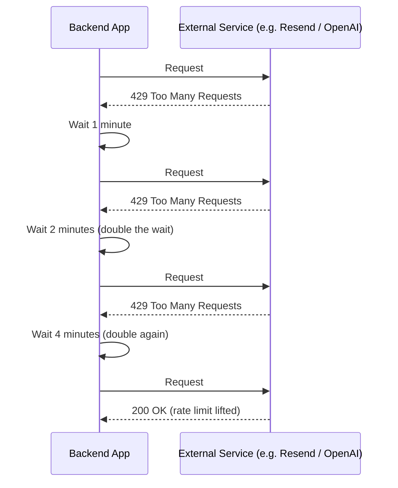
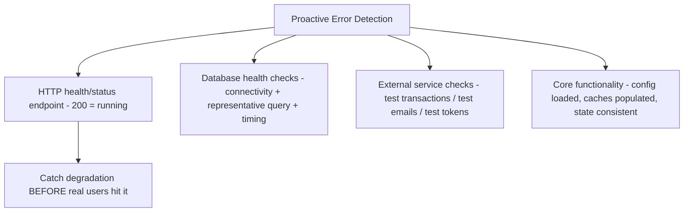
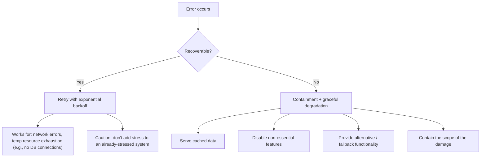
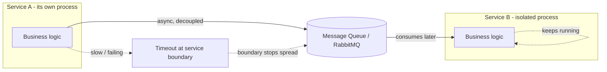
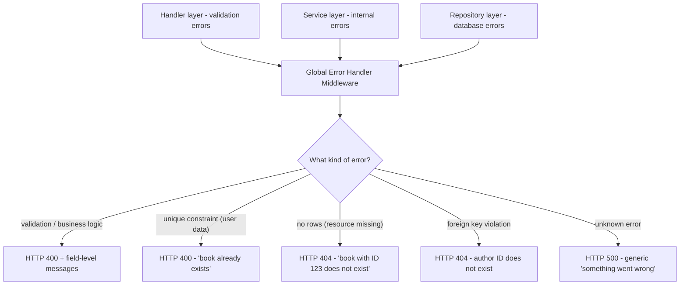

# Part 16 — Error Handling and Building Fault Tolerant Systems

> [!info] Video reference
> - **Part 16 of 29** in the playlist [[_00 - Backend from First Principles - Index]]
> - **Watch on YouTube:** [16. Error Handling and Building Fault Tolerant Systems](https://www.youtube.com/watch?v=8NaM_9aKS24)
> - **Duration:** 69:25 | **Views:** 21,694 | **Published:** 2025-07-09
> - **Speaker/Channel:** Sriniously

> [!abstract] In this chapter
> This chapter is deliberately not about tools, frameworks, or code snippets — it is a *mindset*. It opens with the thesis that errors are a normal, inevitable part of building software, then walks through the full taxonomy of backend errors: **logic errors, database errors, external service errors, input validation errors, and configuration errors**. From there we move to prevention — the best error handling starts *before* the error happens — covering health checks, proactive error detection, and monitoring/observability. Then come the operating philosophies: how to react immediately to **recoverable vs non-recoverable** errors, automatic vs manual recovery, **propagation control**, and **error boundaries**. The core of the chapter is the **global error-handling middleware** ("the final safety net"), worked through on a book-management API where validation errors, unique-constraint violations, `no rows` errors, and foreign-key violations all bubble up to one handler. It closes on the security side of errors: what error messages you expose, what you log, and how even authentication errors can leak user data.

---

## Table of Contents

- [The Fault-Tolerant Mindset — Errors Are Inevitable](#The-Fault-Tolerant-Mindset--Errors-Are-Inevitable)
- [The Error Taxonomy — Five Categories of Backend Errors](#The-Error-Taxonomy--Five-Categories-of-Backend-Errors)
- [Logic Errors — the Sneaky Ones](#Logic-Errors--the-Sneaky-Ones)
- [Database Errors — Connection, Constraints, Queries, Deadlocks](#Database-Errors--Connection,-Constraints,-Queries,-Deadlocks)
- [External Service Errors — Points of Failure You Don't Control](#External-Service-Errors--Points-of-Failure-You-Don't-Control)
- [Input Validation Errors — the Easiest to Handle](#Input-Validation-Errors--the-Easiest-to-Handle)
- [Configuration Errors — Fail Fast at Startup](#Configuration-Errors--Fail-Fast-at-Startup)
- [Prevention — Finding Errors Before They Spread](#Prevention--Finding-Errors-Before-They-Spread)
- [Proactive Error Detection — Health Checks](#Proactive-Error-Detection--Health-Checks)
- [Monitoring and Observability — Seeing Errors Quickly](#Monitoring-and-Observability--Seeing-Errors-Quickly)
- [Philosophy 1 — Immediate Error Response: Recoverable vs Non-Recoverable](#Philosophy-1--Immediate-Error-Response:-Recoverable-vs-Non-Recoverable)
- [Philosophy 2 — Error Recovery Strategies: Automatic vs Manual](#Philosophy-2--Error-Recovery-Strategies:-Automatic-vs-Manual)
- [Philosophy 3 — Propagation Control and Error Boundaries](#Philosophy-3--Propagation-Control-and-Error-Boundaries)
- [The Final Safety Net — Global Error Handling](#The-Final-Safety-Net--Global-Error-Handling)
- [The Global Error Handler in Action — A Book-Management API](#The-Global-Error-Handler-in-Action--A-Book-Management-API)
- [Two Major Advantages of a Centralized Error Handler](#Two-Major-Advantages-of-a-Centralized-Error-Handler)
- [The Security of Errors — Messages, Authentication, and Logs](#The-Security-of-Errors--Messages,-Authentication,-and-Logs)
- [Key Takeaways](#Key-Takeaways)
- [Related Notes](#Related-Notes)

---

## The Fault-Tolerant Mindset — Errors Are Inevitable

### [00:00] Errors are a normal part of building applications

The video opens with a simple reality check: **in the world of backend development, errors are not just problems to solve — they are a normal part of building applications.** Every developer needs to understand that errors *will* happen, and the key is being ready for them: ready to **detect** them and ready to **fix** them.

The transcript states this as a series of inevitabilities every backend engineer must internalise:

- **Your database queries will sometimes fail.**
- **Your external APIs will sometimes time out.**
- **Your users will sometimes send bad data**, which will break your APIs if you are not ready for it — if you are not expecting it.
- **Your business logic will hit unexpected edge cases sometimes.**

So the question is never *whether* errors will happen, but **how you will handle them when they actually do**.

### [00:56] No tools, no frameworks — this is a mindset

The presenter is explicit about the scope: *"In this video there are no tools that I want to talk about. There are no frameworks, there are no examples, code snippets, nothing. It is a mindset."*

Why? Because when you are a backend engineer, you are responsible for:

- **executing your core business logic,**
- making sure **every single transaction** and **every single user activity goes seamlessly**.

To carry that responsibility you need a particular kind of thinking — a **fault tolerant mindset** — so that you are "prepared for the worst and you know how worse it can get." The video then surveys which things to "keep your eyes on", which tips exist for *detecting* errors, for *preventing* them, and what best practices people actually implement — across startups, big enterprises, and open-source repositories alike.

> **A note on how to read this chapter:** because the chapter is one continuous mindset argument rather than a tool demo, the sections below follow the video's own order: (1) the types of errors, (2) prevention, (3) monitoring, (4) the philosophies of response/recovery/propagation, (5) the global error handler, and (6) the security of errors.

---

## The Error Taxonomy — Five Categories of Backend Errors

### [01:54] What kinds of errors will you meet as a backend engineer?

The next ~20 minutes classify the errors a backend engineer "might encounter in your day-to-day life." The video organises everything into a five-part taxonomy:

```mermaid
flowchart TD
    E[Errors in a Backend] --> B[Logic Errors]
    E --> D[Database Errors]
    E --> X[External Service Errors]
    E --> V[Input Validation Errors]
    E --> C[Configuration Errors]
    B --> B1[App keeps running, but produces WRONG results]
    D --> D1[Connection errors]
    D --> D2[Constraint violations (unique, foreign key)]
    D --> D3[Query errors + deadlocks]
    X --> X1[Network failures - timeouts, DNS, partitions]
    X --> X2[Authentication errors - bad credentials, expired tokens]
    X --> X3[Rate limiting - HTTP 429]
    X --> X4[Service outages]
    V --> V1[Format / range / required-field rules: HTTP 400]
    C --> C1[Missing or corrupt config: fails to start or fails at runtime]
```

> **What this diagram shows:** All the error families a backend can hit are grouped by their *root cause*. Logic errors come from mistakes in the code itself; database errors come from the database layer (connectivity, constraints, malformed queries, deadlocks); external service errors come from dependencies we don't control (network, auth, rate limits, outages); validation errors come from users' bad input; configuration errors come from deployment/setup mistakes. Each family has its own dominant symptom, which the rest of the chapter explains.

---

## Logic Errors — the Sneaky Ones

### [02:00] The most common — and most dangerous — type

The first type the video names is **logic errors**, described as "the sneaky ones," not always easy to detect or to fix. In the presenter's experience they are "probably the most dangerous type because they don't crash your application as such but they just make it do the wrong thing."

The defining signature of a logic error:

- Your code **runs fine** — no crash.
- But the **results are incorrect** — the output is "unexpected."

**The e-commerce example.** You are a backend engineer at an e-commerce-as-a-service application. The store "accidentally applies a discount twice and that gives customers negative shipping costs." Crucially, *the app does not crash in this scenario*. But your platform is **losing money on every single order** because of this one logic issue. And "these errors can go unnoticed for weeks and even months while quietly causing problems" — if you are not monitoring them, and if your users are not reporting them, your platform "just faces more and more loss every single week."

### [03:30] Why do logic errors happen?

The video lists the common scenarios that produce logic errors:

1. **Misunderstanding requirements.** In a typical sprint cycle you have one-on-one discussions with clients or product managers. Some points come across confusing; you note down requirements that were not the intended ones; you implement them; they go "straight to production"; and "with lack of testing" they reach users and start causing problems.
2. **Implementing algorithms incorrectly.** Complex discount algorithms depend on user behavior and past purchase history, issuing different discount codes and discount workflows. One slight miscalculation inside the algorithm causes discount-related losses across the platform.
3. **Not thinking about edge cases.** You did not expect a particular user activity — a particular user behavior in a payment workflow or a discount-based workflow — and that caused an issue.

### [05:12] Why logic errors are especially dangerous

In domains that involve **payments, money, or security**, logic errors can **corrupt data** and **produce wrong business results over time without getting detected** — precisely because nothing crashes and nothing screams for attention. That combination (wrong + silent + persistent) is what makes them the most dangerous family.

## Database Errors — Connection, Constraints, Queries, Deadlocks

### [05:29] The second type: your database breaks and the whole system follows

The second type is **database errors**, and the video stresses they can "bring your entire system down since most backend apps rely heavily on their database." The family ranges "from a simple connection problem to complex issues like deadlocks and transaction related issues." The video splits database errors into several sub-families.

### [05:46] Connection errors — the app can't talk to the database at all

Connection errors happen when **your app cannot talk to your database**. The symptom chain is immediate and dramatic: your backend throws a couple of **500 errors** and your frontend "just shows an empty screen everywhere."

Common root causes given in the video:

- **The network is down.**
- **The database server is overloaded.**
- **You have run out of connection pools.**

**What is a connection pool?** The video explains the concept: backends use **connection pools** so that the backend can hold a couple of open TCP connections to the database server, so that it "does not have to do the whole process of TCP handshake" every time a new request comes in. Database pooling is "kind of an optimization to prevent TCP connection based setup costs." But in a pooling-based setup, exhausting the pool is itself an error condition.

The consequence of any connection-level failure is total: *"your app basically cannot really function because your back end needs to interact with the source of the data to send something to the front end, and the front end needs something to show."* If the database is down, the whole platform cannot function properly.

### [07:05] Constraint violations — breaking the database's rules

Constraint violations are less apparent but very common. They happen when you try to perform an operation that **breaks the database rules**. Two concrete examples from the video:

**Unique constraint violation.** You try to create a user with an email that already exists. The database throws a **unique constraint error**. If you are not properly handling that error and not sending a properly formatted message to your frontend, the error "might bubble up to your main process and it might throw a 500 error to your frontend" — a good user-experience outcome turns into a meaningless 500.

**Foreign key violation.** You have two tables, `customers` and `orders`. The `orders` table has a field `customer_id` that is a **foreign key** to the `customers` table, and it is not nullable. You try to insert a new record into `orders` with a `customer_id` that does not exist in the `customers` table. Because the column references the `customers` table, the database throws an error when it cannot find an associated entry.

> **Where does the fix belong?** The video points at the **validation layer**: the reason for constraint violations "usually lies in your validation layer." If you are not properly handling all the edge cases "both in your front end and your back end," constraint-violation errors occur. Making the validation layer stronger prevents them. *But* some constraint violations — like unique key errors — "cannot be avoided" by validation at all: *"Only the database knows whether a new email is unique or not."* For those, you must instead focus on **error formatting**: how to send a user-friendly message ("try a different email, this email already exists") to the frontend so the user gets a proper message rather than a 500.

### [09:38] Query errors — malformed SQL and typos

Query errors happen when **your SQL is malformed**. For example:

- You try to access a table that does not exist because you made a **typo** in the query. The correct `SELECT * FROM customers;` becomes a typo'd version and the database reports "this table that you are trying to query does not really exist."
- Queries can be **too complex and time out**.
- **Deadlocks** are another reason.

### [10:21] Deadlocks — the circular-dependency traps

Deadlocks are "particularly tricky" and "occur when multiple database operations are waiting for each other and they create kind of a circular dependency." That circular wait is the essence of a **deadlock** — two (or more) operations each hold something the other needs, so nobody can finish. The video flags deadlocks as something you actively "have to be worry about."

---

## External Service Errors — Points of Failure You Don't Control

### [10:42] Every external dependency is a point of failure

Most modern SaaS applications "depend on a lot of external services." The video enumerates typical ones:

- **Payment processors.**
- **Email providers** (e.g., Resend).
- **Cloud/object storage** like **S3** or ⇢ *the "radius" mentioned in the captions is Redis, a cache/storage dependency covered in [[13 - Caching, The Secret Behind It All]]*.
- **Authentication providers** like ⇢ *"oz0ero" in the auto-captions is Auth0* and **Clerk**.

The key framing: **"each one of these external dependencies is a point of failure that you don't really have any control over — and that is a big problem."** You cannot avoid them by abandoning external services — building all those complex systems from scratch, which people spent years of effort on, "is not really something that is practical." So you "have to expect that all these external services might fail" and prepare: *"these are the things that we are going to do to make it up for our users."*

Why do external services fail? The video gives four reasons.

### [11:55] Reason 1 — The network itself

Your backend connects to external services "either through HTTP or through TCP or through websocket" — but the backbone, the medium, is **the network, the internet** — and "the internet is not really perfect." You will have to deal with:

- **Connection timeouts**
- **DNS failures**
- **Network partitions** (affected by your routing, etc.)

You "need to expect this and you need to plan for them."

### [12:43] Reason 2 — Authentication errors

Even when you use an external provider "something like Clerk or something like Auth0" for authentication, security is not automatic — "just because you're using an external service for your authentication is not secure enough in itself, because you are using them as an integration, you still have your own backend, they are not standalone." Authentication errors happen when the external services **reject requests** due to:

- **bad credentials** (wrong username/password, wrong email),
- **expired tokens**,
- **insufficient permissions**.

The video adds a security aside here: *your own backend* can still "cause security issues... like you might expose sensitive user information in your logs." That becomes a full topic at the end of the chapter (see [The Security of Errors](#The-Security-of-Errors--Messages,-Authentication,-and-Logs)).

### [13:36] Reason 3 — Rate limiting (HTTP 429 Too Many Requests)

When you integrate an AI feature using an OpenAI key, or use something like **Resend** for emails, you are a business user of those services — and "they pretty much all of them have this functionality called **rate limiting**." Rate limiting exists so that users cannot abuse the service: it prevents "malicious users who send abnormal amount of request in a particular time frame."

If your platform — because of some user activity, or let's say because of some **logic error** — ends up hitting the external API an abnormal number of times, the provider's rate-limiting algorithm triggers, blocks you, and returns **429** — "too many requests." The video's takeaway: "in these kinds of scenarios you have to expect them from beforehand and you have to be ready for them." Being ready means implementing strategies — first among them **exponential backoff**.

### [15:28] The strategy: exponential backoff

The video defines **exponential backoff** — spelled "exponential backup" in the captions ⇢ *the intended term is "exponential backoff"* — as the common strategy for rate-limiting errors:

> "We have a condition in our error handling logic that if we start getting 429, then wait for a minute, wait for 2 minutes, then try again. If you still get 429, then wait for double that amount of time. If we previously waited for 2 minutes, now we'll wait for 4 minutes and we'll try again — until we start getting successful responses we'll keep doing this. That's why it's called an exponential backup strategy."



> **What this diagram shows:** The backoff sequence — every time the external service answers `429 Too Many Requests`, the backend doubles the time it waits before the next attempt (1 min, 2 min, 4 min...). By spacing attempts out exponentially, the backend stops hammering an already-limited service and gives its rate limit time to reset. The strategy ends only when a successful response arrives.

### [16:04] Reason 4 — Service outage (the most inevitable one)

The most inevitable external failure is **the service outage**, the service "going down." "This we see pretty much happening every once in a while" — a major cloud provider such as GCP (or some services of AWS) faces an incident, goes down, and "a lot of their clients go down" — and you get "this whole chaos in the internet, in the Twitter, that this service is down, these users are complaining."

Software engineers don't have much control over outages — they are inevitable, caused by **unexpected incidents** or planned **maintenance**. "Your backend needs to handle these kinds of errors also gracefully, either with fallbacks."

The video's fallback example for a Redis (⇢ *caption "radius"*) outage: if the cache service goes down, "you should have a second layer of backup" — **in-memory caching** or **a second Redis node** — "some kind of fallback so that your app can handle that gracefully and without affecting any kind of major user functionality, like payments or something like order processing." (This connects directly to the "graceful degradation" philosophy in a later section.)

---

## Input Validation Errors — the Easiest to Handle

### [17:24] The first line of defense against bad data

The next category is "a famous one": **input validation errors**. These happen *because of the users — the consumers — of our platform*. Users send bad data that does not meet our "system requirements" or our rules, and the **validation layer** throws the error.

The validation layer is described as **"our first line of defense against any kind of bad data or malicious inputs,"** because it sits at the **entry point** of the backend and throws errors at the front gate if something does not meet requirements. The video refers back to [[09 - Validations and Transformations for Backend Engineers]] for a deeper treatment, and summarises the usual rule types:

- **Format validation** — is an email in a proper email format, does a phone number "look like a phone number," is a date an appropriate date. Even for custom data, be clear about the *exact* format expected and "only accept that format — for the sake of security, for the sake of fault tolerance."
- **Range validation** — numeric inputs: is the maximum too high, the minimum too low; is a string too long or too short; does an array have at least 3 items or no more than 100 items.
- **Required-field validation** — is a mandatory field (needed for a particular operation to happen) present?

### [19:23] Validation errors are the easiest to handle

Usually these errors come back as a **400 Bad Request** ("4handed" in the captions ⇢ *meaning the HTTP status code 400*). The video's verdict: "these kinds of errors are the easiest ones to expect and the easiest ones to handle" — because "we already know the requirements of our data" and simply enforce them at the entry point. Unlike logic errors (hard to detect) or external dependencies (no control), validation is fully in your hands: **"make sure you have a very robust validation layer — does not matter what kind of backend app that you are building."**

---

## Configuration Errors — Fail Fast at Startup

### [20:10] Prevent your app from starting, or make production act weird

**Configuration errors** can either **prevent your app from starting** (if you have that kind of setup, "which you should have") or **make your production environment behave unexpectedly**. They usually appear "when you are moving between your development, your staging and your production environment."

**The OpenAI API key example.** While developing, you added an environment variable (say, an OpenAI API key) to your `.env` file. You raised a PR, it merged, and you **forgot to add this variable in your production environment-variable flow** (whether manual or coming from AWS Parameter Store). The deployment still goes through. From that point, two things can happen:

1. **You validate configs at startup (best case).** If your backend validates the presence of all required environment variables at the start, your app **fails to start** — which the video calls "the best case scenario," especially combined with deployment setups like **blue-green deployment**, where, "unless the new deployment successfully starts, the previous deployment does not really stop." So if the new deployment fails to start, "your previous deployment is still running and your app is not really down."

2. **You don't validate at startup (worst case).** Your app starts fine, but when a user finally hits the API that makes the OpenAI call, the service tries to read the missing OpenAI API key, "cannot find it and it errors out — and your users get a 500 error that fails during runtime." That is "the worst case scenario."

```
Good:  crash at startup  →  old deployment keeps serving  →  operator configures the var
Bad:   start "successfully"  →  runtime 500s on first real user  →  outage in production
```

> **What this diagram shows:** The two failure models for missing configuration. On the left, failing fast at boot is safe because blue-green deployments keep the previous version alive. On the right, a "successful" boot with missing config converts a config problem into live 500 errors for real users — far worse.

**The rule of thumb the video insists on:** *"We always prefer to crash our app at the start, before it starts to serve real users."* Concretely:

- Identify every **non-optional** configuration variable (from environment variables or remote stores) required for the app to function.
- **Validate them at the first step, before the server starts.**
- If any are **missing or corrupt, fail your app there** — with a "meaningful message" so the infrastructure operator knows what to configure.

The video notes this is a preview of the next topic: [[17 - Production-Grade Configuration Management]] covers "what kind of configuration we need, where to store them, etc. etc." — a deep dive.

## Prevention — Finding Errors Before They Spread

### [24:13] The best error handling starts before the error happens

Having surveyed the error families, the video pivots to **prevention**. The single best strategy, in the presenter's opinion: **finding errors before they spread** — "the moment they happen, before they cause any actual damage." This holds "does not matter what environment that we're talking about, whether front end, backend, infrastructure."

This is the chapter's **key point**, stated almost verbatim: **"the best error handling starts before error happens."** If you can detect that your database queries have gone from 500 ms to 4 seconds, that a dependency is half-dead, or that config is missing — *before* a user hits the failure — you have prevented the error rather than handled it. That is exactly what **health checks** are for.

---

## Proactive Error Detection — Health Checks

### [25:07] Health checks continuously monitor your system

**Health checks** are "fundamental in this" — they **continuously monitor your system**. In typical HTTP-server setups you expose an endpoint like `**/health**` or `**/status**` which returns "some kind of generic response that it is okay."

The crucial design insight: **"the key thing is not the response it returns — the response code is important."**

- As long as it returns a **200** response code, the service is running.
- If it returns something like **400** or **500**, "something is wrong."

An external tool can keep pinging this endpoint to make sure the service "is active, it is error-free." But the video immediately warns about the limitation: *"this only checks whether your services and your servers are running or not — but that in itself is not enough."* You should also verify that services are **really doing their job**.

### [26:10] Database-based health checks — beyond "is the server up?"

To verify the backend is really doing its job, the "primary component that comes to mind is databases." **Database-based health checks** should test:

- **Connectivity** — can we successfully connect to the database?
- **Query performance** — if a query that used to take ~500 ms has "suddenly started taking 4 seconds or 5 seconds, then there is something wrong."
- **Data integrity** — "things like that."

The video emphasizes: a simple ping or a health-check endpoint that only confirms the server is running "in itself is not enough." **Running a representative query and checking the results** — how much time it takes and "how much time it takes on average" — is the real verification.

### [27:17] External-service health checks — prove the dependency works

You should also implement health checks for **external services** — to confirm "we can successfully connect to them and they are functioning as they are supposed to function." Each dependency gets a concrete verification pattern:

- **Payment processors** → run **test transactions** periodically. When a real transaction comes in from a user, "we already know that since the last test transaction (5 minutes back) was successful... we are good to go" for real transactions with real users.
- **Email services** → send **test messages to your internal email addresses** to confirm emails are delivering and connectivity is established (e.g., with Resend).
- **Authentication services** → **generate test tokens** and test them against the **validation endpoints** the auth service exposes. That way you verify the authentication service is functional (e.g., Auth0/Clerk).

### [28:23] Core-functionality checks — config, caches, internal state

The last checks are the **core functionality** tests. These cover exactly the topics flagged earlier in the chapter:

- **Configuration is properly loaded** (the startup validation from [20:10]: if a required variable is missing, stop and show a meaningful message so the operator can configure it and "start the service again successfully").
- **Caches** — "some of the default caches, the caches which are necessary to run on production workload, are populated."
- **Internal data structures** — "whether it's about configuration or about external services," they are **consistent**.

### [29:16] What health checks add up to: proactive error detection

All of this combined is **proactive error detection, ahead of time**: "making sure we are already prepared for all these worst-case scenarios and we have methodologies to prevent them and, if they occur, to fix them."



> **What this diagram shows:** Proactive detection is a stack of four check layers, each verifying one level of "is the system actually healthy": the server is up (HTTP status code), the database is reachable and fast, external dependencies genuinely work (not just connect), and the app's own internal configuration/caches are ready. Together they catch a failure while it is still a warning sign rather than an outage.

---

## Monitoring and Observability — Seeing Errors Quickly

### [29:44] The huge topic that always shows up

When talking about error handling and fault-tolerant systems, **monitoring and observability** is a component "which will always show up." The video deliberately keeps this **high-level** because a later chapter (\#18) dives deep — here it matter only for the mindset:

> "The whole idea about monitoring is it **detects errors quickly and while they are happening**, and it **provides enough context for us to debug those errors**."

### [30:46] Don't just track error rates — watch performance

One of the explicit pieces of advice for people familiar with monitoring/observability practices: **"don't just track error rates. Also monitor performance metrics that might indicate problems before they cause failures."** Why? Because:

> "One of the early telltale signs before a system is going to break is the performance implications. If you are seeing the degradation of performance in some of your services, then it might mean that they are going to fail soon. So by monitoring performance we can successfully avoid some of the failures."

In other words, **performance degradation is the leading indicator; errors are the lagging indicator.** By the time you see errors, users are already affected; by watching performance, you can intervene first.

### [31:27] What your monitoring setup should track

**Error tracking should cover every source of errors across the app:**

- **HTTP errors**
- **Database errors**
- **External service failures**
- **Business logic errors**

*"Your monitoring setup... should try to cover as many sources of errors as possible."*

**Performance monitoring should track:**

- **Response times**
- **Resource usage**
- **Throughput**

**Business metrics monitoring should track performance indicators of the business itself** — "things like a sudden drop in successful transactions." In an e-commerce backend, if "the rate of successful transactions suddenly drops and you're seeing a lot of failed transactions, then it might indicate some kind of technical problem **even though the error rates are normal**." That is why tracking business metrics like "transactions, successful authentications, etc." is also important — normal error rates can hide a business-level failure.

### [32:26] Logging good practices — structured logs you can search

Good logging practices "provide the information you need to understand and debug errors." The concrete practices named:

- **Structural (structured) logging formats, like JSON logs**, "which can be easily parsed and more metadata can be added to it."
- Tools like **Grafana** or **Loki** (⇢ *caption "Graphana"*): log-aggregation tools that take those JSON logs, parse them, let you "explore your error rates in a visual dashboard kind of setup," search through them, and store them in external storage.

The video reiterates the full deep-dive (tools used, etc.) comes in a future video, but for "error rates and a fault tolerant system, monitoring and observability is a key part" — which is why it had to be mentioned here.

---

## Philosophy 1 — Immediate Error Response: Recoverable vs Non-Recoverable

### [33:35] Your first reaction decides minor issue vs major failure

The next part of the video moves to "some of the philosophies that have always helped me especially in the scenario of error handling or building robust systems." The first philosophy: **immediate error response** — *"when an error happens, your immediate response determines whether it becomes a minor issue or a major failure."* And "the strategy depends on the error type and the context of that error."

The video divides errors into two response categories:

### [33:56] Recoverable errors → retry with exponential backoff

A **recoverable error** is one the system can retry safely. The video's example is the **email-sending workflow** (an external service like **Resend**): sending an email "is not something that has to happen under milliseconds — we can afford some kind of delay." So when the email service fails:

- **Retry mechanisms or exponential backoff strategies are a good solution** — and they "work well for **network errors** or **temporary resource** errors" — e.g., you have run out of database connections in your database pool.

**The caution:** *"Something that you have to be careful about is not to overwhelm already stressed systems."* Your error-handling logic — the retrying logic, the exponential backoff logic, the resource-overutilization logic — "should not add more stress to your system since your system is already under stress. That is something that you have to keep an eye on." ⇢ *A closely related property of retries is idempotency — making sure a retried operation produces the same result the second time (e.g., a retried payment doesn't charge twice). The video does not use the term explicitly, but "don't make the problem worse on retry" is this idea in the specific case of overloading.* 

### [36:26] Non-recoverable errors → containment and graceful degradation

For **non-recoverable errors**, "the strategy that works best is **containment and graceful degradation**." The video defines what those solutions look like in practice:

- **Switching to cached data** (⇢ *caption "switching to cast data"*),
- **Disabling non-essential features**,
- **Providing alternative functionality** — "providing some kind of backup as a fallback,"
- **Containing the scope of that damage.**

That is the key strategy for non-recoverable errors: don't try to fix them instantly; instead *contain* them so they cannot spread and *degrade gracefully* so the user still gets partial functionality.



> **What this diagram shows:** The decision a backend makes the moment an error occurs. If the error is recoverable (email sending, a transient network blip, an exhausted connection pool), it retries with exponentially increasing waits. If it is non-recoverable, the system doesn't keep hammering — it switches to degraded-but-functional modes: cached data, reduced features, or fallback functionality, while containing the blast radius.

---

## Philosophy 2 — Error Recovery Strategies: Automatic vs Manual

### [36:26] Automatic recovery — handle many errors without humans

Recovery strategy depends "of course on the error nature and the functionality criticality," but **automatic recovery can handle many errors without human intervention.** Examples from the video:

- **Restarting a failed service/process automatically.** If a service is in a state of "not responding to any kind of requests," having some tool or setup in your workflow for restarting that service or process "works pretty much all the time."
- **Implementing cleanup functionality** — e.g., **cleaning up corrupted caches**.
- **Switching to a backup system** — also works "most of the time."

The video adds a design warning: "you should design these things carefully because some of the times these things might make the problems worse." The recommended approach is **trial and error, done ahead of time**: "try to reach that error threshold ahead of the time and see what works for you — what kind of error recovery strategy works for what kind of service." In other words, deliberately stress/fault-test your recovery paths before production needs them (the connective tissue to testing, ⇢ *inferred: chaos-engineering-style experiments; the video frames it as reaching the error threshold ahead of time*).

### [37:39] Manual recovery — needs human judgment, so document and test it

For some services, **manual recovery is pretty much necessary because it requires human judgment and human decision-making.** For these you should:

- **Document the processes** — "so that all your team members and your new hires are aware of these kinds of workflows — what to do in a situation of incident or any kind of service failure" (a runbook).
- **Test them** — "so that you are already prepared... they are definitely going to work when the situation arises and they can be executed quickly, especially in a stressful situation where taking decisions quickly is the key to providing a better user experience."

### [38:28] Data recovery — data integrity is priority number one

In any incident, "one of the key things to keep in mind is **not to corrupt your data**."

> "Data is the most important part in your application, because all the other things are basically the code that is running, the services that are running — but the only tangible thing is the data that you hold: the data of your user, the data of all your transactions, of your orders — whatever kind of platform that you are building. So **data integrity should be one of your number one priorities.**"

Data recovery strategies named by the video:

- **Taking backups at the key moments.**
- **Restoring from backups.**
- **Replaying transaction logs.**
- **Using specialized recovery tools.**

---

## Philosophy 3 — Propagation Control and Error Boundaries

### [39:11] Not all errors should be handled where they occur

The third philosophy is **propagation control**: *"not all errors should be handled exactly the moment they occur."* Sometimes "errors need to **propagate up to higher levels** when there is more context to the error." The term **stack trace** comes up in these scenarios.

The key requirement is control: you should have a setup where you are **intentionally bubbling up your errors** to a particular process (primary or secondary) — "but you should have the whole bubbling workflow in your control. Otherwise, this might spread to other services or it might shut down your main service."

**How languages support this:**

- **Exception-based languages (JavaScript, Python):** error handling via **`try`/`catch`**. The "exception handling hierarchies provide the structure for error propagation." The recommended pattern: **catching lower-level exceptions, wrapping them with enough context (more business context), and bubbling them up to higher-level exceptions** — so that you have "enough information in our hands so that we can log the appropriate data, we can send a meaningful error to our frontend, or, if we need to, we can trigger some kind of recovery strategy at that point."
- **Return-value languages (Go):** you *return* the error and keep returning it — repository → service → handler — until it reaches the middleware layer.

Planning the whole bubbling workflow — "bubbling the low-level error up to our high-level process with enough context" — is "pretty common that we implement in pretty much all our backend applications." Its more formal name, which the video defers to a moment later: **global error handling**.

### [40:56] Error boundaries — stop errors from spreading between services

The video introduces **error boundaries**: *"these boundaries where the last point where we stop the errors from propagating further."* In service architectures, "especially they prevent errors in one service from affecting others." That is exactly why:

> "We should aim to use **separate processes** and implement **timeouts** — things like timeouts which protect service-level boundaries — and use things like **message queues** to decouple different services, instead of having them in the same process. We should implement things like **RabbitMQ**, other kinds of message-queue-based architecture, so that we have **asynchronous communication** between two different services, so that a bug in one service does not cause the failure of another service."



> **What this diagram shows:** Error isolation between services. Service A pushes work to Service B *asynchronously through a message queue* instead of calling it synchronously in the same process. Timeouts protect the boundary: if Service A starts failing, the failure is contained at its boundary; Service B keeps processing because it never depended on A being fast or correct at that moment. A bug in one service therefore can't take down another.

---

## The Final Safety Net — Global Error Handling

### [41:49] The most important error-handling strategy in a backend app

The presenter's favorite mechanism — and, in his words, **"the most important error-handling strategy you can implement in a backend app"** — is **global error handling**, the "final safety net." It is one of those modules you spend a lot of time on *initially* when setting the platform up, and then "you only make slight tweaks or add more conditions to check." It is:

> "A one-time effort — and a single effort which pays a lot in the future, not even in the distant future, the immediate future."

### [42:50] The layered architecture underneath it

To explain how a global error handler works, the video rebuilds the standard layered backend request lifecycle (from [[10 - Controllers, Services, Repositories, Middlewares and Request Context]]):

1. **Routing layer** — the first entry point; decides which handler takes care of a particular request.
2. **Handler layer** — deals with extracting whatever data from the request payload: **deserialization, validation, and binding**; once it has the appropriate data, it calls a service method.
3. **Service layer** — a **service method** is "basically an orchestrator for different repository methods," and may use one or more of them.
4. **Repository layer** — **repository methods** are "the leaf nodes in a backend function which usually do one thing, and usually that is *running a database query*" (e.g., `getUserById`). Repositories are kept unit-level with scope limited to a single database operation; the service decides which and how many repository methods to call.

### [45:00] How errors flow through this architecture — the bubbling route

The aim of global error handling: **it does not matter at what layer we get a particular type of error — we try to bubble that error up to the global error handler middleware.** The video gives the exact mechanics per language family:

- **Exception-based (JavaScript/Python):** "we just throw that error and we catch that error in our middleware, in our final error handler."
- **Go-style (return-value errors):** "we keep returning the error from our repository to our service to our handler until it reaches our middleware layer."

The point is: errors can be thrown from **every** layer —

- from the **repository layer** → **database errors**,
- from the **service layer** → **internal errors**,
- from the **handler layer** → **validation-related errors** —

and "in every single programming language we have this ability to create **custom errors**." So the global handler receives a typed error, reads it, and "depending on what kind of error that is, we perform different kinds of operations and we return a particular kind of error response back to the user."



> **What this diagram shows:** Every layer of the stack (handler, service, repository) bubbles its errors up to a single global error-handling middleware instead of answering the user itself. The middleware inspects the error *type* and maps it to the appropriate HTTP status code and user-facing message: user-data problems become 400, missing resources become 404, and anything unrecognised degrades to a generic 500.

---

## The Global Error Handler in Action — A Book-Management API

### [45:10] The running example: a Goodreads-style book platform

The video walks the workflow through a concrete, realistic example: a "Goodreads kind of platform" (⇢ *caption "good readads"; Goodreads is a book-management platform, and the presenter explicitly says "to oversimplify it, a book management platform"*) — with a typical endpoint that **creates a new book**.

The create-book payload has two fields:

- **`name`** — the book name, a *mandatory* field to insert into the database,
- **`description`** — *optional*.

### [45:55] Error 1 — Validation failure in the handler layer (400)

There is a business rule in the validation layer: **the name of the book cannot exceed 500 characters.** Now a user sends a book name that is about **700 characters**.

The payload reaches the handler; validation fails; "you want to error out and return a meaningful error to the user." That is one kind of error — the **handler-layer validation error**.

### [46:35] Error 2 — Unique constraint violation in the repository layer

In the second scenario, validation passes, the request flows through the service layer and reaches the repository layer. There is a repository function `insertNewBook` running an `INSERT` query (using SQL, on a PostgreSQL image/driver ⇢ *caption "posgress imagination"*).

The insert fails with a **unique constraint violation error**: *a book with this particular name already exists in our books table* — so the operation cannot be performed. That is a **database-level error**, a second, completely different kind of error from the same API endpoint.

### [49:11] What the global handler does — reading the error, returning the right response

In the global error-handling middleware, we "read the error and, depending on what kind of error that is, we perform different operations and we return a particular kind of error response back to the user" (assuming a user-facing backend).

**For the validation error (from the handler layer):** return an error response with response code **400 (Bad Request)** plus "whatever validation error messages they need to fix their data" — attaching "all the form-field related errors or any kind of business logic error" so "we let the user fix them."

**For the unique-constraint violation (from the repository layer):** this error was "thrown because of some data sent by the user," so it also maps to **400 (Bad Request)** — the payload is bad because the book already exists.

### [50:04] The usual structure of an HTTP error response body

The video reveals the standard shape of the error payload — some "usual fields in an HTTP error structure":

1. **`code`** — the **HTTP status code** (e.g., `400` in this case).
2. **`message`** — the user-facing message (the message field "will have a structure" of its own).
3. **`details`** — "any other form-field related error data, which we usually send in an **array** — an array of dictionaries, an array of objects, an array of JSONs" (e.g., one entry per failed field).

So the message for the unique-constraint case could say: "this book already exists in our database" — or, more tersely, **"book already exists."** The same 400-with-message pattern applies to any other user-supplied-data error.

### [51:32] Error 3 — The `no rows` error on GET /books/123 (404)

A different API endpoint fetches the details of a **single book**. A frontend route like `https://.../books/123` triggers a call to the backend route `books/{id}` with path parameter `123` ⇢ *the transcript says "1 2 3", i.e., the book ID 123; the "no rows" case is generic to any ID*. There is no request body and the ID is a number, so it passes the validation layer, passes the service layer, and reaches the repository, which runs:

```sql
SELECT * FROM books WHERE id = 123;
```

Now suppose — "because of some malformed link or someone trying to scam our user for any kind of reason" — the user reaches this route **but the book with this ID does not exist.** The repository runs the query and the database throws **`no rows`**: "most of the database drivers, especially in the relational database field, has this particular common error which is **no rows** — if for a particular SQL query, especially for a `select` query, there are no rows for those conditions, the driver will throw an error: *there are no rows*." We just bubble it up "so that our global error handler can deal with it."

In the global handler, we see it is a **database error** — but *not* a unique-constraint error; it is a **`no rows returned`** error. The middleware can deduce: a resource with a particular ID was requested but does not exist. For that scenario "we have an appropriate error code which is the **404**." The video defines 404: *"We use the 404 response code in HTTP errors when we are trying to request a particular resource but that resource does not really exist."*

The middleware finally throws: **`code` 404** with the message **"the book with ID 123 does not exist."**

### [55:05] Error 4 — Foreign key violation: creating a book with a missing author (404)

A third database error: an endpoint that creates a new book **with an author** — to succeed, "there has to be an existing author and we have to pass the author ID in the POST payload." Payload: book name, book description (optional), and **author ID**. It passes validation, reaches the repository, which runs:

```sql
INSERT INTO books (name, description, author_id) VALUES (..., ...);
```

The frontend/user passes an **author ID that does not exist in the authors table**. Because the `books.author_id` column is a **foreign key** referencing a row in the `authors` table — and no author has that ID — "our database throws us an error: this particular query breaches the foreign key reference violation error."

The global handler's reasoning for this case: "The front-end passed an ID which does not exist; the resource does not exist in our database. So we can throw a **404** saying that this author ID does not really exist."

### [56:50] What the global handler really is

The global error handler is truly **the final safety net**:

> "This is the final safety net, where we can come up with and define different kinds of error that our platform has to face throughout its life cycle — and we define all these rules about how to deal with those errors and what kind of responses to return to our users."

---

## Two Major Advantages of a Centralized Error Handler

### [57:15] Advantage 1 — more robust and secure

Because "it does not matter in which layer an error occurs — we are handling it in our final gateway, in our final middleware," the system is **more robust**:

> "There is no way we will forget some kind of condition."

Without a global handler, each layer would have to send its own meaningful error message. Consider the unique-constraint case handled *inside* the repository layer: if, for one particular repository method, you **forgot to add that condition**, the database function throws an error — and since "in most backend setups, if a particular error is not appropriately handled or identified, we convert that error into a **500 error**, which basically says 'internal server error — we don't really know what happened, something just went wrong, try again sometimes later.'"

The user then gets a meaningless 500 instead of "book already exists." This is "the problem with not having a global error handler and not having all your error-handling logic in a single place — that sometimes we forget to add all the conditions." The final safety net "catches all the different kinds of errors that has a possibility to arise."

### [58:58] Advantage 2 — reducing redundancy

Without a central point of error-handling logic, the same logic must be "spread out in all the different layers," with each layer handling its own kinds of error. Concrete example from the video: if we had the *three* database errors discussed (unique-constraint, `no rows`, foreign-key), then in every place where we execute an SQL query, for each repository method, we would have to add the whole decision chain:

> "This is not a unique-constraint violation error, this is not a foreign-key violation error, and if it is that error, then deal with it that way."

"Significantly increases the redundancy of our code, and it is also prone to more bugs." Those are "the two major advantages of having a global error-handling logic in a single place."

---

## The Security of Errors — Messages, Authentication, and Logs

The last two topics of the video are mostly "related to the **security aspect** of error handling."

### [01:00:09] Be mindful of what your error messages expose

The first security rule: **you have to be very mindful about what kind of error messages you are exposing to your users/consumers** — "what kind of details are leaving your backend app which might compromise the security of your application," expose information about some of your users, or fall into the wrong hands.

Two risks are called equally bad — with a note that user compromise is arguably worse:

> "Whether it is compromising the security of your platform or compromising the security of your users, it is equally bad. In fact, compromising the security of your users is worse than your platform, because that harms your goodwill, your trust in the market."

**Where it happens — inside the error body.** If a database throws a unique-constraint violation (or any database error carrying "details about the table names or the indexes or the constraint") and your global handler just forwards that raw message in the `message` field, that "can cause severe damage to your platform." Why? Because "for advanced users, for malicious users, they can take details like your table names, your constraint names... from your database internal details and they can try more advanced attacks, more advanced forms of **SQL injection**."

**The fix — generate user-appropriate messages.** "In all the error messages, try to have as much control as you can over the messages":

> "Try to understand what kind of error is being thrown from whatever layer it is being thrown from, and **generate a message which is meant for a user**."

**And for the 500 catch-all:** if you reach a 500, it means you have already checked all the known error kinds (validation, unique constraint, business error) and still don't know what this is — so "you don't really want your user to know what kind of error was thrown," because it "most probably has some kind of internal details in the error message." Therefore:

> "In the default error-handling logic, you always want to have a generic message — something like **'something went wrong'** or the default error message in most libraries, which is **'internal server error.'**"

### [01:03:51] Authentication errors — don't help attackers enumerate users

The second security aspect involves **authentication/authorization modules** — e.g., a **login endpoint** expecting an email and password. The naive flow: check whether a user with that email exists; if not, send an error; if the user exists, check the password; if wrong, throw an error.

The video flags a critically important leak: **authentication is one of the most targeted modules in most apps** — "attackers, malicious users usually like to target." So instead of the detailed messages above:

- If the user does **not** exist → return **"invalid username or password"** (NOT "a user with this email does not exist").
- If the password is **wrong** → return **"invalid... email or password"** (NOT "your password is incorrect").

Why? The video walks through the **user-enumeration attack** step by step:

1. An attacker tries different email addresses with a single password. With naive messages, they keep getting "a user with this email does not exist — a user with this email does not exist" — **until they hit an email for which a user exists**, at which point the message changes to "your password is incorrect."
2. Now they have **confirmation that a user exists under that email**.
3. They then try "different different passwords — common passwords which have better chances of getting a hit" against that known-valid account — "and with that they are able to compromise the security of our platform."

**"So just using the weakness in our error-handling mechanism, attackers can compromise our security and the security of our users."** The video references a security resource — the captions say "OAS cheat sheet" ⇢ *inferred: the OWASP cheatsheets, which contain exactly such authentication guidance (don't reveal whether the username or password was wrong, don't enable enumeration)* — where you can find good practices and advice "for a lot of different kinds of workflows, for example authentication," and recommends adopting "whatever is relevant to your use case." The conclusion: *"try to follow security best practices when it comes to error messages."*

### [01:07:29] Logs — never log sensitive information

The final security topic is **logs**. On a very high level: **"try to not expose sensitive information like users' emails, users' passwords, their API keys, or their credit card numbers, etc., in your logs."** The crucial qualification — logs *feel* private, but aren't safe:

> "You think logs are limited to your own servers, your own infrastructure, which are not getting leaked to any external malicious user. But that's not how it always works."

The video connects this to **major data breaches**: large companies generate hundreds of GBs of logs every day and must spread them across "storage services, analysis services, observability services." In many real breaches, "the company's logs get leaked" — and if the company was not following best practices (logging credit-card numbers, emails, passwords, API keys), all that detail leaks too, and "hundreds of malicious users have access to them."

**The logging rules to follow** (given via an authentication-error scenario):

- When an authentication error occurs, **do not log any sensitive information about the user.**
- Log the **user's ID** instead of their email.
- Log a **correlation ID** "so that you have enough context" — the thread that ties together the logs of one request/incident without carrying PII.

---

## Wrapping Up — The Mindset, Not the Code

### [01:09:10] Conclusion: mostly theory, and that's the point

The video closes by restating its nature: "this is mostly theory — just a couple of ways of looking at systems and making the systems more robust, and keeping our mind open for different kinds of errors and different kinds of error handling mechanisms." No single tool fixes fault tolerance; the **fault-tolerant mindset** — expecting the worst, detecting early, containing damage, bubbling with context, and securing error output — is what lets a backend "execute core business logic" and keep "every single transaction and user activity" going seamlessly.

---

## Key Takeaways

- **Errors are inevitable, not exceptional.** Database queries fail, external APIs time out, users send bad data, business logic hits edge cases. The goal isn't zero errors — it's being ready to detect and fix them. **The best error handling starts before the error happens.**
- **Know your error taxonomy.** Backend errors fall into five families: **logic** (wrong results, no crash — most dangerous for money/security), **database** (connection, constraints, query/deadlock), **external service** (network, auth, rate limits, outages), **input validation** (400s — the easiest to handle), and **configuration** (fail fast at startup).
- **Fail fast on configuration.** Validate every non-optional configuration variable *before* the server starts. Combined with blue-green deployments, a startup crash keeps the previous version serving; missing that validation converts config gaps into runtime 500s for real users.
- **Monitor more than error rates.** Performance degradation is a leading indicator of failure (500 ms → 4 s queries). Track HTTP/database/external/business errors, response times, resource usage, throughput, and business metrics like successful transactions — failures can hide behind "normal" error rates.
- **React by error class, not by panic.** Recoverable errors (network, temporary resource exhaustion) → **retry with exponential backoff** — but never add stress to an already-stressed system; non-recoverable errors → **containment and graceful degradation** (cached data, disabled non-essential features, fallbacks).
- **Choose automatic vs manual recovery by judgment-need.** Automate restarts, cache cleanup, and backup switching (tested at the error threshold ahead of time); document and rehearse the manual, judgment-driven recovery procedures.
- **Control error propagation.** Bubble low-level errors up with wrapped context (try/catch hierarchies in JS/Python; returned errors in Go) to a single final handler — but keep the bubbling under control, and use **separate processes, timeouts, and message queues (RabbitMQ)** as error boundaries so one service's failure can't take down another.
- **Centralize error handling in one global middleware.** Map error types to response codes and messages (400 validation/duplicates, 404 missing resources, generic 500 for unknowns). It removes per-layer redundancy and makes it impossible to forget a condition.
- **Sandbox every message you send out.** Strip internal details (table/constraint names) from user-facing errors; unknown errors return only "something went wrong." In auth, return the same "invalid email or password" regardless of which was wrong — enumerating valid accounts is an attack.
- **Log context, not secrets.** Never log emails, passwords, API keys, or card numbers. Log user IDs and correlation IDs instead — leaked logs are a major breach vector.
- **Data integrity is priority number one.** Backups at key moments, restore-from-backup, transaction-log replay, and recovery tooling protect the only truly tangible asset a platform holds: its data.

---

## Related Notes

- Course MOC: [[_00 - Backend from First Principles - Index]]
- Previous: [[15 - Full Text Search Using Elasticsearch]]
- Next: [[17 - Production-Grade Configuration Management]]
- Foundational reads: [[10 - Controllers, Services, Repositories, Middlewares and Request Context]] (the layered architecture the global handler sits on), [[09 - Validations and Transformations for Backend Engineers]] (the validation layer as first line of defense), [[13 - Caching, The Secret Behind It All]] (fallback caching for graceful degradation), [[14 - Task Queues and Background Jobs]] (async decoupling/error boundaries), [[12 - Mastering Databases with Postgres]] (constraints, deadlocks, transactions), [[08 - Authentication and Authorization for Backend Engineers]] (secure auth flows), and the monitoring deep-dive [[18 - Logging, Monitoring and Observability]] when you reach it.

---

> [!note] Source fidelity
> This note is written from the video transcript (`8NaM_9aKS24`, 69:25). Where the auto-generated captions were garbled, the meaning was inferred and marked with ⇢ *inferred* — notably: "radius" for Redis, "oz0ero" for Auth0, "exponential backup" for exponential backoff, "4handed"/"4 to 9" for HTTP 400/429, "good readads" for Goodreads, "posgress imagination" for a PostgreSQL driver, "Graphana" for Grafana, "caste data" for cached data, and the "OAS cheat sheet" read as the OWASP cheatsheets. The video contains no circuit-breaker discussion; retries are framed strictly through exponential backoff and "don't overwhelm stressed systems."