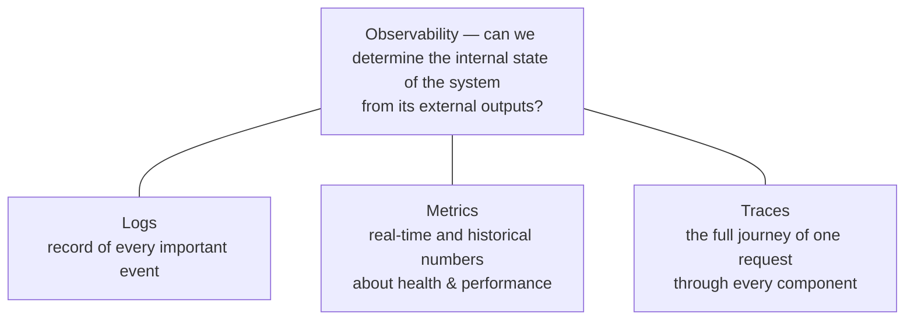
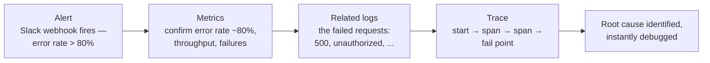
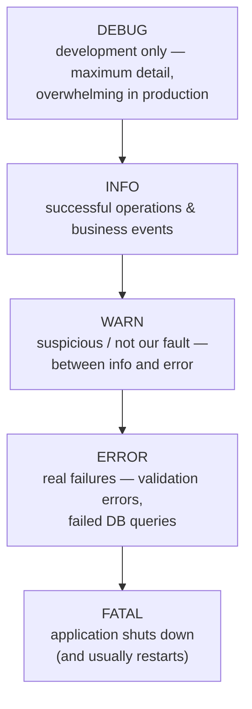
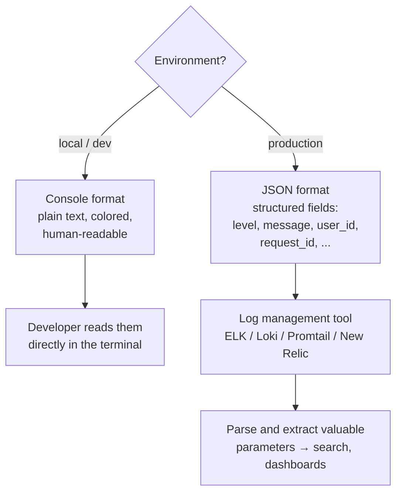
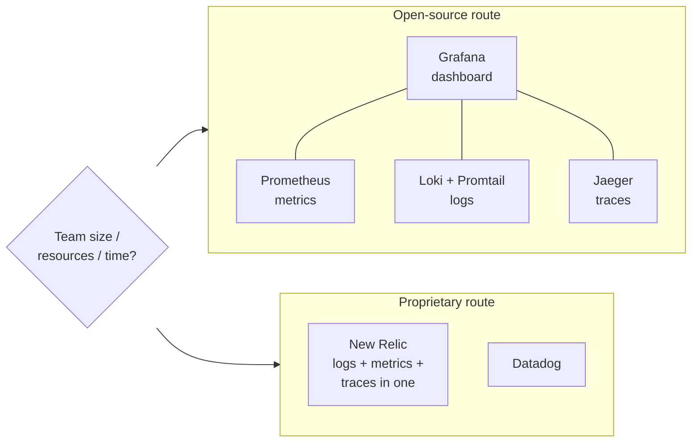
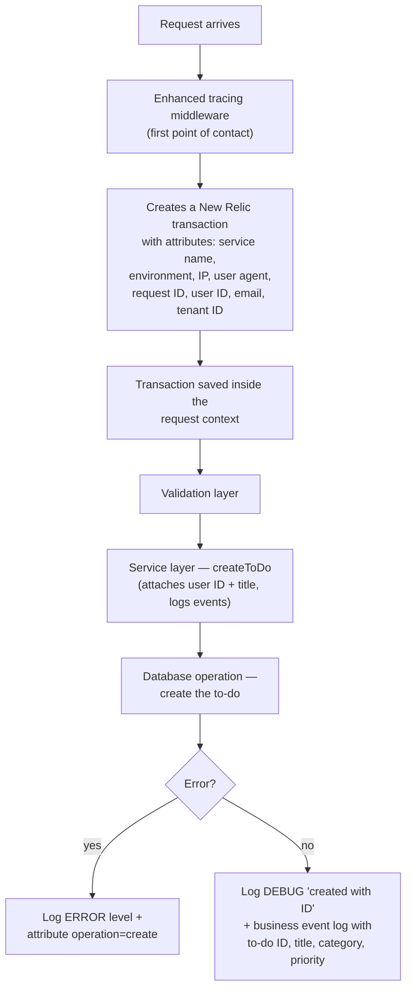
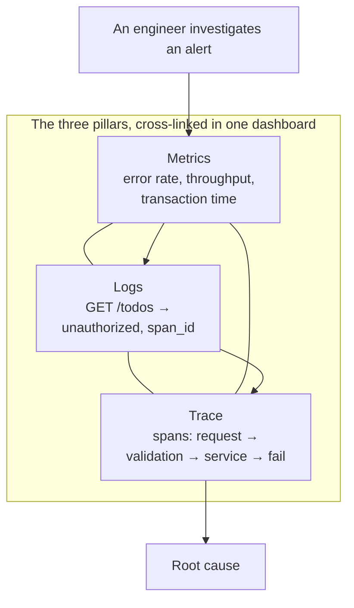
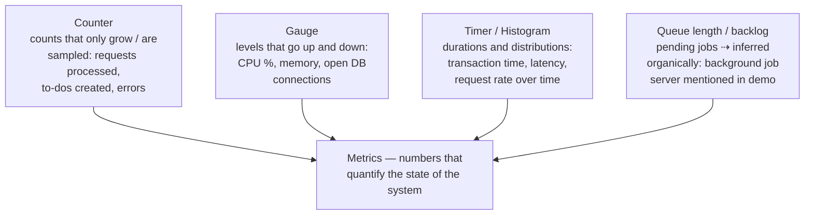

# Part 18 — Logging, Monitoring and Observability

> [!info] Video reference
> - **Part 18 of 29** in the playlist [[_00 - Backend from First Principles - Index]]
> - **Watch on YouTube:** [18. Logging, Monitoring and Observability](https://www.youtube.com/watch?v=5PEuwgLOQQM)
> - **Duration:** 39:51 | **Views:** 18,448 | **Published:** 2025-07-26
> - **Speaker/Channel:** Sriniously

> [!abstract] In this chapter
> Modern backends run as many services, on many servers, across many regions, serving users worldwide — so how do we keep track of what is actually happening inside them? This chapter builds that answer from first principles. Logging is the **journal** of important events (log levels, structured JSON vs plain-text console logs, rich metadata like user ID and request ID). Monitoring is the continuous collection of **real-time metrics** about health and performance (request counts, error rates, transaction time, memory). Observability is the umbrella practice — a system is "observable" only when its three pillars — **logs, metrics, and traces** — are in place, letting you not just know that something is wrong but understand *exactly what and where*. The video walks a real **Go to-do application instrumented with New Relic** — logger setup, an *enhanced tracing* middleware, a `createToDo` service, and a live dashboard drill-down from alert → metric → log → trace — and closes with the tooling landscape (Grafana/Prometheus/Loki/Jaeger open source vs New Relic/Datadog proprietary) and the philosophy that observability is a spectrum and a **collective effort** between developers and infrastructure teams.

---

## Table of Contents

- [A Spectrum, Not a Checklist — The Opening Framing](#The-Spectrum,-Not-a-Checklist-%E2%80%94-The-Opening-Framing)
- [Why We Need These Practices — The Distributed Environment](#Why-We-Need-These-Practices-%E2%80%94-The-Distributed-Environment)
- [The Three Terms in One Breath — Logging, Monitoring, Observability](#The-Three-Terms-in-One-Breath-%E2%80%94-Logging,-Monitoring,-Observability)
- [Logging — The Journal of Events](#Logging-%E2%80%94-The-Journal-of-Events)
- [Monitoring — Realtime Data About the System](#Monitoring-%E2%80%94-Realtime-Data-About-the-System)
- [Observability — The Three Pillars](#Observability-%E2%80%94-The-Three-Pillars)
- [Monitoring vs Observability — The Crucial Difference](#Monitoring-vs-Observability-%E2%80%94-The-Crucial-Difference)
- [How Logs, Metrics, and Traces Work Together — The Debugging Workflow](#How-Logs,-Metrics,-and-Traces-Work-Together-%E2%80%94-The-Debugging-Workflow)
- [Logging in Depth — Levels](#Logging-in-Depth-%E2%80%94-Levels)
- [Logging in Depth — Structured vs Unstructured Logs](#Logging-in-Depth-%E2%80%94-Structured-vs-Unstructured-Logs)
- [Tooling — Open Source vs Proprietary](#Tooling-%E2%80%94-Open-Source-vs-Proprietary)
- [Sponsor Segment — Sevalla](#Sponsor-Segment-%E2%80%94-Sevalla)
- [The Demo Application — A Go To-Do Backend With New Relic](#The-Demo-Application-%E2%80%94-A-Go-To-Do-Backend-With-New-Relic)
- [Instrumentation and OpenTelemetry — Two Words You Will Hear Constantly](#Instrumentation-and-OpenTelemetry-%E2%80%94-Two-Words-You-Will-Hear-Constantly)
- [The createToDo Service — Logging and Tracing in One Function](#The-createToDo-Service-%E2%80%94-Logging-and-Tracing-in-One-Function)
- [The New Relic Dashboard — From Error, to Log, to Trace](#The-New-Relic-Dashboard-%E2%80%94-From-Error,-to-Log,-to-Trace)
- [Metrics on the Dashboard — Quantifying the State of the System](#Metrics-on-the-Dashboard-%E2%80%94-Quantifying-the-State-of-the-System)
- [Traces, Transactions, and the Go Runtime on the Dashboard](#Traces,-Transactions,-and-the-Go-Runtime-on-the-Dashboard)
- [The Closing Philosophy — A Spectrum and a Collective Effort](#The-Closing-Philosophy-%E2%80%94-A-Spectrum-and-a-Collective-Effort)
- [Key Takeaways](#Key-Takeaways)
- [Related Notes](#Related-Notes)

---

## The Spectrum, Not a Checklist — The Opening Framing

### [00:00] A huge topic, delivered in one video

The video opens by naming its own scope: **"Logging, monitoring and observability."** The narrator immediately warns that this is a *huge* topic — each of the three words, taken on its own, is "deserving enough to get its own discussion, get its own video." Yet there is a crucial softening note before any definition:

> *"...this is also one of those topics where not everything is predecided. There are no rules. It's more of a spectrum."*

These three words describe **practices** — not laws, not certifications, not strict standards. Most companies, most individuals, most startups implement logging, monitoring, and observability *"in a spectrum."* And the second, equally important admission follows immediately:

> *"We can never say that our product, our company follows all the good logging, monitoring and observability practices. There is no such thing as that."*

The purpose of this framing is to de-intimidate: when you later hear dozens of keywords, products, and tools used across the industry, you are not expected to master all of them. Nobody does.

### [01:00] An exception to the series rule: we will look at code

Throughout the series, a self-imposed rule has been "we won't look at code." This video *breaks that rule deliberately*, because:

> *"...these practices are pretty closely related to code, how we implement them, how we follow these practices. That's why we'll look at code and see how these work in a real application."*

So the chapter is deliberately more code-heavy than its predecessors — you are allowed to see (and will be shown) real application code, because logging, monitoring, and observability are things you *do* inside your code, not just abstract theory.

---

## Why We Need These Practices — The Distributed Environment

### [01:55] The reality of modern applications

The *why* comes from the shape of modern systems:

- Modern backend and full-stack applications run in a **distributed environment**.
- They run on **different servers**, in **different regions**.
- Their **users are spread across the whole world**.

Given this reality, we need **practices, tools, and methodologies** so that we can keep track of *what is happening* in all of our services, in all of our infrastructure tools, and everything in between. "Keep track" is deliberately broad — there are many parameters one could observe, but the video says they can be *boiled down to some important ones*. Those important ones are exactly the three practices named in the title: **logging**, **monitoring**, and **observability** — and the video stresses that all three also apply to front-end/web applications, even though the discussion will be limited to **backend applications**.

---

## The Three Terms in One Breath — Logging, Monitoring, Observability

The video gives quick, high-level definitions first, then returns to drill down each one.



> **What this diagram shows:** The big picture of the whole chapter. **Observability** is the umbrella term. A system counts as observable only when all three of its "pillars" are in place: **logs** (the record of events), **metrics** (the numbers over time), and **traces** (the per-request journeys across components). Each pillar answers a different debugging question, and together they give you the complete story of a system.

---

## Logging — The Journal of Events

### [02:43] Logging is recording events

**Logging** is the practice of *recording all the important events that happen in our application*. Expanding the definition:

- We record **important events** — not every trivial detail, but the events that matter.
- We record **suspicious events**.
- We record **security-related events**.
- Pretty much **every important event** in the backend application lifecycle.

### [02:53 → 03:39] Every log event carries metadata

When we record an event, we want to record it *with **metadata*** — the "who, what, when, how" around it. From the video:

- **What was the user ID** that triggered this particular request?
- **What was the latency** of this request?
- **What particular HTTP method / what particular function** was triggered for this request?

These extra fields are exactly what *"come in handy when we are actually trying to understand our system."*

### [09:02 → 09:37] Examples and the "diary" metaphor

Concrete examples of loggable events from the video:

- A user **logs in**.
- We **execute a database query**.
- **Something fails** — and we log that error *with a timestamp, with the user ID, with the database query* — i.e., all the context needed to debug it.

The video's memorable metaphor: think of logs as **a journal or a diary your backend application maintains**, so that *"when the time comes we will know what happened, when it happened, and exactly why."*

```mermaid
flowchart LR
  A[Application code<br/>logs events during its lifecycle] --> B[Log lines with metadata<br/>timestamp, level, user ID,<br/>request ID, service]
  B --> C[Log pipeline<br/>collected & shipped]
  C --> D[Log store / management tool]
  D --> E[Engineer searches: "what happened,<br/>when, and why?"]
```

> **What this diagram shows:** The journey of a log. During its lifecycle the application emits log lines that carry **metadata** (timestamp, level, user ID, request ID, service name, and so on). Those lines are collected and shipped through a log pipeline into a central log store / management tool. When an incident happens, an engineer searches that store to reconstruct *what* happened, *when* it happened, and *why*. This "many servers → one searchable place" flow is **central log aggregation**, and it is why recording rich metadata at the source matters so much.

---

## Monitoring — Realtime Data About the System

### [03:56] Monitoring is exactly what it sounds like

**Monitoring** is *"exactly the same as the way it sounds"*: we want some way of **keeping track**. We want to monitor the state of:

- Our backend applications.
- The different **components** of our backend application — for example:
  - The server's **CPU**.
  - The server's **memory**.
  - **How many requests per second** the server is processing at this particular time.
  - The **state of our database connections** — how many are open, remembering that we use **database connection pooling**.

### [04:34] "Realtime" really means a few minutes' delay

Monitoring means having **real-time data about the system** — with a caveat. The video is careful:

> *"Not exactly real time but a few minutes deferring... usually without traditional tools there is some kind of delay because we don't want to overwhelm our whole logging, monitoring and observability systems with constant data with every millisecond, every second. So there is some kind of delay around 10 seconds or 15 seconds."*

So "real-time" in monitoring means roughly a **10–15 second delay**: data trickles in continuously, but never at the raw frequency of every single millisecond.

### [09:40 → 10:05] Monitoring is health, performance, and pattern tracking

Refining the definition:

> *"Monitoring is getting real-time data, basically continuously checking the health and the performance of your system, and tracking the patterns over time, and giving an aggregated picture: this was the performance, this was the behavior of your application over time — including the current time."*

The key output of monitoring is **patterns and trends** — an aggregated view of how behavior and performance evolve *over time*, with the present moment as the latest point on the curve.

---

## Observability — The Three Pillars

### [05:21] A system is observable only if all three pillars are in place

**Observability** is the widest term — it *"in itself includes a lot of other practices."* In theoretical terms it has **three pillars**, and the word *pillar* is chosen deliberately:

> *"A backend system can only be called observable if all these three practices, all these three components are in place. So those are: one is basically logs, second is metrics, and third is traces."*

- **Logs** — record of all the important events across the request lifecycle, application startup, application ending, the whole phase.
- **Metrics** — closely related to *monitoring*; the video will return to define precisely what "metrics" means.
- **Traces** — *"you can imagine traces as transactions."*

### [06:27 → 07:31] Traces are transactions through the system

A **trace** answers a journey question. We want a way of tracking:

- **At what point a request originated from one system** — it can originate from a **front-end system**, it can originate from a **load balancer**, or it can start inside your **backend application**.
- Then, *from that point on*, **all the components it touches**:
  - the **handler layer**,
  - the **service layer**,
  - the **validation layer**,
  - the **repository layer**,
  - and finally the **database layer**.

> *"A trace is basically a transaction including all the different components that it involves."*

So a trace records the full internal journey of a single request: where it started, where it originated from, and every component it passed through while the backend executed it. More formal definitions come later in the video; this is the high-level intuition.

### [10:07 → 10:24] The formal one-liner

> *"We can call a system observable if we can determine the internal state of the application by looking at different parameters, by looking at the external outputs. That's when we call a system observable."*

In other words: **an observable system reveals its internal state from its external outputs** (metrics, logs, traces, dashboard data) — you should not have to guess what is happening inside; the system should *tell* you.

## Monitoring vs Observability — The Crucial Difference

### [07:32] A decade ago, monitoring was the only tool

Observability as a formal practice is **modern — it has only been around for a few years** in its current form. A decade back, the primary way of *preventing errors, catching errors, or doing any kind of error handling at the infrastructure level* was **monitoring-based**. And here is the problem the video zeroes in on:

> *"Monitoring only tells you that there is a problem."*

Using monitoring tools and alerting workflows — the video names **Grafana** dashboards here — you can absolutely know *that there are issues* in your application, and you will get alerts. *"But that's pretty much it."* You cannot really act on it: monitoring informs you that **something** is wrong with your application, but not *what* or *where*.

### [08:29] Observability tells you not only that — but exactly what and where

The observability movement changed the deal:

> *"With observability, it will inform you that there is something wrong with your application, but it will also tell you exactly what is wrong with your application — given that you have followed all the observability practices: you have implemented logs, you have implemented metrics, and you have implemented traces."*

That one-line contrast is the heart of the chapter:

| | Monitoring (alone) | Observability (logs + metrics + traces) |
|---|---|---|
| Answers | Is something wrong? (alert) | Exactly what is wrong, and where? |
| Tooling | Alerts, thresholds, dashboards of numbers | Logs + metrics + traces, cross-linked |
| Outcome | You know you must investigate | You can jump straight to the failing point |

> [!warning] Not a competition
> Observability *includes* monitoring's metrics — metrics are one of its three pillars. The point is not "monitoring is bad"; it is that monitoring *alone* is not enough to debug a distributed system quickly.

---

## How Logs, Metrics, and Traces Work Together — The Debugging Workflow

### [10:24] Three outputs, three questions

The three practices work together because **each one produces one concrete parameter that is useful when debugging or understanding the system**:

- **Logs** → you know **what exactly happened**.
- **Metrics** → you know the **patterns and trends** (the health of the system over time).
- **Traces** → you know the **interaction of different components** — component interactions.

### [11:16] A real production scenario: the error-rate alert

The video narrates a realistic incident, end to end, to show the *workflow* combining all three:

1. **Alert.** You have configured an alert parameter: *"if our error rate goes beyond 80%"*. When it crosses that threshold, you get **a message in Slack** — a webhook from the monitoring tool — saying something like *"something is wrong with your API service, you should look into that."* This is **alerting**: a threshold trigger that pages a human on a chat channel.

2. **Metrics.** You open the metrics view. Metrics are the **real-time and historical parameters** you can track about the system, pre-configured as the numbers you care about. Examples from the video:
   - **How many requests** we have processed.
   - **How many requests have failed** — and the video gives its working definition of "failed": *any request whose status code is more than 200* is counted as a failed request.
   - For a to-do application: **how many to-dos were created** and **how many of those failed**.
   - These are concrete numbers over either historical data (last 30 minutes, last hour) or the current moment — and they are called **metrics**.
   - You **pre-decide** these metrics when configuring the logging/monitoring/observability system — both in your code *and* in the tool you use.

3. **From metrics → logs.** The dashboard shows the error rate at ~80%, and it can also show *the logs related to that metric* — basically all the failed logs.

4. **From logs → traces.** You click on a log that says something like `500`. The tool shows the **trace for that log**: *the request started at this function, then traveled to this function, then to this function, then to this function, and it failed at this particular point.*

5. **Root cause found.** With this workflow *"you can find out exactly where things went wrong and you can instantly debug it."* That is **the whole benefit** of implementing logging, monitoring, and observability in a backend system.



> **What this diagram shows:** The drill-down chain that makes observability an *actionable* workflow, matching the video's incident narration. An **alert** (threshold breached → Slack webhook) points you to **metrics** (the numbers confirming the problem). Metrics link to the **related logs** (what actually happened per request). Each log links to its **trace** (the full journey of the request with spans, ending at the failing point). The chain ends with a **root cause** — which is exactly the benefit of having all three pillars and wiring them together in one dashboard.

---

## Logging in Depth — Levels

### [18:38] Log levels: the first thing to know about logging

The video keeps the logging discussion **practical** — enough to get started and to "figure things out for yourself." The very first concept: **log levels**. Levels are something you will see *a lot* in production systems. When we log an event — *"usually if your library supports that, which it should"* — we **assign a particular level** to that log line. The most common levels are:

```
DEBUG
INFO
WARN
ERROR
FATAL
```



> **What this diagram shows:** The five log levels and their escalating severity, exactly as the video presents them. **DEBUG** is the most verbose; its logs are for development debugging only. **INFO** records successful/general operations and business events. **WARN** sits between INFO and ERROR — something is not right, but it is not a critical failure. **ERROR** records genuine failures (validation errors, failed database queries). **FATAL** is the top of the ladder: once a fatal is logged, the application stops and restarts depending on infrastructure configuration.

### [19:08] What each level is for

- **DEBUG** — used during **development**, when *"we are trying to debug something, trying to troubleshoot, and we need as much detail about the behavior of the system as possible."* Debug logs can be *overwhelming*, which is why they only matter in development and are **usually disabled in production**.

- **INFO** — *"general application operations, the business events."* If you have a to-do application and a to-do gets created, you use `log.info` to record that event. Any **successful operation** can use the info level.

- **WARN** — events *"in between info and error."* The op is not a success, but it is also *"not critical enough that we want to add it as an error."* The video's example: *if authentication fails for a user — the user typed a wrong password — we log it as a warning. This is not an error. It is not our fault.* So it's a `warn`, not an `error`.

- **ERROR** — *"any kind of error you can imagine: validation errors, or if your database query fails — all kinds of errors we log as errors."* The video notes this is **the most common level**, and arguably *one of the main reasons we use logging in the first place*.

- **FATAL** — *"pretty serious."* Once you log something with the level fatal:
  - *your application **mostly stops**, and*
  - *it **restarts**, depending on your infrastructure configurations.*
  - Fatal means *"this is a very serious bug, a very serious issue, and your application is shutting down."*

> [!info] The code-level demo (preview)
> The real application (shown later) demonstrates levels via a function (`getLogLevel`) that returns `debug` when running locally and `info` when running in production — because *in local we want more logs for debugging, and in production we want just the information-related logs*. That function is how the app **filters/configure** the level and thus how DEBUG lines stay invisible in production.

---

## Logging in Depth — Structured vs Unstructured Logs

### [21:06] Two kinds of log output

The video says we "usually log in two different kinds of ways": **unstructured (console) logging** and **structured (JSON) logging**.

#### Development: console logs (unstructured, plain text)

When you run your backend **locally**, you want your logs on the console — your VS Code console, your terminal, whatever console you use. And you want them:

- **readable**,
- **attractive, with colors**,
- **human-readable plain text**,

because in development, readable logs make it *easier to understand*, *easier to spot issues*, and *easier to fix them*.

#### Production: structured logging (JSON)

**Structured logging** means printing each log line in a machine-readable format; **JSON is the most popular format** for it. Instead of printing human-readable text, we print the error (or event) in **JSON format**, carrying all its parameters — for an error: *what is the status of the error, what is the message of the error*, and so on.

Why not JSON in development? Because in a development environment *"it's hard to read and it's easy to miss issues."* Why *must* it be JSON in production? Because in production, logs are **parsed by log management tooling**:

- the **ELK stack**, or
- the open-source **Grafana stack** — **Loki** + **Promtail** + **Grafana**,

and if logs are plain text, these tools *"will have a hard time parsing it and will face a lot of errors"* — parsing a line of free text to extract valuable parameters like the **user ID** or **request ID** is *"not efficient enough."* With JSON, extracting those fields is trivial.

> [!summary] The rule of thumb
> - **Development → unstructured console logs** (user-friendly, easy to spot errors by eye).
> - **Production → structured JSON logs** (easy for log-management tools to parse and ship insights).



> **What this diagram shows:** The environment-based fork in log formatting, exactly mirroring the video. In **local/development** environments, logs are emitted in a **console format** — plain text, colored, human-readable — so a developer can read them directly and spot problems by eye. In **production**, logs are emitted as **JSON**, because production logs are consumed by **log management tools** (ELK, Loki/Promtail/Grafana, New Relic) that parse machine-readable fields to extract valuable parameters (user ID, request ID, level, message) and then answer searches and power dashboards. The choice of format is not a matter of taste — it is driven by *who the reader is*: a human (dev) or a parser (tool).

---

## Tooling — Open Source vs Proprietary

### [24:16] The tooling landscape, named

The video names the concrete tools of the trade — and stresses that these are the keywords you will hear *"used in most of the enterprises."* There are two routes.

**Open-source route — the "Grafana stack":**

- **Grafana** — *"actually the front-end part, the dashboard part."*
- **Prometheus** — the backend, *"which actually builds all these metrics."* So in monitoring terms, the duo `Grafana + Prometheus` = dashboard front end + metrics engine.
- **Loki** + **Promtail** — log collection and log storage for the stack.
- **Jaeger** — *"for traces."* ⇢ *the transcript repeatedly transcribes this as "Jagger"; the intended tool is the distributed-tracing system **Jaeger**.*

The whole set — *"Prometheus, Grafana, Promtail and Jaeger for traces"* — is what he calls **"the Grafana stack."**

**Proprietary route — the one-stop solutions:**

- **New Relic** — the tool used for the video's demo. *"If we look up New Relic, this is a complete solution for logging, monitoring and observability needs of different systems."* It is the video's representative *"one-stop solution if you don't want to go the open-source route."*
- **Datadog** — mentioned in the closing as another proprietary option ⇢ *transcribed as "data dog".*

### [24:56] When to pick which

The decision guidance from the video:

> *"If you want a simple integration, a simple workflow, then something like New Relic makes more sense. If you don't have the team size, if you don't have the resources to maintain all these different open-source tools, then you can definitely go for something like New Relic. Configuring all these logging, monitoring and observability [tools] is pretty complicated. If you don't have the experience, if you don't have the time for it, then going with a proprietary solution makes more sense."*

In short: the open-source stack is powerful but *you* operate it (you run, patch, and scale Prometheus, Loki, Grafana, Jaeger); a proprietary platform trades that operational burden for a single integrated product.



> **What this diagram shows:** The two tooling routes described in the video. On the left, the **open-source "Grafana stack"** splits the work across specialized tools: **Grafana** is the dashboard front end, **Prometheus** builds the metrics, **Loki + Promtail** handle logs, and **Jaeger** handles traces — a powerful but operationally heavy setup you must host and maintain. On the right, the **proprietary route** (**New Relic**, **Datadog**) bundles all three pillars into one managed product. The decision between them, per the video, hinges on **team size, resources, and time**: the open-source stack when you can maintain it; the proprietary one-stop product when you want a simple integration.

---

## Sponsor Segment — Sevalla

### [14:44] Sevalla — a platform-as-a-service for everything in this chapter

The video includes a sponsored segment for **Sevalla** (⇢ *transcribed variously as "Savala"/"Seala"*). It is positioned as a **platform-as-a-service (PaaS)** — an alternative to services like **Netlify, Vercel, and Heroku** — and is directly relevant to this chapter because it is offered as an easy way to host the observability stack itself:

- You can deploy **full-stack applications**, **databases**, and **custom applications**.
- Specifically: *"if you want to deploy Grafana, Prometheus, Jaeger, and OpenTelemetry collectors, then you can deploy all those applications by dockerizing them, and you can connect all these applications to your backend using their internal network if you deploy them in the same region."*
- After the first deploy, you connect a **GitHub repository**, and the next time you push to your main branch **it auto-deploys using a GitHub bot**.
- Under the hood Sevalla uses **Kubernetes running on GCP with their premium network tier**, to *"completely abstract away all the complexity"* that manual cloud deployments involve. You never touch **YAML files** or manage **containers** yourself.
- **Three build options:**
  1. **Nixpacks** — ⇢ *transcribed as "Nyx packs"* — which *"by default supports more than 20 languages with better resource efficiency than traditional build packs."*
  2. **Buildpacks** — for **Heroku compatibility**, so migrations from Heroku are smooth.
  3. **Custom Dockerfiles** — full control over how you configure and deploy.
- **Preview deployments** (like Vercel's): when a team member raises a **PR**, you instantly get a **domain**; you can click it, *use the application with all the changes from the new PR*, and then decide whether to merge or request changes. Handy for teams *and* solo devs.
- **Network/performance claims:** all applications run on Google's infrastructure with **Cloudflare's edge network**; static assets are cached across **260+ points of presence**; internal communication between services is free; bandwidth is advertised as **33% less than Vercel at just $0.10 per GB**.
- A **$50 credit** is offered via the description link (context from the video metadata).

> [!note] Editorial note
> This is the video's sponsored content, reproduced for completeness as it appears in the episode. The placement is strategic: a PaaS that can host Grafana, Prometheus, Jaeger, and OpenTelemetry collectors is one concrete way to stand up an observability stack without operating it yourself. All product details above are the sponsor's claims as stated in the video.

---

## The Demo Application — A Go To-Do Backend With New Relic

### [23:56] Why show code at all — and what to focus on

Before the demo, the video repeats an anchoring instruction:

> *"Please don't try to understand the code, don't try to memorize the code, don't get overwhelmed. The whole point of this video is just to show how the operations work, how the practices work in logging, monitoring and observability — not the code; we are just using the code."*

The demonstration app: a **to-do application whose backend is written in Go**, which *"tries to follow all the practices — logging, monitoring and observability"* — and which is instrumented with **New Relic**.

### [26:06] The logger setup — levels and format from configuration

The first file shown **creates a new logger before the application starts**, with a couple of key configurations:

1. **A function `getLogLevel`** ⇢ *the exact function name is inferred from the transcript's description "a function called get log level"*. It checks whether we are in:
   - **development mode** — running locally, or
   - **production mode** — deployed and running in our infrastructure.
   
   Depending on the mode it returns either **an `info` level or a `debug` level**: *"because in local we want more logs for debugging purposes, and in production we want just the information-related logs."* Using this function, the app configures (filters) which level is emitted.

2. **The logging format** — structured vs unstructured in practice. *"By default we have set the logging format as `console` because it is a development environment."* The variable controlling it accepts a value like `json`.

### [27:01] Demo — flipping from console to JSON and back

The narrator edits the config: the environment value from `local` → something else, and the format to `json`. After restarting the server task, **all the logs come out as JSON** — *"great for production environments but not very readable."* Then he flips back to the development setup from env, and the **development logs** appear in the readable console form:

- The **first log** is about **connecting to the database**.
- The **second log**: **started the background job server**.
- The **third log**: **starting the server**.

Compare with the earlier JSON output: not easy for a human to understand at a glance, but *"definitely easy to parse for other tools."* This is the structured/unstructured distinction demonstrated live.

---

## Instrumentation and OpenTelemetry — Two Words You Will Hear Constantly

### [28:02] The New Relic middleware instruments every request

For **monitoring** to work, the router is wrapped with a middleware — *the "New Relic middleware."* If you look inside, it is *"basically initializing a new middleware by wrapping our whole app."* What that middleware does: *"every time a new request comes, it instruments the whole request."* The word **instruments** leads directly to the two terms the video says you will hear *very frequently* in observability conversations.

### [28:28] Instrumentation

**Instrumentation** is:

> *"...basically the practice of actually measuring different attributes of your function, which is closely related to when we call a system observable."*

In short: inserting measurement points into your own code so the system can report on its own behavior — measuring function attributes, timings, attributes of requests.

### [28:48] OpenTelemetry

**OpenTelemetry** is:

- a **standard**,
- a *recent addition* to the ecosystem,
- and it provides *"a whole ecosystem of tools, SDKs, best practices, and resources so that you can properly instrument your application."*

Crucially it is **language-agnostic**: *"it does not matter what language you are using — Node.js, Go, Python — the community has built enough APIs, SDKs, and tools for all the major languages."* It is an **open standard**, and the video explicitly notes a hybrid possibility:

> *"Even though we are using a proprietary tool like New Relic, we can definitely integrate an OpenTelemetry collector so that we can have more control about how we are instrumenting our requests, how we are instrumenting our components."*

The narrator flags the OpenTelemetry remark as a **side note** — not essential to the demo, but a fixture of real observability conversations.

---

## The `createToDo` Service — Logging and Tracing in One Function

### [29:43] The function and the enhanced tracing middleware

The video zooms into **one function — `createToDo`** — the service that creates a new to-do, and traces the whole logging/monitoring/observability workflow through it.



> **What this diagram shows:** The request's journey in the demo app, per the video's walkthrough. A request hits an **"enhanced tracing" middleware** — the first point of contact in the request lifecycle. That middleware **creates a New Relic transaction** and attaches context attributes to it (service name from config, environment, IP address, user agent, request ID, user ID, email, tenant ID), then **stores the transaction in the request context**. The same transaction flows through the **validation layer** into the **service layer** (`createToDo`), which attaches more attributes, then to the **database operation**. On error, the app logs at **ERROR** level and tags the transaction with `operation=create`; on success it logs a **DEBUG** "created" line plus a **business event log** with the to-do's ID, title, category, and priority. Every span along this path belongs to **one trace**.

### [30:12] The enhanced tracing middleware supplies the transaction

The key middleware here is called **enhanced tracing** (⇢ *the exact name is inferred from the transcript phrase "a middleware which is called enhanced tracing"*). It is *"the first point of contact"* during a request's lifecycle. What it does:

1. **Creates a new transaction** using the New Relic method.
2. **Adds parameters** to it:
   - the **service name** — taken from configuration,
   - the **environment** — local or production,
   - the **IP address** and the **user agent**,
   - the **request ID** — fetched for the request,
   - the **user ID**, **user email**, **tenant ID**, *etc.*
3. **Adds this transaction to the request context**, so that when the request later reaches a service method, *"we already have a transaction saved inside our context"* and can proceed with it.

The *reason* for storing the transaction in context: *"a single request will have a trace which will start from that middleware where we are creating the transaction, then it will reach the validation layer, then it will reach the service layer — and all of this will be a single instance of a trace."* That whole-request trace is what lets you debug issues later.

### [31:33] Inside `createToDo` — what the service adds

Walking through the function statement by statement:

1. **Take the transaction out of the context**, and use a `defer` so that *"when this function returns, we want to end this transaction for this particular segment — the to-do create service."* In New Relic terms this marks a **segment** completing.

2. **Add two attributes to the transaction**: the **user ID** and the **title** of the to-do the user requested.

3. **Log the operation itself** — logging every important event: a log line for the operation being performed (`create to-do`) with the **title** of the to-do, because *"we want to log this particular event."*

4. **If a priority was passed in the request payload**, add it (a) as an **attribute on the transaction** (so it is available in the trace) and (b) as **part of the log**.

5. **Log an INFO-level message** that the process of creating a new to-do is being initiated.

6. **Validation** — *"some kind of validation with the children and parent relation"* ⇢ *the transcript mentions validating child/parent relations among to-dos; the exact validation details are not given.*

7. **Execute the database operation** that creates the to-do:
   - **On error:** log at **ERROR** level, *add this error to the trace using the transaction*, and add the attribute **operation = `create`** — so you know *for which operation the result is an error*.
   - **On success:** add the attribute **operation = `create`** and the created **to-do ID**; log a **DEBUG**-level "to-do was created successfully with this particular ID" — *"this will not be visible in our production systems or production log"* — and finally log **a business event log** for the operation with all associated metadata: **the ID of the to-do, the title, the category ID, and the priority.**

> [!summary] The demo shows the loop closed
> Logging every important event (INFO), tagging traces with request/user attributes, attaching errors to traces, and emitting a debug-level success line that production filters out — this single function demonstrates levels, structured metadata, traces, transactions, and business-event logs working in the same flow.

---

## The New Relic Dashboard — From Error, to Log, to Trace

### [34:06] Making logs visible in the dashboard

The narrator switches the logger back to **JSON format** and the environment value to **production** *"so that these logs are visible in our New Relic dashboard."* The dashboard's application overview shows **error rates, transaction time, etc.** — but since there had been *no activity in the last 30 minutes*, there was no data to display.

### [34:45] Triggering requests — intentionally failing them

To generate data, he uses the **OpenAPI interface** (the video calls it "the open API interface where we can test our APIs") to fire the **"get all to-dos"** endpoint (route `/todos`) **a couple of times without providing a token** — so every call returns an **unauthorized** error. The point: *"we want to check if this error gets logged in our dashboard."*

### [35:05] The errors → logs drill-down

Back in the New Relic dashboard:

- He navigates to **Errors → HTTP error type**.
- After a refresh, the dashboard shows the **unauthorized errors** generated by the fired requests.
- Each error is accompanied by **the related logs** — *"as we have discussed before ... all these things work together so that we have a complete understanding of our system so that we can debug better."*

### [36:00] Anatomy of one error log

Clicking on the unauthorized log reveals **all the associated information**, which the video enumerates as the canonical field set of a structured log:

- the **name of the application**,
- the **environment** it was running on,
- the **error code** — `unauthorized`,
- the **error level**,
- the **message**,
- the **method** — the `GET` method,
- the **API route** being fetched — `/todos`,
- the **hostname**, the **IP address**,
- the **span ID**,
- the **timestamp**,
- "and everything related to this log."

> [!info] A structured log line, exemplified
> Combining the video's enumerated fields into a representative JSON log line (format inferred; every field name is from the transcript):
>
> ```json
> {
>   "level": "error",
>   "error_code": "unauthorized",
>   "message": "unauthorized",
>   "method": "GET",
>   "route": "/todos",
>   "host": "some-host",
>   "ip": "...",
>   "span_id": "...",
>   "timestamp": "...",
>   "environment": "production",
>   "service": "to-do-app"
> }
> ```

### [36:47] Log ↔ trace — the third pillar

The video reminds you that this log is **connected to a trace**: *"we have three pillars — one is logging, second is metrics, and the third one is traces. Now if we click on this, this is the whole trace that we can look more into and get more information from here."*



> **What this diagram shows:** Why the three pillars are *cross-linked* rather than three separate tools. **Metrics** (error rate, throughput, transaction time) flag a problem. Clicking through, **logs** show the specific failing requests (e.g. `GET /todos` returning `unauthorized`) and carry a **span ID**. That span ID links to the **trace** — the full set of spans the request traversed (request → validation → service → fail point). The engineer investigating an alert can therefore bounce metric → log → trace and land on a **root cause**. This is the dashboard-level demonstration of the workflow explained earlier in the chapter.

---

## Metrics on the Dashboard — Quantifying the State of the System

### [35:38] The "Summary" view is where metrics live

The video explicitly ties the dashboard's **Summary** view to the **metrics** pillar. There you see numbers like:

- **average transaction time**,
- **throughput**,
- **errors**,

and the video's definition of metrics, grounded in the demo:

> *"...these are the metrics, actual numbers that we can see, so that we can quantify the state of our system."*

Recall the earlier definition: metrics are the **real-time and historical parameters** you pre-decide to track — how many requests processed, how many failed (status > 200), how many to-dos created/failed, over the last 30 minutes or the last hour.

### Metric types — what the demo actually shows

The video does not formally teach the standard metric-class taxonomy (`counter`/`gauge`/`histogram`/`timer`), but every example it shows maps onto those families. ⇢ *The taxonomy itself is inferred from standard observability terminology; the examples come straight from the transcript:*



> **What this diagram shows:** The standard families of metrics, cross-walked against the exact examples the video shows. **Counters** are growing/sampled counts (requests processed, to-dos created, errors). **Gauges** are levels that fluctuate (CPU, memory, open database connections). **Timers/histograms** capture durations and distributions (transaction time, latency). **Queue length** covers backlog-type numbers — inferred, since the video's demo app mentions a background job server alongside the metrics story. All of these are just *numbers* until an engineer uses them, in the Summary view or in a Grafana-style panel, to quantify the state of the system.

### Typical metrics to track — collected from the video

Across the chapter, the video names these tracking parameters worth collecting (matching the "boil them down to the important ones" promise at the start):

- **Request rate** — "how many requests the server is processing per second."
- **Error rate / request failures** — failed requests = any response with a status code *above 200*; alerting example threshold = error rate beyond **80%**.
- **Transaction / response time** — "average transaction time," "average response time," latency.
- **Throughput** — requests per unit time.
- **Resource usage** — server **CPU** and **memory**.
- **Database connection pooling state** — how many database connections are open.
- **Runtime health** — on the Go dashboard: **garbage-collection time** and **memory (heapsize)**.

### Alerting

Alerting is where metrics turn into action. The video's full alerting story, from the earlier workflow:

- You **pre-configure thresholds** on your metrics (for example, *error rate > 80%*).
- The monitoring tool **watches the metric continuously**, and when the threshold is breached it fires.
- Delivery is via **webhook into a chat channel** — the video's example is **a message in Slack**: *"something is wrong with your API service, you should look into that."*
- The alert is the *entrance* to the drill-down workflow — it does not yet tell you *what* is wrong; metrics/logs/traces do. (This is the "monitoring tells you *that*; observability tells you *exactly what*" distinction, applied.)

---

## Traces, Transactions, and the Go Runtime on the Dashboard

### [36:47 → 37:35] The transactions view

Back in code, the segments that add attributes to the transaction are exactly what the **Transactions** view of the dashboard reflects. Into the demo:

- Clicking the **`/todos`** transaction shows *"all these different data for this particular transaction — different error rate, different response time, and all these different data."*
- Clicking **Go runtime** shows information *"about the system where our backend application is actually running"*:
  - **garbage-collection time**,
  - **memory usage** (the video notes "just 3 MB" at that moment),
  - **throughput**,
  - **average response time**,
  - "and all these different things."

> [!tip] Why a runtime view matters
> The Go runtime panel is monitoring aimed at the *infrastructure/process level* (rather than the request level): GC pauses and heap size explain latency and memory pathologies that request-level metrics would merely flag. It demonstrates that monitoring spans every layer — application logic, database state, and runtime.

---

## The Closing Philosophy — A Spectrum and a Collective Effort

### [37:57] Practice, not dogma

The video closes by returning to its opening claim — these are **practices implemented on a spectrum**:

> *"This is just a practice, and we implement these practices in a spectrum. We cannot say that a system is completely observable. It is logging and monitoring 100% of the parameters — but we implement this in a spectrum."*

There is also a **tooling recap**:

- **Open-source route:** *"Grafana, we have Loki, we have Prometheus, and Jaeger for the traces."*
- **Proprietary route:** *"New Relic, Datadog, etc."* — for a more simplified setup.
- Whichever you pick, these services give you *"all these different information about the state of our service, the state of our application, the state of our infrastructure, different interactions of different components, and everything we can imagine."*

### [39:00] Who does what: a collective effort

Crucially, tools *alone* do nothing — you must implement the instrumentation **in code**:

> *"Of course, we have to actually implement that, as we saw in our code, to have that result in the first place. But assuming that we have done everything from our part on the code side, we'll have a complete understanding, a complete dashboard view in whatever software we are using — it does not matter."*

And the effort is shared across two roles:

> *"This whole workflow of logging, monitoring and observability is a collective effort. You, as a developer, have to do it on the code level — and the infrastructure people, the DevOps people — they also have to have the correct setup, so that they can collect and monitor all these metrics, and they can collect all these logs and traces."*

So: **developers instrument the code** (emit structured logs, create traces, record metrics); **infrastructure/DevOps teams run the collectors and the analysis platform** (Prometheus, Loki, Jaeger, or the managed equivalents). Missing either half, the dashboard is empty.

### [39:40] The final line (truncated in captions)

The transcript's final sentence runs off mid-thought — *"there is not particularly a skill that you have to learn but you have to keep in mind that this is a very important part of any production..."* — the video ends with the idea that observability is not a discrete skill to master, but a crucial part of any production system ⇢ *inferred: the sentence is cut off at the end of the episode; the clearly-intended completion is "...any production system/backend."*

---

## Key Takeaways

- **Logging, monitoring, and observability are practices — not rules.** They are implemented *on a spectrum*; no team follows "all the best practices," and the point is to not feel intimidated by the tooling landscape.
- **Why we need them:** modern backends are distributed — many servers, many regions, global users. We need practices and tools to *keep track* of what is happening everywhere.
- **Logging** = recording all important (and suspicious, and security-related) events with **metadata** (user ID, latency, method/function, request ID) — the application's *journal/diary*: what happened, when, and why.
- **Monitoring** = continuously checking health and performance, collecting **near-real-time data** (≈ **10–15 s delay**) to see **patterns and trends** over time; tracks CPU, memory, requests/second, database connection pool state.
- **Observability** = the umbrella practice with **three pillars: logs, metrics, and traces.** A backend is *observable* only when all three are in place — "you can determine the internal state of the application by looking at its external outputs."
- **Monitoring vs observability:** monitoring tells you *that* something is wrong (alerts); observability (given logs + metrics + traces) tells you *exactly what and where*.
- **The pillars answer three questions:** logs → what happened; metrics → patterns/trends; traces → how components interacted (a trace = the whole transaction of a request across handler → validation → service → repository → database).
- **Log levels:** DEBUG (dev only), INFO (successful operations/business events), WARN (suspicious, "not our fault" — e.g. wrong password), ERROR (real failures — validation, DB), FATAL (serious; app stops and restarts).
- **Structured vs unstructured:** development logs = human-readable console text (colors, easy to spot issues); production logs = **structured JSON**, because log-management tools (ELK, the Grafana stack: Loki + Promtail, New Relic) parse JSON to extract fields like user ID and request ID.
- **Metrics:** pre-decided real-time + historical numbers — requests processed, failed requests (status > 200 = failed), to-dos created/failed, average transaction time, throughput, errors. **Alerting** = thresholds (e.g. error rate > 80%) that fire webhooks into Slack.
- **The debugging workflow:** alert → metrics → related logs → trace → root cause — each dashboard view cross-links into the next.
- **Two key observability words:** **instrumentation** = measuring attributes of your functions; **OpenTelemetry** = an open, language-agnostic standard + SDK ecosystem for instrumenting apps (can sit in front of proprietary tools like New Relic via an OpenTelemetry collector).
- **Tooling:** open-source "Grafana stack" (Grafana dashboard, Prometheus metrics, Loki + Promtail logs, Jaeger traces) vs proprietary one-stop platforms (**New Relic**, **Datadog**) — choose based on team size, resources, and time.
- **It is a collective effort:** developers instrument the code; infrastructure/DevOps teams run the collectors and dashboards. And it's far more *practice* than *skill* — but indispensable in any production system.

---

## Related Notes

- [[_00 - Backend from First Principles - Index]]
- Prev: [[17 - Production-Grade Configuration Management]] (config-driven `getLogLevel` and environment switches are exactly how the demo logger decides its level and format)
- Next: [[19 - Graceful Shutdown]] (the FATAL restart behavior and "application shutting down" connect naturally to shutdown handling)
- See also: [[15 - Full Text Search Using Elasticsearch]] (the **ELK stack** for log management appears in both chapters), [[14 - Task Queues and Background Jobs]] (the demo's background job server and queue-length-style metrics)

---

> [!note] Source fidelity
> This note is written from the timestamped transcript of video_id `5PEuwgLOQQM`. Auto-caption transcriptions of tool names were normalized to their intended spellings: "Graphana" → **Grafana**, "Jagger"/"Jagger stack" → **Jaeger**, "Promptale" → **Promtail**, "Newelic"/"Newelic middleware" → **New Relic**, "data dog" → **Datadog**, "Savala"/"Seala" → **Sevalla**, "Nyx packs" → **Nixpacks**, "ELK stack" as spoken. Details marked ⇢ *inferred* are: the `getLogLevel` function name, the "enhanced tracing" middleware name, the JSON log-line example structure (all field names come from the video's own enumeration), the metric-category taxonomy (counter/gauge/timer/histogram/queue), the transcript's final sentence being cut off at the end of the episode, and the approximate anchor for the "when to pick which [tool]" guidance (spoken as a continuation of the tooling recap). The sponsor segment (Sevalla) is reproduced because it appears in the episode and directly concerns hosting observability infrastructure. All timestamps, examples, definitions, alerting details, dashboard field lists, and demo numbers (3 MB memory, 80% error-rate threshold) come directly from the video.