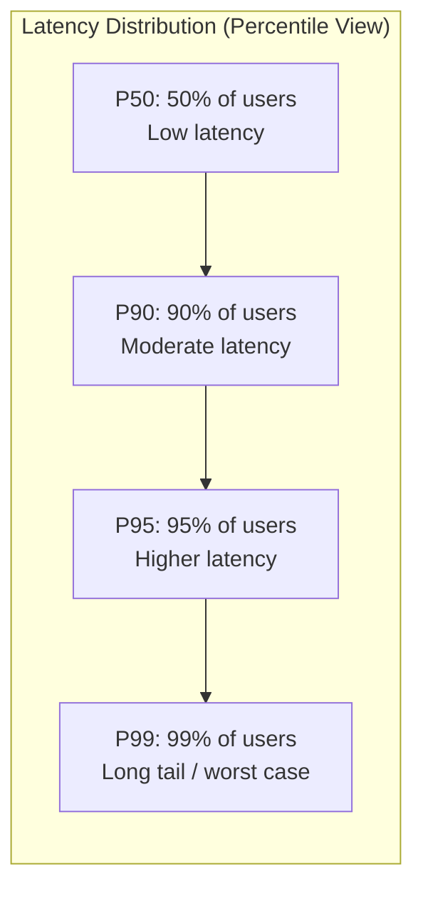
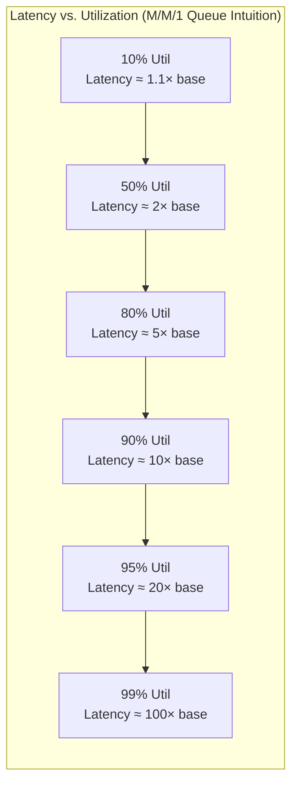
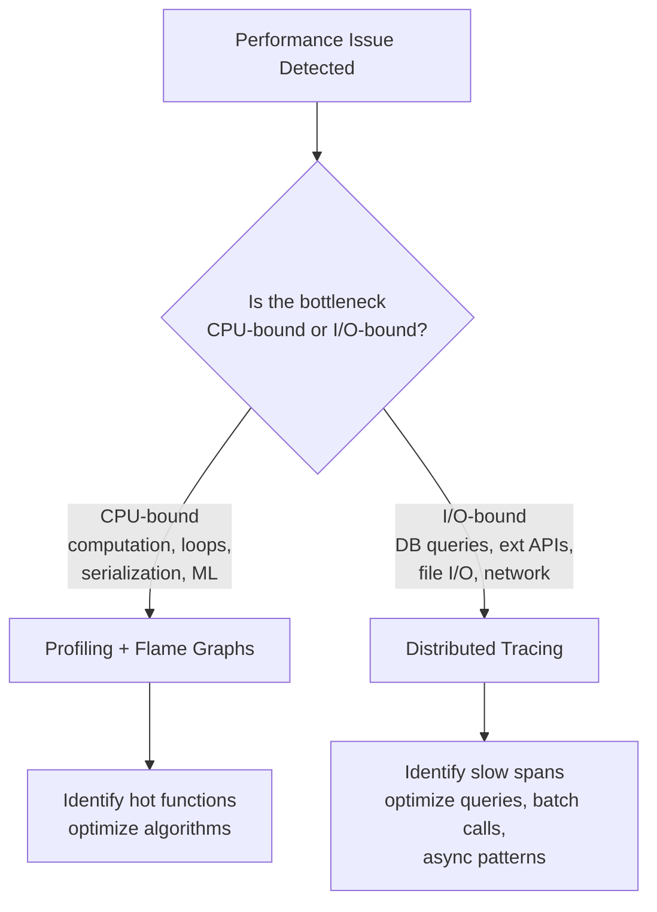
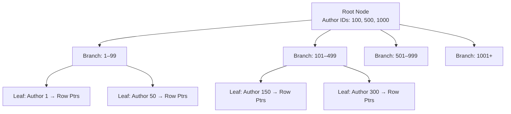
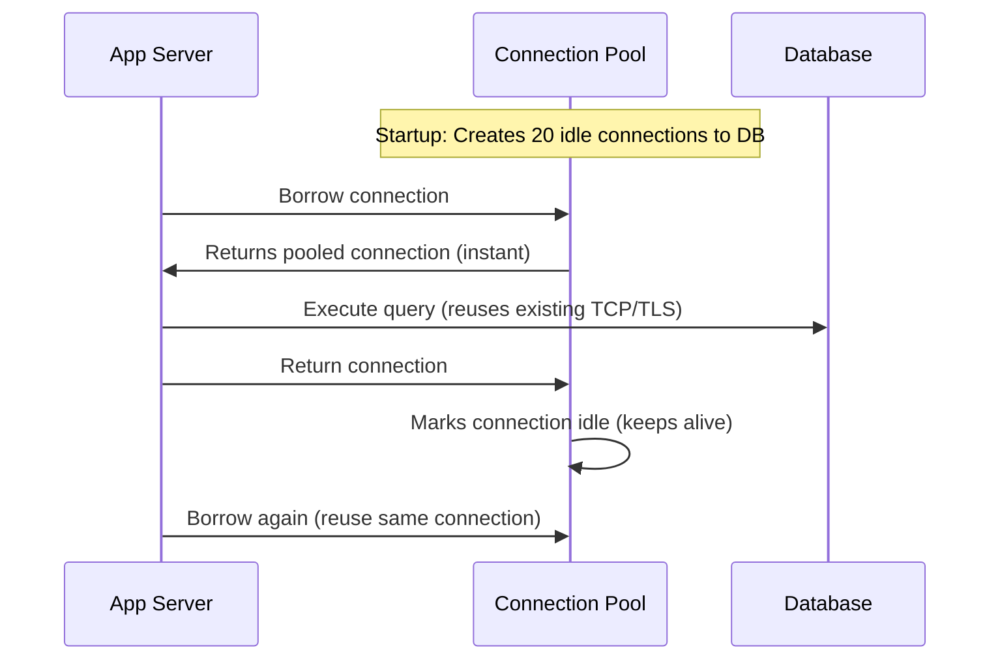
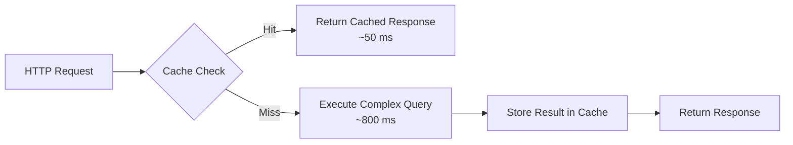
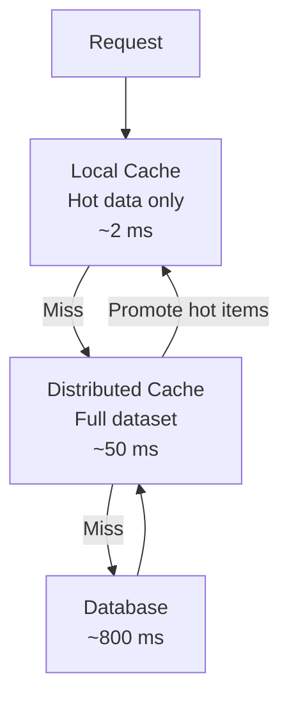
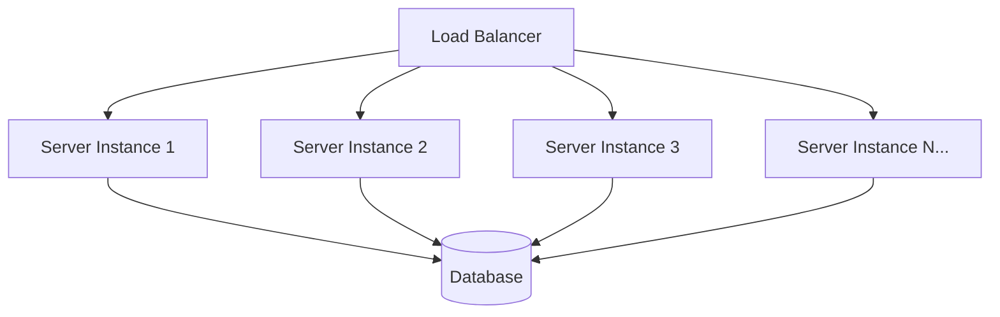

# Part 21 — Backend Scaling and Performance Engineering (Part 1)

> [!info] Video Reference
> **Title:** 21.1. Backend Scaling and Performance Engineering: Part-1
> **Channel:** Sriniously
> **URL:** https://www.youtube.com/watch?v=z7kt_p44rjs
> **Playlist:** Backend from First Principles (Video 21 of 29)
> **Duration:** 1h 47m 31s
> **Published:** December 14, 2025

> [!abstract] In This Chapter
> This first half of the scaling and performance engineering deep-dive establishes the foundational vocabulary and mental models every backend engineer needs. We begin by defining **latency** not as a single number but as a distribution that varies request-to-request, then dismantle the trap of using **arithmetic mean (average)** as a performance metric. You'll learn why **percentiles (P50, P90, P95, P99)** are the correct language for expressing latency, and how the "long tail" hides the experience of your most valuable users. Next, we introduce **throughput (RPS/QPS)** and its non-linear relationship with latency. The chapter then builds an intuitive understanding of **utilization** and the **exponential latency curve** — the critical realization that you cannot run systems at 100% utilization without catastrophic latency degradation. We cover the **queueing theory** intuition behind this (ice cream shop and highway analogies), the necessity of **headroom (20–40% buffer)**, and the bursty nature of real-world traffic. Finally, we tackle **bottleneck identification**: why guessing wastes weeks, the discipline of **measurement over assumption**, and the tooling of **profiling (flame graphs for CPU-bound work)** and **distributed tracing (for I/O-bound work)**. The chapter concludes Part 1 with a deep dive into the **N+1 query problem** — its mechanics, why ORMs make it insidious, and the bulk-fetch/join solutions across major frameworks.

---

### [00:00] Introduction: Scaling and Performance as Universal Engineering Skills

Scaling and performance are two of the most widely used buzzwords in backend engineering, yet they represent equally important concepts when discussing systems, backends, and infrastructure. The definition of "performance" differs significantly between browser/frontend systems and backend infrastructure. This video scopes the discussion specifically to backend engineering concepts.

We start from the primary question: **what do we mean when we say a system is "fast"?** The goal is to build understanding layer by layer, developing an intuition for how systems behave under load, where bottlenecks actually hide, and how to think clearly when everything seems to be falling apart. The aim is not just to learn a few scaling techniques, but to understand how to think about scaling and performance in a way that applies universally — whether discussing backends or any other systems.

---

### [01:50] What Is Latency? The End-to-End Request Journey

Consider a modern web application. A user clicks a button in their browser (e.g., Chrome). This triggers a series of events:

1. The browser sends a request across the internet to your server.
2. The server receives the request, processes it, and likely interacts with a database (to store or fetch information).
3. The server may also call other APIs (e.g., sending an email via a service like Resend).
4. The server sends a response (typically JSON) back across the internet to the browser.
5. The browser parses the JSON, executes JavaScript, and renders elements on screen.

**Latency** is the total time elapsed between the user clicking the button and the final rendering on screen. It is the most fundamental concept in performance measurement — a measurable unit that lets us define performance mathematically rather than using vague terms like "fast" or "slow." When users say "your application is slow," they are describing latency, whether they know the term or not.

---

### [05:25] Why Averages Are Misleading: The Arithmetic Mean Trap

**Latency is not a single number.** It varies from request to request. One request might complete in 50 ms; another might take 200 ms. The difference arises from real-world unpredictability:

- **Cache hits vs. misses**: A request hitting a CDN or in-memory cache (Redis) completes faster than one requiring a database query.
- **Server load**: A request hitting an idle server gets processed immediately; one arriving while the server concurrently processes 50 other requests must wait.

If we take the **average (arithmetic mean)** of these latencies — say (50 + 200) / 2 = 125 ms — does this number say anything meaningful? **Averages are misleading for performance** because they hide variations, and variations are precisely what matter in performance engineering.

**Concrete example**: Over 1,000 requests, the average latency is 100 ms. But 99% of requests complete under 50 ms, while 1% take ~5 seconds. The average masks this entirely.
- At 1 million requests/day: **10,000 users** experience 5-second delays.
- The average still reports "a few hundred ms" — the system looks healthy.
- You never realize the frustration of that 1%, nor the system's true limits.

**This is why we use percentiles, not averages.**

---

### [08:00] Percentiles: P50, P90, P95, P99 — The Language of Latency Distributions

A **percentile** tells you the latency threshold below which a given percentage of requests fall.

- **P50 (50th percentile / median)**: If P50 = 400 ms, then 50% of users experience ≤ 400 ms latency.
- **P90 (90th percentile)**: If P90 = 900 ms, then 10% of users experience ≥ 900 ms latency (or equivalently, 90% experience ≤ 900 ms).
- **P99 (99th percentile)**: If P99 = 2 seconds, then 1% of users experience ≥ 2 seconds latency (99% experience < 2 seconds).

**How to read percentiles intuitively**: Subtract the percentile from 100.
- P99 → 1% of users experience this latency or worse.
- P90 → 10% of users experience this latency or worse.
- P50 → 50% of users experience this latency or worse.

These three numbers (P50, P90, P99) appear in every performance, optimization, and scaling discussion.

> ⇢ *inferred*: The transcript mentions P95 in passing as a focus area alongside P99; P95 = 5% of users experience this latency or worse.

#### Visualizing the Percentile Distribution



**What this diagram shows:** The percentile curve visualizes how latency accumulates across the user population. The left side (P50) represents the typical experience — fast, cache-friendly, uncontended requests. Moving right, each percentile captures progressively worse cases: cache misses, queue waits, complex queries, external API calls. The "long tail" (P95–P99) is where system pathology lives.

#### Why Engineers Obsess Over P99 and P95

Backend engineers focus heavily on P99 and P95 not just because of unhappy users, but because **requests in the long tail exercise the most complex code paths**:

- Most complex business logic
- Most complex database queries
- Most complex service synchronization (external API calls, email sending, webhook waiting)

The users experiencing P99/P95 latency are often your **most valuable customers** — e.g., a user making a payment or purchase generates more complex queries and business logic than a casual browser. Optimizing the tail protects revenue-critical workflows.

---

### [14:50] Throughput Explained: Requests Per Second (RPS/QPS)

**Latency** = how long an individual request takes (origin to response).
**Throughput** = how many requests the system can handle in a given time period (typically **requests per second / RPS** or **queries per second / QPS**).

These two metrics are **connected but not intuitively**. At low throughput (e.g., 10 RPS), latency might be 150 ms. But at 1,000 RPS, latency might jump to 2 seconds. Understanding throughput *with* latency answers practical questions:

- Can our system handle Black Friday traffic (spikes to hundreds of thousands of RPS)?
- Can we survive a viral podcast feature or email campaign?
- How many concurrent users can we support?
- At what RPS do we need more resources?

---

### [17:55] Utilization & The Latency Curve: The Exponential Trap

#### The Ice Cream Shop Analogy

- **Sunday evening (low utilization)**: Shop empty. You walk up, order, get ice cream instantly. Low utilization → low latency.
- **Tuesday lunch (high utilization)**: Huge queue. Worker makes each ice cream at the same 2-minute pace, but you wait for everyone ahead. **Worker speed unchanged; your perceived latency skyrocketed due to queueing.**

Backend servers behave identically:
- **Low utilization**: CPU grabs request, processes, returns instantly.
- **High utilization**: Requests form a queue. Each waits for predecessors. Higher utilization → longer queue → longer wait time.

#### Utilization Definition

**Utilization** = percentage of system capacity currently in active use.
- 0% = idle
- 100% = maxed out, brink of collapse

#### The Counterintuitive Utilization–Latency Relationship

We intuitively expect **linear growth**: more utilization → proportionally more latency. **Reality is exponential**:

```
Latency
  ↑
  |                                    ↗ (exponential)
  |                               ↗
  |                          ↗
  |                     ↗
  |                ↗
  |           ↗
  |      ↗
  | ↗
  +--------------------------------→ Utilization
  0%                                    100%
```

As utilization approaches 100%, latency grows **exponentially**, not linearly. At 100% utilization, the system cannot absorb *any* variation — a single extra request causes unbounded queueing.

#### The Highway Analogy

- **50% capacity**: Cars overtake freely, predictable travel times.
- **80% capacity**: Overtaking harder, slowdowns, lane changes require strategy.
- **90% capacity**: Unpredictable. Sometimes flows; sometimes jams due to minor perturbations (impatient drivers, merging). Ripple effects propagate backward.
- **100% capacity**: Gridlock. No one moves.

#### The Golden Rule: Never Run at 100% Utilization

**You cannot run systems at 100% utilization and expect them to perform.** You need **headroom** (buffer capacity) to absorb traffic spikes.

- **Production systems typically run at 60–80% utilization**, reserving 20–40% as buffer.
- **Traffic is bursty**, not metronomic. Bursts can instantly spike utilization above 100% even if average is 40–50%.
- Without headroom, bursts crash the system.

> ⇢ *inferred*: The "60–80% utilization" rule of thumb aligns with queueing theory (M/M/1 queue): average queue length = ρ/(1−ρ) where ρ = utilization. At ρ=0.8, avg queue = 4; at ρ=0.9, avg queue = 9; at ρ=0.95, avg queue = 19 — confirming exponential degradation.

#### Latency vs. Utilization Curve (Queueing Theory View)



**What this diagram shows:** Based on the M/M/1 queueing model (single server, Poisson arrivals, exponential service times), the average response time grows as 1/(1−ρ) where ρ = utilization. This is the mathematical foundation for the exponential curve — small increases in utilization near saturation cause massive latency spikes.

---

### [28:55] Finding Bottlenecks: Measure, Don't Guess

When you say "the system is slow," something specific is causing it. Identifying that specific component is **finding the bottleneck**. Yet in practice, engineers often **skip measurement and jump to solutions**:

- "Add caching" (the universal band-aid)
- "Upgrade Postgres from 16 to 18"
- "Add more servers" (horizontal scaling)

Sometimes this gets lucky. More often, you spend weeks solving a problem you don't have, while the **actual bottleneck remains untouched** — the system stays slow.

#### Case Study: The Logging Function That Wasn't a Database Problem

**Scenario**: `/products` GET API appears slow.
**Assumption**: Database is the bottleneck.
**Action**: Spend a week adding Redis caching in front of the API.
**Result**: API still slow.

**Measurement approach**: Add granular timing logs across the request lifecycle:
- Request arrival
- Database query start/end
- Cache check start/end
- Each function entry/exit

**Discovery**:
- Database query: **10 ms**
- Redis cache check: **5 ms**
- **Logging function (synchronous call to remote Elasticsearch): 500 ms**

The database was never the problem. The **synchronous logging call** was the bottleneck. Without measurement, the team implemented caching (wrong solution) and missed the real culprit.

#### Common Hidden Bottlenecks (Non-Database)

- JSON/XML serialization of large payloads
- Network transmission time for huge response bodies
- Synchronous external API calls in loops
- Logging/metrics/observability side-effects blocking the request path

> ⇢ *inferred*: The transcript emphasizes that "the bottleneck is never where you expect" — a recurring theme in performance engineering. The discipline of **always measuring first** is the single highest-leverage habit.

---

### [36:40] Profiling & Distributed Tracing: The Measurement Toolkit

#### Profiling (CPU-Bound Work)

**Profiling** = measuring where your application spends its time during actual request processing. Profilers attach to the running application, sample execution, and record:
- Which functions execute
- When they start/end
- Call stacks over time

**Flame graphs** visualize profiler output: call stack over time, with function width proportional to time consumed. Wide functions = optimization targets. Stacked functions show call relationships.

**Profiling limitation**: Excellent for **CPU-bound tasks** (computation, image processing, ML). **Poor for I/O-bound tasks** (database queries, file I/O, serialization, external API calls) because the CPU is *waiting*, not executing — profilers sample CPU instructions, so idle/wait time is underrepresented.

#### Distributed Tracing (I/O-Bound Work)

**Distributed tracing** follows a single request as it flows through the system, recording timestamps at each component boundary:
- Request entry to service
- Database query start/end
- External API call start/end
- Function entry/exit
- Response exit

**Output example**: A request to `GET /products/5` shows:
- 2 ms in API business logic
- 800 ms in database query

Now you know *exactly* where to focus: the database query.

> **Key insight**: Most backend performance problems are **I/O-bound**, not CPU-bound. Typical SaaS apps spend time waiting on databases, external services, queues — not computing. CPU profilers miss this; distributed tracing catches it.

#### Profiling vs. Distributed Tracing: When to Use Which



**What this diagram shows:** The diagnostic fork — CPU-bound work (where the CPU is actively crunching) reveals itself in flame graphs; I/O-bound work (where the system waits on external resources) requires distributed tracing to see cross-service latency breakdowns. Most backend bottlenecks fall in the I/O-bound category.

---

### [42:55] The N+1 Query Problem: The Classic ORM Trap

#### The Frontend Manifestation (Intuition Builder)

A React blog homepage shows 20 posts. Each post needs the author's name. The list API doesn't include author details.
- **Naive approach**: 1 API call for the list + 20 API calls for each author = **21 API calls** for one page.
- For 100 posts → 101 calls. For 1,000 → 1,001 calls.
- Network calls grow **linearly with items displayed** — a fundamental scaling violation.

#### The Backend Reality: N+1 at the Database Layer

The same pattern happens at the server→database level when using ORMs:

```python
# Naive ORM code (N+1)
posts = await db.select(Posts).where(user_id=...)  # 1 query: fetch N posts
for post in posts:
    author = await db.select(Users).where(id=post.author_id)  # N queries!
```

**Why it's insidious**: The code looks like normal TypeScript/Python — a simple `for` loop with `await`. But the ORM translates each iteration into a separate SQL query. The abstraction hides the database round-trips.

#### The Cost of Each Round-Trip

Even a "fast" 5 ms query has overhead:
1. Network transmission (app server ↔ DB server)
2. TCP connection setup (if not pooled)
3. Query parsing, planning, execution
4. Result serialization + network return

**1,000 items × 5 ms = 5,000 ms (5 seconds) of pure latency** — users stare at a loader.

#### The Solution: Bulk Fetch / Join / Prefetch

Fetch all related data in **1–2 queries** regardless of item count:

```python
# Solution 1: Explicit join (raw SQL)
SELECT posts.*, users.name 
FROM posts JOIN users ON posts.author_id = users.id 
WHERE posts.user_id = ?

# Solution 2: ORM bulk-fetch primitives
# Django: select_related('author') / prefetch_related('tags')
# Rails: includes(:author)
# Prisma/Drizzle/TypeORM: include: { author: true } or join()
# SQLAlchemy: joinedload(Post.author)
```

**Result**: 2 queries total (1 for posts, 1 for all authors) — **constant regardless of N**.

#### ORM-Specific Escape Hatches

| Framework | Bulk Fetch Mechanism |
|-----------|---------------------|
| Django | `select_related()` (FK), `prefetch_related()` (M2M/reverse FK) |
| Rails | `includes(:association)` |
| Prisma | `include: { author: true }` |
| Drizzle | `leftJoin()` / `innerJoin()` with relational queries |
| TypeORM | `leftJoinAndSelect()` / `innerJoinAndSelect()` |
| SQLAlchemy | `joinedload()`, `selectinload()`, `subqueryload()` |
| Hibernate/JPA | `JOIN FETCH` in JPQL, `@EntityGraph` |

> ⇢ *inferred*: The transcript specifically names Django (`select_related`, `prefetch_related`), Rails (`includes`), and "TypeScript ORMs" (Prisma, Drizzle, TypeORM) as having bulk-fetch primitives. The general principle: **always check if your ORM can eager-load relations before writing a loop**.

#### Debugging N+1: Print the SQL

Modern ORMs can log generated SQL. **Enable query logging in development** to spot N+1 patterns before they hit production.

---

### [54:56] Finding Bottlenecks: Database Indexes — Sequential Scan vs. Index Scan

The instructor uses a **library analogy** to build intuition for database indexes:

> Imagine a library where books are placed on shelves in random order. A user asks for "all books by John Green." The librarian must walk through every shelf, examine every book, collect the matches, and return them — a **3-day process**. If the same user (or another) asks again tomorrow, the librarian repeats the entire 3-day search because books were returned to random shelves.

In database terms, this is a **sequential scan** (full table scan) — examining each row to find matches. For a million-row table, this takes ~4 seconds. Modern performance standards consider this slow.

**The solution: an index** — analogous to a library catalog organized by author name. The catalog stores a sorted list of author IDs with pointers to book locations. With an index on `author_id`:
- The database jumps directly to the relevant rows
- Query time drops from ~4 seconds to **< 100 milliseconds** (40–100 ms for a million rows)

#### Index Internals: B-Tree Structure

The default index in PostgreSQL is a **B-tree** (balanced tree). Key properties:
- Maintains a **sorted copy** of all values in the indexed column
- Each entry stores the column value + a pointer to the actual row (via the primary key)
- Lookup time is **O(log n)** — logarithmic, not linear



**What this diagram shows:** A B-tree index organizes column values in a balanced tree. The root node holds pivot values directing search to branches; leaves hold the actual sorted values with row pointers. Finding "Author 150" takes ~3 hops (root → branch → leaf) regardless of table size — O(log n) vs. O(n) sequential scan.

#### Index Costs: Not Free

Two critical costs every engineer must internalize:

1. **Storage overhead** — Each index stores a sorted copy of column values + pointers. For large tables, index size grows proportionally. A table with 10 indexes may have index storage exceeding the table itself.

2. **Write amplification** — Every `INSERT`, `UPDATE`, or `DELETE` on the table must **also update every index** on that table. If you index 10 columns, a single row write becomes 11 writes (1 table + 10 indexes). Write latency scales with index count.

> **Practical rule**: Don't index every column at migration time. Index **obvious** access patterns (foreign keys like `author_id`) upfront. For non-obvious columns, **measure first** — use distributed tracing to find slow queries, then `EXPLAIN ANALYZE` to identify missing indexes.

#### Composite Indexes

A **composite index** spans multiple columns: `(user_id, created_at)`. Order matters critically:
- Query `WHERE user_id = 5 AND created_at > '2024-01-01'` → **uses index**
- Query `WHERE user_id = 5` → **uses index** (leftmost prefix)
- Query `WHERE created_at > '2024-01-01'` → **does NOT use index**

The leftmost column in the composite index must appear in the query for the index to be applicable.

#### Covering Indexes

A **covering index** includes *all columns needed by a query* in the index itself, so the database never touches the heap (main table).

Example: `departments` table has 100 columns, but the app only reads `id` and `name`. A covering index on `(name)` **including `id`** (or `(name, id)`) lets the query be served entirely from the index — an **index-only scan**.

Trade-off: Covering indexes are larger (more columns stored). Use when read-heavy and the column set is stable.

#### Finding Missing Indexes: `EXPLAIN ANALYZE`

Prefix any query with `EXPLAIN ANALYZE` to see the **query plan**:
- `Seq Scan` / `Seq Scan on table` → **no index used** (full table scan)
- `Index Scan` / `Index Only Scan` → **index used**

```sql
EXPLAIN ANALYZE
SELECT * FROM posts
JOIN users ON posts.author_id = users.id
WHERE users.email = 'john@example.com';
```

Look for `Seq Scan` on large tables — that's your indexing target. Add the index, re-run `EXPLAIN ANALYZE`, verify it shows `Index Scan`.

---

### [1:07:54] Database Connection Overhead & Connection Pooling

#### The Hidden Cost of Connections

Establishing a database connection is **not cheap**. Each new connection requires:
1. **TCP three-way handshake** (SYN, SYN-ACK, ACK)
2. **Authentication** (username/password negotiation)
3. **TLS/SSL negotiation** (key exchange, encryption setup)
4. **Session state initialization** (database allocates memory — several MB per connection)

If your application opens a new connection for **every HTTP request** and closes it immediately, you pay this entire cost on every request. At scale, this destroys latency.

#### Connection Limits

PostgreSQL defaults to ~**100–500 max connections** (configurable via `max_connections`, bounded by memory/CPU). A traffic spike with naive per-request connections can:
- Exhaust the connection limit
- **Crash the database** (new connections rejected, existing ones may stall)

---

### [1:11:33] Connection Pooling: The Solution

**Connection pooling** maintains a set of pre-established, reusable connections.



**Two pooling architectures:**

| Type | Description | Use Case |
|------|-------------|----------|
| **Internal (driver-level)** | Pool lives inside each app process (e.g., `pgxpool`, `HikariCP`, `node-postgres` pool) | Simple deployments, few app instances |
| **External (standalone)** | Dedicated proxy process (e.g., **PgBouncer** for Postgres) | Horizontal scaling, many app instances |

#### Why External Pooling (PgBouncer) Matters at Scale

With **internal pooling**, each app instance maintains its own pool:
- 3 app instances × 150 connections each = **450 connections** to database
- If DB limit = 300, **autoscaling crashes the DB** when traffic spikes

With **external pooling (PgBouncer)**:
- Single PgBouncer pool = 300 connections (matches DB limit)
- All 3+ app instances share this pool
- Autoscaling adds app instances **without increasing DB connections**
- PgBouncer multiplexes app requests over its fixed connection set

> **Production recommendation**: Use PgBouncer (or equivalent) when running multiple app instances behind a load balancer. Configure pool size ≈ 80% of DB `max_connections`.

---

### [1:17:01] Caching: The Next Layer After Query Optimization

After optimizing queries, adding indexes, and configuring connection pools, **the database may still be the bottleneck**. The next lever is **caching**.

#### Core Idea

> Store results of expensive operations (complex DB queries) in a fast store (Redis, Valkey, Memcached). On subsequent requests, serve from cache (~50 ms) instead of DB (~500–800 ms).



**What this diagram shows:** The cache-aside (lazy loading) pattern. On a cache miss, the application falls back to the database, then populates the cache for future requests. The first request pays the full cost; subsequent requests are fast.

---

### [1:19:17] Cache Invalidation: The Hard Problem

> "There are only two hard things in computer science: cache invalidation and naming things." — Phil Karlton

When underlying data changes, cached data becomes **stale**. Two primary strategies:

#### 1. Time-Based Expiration (TTL)
- Set a fixed TTL (e.g., 5 min, 10 min) on cache entries
- After TTL expires, next request fetches fresh data from DB
- **Challenge**: Choosing optimal TTL depends on access patterns, update frequency, endpoint criticality — varies per endpoint/service

#### 2. Event-Based Invalidation
- On every write (UPDATE/DELETE), application code **explicitly deletes/invalidates** the corresponding cache entry
- Next read fetches fresh data from DB
- **Advantage**: No guessing TTL; invalidation happens at the exact moment data changes
- **Risk**: If *any* write path forgets to invalidate → stale data served

> **Hybrid approach**: Use event-based invalidation for critical data (user profiles, payments) + short TTL as safety net.

---

### [1:23:41] Cache Topology: Local vs. Distributed

| Aspect | Local Cache (In-Memory Map) | Distributed Cache (Redis/Valkey/Memcached) |
|--------|------------------------------|--------------------------------------------|
| **Location** | Inside each app process heap | External service (network hop) |
| **Latency** | ~2–3 ms (in-process) | ~50+ ms (network round-trip) |
| **Consistency** | **Inconsistent across instances** (10 servers = 10 caches) | **Single source of truth** |
| **Capacity** | Limited by process heap | Scales independently |

#### Tiered Caching (Best of Both Worlds)



**What this diagram shows:** Tiered caching uses a small, fast local cache (L1) for the hottest data, backed by a larger distributed cache (L2). On L1 miss, check L2; on L2 miss, query DB. Promotion policies (LFU, LRU) determine what gets cached locally.

---

### [1:26:46] Caching Patterns: Cache-Aside, Write-Through, Write-Behind

#### 1. Cache-Aside (Lazy Loading) — Most Common
- **Read**: Check cache → if miss, query DB → store in cache → return
- **Write**: Update DB → **delete/invalidate** cache entry
- **Pros**: Simple, intuitive, cache only stores what's actually requested
- **Cons**: First request after write is a miss (cache repopulation latency)

#### 2. Write-Through
- **Write**: Update **both DB and cache** synchronously before returning success
- **Pros**: Never a cache miss on subsequent reads; data always fresh
- **Cons**: Write latency = DB write + cache write (higher than cache-aside)

#### 3. Write-Behind (Write-Back)
- **Write**: Update **cache only** → return success immediately → **async** update DB
- **Pros**: Lowest write latency (cache write is ~sub-ms)
- **Cons**: **Risk of inconsistency** — if DB update fails, cache and DB diverge. Requires retry/queue mechanisms.

```mermaid
graph LR
    subgraph Cache-Aside
        CA1[Read: Cache? → DB → Cache]
        CA2[Write: DB → Invalidate Cache]
    end
    
    subgraph Write-Through
        WT1[Read: Cache? → DB → Cache]
        WT2[Write: DB + Cache (sync)]
    end
    
    subgraph Write-Behind
        WB1[Read: Cache? → DB → Cache]
        WB2[Write: Cache → Return → Async DB]
    end
```

**What this diagram shows:** Three caching patterns compared on read/write behavior. Cache-aside is the default for most backends; write-through suits read-heavy, consistency-critical data; write-behind suits write-heavy workloads where write latency must be minimized and eventual consistency is acceptable.

---

### [1:30:59] Cache Hit Rate: The North Star Metric

**Cache hit rate** = % of requests served from cache (vs. falling back to origin).

- **90%+** = healthy
- **< 50%** = caching strategy likely broken (wrong TTL, wrong data cached, wrong access pattern understanding)

#### Factors Affecting Hit Rate

1. **TTL** — Too short → entries expire before reuse; too long → staleness risk
2. **Cache size** — Larger cache = more entries retained = higher hit rate (bounded by memory budget)
3. **Access pattern understanding** — If you don't know which endpoints are hot and when, you'll cache the wrong data

> **Key insight**: Cache hit rate directly reflects how well you understand your users' access patterns. Low hit rate = poor understanding of traffic behavior.

---

### [1:33:45] Scaling: Vertical vs. Horizontal

#### Vertical Scaling (Scale-Up)
Replace the server with a bigger one: more CPU cores, more RAM, faster storage (NVMe), better NIC.

| Resource | Upgrade Path | Effect |
|----------|--------------|--------|
| CPU | 2 → 4 → 8 → 16 → 32 cores | ~Linear throughput increase |
| RAM | 2 → 4 → 8 → 16 → 32 → 64+ GB | Larger local cache, more concurrent work |
| Storage | HDD → SSD → NVMe → larger volumes | Faster I/O, more capacity |
| Network | 1 Gbps → 10 Gbps → 25 Gbps | Higher request throughput |

**Advantages:**
- **Zero code changes** — architecture unchanged
- **No distributed systems complexity** — no load balancer, no statelessness requirements, no inter-node sync
- **Economically efficient** — one 32-core server often costs < two 16-core servers
- **Simpler ops** — one machine to secure, backup, monitor

#### Hard Limits of Vertical Scaling

1. **Hardware ceiling** — Cloud providers have max instance sizes (e.g., 32–96 vCPU). You **cannot scale past the largest instance**.
2. **Single point of failure** — One server crashes → **entire platform down** for minutes/hours. Standby/failover mitigates but adds complexity.
3. **No geographic distribution** — One server in us-east → users in India/Europe suffer 150–300 ms baseline latency. Cannot place compute near users.

---

### [1:41:17] Horizontal Scaling (Scale-Out)

Add **more instances** of the same server size behind a load balancer.



**What this diagram shows:** Horizontal scaling architecture. A load balancer distributes incoming requests across N identical stateless server instances. All instances share the same database (and cache). Adding capacity = adding instances.

#### Theoretical Advantages

| Advantage | Description |
|-----------|-------------|
| **No hard limit** | Add instances indefinitely (cloud quotas aside) |
| **Redundancy** | One instance dies → LB routes to others → zero downtime |
| **Geo-distribution** | Deploy instances in us-east, eu-west, ap-south → route users to nearest region |

#### The Complexity Tax (Why It's Not Default)

Horizontal scaling **transforms** problems rather than eliminating them:

| Problem | Vertical | Horizontal |
|---------|----------|------------|
| **Request distribution** | N/A (single server) | Need **load balancer** + algorithm (round-robin, least-connections, IP hash) |
| **State synchronization** | N/A (in-memory) | **Statelessness required** — session/state in Redis/DB |
| **Network partitions** | N/A | **Split-brain**, conflicting writes, consensus protocols (Raft) |
| **Failure detection** | N/A | **Health checks**, graceful drain, auto-replacement |
| **Operational overhead** | 1 server | N servers + LB + service discovery + config management |

> **Distributed systems truth**: "They don't get rid of problems; they transform one set of problems into a completely different set of problems by making a certain amount of trade-off." Sometimes the new problems are more favorable; sometimes the original (vertical) problems are more solvable.

---

### [1:46:31] The Scaling Decision Framework

Choosing vertical vs. horizontal isn't binary — most systems **start vertical, migrate to horizontal when forced**:

1. **Start simple**: Vertical scale until you hit hardware limits or need geo-distribution
2. **Add read replicas** for database read scaling (still vertical-ish)
3. **Introduce caching** (Redis) to reduce DB load
4. **When vertical ceiling hits**: Migrate to horizontal — but budget for the complexity tax
5. **Hybrid is common**: Horizontal stateless app tier + vertical (or managed) database tier

---

## Key Takeaways

1. **Database indexes** transform O(n) sequential scans into O(log n) index scans — but every index costs storage and write amplification. Index by measurement (`EXPLAIN ANALYZE`), not speculation.

2. **Connection pooling** is mandatory at scale. Internal pools work for single instances; **external pools (PgBouncer)** are essential for horizontal scaling to prevent connection limit exhaustion during autoscaling.

3. **Caching** provides the highest ROI for read-heavy workloads. Cache-aside is the default pattern; write-through/write-behind serve specific consistency/latency trade-offs. **Cache invalidation remains the hardest problem** — use event-based + TTL hybrid.

4. **Tiered caching** (local L1 + distributed L2) captures the speed of in-memory with the consistency of shared cache.

5. **Vertical scaling** is simpler, cheaper, and sufficient for most early-stage systems. Its hard limits (hardware ceiling, SPOF, no geo-distribution) eventually force horizontal scaling.

6. **Horizontal scaling** introduces distributed systems complexity (load balancing, statelessness, consensus, failure detection). The "theoretical advantages" only materialize if you invest in the operational maturity to handle the new problem set.

7. **Measure, don't guess** — whether finding missing indexes, identifying bottlenecks, or tuning cache hit rates. The discipline of measurement is the single highest-leverage habit in performance engineering.

---

## Related Notes

- [[_00 - Backend from First Principles - Index]] — Course MOC
- [[20 - Backend Security - Everything You Need to Know]] — Previous chapter
- [[22 - Backend Scaling and Performance Engineering (Part 2)]] — Next chapter

---

> [!note] Source Fidelity
> This note covers the second half (approx. 54:56–1:47:31) of **"21.1. Backend Scaling and Performance Engineering: Part-1"** (video ID: `z7kt_p44rjs`). Transcript lines 2496–4991. Ambiguous transcript segments marked with `⇢ *inferred*`. All code examples, diagrams, and explanations derived directly from the video content.