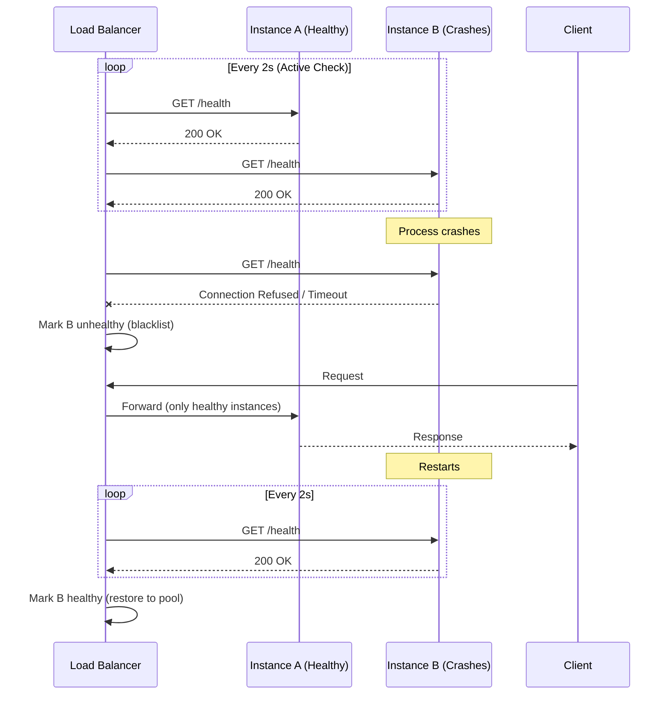
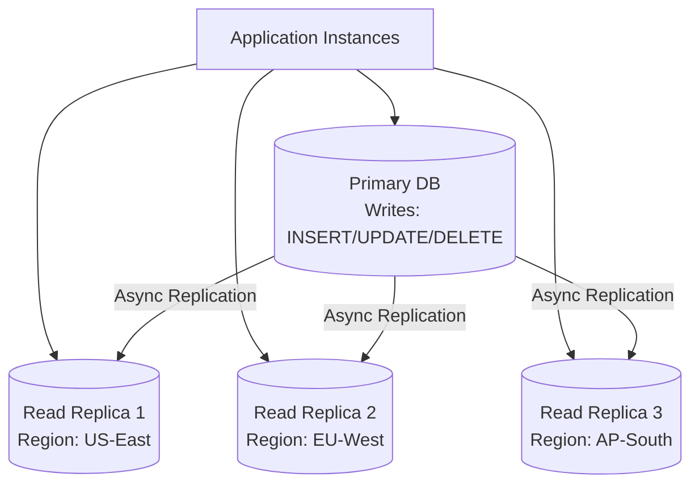
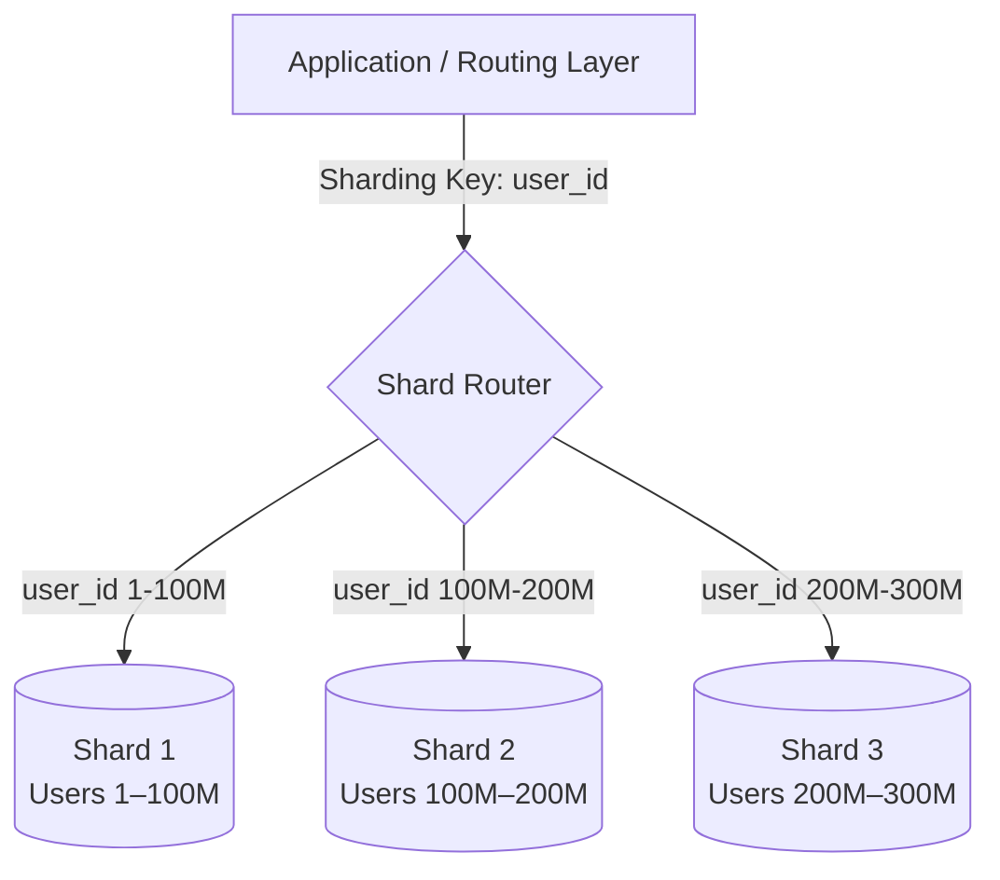
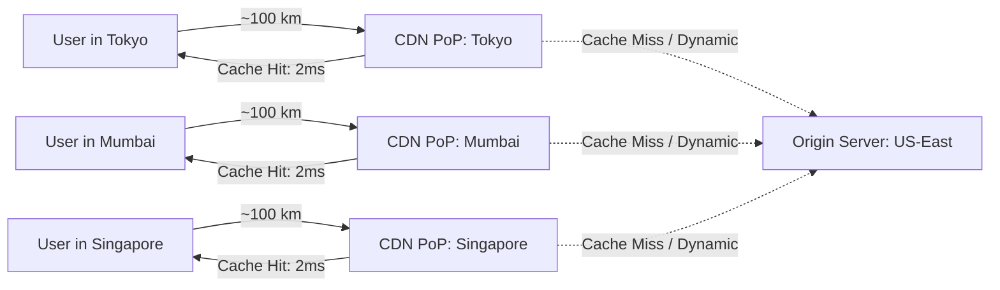
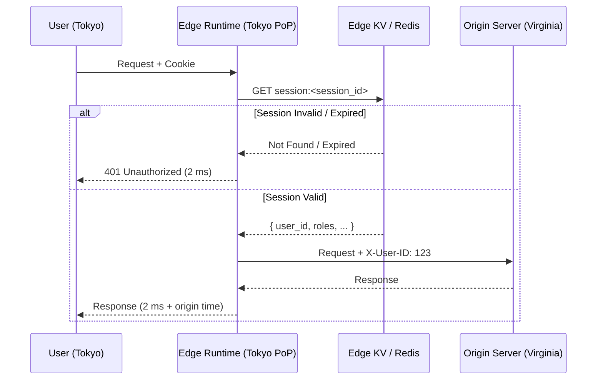
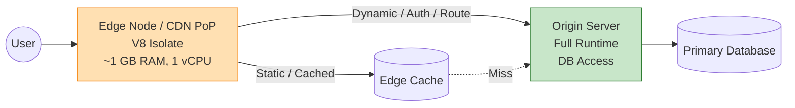
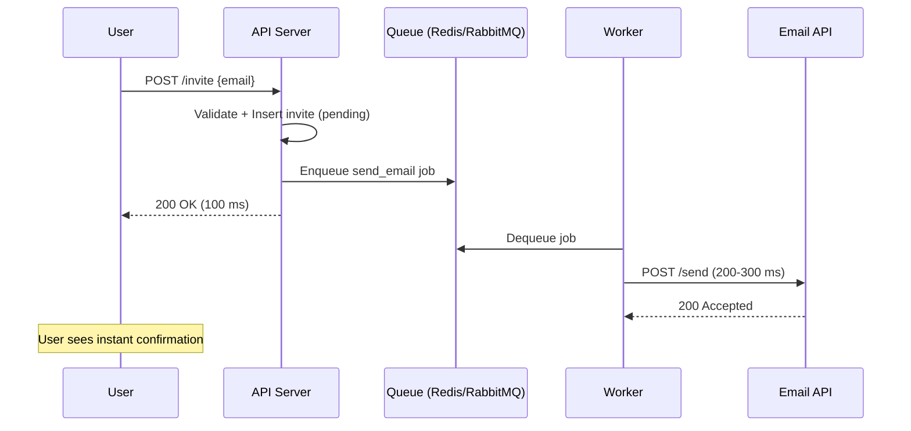
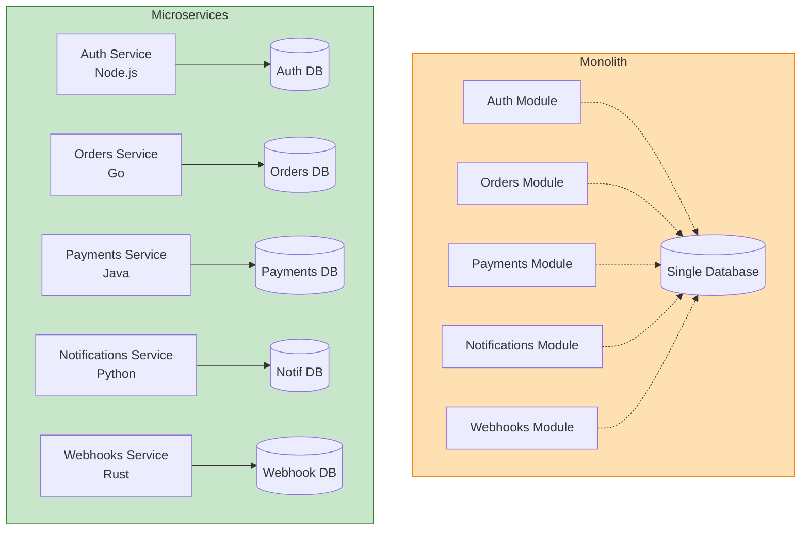
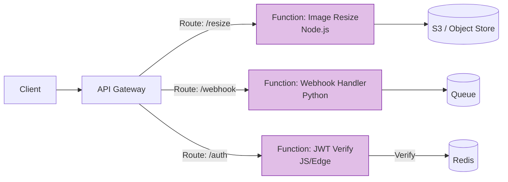

# Part 22 — Backend Scaling and Performance Engineering (Part 2)

> [!info] Video Reference
> **Title:** 21.2. Backend Scaling and Performance Engineering: Part-2
> **Channel:** Sriniously
> **URL:** https://www.youtube.com/watch?v=sOhAopEwjH4
> **Playlist:** Backend from First Principles (Video 22 of 29)
> **Duration:** 2h 18m 10s
> **Published:** December 28, 2025

> [!abstract] In This Chapter
> This chapter continues the deep dive into backend scaling and performance engineering. We cover **statelessness as the prerequisite for horizontal scaling** — why stateful servers break scaling, how to externalize session data (Redis), file storage (S3), and databases (managed services). We then explore **load balancers and their algorithms** — Layer 4 vs Layer 7, round robin, weighted round robin, least connections, least response time, resource-based algorithms, and the critical role of health checks (active vs passive). Finally, we examine **database scaling via read replicas and sharding** — read replica architecture, replication lag and consistency challenges, solutions like read-after-write routing and replication lag tracking, sharding concepts (sharding keys, range-based vs hash-based), and modern distributed databases (PlanetScale, Neon, CockroachDB, Yugabyte). The chapter concludes with an introduction to **CDNs and edge computing** — the physics of latency (speed of light in fiber), CDN architecture (PoPs/edge nodes), caching static assets and API responses, CDN security benefits (DDoS mitigation), and edge computing use cases (authentication at the edge, localization).

### [00:43] Statelessness: The Key to Horizontal Scaling

**Statelessness** is the foundational property that makes horizontal scaling possible. In a horizontally scaled architecture, you run multiple instances of your backend application (Server A, B, C, D) behind a load balancer. For this to work correctly, **no single instance may hold data exclusive to itself**. If Instance D stores session data or uploaded files in its local memory or disk, and a subsequent request from the same user lands on Instance B, that request will fail — B has no access to D's local state. This manifests as confusing 401 errors (user appears logged out) or missing file errors.

> **Stateful** = a server remembers information about clients (sessions, file uploads, in-memory caches) in its own local storage.
> **Stateless** = a server stores **zero** client-specific data locally; all persistent data lives in shared, external systems accessible to every instance.

Horizontal scaling demands planning **from the ground up** — it affects code, infrastructure, and the entire stack. Vertical scaling (adding CPU/RAM to one machine) requires no code changes; horizontal scaling does.

#### Why State Breaks Horizontal Scaling: Two Concrete Examples

**1. Session-Based Authentication (In-Memory Sessions)**
- User authenticates → request hits Instance A
- Instance A creates session, stores session ID in user's browser cookie, **stores session object in its own memory (e.g., a JS Map/array)**
- User makes next request → load balancer routes to Instance B
- Instance B receives session ID cookie, checks its memory → **no session found** → returns 401 Unauthorized
- User experience: randomly logged out, extreme frustration

**Fix:** Externalize session storage. Use **Redis** (or any shared in-memory store) accessible to all instances. Instance A writes session to Redis; Instance B reads from Redis. Every instance sees the same session data.

**2. File Uploads (Local Disk Storage)**
- User uploads file → request hits Instance A
- Instance A saves file to its local SSD
- User requests file → request hits Instance C
- Instance C checks local disk → file not found → error

**Fix:** Upload files to **object storage (S3, Cloudflare R2, MinIO)** — a centralized, shared blob store accessible to all instances.

#### The Statelessness Rule (Thumb Rule)
> **If you're using horizontal scaling, ensure NO piece of information — sessions, files, cache entries, database files (no SQLite on local disk), configuration — lives exclusively in one instance. Centralize everything.**
> - In-memory data → Redis / Memcached
> - Files → S3 / R2 / Blob storage
> - Databases → PostgreSQL, MySQL, managed RDS (not SQLite on local disk)
> - Configuration → Consul, etcd, or config maps

This pattern repeats at every layer: **identify state, externalize it, make it universally accessible.**

---

### [09:11] Load Balancers & Algorithms

A **load balancer (LB)** is the mandatory entry point for any horizontally scaled system. It sits between clients (internet) and your server instances. Every client request hits the LB first; the LB decides **which instance** receives the request, forwards it, receives the response, and returns it to the client — all on the same HTTP connection.

The core responsibility: **the routing algorithm** — the logic that picks the target instance.

#### Load Balancer Placement

```mermaid
graph LR
    Users[Users / Browsers] --> Internet[Internet]
    Internet --> LB[Load Balancer<br/>(Layer 4 or Layer 7)]
    LB --> A[Instance A]
    LB --> B[Instance B]
    LB --> C[Instance C]
    A --> SharedState[(Shared State:<br/>Redis, DB, S3)]
    B --> SharedState
    C --> SharedState
```

**What this diagram shows:** The load balancer sits at the network edge, distributing incoming requests across a pool of stateless application instances. All instances share externalized state (Redis for sessions/cache, database for persistent data, S3 for files). No instance holds local state.

#### Load Balancing Algorithms

| Algorithm | How It Works | Best For | Limitation |
|-----------|--------------|----------|------------|
| **Round Robin** | Rotates requests: A → B → C → A → B → C... | Uniform request cost, identical server capacity | Blind to load; can overload one server with expensive requests |
| **Weighted Round Robin** | Assigns weights by capacity (e.g., 2× requests to 8GB/4-core vs 4GB/2-core) | Heterogeneous server fleet | Still blind to actual request cost / current load |
| **Least Connections** | Tracks active HTTP connections per instance; sends new request to instance with fewest active connections | Variable request latency (some fast, some slow) | Doesn't account for server capacity differences |
| **Weighted Least Connections** | Combines least-connections with server capacity weights | Heterogeneous fleet + variable request cost | More complex; requires accurate capacity metadata |
| **Least Response Time** | Routes to instance returning responses fastest (proxy for load + health) | Latency-sensitive workloads | Can oscillate; needs smoothing |
| **Resource-Based (CPU/Memory)** | Queries server metrics (CPU%, RAM%); routes to least utilized | When you have telemetry / agent on each instance | Requires monitoring infrastructure; added latency to decision |
| **IP Hash / Sticky Sessions** | Hashes client IP to consistently map to same instance | **Anti-pattern for stateless apps**; only for legacy stateful apps | Breaks horizontal scaling; defeats statelessness |

> **Critical Insight:** Round Robin is "mindless" — it distributes evenly but ignorantly. If Request Type 1 takes 200ms (simple DB read) and Request Type 2 takes 2s (external API call + heavy DB write), Round Robin may send three Type-2 requests in a row to Instance A, crushing it while B and C sit idle. **Least Connections** naturally handles this: while A processes the 2s request, its connection count stays high, so new requests go to B and C.

#### Layer 4 vs Layer 7 Load Balancing
- **Layer 4 (Transport/TCP):** Routes based on IP/port only. Fast, low overhead. Cannot inspect HTTP headers, cookies, or URLs.
- **Layer 7 (Application/HTTP):** Inspects HTTP headers, path, cookies, body. Enables path-based routing, cookie-based affinity, TLS termination, WAF integration. Slightly higher latency but far more control.

> Most modern LBs (NGINX, HAProxy, AWS ALB, Cloudflare, GCP Cloud Load Balancing) operate at **Layer 7** by default.

#### Health Checks: Keeping Dead Servers Out of Rotation

Without health checks, a crashed instance (Server A) stays in the rotation. Round Robin keeps sending 1/3 of traffic to it → 502/503 errors for those users.

**Active Health Checks (Standard):**
- LB sends periodic **test requests** (e.g., `GET /health` every 1–5 seconds) to **every** instance
- Expected: `200 OK` (lightweight endpoint, no heavy work)
- On non-2xx / timeout / connection refused → instance marked **unhealthy** → removed from rotation (blacklisted)
- Test requests **continue** during blacklisting; when health returns → instance re-added

**Passive Health Checks (Supplementary):**
- LB monitors **real user traffic** responses
- If an instance returns 5xx / connection errors on live traffic → mark unhealthy immediately
- Faster detection for sudden crashes; active checks catch silent failures (process alive but stuck)

> **Configuration Knobs:** Check interval, timeout, healthy threshold (consecutive successes to re-add), unhealthy threshold (consecutive failures to remove), endpoint path.



**What this diagram shows:** Active health checks continuously probe each instance. When Instance B crashes, the next health check fails (connection refused), and the LB immediately stops routing user traffic to it. User requests go only to healthy Instance A. When B recovers and passes consecutive health checks, it re-enters the pool.

---

### [27:47] Database Scaling: Read Replicas & Sharding

Scaling the **application tier** is straightforward once state is externalized — add more stateless instances behind the LB. The **database tier** is the hard part: databases are **stateful by nature** (they hold data on disk), and data must remain **consistent** across instances. You cannot simply "add more database servers" like you do with app servers.

Two industry-standard patterns: **Read Replicas** (for read-heavy workloads) and **Sharding / Partitioning** (for write throughput and data volume).

#### Read Replicas Architecture



**What this diagram shows:** A single **primary (master)** database handles all writes. One or more **read replicas (secondaries/slaves)** asynchronously replicate data from the primary and serve **read-only** queries (`SELECT`). Replicas can be placed in different geographic regions to reduce latency for local application instances.

**Terminology:** Primary = Master = Writer. Replica = Secondary = Slave = Reader. (Industry is moving toward primary/replica.)

**Benefits:**
1. **Load offloading:** In typical SaaS apps, **70–90% of queries are reads**. Read replicas absorb this load; primary only handles writes (~10–30%).
2. **Latency reduction:** Place replicas near users (e.g., replica in India for Indian users). Reads execute locally instead of crossing oceans.
3. **Linear read scaling:** Add more replicas to handle more read throughput.

**The Consistency Problem: Replication Lag**

Replication is **asynchronous**. When a write commits on the primary, it takes time (milliseconds to seconds) to propagate to replicas. This delay is **replication lag**.

**Concrete Failure Scenario:**
1. User in India updates profile name: `A → B` (write → primary in US)
2. Primary commits, returns `200 OK`
3. User immediately refreshes page → `GET /profile` (read) → routed to **India read replica**
4. Replication lag = 200ms (US → India fiber latency). Replica still has old name `A`.
5. User sees **stale data** (`A`) despite just saving `B`. Confusion, potential data integrity issues for payments/invoices.

**Solutions to Replication Lag (Trade-offs Required):**

| Strategy | How It Works | Trade-off |
|----------|--------------|-----------|
| **Read-After-Write Routing** | After a write to table `users`, route subsequent reads on `users` to **primary** for a short window (e.g., 1–2s) or for that session | Adds routing complexity; primary load increases slightly |
| **Replication Lag Tracking & Blocking** | Monitor lag (e.g., `pg_last_wal_receive_lsn` vs `pg_last_wal_replay_lsn` in Postgres). Block reads until lag < threshold. | Increases read latency; can cause timeouts under high lag |
| **Client-Side Delay** | Frontend waits 300–500ms after write before issuing read | Simple; UX feels slower; doesn't guarantee consistency if lag spikes |
| **Synchronous Replication** | Wait for replica ACK before committing write | **Strong consistency**; but **write latency = cross-region RTT** (100ms+). Defeats geographic latency benefit. |
| **Application-Level Versioning** | Include `version`/`updated_at` in read response; client retries if stale | Pushes complexity to client; eventual consistency model |

> **Key Principle:** Every distributed database solution involves a **consistency trade-off**. You cannot beat physics (speed of light). Choose based on your domain: financial data → strong consistency; social feeds → eventual consistency is fine.

**Modern Managed Databases:** AWS RDS, Google Cloud SQL, Azure Database, PlanetScale, Neon, CockroachDB, YugabyteDB — all offer **one-click read replicas** with built-in replication, failover, and lag monitoring. **Do not self-host replication** unless you have deep DBA expertise.

#### Sharding (Horizontal Partitioning)

When a single table grows to **billions of rows** (e.g., `orders` table for Amazon-scale e-commerce), even indexed queries become slow, and write throughput hits a single-server ceiling.

**Sharding = physically splitting a logical table across multiple database instances (shards).** Each shard holds a disjoint subset of rows.



**What this diagram shows:** The application (or a proxy layer like Vitess, PgBouncer, or custom router) examines the **sharding key** (e.g., `user_id`) and routes the query to the correct shard. Each shard is a separate database instance with identical schema but disjoint data.

**Choosing a Sharding Key — The Critical Decision:**

| Sharding Key | Example | Pros | Cons |
|--------------|---------|------|------|
| **User/Customer ID** | `user_id` for orders, sessions | Natural for multi-tenant; co-locates user's data | Hot shards if power users exist (celebrity accounts) |
| **Tenant/Organization ID** | `org_id` in B2B SaaS | Perfect isolation; easy compliance | Uneven tenant sizes → skew |
| **Geographic Region** | `country_code` | Data locality, sovereignty | Cross-region queries complex |
| **Date/Time** | `order_date` (monthly shards) | Natural for time-series; easy archival | Recent shard gets all writes (hot spot) |
| **Hash of Key** | `hash(user_id) % N` | Uniform distribution | Loses range queries; resharding hard |

**Range-Based Sharding (e.g., Jan–Jun / Jul–Dec):** Simple, supports range queries. Risk: **write hotspot** on current time range.
**Hash-Based Sharding:** Uniform load. Cost: no efficient `WHERE user_id BETWEEN ...`; resharding requires moving all data.

> **Resharding** (changing shard count or key) is a major operational undertaking. Plan shard count for 10× growth. Use **consistent hashing** or tools like **Vitess (MySQL)**, **Citus (Postgres)**, **MongoDB sharding**, **CockroachDB / Yugabyte (auto-sharding)**.

**Modern Distributed SQL Databases (Auto-Sharding + Strong Consistency):**
- **PlanetScale** (MySQL-compatible, Vitess-based, serverless, branching)
- **Neon** (Postgres-compatible, serverless, storage/compute separation, branching)
- **CockroachDB** (Postgres wire-compatible, geo-distributed, strong consistency via Raft)
- **YugabyteDB** (Postgres/Cassandra APIs, geo-distributed, tablet-based sharding)

These handle **sharding, replication, failover, distributed transactions, backups** automatically. **Realistic advice:** As a backend engineer, **use a managed provider**. Understand the concepts (so you can configure regions, backup policies, sharding keys), but don't self-host database infrastructure unless you're a DBA team.

---

### [51:22] Content Delivery Networks (CDNs) — Introduction

> **Note:** The transcript covers CDNs and Edge Computing up to line 3448 (~57:30). The remaining topics (Async Processing, Microservices, Serverless, Key Takeaways) fall in Part 2.

#### The Physics Problem: Speed of Light in Fiber

Light in fiber optic cables travels at **~200,000 km/s** (≈2/3 vacuum speed). The Earth's circumference is ~40,000 km. A request from **Tokyo to US-East (Virginia)** travels ~20,000 km round-trip (undersea cables).

```
Minimum RTT (physics limit) = 20,000 km / 200,000 km/s = 100 ms
```

**100 ms is the absolute floor** — no optimization, no technology can beat it. Real-world RTT is higher (routing, processing, serialization, DB, external APIs). A Tokyo user hitting a Virginia server typically sees **500–800 ms** total latency.

#### CDN Architecture: Bring Content to the Edge

**CDN (Content Delivery Network)** = globally distributed **Points of Presence (PoPs) / Edge Nodes** placed at ISP interconnection points. Instead of Tokyo → Virginia (20,000 km), request goes Tokyo → **Tokyo PoP** (~100–200 km).

```
RTT with CDN edge = ~2–3 ms (vs 100 ms physics floor)
```



**What this diagram shows:** CDN PoPs are deployed at the "edge" of the network — co-located with ISPs. User requests travel a short distance to the nearest PoP. On cache hit, response returns in 2–3 ms. On cache miss, the PoP fetches from the origin (US-East) and caches for next time.

**Three Core CDN Benefits:**
1. **Latency Reduction:** 100 ms → 2–3 ms for cached content (50× improvement).
2. **Origin Offloading:** Cached responses never hit your origin. Origin sees **50%+ less traffic** → fewer servers, lower cost, less scaling pressure.
3. **DDoS Absorption (Security):** Cloudflare, Akamai, Fastly, AWS CloudFront have **terabit-scale networks**. A volumetric DDoS (20,000 bots, Tbps traffic) hits the CDN edge — distributed across thousands of PoPs — **absorbed before reaching your origin**. CDN challenges suspicious traffic (CAPTCHA, JS challenge, rate limiting) at the edge.

#### What to Cache in a CDN

| Content Type | Examples | Cacheability | Invalidation |
|--------------|----------|--------------|--------------|
| **Static Assets** | JS/CSS bundles, HTML (SPA), images, videos, fonts, WASM | **High** — immutable per deploy (content-hashed filenames) | Deploy = new hash = auto-invalidation |
| **Semi-Static API Responses** | Product catalog, category tree, blog posts, config JSON | **Medium** — changes infrequently (hours/days) | Tag-based purge (Cloudflare: `purge by tag`), TTL + stale-while-revalidate |
| **Dynamic/Personalized** | User dashboard, cart, auth-required pages | **Low / Never** — unique per user | Use Edge Computing instead (see below) |

**Cache Invalidation Strategies:**
- **TTL (Time-To-Live):** `Cache-Control: max-age=3600`. Simple; serves stale content until expiry.
- **Stale-While-Revalidate:** Serve stale immediately, async refresh in background. Best UX.
- **Tag-Based Purge (Cloudflare, Fastly):** Tag objects (`user:123`, `product:456`). On update, `purge tag:product:456` → instant global invalidation. **Preferred for API responses.**
- **Full Zone Purge:** Nuclear option; clears everything. Slow propagation (seconds).

---

### [57:30] Edge Computing

> **Continuing from CDN discussion — transcript covers up to line 3448 (~1:05:00 mark)**

#### Edge Nodes vs Edge Computing: The Distinction

| Concept | Traditional CDN (Edge Nodes) | Edge Computing |
|---------|-------------------------------|----------------|
| **Function** | Static file serving (lookup → return) | **Code execution** at the edge |
| **Processing** | None (key-value fetch) | Arbitrary logic: auth, transform, route, A/B test |
| **Runtime** | Nginx / Varnish / custom cache server | V8 Isolates (Cloudflare Workers), Deno (Deno Deploy), WebAssembly (Fastly Compute@Edge), Node.js (Vercel Edge) |
| **Latency** | ~2 ms (cache hit) | ~5–10 ms (code + cache) |
| **Constraints** | Storage only | **CPU time (ms), memory (MB), no persistent disk, no long-running processes** |

**Historical Context:** "Edge" originally meant **CDN edge nodes** — the first network hop after the user's ISP. **Edge Computing** repurposes this infrastructure to **run code**.

#### Why Edge Computing? The Authentication Use Case

**Problem:** Unauthenticated requests from Tokyo travel 100 ms RTT to Virginia, hit the app server, check session in Redis, return **401 Unauthorized**. Waste of bandwidth, server CPU, and user time.

**Edge Computing Solution:**
1. Deploy **auth verification logic** to edge runtime (Cloudflare Worker, Vercel Edge Function).
2. Request from Tokyo → **Tokyo PoP (edge runtime)**
3. Edge code: reads cookie → validates JWT signature locally (no DB call) OR checks session in **edge-key-value store (Cloudflare KV, Workers KV, Upstash Redis)** → **if invalid: return 401 immediately (2 ms)**
4. If valid: forward request to origin (with user context headers)

**Result:** Unauthorized requests **never leave the edge**. Origin only processes legitimate traffic. Latency for rejection: **2 ms vs 100 ms**.



**What this diagram shows:** Authentication moves from the origin to the edge. The edge runtime checks session validity against a globally replicated, low-latency key-value store. Invalid sessions are rejected at the edge in ~2 ms. Valid requests are forwarded to the origin with user identity headers pre-attached.

#### Other Edge Computing Use Cases

| Use Case | Description | Example |
|----------|-------------|---------|
| **Localization / i18n** | Detect `Accept-Language` or geo-IP at edge; serve translated HTML / inject locale headers | Japanese user → edge serves Japanese blog HTML from cache; no origin hit |
| **A/B Testing / Feature Flags** | Assign bucket at edge via cookie; route to different origin paths / inject headers | 10% users → new checkout flow |
| **Bot Detection / WAF** | Run fingerprinting, challenge, rate limiting at edge | Cloudflare Bot Management, custom Workers |
| **Image Optimization** | On-the-fly resize, format conversion (WebP/AVIF), quality adjustment | `image.jpg?w=400&q=75&format=webp` |
| **Edge-Side Includes (ESI)** | Compose page from fragments cached at different TTLs | Header (1h TTL) + Product Grid (5m TTL) + Footer (1h TTL) |
| **Redirects / Rewrites** | Legacy URL migration, country-specific redirects | `/old-page` → `/new-page` at edge |

#### Edge Constraints (Why Not Everything?)

Edge runtimes are **not** full servers:
- **CPU Limit:** 10–50 ms per request (Cloudflare Workers: 10 ms free, 50 ms paid)
- **Memory Limit:** 128 MB typical
- **No Disk:** Ephemeral filesystem only (in-memory)
- **No Long-Running:** No background threads, no WebSockets (mostly), no streaming large bodies
- **Cold Starts:** V8 isolates start fast (~0–5 ms) but add variance
- **Cost:** Pay per request + CPU time (cheaper than origin at scale, but not free)

> **Rule:** Use edge for **fast, stateless, low-compute** tasks (auth, routing, transformation, caching logic). Keep **heavy business logic, DB transactions, external API orchestration** at the origin.

---

## Content — Part 2

### [01:11:18] Edge Computing: Constraints and Realities

The video opens Part 2 by returning to **edge computing**, picking up from the CDN discussion in Part 1. Edge nodes—often hosted at ISP infrastructure in collaboration with providers like Cloudflare and AWS—are **resource-constrained** by design. Unlike robust data center servers with 8–16 GB RAM and multiple CPU cores, edge nodes typically offer ~1 GB RAM and a single core. This constraint exists because their primary responsibility remains **routing internet requests**; CDN functionality is a secondary collaboration.

> **Key insight:** Edge computing is fundamentally **latency-driven**. The canonical example is **Cloudflare Workers**, which use **V8 isolates** (the JavaScript runtime from Chrome) instead of full Node.js processes. This allows near-instant startup but imposes strict runtime constraints: no file system access, no raw TCP sockets, limited CPU time, and a subset of Web APIs.

These constraints mean edge nodes **cannot replace origin servers**. They excel at **strategic logic** that benefits from proximity to the user:
- Authentication / JWT validation
- User customization (A/B testing, feature flags)
- Request validation & sanitization
- Routing decisions (which origin pool to hit)
- Bot detection / rate limiting at the edge

The architecture is **hybrid**: edge nodes handle latency-sensitive preamble work; origin servers handle heavy computation, database access, and durable state.



**What this diagram shows:** A request hits the edge node first. Static/cached responses serve immediately. Dynamic requests requiring auth, routing, or validation are processed at the edge (using V8 isolates) and then forwarded to the origin server for heavy lifting. The origin has full runtime capabilities and database access.

---

### [01:13:43] Asynchronous Processing: Reducing Perceived Latency

The next major topic is **asynchronous processing**—one of the earliest and highest-leverage scaling levers. Unlike horizontal scaling (triggered at user-count thresholds), async processing should be adopted **from day one** because its benefits are immediate and architectural.

#### Synchronous vs. Asynchronous Behavior

**Synchronous (blocking) flow:**
1. User sends request (e.g., update profile name A → B)
2. Server validates, runs `UPDATE users SET name='B' RETURNING id`
3. **Only after DB confirms**, server returns `200 OK`
4. User sees updated name on refresh

This is correct for **strong-consistency** operations (profile edits, payments). But many operations don't require the user to see the result *instantly*.

**Asynchronous (non-blocking) flow — Example: Team Invite**
1. User invites `one@gmail.com` to workspace
2. Server validates, inserts row into `invites` table (`status: 'pending'`) — ~50–100 ms
3. **Instead of calling SendGrid/Mailchimp synchronously (200–300 ms)**, server:
   - Pushes `send_invite_email` job to a queue (Redis, RabbitMQ)
   - Returns `200 OK` immediately (~100 ms total)
4. Background **worker/consumer** picks up job, calls email API, handles retries
5. User sees "Invited" toast instantly; invite email arrives seconds later

**Perceived latency drops from ~400 ms to ~100 ms**—a 4× improvement—without changing infrastructure.



**What this diagram shows:** The API server does minimal work (validation + DB insert), enqueues the email task, and returns immediately. A separate worker process dequeues and calls the external email provider asynchronously. The user experiences ~100 ms latency instead of ~400 ms.

#### When to Use Async Processing

| Operation | Sync? | Reason |
|-----------|-------|--------|
| Profile update | ✅ | User expects immediate consistency |
| Payment processing | ✅ | Strong consistency required |
| Send email / notification | ❌ | User doesn't need instant confirmation |
| Video/image processing | ❌ | Long-running; user expects delay |
| Bulk data deletion | ❌ | Can take seconds/minutes |
| Webhook delivery | ❌ | Retry logic, external dependency |
| Report generation | ❌ | Heavy computation |

#### Queue Infrastructure

- **Redis + BullMQ (Node.js)** — popular, managed options (Upstash, Redis Cloud)
- **RabbitMQ** — robust, supports complex routing, dead-letter queues
- **Kafka** — event streaming, high throughput, replay capability
- **Workers/Consumers** — can run in same process (dev) or separate deployable units (prod) for independent horizontal scaling

#### Example: Account Deletion (Bulk Operation)

A user with 1M todos clicks "Delete Account." Synchronous deletion across 8 tables = ~8 seconds of spinner. **Async alternative:**
1. Verify auth + user exists (~50 ms)
2. Enqueue `delete_user_data` job with `user_id`
3. Return `200 OK` → user logged out instantly
4. Worker runs cascade deletes in background (5–30 s, doesn't matter)

This pattern—**validate fast, enqueue heavy work, respond immediately**—is the essence of async processing.

---

### [01:30:44] Microservices vs. Monolith: The Team-Scaling Trade-off

#### What Is a Monolith?

A **monolith** = single deployable unit. All functionality (auth, orders, payments, notifications, webhooks) lives in one codebase, one repository, one process (or multiple identical processes under a load balancer). Modules interact via **in-process function calls**.

**Advantages:**
- Simple to develop, test, deploy, refactor
- Single deployment pipeline
- Easy debugging (all logs in one place)
- No network latency between modules
- Transactional consistency across domains (single DB)

#### Why Microservices? (It's Not Primarily About Performance)

> "Microservices are primarily **not** about scaling your machine's performance. They're about **scaling your team**."

Microservices become relevant when **organizational complexity** exceeds what a monolith can cleanly support:

| Driver | Monolith Pain | Microservice Relief |
|--------|---------------|---------------------|
| **Large team (100+ devs)** | Deployment conflicts: Team A's ready change blocked by Team B's WIP on `main` | Independent deployments per service |
| **Independent scaling needs** | Notification service (light) scaled same as Payment service (heavy) | Scale each service to its own load profile |
| **Polyglot tech stack** | Markdown rendering needs Node.js npm pkg; image processing needs Go/Rust for CPU perf | Each service uses optimal language/runtime |
| **Clear domain boundaries** | Tight coupling, shared DB schema migrations | Owned databases, explicit APIs |



**What this diagram shows:** Side-by-side comparison. Monolith: all modules in one process, shared database, single deployment. Microservices: each service independently deployed, written in its optimal language, owns its database, communicates via network APIs.

#### The Cost of Microservices (Distributed Systems Complexity)

| Complexity | Description |
|------------|-------------|
| **Network latency** | Function calls → HTTP/gRPC calls (1–5 ms each hop) |
| **Partial failures** | Network partitions, timeouts, retries, circuit breakers needed |
| **Debugging** | Distributed tracing required (Jaeger, Zipkin); logs scattered across services |
| **Data consistency** | Each service owns its DB → replication lag, eventual consistency, saga patterns for transactions |
| **Operational overhead** | Service discovery, config management, CI/CD per service, observability stack |

#### When to Actually Adopt Microservices

**Prerequisites (all should be true):**
- ✅ Team > 100–200 engineers with clear ownership boundaries
- ✅ Distinct scaling profiles per domain (payments ≠ notifications)
- ✅ Genuine need for polyglot runtimes
- ✅ Organizational maturity to operate distributed systems

**Otherwise:** Stay with a **modular monolith** (clean internal boundaries, single deployment). Complexity has a cost—every added component is another failure domain, monitoring target, and cognitive load.

---

### [01:44:30] Serverless: The "No Ops" Scaling Model

#### The Problem: Capacity Planning Hell

Traditional model: Provision VMs (EC2, etc.) with fixed CPU/RAM *before* traffic arrives.
- **Under-provision** → traffic spike → crashes, lost users, revenue loss
- **Over-provision** → pay for idle capacity (32 GB RAM used at 20% = 5× waste)

**Autoscaling** helps but has limits:
1. **Spin-up time**: Boot OS → configure app → register with LB = seconds to minutes
2. **Reactive, not predictive**: Scales *after* threshold crossed (already overloaded)
3. **Max-instance cap**: Set too low → under-provision; too high → runaway costs (DDoS = $100k/day)
4. **Always-on minimum**: Pay for baseline capacity 24/7 even at zero traffic

#### Serverless Computing Model

**Core idea:** You provide **code (functions)** + **triggers (events)**. Provider manages everything else.

```
Traditional:          Serverless:
┌─────────────┐       ┌─────────────┐
│   Your VM   │       │  Function   │  ← You manage only this
│  (OS, runtime,     │  (code only)│
│  config, etc.)     └──────┬──────┘
└─────────────┘             │
        │                   ▼
        │            ┌─────────────┐
        │            │ API Gateway │  ← Routes HTTP → function
        │            └─────────────┘
        │                   │
        ▼                   ▼
   Always running      Spin up on demand
   Pay 24/7            Pay per invocation (ms)
```

**Execution flow:**
1. Request hits **API Gateway** (routes by path/method)
2. Gateway invokes mapped **function** (cold start if no warm instance)
3. Function runs → returns response
4. Instance stays warm for ~seconds (configurable) → reused for next request
5. If idle → terminated (no cost)

#### Pricing Model Comparison

| Model | Cost Basis |
|-------|------------|
| Traditional VM | $/hour × instance count × 730 hrs/mo (always on) |
| Serverless | $/million invocations + $/GB-seconds × actual execution time |

**Savings:** Sporadic/unpredictable workloads (image processing, webhooks, cron jobs) can be **10–100× cheaper**.

#### Cold Starts: The Achilles' Heel

Since no instance exists until first request, **cold start latency** = OS boot + runtime init + code load.

| Provider | Tech | Cold Start |
|----------|------|------------|
| AWS Lambda | Firecracker microVMs | ~50–200 ms (improving) |
| Cloudflare Workers | V8 Isolates | **~0–5 ms** (no OS boot, JS-only) |
| Vercel/Netlify | Various | ~100–500 ms |

**Mitigations:**
- **Provisioned concurrency** (Lambda) / **warm pools** — keep N instances warm (costs money, defeats purpose if overused)
- **Language choice**: Interpreted (JS, Python) < compiled (Java, Go, Rust) for cold start
- **Edge runtimes**: Cloudflare Workers, Deno Deploy — isolate-based, near-zero cold start

#### Serverless Trade-offs

| Limitation | Impact |
|------------|--------|
| **Execution time limit** | Lambda: 15 min max; no long-running HTTP/websockets |
| **Statelessness** | No local state, no persistent TCP/DB connections, no in-memory caches |
| **Connection pooling** | Each invocation = new DB connection → needs proxy (RDS Proxy, PgBouncer) or serverless DB (Neon, PlanetScale) |
| **Vendor lock-in** | API Gateway, event formats, limits differ per provider |
| **Debugging** | No SSH, limited logging, distributed tracing harder |

#### When Serverless Shines

- **Event-driven workloads**: Queue consumers, webhook handlers, DB change triggers
- **Sporadic compute**: Image/video processing, PDF generation, cron jobs
- **API backends with variable traffic**: MVP/internal tools, bursty workloads
- **Edge logic**: Auth, routing, transformation at CDN edge (Cloudflare Workers)

#### When to Avoid

- Latency-critical user-facing paths (payments, banking)
- Long-running connections (websockets, streaming)
- High-throughput steady-state services (better on containers/K8s)
- Teams without serverless operational experience



**What this diagram shows:** API Gateway routes different paths to different serverless functions. Each function is independently deployed, written in its optimal language, and scales automatically. Functions are stateless and communicate with external stores (S3, Queue, Redis) for persistence.

---

## Key Takeaways

1. **Edge computing extends CDNs with code execution** (V8 isolates, Workers) but is resource-constrained. Use for auth, routing, validation—not heavy compute.
2. **Asynchronous processing is a day-one architectural decision**. Offload non-critical-path work (emails, notifications, video processing, bulk deletes) to queues (Redis/RabbitMQ/Kafka) to slash perceived latency.
3. **Microservices solve organizational scaling, not machine scaling**. Adopt only with large teams (100+), independent scaling needs, or polyglot requirements. The distributed systems tax (network, debugging, consistency) is steep.
4. **Modular monoliths are underrated**. Clean internal boundaries + single deployment + shared DB = simpler operations for most teams.
5. **Serverless = functions + events, no server management**. Pay-per-invocation, auto-scale to zero. Best for sporadic, event-driven workloads. Cold starts and statelessness are the main trade-offs.
6. **Observability from day one is non-negotiable**. You cannot optimize what you cannot measure. Logs, metrics, traces → identify bottlenecks *before* applying solutions.
7. **Scale for the problems you have, not hypothetical millions**. Build for current load + reasonable headroom. Let measured bottlenecks drive architecture evolution.
8. **Complexity is a cost**. Every added component (cache, queue, service, DB) is a failure domain. Only accept complexity when simplicity is genuinely insufficient.

---

## Related Notes

- **MOC**: [[_00 - Backend from First Principles - Index]]
- **Previous**: [[21 - Backend Scaling and Performance Engineering (Part 1)]]
- **Next**: [[23 - Object Storage - Everything You Need to Know (Part 1)]]
- **Referenced**: [[14 - Task Queues and Background Jobs]] (async processing deep dive)
- **Referenced**: [[25 - Real-Time Backends]] (websockets, serverless limitations)

---

> [!note] Source fidelity
> This chapter is derived from the **second half** (lines 3449–6896) of the transcript for "21.2. Backend Scaling and Performance Engineering: Part-2" (video ID: `sOhAopEwjH4`). Timestamps mapped to `[mm:ss]` format for readability. All technical claims, examples (team invite, account deletion, YouTube video processing, markdown/image processing polyglot), and architectural diagrams reflect the speaker's content. Ambiguous transcript segments marked with ⇢ *inferred*. Mermaid diagrams are synthesized from verbal descriptions.
>
> Part 1 covered: latency/throughput fundamentals, vertical/horizontal scaling, caching (Redis, write-through/back), database optimization (indexing, query plans), read replicas, sharding, and CDN basics. This part completes the scaling picture with edge compute, async patterns, microservices trade-offs, and serverless.