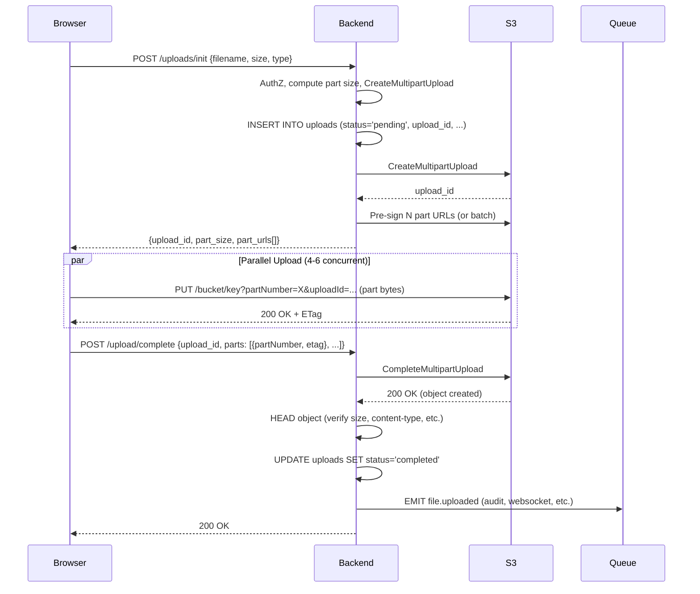

# Part 25 — Object Storage - Everything You Need to Know (Part 2)

> [!info] Video Reference
> **Title:** 24. Object Storage - Everything You Need to Know: Part - 2
> **Channel:** Sriniously
> **URL:** https://www.youtube.com/watch?v=iWrVCxexUWY
> **Duration:** 49 min 37 sec (2977 seconds)
> **Published:** 2026-08-27
> **Playlist Position:** 25 of 29 in "Backend from First Principles"

> [!abstract] In This Chapter
> This chapter completes the deep dive into object storage for backend engineers. It covers why a single PUT request fails for large files, the mechanics of multipart upload (create, upload part, complete, abort), choosing part sizes within the 10,000-part cap, the ETag trap on multipart objects, abandoned uploads that silently consume storage, combining pre-signed URLs with multipart for browser-based large file uploads, resumable uploads, a 2 GB demo with 125 parts at 5 concurrent, download patterns (never proxy through your server), pre-signed GET URLs and their cache-killing problem, range requests (206 Partial Content, Content-Range, 416 Range Not Satisfiable) for seeking, resuming, and parallel downloads, segmented streaming with HLS/DASH, and the three cost dimensions: storage, operations, and egress.

### [00:00] Why a Single PUT Stops Working

The video opens by stating that everything covered so far—single PUT uploads with pre-signed URLs—works well for files up to a few hundred megabytes. Beyond that, a single PUT request stops working for approximately four distinct reasons.

**Reason 1: The 5 GB Hard Limit**
A single PUT request cannot exceed 5 GB. This is not a specification limit enforced by your backend; it is enforced by the object storage API itself. If your product accepts large videos, CAD files, database dumps, wedding footage, or drone footage—files that tend to be very large—you are architecturally required to implement something other than a single PUT.

**Reason 2: All-or-Nothing Semantics**
A single PUT is atomic: it either succeeds completely or fails completely. If you are uploading a 5 GB file and reach 4.8 GB when your Wi-Fi blinks (e.g., switching from primary to backup connection), the upload is cancelled. There is no resume button. The next attempt starts from zero. On a typical mobile network (not professional Wi-Fi with 100–200 Mbps), a 5 GB transfer takes 20–30 minutes. A single network glitch during that window forces a full restart. Network glitches are common on mobile connections.

**Reason 3: Throughput Limitation of a Single TCP Connection**
A single TCP connection (which underlies HTTP) cannot saturate a network link. Throughput is bounded roughly by the TCP window size divided by the round-trip time (RTT), and it is extremely sensitive to packet loss. Lose one packet, and the entire congestion window collapses, forcing it to climb back up. You might have a 200 Mbps or 500 Mbps connection, yet a single-stream upload stays at ~30 Mbps. The fix is at the network level: more connections. Multiple parallel streams each get their own congestion window; if one stalls, the others continue. This is why download managers (Internet Download Manager, Free Download Manager) achieve higher speeds—they open 8+ parallel connections for the same resource.

**Reason 4: Poor User Experience**
With a single PUT, progress reporting is rough and imprecise. There is no ability to pause, and no ability to survive interruptions (network error, tab close, browser crash). All these reasons necessitate **multipart upload**.

---

### [04:30] Multipart Upload: The Three Calls

Multipart upload is a protocol consisting of only three core calls (plus a fourth for aborting).

#### Step 1: Create Multipart Upload
You tell the object storage service the bucket, key, content type, and any metadata. In return, you receive an **upload ID**. This upload ID represents a **staging area**—analogous to Git's staging area. It is a phase before the final commit. Parts accumulate here, but **nothing exists at the key yet**. A GET request for that key returns 404 Not Found because the object has not been created until the final commit.

#### Step 2: Upload Part (Once Per Chunk)
For each chunk, you send the upload ID, a part number (1-based), and the bytes. Critical properties:
- Each part is a completely independent HTTP request.
- Parts can go **in parallel** and **in any order**. Part 7 can arrive before Part 2.
- No ordering constraint exists.
- If a part fails, it can be retried individually without affecting other parts.
- Each successful part returns an **ETag**. You **must keep these ETags**—they are required for the final completion call.

#### Step 3: Complete Multipart Upload
You send the upload ID plus the complete ordered list of part numbers and their ETags. The service combines them into a single object. The surprising part: **the completion call takes the same time regardless of object size or part count**. Even for a 50 GB object with thousands of parts, completion is fast because it is a **metadata operation**, not a data operation. The service records the logical structure (which parts, in what order) rather than physically concatenating 50 GB of data. This illustrates the separation between the **metadata plane** (fast, lightweight) and the **data plane** (heavy lifting already done during part uploads).

---

### [08:16] Choosing the Part Size, and the 10,000 Part Cap

There is a hard cap of **10,000 parts** per multipart upload. This means the part size you choose directly determines the maximum file size you can upload.

**The Formula**
If you use a default part size of 5 MB: 5 MB × 10,000 = 50 GB maximum. A 60 GB file would fail exactly at part 10,001—after 50 GB has already been transferred, an expensive failure.

**Correct Approach: Dynamic Part Size**
Compute the part size dynamically based on file size:
```
part_size = max(default_part_size, file_size / 10,000)
```
- Use a default (floor) of 16–32 MB. This handles files up to 160–320 GB without special logic.
- For larger files, the division by 10,000 kicks in automatically.

**Why Not Just Use Huge Parts?**
The part size is your **retry granularity**. If a 500 MB part fails on a mobile connection, you must re-upload 500 MB. With 16–32 MB parts, retries are cheap. The sweet spot: **16–64 MB maximum**. This balances part count (staying under 10,000) and retry cost.

> **Key Insight**: Part size affects memory usage on the client. The browser reads file slices lazily (via `File.prototype.slice()` returning a `Blob`), so memory usage ≈ part size × concurrency, not the full file size.

---

### [11:45] The ETag Trap on Multipart Objects

For a normal single PUT, the ETag is the **MD5 hash of the object's contents**. Many developers write integrity checks: hash the file locally, compare with the returned ETag, and if they match, the upload was clean.

**The Trap**: On multipart uploads, the ETag is **not** the MD5 of the full file. It is the **MD5 of each part's binary MD5 hash, concatenated, then MD5-hashed again**, followed by a hyphen and the part count (e.g., `-42`).

```
ETag_multipart = MD5(MD5(part1) + MD5(part2) + ... + MD5(partN)) + "-" + N
```

If you need true end-to-end integrity, **do not use ETag**. Options:
1. **Checksum feature (modern SDKs)**: AWS S3 SDKs compute CRC32C or SHA-256 per part and let you request full-object checksum verification.
2. **Client-side hash + metadata**: Compute SHA-256 on the client, send as user metadata, verify in a background job after upload. This also gives you **deduplication for free** (same hash = same content).

---

### [13:41] Abandoned Uploads: The Storage You Pay For and Cannot See

When a multipart upload fails halfway (e.g., 300 parts × 32 MB = ~10 GB in staging) and the user closes the tab—**neither `CompleteMultipartUpload` nor `AbortMultipartUpload` is called**—those 10 GB remain stored. You are billed for them every month forever, yet:
- They do **not** appear in bucket listings (`ListObjects` only returns committed objects).
- They do **not** appear in the console.
- They are invisible unless you explicitly call `ListMultipartUploads` (AWS CLI: `aws s3api list-multipart-uploads`).

**Demo Evidence**: The instructor showed a bucket with one visible 184 MB object. `list-multipart-uploads` revealed three abandoned uploads initiated days prior, totaling ~460 MB of invisible, billable storage.

**Solution: Lifecycle Rule**
Add a lifecycle rule to **abort incomplete multipart uploads after 7 days**. This is a configuration you should set on **every production bucket before writing any code**. Seven days is a good default: it costs nothing and permanently closes the leak.

---

### [16:01] Pre-signed URLs and Multipart: The Full Architecture

Combining pre-signed URLs (from Part 1) with multipart upload gives the production architecture for browser-based large file uploads.



**Four Implementation Notes**
1. **Don't pre-sign 10,000 URLs up front**. The JSON response would be megabytes. Instead, pre-sign in batches (e.g., 100 at a time) as the browser progresses.
2. **Concurrency: 4–6 parallel PUTs** is the sweet spot. More fights for bandwidth across devices/processes.
3. **Browser reads file slices lazily** via `File.prototype.slice()` → `Blob`. Memory ≈ part size × concurrency, not file size.
4. **CORS: Expose `ETag` header** in your bucket's CORS config (`ExposeHeaders: ETag`). Otherwise, browser JS cannot read the ETag from the part upload response, and completion fails.

**Resumable Uploads (Automatic Capability)**
After a page refresh, the browser asks: "Do I have an upload in progress for this file?" Backend checks the DB for a `pending` row, calls `ListParts` with the upload ID to discover which parts S3 already has, then returns fresh pre-signed URLs **only for missing parts**. The client resumes from that point (e.g., part 341) instead of starting from zero.

---

### [22:28] Demo: 2 GB Upload, 125 Parts, Five at a Time

The demo uploads a 2 GB file:
- Part size: **16 MB**
- Total parts: **125**
- Concurrency: **5 parallel uploads**

A grid visualization shows:
- **Gray**: waiting
- **Blue (blinking)**: in-flight (5 at a time)
- **Green**: completed

The progress bar is **computed client-side** from stable numbers (parts done, parts waiting, parts in-flight), so it moves smoothly without glitching. Network panel shows 125 separate PUT requests going **directly to the bucket's domain**, not through the backend. Rate/ETA are computed client-side from part completion timing.

---

### [25:01] Downloads: Never Proxy Them Through Your Server

**First Rule**: Do not relay/proxy downloads through your application backend.

**Why?**
1. **Worker consumption**: Your handler does `GetObject` → streams bytes to response. This ties up a server worker (Go routine, event loop, thread) for the entire download duration.
2. **Bandwidth cost**: You pay for data traversing your infrastructure (egress from cloud provider to your server, then egress from your server to client).
3. **Slow**: Compared to CDN (zero bandwidth cost, global edge nodes), your server is in 1–3 regions. CDN servers are worldwide.

**Ideal**: Data goes **directly from bucket → client**, or **bucket → CDN → client**. Never through your server.

---

### [27:46] Pattern 1: Public Bucket or CDN in Front of Private Bucket

If content is **objectively public** (website assets, CSS bundles, product images, public PDFs):
- Make the bucket public, **or better**: put a CDN (CloudFront, Cloudflare) in front of a **private** bucket.
- Only the CDN reads the bucket.
- Set long `Cache-Control` and use **content-addressed keys** (key = hash of contents, e.g., SHA-256).
- When content changes, the key (URL) changes automatically—no cache invalidation needed.
- Cheapest and fastest option.

---

### [29:03] Pattern 2: Pre-signed GET, and Why It Kills Your Cache

For private content, use **pre-signed GET URLs** (similar to pre-signed PUT):
1. Browser requests `/download?file=...`
2. Backend authorizes (checks user access)
3. Backend returns pre-signed GET URL (valid 5–15 min)
4. Browser fetches directly from S3

**The Cache Problem**: A pre-signed URL contains a **timestamp + signature**. Every request generates a **different URL**. From the CDN's perspective, each is a **different resource** → **cache hit rate = 0%**. You pay for full egress; CDN does nothing.

**Fix 1 (Cheap): Align Expiry to Hour Boundaries**
Instead of "valid for 15 minutes from now", sign "valid until top of next hour". All users in that hour get the same URL → CDN caches. Trade-off: slightly looser expiry precision.

**Fix 2 (Proper, at Scale): CDN Signed URLs / Signed Cookies**
Move authorization to the **edge**. CDN (CloudFront, Cloudflare) has its own signed URLs or signed cookies. Authorization happens at edge nodes worldwide; CDN controls caching; backend is uninvolved. Especially convenient for video: a single session pulls hundreds/thousands of segments—signing each at the backend would be prohibitive.

---

### [32:51] Range Requests: 206, Content-Range, and 416

**Range Requests** let the client request a byte range: `Range: bytes=1000000-2000000`.

**HTTP Semantics (Not Object Storage Invention)**
- Client sends `Range` header.
- Server responds **206 Partial Content** + `Content-Range: bytes 1000000-2000000/5000000` (which bytes, total size).
- If range is invalid/unsatisfiable → **416 Range Not Satisfiable**.

Because object storage speaks HTTP natively, it supports range requests natively. Combine HTTP's client-side range capability with S3's server-side range support → powerful patterns.

---

### [34:46] What Ranges Unlock: Seeking, Resuming, Parallel Downloads

**1. Seeking (Video Scrubbing)**
User drags scrubber to 30:00. Browser reads file index (e.g., MP4 moov atom), calculates byte offset for 30:00, issues `Range: bytes=X-`. CDN/S3 returns from that byte. Playback starts instantly—no download of first 30 minutes.

**2. Resumable Downloads**
Download manager reaches byte 400M, connection drops. On retry, it requests `Range: bytes=400000000-`. Continues from exact interruption point.

**3. Parallel Downloads (Download Manager Speed Boost)**
Open 6 connections, each requests a different range:
- Conn 1: `bytes=0-9999999`
- Conn 2: `bytes=10000000-19999999`
- ...
Each gets its own TCP congestion window. Combined throughput saturates the link. This is how download managers "boost speed" without changing physical bandwidth.

---

### [37:11] Demo: Range Requests Against MinIO

The instructor demonstrates with `curl` against a local MinIO instance:
- `curl -H "Range: bytes=0-99" ...` → **206 Partial Content**, `Content-Range: bytes 0-99/...`
- `curl -H "Range: bytes=0-7" ... | xxd` → PNG header bytes (`89 50 4E 47 0D 0A 1A 0A`). **File type identified without downloading the whole file.**
- Resume demo: start download, kill it, resume with `curl -C -` (or explicit `Range` for missing bytes). MinIO serves only the requested ranges.

---

### [39:04] Segmented Streaming, HLS and DASH

**Limitation of Range Requests on a Single File**: There is exactly **one version** of the file. But streaming platforms (Netflix, YouTube, Prime Video, Hotstar) serve **different quality versions** based on the user's connection.

**Segmented Streaming (HLS / DASH) Architecture**:
1. **Transcode** original into multiple quality levels (1080p, 720p, 480p, ...).
2. **Segment** each quality into small chunks (few seconds each, e.g., `.ts` or `.m4s` files).
3. Write a **manifest file** (`.m3u8` for HLS, `.mpd` for DASH) listing segments and their mappings.
4. **Client player**: Fetches manifest → fetches segments sequentially → measures download speed per segment → **adaptively switches quality** (Adaptive Bitrate / ABR).

**Key Insight**: **Nothing changes on the object storage side**. Segments are objects. Manifest is an object. Object storage + CDN = everything you need for a video streaming platform. The hard engineering is the **transcoding pipeline** (queues, workers, background jobs triggered on upload)—not the serving.

**Recommendation**: If video is a small feature → use hosted video service (Mux, Bunny). If video IS the product (90% of platform) → build the pipeline yourself for cost control.

---

### [41:40] What Changes on the Storage Side (Nothing)

Reiterated: Object storage treats segments and manifests as ordinary objects. No special configuration. The complexity lives in the transcoding/processing layer, not the storage layer.

---

### [43:18] Cost: Storage, Operations, and Egress

Three billable dimensions:

| Dimension | Unit | Notes |
|-----------|------|-------|
| **Storage** | $/GB/month | Primary cost for data at rest. |
| **Operations** | $/million requests | **Writes (PUT, POST, multipart complete, etc.) ≈ 10× more expensive than reads (GET, HEAD).** |
| **Egress** | $/GB out | Data leaving the cloud provider. Major cost for downloads. |

**Cloudflare R2** is notable for **free egress**—no charge for data leaving R2. Significant if your app has high download volume.

Pricing changes every few years; always check the provider's current pricing page.

---

### [45:14] Recap of Both Parts (Parts 1 & 2)

1. **Object storage exists** because local filesystems don't scale. Trade mutability (no in-place edit, rename, folders, locks) for infinite capacity, 11 nines durability, HTTP interface.
2. **Object = key + bytes + metadata** in a flat namespace (bucket). Folders = string prefix grouping. Generate keys yourself: high-entropy prefix, encode ownership, set metadata at write time (can't update metadata without rewrite).
3. **Metadata plane + Data plane**. Durability via **erasure coding** (cheaper, stronger than replication).
4. **Durability ≠ Backup**. Backup = versioning + cross-region replication (explicit, not default).
5. **Never `ListObjects` on bucket** for app logic. Use your database to track files/users. `ListObjects` is for ops/debugging.
6. **Small files**: Stream through your server with body size limit.
7. **Large files**: Direct browser → bucket via **pre-signed URLs**. Use **pre-signed POST with `content-length-range`**, never plain pre-signed PUT (unlimited write capability = abuse vector).
8. **Record upload intent in DB before start**. On completion, verify with `HEAD`, then run background cleanup for abandoned uploads.
9. **Multipart for large files**: Create → parallel parts → complete. Compute part size dynamically (`max(default, size/10000)`). Don't trust multipart ETags. **Lifecycle rule: abort incomplete after 7 days on every bucket.**
10. **Downloads**: Never proxy through server. Pre-signed GET + CDN (private bucket). Watch cache-hit-killing with per-request signed URLs; align expiry or use CDN signed URLs/cookies at edge.
11. **Range requests (206, Content-Range, 416)** enable seeking, resumable downloads, parallel downloads. Natively supported.
12. **Video streaming**: Segmented (HLS/DASH) + adaptive bitrate. Storage side unchanged; hard part is transcoding pipeline.
13. **Cost**: Storage (GB/mo), Operations (req, writes 10× reads), Egress (GB out). Cloudflare R2 = free egress.

## Key Takeaways

1. **Single PUT fails at scale** due to: 5 GB hard limit, all-or-nothing semantics, single-TCP-connection throughput ceiling, and poor UX (no pause/resume/progress).
2. **Multipart upload = 3 calls**: Create (staging area + upload ID), Upload Part (independent, parallel, any order, per-part ETag), Complete (metadata-only, instant regardless of size).
3. **Part size choice is critical**: Hard cap of 10,000 parts. Use `max(default_part_size, file_size / 10000)`. Default 16–32 MB handles up to 160–320 GB. Larger parts = expensive retries; smaller parts = more overhead. Sweet spot: 16–64 MB.
4. **Multipart ETag ≠ file MD5**. It's `MD5(MD5(part1)+...+MD5(partN))-N`. For integrity, use SDK checksums (CRC32C/SHA-256) or client-computed SHA-256 in user metadata.
5. **Abandoned multipart uploads are invisible but billable**. They don't appear in `ListObjects` or console. Fix: lifecycle rule to abort incomplete uploads after 7 days on **every bucket from day one**.
6. **Pre-signed URLs + multipart = browser large-file architecture**. Backend creates upload, pre-signs part URLs in batches, browser uploads in parallel (4–6), calls complete, backend verifies with HEAD, emits event. Expose `ETag` in CORS.
7. **Resumable uploads come free**: On page refresh, backend lists completed parts via `ListParts`, returns pre-signed URLs only for missing parts.
8. **Never proxy downloads through your server**. It burns workers, bandwidth, and latency. Use direct bucket or CDN.
9. **Public content**: Public bucket or CDN + private bucket + content-addressed keys (hash-based) + long cache.
10. **Private content**: Pre-signed GET. **Warning**: per-request signatures kill CDN caching. Fix: align expiry to hour boundaries, or use CDN signed URLs/cookies at edge.
11. **Range requests (206/Content-Range/416)** unlock video seeking, resumable downloads, parallel downloads. Native HTTP + S3 support.
12. **Segmented streaming (HLS/DASH)**: Transcode → segment → manifest. Adaptive bitrate via client-side bandwidth measurement. Storage side unchanged; hard engineering is transcoding pipeline.
13. **Cost model**: Storage ($/GB/mo), Operations ($/M req, writes ~10× reads), Egress ($/GB out). Cloudflare R2 offers free egress.

## Related Notes

- **MOC**: [[_00 - Backend from First Principles - Index]]
- **Previous**: [[24 - Object Storage - Everything You Need to Know (Part 1)]]
- **Next**: [[26 - Real-Time Backends]]

> [!note] Source Fidelity
> This chapter was generated from the full timestamped transcript of "24. Object Storage - Everything You Need to Know: Part - 2" (video ID: iWrVCxexUWY, 2977 seconds, published 2026-08-27). Every concept, example, number, and architectural pattern described in the video has been preserved. Transcript caption errors (e.g., "multi-art" → "multipart", "mgabyte" → "MB", "course" → "CORS", "menu" → "MinIO", "cash it" → "cache hit") have been silently corrected. Ambiguous or inferred content is marked with ⇢ *inferred*. Mermaid diagrams represent the verbally described architectures. The recap section synthesizes both Part 1 and Part 2 as presented in the video's conclusion.