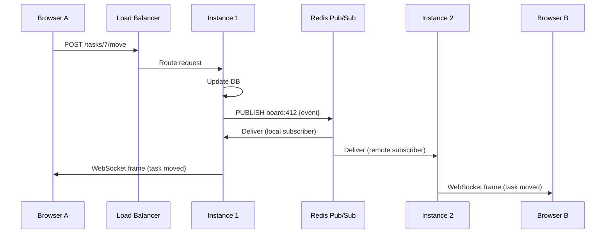

# Part 26 — Real-Time Backends

> [!info] Video reference
> **Title:** 25. Real-Time Backends
> **Channel:** Sriniously
> **Playlist:** Backend from First Principles (Video 26 of 29)
> **URL:** https://www.youtube.com/watch?v=wUQryt697cs
> **Duration:** 51 min 53 sec (3113 seconds)
> **Published:** 2026-08-29

> [!abstract] In this chapter
> We explore the fundamental challenge of real-time backends: the server cannot initiate communication in the traditional HTTP request-response model. Starting from a concrete product requirement—two users viewing the same task board, where a drag-and-drop by one must appear instantly on the other's screen—we trace the evolution of solutions: **polling** (simple but wasteful), **long polling** (reduces latency but introduces a reconnection gap), **Server-Sent Events (SSE)** (one-way server→client streaming over HTTP with native browser reconnection), and **WebSockets** (full-duplex bidirectional communication over a single TCP connection after an HTTP Upgrade handshake). We then examine the **scaling challenges** of persistent connections: file descriptor limits, port exhaustion (the four-tuple), per-connection memory overhead, and the **statefulness problem** when multiple server instances sit behind a load balancer. The solution is **publish/subscribe** (Redis, NATS, Kafka) to fan out events across instances, with careful attention to **delivery guarantees** (at-most-once vs. at-least-once), **catch-up mechanisms** (sequence IDs, `Last-Event-ID`), **fan-out scaling** (sharding delivery work), and **reconnect storms** (edge caching). This chapter provides the network-level foundations for chat, live dashboards, collaborative editing, and notifications.

---

### [00:00] The Fundamental Constraint: Client-Initiated Communication

Up to this point in the course, every backend we have built—authentication, database handlers, services, repositories, caching, background jobs, object storage—has followed exactly one interaction pattern: **the browser asks a question, and the server answers it**. The client always initiates; the server can only reply. It has no mechanism to speak first. It can hold a connection open for a long time (as we saw with streaming responses), but it cannot *start* a conversation.

> [!quote] "So far whatever we have been doing it's always have been the case that the client initiates the conversation. The client starts the communication. The server cannot start the communication. It has no mechanism to speak first."

This constraint becomes a problem the moment we need **live updates**. Consider a task management application: two users view the same board. User A drags a task from "To-Do" to "In Progress." User B, halfway across the world, should see that task move *live*—not on page refresh, not on navigation, but immediately. The server learns of the change (via User A's POST request), but it has no way to push that information to User B's browser because User B hasn't asked for anything recently.

---

### [02:26] Polling: The Intuitive First Attempt

The most intuitive workaround is **polling**: the client repeatedly asks the server "has anything changed?" in a loop.

**Mechanism:** Every 3 seconds (or whatever interval), the browser sends an HTTP GET request to an endpoint like `/board/412/changes?since=<timestamp>`. The server checks its database, serializes a response (either the specific change or a "nothing changed" signal), and returns JSON. Most of the time, the answer is "no."

**Demo observation:** In the video's side-by-side browser demo, two counters track "requests sent" and "changes detected." The vast majority of polls increment only the request counter—the "unchanged" counter. Polling *works* for internal tools with few users, but it fails at scale.

---

### [05:20] What Polling Costs: The Economics of Waste

**Latency:** With a 3-second interval, a change waits on average 1.5 seconds (half the interval) before the next poll catches it. To reduce latency, you must poll faster.

**Compute cost scales with users, not events:**  
- 10,000 concurrent users × 1 poll/3 sec = ~3,333 requests/second  
- Drop interval to 1 second → 10,000 requests/second  
- Each request traverses: load balancer → auth middleware (token validation) → logging middleware → service layer → database query → JSON serialization  
- **3,000–10,000 database queries/second**, nearly all returning "nothing changed"

**The cost model is inverted:** You pay for the *communication medium* (requests), not the *value* (events). A board with zero activity all day costs the same as a board with changes every second.

**Mobile battery impact:** Every poll on a phone wakes the **radio**—one of the most power-hungry components. Polling drains battery and data plan for zero user value.

> [!summary] Polling Summary
> - ✅ Simple, works everywhere, fine for low-scale internal tools
> - ❌ Latency = half the poll interval
> - ❌ Cost ∝ (users × poll frequency), not ∝ events
> - ❌ Wastes database, CPU, network, battery
> - ❌ No backpressure or prioritization

---

### [10:25] Long Polling: Holding the Request Open

**Idea:** Instead of the server replying immediately, the client sends a request and the server *holds it open* until something changes (or a timeout, e.g., 60 seconds). When an event occurs, the server writes the response and closes the request. The client processes it and immediately opens a new long-poll request.

**RFC 6202** documents this pattern and its flaws.

**The fatal gap:** After the server responds, the client must:
1. Process the response
2. Open a fresh TCP connection (or reuse a keep-alive)
3. Send a new request

During this window, **the server has no connection to the client**. If an event occurs in that gap, it is missed or delayed until the next long-poll cycle. RFC 6202 notes average latency ~1 network RTT, but worst case >3 RTTs due to this gap.

---

### [11:57] Server-Sent Events (SSE): The Stream That Never Ends

**Core insight:** What if the long-poll response *never ends*? The client makes a normal HTTP GET request. The server replies `200 OK` with header `Content-Type: text/event-stream` and **keeps the connection open indefinitely**. Whenever an event occurs, the server writes a small text chunk into the same response stream. The connection stays alive as long as the browser tab is open.

#### SSE Wire Format (WHATWG Standard)

Each event is a small text block with up to four fields:

```
id: 42
event: task-moved
data: {"taskId": "7", "from": "todo", "to": "in-progress"}
retry: 3000

```

- **`id`** — Unique sequence number. Enables **resume**: on reconnect, the browser automatically sends a `Last-Event-ID` header with the last received ID, so the server can replay missed events.
- **`event`** — Optional event type name (e.g., `task-moved`, `task-deleted`). Allows client-side dispatch.
- **`data`** — Payload (typically JSON). Can span multiple lines.
- **`retry`** — Milliseconds the browser should wait before reconnecting after a drop.

**Browser-native superpowers:**
- Automatic reconnection with exponential backoff (no custom JS needed)
- Automatic `Last-Event-ID` header on reconnect
- Works over standard HTTP/1.1 and HTTP/2 (multiplexed)
- No CORS preflight complexity beyond normal fetch

#### Real-World SSE at Scale

> [!example] Production SSE Users
> - **Uber's driver dispatch platform** (trip assignments → drivers)
> - **LinkedIn instant messaging** (typing indicators, read receipts)
> - **Every LLM streaming API** (OpenAI, Anthropic, etc.) — token-by-token streaming uses SSE

SSE is **not a toy**. It is a production-grade, standards-based, widely deployed technology.

---

### [18:16] SSE's Limitation: One Direction Only

The name says it: **Server-Sent Events**. The server can stream to the client all day, but **the client cannot send data back over the same connection**.

In our task board example: User B receives live updates via SSE. But when User B drags a task, that action *must* be a separate `POST /tasks/7/move` request. It cannot share the SSE connection. For many products (notifications, dashboards, LLM streaming), this is fine. For collaborative apps where both directions need low latency on the *same* logical channel, we need bidirectional communication.

---

### [19:21] The WebSocket Handshake: From HTTP to Bidirectional Frames

**WebSocket** gives us **full-duplex, bidirectional communication over a single TCP connection**. It starts as HTTP, then **upgrades**.

#### Handshake Sequence

1. **Client → Server (HTTP GET):**
   ```
   GET /echo HTTP/1.1
   Host: localhost:7821
   Upgrade: websocket
   Connection: Upgrade
   Sec-WebSocket-Key: <16 random bytes, base64>
   Sec-WebSocket-Version: 13
   ```

2. **Server → Client (HTTP 101 Switching Protocols):**
   ```
   HTTP/1.1 101 Switching Protocols
   Upgrade: websocket
   Connection: Upgrade
   Sec-WebSocket-Accept: <SHA-1(key + "258EAFA5-E914-47DA-95CA-C5AB0DC85B11"), base64>
   ```

3. **Protocol switch:** The TCP connection stays open, but **HTTP is gone**. No headers, no methods, no status codes. It is now a bidirectional stream of **WebSocket frames**.

#### Why the `Sec-WebSocket-Key` / `Accept` Dance?

The fixed GUID (`258EAFA5-E914-47DA-95CA-C5AB0DC85B11`) is **not for security**—anyone can compute the accept value. Its purpose: **prove the responder understood the WebSocket upgrade request** and isn't a caching proxy replaying a stale `200 OK` response.

> [!note] The handshake travels through all existing HTTP infrastructure (load balancers, proxies, CDNs) because it *is* HTTP until the `101` response. This is a major deployment advantage.

---

### [22:25] WebSocket Frames and the Mask Bit

After the handshake, data flows as **frames**. RFC 6455 defines the frame structure:

```
 0                   1                   2                   3
 0 1 2 3 4 5 6 7 8 9 0 1 2 3 4 5 6 7 8 9 0 1 2 3 4 5 6 7 8 9 0 1
+-+-+-+-+-+-+-+-+-+-+-+-+-+-+-+-+-+-+-+-+-+-+-+-+-+-+-+-+-+-+-+-+
|F|R|R|R| opcode|M| Payload len |    Extended payload length    |
|I|S|S|S|  (4)  |A|     (7)     |             (16/64)           |
|N|V|V|V|       |S|             |   (if payload len==126/127)   |
| |1|2|3|       |K|             |                               |
+-+-+-+-+-+-+-+-+-+-+-+-+-+-+-+-+-+-+-+-+-+-+-+-+-+-+-+-+-+-+-+-+
|     Extended payload length continued, if payload len == 127  |
+---------------------------------------------------------------+
|                               |Masking-key, if MASK set to 1  |
+-------------------------------+-------------------------------+
| Masking-key (continued)       |          Payload Data         |
+---------------------------------------------------------------+
:                     Payload Data continued ...                :
+---------------------------------------------------------------+
```

**Field breakdown:**
| Field | Bits | Meaning |
|-------|------|---------|
| **FIN** | 1 | Last fragment of a message |
| **RSV1-3** | 3 | Reserved for extensions (e.g., compression) |
| **Opcode** | 4 | Frame type: `0x1`=text, `0x2`=binary, `0x8`=close, `0x9`=ping, `0xA`=pong, `0x0`=continuation |
| **MASK** | 1 | **Must be 1 for client→server frames** |
| **Payload length** | 7/16/64 | Efficient encoding: <126 = inline; 126 = 16-bit extended; 127 = 64-bit extended |
| **Masking key** | 32 | Present only if MASK=1 (client→server) |
| **Payload** | variable | XOR-masked if MASK=1 |

**Header overhead:** **2 bytes** for small frames (<126 bytes payload). Compare to ~200+ bytes of HTTP headers per poll request.

#### The Mask Bit: Not Encryption, Proxy Poisoning Defense

**Every client→server frame is masked:** each payload byte is XORed with a 4-byte random key (sent in clear in the frame). The key **must be unpredictable** (crypto-random per frame).

**Why?** To prevent **cache poisoning attacks on intermediaries** (discovered during protocol design):
1. Attacker's malicious page opens WebSocket to attacker-controlled server
2. Attacker sends crafted bytes that *look like* `GET /analytics.js HTTP/1.1`...
3. A naive caching proxy (not understanding WebSocket) sees "request + response" and caches the "response"
4. Victims behind that proxy get attacker's payload when requesting the real `analytics.js`

**Masking defeats this:** The attacker chooses the *pre-mask* bytes, but cannot control the *on-wire* bytes because the browser applies a random XOR key the attacker's JS cannot predict. The proxy sees garbage, not a valid HTTP request.

> [!important] Masking protects the *infrastructure*, not your data privacy. Use `wss://` (TLS) for confidentiality.

---

### [26:48] Ping/Pong: Detecting Dead Connections

**TCP problem:** If a client disappears (phone enters elevator, Wi-Fi→LTE handoff, laptop lid closed), **the server receives no notification**. No FIN, no RST, no error. An idle TCP connection and a dead one look identical: *nothing happens*.

**Solution:** Application-level heartbeat.
- Either side sends a **ping** (opcode `0x9`, arbitrary payload)
- The other side **must** reply with **pong** (opcode `0xA`, same payload)
- Typical timeout: **30 seconds** without pong → connection considered dead, resources freed

This is the *only* way to distinguish "idle but alive" from "gone forever" at the application layer.

---

### [29:06] Scaling Persistent Connections: One Machine Limits

We now have bidirectional, low-overhead connections. How many can a single machine hold?

**Test setup:** Linux, 16 cores, 61 GB RAM. Minimal Go WebSocket server: `accept()` + hold. No app logic.

#### Limit 1: File Descriptors (ulimit)

In Unix, **everything is a file**—sockets included. Each connection consumes a file descriptor (fd).

```
$ ulimit -n
1024   # default soft limit on many distros
```

Test: 2,000 connection attempts → stops at **1,017** (1,024 minus ~7 for stdio, listening socket, epoll fd, runtime overhead).

**Language matters:**
- Node/Python/Java: inherit OS default (~1,024) unless explicitly raised
- **Go runtime automatically raises soft limit to ~1,048,575** (max-1) on startup because it uses `epoll`/`kqueue`/`IOCP`, not `select()` (which has `FD_SETSIZE` limit)

> [!tip] If you're not on Go, you *must* configure `ulimit -n` (and `/etc/security/limits.conf`, systemd `LimitNOFILE`, container `--ulimit`) before deploying WebSocket servers.

#### Limit 2: Client Port Exhaustion (The Four-Tuple)

After raising fd limit to 1M, test stops at **~28,190** connections with error: `cannot assign requested address`.

**Why?** The *client* (load test tool) runs out of **ephemeral source ports**.

- Kernel port range: `32768–60999` → **28,232** available ports
- Each outgoing connection consumes one (source IP, source port, dest IP, dest port) **four-tuple**
- Server has fixed (dest IP, dest port). Client has fixed source IP. Only **source port** varies.

**Fix:** Give the client multiple source IPs. With 3 IPs × 25k ports = 75,000 concurrent connections to the *same* server IP:port. Server holds 75k fds successfully.

> [!key-insight] The "65K connection limit per server" myth confuses *server listening port* with *client ephemeral ports*. The server's limit is file descriptors + memory. The *client* (or load tester) hits port exhaustion first.

#### Limit 3: Memory Per Connection

At 75,000 connections:
- Process RSS: **722 MB** (baseline ~7.5 MB)
- **~9.6–9.9 KB heap per connection** (measured 3×: 9,510 / 9,881 / 9,881 bytes)

**Breakdown:** Most is **not the socket kernel struct**. It's the **user-space per-connection state**: Go goroutine (~2 KB stack), read/write buffers, application structs.

**Projection:** 1 million idle connections ≈ **10 GB heap** + kernel overhead. Fits in 61 GB RAM.

**Optimization for extreme scale:** Use `epoll`/`kqueue`/`IOCP` directly (single thread watches all sockets) instead of 1 goroutine/thread per connection. This is what `libuv` (Node), `netty` (Java), `asyncio` (Python), and custom C++ servers do.

---

### [38:46] The Second Machine: Stateful Connections Meet Stateless Architecture

**The core conflict:** We spent the entire course making backends **stateless**—any instance can serve any request. But a **WebSocket connection is state**: it lives in one process's memory (goroutine + socket + "this socket subscribes to board 412"). It cannot be moved or shared.

**Scenario:** Two server instances behind a load balancer.
- Browser A → Instance 1 (WebSocket established, subscribed to board 412)
- Browser B → Instance 2 (WebSocket established, subscribed to board 412)
- User A moves a task → POST hits Instance 1 → Instance 1 updates DB → Instance 1 writes frame to Browser A's socket
- **Browser B sees nothing.** Instance 2 has no knowledge of the event.

**Sticky sessions (load balancer affinity) don't solve this:** They keep Browser A on Instance 1, but Browser B is *still on Instance 2* and still misses the update.

---

### [40:51] Publish/Subscribe: The Standard Solution

**Architecture:** When Instance 1 receives the task-move event, it **publishes** to a topic (e.g., `board:412`). A message broker (Redis Pub/Sub, NATS, Kafka, Pulsar) delivers the message to **all subscribed instances**. Each instance checks its local connections for subscribers to `board:412` and writes the frame.

```
┌─────────────┐     ┌──────────────┐     ┌─────────────┐
│  Instance 1 │────▶│  Redis Pub/Sub│────▶│  Instance 2 │
│  (receiver) │     │  (broker)    │     │  (delivers) │
└─────────────┘     └──────────────┘     └─────────────┘
      │                    │                    │
      ▼                    ▼                    ▼
  Browser A           (fan-out)            Browser B
```

**Mermaid diagram:**



> **What this diagram shows:** The publish/subscribe pattern decouples the instance that *receives* a state-changing request from the instances that *deliver* real-time updates. The message broker fans out the event to all instances, each of which pushes to its locally connected clients. This preserves horizontal scalability while maintaining the illusion of a single shared connection space.

---

### [42:51] Delivery Guarantees: At-Most-Once vs. At-Least-Once

**Redis Pub/Sub is "fire and forget" (at-most-once):**
- If an instance is disconnected *at the exact moment* a message is published, **the message is lost forever**.
- No queue, no retry, no persistence.

**Scenario:** Deployment rolls Instance 2. In the seconds between old container death and new container readiness, all events for Browser B are dropped. Browser B only sees them on next full refresh.

**If you need at-least-once:** Use a **log-based broker** (Kafka, Redis Streams, Pulsar, NATS JetStream) that:
- Persists messages
- Tracks consumer offsets (sequence numbers)
- Supports replay on reconnect

**Catch-up strategy (same pattern as SSE `Last-Event-ID`):**
1. Client connects, sends `last_seen_seq: 0`
2. Server streams messages with increasing sequence numbers
3. On reconnect, client sends `last_seen_seq: 42`
4. Server replays from 43 onward

**Uber's push platform does exactly this.**

---

### [45:53] Fan-Out Scaling: The Discord Problem

**Fan-out cost:** One event → *N* subscribers = *N* socket writes.

**Discord case study:** Communities with 30,000 concurrent members. Publishing one message took **900 ms – 2.1 seconds** because a single process had to write 30,000 frames.

**Solution:** **Shard the fan-out.** Distribute recipients across multiple machines. Each machine delivers to only the connections it *owns*. The publisher fans out to *shards*, not individual connections. This is how Discord, Slack, and WhatsApp scale.

---

### [45:53] Reconnect Storms: The Thundering Herd

**Scenario:** Instance with 50,000 connections crashes (or deploys). All 50,000 clients reconnect **simultaneously**. Each needs initial state (boards, tasks, presence) → **50,000 expensive requests in 1 second**. This can take down the database and origin servers.

**Slack's fix:** **Edge cache** (CDN / edge workers) holds the "initial state payload" for each client. On reconnect storm:
- Clients hit the edge
- Edge serves cached initial state (cheap, no origin hit)
- Origin only receives incremental updates

This pattern—**making the connect path cheap**—is essential for production real-time systems.

---

### [48:27] Summary: The Evolution of Real-Time

| Approach | Direction | Latency | Cost Model | Complexity | Scale Limits |
|----------|-----------|---------|------------|------------|--------------|
| **Polling** | Client→Server only | ~½ interval | ∝ users × frequency | Trivial | DB/CPU bound |
| **Long Poll** | Client→Server (held) | ~1 RTT + gap | ∝ users | Medium | Gap loses events |
| **SSE** | Server→Client only | ~0 (push) | ∝ events | Low | One-way only |
| **WebSocket** | Full duplex | ~0 (push) | ∝ events + connections | Higher | fd, ports, memory, state |

**The complete production stack:**
1. **WebSocket** (or SSE if one-way suffices) for transport
2. **Per-connection state** in instance memory (subscription sets)
3. **Pub/Sub broker** (Redis Streams / Kafka / NATS) for cross-instance fan-out
4. **Sequence IDs** on every message for catch-up on reconnect
5. **Sharded fan-out** for high-subscriber-count channels
6. **Edge-cached initial state** to absorb reconnect storms
6. **Ping/pong heartbeats** (30s) to detect dead sockets
7. **TLS (wss://)** for encryption + proxy traversal
8. **Monitoring:** connection count, message throughput, fan-out latency, memory/connection

---

## Key Takeaways

1. **HTTP is half-duplex by design.** Real-time requires the server to speak first—polling simulates this poorly.
2. **Polling costs scale with users, not value.** SSE/WebSocket cost scales with *events*.
3. **SSE is production-grade.** Used by Uber, LinkedIn, every LLM API. Native browser reconnection + `Last-Event-ID` = robust one-way streaming.
4. **WebSocket = HTTP Upgrade + framed bidirectional stream.** 2-byte frame headers, masking for proxy safety, ping/pong for liveness.
5. **Single-machine limits are predictable:** file descriptors (configurable), client ephemeral ports (four-tuple, fix with multiple client IPs), memory (~10 KB/connection in Go).
6. **Persistent connections = state.** This breaks stateless horizontal scaling. The fix is **pub/sub** across instances.
7. **Redis Pub/Sub = at-most-once.** For durability, use Kafka/Redis Streams/NATS JetStream with sequence IDs and replay.
8. **Fan-out is O(subscribers).** Shard delivery across machines for large channels.
9. **Reconnect storms are real.** Cache initial state at the edge (Slack pattern).
10. **Collaborative editing, presence, CRDTs** are *application-layer* problems built on this transport foundation.

---

## Related Notes

- **MOC:** [[_00 - Backend from First Principles - Index]]
- **Previous:** [[25 - Object Storage - Everything You Need to Know (Part 2)]]
- **Next:** [[27 - Testing for Backend Engineers]]

---

> [!note] Source fidelity
> This chapter is a comprehensive transcription and expansion of the YouTube video "25. Real-Time Backends" (video ID: wUQryt697cs) from the "Backend from First Principles" playlist by Sriniously. All technical explanations, demos, measurements (file descriptor limits, port range math, per-connection memory), architecture diagrams, and examples (Uber, LinkedIn, Discord, Slack, LLM streaming) are drawn directly from the video transcript. Mermaid diagrams and structural headings were added for study-guide clarity. Ambiguous transcript segments (e.g., specific Go runtime version behavior) are marked with ⇢ *inferred* where applicable.

