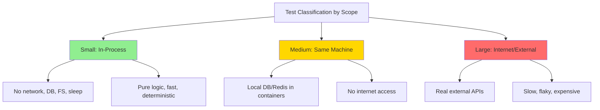
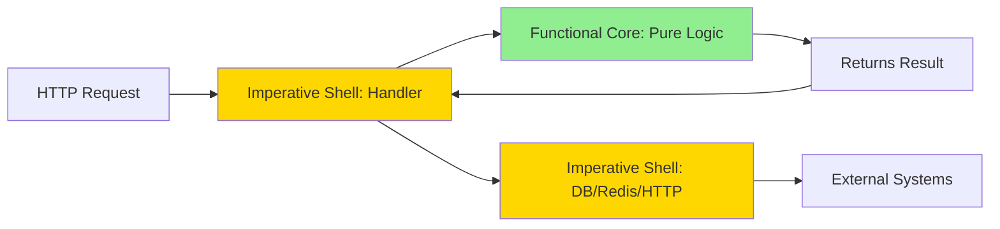
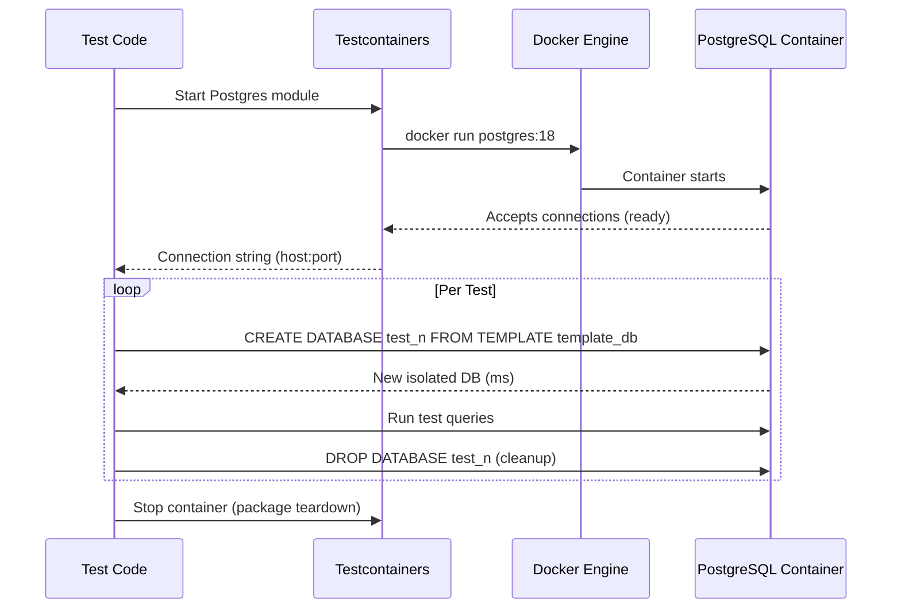

# Part 27 — Testing for Backend Engineers

> [!info] Video reference
> **Title:** 26. Testing for Backend Engineers: mocks, TDD and coverage  
> **Channel:** Sriniously  
> **URL:** https://www.youtube.com/watch?v=HgVrfHX92y4  
> **Playlist:** Backend from First Principles (video 27 of 29)  
> **Duration:** 1h 24m 32s (5072 seconds)  
> **Published:** 2026-08-31

> [!abstract] In this chapter
> - Why testing was intentionally deferred until now — bad tests are worse than no tests
> - What a test fundamentally is: a second program that runs your program with predetermined inputs and asserts on outputs
> - Test runner mechanics: how `go test` generates a `main` function, compiles a test binary, and executes it
> - Unit, integration, and end-to-end tests defined by *scope* (what the test touches: in-process, same-machine, or internet)
> - The test pyramid reframed as a cost model: small/medium/large tests based on external dependencies
> - Test doubles taxonomy: dummy, stub, spy, mock, fake — with precise definitions and when to use each
> - State verification vs. interaction verification (behavior verification) and the "change detector test" anti-pattern
> - Dependency injection and the functional core / imperative shell architecture for testability
> - Testing databases with real Postgres via Testcontainers (template databases, transaction rollback)
> - Network testing with in-process HTTP test servers (Go's `httptest`, Node's MSW)
> - Time control in tests: wait for conditions/signals, not durations; inject a clock
> - Hermetic tests: tests that bring their own environment and clean up after themselves
> - TDD (Red–Green–Refactor): design feedback in Red, proof in Green, cleanup in Refactor
> - When TDD helps (known outputs: parsers, pricing rules, state machines) vs. when it hinders (exploratory feature work)
> - Flaky test causes: async/await misuse, concurrency, test order dependency — and fixes (quarantine, delete, don't retry)
> - Code coverage: line vs. branch, what 100% coverage with zero assertions means, the 60/75/90 benchmarks
> - Mutation testing with Stryker: damaging your code to see if tests notice
> - Cyclomatic complexity (McCabe) vs. cognitive complexity (SonarSource) — nesting vs. branching
> - Static analysis toolchain: linters (pattern checkers), formatters, type checkers, static analyzers

## [00:00] A Backend with Zero Tests — Why Testing Was Deferred

Over the preceding 26 videos, the course built a substantial backend (HTTP, WebSockets, databases, real-time pub/sub, authentication, rate limiting, etc.) without writing a single test. This was intentional. **A bad test — written in a hurry, incomplete, or asserting the wrong thing — is more harmful than no test at all** because it gives a false sense of confidence. The course deferred testing until the concepts themselves were understood, so that testing could be treated as a first-class topic with proper justification.

The application under test is the same **task board** from the real-time video: a Go codebase of ~11 files organized as:
- `cmd/board` — the binary entry point (`main` wires everything together)
- `internal/board` — domain logic (tasks, columns, business rules)
- `internal/hub` — WebSocket room management with per-subscriber counters
- `internal/bus` — event bus interface with two implementations: in-process (for tests) and Redis-backed (for production)
- `internal/store` — storage interface with PostgreSQL implementation
- `internal/httpapi` — route table (all endpoints in one file)

No tests exist yet. The video uses Go for concreteness, but concepts are language-agnostic.

---

## [00:48] What a Test Actually Is

> **Definition:** A test is a **second program** that runs your program. It calls your existing code with **inputs you decide beforehand**, observes the **output**, and **complains** (throws error, panics, fails) if the output does not match expectations.

Even without any testing framework, if you write a normal function that calls your backend code and uses an `if` statement to check the result (`if output != expected { throw error }`), **that is a test**. Frameworks and libraries exist only to avoid reinventing:
- **Test runner** — finds test files, executes them, collects results, prints a report (pass/fail counts). In Go, `go test` generates a `_testmain.go` with a `main` function that registers all test functions and calls `testing.MainStart`, compiles it into a binary (e.g., `board.test`), and runs it.
- **Assertion helpers** — `assert.Equal`, `assert.NotNil`, etc. (Go uses `if` + `t.Errorf` directly; other languages need explicit assertion libraries with **meaningful failure messages** so debuggers know *what* failed and *why*).

**Regression** — a bug you already fixed that comes back — is the primary thing tests catch. In CI (GitHub Actions, etc.), the test suite runs on every PR before merge. If a new change breaks an old feature, the test fails instantly, letting you fix it before users complain. This is what enables **rapid, confident feature development**.

---

## [08:58] The First Test — Red Then Green

The first test creates a board, moves a task between columns, and asserts the task ended up in the expected column. The speaker intentionally writes the wrong expectation (`done` instead of `doing`) to demonstrate a **failing test (Red)**, then fixes the expectation and watches it **pass (Green)**.

Behind the scenes, `go test -work` keeps the build directory, revealing the generated `_testmain.go` that:
1. Collects all `TestXxx` functions into a slice
2. Provides a `main` that calls `testing.MainStart`
3. Compiles to a test binary (`board.test`) and executes it

This confirms: **a test is a program; a test runner writes `main`, compiles, runs, reports.**

---

## [14:46] Unit, Integration, End-to-End Tests

### Unit Test
Tests **one unit of code in isolation**. What constitutes a "unit" has **no universal definition** — it could be a function, struct, package, or service. You learn to recognize it over time.

A function that calls three helpers can be unit-tested two ways:
1. Let it call the real helpers (still a unit test)
2. Hand it **mocks/stubs** for the helpers (also a unit test)

Both are valid unit tests; the distinction is not about mocking.

### Integration Test
Tests **two or more parts working together**. Typically: your application + an external dependency you didn't write (database, message broker, payment provider). You bypass authentication middleware, etc., because you control the internals.

### End-to-End (E2E) Test
Tests the **entire system as a real user would**: authentication → session → dashboard → create task → etc. It must follow **every single path a user takes**. No bypassing.

---

## [19:52] The Test Pyramid and Test Sizes — A Practical Mental Model

The classic pyramid (wide unit base, few integration, cap of E2E) is about **cost**: higher = more expensive (CPU, memory, time) and slower.

**Better mental model (used at Google and elsewhere): classify by what the test is *allowed to touch*.**

| Size | Scope | Touches | Does NOT Touch |
|------|-------|---------|----------------|
| **Small** | In-process | Only your code, same process | Network, DB, filesystem, `sleep()` |
| **Medium** | Same machine | Local DB (container), Redis (container), local services | Internet, external APIs |
| **Large** | Anything | Internet, external services, any external dependency | — |

**Why this model wins:**
- **Enforceable:** The machine can *check* if a test opened a socket (flakiness lives in external calls). You can't enforce "is this a unit test?" — no universal definition.
- **Eliminates flakiness:** Small tests are deterministic (no network, no external clocks). Medium tests are mostly deterministic (local only). Large tests are where flakiness lives.
- **Practical:** "Does this test leave the process?" is a binary, checkable question.



**What this diagram shows:** Tests are categorized by how far they reach outside the process. Small tests stay entirely in-memory (green = fast, deterministic). Medium tests touch local infrastructure like containers (yellow = moderate cost). Large tests reach the internet (red = slow, flaky, expensive). This scope-based model replaces the vague "unit vs integration" debate with enforceable boundaries.

### Other Test Varieties (All Variations of the Three Sizes)
- **Regression test** — catches a specific list of past bugs (can be unit, integration, or E2E)
- **Functional test** — test-driven development: write spec (test) first, then implementation
- **Performance test** — speed, memory, CPU (not correctness)
- **Security test** — privacy, sandbox escape, cookie handling

---

## [27:27] Test Doubles: Dummy, Stub, Spy, Mock, Fake

The term **test double** comes from *stunt double* in films: stands in for the real actor during risky scenes. **All five are test doubles; "mock" is just the most overused colloquial term.**

| Double | Definition | Use Case |
|--------|------------|----------|
| **Dummy** | A value passed to satisfy a signature but **never used**. E.g., a logger function that does nothing, passed to a constructor that requires a logger but you don't care about logs in tests. | Fill required parameters you don't exercise. |
| **Stub** | Returns a **canned response** regardless of input. E.g., `GetUser(7)` always returns the same user object. Used so a dependency "passes" without blocking on real data. | Simulate a dependency's happy path. |
| **Spy** | A stub that **also records** what was done to it. E.g., returns user 7, but if you call `UpdateName(7, "Y")`, it records that call. | Verify interactions *after* the fact (how many times, with what args). |
| **Mock** | Has **pre-set expectations**. Configured beforehand: "Expect `Save(user)` exactly once with *this* argument." If the expectation isn't met, the mock **fails the test automatically**. | Enforce specific interaction contracts. |
| **Fake** | A **working implementation not suited for production**. E.g., an in-memory map implementing the `UserRepository` interface — `Save` puts in map, `Get` reads from map. Behaves like the real thing but in-memory. | Replace heavy external systems (DB, queue) with lightweight behavioral equivalents. |

> **Key insight:** The task board demo shows the same `MoveTask` behavior tested four ways:
> 1. Mock bus (records publish calls) → **0ms**
> 2. Real bus + real hub (in-process pub/sub) → **0ms**
> 3. Real HTTP server + real POST request → **0ms**
> 4. Real PostgreSQL (Testcontainers) → **10.5s** (mostly container boot)
>
> **The cost is not logic coverage — it's leaving the process.** Tests 1–3 stay in-process; test 4 starts a container (external process).

---

## [37:24] Dependency Injection and the Functional Core

### The Problem
A handler that **creates its own dependencies** (DB client, Redis client, HTTP client, opens connections) cannot be tested with substitutes. The dependencies are baked in.

### The Solution: Dependency Injection (DI)
> **Pass dependencies in** (via constructor params, function args, struct fields) instead of creating them inside. The caller decides what implementation to provide.

Frameworks exist to wire large DI graphs, but the core idea is simple: **functions take interfaces, not concrete types.**

### Functional Core / Imperative Shell (Gary Bernhardt)
```
┌─────────────────────────────────────────────┐
│           IMPERATIVE SHELL (thin)           │
│  HTTP handlers, DB drivers, Redis clients,  │
│  external API clients, time.Now(), random   │
└─────────────────────────────────────────────┘
                    │
                    ▼
┌─────────────────────────────────────────────┐
│          FUNCTIONAL CORE (pure)             │
│  Business logic: pure functions taking      │
│  values, returning values. No side effects. │
│  Easy to test: no mocks needed.             │
└─────────────────────────────────────────────┘
```

- **Push all decisions, calculations, business rules into pure functions** (inputs → outputs).
- **Keep all I/O (network, DB, clock, randomness) in a thin outer layer.**
- Result: The core is **trivial to test** (no mocks, everything owned). The shell has little logic (little to test) and is tested with real dependencies (integration tests).



**What this diagram shows:** The functional core (green) contains all business logic as pure functions — easy to test, no mocks. The imperative shell (yellow) handles all side effects: HTTP, database, external APIs, time. The shell is thin, so there's little to test there; what exists is tested with real dependencies via integration tests.

---

## [41:04] Testing the Database with Testcontainers

### The In-Memory Fake Trap
Replacing Postgres with an in-memory map/fake gives **speed** but loses **fidelity**. Bugs that live in the database layer — wrong column names, missing indexes, unique constraints, transaction semantics, JSON operators, Postgres-specific SQL — **vanish** because you replaced the very layer where they occur.

### Solution: Use a Real Database, Make It Cheap
Two techniques:

#### 1. Transaction per Test
- Start transaction at test start
- Run all test code inside it
- **Roll back** (not commit) at end
- Next test starts with clean slate
- Requires: code accepts a *transaction handle* (not just a DB handle) → DI enables this

#### 2. Template Database (PostgreSQL-specific)
- Run migrations on a **template database** once
- Each test: `CREATE DATABASE test_x FROM TEMPLATE template_db` (milliseconds)
- Tests run in **parallel** (each has own DB)
- Fast, isolated, real Postgres

### Testcontainers
Library (multi-language SDKs) that **starts a real container** from test code, waits for readiness, gives you the connection string.
- Demo: Postgres 18 container boots in ~7 seconds (once per package)
- Each test creates its own DB from template in milliseconds
- Total package test time: **10.5s** (7s container boot + 3s actual tests)



**What this diagram shows:** Testcontainers manages a real PostgreSQL container lifecycle. The container starts once per test package (~7s). Each test creates its own isolated database from a pre-migrated template in milliseconds, runs its queries, then drops the database. This gives real-DB fidelity with near-unit-test speed and parallelism.

---

## [46:26] Network and Time in Tests

### Network: Testing HTTP Clients
Wrap external services in **your own interface** (adapter pattern). In tests, two options:
1. **Mock/fake your wrapper** (unit test style)
2. **Start a real HTTP test server in-process** — your client makes real TCP/HTTP calls to `localhost:port`

Go: `httptest.NewServer(handler)` — starts real server on random port.
Node/Python: MSW (Mock Service Worker) intercepts at network layer; libraries like `nock`, `responses`, `pytest-httpserver`.

This tests **your client code** (headers, serialization, retries) without hitting the real internet.

### Time: The Sleep Anti-Pattern
```go
// ❌ Bad: flaky
time.Sleep(100 * time.Millisecond)
assert.Equal(expected, actual)
```

Fails on busy CI machines (100ms → 110ms). Increasing sleep makes tests slower forever.

**Two fixes:**
1. **Wait for a condition, not a duration** — wait for a channel event, callback, polling loop with timeout. You wait for *completion signal*, not *guessed time*.
2. **Inject a clock** — pass a `Clock` interface (`Now()`, `After(d)`, `Sleep(d)`). Tests provide a **fake clock** you control (instant advance, scheduled ticks). Production uses real clock.

### Hermetic Tests
> A test that **brings its own environment** and **cleans up after itself**. No external dependencies (no pre-seeded DB, no running services).
- Testcontainers = hermetic DB
- Injected clock = hermetic time
- In-process HTTP server = hermetic network

Hermetic tests run **anywhere** (laptop, SSH, CI) without setup.

---

## [51:52] TDD: Red, Green, Refactor

**TDD is a workflow, not a test type.** Same unit/integration/E2E tests; just written *before* the code.

### The Loop
| Phase | Action | Purpose |
|-------|--------|---------|
| **Red** | Write a test for non-existent code; run it → **fails** | **Design**: forces you to *use* the API before it exists. Reveals awkward interfaces early. |
| **Green** | Write **minimum code** to pass; bad code allowed | **Proof**: proves the test actually catches something. If you write code first, the test *will* pass (you know the logic) — no learning. |
| **Refactor** | Clean up, extract functions, improve structure; **tests must stay green** | **Quality**: you were allowed to write bad code in Green *so you can fix it here*. Skipping this defeats TDD. |

### Demo: "Task cannot go To-Do → Done directly"
1. **Red**: Test moves To-Do → Done, expects error → fails (move succeeds, no error)
2. **Green**: Add `if from == "todo" && to == "done" { return error }` inside `Move` → passes
3. **Refactor**: Extract `canMove(from, to Column) bool` pure function (takes two columns, returns bool). Run tests → still green.

### TDD Discourse
- **Kent Beck (2023):** Clarified the loop because of widespread misunderstanding.
- **Ian Cooper ("TDD: Where Did It All Go Wrong?"):** "Unit" ≠ "class". Mocking every class coupling causes refactor fractures. Test **behavior via public module interface**; rearrange internals freely.
- **DHH (2014, "TDD is Dead"):** Against test-first culture; against designing for mockability. Favors real integration tests.

### When TDD Works (Speaker's Opinion)
✅ **Known outputs, unclear implementation:** Parsers (input string → JSON object), pricing rules, state machines, algorithms. The *spec* is easy; the *how* is hard.

❌ **Exploratory feature work:** You don't know the answer yet. You're trying approaches, negotiating trade-offs, discovering the design. Writing tests first locks you into premature decisions.

---

## [62:36] Flaky Tests and Their Causes

**Flaky test:** Passes and fails on *same code* without changes. **More harmful than no test** — trains team to "rerun until green," so real failures get ignored.

### Top 3 Causes (Luo et al., 2014 — 201 real fixes from OSS)
1. **Async/await misuse** — waiting fixed durations (`sleep`) instead of conditions. *Fix: wait for signal/event.*
2. **Concurrency** — race conditions inside test. *Fix: sync testing primitives (Go: `synctest`; others have equivalents).*
3. **Test order dependency** — Test B passes only after Test A runs (A leaves DB row, global state, file). *Breaks when tests reordered or parallelized.*

### Fixing Test Order Dependency
1. **Delete it** — often the test wasn't valuable; deletion pays off.
2. **Quarantine it** — move to non-blocking suite with metadata: owner, date, reason. "This is flaky because X; fix by Y."
3. **Retry** — **not recommended**; masks the problem.

---

## [67:39] Code Coverage — What It Can and Cannot Say

### What Coverage Is
Percentage of code **executed** during test run. Tool rewrites code: splits into basic blocks (no branches), inserts counters, runs tests, reads counters. Zero count = never executed.

### Two Critical Limitations
1. **Execution ≠ Assertion** — A test that calls every function but **asserts nothing** achieves 100% coverage.
2. **Line vs. Branch Coverage**
   - **Line coverage:** Did this line run?
   - **Branch coverage:** Did *each direction* of each `if`/`switch`/loop run?
   - Example: `if x > 0 { ... }` (no `else`). Test with `x=1` → 100% line coverage, 50% branch coverage (false branch never taken).

### The 80% Rule & Research
Laura & Reed Holmes (ICSE 2014): Large Java programs, thousands of generated test suites, controlled for suite size.
- **Low-to-moderate correlation** between coverage and fault detection *at fixed suite size*.
- **No universal ideal number.**
- Their benchmarks: **60% acceptable, 75% commendable, 90% exemplary**.

### Three Takeaways
1. **Use the benchmarks, not a mandate.** 100% mandate → low-value tests written just to hit the number.
2. **Uncovered code > covered code.** The coverage *report* (red lines) tells you what's *missing* — that's the actionable signal.
3. **Coverage is a flag, not a goal.** High coverage with weak assertions = false confidence.

---

## [72:26] Mutation Testing with Stryker

**Mutation testing tests your tests.** Tool (Stryker for JS/TS, others for Go/Java/etc.) creates **mutants** — small damaging changes to your source:
- `>` → `>=`
- `+` → `-`
- `return x` → `return 0`
- `true` → `false`

Each mutant runs your full test suite.
- **Killed** = test fails (good — test noticed the damage)
- **Survived** = test passes (bad — test missed the bug)

**Score = % mutants killed.**

### Demo
A pagination function with a test asserting only: "returns something", "returns array", "length > 0", "no error".
- **Coverage:** 100% (every line executed)
- **Mutation score:** 63% (19 mutants, 9 survived)
- **Survivor example:** `i <= offset + limit` → `i < offset + limit` (changes page size). Test still passes because it only checked `length > 0`.

**Mutation testing exposes weak assertions that coverage hides.**

---

## [75:46] Cyclomatic and Cognitive Complexity

### Cyclomatic Complexity (McCabe, 1976)
Counts **independent paths** through code.
- Formula: `edges - nodes + 2` (graph) or shortcut: **1 + number of decision points** (function=1, each `if`, `for`, `case`, `&&`, `||` = +1)
- No branches → 1. One `if` → 2.
- **Rule of thumb:** Keep ≤ 10 (McCabe: "reasonable but not magical").
- **False positive:** Large flat `switch` (20 cases = 21 complexity) — easy to read but fails the rule.

### Cognitive Complexity (SonarSource)
Measures **how hard code is to understand**, not path count.
- **Ignores flat switches** (easy to read).
- **Penalizes nesting:** `if` inside `for` inside `if` → high cognitive load.
- Three sequential `if`s = low; three nested `if`s = high.

### Demo on Task Board Code
| Method | Cyclomatic | Cognitive |
|--------|------------|-----------|
| `hub.run` | 8 (3rd highest) | 19 (highest, tied with WS handler) |
| Stream handlers | Higher | Lower |

**Lesson:** Don't blindly trust either metric. Use them as **flags** to find code that *might* be problematic; read the code and decide as a team.

```mermaid
graph TD
    A[Code Complexity Metrics] --> B[Cyclomatic Complexity]
    A --> C[Cognitive Complexity]
    B --> B1[Counts decision points]
    B --> B1a[1 + if/for/case/&&/||]
    B --> B2[Penalizes flat switches]
    B --> B3[Good for test count estimation]
    C --> C1[Measures nesting depth]
    C --> C2[Ignores flat switches]
    C --> C3[Matches human readability]
    C --> C4[Penalizes nested conditionals]
    B --> D[Use as flags, not rules]
    C --> D
    style D fill:#FFD700
```

**What this diagram shows:** Cyclomatic complexity counts branching paths (good for estimating minimum test cases needed). Cognitive complexity measures nesting depth (matches human readability). A flat 20-case switch scores high on cyclomatic but low on cognitive; deeply nested code scores moderate on cyclomatic but high on cognitive. Both are diagnostic flags, not pass/fail gates.

---

## [80:55] Linters, Formatters, and Type Checkers

Tools that find problems **without running code** (static analysis).

| Tool | Purpose | Example |
|------|---------|---------|
| **Linter** | Checks source for **problematic patterns** (not syntax, not logic correctness). E.g., condition always true, unused variable, unchecked error return. | ESLint, golint, Clippy |
| **Formatter** | Rewrites code to **standard layout** (team-agreed). No semantic change. | Prettier, `go fmt`, `rustfmt` |
| **Type Checker** | Verifies type correctness (compile-time in typed languages). Catches `string + int`, wrong struct fields. | TypeScript `tsc`, Go compiler, `rustc` |
| **Static Analyzer** | Advanced linter: **tracks values through program** (data flow). Finds null derefs, SQL injection, resource leaks. | SonarQube, CodeQL, `go vet`, `govet` |

**Code quality is subjective** — no universal metric. Use ecosystem tools (ESLint for TS, `golangci-lint` for Go) as baselines.

---

## Key Takeaways

1. **Tests are programs** — runners just automate `main`, compilation, and reporting. Assertions are the soul.
2. **Classify tests by scope (what they touch), not vague labels.** Small = in-process; Medium = same machine; Large = internet. This is enforceable and eliminates flakiness at the bottom.
3. **Test doubles have precise meanings.** Don't call everything a "mock." Use dummies for unused params, stubs for canned responses, spies for recording, mocks for enforced expectations, fakes for behavioral replacements.
4. **Prefer state verification (final result) over interaction verification (call sequence).** Interaction tests become "change detector tests" that break on harmless refactors.
5. **Dependency injection enables the functional core / imperative shell.** Pure logic in the core (easy to test, no mocks); thin I/O shell (tested with real deps via integration tests).
6. **Don't fake the database.** Use Testcontainers + template DBs for real Postgres with millisecond-per-test isolation. Fidelity > speed for the layer where data bugs live.
7. **Never `sleep` in tests.** Wait for conditions/signals; inject a clock for time-dependent logic. Hermetic tests run anywhere.
8. **TDD is a design tool for known-output problems** (parsers, state machines, pricing). Skip it for exploratory feature work.
9. **Flaky tests are toxic.** Quarantine with metadata; don't retry. Top causes: bad async waits, concurrency races, test order dependency.
10. **Coverage ≠ quality.** 100% coverage with zero assertions is possible. Read the *uncovered lines* (red in report), not the percentage. Mutation testing (Stryker) reveals weak assertions.
11. **Complexity metrics are flags.** Cyclomatic = path count; Cognitive = nesting/readability. Both can lie (flat switch vs. deep nesting). Use them to guide review, not as gates.
12. **Static analysis (lint, format, type check, static analysis) catches bugs before tests run.** Run them in CI and editor.

---

## Related Notes

- **MOC:** [[_00 - Backend from First Principles - Index]]
- **Previous:** [[26 - Real-Time Backends]]
- **Next:** [[28 - The Twelve-Factor App]]

---

> [!note] Source fidelity
> This chapter is derived from the full timestamped transcript of "26. Testing for Backend Engineers: mocks, TDD and coverage" (Sriniously, 2026-08-31, 1h 24m). All concepts, definitions, examples, demos, and referenced studies (Luo et al. 2014 flaky tests; Laura & Reed Holmes 2014 coverage; McCabe 1976 cyclomatic; SonarSource cognitive; Kent Beck 2023 TDD clarification; Ian Cooper TDD talk; DHH 2014 "TDD is Dead") are captured from the video. Go code demonstrations (task board, Testcontainers, `httptest`, mutation testing with Stryker) are described faithfully. Ambiguous transcript segments marked with ⇢ *inferred*. Mermaid diagrams added for structural clarity.

