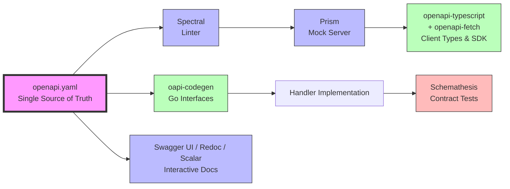

# Part 29 — OpenAPI: The Universal Contract Between Clients and Servers

> [!info] Video Reference
> **Title:** 28. OpenAPI: The universal contract between clients and servers
> **Channel:** Sriniously
> **Playlist:** Backend from First Principles (Video 29 of 29)
> **URL:** https://www.youtube.com/watch?v=CwKsU84jIWs
> **Duration:** 43:55 (2635 seconds)
> **Published:** September 5, 2026

> [!abstract] In This Chapter
> We explore OpenAPI (formerly Swagger) as the industry-standard specification for describing REST APIs. The chapter begins with the core problem: API knowledge lives in three places—backend handler, frontend client, and documentation—and these drift out of sync. OpenAPI solves this by providing a single, machine-readable contract file (JSON or YAML) that describes every endpoint, its inputs, outputs, and behavior. From this one file, we can generate interactive documentation, client SDKs, server interfaces, mock servers, and automated tests. We cover the OpenAPI document structure (info, servers, paths, components, security, tags), operations with parameters and request bodies, responses with Schema Objects (a JSON Schema subset), code-first vs. design-first workflows, and the design-first pipeline: lint → mock → generate client/server → test → document. Real-world examples from GitHub (344k lines) and Stripe (171k lines) illustrate OpenAPI as the universal standard. The chapter concludes with OpenAPI's role in the AI agent era.

## The Problem: Knowledge Lives in Three Places [00:00]

Imagine a task-board application with six routes. Each handler reads a JSON body with three fields—`taskId`, `to`, and `actor`—and returns various status codes: 200 for success, 400/404 for client errors, 500/502 for server errors. The React frontend knows the endpoint (`/api/move`), the required body fields, and the meaning of each status code (e.g., 404 means "task does not exist").

But where does this knowledge actually live? **In three different places:**

1. **The backend handler** — because it is the actual code that reads and validates the request body.
2. **The frontend client** — because it is the calling point; it must construct the correct request.
3. **The documentation** — maintained by the engineer who wrote or integrated the API, describing specs, requirements, and expectations.

This creates **three copies of the same truth**, and the problem is **syncing them**. 

### A Concrete Drift Scenario [00:01:56]

A colleague renames the `to` field to `column` (more intuitive). They update the backend handler and the frontend fetch call. But they forget to update the documentation. Weeks later, a new engineer reads the stale docs, implements the API using the old field name `to`, and gets a validation error from the backend. The documentation claimed to be the "source of truth" but was actually a **stale copy**.

### Why This Only Happens Across Network Boundaries [00:03:25]

Inside a single codebase (e.g., a Go backend), if you change a function's signature—renaming a field or changing `string` to `int`—the compiler immediately flags every call site. You catch the breakage at **compile time**, not runtime.

But across an HTTP boundary, there is **no signature**. The only way to discover a renamed field or changed type is at **runtime**—unless we give the remote call a signature. That is exactly what OpenAPI provides: a **signature for the remote call**, enforcing the contract across the network boundary just like a function signature enforces it within a codebase.

---

## What OpenAPI Is: One File, Many Programs [00:05:10]

An **OpenAPI description** is a single file (JSON or YAML) that describes all API endpoints as a list. For each endpoint, it documents every property: inputs, outputs, and behavior. 

The key insight from Tony Tam (creator, 2010): *"We often code faster than we can document."* His startup (Wordnik) needed client SDKs in Python, PHP, JavaScript, plus documentation for each. The solution: **the server describes itself in a JSON file, and programs read that file for various purposes.**

### Programs That Read the OpenAPI File [00:07:26]

| Program | Purpose |
|---------|---------|
| **Documentation renderer** (Swagger UI, Redoc, Scalar) | Renders interactive, human-readable docs; allows "Try it out" API calls |
| **Client generator** | Generates type-safe client libraries (TypeScript, Go, Python, Rust, etc.) from the description |
| **Server generator** | Generates server interfaces/boilerplate (Go interfaces, FastAPI handlers, etc.) |
| **Validator** | Uses the spec to automatically validate incoming requests (query params, path params, headers, body) without hand-written validation code |
| **Mock server** (Prism) | Spins up a fake server that returns documented examples before the real backend exists |
| **Contract tester** (Schemathesis) | Generates valid/invalid requests from schemas, sends them to the real server, and verifies responses match the contract |

**One file → many artifacts.** This is the most productive artifact you can add to a codebase—it helps backend, frontend, infrastructure, and every engineer.

---

## OpenAPI vs. Swagger vs. OAS vs. OAI: Clearing the Confusion [00:12:45]

Four terms often used interchangeably but meaning different things:

| Term | Meaning |
|------|---------|
| **OpenAPI Specification (OAS)** | The *set of rules*—which fields must exist, what they mean. The standard itself. |
| **OpenAPI Description (OAD)** | *Your file* (`openapi.json` or `openapi.yaml`) that obeys every OAS rule. The physical artifact. |
| **OpenAPI Initiative (OAI)** | The *organization* (under Linux Foundation) that publishes and maintains the specification. Founding members: Google, Microsoft, IBM, PayPal, etc. |
| **Swagger** | The *original name* (2010–2015). Now refers to **Swagger UI** (the interactive documentation tool), not the spec. "Swagger file" = OpenAPI description; "Swagger UI" = the tool. |

### History [00:15:00]

- **2010**: Wordnik creates JSON description + UI for their API; designer names it "Swagger"
- **2011**: Swagger 1.0 open-sourced
- **2014**: Swagger 2.0 — adoption grows
- **2015**: SmartBear buys Swagger, donates spec to Linux Foundation; OpenAPI Initiative formed (Google, Microsoft, IBM, PayPal, etc.)
- **Jan 2016**: Renamed to **OpenAPI** (no content change); OpenAPI 2.0 ≡ Swagger 2.0
- **Today**: Current spec version is **3.2.0**, but most tools still target **3.1.x**

> **YAML vs. JSON**: Both supported equally. YAML is a superset of JSON and allows comments, so most people write YAML and convert to JSON for tools.

---

## The OpenAPI Document Structure [00:16:39]

### Minimal Valid Document [00:16:57]

```yaml
openapi: "3.1.1"     # Specification version this file follows
info:
  title: "Task Board API"
  version: "1.0.0"   # Your API's version (semver), NOT the spec version
paths: {}            # At least one of paths, components, or webhooks required
```

**Two versions, different meanings:**
- `openapi: "3.1.1"` → the **specification version** (which OAS rules this file follows)
- `info.version: "1.0.0"` → your **API version** (internal versioning, e.g., route versioning)

### Root-Level Objects [00:18:23]

```yaml
openapi: "3.1.1"
info:
  title: "Task Board API"
  version: "1.0.0"
  description: "API for managing tasks on a board"
  contact:
    name: "API Support"
    email: "support@example.com"
servers:
  - url: "http://localhost:8080"
    description: "Local development server"
  - url: "https://staging.example.com"
    description: "Staging server"
  - url: "https://api.example.com"
    description: "Production server"
paths:
  /api/board:
    get:
      # ... operation object
  /api/move:
    post:
      # ... operation object
components:
  schemas:
    Task:
      type: object
      properties:
        id:
          type: string
          format: uuid
        title:
          type: string
      required: ["id", "title"]
  securitySchemes:
    BearerAuth:
      type: http
      scheme: bearer
      bearerFormat: JWT
security:
  - BearerAuth: []
tags:
  - name: "tasks"
    description: "Task management endpoints"
  - name: "boards"
    description: "Board management endpoints"
```

### `servers` — Base URLs [00:18:48]

An array of server objects. Each has a `url` and optional `description`. Writing the base URL here means every path only needs the relative endpoint (e.g., `/api/board` not `http://localhost:8080/api/board`). Tools (mock servers, client generators, docs) use this to construct full URLs.

### `paths` — The Endpoint Map [00:19:32]

A **map** (object) where:
- **Keys** = endpoint paths, must start with `/` (e.g., `/api/board`, `/api/tasks/{taskId}`)
- **Values** = **Path Item Objects** — everything you can do at that address, one entry per HTTP method (`get`, `post`, `put`, `patch`, `delete`, `head`, `options`)

**Path parameters** (dynamic portions) use curly braces: `/api/tasks/{taskId}`. The `{taskId}` portion is documented as a parameter with `in: path`.

---

## Operations, Parameters, and Request Body [00:20:51]

### Operation Object [00:20:52]

Each HTTP method under a path is an **Operation Object** with:

```yaml
/api/move:
  post:
    summary: "Move a task to a different column"
    description: |
      Moves a task from one column to another.
      Supports optional `actor` field for audit logging.
    operationId: "moveTask"        # Unique; best practice: function-name style (camelCase)
    tags: ["tasks"]
    parameters: []                 # Query, path, header, cookie params
    requestBody: {}                # Payload for POST/PUT/PATCH
    responses: {}                  # Status code → Response Object
    security: []                   # Override global security
    deprecated: false
```

**`operationId`** is critical: code generators (openapi-typescript, oapi-codegen) turn this into an actual function name (`moveTask()`). Must be unique across the entire spec.

### Parameters [00:22:26]

Parameters can live in four locations (`in` field):

| Location | `in` value | Use Case |
|----------|------------|----------|
| Path | `path` | `/tasks/{taskId}` — **always required** (URL unconstructable without it) |
| Query | `query` | `?since=123` — pagination, filtering |
| Header | `header` | `Last-Event-ID` for SSE reconnection |
| Cookie | `cookie` | Session identifiers |

Each parameter has:
- `name` — parameter name
- `in` — location (required)
- `required` — boolean (path params must be `true`)
- `schema` — Schema Object describing the value (type, format, constraints)
- `description` — human-readable explanation

**Example (polling endpoint):**
```yaml
parameters:
  - name: since
    in: query
    required: false
    schema:
      type: integer
      minimum: 0
    description: "Last sequence number the client has received"
```

### Request Body [00:24:03]

For `POST`, `PUT`, `PATCH` — the payload. Described by `content`, a **map of media type → schema**.

**Media types (Content-Type header values):**
- `application/json` — standard JSON APIs
- `multipart/form-data` — file uploads
- `application/x-www-form-urlencoded` — HTML form submissions (legacy but still used)

**Example (move endpoint):**
```yaml
requestBody:
  required: true
  content:
    application/json:
      schema:
        type: object
        required: ["taskId", "to"]
        properties:
          taskId:
            type: string
            format: uuid
            description: "ID of the task to move"
          to:
            type: string
            description: "Target column ID (renamed from 'to' to 'column' in v2)"
          actor:
            type: string
            default: "guest"
            description: "Actor performing the move; defaults to 'guest'"
```

> **Note**: The `required` array at the schema level declares which fields the backend validates. The `requestBody.required: true` means the body itself must be present.

---

## Responses and the Schema Object [00:25:41]

### Response Object [00:25:44]

Each operation's `responses` is a map: **status code (string) → Response Object**.

```yaml
responses:
  "200":
    description: "Task moved successfully"
    content:
      application/json:
        schema:
          $ref: "#/components/schemas/Event"
  "400":
    description: "Validation error"
    content:
      application/json:
        schema:
          $ref: "#/components/schemas/ErrorResponse"
  "404":
    description: "Task not found"
    content:
      application/json:
        schema:
          $ref: "#/components/schemas/ErrorResponse"
  "502":
    description: "Move succeeded but failed to publish to message bus"
    content:
      application/json:
        schema:
          $ref: "#/components/schemas/ErrorResponse"
```

**Status code ranges (from HTTP video):**
- `2xx` — Success
- `3xx` — Redirect
- `4xx` — Client error
- `5xx` — Server error

Each response needs a `description` and typically `content` with media type + schema.

### Schema Object: The Heart of Data Description [00:27:05]

The Schema Object is a **subset of JSON Schema** (draft 2020-12 / OpenAPI 3.1 aligned). It describes the structure of every field, down to the data type of each sub-field.

#### Primitive Types

| Type | Keywords |
|------|----------|
| `string` | `minLength`, `maxLength`, `pattern` (regex), `enum` (allowed values) |
| `number` / `integer` | `minimum`, `maximum`, `exclusiveMinimum`, `exclusiveMaximum`, `multipleOf` |
| `boolean` | — |
| `array` | `items` (schema for each element), `minItems`, `maxItems`, `uniqueItems` |
| `object` | `properties` (map of property name → schema), `required` (array of property names), `additionalProperties` (bool or schema) |
| `null` | Represents explicit null |

#### String Examples

```yaml
# Enum: status can only be these values
status:
  type: string
  enum: [active, inactive, deleted]

# Pattern: UUID format
id:
  type: string
  pattern: '^[0-9a-f]{8}-[0-9a-f]{4}-[1-5][0-9a-f]{3}-[89ab][0-9a-f]{3}-[0-9a-f]{12}$'

# Length constraints
title:
  type: string
  minLength: 1
  maxLength: 200
```

#### Number/Integer Examples

```yaml
# Integer with range
sequence:
  type: integer
  minimum: 0
  maximum: 2147483647

# Floating point with precision
price:
  type: number
  minimum: 0
  multipleOf: 0.01
```

#### Array Examples

```yaml
# Array of strings (tags)
tags:
  type: array
  items:
    type: string
    maxLength: 50
  minItems: 1
  maxItems: 10
  uniqueItems: true
```

#### Object Examples (Nested)

```yaml
Task:
  type: object
  required: [id, title, status]
  properties:
    id:
      type: string
      format: uuid
    title:
      type: string
      minLength: 1
      maxLength: 200
    status:
      type: string
      enum: [todo, in_progress, done]
    assignee:
      type: object
      properties:
        id:
          type: string
          format: uuid
        name:
          type: string
      required: [id, name]
```

#### Composition Keywords (OpenAPI 3.1 / JSON Schema)

| Keyword | Purpose |
|---------|---------|
| `allOf` | Must satisfy ALL schemas (merge) |
| `anyOf` | Must satisfy AT LEAST ONE schema |
| `oneOf` | Must satisfy EXACTLY ONE schema |
| `not` | Must NOT satisfy the schema |

**Example (polymorphic response):**
```yaml
Event:
  oneOf:
    - $ref: "#/components/schemas/TaskCreatedEvent"
    - $ref: "#/components/schemas/TaskMovedEvent"
    - $ref: "#/components/schemas/TaskDeletedEvent"
  discriminator:
    propertyName: type
    mapping:
      task_created: "#/components/schemas/TaskCreatedEvent"
      task_moved: "#/components/schemas/TaskMovedEvent"
      task_deleted: "#/components/schemas/TaskDeletedEvent"
```

#### `$ref` — Reusing Schemas

Instead of repeating schemas, define them in `components/schemas` and reference:

```yaml
components:
  schemas:
    ErrorResponse:
      type: object
      required: [code, message]
      properties:
        code:
          type: string
        message:
          type: string
        details:
          type: object

# In a response:
schema:
  $ref: "#/components/schemas/ErrorResponse"
```

---

## Code-First vs. Design-First [00:29:02]

The central question: **What comes first—the spec file or the code?**

### Code-First [00:29:15]

You write handlers, services, types **first**. The OpenAPI file is **derived** from code via:
- Annotations/comments on handlers (e.g., Go `swaggo`, Java SpringDoc)
- Type introspection (e.g., FastAPI reads Pydantic models from handler signatures)
- Schema libraries (e.g., Zod in TypeScript → OpenAPI via `ts-rest`)

**Example (ts-rest in the video's Tasker app):**
```typescript
// Zod schemas define shapes
const moveTaskSchema = z.object({
  taskId: z.string().uuid(),
  to: z.string(),
  actor: z.string().default("guest").optional()
});

// ts-rest contract attaches schemas to paths/methods
const contract = c.router({
  moveTask: {
    method: "POST",
    path: "/api/move",
    body: moveTaskSchema,
    responses: { 200: eventSchema, 400: errorSchema, ... }
  }
});

// Generator produces openapi.json from contract
const openApiDoc = generateOpenApiDocument(contract);
```

**Pros:** Fast for existing codebases; spec never out of sync with implementation (it's generated from it).
**Cons:** Design happens in code; frontend can't start until backend is done; annotations can drift from actual behavior.

### Design-First (Contract-First) [00:29:53]

You write the **OpenAPI specification first**—before any implementation. Then:
1. Backend implements against the contract (generated interfaces)
2. Frontend generates types/client from the contract
3. Mock server runs immediately for frontend development
4. Contract tests verify the real server matches the spec

**The team that invented Swagger started code-first** (they had existing server code). **But they realized contract-first makes more sense** (2013 talk).

**Why Design-First Wins for New Projects [00:30:39]:**
- **Parallel development**: Frontend and backend start simultaneously, both grounded in the same contract
- **Agentic era**: AI agents can work on client/server in parallel from the same spec
- **Fast feedback**: Lint catches spec errors before code exists; mock server validates UX early
- **Single source of truth**: The spec *is* the contract; code must conform

---

## The Design-First Pipeline: Lint → Mock → Generate → Test → Document [00:34:36]

A complete workflow from one `openapi.yaml` file:



**What this diagram shows:** The design-first pipeline centered on a single `openapi.yaml` file. The linter (Spectral) validates the spec itself. The mock server (Prism) enables frontend development before the backend exists. Client generators (openapi-typescript + openapi-fetch) produce type-safe frontend code. Server generators (oapi-codegen) produce Go interfaces that handlers must implement. Contract testing (Schemathesis) verifies the live server matches the spec. Documentation renderers (Swagger UI, Redoc, Scalar) produce interactive human-readable docs. Every artifact derives from the same source file.

### Stage 1: Lint with Spectral [00:35:36]

Like ESLint for code, **Spectral** (Stoplight) has built-in OpenAPI rules. It reads the file and errors on:
- Missing `contact` in `info`
- Operations without `description`
- Operations without `operationId`
- Responses without schemas
- Naming convention violations
- Breaking change detection (with rulesets)

```bash
spectral lint openapi.yaml
# Fix errors → re-run → passes
```

### Stage 2: Mock Server with Prism [00:36:06]

**Prism** (Stoplight) reads the spec and spins up a fake HTTP server that:
- Responds to every documented endpoint
- Returns the **examples** defined in the spec
- Validates incoming requests against parameter/requestBody schemas

```bash
prism mock openapi.yaml
# Serves at http://localhost:4010
```

Frontend team develops against this mock while backend team builds the real implementation. **Zero backend code required.**

### Stage 3: Generate Client Code [00:37:14]

For TypeScript/JavaScript frontends:
- **openapi-typescript** → generates `.d.ts` type definitions from schemas
- **openapi-fetch** → generates a typed `fetch` wrapper that uses those types

```bash
npx openapi-typescript openapi.yaml -o types/api.d.ts
# Generates types for every path, method, params, requestBody, responses
```

**Result:** If you misspell a field or pass wrong type, **TypeScript compiler catches it at build time**. The OpenAPI spec becomes your frontend's type system.

### Stage 4: Generate Server Interfaces [00:38:04]

For Go backends:
- **oapi-codegen** → generates Go interfaces from the spec

```bash
oapi-codegen -generate types,server openapi.yaml -o api.gen.go
```

**Generated interface (simplified):**
```go
type ServerInterface interface {
  MoveTask(w http.ResponseWriter, r *http.Request, params MoveTaskParams)
  GetBoard(w http.ResponseWriter, r *http.Request)
  // ...
}

type MoveTaskParams struct {
  TaskId string `json:"taskId" validate:"required,uuid"`
  To     string `json:"to" validate:"required"`
  Actor  string `json:"actor,omitempty"`
}
```

Your handler **must satisfy this interface**. If the spec adds a field and you regenerate, the Go compiler **fails** until you update the handler. The spec enforces the implementation.

### Stage 5: Contract Test with Schemathesis [00:40:01]

**Schemathesis** (Python) reads the spec, generates **valid and invalid** requests from schemas, sends them to the **real running server**, and verifies responses match the documented schemas.

```bash
schemathesis run --stateful=links openapi.yaml http://localhost:8080
```

It tests:
- Happy paths (valid requests → expected success responses)
- Edge cases (boundary values, enums, required fields missing)
- Invalid inputs (wrong types, pattern violations) → 400 responses
- Security (auth flows)

If the server behaves differently from the spec, **Schemathesis flags it**.

### Stage 6: Documentation [00:39:23]

Same file → three rendering engines:

| Tool | Vibe |
|------|------|
| **Swagger UI** | Classic, battle-tested, "Try it out" built in |
| **Redoc** | Clean three-column layout, excellent for large specs |
| **Scalar** | Modern, beautiful, fast, searchable (author's preference) |

All serve the spec at `/docs` or `/reference` with interactive testing.

---

## OpenAPI at Scale: GitHub & Stripe [00:41:42]

The industry has converged on OpenAPI as **the standard**.

| Company | Spec Size | Purpose |
|---------|-----------|---------|
| **GitHub** | ~344,000 lines | All REST endpoints; clients generate Octokit SDKs from it |
| **Stripe** | ~171,000 lines | All API versions; clients generate Stripe SDKs in 7+ languages |

These are not toy examples. They are **production contracts** that thousands of external developers depend on. When GitHub or Stripe updates their spec, the entire ecosystem (client libraries, docs, internal tooling) regenerates automatically.

---

## OpenAPI in the AI Agent Era [00:42:45]

> "When you give an AI agent a tool to call, that tool is described by OpenAPI."

Modern AI function calling (OpenAI, Anthropic, etc.) uses JSON Schema — which OpenAPI's Schema Object **is**. An OpenAPI description becomes a **tool manifest** for agents:
- Agent reads the spec → knows every available function
- Agent constructs valid calls (validated by schema)
- Agent handles responses (typed by schema)

The same contract that aligns human frontend/backend teams now aligns **human + agent** teams.

---

## Summary: OpenAPI in One Sentence [00:42:43]

> **OpenAPI is a machine-readable specification that describes the complete contract of an HTTP API—endpoints, inputs, outputs, auth, and behavior—enabling automated generation of documentation, clients, servers, mocks, tests, and agent tools from a single source of truth.**

---

## Key Takeaways

1. **The Three-Truth Problem**: API knowledge lives in backend, frontend, and docs. They drift. OpenAPI collapses them into one file.
2. **Signature Across the Network**: OpenAPI gives remote calls the same compile-time safety that function signatures give local calls.
3. **One File, Many Artifacts**: Docs, clients, servers, mocks, validators, tests—all generated from `openapi.yaml`.
4. **Design-First > Code-First for New Projects**: Enables parallel work, early validation, and agent-friendly contracts.
5. **The Pipeline**: Lint (Spectral) → Mock (Prism) → Client Gen (openapi-typescript) → Server Gen (oapi-codegen) → Contract Test (Schemathesis) → Docs (Scalar/Swagger/Redoc).
6. **Schema Object = JSON Schema Subset**: Describes every field's type, constraints, composition (`allOf`/`anyOf`/`oneOf`), and reuse (`$ref`).
7. **Industry Standard**: GitHub (344k lines), Stripe (171k lines) publish OpenAPI specs as their public contract.
8. **AI-Ready**: OpenAPI specs double as function-calling manifests for LLM agents.

---

## Related Notes

- **MOC**: [[_00 - Backend from First Principles - Index]]
- **Previous**: [[28 - The Twelve-Factor App]]
- **Next**: [[30 - Webhooks - How the Server Calls You]]
- **Resources from video**:
  - [OpenAPI Specification 3.2.0](https://spec.openapis.org/oas/v3.2.0.html)
  - [GitHub's OpenAPI Description](https://github.com/github/rest-api-description)
  - [Stripe's OpenAPI Description](https://github.com/stripe/openapi)
  - [Spectral (Linter)](https://github.com/stoplightio/spectral)
  - [Prism (Mock Server)](https://github.com/stoplightio/prism)
  - [openapi-typescript](https://github.com/openapi-ts/openapi-typescript)
  - [oapi-codegen](https://github.com/oapi-codegen/oapi-codegen)
  - [Schemathesis (Contract Testing)](https://github.com/schemathesis/schemathesis)
  - [FastAPI](https://github.com/fastapi/fastapi)
  - [ts-rest](https://github.com/ts-rest/ts-rest)
  - [Swagger UI](https://github.com/swagger-api/swagger-ui)
  - [Redoc](https://github.com/Redocly/redoc)
  - [Scalar](https://github.com/scalar/scalar)

---

> [!note] Source Fidelity
> This chapter is a comprehensive reconstruction from the full timestamped transcript of "28. OpenAPI: The universal contract between clients and servers" (video ID: CwKsU84jIWs, playlist position 29 of 29). All concepts, examples, tool names, code snippets, and diagrams are derived directly from the video content. Ambiguous transcript segments are marked with ⇢ *inferred*. Mermaid diagrams and code examples not explicitly shown in the video are constructed from the speaker's verbal descriptions to illustrate the explained architecture.

