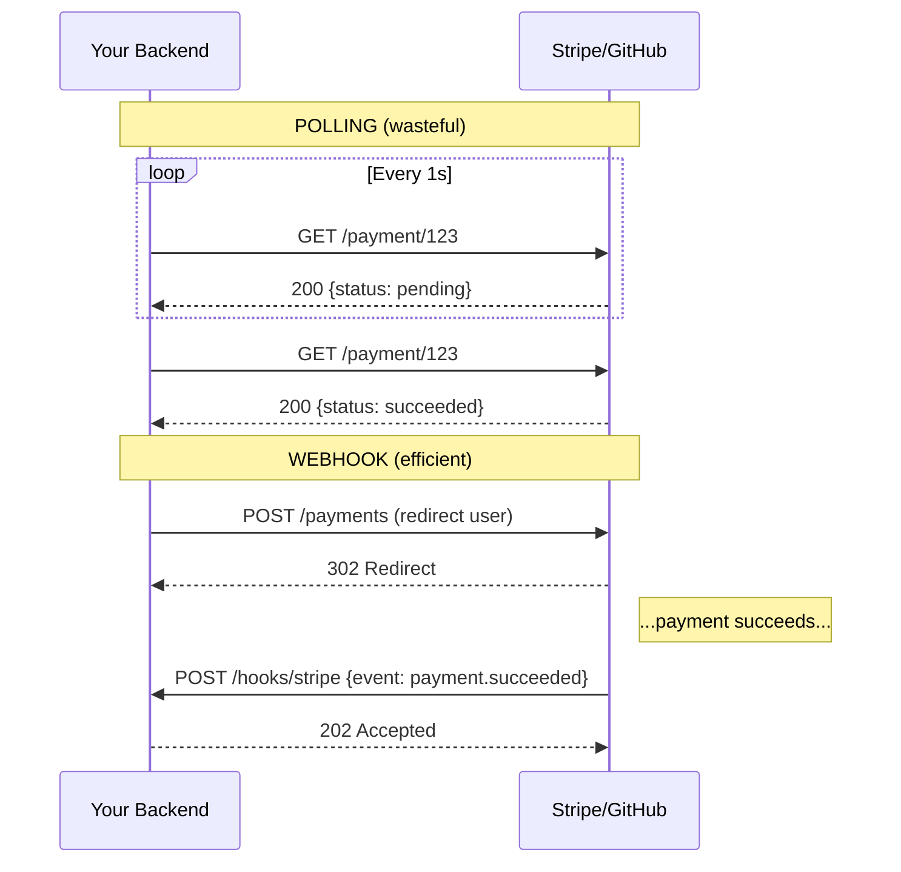
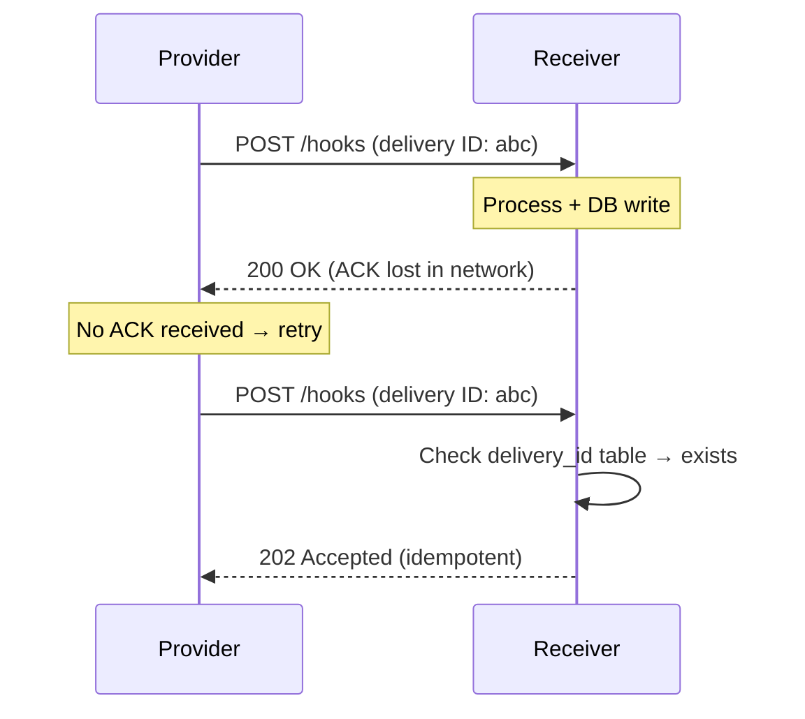
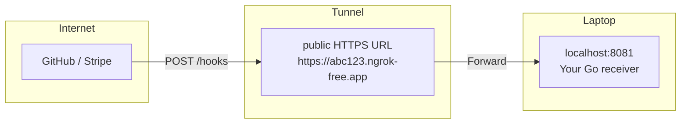

# Part 30 — Webhooks: How the Server Calls You

> [!info] Video reference
> **Title:** 29. Webhooks: how the server calls you  
> **Channel:** Sriniously  
> **Playlist:** Backend from First Principles (video 30 of 30, playlist position 29)  
> **URL:** https://www.youtube.com/watch?v=eWM0CVReP04  
> **Duration:** 56:06 (3,366 seconds)  
> **Published:** 2026-09-07

> [!abstract] In this chapter
> We explore **webhooks** — the mechanism that flips the traditional client-initiates communication model by letting a server push events to another server via HTTP callbacks. We cover:
> - Why polling is wasteful and doesn't scale
> - The anatomy of a webhook delivery (headers, body, signatures, timeouts)
> - Handshake/verification flows and tunneling for local development (ngrok, Cloudflare Tunnel)
> - The critical security threat: spoofed deliveries, replay attacks, and SSRF
> - Five authentication methods (secret-in-URL, IP allowlist, mTLS, HMAC, asymmetric signatures)
> - HMAC deep-dive: raw-body verification, constant-time comparison, timestamp binding
> - **At-least-once delivery**, idempotency keys, and ordering hazards
> - Retry schedules, exponential backoff with jitter, and the "clock vs. load" problem
> - Building a producer: the **outbox pattern** and **dispatcher** (sign → POST → record → retry)
> - When webhooks are the wrong tool (syncing) and the **event log** as the correct alternative

---

### [00:00] What a Webhook Is: The Server Calls You

Throughout the *Backend from First Principles* series, we have operated under the premise that **the client always initiates the connection**. The client starts communication with the server, and the server responds. Even in the real-time systems video, where we explored patterns for server-to-client push (WebSockets, Server-Sent Events, long polling), the core primitive remained the same: the client must first establish a connection, and only then can the server send data back over that established channel.

In this final chapter, we break that premise entirely. We explore **service-to-service communication** between two backends — no browser, no human in the loop. The scenario: your backend needs to learn about an event that occurred in *another* backend's system.

**Concrete example:** Your taskboard application has a pricing page. A user purchases a paid plan via Stripe. The payment succeeds *in Stripe's system*. How does your backend learn about this success so it can unlock the plan?

Constraints:
1. **Reliability**: You cannot depend on the user's browser. Network errors, tab closures, crashes — the signal would be lost.
2. **Security**: You cannot trust a client-side signal. Client-side code can be tampered with; a malicious user could forge a "payment successful" message.

The **first intuitive solution** (the "brute force" approach): after redirecting the user to Stripe, your server **polls** Stripe's API every second — `GET /payments/{id}` — until the status changes from `pending` to `succeeded` or `failed`.

#### [03:21] Polling Against Pushing

Polling has three fatal problems:

| Problem | Explanation |
|---------|-------------|
| **Latency** | With a 1-second interval, average delay = 0.5 s (half the interval). If rate-limited to 60 s, average delay = 30 s. |
| **Waste** | Every `pending` response is a wasted request — CPU, bandwidth, log noise. |
| **Scale / Rate limiting** | If 10,000 merchants each poll once/second, the provider receives 10,000 RPS. To protect themselves, providers aggressively rate-limit, forcing longer intervals and worse latency. |

**The solution: flip the communication direction.** Instead of *asking* repeatedly, **trust the provider to tell you** when the event occurs. This mechanism — a service calling your endpoint when an event happens — is called a **webhook**.

> **Definition:** A **webhook** is a user-defined HTTP callback: an HTTP `POST` request that the provider sends to a URL you expose, carrying event data in the body. It is a **reverse API call** — normally you call their API; here, they call yours.

---

### [06:29] History: Where the Name Came From, and Who Sends Them

- **2007**: Jeff Lindsay proposed "web hooks" as a web analogue of the Unix pipe — a primitive to push output from one service to another when an event occurs, implemented via HTTP `POST` with user-defined callbacks.
- **2009**: Google engineers built **PubSubHubbub** (later WebSub) on the same idea for blog feed updates.

**Terminology used throughout this chapter:**

| Term | Meaning |
|------|---------|
| **Provider / Sender** | The system where the event actually occurs (e.g., Stripe, GitHub). |
| **Consumer / Receiver** | Your system — the one receiving the webhook. |
| **Endpoint** | The public HTTPS URL on your side that receives the `POST`. |
| **Event** | A predefined occurrence (e.g., `payment.succeeded`, `task.moved`). |
| **Delivery** | **One attempt** to send an event to the endpoint. **Critical:** one event ⇒ multiple deliveries (retries). |
| **Subscription** | Your registration with the provider: "Here is my URL; send me these event types." |

---

### [08:29] One Delivery, End to End: The Receiver & GitHub's Record

The video demonstrates a minimal Go receiver:

```go
// main.go
router.POST("/hooks/github", inbox.Handler)

// inbox/handler.go
func Handler(w http.ResponseWriter, r *http.Request) {
    body, _ := io.ReadAll(r.Body)
    verify.VerifySignature(r.Header, body, secret) // HMAC check
    storeDeliveryID(r.Header.Get("X-GitHub-Delivery"))
    w.WriteHeader(http.StatusAccepted) // 202
}
```

The receiver runs on a Linux machine **without a public IP**. To receive internet traffic, we open a **tunnel** (ngrok, Cloudflare Tunnel) that forwards a public HTTPS hostname to `localhost:8081`.

In GitHub's webhook settings, we register:
- **Payload URL**: `https://<tunnel-host>/hooks/github`
- **Content type**: `application/json`
- **Secret**: shared secret for HMAC
- **Events**: `push` (for demo)

GitHub sends a **ping** on registration, then a real `push` event on commit. The receiver logs:
- Headers: `X-GitHub-Event`, `X-GitHub-Delivery`, `X-Hub-Signature-256`
- Body: full event JSON
- Response: `202 Accepted`

GitHub **also retains its own copy** of every delivery (headers, payload, your response) under "Recent Deliveries" — invaluable for debugging.

---

### [09:56] Anatomy of a Delivery & Timeouts

A webhook delivery is a standard HTTP `POST` with:

| Component | Example (GitHub) |
|-----------|------------------|
| **Method** | `POST` |
| **URL** | Your registered endpoint |
| **Content-Type** | `application/json` |
| **Event-Type Header** | `X-GitHub-Event: push` |
| **Delivery-ID Header** | `X-GitHub-Delivery: <uuid>` |
| **Signature Header** | `X-Hub-Signature-256: sha256=<hmac>` |
| **Body** | Raw JSON event payload |

**How the provider knows success:**
1. **Status code**: Any `2xx` = success (200, 201, 202, …). `3xx`, `4xx`, `5xx` = failure → triggers retry.
2. **Timeout**: Provider waits only a short window for your response.

| Provider | Timeout |
|----------|---------|
| GitHub | 10 s |
| Shopify | 5 s |
| Slack | 3 s |
| Microsoft Graph | 3 s |

> ⚠️ **Critical**: Your handler **must** respond within the provider's timeout. If you miss it, the provider treats it as failure and **will retry** — causing duplicate deliveries.

---

### [12:53] Handshakes, and a Tunnel to Your Laptop

Some providers require a **handshake** before sending real events — a challenge-response to prove you control the endpoint and to prevent abuse (DDoS via webhook registration).

| Provider | Handshake Mechanism |
|----------|---------------------|
| Microsoft Graph | Sends `validationToken` query param; you must return it as plain text. |
| Discord | Sends JSON `{ "type": 1 }` (ping); you must respond `{ "type": 2 }` (pong). |
| Amazon SNS | Sends `SubscriptionConfirmation` with a `SubscribeURL`; you must `GET` that URL. |

**Why?** Without a handshake, an attacker could register a victim's URL for all event types, flooding them with webhooks — a **DDoS amplifier**.

#### Local Development: Tunnels

Your laptop sits behind a home router (NAT, no public IP). `localhost` means nothing to GitHub/Stripe. **Tunnels** solve this:

```
Internet → ngrok/Cloudflare Tunnel (public HTTPS) → localhost:8081
```

Tools: `ngrok http 8081`, `cloudflared tunnel --url http://localhost:8081`. They provide a temporary public HTTPS URL that forwards to your local port.

---

### [15:25] Trusting a Delivery: The Threat Model

Your webhook endpoint is a **public URL** accepting `POST` with JSON. Anyone who guesses the URL (common patterns: `/webhooks`, `/hooks`, `/callback`) can send a forged payload:

```json
{ "type": "payment.succeeded", "user_id": "victim", "plan": "premium" }
```

If your handler trusts this, you've just granted premium access for free.

**HTTPS does not help** — it only encrypts *transit*; it provides **zero authentication of the sender**. You need **cryptographic proof** that the request came from your provider.

---

### [16:52] Five Ways to Prove Authenticity

| # | Method | Description | Strength |
|---|--------|-------------|----------|
| 1 | **Secret in URL** | `https://you.com/hooks?secret=abc123` | ❌ Weak — URLs logged everywhere (logs, proxies, browser history). |
| 2 | **IP Allowlist** | Provider publishes egress IPs; you firewall-allow only those. | 🟡 Better, but incomplete alone (IPs can change, shared infrastructure). |
| 3 | **Mutual TLS (mTLS)** | Provider presents a client cert; you verify it. | ✅ Strong, but operationally heavy (cert rotation, PKI). |
| 4 | **HMAC (Shared Secret)** | Provider computes `HMAC-SHA256(body, secret)` → header; you recompute & compare. | ✅ **Most common** (65–80% of providers). |
| 5 | **Asymmetric Signature** | Provider signs with private key; you verify with public key. | ✅ Strong (used by Discord), no shared secret leakage. |

**The rest of this chapter focuses on Method 4 (HMAC)** as the industry standard.

---

### [18:18] HMAC Deep-Dive: How It Works

> **HMAC** = **H**ash-based **M**essage **A**uthentication **C**ode (RFC 2104).

A hash function (e.g., SHA-256) takes arbitrary bytes → fixed-length fingerprint. Change one bit → completely different fingerprint.

**HMAC adds a secret key**: `HMAC_SHA256(key, message)`. Only parties with the key can produce a valid tag.

**Flow:**
1. **Provider** computes `sig = HMAC_SHA256(shared_secret, request_body)`, puts `sig` in header.
2. **Receiver** reads **raw body bytes**, computes `HMAC_SHA256(shared_secret, raw_body)`, compares to header using **constant-time comparison**.
3. Match → authentic. Mismatch → reject (401).

**Stripe's Go SDK verification** (simplified):
```go
func Verify(header http.Header, body []byte, secret string) error {
    // Header: "Stripe-Signature: t=1699999999,v1=abc123,v1=def456"
    // Parse timestamp `t` and one or more `v1` signatures
    // For each v1: expected = HMAC_SHA256(secret, fmt.Sprintf("%d.%s", t, string(body)))
    // Compare with hmac.Equal (constant-time)
    // Also reject if timestamp > 5 min old (replay protection)
}
```

---

### [20:30] What Exactly Is Signed? The Raw-Body Trap

**Providers differ** in what they sign. You **must** check documentation.

| Provider | Signed String Format |
|----------|----------------------|
| GitHub | Raw body only |
| Stripe | `timestamp + "." + raw_body` |
| Standard Webhooks | `delivery_id + "." + timestamp + "." + raw_body` |
| Twilio | Full URL + sorted form fields (SHA-1) |

#### The Raw-Body Trap ⚠️

**HMAC is computed over exact bytes.** If your framework parses JSON then re-encodes it, whitespace differences break verification.

```go
// ❌ WRONG: parse → re-encode → verify
var data map[string]any
json.Unmarshal(body, &data)
reencoded, _ := json.Marshal(data) // may add spaces, reorder keys
verifyHMAC(reencoded) // FAILS if provider sent compact JSON

// ✅ CORRECT: verify raw bytes FIRST, then parse
verifyHMAC(body) // use exact bytes from wire
var data map[string]any
json.Unmarshal(body, &data)
```

**Rule:** Read body as `[]byte` → **verify signature** → **then** parse. Never parse before verifying.

---

### [22:44] Replay Attacks & Constant-Time Comparison

#### Replay Attack
Attacker captures a valid delivery (headers + body + valid HMAC). Hours later, they resend it. Your handler verifies HMAC → passes → processes event again (e.g., grants premium again).

**Defense: Timestamp binding.** Stripe includes timestamp `t` *inside* the signed string (`t.body`). Their SDK rejects timestamps older than 5 minutes. Standard Webhooks includes `delivery_id.timestamp.body`.

#### Timing Attack on String Comparison
Naïve `==` stops at first mismatched byte → time varies with prefix match length. Attacker measures response times over millions of requests → derives signature byte-by-byte.

**Defense: Constant-time comparison.** Every language provides it:
- Go: `hmac.Equal(a, b)`
- Node.js: `crypto.timingSafeEqual(a, b)`
- Python: `hmac.compare_digest(a, b)`

These take **identical time** regardless of input difference.

---

### [25:16] SSRF: The Provider's Own Danger (Server-Side Request Forgery)

When **you are the provider** sending webhooks, *you* face a threat: a malicious customer registers a URL pointing to **your internal infrastructure**.

```
Attacker registers: http://169.254.169.254/latest/meta-data/iam/security-credentials/
```
This is the **AWS/GCP/Azure metadata service** — returns cloud credentials, internal hostnames, etc.

Your dispatcher does `POST` to that URL → attacker steals secrets.

**Defense (must do on every send, not just registration):**
1. **Resolve DNS yourself** → get IP(s).
2. **Reject private ranges**: `10.0.0.0/8`, `172.16.0.0/12`, `192.168.0.0/16`, `169.254.0.0/16`, `127.0.0.0/8`, `::1`, `fc00::/7`.
3. **Never follow redirects** (3xx) — attacker could redirect from public to private.
4. **Egress proxy** (e.g., Stripe's open-source **Smokescreen**) — all outbound webhook traffic routes through a controlled proxy that enforces the above.

> ⚠️ This check must happen **at send time**, not just registration — DNS can change after registration.

---

### [27:39] At-Least-Once Delivery: Idempotency & Ordering

Because acknowledgments can be lost in the network, **every provider guarantees "at-least-once" — never "exactly-once."**

```
Provider sends event → You process → You respond 200 → 200 lost in network
                                    ↓
Provider never sees 200 → Retries same event (same delivery ID)
                                    ↓
You receive duplicate → Must not double-charge / double-insert
```

#### Idempotency via Delivery ID
Every delivery carries a **unique delivery ID** (GitHub: `X-GitHub-Delivery`, Stripe: `event.id` in body, Standard: `webhook-id`).

**Receiver pattern:**
```sql
CREATE TABLE processed_deliveries (
    delivery_id TEXT PRIMARY KEY,  -- unique constraint!
    received_at TIMESTAMP DEFAULT now()
);
```

```go
func HandleWebhook(w http.ResponseWriter, r *http.Request) {
    deliveryID := r.Header.Get("X-GitHub-Delivery")
    
    // ✅ Atomic: insert delivery_id AND do work in SAME TRANSACTION
    tx, _ := db.Begin()
    _, err := tx.Exec("INSERT INTO processed_deliveries (delivery_id) VALUES ($1)", deliveryID)
    if err != nil { // duplicate key → already processed
        tx.Rollback()
        w.WriteHeader(http.StatusAccepted)
        return
    }
    doActualWork(tx, r.Body) // e.g., INSERT INTO subscriptions ...
    tx.Commit()
    w.WriteHeader(http.StatusAccepted)
}
```

**Why same transaction?**
- Work first, then record ID → crash after work, before record → duplicate on retry.
- Record ID first, then work → work fails → ID recorded but effect missing → lost update on retry.
- **Both or neither** = idempotency.

#### Ordering Hazard
Events for the same object can arrive out of order due to retries.

**Scenario:** `created` then `deleted` for same task.
- `created` delivery fails (your server deploying) → retries in 5 min.
- `deleted` delivery succeeds immediately.
- You receive `deleted` first → create tombstone → then `created` arrives → ghost task in DB.

**Solutions:**
1. **Refetch canonical state** — on webhook, call provider's API (`GET /tasks/{id}`) → apply current truth. Costs 1 API call.
2. **Version/`updated_at` field** — only apply event if `event.version > stored_version`. Do in same transaction.
3. **Buffer & sequence** — hold events per object until predecessors arrive. Unpredictable; some providers offer **strict ordering** (paid feature).

---

### [34:31] Retries, Backoff, Jitter & the Clock vs. Load

Every provider has a **retry schedule** — you must read their docs.

| Provider | Schedule |
|----------|----------|
| Stripe | Exponential backoff, up to **3 days**, then disables endpoint + emails you. |
| Svix | Immediate, 5 s, 5 min, 30 min, 2 h, 5 h, 10 h, … |
| Shopify / Slack / Polar | Custom schedules |
| **GitHub** | **Zero retries** — you must manually redeliver or script via API. |

#### The Load Amplification Problem
- Your handler takes 8 s (verifies, updates 3 tables, calls external APIs).
- Provider timeout = 5 s → **every delivery times out** → **every delivery retries**.
- Retries add to your existing traffic → **cascading overload**.

**Ideal receiver = thin & fast:**
```go
func Receiver(w http.ResponseWriter, r *http.Request) {
    body := readBody(r)
    verifySignature(body)          // ~1 ms
    storeDeliveryAttempt(body)     // ~2 ms (INSERT into queue table)
    w.WriteHeader(http.StatusAccepted) // return immediately
    // STOP. No business logic here.
}
```

**Background worker** (separate process, task queue) drains the queue:
- Verifies idempotency (delivery ID)
- Does heavy work (DB writes, API calls)
- Can take minutes; doesn't block webhook ACK.

> This mirrors the **write-ahead log** pattern from the databases video: durably record intent first, process asynchronously.

#### Exponential Backoff + Jitter
- **Backoff**: Increase delay between retries (5 s → 5 min → 15 min → 1 h …) to avoid hammering a down service.
- **Jitter**: Add randomness (`delay ± random(0, delay*0.1)`) so **thousands of retries don't synchronize** into a thundering herd at the 5-min mark.

**Also respect `Retry-After` header** from receiver — if you're overwhelmed, tell the provider "come back in 1 hour."

---

### [38:58] Building Your Own Provider: The Outbox Pattern

Now **you are the webhook provider**. Your taskboard emits `task.moved` events; customers register URLs to receive them.

**Naïve implementation (in move handler):**
```go
func MoveTask(w http.ResponseWriter, r *http.Request) {
    db.UpdateTaskPosition(taskID, newPos) // your work
    http.Post(customerURL, payload)       // 🚨 THREE PROBLEMS
}
```

| Problem | Consequence |
|---------|-------------|
| 1. Customer API slow/down | Your `MoveTask` latency includes their latency; your user waits. |
| 2. Crash after DB, before POST | Move succeeded but webhook never sent → customer never notified. |
| 3. POST first, then DB fails | Customer told "moved" but your DB didn't persist → lie. |

#### The Outbox Pattern (Solution)

**Outbox** = a regular table in *your* database (same transaction as business data).

```sql
CREATE TABLE outbox (
    id BIGSERIAL PRIMARY KEY,
    endpoint_id BIGINT REFERENCES endpoints(id),
    event_type TEXT NOT NULL,
    payload JSONB NOT NULL,
    created_at TIMESTAMP DEFAULT now()
);
```

**Move handler (atomic):**
```go
func MoveTask(w http.ResponseWriter, r *http.Request) {
    tx := db.Begin()
    db.UpdateTaskPosition(tx, taskID, newPos)
    db.InsertOutbox(tx, endpointID, "task.moved", payload)
    tx.Commit() // both or neither
    w.WriteHeader(http.StatusOK)
}
```

**Dispatcher (background worker):**
```
Loop:
  1. SELECT * FROM outbox WHERE delivered = false ORDER BY created_at LIMIT 1
  2. Sign payload with endpoint's secret (Standard Webhooks: id.timestamp.body)
  3. POST with 10 s timeout
  4. Record attempt in `deliveries` table (status_code, response_body[0:2KB], timestamp)
  5. If 2xx: mark outbox row delivered
     Else: schedule next retry (exponential backoff + jitter)
  6. After 10 consecutive failures: disable endpoint, email owner
```

**Security guard in dispatcher:** Before *every* send, resolve URL → reject private IPs, no redirects.

**Per-endpoint queue:** One queue per customer URL so a dead endpoint doesn't block others.

---

### [43:10] The Dispatcher: Sign, POST, Record, Retry

Per-delivery steps in detail:

1. **Sign** — `HMAC_SHA256(secret, delivery_id + "." + timestamp + "." + body)` → `Webhook-Signature` header.
2. **POST** — 10 s timeout (configurable; 10 s is common default).
3. **Record attempt** — `deliveries` table: `status_code`, `response_body_prefix`, `attempted_at`, `next_retry_at`.
4. **On success (2xx)** — mark `outbox.delivered = true`.
5. **On failure** — compute `next_retry_at = now() + backoff(attempt) + jitter`; respect `Retry-After` if present.
6. **After 10 failures** — `endpoint.disabled = true`, send alert email.

**Demo in video:** Move task → outbox row inserted immediately → customer endpoint returns 500 → `deliveries` shows `next_retry_at` growing exponentially → fix endpoint → next attempt gets 200 → marked delivered.

**SSRF guard demo:** Register `http://localhost/admin` → rejected ("private address"). Register hostname resolving to private IP → rejected. Check runs **on every send**, not just registration.

---

### [48:19] When a Webhook Is the Wrong Tool: Syncing

**Webhooks = notifications** ("something happened"). They are **not** a reliable syncing mechanism.

**Anti-pattern:** Using webhooks to maintain a **local copy of provider's data** (e.g., Clerk users, Stripe customers).

**Clerk example:** You want local `users` table to avoid 500 ms API latency per auth check.
- Subscribe to `user.created`, `user.updated`, `user.deleted`, `organization.*`, `role.*`…
- On each webhook, `INSERT/UPDATE/DELETE` your local tables.
- **Now you own all webhook edge cases**: timeouts, retries, replays, out-of-order delivery, missed events (GitHub: zero retries!), signature verification, SSRF…

**Result:** Fragile, complex, eventually inconsistent.

---

### [52:54] The Event Log: The Right Way to Sync

**Every major provider has an ordered, durable event log** (Clerk: `/events` API, Stripe: `/v1/events`, GitHub: `/events`).

**Correct sync pattern — two strategies:**

#### Strategy 1: Periodic Poll (low urgency)
```go
// Every 5 minutes (cron)
func SyncWorker() {
    lastID := db.GetLastProcessedEventID()
    events := clerk.GetEvents(after=lastID) // ordered, paginated
    for e := range events {
        applyToLocalDB(e) // idempotent by event ID
        db.SetLastProcessedEventID(e.ID)
    }
}
```
- Tolerates 5-min staleness.
- Simple, robust, no webhook edge cases.

#### Strategy 2: Webhook as *Wake-up Signal* (low latency)
1. Subscribe to **single** webhook: `event.log.entry_added` (or provider's equivalent).
2. On webhook: **don't trust payload**. Instead, trigger background worker:
   ```go
   func WebhookHandler(w, r) {
       storeDeliveryID(r) // idempotency
       queue.Push("sync_worker") // fire-and-forget
       w.WriteHeader(202)
   }
   ```
3. Worker: `GET /events?after=last_id` → apply in order → update `last_id`.
4. **Webhook only says "new data available"; event log is source of truth.**

**Why this works:**
- Provider's event log is **ordered** (single-writer, no network partitioning).
- You get **exactly-once semantics** via `last_id` cursor.
- Webhook latency ~seconds; poll fallback catches missed webhooks.

---

## Key Takeaways

| Concept | Essence |
|---------|---------|
| **Webhook** | HTTP `POST` callback — provider pushes event to your URL. Reverse API call. |
| **Polling vs. Push** | Polling wastes resources, adds latency, collapses under scale. Push inverts the flow. |
| **Delivery ≠ Event** | One event ⇒ multiple deliveries (retries). Design for **at-least-once**. |
| **Timeouts are short** | 3–10 s. Your handler **must** ACK fast. Do heavy work async via queue. |
| **Handshake** | Challenge-response at registration prevents DDoS-by-webhook-registration. |
| **Tunnels for dev** | ngrok / Cloudflare Tunnel give public HTTPS → `localhost:port`. |
| **HTTPS ≠ Auth** | TLS encrypts transit; it does **not** authenticate sender. |
| **Five auth methods** | Secret-in-URL (weak), IP allowlist (partial), mTLS (heavy), **HMAC (standard)**, asymmetric sig (strong). |
| **HMAC = shared secret + hash** | Provider signs raw body (or `ts.body`, `id.ts.body`); you recompute & constant-time compare. |
| **Raw-body rule** | Verify **exact bytes from wire** before parsing. Framework re-encoding breaks HMAC. |
| **Replay defense** | Timestamp inside signed string + TTL (e.g., 5 min). |
| **Timing attack defense** | Always use constant-time comparison (`hmac.Equal`, `timingSafeEqual`, `compare_digest`). |
| **SSRF (provider side)** | Resolve DNS at send time; block private IPs; never follow redirects; use egress proxy (Smokescreen). |
| **Idempotency** | Store `delivery_id` + do work in **same DB transaction**. Unique constraint on `delivery_id`. |
| **Ordering hazard** | Retries cause out-of-order delivery. Solutions: refetch canonical state, version field, or buffer. |
| **Retry schedules vary** | Stripe: 3-day exponential; Svix: immediate → 5s → 5m → 30m → 2h…; GitHub: **zero retries**. |
| **Thin receiver** | Verify → persist delivery record → ACK 202 → stop. Background worker does real work. |
| **Outbox pattern** | Producer: write event to `outbox` table **in same transaction** as business data. Dispatcher reads outbox → signs → POSTs → records → retries. |
| **Webhooks ≠ Sync** | Don't use webhooks to replicate provider's database. Use the **event log** (`/events` API). |
| **Sync strategies** | (1) Periodic poll of event log. (2) Webhook as wake-up → poll event log from cursor. |

---

## Related Notes

- **MOC:** [[_00 - Backend from First Principles - Index]]
- **Previous:** [[29 - OpenAPI - The Universal Contract Between Clients and Servers]]
- **Next:** *(none — this is the final chapter of the course)*

---

## Mermaid Diagrams Reference

### Polling vs. Webhook Flow


**What this diagram shows:** Polling requires repeated requests with mostly-empty responses; the webhook delivers the event exactly once (modulo retries) at the moment it occurs, with zero waste.

---

### Webhook Delivery with Retry


**What this diagram shows:** The acknowledgment can be lost, causing the provider to retry the same delivery ID. The receiver uses the delivery ID as an idempotency key to safely ignore duplicates.

---

### HMAC Verification Flow
```mermaid
flowchart TD
    A[Provider: event occurs] --> B[Compute sig = HMAC_SHA256(secret, raw_body)]
    B --> C[POST /hooks\nHeader: Signature: sig\nBody: raw JSON]
    C --> D[Receiver: read raw bytes]
    D --> E[Compute expected = HMAC_SHA256(secret, raw_bytes)]
    E --> F{hmac.Equal(sig, expected)?}
    F -->|Yes| G[Parse JSON → process]
    F -->|No| H[Return 401 Unauthorized]
```

**What this diagram shows:** The signature is computed over the exact wire bytes. The receiver must verify using those same raw bytes before any parsing — any transformation (whitespace, key order) breaks the match.

---

### ngrok / Cloudflare Tunnel for Local Development


**What this diagram shows:** Your laptop has no public IP and sits behind NAT. A tunnel service provides a public HTTPS endpoint that securely forwards traffic to your local port, enabling end-to-end webhook testing during development.

---

> [!note] Source Fidelity
> This chapter is a comprehensive, prose-ified transcription of **"29. Webhooks: how the server calls you"** (video `eWM0CVReP04`, 56:06) from the *Backend from First Principles* playlist by **Sriniously**. Every concept, example, code snippet, provider behavior, and diagram derives from the video's timestamped transcript (~2,947 cue lines). Terminology inconsistencies in captions (e.g., "strive" → Stripe, "polar" → poller, "item potency" → idempotency, "backup" → backoff) have been silently corrected. Ambiguous or inaudible segments are marked ⇢ *inferred*. All provider-specific details (timeouts, retry schedules, header names, signature formats) reflect the video's exposition; verify against current provider docs before production use.