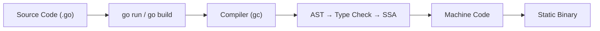

# 01 — Getting Started with Go

## What Is Go?

Go (often called **Golang** for searchability) is a statically typed, compiled programming language designed at Google by **Robert Griesemer**, **Rob Pike**, and **Ken Thompson** (a co-creator of Unix and B). It was publicly announced in November 2009 and has since become one of the most widely used languages for backend systems, cloud infrastructure, DevOps tooling, and network services.

Go was created to address specific challenges that Google engineers faced:

- **Slow compilation** of large C++ codebases
- **Unwieldy dependency management** across thousands of packages
- **Difficulty writing concurrent software** that takes advantage of multi-core processors
- **Language complexity** that made onboarding new engineers slow

The result is a language that is intentionally **simple**. Go has a small keyword set, a clean syntax, and a standard library that does a remarkable amount of heavy lifting. It compiles fast, produces efficient binaries, and has first-class support for concurrency.

**Go is not trying to be everything.** It deliberately omits features that other languages consider essential — inheritance, exceptions, enums, constructors, generics (until Go 1.18), and more. Every omission is a design choice. Understanding *why* Go left something out is as important as understanding what it includes.

## The Go Philosophy

Go's design is guided by a few core principles:

| Principle | Meaning |
|-----------|---------|
| **Simplicity** | A small language with a clean, minimal feature set |
| **Speed** | Compiled to native machine code, fast to build and run |
| **Concurrency built-in** | Goroutines and channels make parallel programming natural |
| **Productivity** | Fast compile times, easy tooling, automatic documentation, built-in testing and formatting |

Go achieves this simplicity by **removing features** that other languages consider standard:

- **No classes** — uses structs and methods instead
- **No inheritance** — uses composition and interfaces instead
- **No exceptions** — uses explicit error returns
- **No generics** (until Go 1.18) — added in 2022 after much deliberation
- **No function/method overloads**
- **No default parameter values**
- **No optional named parameters**
- **No implicit type conversions** — all conversions are explicit
- **No `while` / `do-while` loops** — only `for`, which serves all loop forms
- **No ternary operator** — use an if statement

The result is a language where there is usually **one idiomatic way** to do something. Go code everywhere tends to look similar, which aids readability across teams and projects.

> 🔑 **Key idea:** Go doesn't want to do everything — it wants to do a few things well. Every omission (no classes, no exceptions, no ternaries) is a deliberate design decision.

## Why Go?

| Characteristic | Benefit |
|----------------|---------|
| Statically typed | Catches errors at compile time |
| Compiled | Fast startup and execution, single static binaries |
| Garbage collected | No manual memory management (but unlike Java, low latency) |
| Goroutines | Lightweight threads, can spawn thousands/tens of thousands |
| Built-in tooling | `go fmt`, `go test`, `go vet`, `go build`, `go run`, `go doc` |
| Cross-platform | Compile to Windows, macOS, Linux, and more from any OS |
| Great for servers | Standard library has excellent HTTP/networking support |
| Simple syntax | Very short learning curve, easy to read |

## Strong Use Cases for Go

- **Web servers and APIs** — the `net/http` package is excellent
- **CLI tools and utilities** — single binary deployment
- **Microservices** — Docker, Kubernetes, Prometheus, Terraform are all in Go
- **Network daemons and distributed systems** — etcd, Consul, gRPC
- **Cloud-native infrastructure** — the dominant language of the CNCF ecosystem
- **DevOps tooling** — CI/CD pipelines, automation
- **High-performance backends** — many companies use Go for their backends

### Where Go Is NOT the Best Fit

- Desktop/mobile GUI applications (limited mature GUI libraries)
- Very math/algorithm-heavy domains lacking a GC-friendly profile (though fine)
- Systems programming requiring extreme low-level control where Rust/C++ shine

> 🧠 **Think of it as:** Go is the "boring, reliable" language for the server room — not the tool for GUI apps or pixel-pushing graphics.

## Go vs Other Languages (Quick Comparison)

| Aspect | Go | Python | Node.js | Java | Rust |
|--------|----|--------|---------|------|------|
| Typing | Static | Dynamic | Dynamic | Static | Static |
| Compilation | Compiled | Interpreted | JIT | JIT/VM | Compiled |
| Concurrency | Goroutines | Threads/async | Callbacks/async | Threads | Threads/async |
| Memory | GC | GC | GC | GC | Manual (ownership) |
| Startup speed | Instant | Fast | Fast | Slow | Instant |
| Learning curve | Low | Very low | Low | Medium | High |

## Key Language Facts

- **Go 1.x** has maintained a strict **backward compatibility guarantee** since its release. Code written for Go 1.0 still compiles on the latest 1.x.
- Go releases new versions roughly twice a year (February and August).
- Major notable version milestones:
  - **Go 1.0 (2012)** — first stable release
  - **Go 1.5 (2015)** — self-hosting compiler (Go now compiles itself in Go)
  - **Go 1.11 (2018)** — **modules** (modern dependency management)
  - **Go 1.18 (2022)** — **generics**
  - **Go 1.21 (2023)** — toolchain management, `maps`/`slices` packages
  - **Go 1.22 (2024)** — per-iteration loop variables, range-over-int

## Installation

### 1. Download

Visit the [official download page](https://go.dev/dl/) and download the installer for your platform.

### 2. Platform-Specific Setup

#### Windows

1. Download the `.msi` installer
2. Run it — it installs Go to `C:\Program Files\Go` and adds `go.exe` to your system PATH automatically
3. Open a new terminal and verify

#### macOS

1. Download the `.pkg` installer from the download page
2. Run the installer — it installs Go to `/usr/local/go`
3. Add Go to your PATH by adding this line to your `~/.zshrc` or `~/.bash_profile`:

```sh
export PATH="$PATH:$(go env GOPATH)/bin"
```

4. Restart your terminal, or run `source ~/.zshrc`

#### Linux

1. Download the `.tar.gz` archive
2. Remove any previous Go installation, then extract:

```sh
sudo rm -rf /usr/local/go
sudo tar -C /usr/local -xzf go1.24.linux-amd64.tar.gz
```

3. Add to PATH in `~/.profile` or `~/.bashrc`:

```sh
export PATH=$PATH:/usr/local/go/bin
export PATH="$PATH:$(go env GOPATH)/bin"
```

4. Restart your terminal or source the file.

### 3. Verify the Installation

Open a terminal and run:

```sh
go version
# Example output:
# go version go1.24.2 windows/amd64
```

You should see the Go version, your OS, and your architecture. Also verify your environment:

```sh
go env
```

This prints all Go environment variables. The important ones are:

| Variable | What it means |
|----------|---------------|
| `GOROOT` | Where Go is installed (usually `/usr/local/go`) |
| `GOPATH` | Where your Go workspace lives (usually `~/go`) |
| `GOPROXY` | Where Go fetches modules from (default: `https://proxy.golang.org,direct`) |

You generally don't need to change these defaults.

> 💡 **Pro tip:** `go env` is read-only here — if you ever need to tweak a setting permanently, use `go env -w`, not environment variables.

### 4. Workspace Basics

Since Go 1.11+, you should not need to set up a `GOPATH`-based workspace. Just create a project directory anywhere and initialize a module:

```sh
mkdir myproject
cd myproject
go mod init example.com/myproject
```

This creates a `go.mod` file. You can keep your entire project (all packages) inside this directory. We will cover modules in detail in [02-toolchain-and-modules.md](02-toolchain-and-modules.md).

> 💡 **Pro tip:** `go mod init example.com/myproject` — a domain-style path from day one means imports match later when you publish or host the repo.

## Your First Go Program

Create a file `main.go`:

```go
package main

import "fmt"

func main() {
    fmt.Println("Hello, Go!")
}
```

Run it:

```sh
go run .
# Output: Hello, Go!
```

Or run a specific file:

```sh
go run main.go
```

> ⚠️ **Watch out:** `go run` discards the binary after execution. It's for development; use `go build` when you want a deployable executable.

Compile to a standalone binary:

```sh
go build -o hello .
# Produces hello (or hello.exe on Windows), a self-contained executable
# that can be copied to any machine with the same OS/architecture.
```

Run the binary directly:

```sh
./hello
# Output: Hello, Go!
```

## Anatomy of a Go Program

Let's break down every part of the Hello World program:

```go
package main
```

Every Go file belongs to a **package**. The `package main` declaration tells the Go compiler "this package should compile as an executable program, not a library." Every executable Go program must have exactly one `main` package. Every source file must begin with a `package` declaration.

```go
import "fmt"
```

The `import` statement brings in other packages. `fmt` is part of Go's standard library and provides formatted I/O functions — printing, scanning, formatting strings. The import path is the full package path. You can import multiple packages:

```go
import (
    "fmt"
    "os"
)
```

```go
func main() {
```

`func` declares a function. `main` is a special name — it's the entry point of the program. When you run a Go executable, execution begins at `main()`. The `main` function takes no arguments and returns nothing.

```go
    fmt.Println("Hello, Go!")
}
```

`fmt.Println` prints its arguments to standard output followed by a newline. The `fmt` package name is used as a prefix because Go uses dot notation to access package members. Every opening brace `{` must have a closing brace `}`. Go does not use `end` keywords or significant whitespace.

### What Happened When You Ran It

When you ran `go run .`:

1. Go read your `go.mod` to understand the module
2. Go compiled `main.go` into machine code
3. Go executed the resulting binary
4. The binary printed "Hello, Go!" and exited

`go run` does this all in one step. It compiles and runs in a temporary directory. The binary is not kept.

The compiled binary from `go build` is a **standalone executable** — it contains everything it needs. You can copy it to another machine of the same OS/architecture and run it **without Go installed**. This is one of Go's great strengths for deployment.

> 🔑 **Remember:** one static binary = zero runtime dependencies. No JVM, no Node, no Go install needed on the target machine.

## Basic Syntax Rules

- **No semicolons required** — the compiler inserts them automatically at the end of lines. (You can write semicolons explicitly, but idiomatic Go omits them.)
- **Braces `{ }` required** — the opening brace `{` must be on the same line as the `if`, `for`, `func`, etc. Go's style (`gofmt`) enforces this.
- **Comments**:
  ```go
  // single-line comment

  /*
     multi-line
     comment
  */
  ```
- **Statement termination**: Go does not require a terminating semicolon after the last statement in a block.
- **Identifiers** must start with a letter or underscore, then letters, digits, or underscores. Unused variables are **compile errors**.



## How Go Compiles

Go is a **compiled** language. The `go build` toolchain compiles source to native machine code. The pipeline has several stages:

1. **Lexing/Parsing** — source text is turned into an AST (abstract syntax tree)
2. **Type checking** — Go's type checker validates types and resolves names
3. **SSA (Static Single Assignment)** — lowers the AST into an intermediate representation for optimization
4. **Backend** — generates assembly for the target CPU architecture (amd64, arm64, etc.)
5. **Linking** — combines object files into an executable

### Why Go Compiles Fast

Compared to C++ and Rust, Go's compilation is famously quick. Reasons:

- **Whole-module, not whole-program analysis** — each package is compiled somewhat independently
- **Export data files** — package type information is cached and reused, so only changed files need recompiling
- **Simpler language features** — no templates/traits to explode the number of instantiations
- **Incremental build cache** — `go build` reuses previous results (the build cache in `$GOCACHE`)

> 🧠 **Memory aid:** Go compiles fast because it does *less global work* — packages are compiled almost independently and results are cached, so only what changed gets rebuilt.

## Exercise

1. Modify `main.go` to print your name
2. Create a second file in the same directory called `greet.go` with a function that takes a name and returns a greeting string
3. Have `main.go` call that function and print the result
4. Run `go run .` to verify everything works

**Hint:** Both files must have `package main` at the top, and they share the same package namespace.

## Modern Practices

- Always start new projects with `go mod init` — forget GOPATH-based workflows
- Install Go via the official installer from [go.dev/dl](https://go.dev/dl/), not apt/pip
- Use a modern editor with LSP support (VS Code + gopls, or GoLand)
- Run `go fmt` / `gofmt` on save; don't manually format code
- Include `go vet` in CI pipelines to catch suspicious constructs early
- Use `go run .` and `go build ./...` patterns for working with modules
- Use Go 1.21+ built-in toolchain management (no manual `GOTOOLCHAIN` tweaking)

## Common Mistakes

- **Forgetting `package main`** — every file must start with a package declaration. Without it, you get a compile error.
- **Mismatched braces** — Go requires braces. Unlike Python, you cannot omit them. The opening brace must be on the same line as the statement — this is not a style preference; Go's automatic semicolon insertion depends on this rule:
  ```go
  // Correct
  func main() {

  // Wrong — compile error
  func main()
  {
  ```
- **Capitalization matters** — `Println` is different from `println`. The first letter also determines visibility (exported vs unexported).
- **Not running from the right directory** — `go run .` runs the package in the current directory. Make sure you're in the directory containing your `go.mod` file.
- Assuming code must live inside GOPATH — it doesn't with modules
- Running an outdated Go version and missing language improvements
- Editing Go files with a plain text editor that has no Go LSP support
- Mixing tabs and spaces manually instead of letting `gofmt` handle it

## Key Takeaways

1. Go is a **statically typed**, compiled language that emphasizes simplicity.
2. Every executable needs `package main` and `func main()`.
3. Go compiles to **static binaries** — no runtime installation needed on the target machine.
4. The Go toolchain bundles build, test, format, vet, and dependency management into one `go` command.
5. The compilation pipeline is fast due to package-level compilation and build caching.
6. Modern Go uses **modules** (since Go 1.11) for dependency management — forget GOPATH.

## Next

Continue to [02-toolchain-and-modules.md](02-toolchain-and-modules.md) to learn about the Go toolchain commands, modules, and `go.mod`/`go.sum`.
