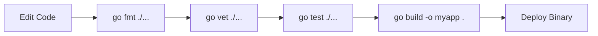
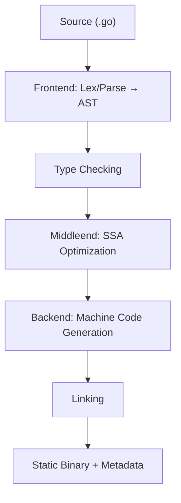

# 02 — The Go Toolchain and Modules

## Overview

Go ships with a powerful set of tools built into the `go` command. Unlike many languages where you need separate tools for building, testing, formatting, linting, and dependency management, Go bundles all of this into a single command. Understanding these tools is essential to being productive in Go.

## The Go Toolchain Commands

| Command | Purpose |
|---------|---------|
| `go run <file.go>` | Compile and run without leaving a binary |
| `go build` | Compile the current package into an executable |
| `go install` | Build and install into `$GOPATH/bin` |
| `go fmt` | Automatically format your code to the official style |
| `go vet` | Report suspicious constructs |
| `go test` | Run tests in the current package |
| `go doc <symbol>` | Show documentation for a package/symbol |
| `go mod init <module>` | Initialize a new module |
| `go mod tidy` | Add/remove dependencies to match imports |
| `go get <package>` | Add a dependency |
| `go clean` | Remove build artifacts |
| `go list` | List packages |
| `go env` | Print environment settings |
| `go version` | Show the Go version |

## `go run`

`go run` compiles and runs a Go package in one step:

```sh
go run main.go
# or
go run .
```

The first form runs a specific file. The second runs the package in the current directory. `go run` creates a temporary binary, executes it, and discards it afterward. It's convenient for development but does not produce a permanent binary.

**When to use it:** During development, when you want to quickly test something.

> 💡 **Note:** `go run .` runs the whole current package — prefer it over `go run file.go` once your project has multiple files.

## `go build`

`go build` compiles your code into an executable binary:

```sh
go build -o myapp .
```

This creates a binary called `myapp` in the current directory. The binary is a standalone executable — it includes the Go runtime and everything needed to run.

If you omit the `-o` flag, the binary name defaults to the name of the directory (or the module name). For example, in a directory called `myserver`, `go build .` creates a binary called `myserver`.

### Cross-Compilation

Cross-compilation is built in. To build for a different OS or architecture:

```sh
# Build for Linux on AMD64
GOOS=linux GOARCH=amd64 go build -o myapp .

# Build for Windows on AMD64
GOOS=windows GOARCH=amd64 go build -o myapp.exe .

# Build for macOS on Apple Silicon
GOOS=darwin GOARCH=arm64 go build -o myapp .
```

`GOOS` and `GOARCH` are environment variables. The full list is available with:

```sh
go tool dist list
```

You do not need a cross-compilation toolchain. Go compiles for all supported platforms from any platform, using only the standard Go installation. This is possible because Go uses its own toolchain rather than relying on the host system's C compiler (in most cases).

**When to use it:** When you want a permanent binary — for deployment, distribution, or testing on another machine.

> 💡 **Pro tip:** Cross-compiling is free in Go. Setting `GOOS=linux GOARCH=amd64` before `go build` lets you produce Linux binaries straight from Windows or macOS — ideal for container images.

## `go install`

`go install` is similar to `go build`, but instead of leaving the binary in the current directory, it places it in `$GOPATH/bin` (typically `~/go/bin`):

```sh
go install github.com/golangci/golangci-lint/cmd/golangci-lint@latest
```

This downloads, builds, and installs the `golangci-lint` binary into your `$GOPATH/bin`. If that directory is in your `PATH`, the binary becomes available as a command.

`go install` is the standard way to install Go tools and utilities.

**When to use it:** When you want to install a Go program as a command-line tool available from anywhere in your terminal.

## `go test`

Go has testing built into the language and the toolchain:

```sh
# Run all tests in the current package and subdirectories
go test ./...

# Verbose output
go test -v ./...

# Run a specific test
go test -run TestName ./...

# Run tests with the race detector
go test -race ./...
```

Go's testing conventions are specific:

- Test files end with `_test.go`
- Test functions start with `Test` and take a `*testing.T` argument
- Tests are co-located with the code they test

We will cover testing in depth in a dedicated section. For now, just know that `go test` exists and is built into the standard workflow.

## `go fmt`

`go fmt` formats your code according to the standard Go style:

```sh
go fmt ./...
```

Go's approach to formatting is unique: instead of arguing about style, the community lets a tool decide. `gofmt` (the underlying tool) and `go fmt` (the package-level wrapper) automatically format:

- **Indentation** (tabs, not spaces)
- **Brace placement**
- **Spacing around operators**
- **Alignment of struct fields**
- **Line wrapping**

You should run `go fmt` before committing code. Most editors and IDEs can be configured to format on save.

**Why tabs, not spaces?** The Go team decided that tabs are more accessible — different people set different visual widths for tabs, while spaces are always the same number of characters. The tool uses tabs for indentation and spaces for alignment when needed.

**When to use it:** Always. Every Go source file in the standard library is formatted with `gofmt`. Your code should be too.

> 🧠 **Think of it as:** formatting is the community's house style — let `gofmt` decide, and never argue about where braces go again.

## `go vet`

`go vet` analyzes your code for suspicious constructs:

```sh
go vet ./...
```

It catches common mistakes like:

- `Printf` format string issues (wrong number of arguments)
- Unreachable code
- Incorrect use of struct tags
- Suspicious assignments
- Misuse of `sync.Mutex`

`go vet` is not a linter in the full sense — it focuses on correctness issues that are almost certainly bugs. It catches things that compile but are probably wrong.

**When to use it:** Before every commit. Run `go vet ./...` along with `go fmt ./...`.

## `go doc`

Go includes built-in documentation:

```sh
# Documentation for the fmt package
go doc fmt

# Documentation for a specific function
go doc fmt.Println

# Documentation for a specific type
go doc fmt.Stringer
```

You can also start a local documentation server:

```sh
go doc -http=:6060 &
```

Then open `http://localhost:6060` in your browser. This serves the same documentation that appears on `pkg.go.dev`.

## `go clean` and `go list`

```sh
# Remove build artifacts
go clean

# List all packages in the current module
go list ./...

# Show the full import path of a module
go list -m

# Show all dependencies
go list -m all
```

## The Development Workflow

A typical Go development cycle looks like this:



```sh
# 1. Edit code
vim main.go

# 2. Format and check
go fmt ./...
go vet ./...

# 3. Run tests
go test ./...

# 4. Build
go build -o myapp .
```

Many developers automate `go fmt` and `go vet` to run on save in their editor. This means you almost never have to think about formatting — it just happens.

## Go Modules (Modern Dependency Management)

A **module** is a collection of Go packages that are versioned together as a single unit. The module is defined by a `go.mod` file in its root directory. Go modules were introduced in Go 1.11 (2018) and became the default in Go 1.16 (2021). They are now the only officially supported dependency management system.

### Creating a Module

```sh
go mod init hello-go
```

This creates a `go.mod` file:

```
module hello-go

go 1.24
```

This minimal `go.mod` says:
- The module path is `hello-go`
- It requires Go version 1.24 or later

The module path is how other packages refer to your module. If you eventually publish your code to a repository, the module path would typically be the repository URL:

```
module github.com/yourname/yourproject
```

For local development, a simple name like `hello-go` works fine.

### Understanding `go.mod`

Here's a more complete `go.mod` example from a real project:

```
module github.com/myuser/myproject

go 1.24

require (
    github.com/gin-gonic/gin v1.10.0
    github.com/lib/pq v1.10.9
    github.com/stretchr/testify v1.9.0
)

require (
    github.com/bytedance/sonic v1.11.6 // indirect
    github.com/cloudwego/base64x v0.1.4 // indirect
    // ... more indirect dependencies
)
```

| Directive | Meaning |
|-----------|---------|
| `module` | The identity of your module |
| `go` | The minimum Go version required |
| `require` | Direct dependencies and their versions |
| `// indirect` | Dependencies pulled in by your direct dependencies |

**Indirect dependencies** are packages that your dependencies depend on. You don't import them directly, but Go needs to track them to ensure reproducible builds.

### Understanding `go.sum`

The `go.sum` file contains cryptographic checksums for every dependency:

```
rsc.io/quote v1.5.2 h1:KjQ2yVcgG2zWlkWx4sCh6hdJCWfpUGFNSJEO0zB6jHw=
rsc.io/quote v1.5.2/go.mod h1:Rg...
```

This file is checked into version control. Its purpose is **reproducibility** — when someone runs `go mod download`, Go verifies that the downloaded modules match the checksums in `go.sum`. This prevents:

- Corrupted downloads
- Tampered modules
- "Works on my machine" problems

**Never edit `go.sum` by hand.** Go manages it automatically. You can verify the full dependency tree's checksums with `go mod verify`.

> ⚠️ **Watch out:** `go.sum` is not a lockfile you hand-tune — it's a checksum ledger. Let `go mod tidy` and `go get` write it, and commit it unchanged.

### Adding a Dependency

```sh
go get github.com/gorilla/mux
```

This adds the dependency and records the version in `go.mod`. After adding imports to your code, sync `go.mod` and `go.sum`:

```sh
go mod tidy
```

`go mod tidy` does two things:
1. Adds any missing module dependencies that your code imports
2. Removes module dependencies that your code no longer uses

Think of it as "make `go.mod` match what the code actually needs."

> 🔑 **Remember:** run `go mod tidy` after adding or removing imports — it both adds what's missing and removes what's unused.

### Updating Dependencies

```sh
# Update a specific dependency to its latest version
go get github.com/gin-gonic/gin@latest

# Update all dependencies
go get -u ./...

# Tidy up after updating
go mod tidy
```

### Viewing the Dependency Graph

```sh
# View your module dependency graph
go mod graph

# View the full list of every module in the build
go list -m all
```

### The Version Format

Go uses **Semantic Versioning** (major.minor.patch):

```
v1.9.1            # standard release
v0.3.0-rc.1       # pre-release with suffix
v2.0.0+incompatible
```

- **MAJOR** (v2, v3, ...): Breaking changes. A new major version is essentially a different module.
- **MINOR** (v1.1.0, v1.2.0): New features, backward compatible.
- **PATCH** (v1.1.1, v1.1.2): Bug fixes, backward compatible.

### Major Version Suffixes

If a package releases version 2, you import it as:

```go
import "github.com/someone/pkg/v2"
```

And in `go.mod`:

```
require github.com/someone/pkg/v2 v2.3.1
```

This is different from most other package managers. The reasoning is that `github.com/someone/pkg` (v1) and `github.com/someone/pkg/v2` are different modules with different APIs. There is no ambiguity.

### Package Resolution

- Go fetches dependencies from **proxy.golang.org** by default
- Checksums are recorded in `go.sum` to verify integrity
- Full checksums of the whole dependency tree can be verified with `go mod verify`

### Private Modules

If you have private repositories, you can configure Go to authenticate with them:

```sh
# For GitHub private repos
git config --global url."git@github.com:".insteadOf "https://github.com/"

# Set the private proxy
go env -w GOPRIVATE=github.com/yourcompany/*
```

`GOPRIVATE` tells Go to fetch these modules directly from the source (via git) rather than through the public module proxy.

### The `go mod vendor` Option

Some projects prefer to vendor their dependencies — to copy all dependency source code into the project:

```sh
go mod vendor
```

This creates a `vendor/` directory containing all dependencies. You can then build with:

```sh
go build -mod=vendor .
```

**When to use vendoring:**
- When you need hermetic builds (no network access required)
- In CI/CD environments where downloading dependencies is slow or unreliable
- When you need to guarantee that builds use exact dependency versions

**When not to use vendoring:** Most of the time. The module cache and `go.sum` provide reproducibility without the overhead of vendoring.

> 💡 **Note:** `go mod vendor` is the exception, not the rule — reach for it for hermetic builds, not everyday development.

### Working Without Modules

Before modules, Go used `GOPATH`. Some very old tutorials still reference this. **Do not follow them.** If you see instructions that mention setting `GOPATH` or cloning code into `$GOPATH/src`, they are outdated. Modules are the standard and have been since Go 1.16.

> ⚠️ **Gotcha:** Old tutorials full of `GOPATH` rituals are stale. With modules you can initialize a project in any folder with `go mod init` — no special workspace directory needed.

## The Compilation Pipeline (Theory)

For a deeper understanding of what happens under the hood when you run `go build`, here is the compilation pipeline:



### Stack vs Heap

The compiler also makes decisions about where values live:

| | Stack | Heap |
|---|-------|------|
| Allocation | Fast (just move a pointer) | Slower (GC-managed) |
| Scope | Function-local, freed on return | Outlives function calls |
| Used for | Locals, temporaries, small values | Escaping values, large structs |
| Managed by | Compiler + runtime | Garbage collector |

### Escape Analysis

Go decides automatically whether a value goes on the **stack** or the **heap**. If a value (or its address) "escapes" the function — for example, you return a pointer to a local variable — it must be heap-allocated.

```go
func f() *int {
    x := 10
    return &x   // x escapes to the heap (safe; GC keeps it alive)
}

func g() int {
    y := 10   // y stays on the stack (doesn't escape)
    return y
}
```

Inspect escape decisions:

```sh
go build -gcflags="-m" .
# output includes: "x escapes to heap" or "y does not escape"
```

> **Why care?** Heap allocation costs more than stack allocation and adds GC pressure. Avoiding unnecessary escapes improves performance, especially in hot loops.

### Go's Calling Convention

Historically Go used its own stack-based ABI. Starting with Go 1.17, Go ships arguments/returns in **registers** (like most C ABIs) for better performance, with a register-based ABI used on all platforms by Go 1.18+.

> Implications for you: calling conventions are handled automatically. You typically don't need to think about it — but it's why Go can be fast without sacrificing simplicity.

### Why Go Compiles Fast

Compared to C++ and Rust, Go's compilation is famously quick. Reasons:

- **Whole-module, not whole-program analysis** — each package is compiled somewhat independently
- **Export data files** — package type information is cached and reused, so only changed files need recompiling
- **Simpler language features** — no templates/traits to explode the number of instantiations (though generics added some)
- **Incremental build cache** — `go build` reuses previous results (the build cache in `$GOCACHE`)

## Modern Practices

- Use `go fmt` and `go vet` as part of every workflow — ideally automated on save
- Run `go test -race ./...` routinely to surface data races the compiler cannot catch
- Always run `go mod tidy` after adding/removing imports
- Use `go build -gcflags=-m` to inspect escape analysis decisions and tune hot paths
- In containers, be aware `GOMAXPROCS` defaults to host CPU count; use `automaxprocs` or set it explicitly
- Use `go doc` and `pkg.go.dev` for documentation rather than memorizing APIs
- Cross-compile from your dev machine rather than deploying a build toolchain to production

## Common Mistakes

- **Forgetting to run `go mod tidy`** after adding/removing imports — leads to stale `go.mod`
- **Editing `go.sum` by hand** — always let tooling manage it
- **Ignoring `go vet` warnings** and letting issues accumulate
- **Not pinning the Go version in `go.mod`** for reproducible builds
- **Using `GOPATH`-based workflows** from old tutorials — modules are the standard since Go 1.16
- **Mixing tabs and spaces manually** instead of letting `gofmt` handle it
- **Using an outdated Go version** and missing language improvements
- **Editing Go files with a plain text editor** that has no Go LSP support

## Key Takeaways

1. The `go` command bundles build, test, format, vet, doc, and dependency management.
2. `go run` is for development; `go build` produces permanent binaries.
3. Cross-compilation is built in via `GOOS`/`GOARCH` — no extra toolchain needed.
4. `go fmt` enforces a single code style; `go vet` catches likely bugs.
5. A **module** is defined by `go.mod` and tracked by `go.sum`.
6. `go mod tidy` synchronizes your dependencies with your imports.
7. Semantic versioning with major version suffixes ensures backward compatibility.
8. The compilation pipeline (AST → SSA → machine code) is fast due to package-level compilation and build caching.
9. Escape analysis determines stack vs heap allocation automatically.

## Next

Continue to [03-variables-constants-types.md](03-variables-constants-types.md) to learn about Go's variables, constants, data types, and zero values.
