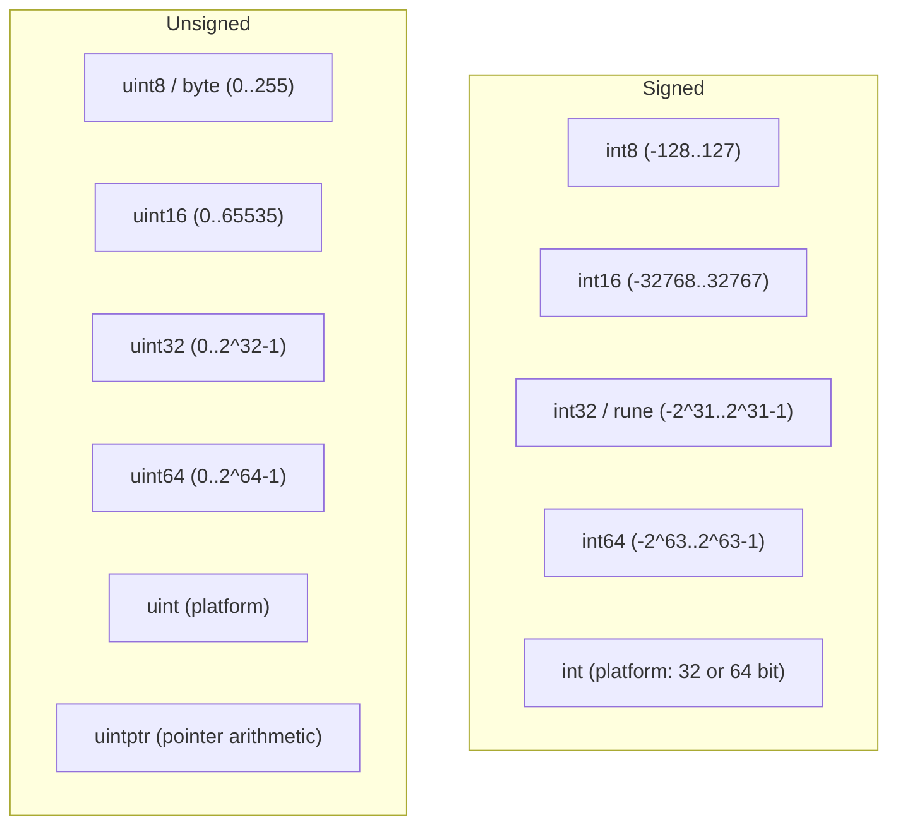
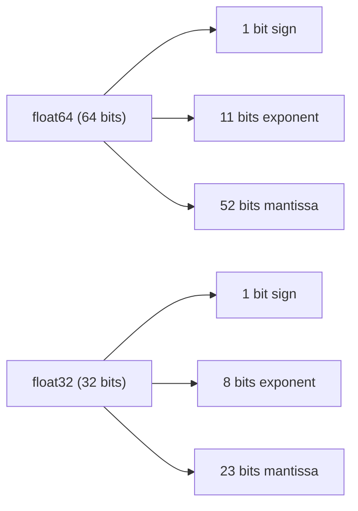

# 03 — Variables, Constants, and Types

## Variable Declarations

Go provides three ways to declare variables. Each exists for a reason.

### The `var` Keyword

The most explicit form:

```go
var age int
var name string
var isActive bool
```

This declares a variable and assigns it the **zero value** of its type. You can also provide an initial value:

```go
var age int = 25
var name string = "Alice"
```

### Type Inference

When you provide an initial value with `var`, Go can infer the type:

```go
var age = 25         // int
var name = "Alice"   // string
var pi = 3.14159     // float64
var active = true    // bool
```

Go always infers `float64` for floating-point literals, not `float32`. If you need `float32`, say so explicitly:

```go
var pi32 float32 = 3.14159
```

### The Short Variable Declaration: `:=`

Inside functions, use `:=` to declare and initialize in one step:

```go
func main() {
    age := 25
    name := "Alice"
    fmt.Println(name, age)
}
```

**Key rule:** `:=` can only be used inside functions. Package-level declarations must use `var`:

```go
var configPath = "/etc/myapp/config"  // OK

// configPath := "/etc/myapp/config"  // compile error at package level
```

**Why does `:=` exist?** It reduces boilerplate. Writing `var name string = "Alice"` is verbose. The `:=` form communicates the same intent concisely: "create a variable, infer its type, give it this value."

> 💡 **Note:** `:=` is the default inside functions; reserve `var` for package-level declarations and cases where you need to be explicit about the type.

### When to Use Each

- **`var x type`** — When you want to be explicit about the type, or need a zero-initialized variable without an immediate value.
- **`var x = value`** — Package-level declarations with initial values.
- **`x := value`** — The default choice inside functions.

The Go community overwhelmingly prefers `:=` inside functions.

## Multiple Variable Declarations

Go lets you declare multiple variables at once:

```go
var (
    name   string
    age    int
    active bool
)
```

This is common at package level for grouping related variables:

```go
var (
    appName    = "myapp"
    appVersion = "1.0.0"
    maxRetries = 3
)
```

Inside functions, you can declare multiple variables with `:=`:

```go
func main() {
    name, age := "Alice", 30
    fmt.Println(name, age)
}
```

### The `:=` Multi-Variable Rule

At least one variable on the left side must be new. If all variables already exist, use `=`:

```go
func main() {
    x, y := 10, 20
    x, y = 30, 40       // OK: plain assignment
    // x, y := 30, 40   // compile error: no new variables
}
```

When mixing old and new variables, `:=` declares new ones and reassigns existing ones:

```go
func main() {
    x := 10
    x, y := 20, 30  // x is reassigned, y is newly declared
}
```

> ⚠️ **Gotcha:** `:=` requires at least one new variable on the left. If every variable already exists, the compiler rejects it — switch to `=`.

## Zero Values

Every variable in Go has a default "zero value" if not explicitly initialized. There is no concept of an "uninitialized variable" in Go.

| Type | Zero Value |
|------|-----------|
| `int`, `int8`, `int16`, `int32`, `int64` | `0` |
| `uint`, `uint8`, `uint16`, `uint32`, `uint64` | `0` |
| `float32`, `float64` | `0.0` |
| `complex64`, `complex128` | `0+0i` |
| `string` | `""` (empty string) |
| `bool` | `false` |
| `byte` (`uint8`) | `0` |
| `rune` (`int32`) | `0` |
| `pointer`, `interface` | `nil` |
| `slice`, `map`, `channel`, `func` | `nil` |
| `struct` | All its fields are zero |
| `array` | Zero values of each element |

```go
func main() {
    var n int            // 0
    var f float64        // 0
    var b bool           // false
    var s string         // ""
    var p *int           // nil
    var sl []int         // nil
    var m map[string]int // nil

    fmt.Println(n, f, b, s, p, sl, m)
}
```

> 🔑 **Key idea:** Go has no "uninitialized variable" — every declaration gets a safe zero value. That single rule eliminates a whole class of C-style bugs.

### Why Zero Values?

In C, uninitialized variables contain garbage. Go guarantees every variable starts in a known state. Zero values also enable a common pattern — declare, then conditionally assign:

```go
var result string
if condition {
    result = "yes"
} else {
    result = "no"
}
```

This is clearer than the ternary operator. Go deliberately omits `?:` because complex nested expressions are hard to read.

### The Zero-Value-Is-Useful Design Principle

Go was designed so that zero values are meaningful. This is a core philosophy, not an accident.

**No need for constructors:**

```go
type Counter struct {
    count int
    step  int
}

var c Counter
c.step = 1 // only set what you need
```

**Zero value as sentinel for "not set":**

```go
func applyDefaults(cfg Config) Config {
    if cfg.Host == "" {
        cfg.Host = "localhost"
    }
    if cfg.Port == 0 {
        cfg.Port = 8080
    }
    return cfg
}
```

**Ready-to-use slices:**

```go
func FilterPositive(nums []int) []int {
    var result []int // nil slice, ready to use
    for _, n := range nums {
        if n > 0 {
            result = append(result, n)
        }
    }
    return result
}
```

Note that a nil slice serializes to `null` in JSON, while an empty slice (`[]int{}`) serializes to `[]`. You can distinguish them:

```go
var a []int         // nil
b := []int{}        // empty, non-nil
fmt.Println(a == nil) // true
fmt.Println(b == nil) // false
fmt.Println(len(a))   // 0
fmt.Println(len(b))   // 0
```

### Struct Zero Values

A struct's zero value is the struct with each field set to its own zero value:

```go
type User struct {
    Name   string
    Age    int
    Active bool
    Score  float64
}

var u User
fmt.Printf("%+v\n", u) // {Name: Age:0 Active:false Score:0}
u.Name = "Alice"        // works perfectly, no initialization needed
```

### The `nil` Zero Value

Pointers, slices, maps, channels, interfaces, and functions have a zero value of `nil`. This is where care is needed:

```go
var m map[string]int
fmt.Println(m["key"]) // 0 — reading from nil map returns zero value, no panic
// m["key"] = 1       // panic: assignment to entry in nil map
```

```go
var s []int
fmt.Println(len(s))      // 0
s = append(s, 1, 2, 3)   // appending to nil slice works
fmt.Println(s)            // [1 2 3]
```

The key distinctions:
- **Nil slices** are usable for reading and appending.
- **Nil maps** are usable for reading but not writing (writing panics).
- **Nil pointers and interfaces** must be checked before dereferencing or calling methods.

> ⚠️ **Watch out:** appending to a nil slice works fine and auto-initializes it, but writing to a nil map panics at runtime. When in doubt, `make(map[...])`.

### What Happens When You Don't Initialize

Since all variables have zero values, your program never crashes from uninitialized variables in the traditional sense. But relying on zero values unintentionally leads to silent bugs:

```go
var total int // user intended to start at 1, but forgot
for i := 1; i <= 5; i++ {
    total += i
}
// total is 15, not 20 — the zero value hid a logic error
```

The Go compiler also ensures variables are used. You cannot declare a variable and never reference it:

```go
var x int // compile error: x declared but not used
```

## Constants

Constants are values fixed at compile time. They are immutable and substituted by the compiler wherever they are used.

```go
const Pi = 3.141592653589793
const MaxConnections = 100
```

Multiple constants can be grouped:

```go
const (
    StatusOK       = 200
    StatusCreated  = 201
    StatusNotFound = 404
)
```

### Untyped Constants

By default, constants are **untyped**. They adapt to the type they are used with:

```go
const Pi = 3.14159

func main() {
    var f float32 = Pi  // OK: untyped constant adapts to float32
    var d float64 = Pi  // OK
    // var i int = Pi   // compile error: cannot use float64 constant as int
}
```

### Typed Constants

You can give a constant an explicit type:

```go
const Pi float64 = 3.14159
const Timeout time.Duration = 30 * time.Second
```

Typed constants cannot be implicitly converted:

```go
const Pi float64 = 3.14159

func main() {
    // var f float32 = Pi  // compile error
    var f float64 = Pi     // OK
}
```

### Constants Must Be Compile-Time Evaluable

```go
const x = someFunction()  // compile error: not a constant expression
```

> ⚠️ **Watch out:** constants are computed at compile time only — no function calls, no `time.Now()`, nothing runtime-dependent.

## `iota`

Go provides `iota` for creating sequences of constants. It starts at 0 and increments by 1 for each constant in a `const` block:

```go
const (
    Sunday = iota  // 0
    Monday         // 1
    Tuesday        // 2
    Wednesday      // 3
    Thursday       // 4
    Friday         // 5
    Saturday       // 6
)
```

`iota` resets to 0 in each new `const` block:

```go
const (
    A = iota  // 0
    B         // 1
)

const (
    X = iota  // 0 (reset)
    Y         // 1
)
```

### `iota` with Bitmasks

```go
const (
    FlagRead    = 1 << iota  // 1
    FlagWrite                // 2
    FlagExecute              // 4
)

func main() {
    permissions := FlagRead | FlagWrite  // 3
    fmt.Println(permissions)
}
```

> 🧠 **Memory aid:** `iota` is just an auto-incrementing counter that resets to 0 at the start of every `const` block — count lines, don't guess values.

### `iota` with Expressions

```go
const (
    _  = iota
    KB = 1 << (10 * iota)  // 1 << 10 = 1024
    MB                     // 1 << 20
    GB                     // 1 << 30
    TB                     // 1 << 40
)
// KB = 1024, MB = 1,048,576, GB = 1,073,741,824
```

## Basic Data Types

### Integer Types



**Signed integers:**

| Type | Size | Range |
|------|------|-------|
| `int` | platform (32 or 64 bit) | varies |
| `int8` | 8 bits | -128 to 127 |
| `int16` | 16 bits | -32768 to 32767 |
| `int32` (`rune`) | 32 bits | -2^31 to 2^31-1 |
| `int64` | 64 bits | -2^63 to 2^63-1 |

**Unsigned integers:**

| Type | Size | Range |
|------|------|-------|
| `uint` | platform | 0 to ... |
| `uint8` (`byte`) | 8 bits | 0 to 255 |
| `uint16` | 16 bits | 0 to 65535 |
| `uint32` | 32 bits | 0 to 2^32-1 |
| `uint64` | 64 bits | 0 to 2^64-1 |
| `uintptr` | platform | for pointer arithmetic |

**When to use each type:**

- Use `int` for general-purpose arithmetic. It is the default choice.
- Use `int64` when you need a guaranteed size (timestamps, database mappings).
- Use `uint8`/`byte` for raw byte data, `int32`/`rune` for Unicode code points.
- Avoid `uint` for general arithmetic. Subtracting unsigned values can silently wrap around to a large positive number instead of producing a negative result.

> ⚠️ **Gotcha:** unsigned arithmetic underflows silently — `0 - 1` with `uint` gives a very large positive number, not `-1`. Prefer `int` unless you truly need unsigned.

> **`int` and `uint` are platform-dependent.** On 32-bit systems they are 32 bits; on 64-bit systems (nearly all modern hardware) they are 64 bits. Go lets the platform choose the most efficient word size for general-purpose arithmetic.

### Float Types

| Type | Precision |
|------|-----------|
| `float32` | 32-bit IEEE-754 (~6-7 significant digits) |
| `float64` | 64-bit IEEE-754 (~15-17 significant digits, **default**) |

`float64` is the default and preferred choice. `float32` should only be used when memory is a critical constraint (large arrays for graphics or ML).

**Never use `==` to compare floats directly:**

```go
a, b := 0.1+0.2, 0.3
fmt.Println(a == b) // false — floating-point rounding
```

Instead, check if the difference is within an acceptable tolerance.

> 🧠 **Memory aid:** floats are approximations — compare `math.Abs(a-b) < 1e-9`, never `a == b`.

### Complex Types

| Type | Purpose |
|------|---------|
| `complex64` | Complex with float32 real/imag |
| `complex128` | Complex with float64 real/imag |

```go
var c1 complex64 = 3 + 4i
var c2 complex128 = 2.5 - 1.2i

fmt.Println(real(c1)) // 3
fmt.Println(imag(c1)) // 4
```

`complex128` is the default (two `float64` values). Complex numbers are rarely used outside scientific and signal-processing applications.

### Boolean

```go
var isActive bool = true
var isDone bool   // false by default
```

Go does not allow numbers as booleans:

```go
var count int = 5
if count > 0 {  // explicit comparison required
    fmt.Println("has items")
}
// if count {  // compile error — no implicit boolean conversion
```

### String

```go
var s string = "a quoted string"

// Raw string literal (backticks) — no escape processing, keeps newlines
var raw = `Hello
World
This is a raw string`  // newlines preserved literally

// Interpreted string literal (double quotes) — escape sequences apply
var esc = "Line1\nLine2\tTab"
```

Strings are covered extensively in [04-strings-bytes-runes.md](04-strings-bytes-runes.md).

## How Numbers Are Stored (Theory)

**Integers** use two's complement for signed types. An `int8` stores values -128..127; the most-significant bit is the sign.

```
int8: 01111111 = +127
      ────────
      sign↑ (0 = positive)
int8: 10000000 = -128 (two's complement)
```

**Unsigned** types use the full range 0..2^n-1 with no sign bit. A `byte` (`uint8`) is exactly one byte (0..255), which is why it maps naturally to raw binary data.

**Floats** follow IEEE-754:



This means floats are an **approximation** of real numbers. Never compare floats directly with `==` — use an epsilon tolerance.

**Key theory ideas:**
- `int` size is platform-dependent (32-bit or 64-bit) — don't assume.
- Mixed int/float arithmetic requires an **explicit conversion** in Go.
- Overflow silently wraps for unsigned types (no panic).
- Use `float64` for the default decimal type; use `float32` only when memory or bandwidth is tight.

## Type Conversion (Explicit)

Go has **no implicit conversions**. You must convert explicitly:

```go
var x int = 10
var y float64 = float64(x)

var f float64 = 3.9
var i int = int(f)   // truncation: i == 3 (fraction dropped)

var r rune = 'A'
var n int = int(r)   // n == 65
```

### Type Aliases vs Type Definitions

The syntax differs by a single character, but the semantics are different.

**Type definition** (creates a new, distinct type):

```go
type Celsius float64
```

**Type alias** (creates an alternative name for the same type):

```go
type Integer = int
```

```go
var a Celsius = 25.5
// var b float64 = a   // ERROR: different types
var b float64 = float64(a) // OK
```

### Underlying Types

Every type has an **underlying type** — the type it ultimately decomposes to. Go allows conversions between types that share the same underlying type:

```go
type A int
type B int

var a A = 10
var b B = int(a) // valid: A and B both have underlying type int
```

> 💡 **Note:** Go never converts types implicitly — not even `int` to `float64`. Wrap values in an explicit conversion (`float64(x)`) whenever types differ.

## Operators

### Arithmetic

```go
a, b := 10, 3
sum      := a + b   // 13
diff     := a - b   // 7
prod     := a * b   // 30
quot     := a / b   // 3  (integer division!)
remainder := a % b   // 1  (modulo)
```

> Integer division truncates toward zero: `7 / 2 == 3`.

### Assignment with Operation

```go
x := 5
x += 3   // x = 8
x -= 2   // x = 6
x *= 4   // x = 24
x /= 2   // x = 12
x %= 5   // x = 2
```

### Comparison

```go
a == b   // equality
a != b   // inequality
a < b
a <= b
a > b
a >= b
```

### Logical

```go
a && b   // AND (short-circuit)
a || b   // OR (short-circuit)
!a       // NOT
```

### Increment / Decrement (Statements, Not Expressions)

```go
x++   // x = x + 1  (statement — cannot be used as expression value)
x--   // x = x - 1

// Invalid: y := x++   (Go does not allow this)
```

### Bitwise

```go
a & b   // AND
a | b   // OR
a ^ b   // XOR
a &^ b  // AND NOT (clear bits)
<<      // shift left
>>      // shift right
```

Example:
```go
x := 6        // 110 binary
y := 3        // 011 binary
fmt.Println(x & y)   // 2  (010)
fmt.Println(x | y)   // 7  (111)
fmt.Println(x ^ y)   // 5  (101)
fmt.Println(x << 1)  // 12 (1100)
fmt.Println(x >> 1)  // 3  (11)
```

### Operator Precedence (Highest to Lowest)

1. `*` `/` `%` `<<` `>>` `&` `&^`
2. `+` `-` `|` `^`
3. `==` `!=` `<` `<=` `>` `>=`
4. `&&`
5. `||`

## The Blank Identifier `_`

The blank identifier lets you ignore values you do not need:

```go
func main() {
    result, _ := doSomething()  // ignore the error

    names := []string{"Alice", "Bob", "Carol"}
    for _, name := range names {  // only need the value
        fmt.Println(name)
    }
}
```

Side-effect imports also use `_`:

```go
import _ "github.com/lib/pq"  // registers driver, exports nothing
```

> 💡 **Pro tip:** use `_` for the import you only need for its side effects — the blank identifier deliberately discards the package name.

## Scope Rules

Go uses **lexical scoping** — a variable's scope is determined by its position in the source code. Variables declared inside a block `{ ... }` are only visible within that block:

```go
func main() {
    x := 10
    {
        y := 20
        fmt.Println(x + y)  // OK
    }
    // fmt.Println(y)  // compile error: y is not defined
}
```

Variables and constants declared at the package level are visible to all functions in that package:

```go
var globalCounter = 0

func increment() {
    globalCounter++
}

func main() {
    increment()
    fmt.Println(globalCounter)  // 1
}
```

### Shadowing

Shadowing occurs when a variable in an inner scope has the same name as a variable in an outer scope. The inner variable "shadows" the outer one:

```go
func main() {
    x := 10

    if true {
        x := 20  // shadows outer x
        fmt.Println(x)  // 20
    }

    fmt.Println(x)  // 10
}
```

**Common gotcha — error handling:**

```go
func main() {
    var err error
    if err := doSomething(); err != nil {
        fmt.Println("error:", err)
    }
    fmt.Println(err)  // nil — the if-block's err was a new variable
}
```

> ⚠️ **Gotcha:** `if x := ...; ...` declares a *new* variable scoped to the block — it shadows an outer `err` and leaves the outer one untouched.

## Formatting Output

The `fmt` package provides formatting functions:

```go
fmt.Println("Hello", "World")        // spaces inserted between args, newline
fmt.Printf("Name: %s, Age: %d\n", name, age)  // formatted
fmt.Sprintf("x = %d", 5)             // returns formatted string
fmt.Sprint("a", 1)                   // concatenates to string
```

### Common Format Verbs

| Verb | Description |
|------|-------------|
| `%v` | Default format (works for most types) |
| `%+v` | Default format, includes field names for structs |
| `%#v` | Go-syntax representation |
| `%T` | Type of the value |
| `%d` | Decimal integer |
| `%b` | Binary |
| `%o` | Octal |
| `%x` | Hexadecimal (lowercase) |
| `%f` | Decimal float, no exponent |
| `%e` | Scientific notation |
| `%s` | String |
| `%q` | Quoted string |
| `%t` | Boolean |
| `%p` | Pointer address |

```go
name, age, score := "Sam", 25, 91.5
fmt.Printf("%s is %d years old and scored %.1f\n", name, age, score)
// Sam is 25 years old and scored 91.5
```

### Width and Precision

```go
fmt.Printf("%5d\n", 42)     // "   42" right-aligned in width 5
fmt.Printf("%-5d|\n", 42)   // "42   |" left-aligned
fmt.Printf("%05d\n", 42)    // "00042" zero-padded
fmt.Printf("%.2f\n", 3.14159) // "3.14" two decimals
fmt.Printf("%8.2f\n", 3.14159) // "    3.14"
```

## Putting It All Together

```go
package main

import (
    "fmt"
    "time"
)

const (
    DefaultPort       = 8080
    DefaultHost       = "localhost"
    ConnectionTimeout = 30 * time.Second
)

const (
    StatusPending = iota
    StatusRunning
    StatusComplete
    StatusFailed
)

type Server struct {
    host string
    port int
}

func NewServer(host string, port int) *Server {
    return &Server{host: host, port: port}
}

func (s *Server) Address() string {
    return fmt.Sprintf("%s:%d", s.host, s.port)
}

func main() {
    server := NewServer(DefaultHost, DefaultPort)
    fmt.Println("Server at:", server.Address())
    fmt.Println("Timeout:", ConnectionTimeout)

    status := StatusPending
    fmt.Println("Status:", status)

    // Conversions
    var score int = 92
    var percentage float64 = float64(score) / 100.0
    fmt.Printf("Percentage: %.2f\n", percentage)

    // Operators
    a, b := 17, 5
    fmt.Println("Sum:", a+b, "Diff:", a-b, "Prod:", a*b, "Quot:", a/b, "Mod:", a%b)
}
```

## Modern Practices

- Prefer `:=` for short declarations inside functions; use `var` at package level
- Use `const` with `iota` for enum-like sequences
- Prefer `any` over `interface{}` (available since Go 1.18)
- Always use explicit type conversions — Go never does implicit conversions
- Use descriptive, meaningful variable names; avoid single-letter names outside loops
- Group related `var` / `const` declarations in parenthesized blocks
- Use `go vet` and the compiler to catch unused variables immediately
- Default to `float64` unless memory is a critical constraint

## Common Mistakes

- **Unused variables cause compile errors** — always use or remove them
- **Assuming implicit type conversions work** — e.g., `int` to `float64` without casting
- **Integer overflow wrapping silently** without any panic
- **Comparing floats with `==`** — use an epsilon-based comparison instead
- **Shadowing outer variables with `:=`** inside inner scopes — especially with error handling
- **Using `const` for values that need to change at runtime** — constants are compile-time only
- **Misusing `_` as a catch-all discard** when it should signal intentional ignoring
- **Forgetting that `:=` requires at least one new variable on the left**
- **Writing to a nil map** — reading from a nil map is safe (returns zero value), but writing panics
- **Assuming `int` is always 64 bits** — when you need a guaranteed size, use explicit size types
- **Confusing type definitions with aliases** — `type MyInt int` is a new type; `type Integer = int` is an alias
- **Not checking for nil pointers** before dereferencing

## Key Takeaways

1. Every executable needs `package main` and `func main()`.
2. `:=` is the idiomatic short declaration inside functions; `var` is for package level.
3. Every type has a **zero value** — Go guarantees no uninitialized variables.
4. There are **no implicit conversions** — all type changes are explicit.
5. `iota` generates constant sequences, resetting per `const` block.
6. Use `int` for general arithmetic, `float64` for decimals, `byte` for raw data, `rune` for Unicode.
7. Go's numeric types use two's complement (signed) and IEEE-754 (floats).
8. Unused variables and unused imports are **compile errors**.

## Next

Continue to [04-strings-bytes-runes.md](04-strings-bytes-runes.md) to learn about UTF-8 encoding, strings, bytes, and runes.
