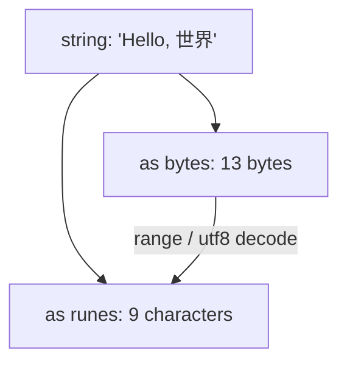

# 04 — Strings, Bytes, and Runes

## The Three Types You Need to Understand

In Go, text handling revolves around three closely related types: `string`, `[]byte`, and `[]rune`. Understanding how they differ — and when to use which — is essential for writing correct Go programs. Most bugs in text processing come from confusing these three.

A `string` in Go is an **immutable sequence of bytes**. It is not a sequence of characters. This distinction matters immediately once you work with non-ASCII text.

## UTF-8: How Go Encodes Text

Go source code and string literals are **UTF-8** encoded. UTF-8 is a variable-width encoding that uses 1 to 4 bytes per code point (rune):

| Range (code points) | Bytes per rune | Byte pattern |
|---------------------|----------------|--------------|
| U+0000 – U+007F (ASCII) | 1 | `0xxxxxxx` |
| U+0080 – U+07FF | 2 | `110xxxxx 10xxxxxx` |
| U+0800 – U+FFFF (incl. most CJK) | 3 | `1110xxxx 10xxxxxx 10xxxxxx` |
| U+10000 – U+10FFFF (emoji, etc.) | 4 | `11110xxx 10xxxxxx 10xxxxxx 10xxxxxx` |

ASCII characters (A-Z, a-z, 0-9, punctuation) fit in 1 byte. Most European characters fit in 2 bytes. Chinese, Japanese, Korean characters need 3 bytes. Emoji and less common scripts need 4 bytes.

> 🔑 **Key idea:** UTF-8 is variable-width — 1 to 4 bytes per character. That's why `len(s)` (bytes) and "how many characters" are different numbers for non-ASCII text.

Here is what the bytes look like for `"Hi"` versus `"Hi世界"`:

```
String "Hi"
+--------+--------+
|   0x48 |   0x69 |     2 bytes
+--------+--------+
    'H'      'i'

String "Hi世界"
+--------+--------+--------+--------+--------+--------+
|   0x48 |   0x69 | 0xE4  | 0xB8  | 0x96 | 0xE7  | 0x95 | 0x8C |
+--------+--------+--------+--------+--------+--------+--------+--------+
    'H'      'i'    \xE4\xB8\x96    \xE7\x95\x8C
                       '世'             '界'
```

And for the emoji `"Hi🚀"` (rocket is U+1F680, 4 bytes):

```
String "Hi\U0001F680"
+--------+--------+--------+--------+--------+--------+--------+
|   0x48 |   0x69 | 0xF0  | 0x9F  | 0x9A | 0x80  |        |  7 bytes
+--------+--------+--------+--------+--------+--------+--------+
    'H'      'i'    \xF0\x9F\x9A\x80 (4 bytes for rocket)
```

**One character does not always equal one byte.** This is the central fact of string handling in Go.



> 🧠 **Memory aid:** a string is a *byte* sequence wearing a *text* disguise. Bytes are what's stored; runes are what you read.

## Strings in Go

### Key Properties

- Strings are **immutable** — you cannot change a byte in place
- Strings can contain any bytes, including binary data and NUL bytes
- Strings are UTF-8 for text but Go doesn't enforce this
- `len(s)` returns the number of **bytes**, not characters
- There is **no NUL terminator** (unlike C strings)
- There is **no capacity** field (unlike slices)

### The String Header (Under the Hood)

A Go string is represented as a **read-only slice of bytes** — a 2-word header holding a pointer to the data and the length:

```go
type stringHeader struct {
    Data unsafe.Pointer // pointer to the byte array
    Len  int            // number of bytes
}
```

Because strings are immutable, the compiler can share underlying byte arrays: substrings (`s[i:j]`) point into the *same* backing data without copying — this is why slicing a string is cheap, O(1), and allocation-free.

Copying a string copies 16 bytes (the header); the underlying bytes are shared. This makes `string` a cheap-to-copy value type.

> 💡 **Pro tip:** substring slicing (`s[i:j]`) is O(1) and shares the backing array — keep substrings of huge original strings in mind when that original stays referenced in memory.

### String Literals

**Interpreted** (double quotes) — escape sequences are processed:

```go
s := "Hello, World!\n"
path := "C:\\Users\\docs\\file.txt"
u := "\u0041"    // "A"
v := "\U0001F600" // 😀
```

**Raw** (backticks) — no escape processing; every character is literal:

```go
s := `Hello, World!\n`          // contains literal \n
path := `C:\Users\docs\file.txt`
```

Raw literals are essential for multi-line text, regular expressions, SQL, and HTML:

```go
query := `
SELECT u.name, o.total
FROM users u
JOIN orders o ON u.id = o.user_id
WHERE o.total > 100
ORDER BY o.total DESC
`
```

A raw string literal cannot contain a backtick. If you need one, use string concatenation or the interpreted form.

## Working with String Length

```go
s := "hello"
fmt.Println(len(s))      // 5 (bytes)

unicode := "héllo"
fmt.Println(len(unicode)) // 6 — because é is 2 bytes in UTF-8!
```

For character count, use `utf8.RuneCountInString`:

```go
import "unicode/utf8"

s := "héllo"
fmt.Println(utf8.RuneCountInString(s)) // 5 (runes/characters)
```

> ⚠️ **Watch out:** `len("héllo")` is 6, not 5 — `len` counts bytes and `é` takes two bytes. Reach for `utf8.RuneCountInString` when you mean characters.

### Byte Breakdown Example

For `"Hello, 世界! 🚀"`:

```
H  e  l  l  o  ,  (space)  世     界     !  (space)  rocket
1  1  1  1  1  1    1       3      3     1    1       4
                                                       Total: 19 bytes
```

## Indexing and Slicing

Indexing a string yields a **byte**, not a character:

```go
s := "Hello, 世界"
fmt.Printf("%c\n", s[0])  // H
fmt.Printf("%x\n", s[7])  // e4  (first byte of '世')
fmt.Println(s[7])          // 228 (decimal value of 0xe4)
```

Accessing `s[8]` or `s[9]` gives you the second and third bytes of `世` — not a valid character on its own.

**This is the single most common source of bugs with non-ASCII strings.** If you index by byte position inside a multi-byte character, you get garbage.

> ⚠️ **Gotcha:** `s[i]` returns a `byte`, not a character — indexing mid-rune gives you an invalid fragment, not an error.

Slicing yields a new string (substring by byte indices):

```go
s := "hello world"
sub := s[0:5]    // "hello"
sub2 := s[6:]    // "world"
sub3 := s[:5]    // "hello"
```

> Slicing by byte index can break a multi-byte UTF-8 character. Prefer rune-aware operations for text.

> 🧠 **Think of it as:** byte indexing is like cutting a rope with a hatchet — efficient but it may split a character in half. Use rune-aware tools for clean cuts.

## Strings Are Immutable

Once created, a string's contents cannot be changed:

```go
s := "hello"
s[0] = 'H'  // compile error: cannot assign to s[0]
```

This exists for three reasons:

1. **Safety.** Functions pass strings freely without worrying about mutation from the caller or other goroutines.
2. **Performance.** The compiler knows the contents will not change, enabling read-only placement, substring sharing, and eliminated defensive copies.
3. **Sharing.** Two strings can share the same underlying byte array. `s[2:4]` does not copy bytes — it creates a new header pointing into the original. Immutability makes this safe.

## String Concatenation

```go
// + operator
greeting := "Hello, " + "world"

// +=
name := "Alice"
name += " Smith"

// strings.Join (efficient for many strings / slices)
parts := []string{"a", "b", "c"}
joined := strings.Join(parts, ", ")   // "a, b, c"

// strings.Builder (most efficient for loops)
var builder strings.Builder
for i := 0; i < 5; i++ {
    builder.WriteString(strconv.Itoa(i))
    if i < 4 {
        builder.WriteString(",")
    }
}
result := builder.String()  // "0,1,2,3,4"
```

> In a loop, `+=` recreates the string each time (O(n^2)). Use `strings.Builder`.

> 🔑 **Remember:** immutable strings make `+` in a loop quadratic. `strings.Builder` keeps a mutable buffer, dropping concatenation to O(n).

### Why String Concatenation in a Loop Is O(n²)

Because strings are immutable, `s += x` creates a **new string** of length len(s)+len(x) each time, copying all previous bytes. Repeated in a loop this is O(n^2) — quadratic. `strings.Builder` amortizes this to O(n) by keeping a mutable byte buffer that grows like a slice.

```go
// O(n²) — avoid
var s string
for i := 0; i < n; i++ { s += "x" }

// O(n) — prefer
var b strings.Builder
for i := 0; i < n; i++ { b.WriteString("x") }
```

`strings.Builder` implements `io.Writer`, `io.ByteWriter`, and `io.StringWriter`:

```go
var b strings.Builder
fmt.Fprintf(&b, "%s is %d years old\n", "Alice", 30)
s := b.String()
```

## Runes and Bytes

### Rune

A **rune** is an alias for `int32` and represents a single **Unicode code point** (a character). Storing a character in a rune type holds its Unicode value.

```go
r := 'A'        // rune literal — numeric value 65
r2 := '😀'      // valid rune (emoji is a single code point)
fmt.Println(r)  // 65
fmt.Printf("%c\n", r)  // A
```

### Byte

A **byte** is an alias for `uint8`. A string literal `'a'` is a rune, while a slice of bytes `[]byte` holds raw bytes.

```go
data := []byte{72, 101, 108, 108, 111}
fmt.Println(string(data)) // Hello
```

`byte` is used for binary data, file I/O, and network data. `rune` is used when reasoning about individual Unicode characters:

```go
s := "Go语言"
fmt.Println(len([]byte(s)))   // 8 — byte count
fmt.Println(len([]rune(s)))   // 4 — character count
```

> 🔑 **Key idea:** `byte` is `uint8`, `rune` is `int32`. Same memory size, totally different jobs — bytes for raw data, runes for characters.

### Iterating Over Strings

#### 1. By Bytes (Using Index)

```go
s := "hi😀"
for i := 0; i < len(s); i++ {
    fmt.Printf("%d: %x\n", i, s[i])  // prints raw bytes
}
```

#### 2. By Runes (Using Range) — The Idiomatic Way

```go
s := "Hi, 世界!"
for i, r := range s {
    fmt.Printf("byte index: %d, rune: %c (U+%04X)\n", i, r, r)
}
```

```
byte index: 0, rune: H (U+0048)
byte index: 1, rune: i (U+0069)
byte index: 2, rune: , (U+002C)
byte index: 3, rune:   (U+0020)
byte index: 4, rune: 世 (U+4E16)
byte index: 7, rune: 界 (U+754C)
byte index: 10, rune: ! (U+0021)
```

The byte index jumps: 0, 1, 2, 3, 4, **7**, **10**. The gaps are multi-byte characters. `for range` always gives you complete runes.

```go
s := "世界"

// Correct: for range
for _, r := range s {
    fmt.Printf("%c ", r)  // 世 界
}

// Incorrect: byte-level loop
for i := 0; i < len(s); i++ {
    fmt.Printf("%c ", s[i])  // prints garbage bytes as characters
}
```

> 💡 **Note:** `for range` over a string decodes runes for you and reports byte offsets — always prefer it over index-based byte loops for text.

#### 3. Explicitly Decode Runes

```go
import "unicode/utf8"

s := "héllo"
for len(s) > 0 {
    r, size := utf8.DecodeRuneInString(s)
    fmt.Printf("%c (size %d bytes)\n", r, size)
    s = s[size:]
}
```

## Converting Between string, []byte, and []rune

```go
s := "hello"

// string -> []byte (bytes)
bytes := []byte(s)       // [104 101 108 108 111]

// []byte -> string
back := string(bytes)    // "hello"

// string -> []rune (characters)
runes := []rune(s)       // [104 101 108 108 111]

// []rune -> string
str := string(runes)     // "hello"

// Single rune to string
s4 := string(65)        // "A" (ASCII 65)
s5 := string(0x4E16)    // "世" (Unicode code point)
```

Converting between `string` and `[]byte` or `[]rune` **copies the data**. You can safely mutate the slice without affecting existing strings. The compiler may elide the copy in specific cases, but the general rule is: conversion = copy.

> ⚠️ **Gotcha:** `[]byte(s)` and `[]rune(s)` copy and decode — fine for clarity, wasteful in hot loops. Do conversions once, not per iteration.

> `[]rune(s)` is very useful: indexing a `[]rune` gives characters, while indexing a string gives bytes.

## The `strings` Package

The `strings` package provides many utilities. Here are the essentials.

### Searching

```go
import "strings"

s := "Hello, Go world"
strings.Contains(s, "Go")        // true
strings.Contains(s, "xyz")       // false
strings.ContainsAny(s, "aeiou")  // true (any of the chars present)

strings.HasPrefix(s, "Hello")    // true
strings.HasSuffix(s, "world")    // true

strings.Index(s, "Go")           // 7 (byte index of first occurrence) or -1
strings.LastIndex(s, "o")        // index of last 'o'

strings.Count(s, "o")            // 3 (occurrences of substring)
```

### Transforming

```go
strings.ToUpper("hello")    // "HELLO"
strings.ToLower("HELLO")    // "hello"
strings.TrimSpace("  hi  ") // "hi"
strings.Trim(s, "!,.")      // trim leading/trailing chars from cutset
strings.TrimPrefix(s, "Hello")  // remove prefix if present
strings.TrimSuffix(s, "world")  // remove suffix if present

strings.Replace(s, "o", "0", 1)    // replace first occurrence
strings.ReplaceAll(s, "o", "0")    // replace all
```

### Splitting and Joining

```go
parts := strings.Split("a,b,c", ",")   // ["a" "b" "c"]
joined := strings.Join(parts, "-")     // "a-b-c"
lines := strings.Split(s, "\n")        // split into lines

strings.Fields("  a  b c ")            // ["a" "b" "c"] (splits on whitespace, trims)
```

> `strings.Fields` splits on any whitespace and discards empty strings, making it ideal for word splitting.

### Comparison

```go
strings.EqualFold("Go", "go")   // true (case-insensitive)

// Compare (uses byte ordering)
strings.Compare("a", "b")       // -1 (a < b)
strings.Compare("b", "a")       // 1
strings.Compare("a", "a")       // 0
```

### Building

```go
var b strings.Builder
b.WriteString("Hello")
b.WriteRune(' ')
b.WriteString("World")
fmt.Println(b.String())   // "Hello World"
fmt.Println(b.Len())      // 11
```

### More

```go
strings.Repeat("ab", 3)          // "ababab"
strings.ContainsRune(s, 'G')     // test a single rune
```

## The `bytes` Package

The `bytes` package provides the same functions operating on `[]byte`, plus `bytes.Buffer` for efficient string building:

```go
var buf bytes.Buffer
buf.WriteString("Hello")
buf.WriteString(", ")
buf.WriteString("World!")
result := buf.String()  // "Hello, World!"
```

`bytes.Buffer` implements `io.Writer`, so it integrates with `fmt.Fprintf`:

```go
var buf bytes.Buffer
fmt.Fprintf(&buf, "Name: %s\n", "Alice")
fmt.Fprintf(&buf, "Age: %d\n", 30)
fmt.Print(buf.String())
```

Use `bytes` when you want to avoid repeated string-to-byte-slice conversions in a chain of operations.

## The `strconv` Package (Conversions)

`strconv` converts between strings and other types. It is faster than `fmt.Sprintf` for single conversions:

### String <-> Number

```go
import "strconv"

// int -> string
s := strconv.Itoa(42)          // "42"
s64 := strconv.FormatInt(42, 10) // "42" (any base)

// string -> int
n, err := strconv.Atoi("42")   // 42, nil
n2, err2 := strconv.Atoi("abc") // err2 != nil (parse error)

// string -> int64
n64, _ := strconv.ParseInt("42", 10, 64)

// float conversions
f := strconv.ParseFloat("3.14", 64)
sf := strconv.FormatFloat(3.14, 'f', 2, 64)  // "3.14"

// other bases
hex := strconv.FormatInt(255, 16)  // "ff"
oct := strconv.FormatInt(255, 8)   // "377"
```

`Atoi` returns an error for invalid input. Always check it:

```go
n, err := strconv.Atoi(input)
if err != nil {
    fmt.Printf("invalid number: %q\n", input)
    return
}
```

> ⚠️ **Watch out:** `strconv.Atoi` returns an error on bad input — ignoring it (`n, _ :=`) silently swallows parse failures. Check the error.

### String <-> Bool

```go
b, _ := strconv.ParseBool("true")     // true
sb := strconv.FormatBool(false)       // "false"
```

## The `unicode` and `unicode/utf8` Packages

```go
import (
    "unicode"
    "unicode/utf8"
)

unicode.IsLetter('a')    // true
unicode.IsDigit('5')     // true
unicode.IsSpace(' ')     // true
unicode.IsUpper('A')     // true
unicode.IsLower('a')     // true
unicode.ToUpper('a')     // 'A'

utf8.RuneCountInString("héllo")  // 5
utf8.ValidString("héllo")        // true
utf8.Valid([]byte("hello"))      // true
utf8.Valid([]byte{0xff, 0xfe})   // false
```

## Common String Tasks

### Reverse a String (Rune-Safe)

Byte-level reversal destroys multi-byte characters. Convert to `[]rune` first:

```go
func reverse(s string) string {
    runes := []rune(s)
    for i, j := 0, len(runes)-1; i < j; i, j = i+1, j-1 {
        runes[i], runes[j] = runes[j], runes[i]
    }
    return string(runes)
}

func main() {
    fmt.Println(reverse("hello"))     // "olleh"
    fmt.Println(reverse("世界你好"))   // "好你界世"
    fmt.Println(reverse("rocket🚀")) // "🚀tekcor"
}
```

> 🧠 **Memory aid:** byte reversal garbles multi-byte characters; convert to `[]rune`, reverse, convert back — three steps, always safe.

### Check if a String Is a Palindrome (Rune-Safe)

```go
func isPalindrome(s string) bool {
    runes := []rune(s)
    for i := 0; i < len(runes)/2; i++ {
        if runes[i] != runes[len(runes)-1-i] {
            return false
        }
    }
    return true
}
```

### Count Vowels

```go
func countVowels(s string) int {
    count := 0
    for _, r := range s {
        switch unicode.ToLower(r) {
        case 'a', 'e', 'i', 'o', 'u':
            count++
        }
    }
    return count
}
```

### Word Count

```go
func words(s string) int {
    return len(strings.Fields(s))
}
```

### Safe Truncation

```go
func truncate(s string, maxRunes int) string {
    runes := []rune(s)
    if len(runes) <= maxRunes {
        return s
    }
    return string(runes[:maxRunes])
}
```

## Big-O for Common String Operations

| Operation | Cost | Note |
|-----------|------|------|
| `s[i:j]` substring | O(1) | shares backing bytes |
| `len(s)` | O(1) | stored in header |
| `+` concatenation | O(n) each | new allocation & copy |
| `[]byte(s)` conversion | O(n) | copies (unless compiler optimizes) |
| `[]rune(s)` conversion | O(n) | copies and decodes |
| `utf8.RuneCountInString` | O(n) | walks all bytes |
| `strings.Contains` | O(n*m) worst | may use optimized search |

## Summary Table

| Operation | Returns | Notes |
|---|---|---|
| `s[i]` | `byte` | Byte at index i |
| `for i, r := range s` | `int, rune` | Byte index and rune value |
| `len(s)` | `int` | Byte count, not character count |
| `utf8.RuneCountInString(s)` | `int` | Character count |
| `[]byte(s)` | `[]byte` | Copy of bytes |
| `[]rune(s)` | `[]rune` | Decoded runes |
| `string(b)` | `string` | From bytes |
| `string(r)` | `string` | Single rune to string |
| `strings.Split(s, sep)` | `[]string` | Split on separator |
| `strings.Join(ss, sep)` | `string` | Join with separator |
| `strings.TrimSpace(s)` | `string` | Strip whitespace |
| `strings.Builder` | struct | Efficient string building |

## Putting It All Together

```go
package main

import (
    "fmt"
    "strings"
    "unicode/utf8"
)

func main() {
    s := "Hello, 世界!"  // includes multi-byte UTF-8 characters

    fmt.Println("bytes:", len(s))              // 13 (world chars are 3 bytes each)
    fmt.Println("runes:", utf8.RuneCountInString(s)) // 9

    // Rune-aware iteration
    for i, r := range s {
        fmt.Printf("%d:%c ", i, r)
    }
    fmt.Println()

    // Split and join
    csv := "Alice,Bob,Carol"
    names := strings.Split(csv, ",")
    fmt.Println(names)                            // [Alice Bob Carol]
    fmt.Println(strings.Join(names, " | "))       // Alice | Bob | Carol

    // Check and manipulate
    fmt.Println(strings.Contains(s, "世界"))      // true
    fmt.Println(strings.ToUpper("hello"))         // HELLO
    fmt.Println(strings.ReplaceAll("a-b-a", "a", "x")) // x-b-x
}
```

## Modern Practices

- Use `strings.Builder` for efficient string concatenation in loops
- Use the `strings` and `strconv` packages instead of manual parsing or formatting
- Use `range` to iterate over strings for rune-safe character access
- Treat strings as raw bytes and use the `utf8` package when character-level ops are needed
- Prefer `fmt.Sprintf` and `strconv.Itoa` / `strconv.Atoi` over manual number-string conversion
- Convert to `[]rune` for character-level operations like reversing or random access
- Use `bytes.Buffer` when building strings through `io.Writer` interfaces

## Common Mistakes

- **Assuming `len(s)` returns the character count** — it returns the byte count
- **Indexing with `s[i]` on a multi-byte rune** gives a partial, invalid byte
- **Using `+` for concatenation inside a loop** creates O(n^2) performance — use `strings.Builder`
- **Comparing strings with `==` when case-insensitive comparison is needed** — use `strings.EqualFold`
- **Forgetting UTF-8 when slicing** — `s[i:j]` operates on bytes, not runes, and can break characters
- **Iterating bytes instead of runes** — `for i := 0; i < len(s); i++` gives bytes, not characters
- **Truncating in the middle of a multi-byte character** — convert to `[]rune` first
- **Comparing `string` with `[]byte` directly** — compile error: mismatched types; convert explicitly
- **Assuming string comparison is case-insensitive by default** — `==` is byte-exact

## Key Takeaways

1. Strings are **immutable sequences of bytes**; `len` counts bytes.
2. A **rune** is a Unicode code point (`int32`); use `range` for rune iteration.
3. `[]rune(s)` lets you work character-by-character.
4. Use the `strings` package for search, transform, split/join.
5. Use `strconv` for number conversions.
6. Use `strings.Builder` for efficient concatenation in loops.
7. **Theory**: strings are read-only byte slices (no NUL, no capacity); UTF-8 is 1–4 bytes per rune; `s[i]` is a byte, not a char; naive `+` concatenation in loops is O(n²).
8. The string header is a pointer + length; substrings share backing data.

## Next

Continue to [05-control-flow.md](05-control-flow.md) to learn about `if`, `for`, `switch`, and `goto`.
