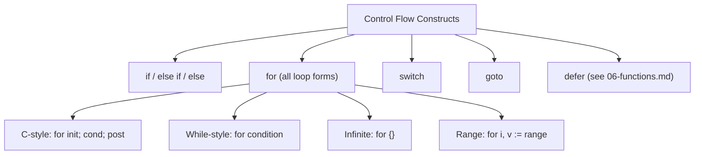

# 05 — Control Flow

Go's control flow is intentionally simple. There are no parentheses around conditions, braces are mandatory, and there are fewer keywords than most languages. This simplicity is deliberate — Go's designers wanted code to be easy to read and consistent.



## The `if` Statement

### Basic Form

```go
if x > 0 {
    fmt.Println("positive")
} else if x < 0 {
    fmt.Println("negative")
} else {
    fmt.Println("zero")
}
```

- No parentheses around the condition.
- The condition must be a **boolean expression** — no truthy/falsy conversion. `if 1` is invalid. You must write `if x == 1`.
- Braces are required even for single-line bodies.

> ⚠️ **Watch out:** Go has no truthy/falsy — `if count` is a compile error. Always write an explicit comparison like `if count > 0`.

### The Init Statement (Idiomatic Go)

Go allows a short statement before the condition. The variable's scope is limited to the if/else block:

```go
if err := doSomething(); err != nil {
    fmt.Println("Error:", err)
}
// err is NOT accessible here

if score := computeScore(); score >= 90 {
    fmt.Println("A grade")
} else if score >= 80 {
    fmt.Println("B grade")
} else {
    fmt.Println("Below B")
}
// score is NOT accessible here
```

This pattern is deeply idiomatic in Go. You will see it everywhere:

```go
f, err := os.Open("config.json")
if err != nil {
    log.Fatal(err)
}
defer f.Close()

var cfg Config
if err := json.NewDecoder(f).Decode(&cfg); err != nil {
    log.Fatal(err)
}
```

> 💡 **Pro tip:** the `if` init statement scopes `err` to the block — check, handle, move on, no leaks. It's the defining idiomatic Go pattern.

### No Ternary Operator

Go has no ternary operator (`condition ? a : b`). Use `if`/`else` instead:

```go
// Not Go:
// x := a > b ? a : b

// Go:
var x int
if a > b {
    x = a
} else {
    x = b
}
```

Or use the built-in `max` and `min` functions (Go 1.21+):

```go
x := max(a, b)
```

### The Early Return Pattern

A common Go idiom is to handle errors at the top of a function and return early:

```go
func processOrder(order *Order) error {
    if order == nil {
        return ErrNilOrder
    }

    if order.Total <= 0 {
        return ErrInvalidTotal
    }

    if err := validateItems(order.Items); err != nil {
        return fmt.Errorf("validating items: %w", err)
    }

    // Happy path — no nesting needed
    return saveOrder(order)
}
```

This "guard clause" style avoids deep nesting and keeps the happy path at the end, unindented.

## The `for` Loop

Go has **only** `for`. There is no `while`, no `do-while`. `for` covers all cases. This is a deliberate design choice: fewer ways to write loops means more readable, uniform code.

### Three Forms

**1. Traditional for loop (init; condition; post):**

```go
for i := 0; i < 5; i++ {
    fmt.Println(i)
}
// Output: 0 1 2 3 4
```

**2. While-style (condition only):**

```go
n := 0
for n < 5 {
    fmt.Println(n)
    n++
}
```

**3. Infinite loop (no condition):**

```go
for {
    fmt.Println("forever")
    break   // must eventually break out
}
```

All three forms are just variations of `for`. The init and post statements are optional.

> 🧠 **Memory aid:** one keyword to rule them all — `for` covers traditional, while-style, infinite, and range loops. No `while`, no `do-while`.

### The `range` Clause

`for range` iterates over collections:

```go
// Over a slice
numbers := []int{10, 20, 30}
for index, value := range numbers {
    fmt.Printf("index %d: %d\n", index, value)
}

// Over a slice, ignoring the index
for _, value := range numbers {
    fmt.Println(value)
}

// Over a map (order is NOT guaranteed)
scores := map[string]int{"Alice": 90, "Bob": 80}
for key, value := range scores {
    fmt.Println(key, value)
}

// Over a string (gives runes and byte offsets)
for index, runeValue := range "Hello" {
    fmt.Printf("byte %d: %c\n", index, runeValue)
}

// Over a channel
ch := make(chan int)
go func() {
    ch <- 1
    ch <- 2
    close(ch)
}()
for v := range ch {
    fmt.Println(v)
}
```

**Key points about range:**

- `range` on a string iterates over **Unicode code points (runes)**, not bytes. This is important for non-ASCII text.
- You can drop the index or value by using `_`:
  ```go
  for _, v := range nums { ... }  // index unused
  for i := range nums { ... }     // value unused
  ```
- The map iteration order is **intentionally random**. Do not depend on it.
- The slice copy: `for i, v := range nums` creates a copy of each element in `v`. If the element is large and you only need the index, use `for i := range nums` and access `nums[i]` directly.
- You can safely delete map entries during range iteration. You cannot safely append to a slice during range iteration.

> ⚠️ **Gotcha:** `range` copies each element into `v` and map order is intentionally random — don't rely on iteration order, and use the index form for large elements.

### Reverse Loop

```go
for i := 10; i > 0; i-- {
    fmt.Println(i)
}
```

### `break` and `continue`

```go
// break — exit the loop immediately
for i := 0; i < 10; i++ {
    if i == 5 {
        break   // stops at i == 5
    }
    fmt.Println(i)  // prints 0..4
}

// continue — skip to next iteration
for i := 0; i < 5; i++ {
    if i == 2 {
        continue   // skip i == 2
    }
    fmt.Println(i)  // prints 0,1,3,4
}
```

### Breaking Out of Nested Loops with Labels

```go
outer:
for i := 0; i < 3; i++ {
    for j := 0; j < 3; j++ {
        if i*j == 4 {
            break outer   // breaks out of BOTH loops
        }
        fmt.Println(i, j)
    }
}
```

`continue` can also target a label:

```go
for i := 0; i < 5; i++ {
    for j := 0; j < 5; j++ {
        if j == 2 {
            continue outer  // continue the outer loop
        }
    }
}
```

### Common `for` Patterns

**Infinite loop with break:**

```go
reader := bufio.NewReader(os.Stdin)
for {
    line, err := reader.ReadString('\n')
    if err != nil {
        break
    }
    fmt.Print(line)
}
```

## The `switch` Statement

Go's `switch` is more powerful than C's.

### Basic Switch

```go
switch day {
case "Monday":
    fmt.Println("Start of the week")
case "Friday":
    fmt.Println("Almost weekend")
case "Saturday", "Sunday":
    fmt.Println("Weekend!")
default:
    fmt.Println("Regular day")
}
```

Key differences from C-style switch:

- **No `break` needed** — cases do NOT fall through. Only the matched case runs.
- Expression in each `case` can be any value, not just constants.
- `default` is optional and can appear anywhere.
- Several values can match one case (comma-separated).

### Switch Without an Expression (Like if/else Chains)

```go
score := 85

switch {
case score >= 90:
    fmt.Println("A")
case score >= 80:
    fmt.Println("B")
case score >= 70:
    fmt.Println("C")
default:
    fmt.Println("F")
}
```

When there is no expression after `switch`, it switches on `true`. This is equivalent to an `if-else-if` chain but can be cleaner for multiple conditions.

> 🔑 **Key idea:** `switch` in Go doesn't fall through — each case runs and exits automatically, so there's no `break` ceremony and no accidental fall-through bugs.

### Switch with Init Statement

Like `if`, `switch` supports an init statement:

```go
switch x := compute(); {
case x > 0:
    fmt.Println("positive")
case x < 0:
    fmt.Println("negative")
default:
    fmt.Println("zero")
}
```

Another example:

```go
switch os := runtime.GOOS; os {
case "linux":
    fmt.Println("Linux")
case "darwin":
    fmt.Println("macOS")
case "windows":
    fmt.Println("Windows")
}
```

### Explicit Fallthrough

If you genuinely need fall-through, use `fallthrough`:

```go
i := 2
switch i {
case 1:
    fmt.Println("one")
case 2:
    fmt.Println("two")
    fallthrough
case 3:
    fmt.Println("three")  // also runs because of fallthrough
}
// Output: two \n three
```

`fallthrough` forces execution to continue into the next case body, regardless of the next case's condition. It is rarely used and is considered a code smell.

> `fallthrough` must be the last statement in a case. Note: Go's fallthrough does **not** re-evaluate the case expression; it simply continues into the next case body.

### Type Switch

A type switch inspects the dynamic type of an interface:

```go
func describe(v interface{}) {
    switch t := v.(type) {
    case string:
        fmt.Println("String:", t)
    case int:
        fmt.Println("Int:", t)
    case bool:
        fmt.Println("Bool:", t)
    default:
        fmt.Printf("Unknown type %T\n", t)
    }
}
```

The type switch `.(type)` is syntactic sugar over a series of type assertions. It dispatches on the **dynamic type** held by an interface — useful for decoding `any`/`interface{}`, JSON `any`, or `error` wrapping.

> 💡 **Note:** `v.(type)` only works inside `switch` — pair it with the dynamic type held by an interface, not a concrete variable.

### Performance Note

A `switch` with a constant expression is often compiled to a **jump table**, giving O(1) dispatch instead of a chain of `if` comparisons. This makes `switch` both safer (no accidental fallthrough bugs) and potentially faster than an if/else-if chain for many cases.

| Construct | Typical cost |
|-----------|--------------|
| `if` / `else` | a compare + branch (cheap) |
| `for` | increment + compare per iteration (cheap) |
| `switch` (constant) | jump table — O(1) dispatch |
| `switch` (string/type) | linear/map-based compare |
| `defer` | small overhead per call (see functions) |
| `goto` | plain jump (use sparingly) |

## `select` (Preview)

`select` is used with channels for concurrent communication:

```go
select {
case msg := <-ch1:
    fmt.Println("Received from ch1:", msg)
case ch2 <- value:
    fmt.Println("Sent to ch2")
case <-time.After(1 * time.Second):
    fmt.Println("Timeout")
}
```

We will cover `select` thoroughly in the concurrency section. For now, just know it exists.

## The `goto` Statement

Go supports `goto`, though it is discouraged in favor of clearer constructs:

```go
func main() {
    n := 0
Loop:
    if n < 5 {
        fmt.Println(n)
        n++
        goto Loop
    }
}
// Output: 0 1 2 3 4
```

**Do not use `goto` in production code.** It exists for specific low-level use cases (like breaking out of deeply nested loops). In almost all cases, `for`, `break`, and `continue` are better. Modern code almost never uses `goto` because it can complicate reasoning about a program.

## The Semicolon Rule

Go's lexer automatically inserts semicolons at the end of lines. This is why you cannot put the opening brace on a new line:

```go
// This is a compile error:
if x > 0
{
    fmt.Println("positive")
}

// This is correct:
if x > 0 {
    fmt.Println("positive")
}
```

The rule: if the last token before a newline could end a statement (identifier, literal, `)`, `}`, `++`, `--`, `return`, etc.), a semicolon is inserted.

In practice, you rarely think about this. Just follow the convention: opening braces go on the same line.

## Loop-Variable Capture (Go 1.22+)

Before Go 1.22, `for` loop variables were reused across iterations, which caused the classic "closure captures the last value" bug. Go 1.22 introduced per-iteration loop variables, making:

```go
for i := 0; i < 3; i++ {
    go func() { fmt.Println(i) }() // Go 1.22+: prints 0,1,2 (each its own i)
}
```

predictable. Pre-Go 1.22, all closures would have printed `3`.

> 🧠 **Memory aid:** pre-Go 1.22 `for` reused one variable across iterations (classic closure bug); Go 1.22+ gives each iteration its own — update your toolchain to stop worrying about it.

## Control Flow and the Compiler (Theory)

### The `if` Statement Initialization

The optional init statement in `if` (and `for`, `switch`) has a scoping consequence: the declared variables live only inside the block. This prevents leaks and is the idiomatic way to scope error handling:

```go
if err := process(); err != nil {
    // err is in scope here
}
// err is NOT in scope here — no leak, no accidental reuse
```

### `for` Is the Only Loop — Because of `for range` Universality

Go has exactly one loop keyword. All the classic forms (while, do-while, traditional) are expressed with `for` plus a condition or `break`. The `for range` form iterates over arrays, slices, maps, strings (runes), and channels — a unifying abstraction.

### `switch` Is Compiled Efficiently, No Fallthrough

A Go `switch` does **not** fall through (no need for `break` after each case; only the matched case runs). A `switch` with a constant expression is often compiled to a **jump table**, giving O(1) dispatch instead of a chain of `if` comparisons.

## Putting It All Together

```go
package main

import "fmt"

func main() {
    // FizzBuzz: classic interview problem
    for i := 1; i <= 15; i++ {
        switch {
        case i%15 == 0:
            fmt.Println("FizzBuzz")
        case i%3 == 0:
            fmt.Println("Fizz")
        case i%5 == 0:
            fmt.Println("Buzz")
        default:
            fmt.Println(i)
        }
    }

    // Sum numbers 1..100 (while-style)
    sum, n := 0, 1
    for n <= 100 {
        sum += n
        n++
    }
    fmt.Println("Sum 1..100:", sum) // 5050

    // Print even numbers using continue
    for i := 1; i <= 10; i++ {
        if i%2 != 0 {
            continue
        }
        fmt.Print(i, " ")
    }
    fmt.Println()
}
```

## Modern Practices

- Use `if` with an init statement for scoped error handling (`if err := ...; err != nil`)
- Use `for range` over everything — slices, maps, strings, channels
- Rely on `switch` without fallthrough; only use `fallthrough` when truly needed
- Use `break` and `continue` with labels sparingly — prefer refactoring for clarity
- Prefer iterating with `for range` over manual index-based loops
- Use expressionless `switch` as a cleaner alternative to long `if/else if` chains
- Trust per-iteration loop variables (Go 1.22+) for closure captures
- Use the early return / guard clause pattern to avoid deep nesting
- Use `max(a, b)` and `min(a, b)` built-ins (Go 1.21+) instead of ternary-like patterns

## Common Mistakes

- **Assuming `switch` falls through like C/Java** — it doesn't by default
- **Using `goto` where a loop or function would be clearer** — almost always a mistake
- **Creating an infinite loop with `for {}` and forgetting a `break` or `return`**
- **Off-by-one errors** when manually indexing vs. using `range`
- **Modifying a slice while ranging over it** — leads to unexpected behavior
- **Pre-Go 1.22: loop variable capture in goroutines and closures** — all closures shared the same variable
- **Forgetting that `switch` cases don't need `break`** and adding unnecessary ones
- **Using `fallthrough` unintentionally** and executing the next case body
- **Forgetting braces** — Go inserts a semicolon after `return` if the brace is on the next line
- **Using `=` instead of `:=` in `for` init** when the variable isn't already declared
- **Expecting ordered map iteration** — iteration order is intentionally randomized

## Key Takeaways

1. `if` supports an optional init statement, scoped to the block — the idiomatic way to handle errors.
2. `for` is the **only** loop and covers traditional, while, infinite, and range forms.
3. `break` / `continue` can target labels to affect outer loops.
4. `switch` cases don't fall through by default; group values with commas, and use `fallthrough` only when explicit.
5. A `switch` with no expression acts like an if/else-if chain.
6. The type switch (`.(type)`) dispatches on an interface's dynamic type.
7. **Theory**: `if` init statements scope tightly; `for range` unifies all iteration; constant `switch` compiles to an O(1) jump table; loop variables are per-iteration since Go 1.22.
8. The semicolon rule forces opening braces on the same line as the statement.

## Next

Continue to [06-functions.md](06-functions.md) to learn about functions, returns, closures, defer, and panic/recover.
