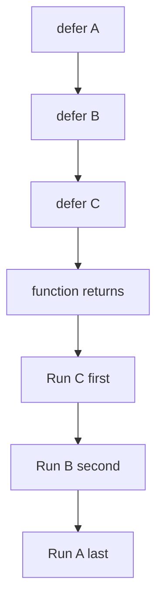
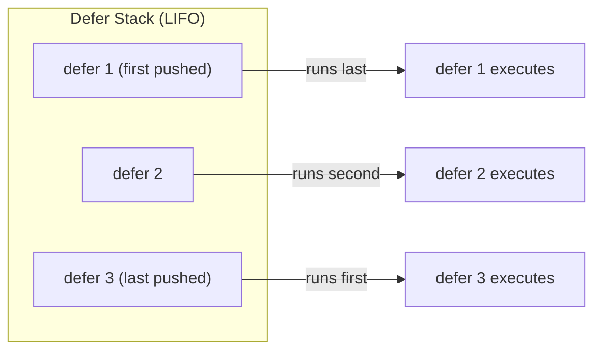

# 06 — Functions

Functions are the fundamental building blocks of Go programs. Every piece of executable code lives inside a function. Go's functions have some distinctive features: multiple return values, no default parameters, first-class functions, closures, and a powerful `defer` mechanism.

## Function Declaration

```go
func add(a int, b int) int {
    return a + b
}
```

Break it down:

- `func` keyword starts the declaration
- `add` is the function name
- `a int, b int` are parameters (name followed by type)
- `int` after the closing parenthesis is the return type
- The body is in braces

**Parameter types come after the name, not before.** This is different from C, Java, and TypeScript.

> 🧠 **Memory aid:** Go reads like English — "add takes `a` `int`, `b` `int`, and returns `int`". Name first, type second, always.

When consecutive parameters share the same type, you can group them:

```go
func add(a, b int) int {
    return a + b
}

func configure(host string, port, timeout int, debug bool) {
    // ...
}
```

### Simple Function

```go
package main

import "fmt"

func greet() {
    fmt.Println("Hello!")
}

func main() {
    greet()   // call
    greet()   // call again
}
```

### Function with Parameters

```go
func greet(name string) {
    fmt.Println("Hello,", name)
}

func main() {
    greet("Alice")
    greet("Bob")
}
```

## Return Values

### Single Return Value

```go
func square(x int) int {
    return x * x
}
```

### Multiple Return Values (Very Common in Go)

This is one of Go's most important features:

```go
func divide(a, b float64) (float64, error) {
    if b == 0 {
        return 0, fmt.Errorf("division by zero")
    }
    return a / b, nil
}

func main() {
    result, err := divide(10, 3)
    if err != nil {
        fmt.Println("Error:", err)
        return
    }
    fmt.Println("Result:", result)
}
```

The convention is: return the result first, error second. This is so deeply ingrained in Go that `go vet` will warn you if you return `(error, result)` instead of `(result, error)`.

Go functions routinely return `(value, error)` pairs — the idiomatic way Go reports errors.

> 🔑 **Key idea:** `(result, err)` is the default error-handling contract — result first, error second, checked with `if err != nil`.

### Named (Bare) Return Values

Return values can be given names. The function then **returns them implicitly** with a bare `return`:

```go
func swap(a, b int) (x, y int) {
    x = b
    y = a
    return   // returns x, y
}

func main() {
    a, b := swap(1, 2)
    fmt.Println(a, b) // 2 1
}
```

Named return values:

1. Act as local variables initialized to their zero values
2. Allow "naked" `return` statements (return without values)
3. Document the meaning of each return value

**When to use named returns:**

- When the function is short and the names improve clarity
- In interfaces where the names document the contract

**When not to use them:**

- In longer functions, named returns make it harder to see where values come from
- Naked returns reduce readability in functions longer than ~10 lines
- Most Go style guides recommend against naked returns

> ⚠️ **Gotcha:** naked `return` with named results is terse — but beyond ~10 lines it hides the data flow, and style guides generally advise against it.

```go
// Good: short function, clear names
func minMax(nums []int) (min, max int) {
    min = nums[0]
    max = nums[0]
    for _, v := range nums[1:] {
        if v < min { min = v }
        if v > max { max = v }
    }
    return
}

// Also good: explicit return is clearer in a longer function
func processUser(u *User) error {
    if err := validate(u); err != nil {
        return err
    }
    if err := save(u); err != nil {
        return err
    }
    return nil  // explicit return
}
```

### Named Return with Defer Interaction

```go
func doWork() (result int) {
    defer func() {
        result += 100   // modifies the named return
    }()
    return 5   // result becomes 5, then defer adds 100 → 105
}
```

## Pass by Value vs. Pass by Reference

### Go Passes Arguments by Value (Mostly)

When you pass a value to a function, Go makes a **copy**. Changes inside the function don't affect the caller's value:

```go
func change(x int) {
    x = 100  // only changes the copy
}

func main() {
    n := 5
    change(n)
    fmt.Println(n) // 5 — unchanged
}
```

### To Modify, Pass a Pointer

```go
func change(x *int) {
    *x = 100   // dereference and modify
}

func main() {
    n := 5
    change(&n)
    fmt.Println(n) // 100 — changed
}
```

### Pass-by-Value Reference Table

Go is **always pass by value** for function arguments — but "value" can mean (1) a copy of a small value, or (2) a copy of a **reference-like header**:

| Type | Passed as | Modifying contents from callee? |
|------|-----------|-------------------------------|
| `int`, `float`, `bool`, `string`, array, struct | value copy | No |
| slice | header copy (shares backing array) | Yes (elements), no realloc |
| map | reference | Yes |
| channel | reference | Yes |
| pointer | pointer value | Yes (through dereference) |
| interface | interface header | depends |

> Slices, maps, and channels are reference-like types — you can modify their **contents** without pointers, but reassignment of the header still needs a pointer.

> 🔑 **Remember:** Go is always pass-by-value. The catch: slices/maps/channels copy a small header that points at shared data, so contents mutate — but the header itself never escapes.

## Variadic Functions

A variadic function accepts a variable number of arguments:

```go
func sum(nums ...int) int {
    total := 0
    for _, n := range nums {
        total += n
    }
    return total
}

func main() {
    fmt.Println(sum())          // 0
    fmt.Println(sum(1))         // 1
    fmt.Println(sum(1, 2, 3))   // 6
    fmt.Println(sum(1, 2, 3, 4, 5)) // 15
}
```

Inside the function, `nums` is a `[]int`. The `...` in the parameter list accepts zero or more `int` arguments and collects them into a slice.

- It **must be the last** parameter.
- You can spread a slice into a variadic call with `...`:

```go
nums := []int{1, 2, 3}
fmt.Println(sum(nums...))   // 6
```

> 💡 **Note:** `...` appears in two spots doing opposite jobs — in the signature it *collects* args into a slice; in a call it *spreads* a slice back into args.

### Mixed Variadic

```go
func printAll(prefix string, values ...int) {
    for _, v := range values {
        fmt.Println(prefix, v)
    }
}

func format(prefix string, values ...string) string {
    var result strings.Builder
    result.WriteString(prefix)
    for _, v := range values {
        result.WriteString(" ")
        result.WriteString(v)
    }
    return result.String()
}

fmt.Println(format("Colors:", "red", "green", "blue"))
// Output: Colors: red green blue
```

## Functions Are Values

In Go, functions are first-class values. You can assign them to variables, pass them as arguments, and return them from other functions:

```go
func main() {
    // Assign a function to a variable
    double := func(x int) int {
        return x * 2
    }
    fmt.Println(double(5)) // 10

    // Pass a function as an argument
    nums := []int{1, 2, 3, 4, 5}
    result := apply(nums, func(x int) int {
        return x * x
    })
    fmt.Println(result) // [1 4 9 16 25]
}

func apply(nums []int, fn func(int) int) []int {
    result := make([]int, len(nums))
    for i, v := range nums {
        result[i] = fn(v)
    }
    return result
}
```

### Function Type Signatures

You can name a function type:

```go
type transformer func(int) int

func apply(nums []int, fn transformer) []int {
    result := make([]int, len(nums))
    for i, v := range nums {
        result[i] = fn(v)
    }
    return result
}
```

Named function types make signatures cleaner and allow you to define methods on them.

## Anonymous Functions

A function without a name, defined inline:

```go
// Assigned to a variable
double := func(x int) int {
    return x * 2
}
fmt.Println(double(5)) // 10

// Immediately-invoked function expression (IIFE)
msg := func(name string) string {
    return "Hi " + name
}("Alice")
fmt.Println(msg) // Hi Alice

// Passed directly as an argument
result := applyOp(func(a, b int) int { return a + b }, 3, 4)
fmt.Println(result) // 7
```

This is less common in Go than in JavaScript. Go prefers named functions for readability.

### Goroutines Use Anonymous Functions

A common pattern for launching concurrent work:

```go
func main() {
    done := make(chan bool)

    go func() {
        fmt.Println("Working...")
        done <- true
    }()

    <-done
}
```

## Closures

A **closure** is a function that captures and remembers the variables from its surrounding scope even after that scope has exited:

```go
func counter() func() int {
    count := 0
    return func() int {
        count++   // captures and modifies count
        return count
    }
}

func main() {
    c := counter()
    fmt.Println(c()) // 1
    fmt.Println(c()) // 2
    fmt.Println(c()) // 3

    d := counter()   // a fresh closure with its own count
    fmt.Println(d()) // 1
}
```

Each call to `counter()` creates a **new** independent `count` variable.

> 💡 **Pro tip:** closures capture state on a per-call basis — one factory, many isolated counters. Great for middlewares and curried helpers.

### Closure Capturing Loop Variables (Common Gotcha)

The classic Go closure bug:

```go
func main() {
    var funcs []func() //"Create an empty list called `funcs` that will hold a bunch of functions. I can add functions to this list and run them later."
    for i := 0; i < 3; i++ {
        funcs = append(funcs, func() {
            fmt.Println(i)
        })
    }

    for _, f := range funcs {
        f()  // pre-Go 1.22: prints 3 3 3
    }
}
```

All closures share the same `i` variable. By the time they execute, the loop has finished and `i` is 3.

**Fixes:**

```go
// Fix 1: Go 1.22+ fixed this — each iteration creates a new variable
for i := 0; i < 3; i++ {
    funcs = append(funcs, func() {
        fmt.Println(i)  // prints 0, 1, 2
    })
}

// Fix 2: Create a new variable each iteration (works in all versions)
for i := 0; i < 3; i++ {
    i := i  // shadow with a new variable
    funcs = append(funcs, func() {
        fmt.Println(i)
    })
}
```

> ⚠️ **Gotcha:** closures capture variables, not values. If you must support pre-Go 1.22, use the `i := i` shadowing trick to pin each iteration's value.

### Practical Closure: Middleware Pattern

Closures are the foundation of Go's middleware pattern:

```go
type Handler func(w http.ResponseWriter, r *http.Request)

func withLogging(next Handler) Handler {
    return func(w http.ResponseWriter, r *http.Request) {
        start := time.Now()
        next(w, r)
        log.Printf("%s %s %v", r.Method, r.URL.Path, time.Since(start))
    }
}
```

## Higher-Order Functions

A higher-order function either takes a function as an argument or returns a function:

```go
// Takes a function
func filter(nums []int, predicate func(int) bool) []int {
    var result []int
    for _, n := range nums {
        if predicate(n) {
            result = append(result, n)
        }
    }
    return result
}

// Returns a function
func multiplier(factor int) func(int) int {
    return func(x int) int {
        return x * factor
    }
}

func main() {
    nums := []int{1, 2, 3, 4, 5, 6, 7, 8, 9, 10}
    evens := filter(nums, func(n int) bool { return n%2 == 0 })
    fmt.Println(evens) // [2 4 6 8 10]

    triple := multiplier(3)
    fmt.Println(triple(5))  // 15
    fmt.Println(triple(10)) // 30
}
```

## Recursion

A function that calls itself:

```go
func factorial(n int) int {
    if n <= 1 {
        return 1
    }
    return n * factorial(n-1)
}

func fibonacci(n int) int {
    if n <= 1 {
        return n
    }
    return fibonacci(n-1) + fibonacci(n-2)
}

func main() {
    fmt.Println(factorial(5)) // 120
    fmt.Println(fibonacci(10)) // 55
}
```

### Recursion with Memoization

```go
var memo = map[int]int{}

func fibMemo(n int) int {
    if n <= 1 {
        return n
    }
    if v, ok := memo[n]; ok {
        return v
    }
    result := fibMemo(n-1) + fibMemo(n-2)
    memo[n] = result
    return result
}
```

### Recursion for Tree Traversal

```go
type Node struct {
    Value int
    Left  *Node
    Right *Node
}

func sumTree(n *Node) int {
    if n == nil {
        return 0
    }
    return n.Value + sumTree(n.Left) + sumTree(n.Right)
}
```

## `defer`

`defer` schedules a function call to run when the current function returns. It's ideal for cleanup like closing files, releasing locks, etc.

```go
func readFile() {
    file, err := os.Open("data.txt")
    if err != nil {
        log.Fatal(err)
    }
    defer file.Close()   // runs when readFile returns

    // ... read file
}
```

### How `defer` Works

A `defer` statement pushes a function call onto a **stack**. When the surrounding function returns, the deferred calls are executed in **LIFO order** (last deferred, first run).



```go
func main() {
    defer fmt.Println("first")    // prints last
    defer fmt.Println("second")   // prints third
    defer fmt.Println("third")    // prints second
    fmt.Println("run now")        // prints first
}
// Output:
// run now
// third
// second
// first
```

### Arguments Are Evaluated Immediately

```go
func main() {
    x := 10
    defer fmt.Println(x)   // captures 10 NOW
    x = 20
    // when the function returns, prints 10 (captured at defer time)
}
```

The value of `x` at the time of `defer` is captured, not at the time of execution.

### `defer` and Closures

When the deferred function is a closure, it captures variables by reference:

```go
func main() {
    x := 10
    defer func() {
        fmt.Println(x)  // prints 20
    }()
    x = 20
}
```

The closure runs after `x` is set to 20.

### `defer` and Return Values

Deferred functions can modify named return values:

```go
func double(x int) (result int) {
    defer func() { result *= 2 }()
    return x
}

func main() {
    fmt.Println(double(5)) // 10
}
```

The return value is set to `x` (5), then the deferred function doubles it to 10. This is legal but confusing — avoid this pattern.

### `defer` with Unlock

The most common use case:

```go
var mu sync.Mutex

func process() {
    mu.Lock()
    defer mu.Unlock()

    // critical section
    // ...
}
```

This guarantees the mutex is unlocked even if a panic occurs.

### Performance Considerations

`defer` has a small runtime cost (~35ns per call as of Go 1.14). In hot loops, this can add up:

```go
// Slower: defer in a loop
for i := 0; i < n; i++ {
    f, _ := os.Open(filename)
    defer f.Close() // deferred n times
    // process
}

// Faster: defer outside the loop
for i := 0; i < n; i++ {
    func() {
        f, _ := os.Open(filename)
        defer f.Close()
        // process
    }()
}
```

In practice, `defer` is rarely a bottleneck. Use it freely for resource cleanup and only optimize if profiling shows it matters.

> ⚠️ **Watch out:** `defer` inside a loop accumulates calls until the function returns — move resource acquisition into a small helper function so cleanup happens per iteration.

## `panic` and `recover`

### `panic`

`panic` stops the normal flow of execution and begins panicking:

```go
func main() {
    fmt.Println("before panic")
    panic("something went wrong")
    fmt.Println("after panic") // never executes
}
```

Output:

```
before panic
panic: something went wrong

goroutine 1 [running]:
main.main()
        /path/to/file.go:5 +0x...
```

A panic causes:

1. The current function stops executing
2. Any deferred functions in that function run
3. The goroutine terminates with a stack trace

**When to panic:**

- During initialization (e.g., `template.Must`, `regexp.MustCompile`) — things that should never fail at runtime
- When a bug makes the program state unrecoverable
- In libraries, only when the caller made a truly invalid call

**When NOT to panic:**

- For expected errors (file not found, network timeout, invalid input)
- In library code that callers can't recover from gracefully
- To replace error returns

```go
// Good: panic on programmer error
var validPath = regexp.MustCompile("^/(edit|save|view)/([a-zA-Z0-9]+)$")

// Bad: panic on user input
func parseAge(s string) int {
    age, err := strconv.Atoi(s)
    if err != nil {
        panic(err) // don't do this
    }
    return age
}

// Good: return an error for user input
func parseAge(s string) (int, error) {
    return strconv.Atoi(s)
}
```

> 🔑 **Key idea:** panic is for programmer errors and impossible states; user input and expected failures should always come back as errors.

### `recover`

`recover` catches a panic and returns it:

```go
func safeDivide(a, b int) (result int, err error) {
    defer func() {
        if r := recover(); r != nil {
            err = fmt.Errorf("recovered: %v", r)
        }
    }()

    return a / b, nil
}
```

`recover` **only works inside a deferred function**. If you call it outside a deferred function, it always returns `nil`:

```go
// This does NOT work:
func brokenDivide(a, b int) (int, error) {
    r := recover() // returns nil, even if there's a panic
    // ...
    return a / b, nil
}
```

### `recover` vs Error Returns

Prefer error returns over panic/recover:

```go
// Prefer this:
func process(data []byte) (*Result, error) {
    if len(data) == 0 {
        return nil, errors.New("empty data")
    }
    // ...
}

// Over this:
func process(data []byte) *Result {
    if len(data) == 0 {
        panic("empty data")
    }
    // ...
}
```

Error returns make the failure explicit. Panics are hidden control flow — the caller doesn't know a function might panic unless they read the source.

> 💡 **Note:** `recover` only works inside a deferred function — anywhere else it always returns `nil`, silently doing nothing.

### `panic`/`recover` in HTTP Servers

The standard library's HTTP server catches panics:

```go
// net/http does this internally:
func (sh serverHandler) ServeHTTP(rw ResponseWriter, req *Request) {
    defer func() {
        if err := recover(); err != nil && err != http.ErrAbortHandler {
            // Log the panic
        }
    }()
    handler.ServeHTTP(rw, req)
}
```

This means a panic in an HTTP handler won't crash the server. But it will still log an error and return a 500 response. It is better to handle errors explicitly.

## Putting It All Together

```go
package main

import (
    "fmt"
    "strings"
)

// Named return values
func stats(numbers ...int) (sum int, avg float64) {
    if len(numbers) == 0 {
        return 0, 0
    }
    for _, n := range numbers {
        sum += n
    }
    avg = float64(sum) / float64(len(numbers))
    return
}

// Higher-order function taking a function
func transform(s string, fn func(rune) rune) string {
    return strings.Map(fn, s)
}

// Closure factory
func multiplier(factor int) func(int) int {
    return func(x int) int {
        return x * factor
    }
}

func main() {
    s, a := stats(10, 20, 30, 40)
    fmt.Printf("Sum=%d Avg=%.1f\n", s, a) // Sum=100 Avg=25.0

    upper := transform("hello", func(r rune) rune {
        return r - 32  // ASCII lowercase → uppercase
    })
    fmt.Println(upper) // HELLO

    triple := multiplier(3)
    fmt.Println(triple(7)) // 21
}
```

## Defer Execution Order Diagram



## Modern Practices

- Use named returns only when they improve documentation clarity
- Prefer returning `(value, error)` over using `panic` for expected failures
- Use `...T` variadic parameters and slice spread (`s...`) for flexibility
- Use `defer` immediately after acquiring resources (files, locks, connections)
- Keep functions small and single-purpose; extract helpers when needed
- Pass dependencies explicitly rather than relying on globals
- Use closures judiciously — keep captured state minimal and obvious
- Use explicit `return` values in most functions; prefer over naked returns

## Common Mistakes

- **Ignoring the returned `error` value** — always check errors explicitly
- **Using `defer` inside loops**, accumulating unclosed resources until return
- **Confusing named return values with explicit `return`** — bare `return` uses named values
- **Closure capturing the wrong loop variable** (fixed in Go 1.22 but still a pre-1.22 trap)
- **Mutating a slice or struct passed by value**, expecting the caller to see changes
- **Not handling zero values returned from functions** that can fail
- **Forgetting that `defer` arguments are evaluated immediately**, not at return time
- **Overusing naked returns** — prefer explicit `return` values in most functions
- **Using panic for expected errors** — errors should be returned, not panicked
- **Calling `recover()` outside a deferred function** — it always returns nil outside defer
- **Forgetting to check errors** — `f, _ := os.Open("file.txt")` ignores the error

## Key Takeaways

1. Syntax is `func name(params) returns { }`.
2. **Multiple return values** are idiomatic, especially `(value, error)`.
3. Args are passed **by value**; use pointers to modify caller data. Reference-like types (slice, map, channel) share contents.
4. **Variadic** `...T` collects args into a slice; `slice...` spreads them.
5. Functions are **first-class**: assignable, passable, returnable.
6. **Anonymous functions** and **closures** capture surrounding variables. Go 1.22+ fixed the loop-variable capture bug.
7. **Recursion** is supported; use memoization for optimization.
8. **`defer`** runs in LIFO order when the function returns; arguments are evaluated immediately.
9. **`panic`/`recover`** exist but prefer error returns for expected failures. Use panic only for truly unrecoverable situations.

## Next

This concludes Part 1: Go Fundamentals. Continue to Part 2 for methods, interfaces, and the patterns that make Go code clean and maintainable.
