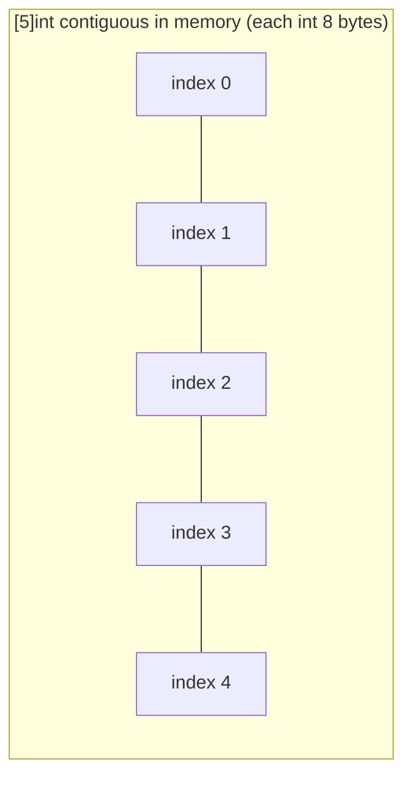
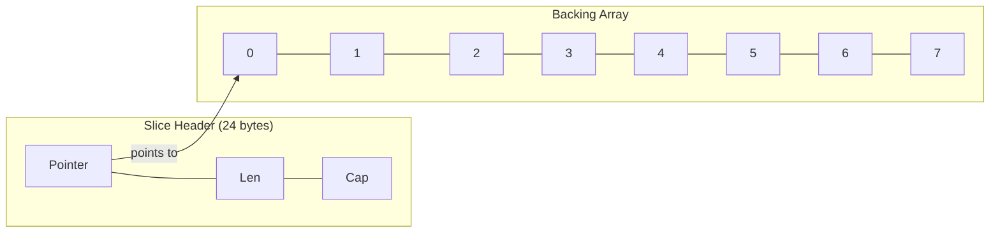
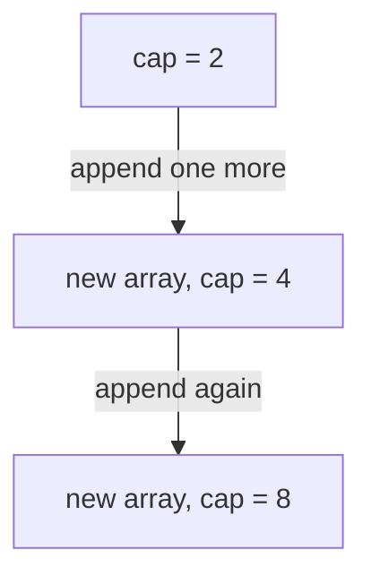

# Arrays and Slices

Arrays and slices are Go's sequence containers. Arrays exist but are rarely used directly — slices are the workhorse data structure, underpinning everything from string iteration to HTTP request handling.

---

## Arrays

An **array** is a fixed-length, ordered sequence of elements of the same type. The length is part of the type itself — `[3]int` and `[5]int` are **different types**.

> 🔑 **Key idea:** The length is baked into the array's type. `[3]int` and `[5]int` are distinct types that cannot be used interchangeably.

### Declaration and initialization

```go
var a [5]int                // [0 0 0 0 0]
b := [5]int{10, 20, 30, 40, 50}
c := [...]int{10, 20, 30}  // compiler infers length 3
d := [5]int{1: 10, 3: 30}  // sparse: [0 10 0 30 0]
```

### Arrays are value types

Arrays are copied on assignment and when passed to functions. The copy is independent — modifying it does not affect the original.

> 🧠 **Memory aid:** Passing an array to a function copies it — think of passing a photocopy, not the original document.

```go
a := [3]int{1, 2, 3}
b := a          // b is a full copy
b[0] = 99
fmt.Println(a)  // [1 2 3] — unchanged
fmt.Println(b)  // [99 2 3]
```

```go
func modify(arr [3]int) {
    arr[0] = 100 // changes are lost when the function returns
}
```

### Working with arrays

```go
arr := [4]int{10, 20, 30, 40}
fmt.Println(len(arr)) // 4
for i, v := range arr {
    fmt.Printf("index %d: value %d\n", i, v)
}
```

### Why arrays are rarely used directly

Because `[N]T` and `[M]T` are different types, you cannot write a function that accepts "any size array":

```go
func sum(arr [5]int) int { /* ... */ }

sum([5]int{1, 2, 3, 4, 5})  // works
sum([3]int{1, 2, 3})         // compile error: [3]int != [5]int
```

This is why Go provides slices — they are a **view** over an underlying array with no fixed size in the type signature. Arrays still have their place:

- As building blocks for slices (every slice has a backing array)
- As fixed-size lookup tables where the size is constant
- As map keys (arrays are comparable, slices are not)



---

## Slices

A **slice** is a dynamic view into an underlying array. It is the most commonly used collection type in Go.

### The slice header

A slice is a 3-word descriptor — only 24 bytes on 64-bit systems, regardless of the backing array size:

```go
type sliceHeader struct {
    Data unsafe.Pointer // pointer to first element
    Len  int            // number of elements
    Cap  int            // max without reallocation
}
```



### Creating slices

```go
var s1 []int              // nil slice (len 0, cap 0)
s2 := []int{}             // empty non-nil slice
s3 := []int{10, 20, 30}   // slice literal
s4 := make([]int, 5)      // len 5, cap 5, all zeros
s5 := make([]int, 0, 10)  // len 0, cap 10

arr := [5]int{1, 2, 3, 4, 5}
s6 := arr[1:4]            // [2 3 4], len=3, cap=4

bytes := []byte("hello")  // from a string
```

### len() vs cap()

```go
s := make([]int, 3, 8)
fmt.Println(len(s)) // 3
fmt.Println(cap(s)) // 8

s = s[:2]
fmt.Println(len(s)) // 2
fmt.Println(cap(s)) // 8 — capacity unchanged by reslicing down
```

### Slicing expressions

The syntax `s[low:high]` includes `low` but excludes `high`. Length of result is `high - low`; capacity is `cap(s) - low`.

```go
arr := [6]int{0, 1, 2, 3, 4, 5}
fmt.Println(arr[1:4])  // [1 2 3]
fmt.Println(arr[1:])   // [1 2 3 4 5]
fmt.Println(arr[:4])   // [0 1 2 3]
fmt.Println(arr[:])    // entire array as a slice
```

You can reslice within the original capacity:

```go
s := make([]int, 5, 10)
s = s[:3]      // len=3, cap=10
s = s[1:]      // len=2, cap=9
s = s[:cap(s)] // len=9, cap=9
```

But not beyond capacity:

```go
s := make([]int, 3, 5)
s = s[:10] // panic: slice bounds out of range
```

### Aliasing — slices share backing arrays

Two slices from the same array share memory. Modifications to one affect the other:

```go
arr := [4]int{1, 2, 3, 4}
s := arr[1:3]     // [2 3]
s[0] = 99         // modifies arr[1] too
fmt.Println(arr)  // [1 99 3 4]
```

#### The append gotcha

When multiple slices share the same backing array, appending to one can silently corrupt the others:

> ⚠️ **Watch out:** Slices created from the same array share memory. A filtered/sliced view that later gets `append`ed can overwrite data another slice still reads.

```go
original := []int{1, 2, 3, 4, 5}
sub := original[:3] // [1, 2, 3] — shares backing array
```

```
Both point to the same underlying array:
┌───┬───┬───┬───┬───┐
│ 1 │ 2 │ 3 │ 4 │ 5 │   Backing Array
└───┴───┴───┴───┴───┘
  ▲
  │ pointer (sub)
  │ pointer (original, same array)
```

After `sub = append(sub, 99)`, `sub` has spare capacity, so `append` writes into the existing backing array:

```
sub (after): [1, 2, 3, 99]     — len=4, cap=5
original:    [1, 2, 3, 99, 5]  — index 3 changed!

┌───┬───┬───┬────┬───┐
│ 1 │ 2 │ 3 │ 99 │ 5 │   Backing Array (modified in place)
└───┴───┴───┴────┴───┘
```

#### The full slice expression (defensive fix)

`s[low:high:max]` limits the result's capacity to `max - low`, preventing downstream `append` from overwriting data you still need:

```go
original := []int{1, 2, 3, 4, 5}
sub := original[:3:3] // len=3, cap=3 — capacity capped

sub = append(sub, 99)
// cap(sub) == 3, need 4 — new allocation forced, original is safe
```

Without the `:3` cap, `append(sub, ...)` would write into `original[3]`.

---

## append

`append` adds elements to a slice and returns the (possibly new) slice. **Always reassign the result.**

> 💡 **Pro tip:** Always assign `append`'s return value back to the slice: `s = append(s, x)`. Forget that and the added element is silently dropped.

```go
s := []int{1, 2, 3}
s = append(s, 4)       // [1 2 3 4]
s = append(s, 5, 6)    // [1 2 3 4 5 6]

more := []int{7, 8}
s = append(s, more...)  // [1 2 3 4 5 6 7 8]
```

### When append reuses vs allocates

`append` reuses the existing backing array if there is enough capacity. If not, it allocates a new, larger array and copies elements. `append` allocates when `len(s) + newElements > cap(s)`.

```go
s := make([]int, 2, 4)
s[0], s[1] = 1, 2

s = append(s, 3) // reuses backing array (cap=4, room for 2 more)
s = append(s, 4) // reuses backing array
s = append(s, 5) // cap=4 but need 5 — allocates NEW backing array
```

### Growth strategy

When `append` grows a slice, Go typically **doubles** the capacity (for capacities below ~256) and then uses a ~1.25× growth factor for larger ones. This makes the **amortized** cost of append O(1), even though any single append that triggers a resize is O(n).



**Growth invalidates aliases**: other slices sharing the old backing array no longer see new elements. For large slices with known size, `make([]T, 0, n)` avoids repeated reallocation copies.

---

## copy

`copy(dst, src)` copies `min(len(dst), len(src))` elements from source to destination:

```go
src := []int{1, 2, 3, 4, 5}
dst := make([]int, 3)
n := copy(dst, src)
fmt.Println(dst) // [1 2 3]
fmt.Println(n)    // 3
```

Making an independent copy to avoid aliasing:

```go
original := []int{1, 2, 3, 4, 5}
cloned := make([]int, len(original))
copy(cloned, original)
```

`copy` handles overlapping source and destination correctly:

```go
s := []int{1, 2, 3, 4, 5}
copy(s[1:], s[:3]) // shift left
fmt.Println(s)      // [1 1 2 3 5]
```

> `copy` does **not** grow the destination. You must size it first.

---

## nil vs empty slices

```go
var s []int      // nil slice — len 0, cap 0, s == nil is true
es := []int{}    // empty slice — len 0, cap 0, but es == nil is false
```

Both are valid with `append`, `range`, and `len`. The primary place it matters is **JSON serialization**:

> 🧠 **Think of it as:** nil slice means "not queried / absent" (`null` in JSON); empty slice means "we looked and found nothing" (`[]`). Pick deliberately.

```go
type Response struct {
    Items []int `json:"items"`
}

r1 := Response{}
json1, _ := json.Marshal(r1)
fmt.Println(string(json1)) // {"items":null}

r2 := Response{Items: []int{}}
json2, _ := json.Marshal(r2)
fmt.Println(string(json2)) // {"items":[]}
```

Use nil when data is absent ("not queried"). Use empty when the result is a genuinely empty list ("found nothing").

---

## for range over slices

```go
s := []string{"a", "b", "c"}
for i, v := range s {
    fmt.Printf("index=%d value=%s\n", i, v)
}
```

### Common range gotcha — the loop variable is reused

```go
s := []int{1, 2, 3}
var ptrs []*int
for _, v := range s {
    ptrs = append(ptrs, &v) // all point to the same variable
}
fmt.Println(*ptrs[0]) // 3 (not 1!)

// Fix: create a new variable per iteration
for _, v := range s {
    v := v
    ptrs = append(ptrs, &v)
}
```

### Modifying via range does not work

```go
s := []int{1, 2, 3}
for _, v := range s {
    v = v * 2 // modifies the loop variable, NOT the slice
}
fmt.Println(s) // [1 2 3] — unchanged

// Fix: use index
for i := range s {
    s[i] = s[i] * 2
}
```

---

## Multi-dimensional slices

```go
matrix := [][]int{
    {1, 2, 3},
    {4, 5, 6},
    {7, 8, 9},
}
fmt.Println(matrix[1][2]) // 6
```

---

## Sorting

```go
import "sort"

nums := []int{5, 2, 8, 1}
sort.Ints(nums)          // [1 2 5 8]

strs := []string{"banana", "apple", "cherry"}
sort.Strings(strs)       // [apple banana cherry]

// Custom sort with less function
sort.Slice(nums, func(i, j int) bool {
    return nums[i] > nums[j]   // descending
})
```

---

## Common slice patterns

### Removing an element

Preserving order (O(n)):

```go
func removeOrdered(s []int, i int) []int {
    return append(s[:i], s[i+1:]...)
}
```

Without preserving order (O(1)):

> 💡 **Note:** If element order doesn't matter, swap-with-last removal is O(1) — swap the target with the last element, then shrink the slice.

```go
func removeUnordered(s []int, i int) []int {
    s[i] = s[len(s)-1]
    return s[:len(s)-1]
}
```

### Filtering

```go
func filter(s []int, fn func(int) bool) []int {
    var result []int
    for _, v := range s {
        if fn(v) {
            result = append(result, v)
        }
    }
    return result
}
```

### Chunking

```go
func chunk(s []int, size int) [][]int {
    var chunks [][]int
    for len(s) > size {
        chunks = append(chunks, s[:size])
        s = s[size:]
    }
    chunks = append(chunks, s)
    return chunks
}
```

### Pre-allocating with make

When you know the approximate final size, pre-allocating avoids repeated growth:

```go
var s []int
for i := 0; i < 1000; i++ {
    s = append(s, i) // grows repeatedly — slow
}

s := make([]int, 0, 1000)
for i := 0; i < 1000; i++ {
    s = append(s, i) // no growth needed — fast
}
```

### Not capturing append's return value in a function

```go
// Bug: modifies only the local copy of the slice header
func add(s []int, v int) {
    s = append(s, v) // does not modify the caller's slice
}

// Fix: return the new slice
func addFixed(s []int, v int) []int {
    return append(s, v)
}
```

### Memory leak from large backing arrays

A small slice keeps the entire backing array alive:

```go
func process() []byte {
    huge := make([]byte, 1<<30) // 1 GB
    small := huge[:100]
    return small // keeps 1 GB alive!
}

// Fix: copy to right-sized slice
func processFixed() []byte {
    huge := make([]byte, 1<<30)
    small := make([]byte, 100)
    copy(small, huge[:100])
    return small
}
```

---

## Big-O summary

| Operation | Array/Slice | Map |
|-----------|-------------|-----|
| Access by index/key | O(1) | O(1) average |
| Append (amortized) | O(1) | n/a |
| Insert at front | O(n) (shift) | n/a |
| Delete by key | n/a | O(1) average |
| Search for value (unsorted) | O(n) | O(1) by key |
| Search (sorted, binary) | O(log n) | O(1) by key |

---

## Modern Practices

- Prefer slices over arrays for almost all use cases
- Use `make([]T, 0, n)` to preallocate capacity when the size is known
- Use the **`slices`** package (Go 1.21+) for common operations:
  - `slices.Contains(s, v)` — membership test
  - `slices.Delete(s, i, j)` — remove elements in-place (replaces the `append(s[:i], s[j:]...)` pattern)
  - `slices.Clone(s)` — deep copy
  - `slices.Sort(s)` — in-place sort
  - `slices.Compact(s)` — remove consecutive duplicates
  - `slices.Index(s, v)` — find first index
  - `slices.Reverse(s)` — reverse in-place
- Use the full slice expression `a[low:high:max]` to control capacity and prevent accidental overwrites
- Use `copy` when you need an independent slice rather than a shared-backing-array alias
- Build type-safe containers with generics instead of `any`:

```go
type Stack[T any] struct {
    data []T
}
func (s *Stack[T]) Push(v T)        { s.data = append(s.data, v) }
func (s *Stack[T]) Pop() (T, bool) {
    if len(s.data) == 0 {
        var zero T
        return zero, false
    }
    v := s.data[len(s.data)-1]
    s.data = s.data[:len(s.data)-1]
    return v, true
}
```

---

## Common Mistakes

1. Not reassigning the result of `append` — the original slice variable won't reflect additions
2. Sharing a backing array between slices causes unexpected cross-mutation
3. Modifying a map's values during a `range` loop (undefined behavior)
4. Confusing nil slices with empty slices (they serialize differently to JSON)
5. Using a fixed-size `[N]T` array and copying large data instead of using a slice
6. Index out of range when slicing beyond the original length
7. Removing elements from the front of a slice with `s = s[1:]` in a loop, which is O(n) per operation and becomes O(n²) overall
8. Allowing unbounded slice growth with repeated `append` without pre-allocating capacity, causing excessive copies and GC pressure
9. `s = s[:0]` does not free memory — it retains capacity and the backing array; set to `nil` to free
10. Slice expressions on nil slices panic

---

## Key Takeaways

1. **Arrays** are fixed-length, value types, and part of the type signature; used rarely.
2. **Slices** are dynamic views over arrays, described by a 3-word header (pointer, length, capacity).
3. Always reassign `append` results: `s = append(s, x)`.
4. Slices share backing arrays — beware of unintended mutations; use `copy` for independence and `s[lo:hi:hi]` to cap capacity.
5. Use `make([]T, 0, n)` to preallocate when final size is known.
6. **Generics** (Go 1.18+) let you build type-safe reusable containers.
7. Use the `slices` stdlib package (Go 1.21+) for common operations — they're generic, optimized, and avoid hand-rolled loops.

## Next

Continue to [02-maps.md](02-maps.md).
