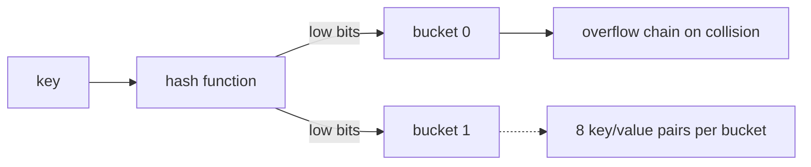

# Maps

A **map** is Go's built-in key-value data structure — an unordered collection of key-value pairs. It is Go's associative array, dictionary, and hash table. Maps are one of the most frequently used data types in Go.

---

## Declaration and creation

A map is declared using `map[K]V` syntax, where `K` is the key type and `V` is the value type.

### Nil maps — reading is safe, writing panics

```go
var ages map[string]int

fmt.Println(ages)        // map[]
fmt.Println(ages == nil) // true
fmt.Println(ages["Bob"]) // 0 (zero value, safe to read)
// ages["Bob"] = 25     // panic: assignment to entry in nil map
```

> ⚠️ **Gotcha:** Reading from a nil map is safe (returns the zero value), but writing to one panics. Always initialize with `make` or a literal first.

**Always initialize a map before writing to it.** Use a map literal or `make`:

### Map literals

```go
scores := map[string]int{
    "Alice":   95,
    "Bob":     82,
    "Charlie": 78,
}

empty := map[string]int{}  // initialized, non-nil empty map
fmt.Println(empty == nil)  // false
```

### make

The `make` function allocates and initializes the underlying hash map:

```go
users := make(map[string]string)
users["admin"] = "root"

// Optional second argument — initial capacity hint, not a hard limit
cache := make(map[int]string, 100) // pre-allocate for ~100 entries
```

---

## Basic operations

### Insert and update

```go
capitals := make(map[string]string)
capitals["France"] = "Paris"
capitals["Japan"] = "Tokyo"
capitals["France"] = "Lyon"  // overwrite existing key
```

### Read

```go
city := capitals["Japan"]
fmt.Println(city) // Tokyo
```

### Delete

```go
delete(capitals, "France")
fmt.Println(capitals) // map[Japan:Tokyo]
```

Deleting a non-existent key is a no-op — it does not panic.

### Length

```go
scores := map[string]int{"Alice": 95, "Bob": 82}
fmt.Println(len(scores)) // 2
```

---

## The comma-ok idiom

When you read from a map and the key does not exist, you get the zero value. This is ambiguous — you cannot distinguish between a key whose value is the zero value and a key that does not exist:

> 🔑 **Key idea:** A bare map lookup can't tell "key absent" from "key present with zero value." Use the comma-ok idiom to check existence explicitly.

```go
scores := map[string]int{"Alice": 95}
fmt.Println(scores["Bob"])   // 0 — but is Bob absent, or is his score 0?
fmt.Println(scores["Alice"]) // 95
```

Go provides the **comma-ok idiom** — a map index expression with a second assignment captures a boolean:

```go
score, ok := scores["Bob"]
fmt.Println(score) // 0
fmt.Println(ok)    // false — key does not exist

score, ok = scores["Alice"]
fmt.Println(score) // 95
fmt.Println(ok)    // true — key exists
```

The standard pattern:

```go
if score, ok := scores["Bob"]; ok {
    fmt.Println("Bob's score:", score)
} else {
    fmt.Println("Bob has no score")
}
```

Or when you only care about existence:

```go
if _, ok := scores["Bob"]; !ok {
    fmt.Println("Bob not found")
}
```

---

## Iterating a map

Use `range` to iterate over a map:

```go
scores := map[string]int{
    "Alice":   95,
    "Bob":     82,
    "Charlie": 78,
}

for name, score := range scores {
    fmt.Printf("%s: %d\n", name, score)
}
```

### Iteration order is intentionally randomized

Each time you run a `range` loop over a map, Go visits the keys in a different order. **This is by design, not a bug.** The Go team made this decision because deterministic map iteration would lead programmers to depend on it — creating invisible dependencies that break in subtle ways when the map's internal structure changes.

> ⚠️ **Watch out:** Never rely on map iteration order. If you need a stable order, collect the keys, sort them, then iterate.

### Sorted iteration

If you need a specific order, collect the keys, sort them, and iterate in sorted order:

```go
names := make([]string, 0, len(scores))
for name := range scores {
    names = append(names, name)
}

sort.Strings(names)

for _, name := range names {
    fmt.Printf("%s: %d\n", name, scores[name])
}
```

---

## Maps are reference types

Maps are assigned and passed by **reference-like** semantics — modifying them inside a function affects the caller:

> 🧠 **Memory aid:** A map is like a pointer to a shared whiteboard — anyone holding it writes on the same surface. Assigning a map shares the data; it doesn't copy it.

```go
func increment(s map[string]int, key string) {
    s[key]++
}

m := map[string]int{"x": 1}
increment(m, "x")
fmt.Println(m["x"]) // 2
```

Assignment shares the underlying data:

```go
original := map[string]int{"a": 1, "b": 2}
copy := original

copy["c"] = 3
fmt.Println(original) // map[a:1 b:2 c:3] — original is affected!
```

### Making a true copy

```go
original := map[string]int{"a": 1, "b": 2}
cloned := make(map[string]int, len(original))

for k, v := range original {
    cloned[k] = v
}

cloned["c"] = 3
fmt.Println(original) // map[a:1 b:2] — original is unchanged
```

---

## Map key restrictions

Map keys must be **comparable** (can be compared with `==`):

| Type | Usable as key? |
|------|---------------|
| Booleans, numbers, strings | Yes |
| Pointers, channels, interface values | Yes |
| Arrays | Yes (if element type is comparable) |
| Structs | Yes (if all fields are comparable) |
| **Slices, maps, functions** | **No** |

```go
// This will not compile:
m := map[[]string]int{} // error: invalid map key type []string
```

### Struct keys — useful patterns

```go
type Point struct {
    X, Y int
}

distances := map[Point]string{
    {0, 0}: "origin",
    {1, 1}: "diagonal",
}

fmt.Println(distances[Point{1, 1}]) // diagonal
```

If you need a slice as a key, convert it to a comparable representation:

```go
func sliceKey(s []string) string {
    return strings.Join(s, ",")
}
```

---

## Maps of slices

Values can be any type, including slices:

```go
groups := map[string][]string{
    "frontend": {"Alice", "Bob"},
    "backend":  {"Charlie"},
}

groups["frontend"] = append(groups["frontend"], "Diana")
fmt.Println(groups["frontend"]) // [Alice Bob Diana]
```

---

## Nested maps

Maps can contain other maps as values, creating nested structures:

```go
scores := map[string]map[string]int{
    "math":    {"Alice": 95, "Bob": 82},
    "science": {"Alice": 88, "Bob": 91},
}

fmt.Println(scores["math"]["Alice"]) // 95
```

**Each inner map must be created before use.** Forgetting causes a panic:

> ⚠️ **Watch out:** The value of a map key is a nil map until you initialize it. Writing to a nested map without creating it first panics.

```go
scores := make(map[string]map[string]int)
scores["math"]["Alice"] = 95 // panic: assignment to entry in nil map

// Fix: initialize inner map first
scores["math"] = make(map[string]int)
scores["math"]["Alice"] = 95 // safe
```

Check for a nil inner map before writing:

```go
if scores["science"] == nil {
    scores["science"] = make(map[string]int)
}
scores["science"]["Bob"] = 91
```

---

## Sets using maps

Go has no built-in set type. The idiomatic approach uses `map[K]struct{}`:

```go
type IntSet map[int]struct{}

func (s IntSet) Add(v int)           { s[v] = struct{}{} }
func (s IntSet) Contains(v int) bool { _, ok := s[v]; return ok }
func (s IntSet) Remove(v int)        { delete(s, v) }

set := IntSet{}
set.Add(1); set.Add(2)
fmt.Println(set.Contains(1)) // true
```

Why `struct{}`? An empty struct uses **zero bytes** — a set of ints is just the keys, with no wasted space on values.

> 💡 **Pro tip:** Use `map[K]struct{}` for zero-overhead sets. The empty struct takes no memory, so you pay only for the keys.

You can also use `map[K]bool` for a simpler, slightly less memory-efficient approach:

```go
seen := make(map[string]bool)
words := []string{"go", "is", "great", "go"}

for _, word := range words {
    if !seen[word] {
        fmt.Println("first occurrence of", word)
        seen[word] = true
    }
}
```

---

## Map internals and performance

A Go map is a hash table with **buckets** — each bucket holds 8 key/value pairs plus an overflow pointer. The runtime:

1. Hashes the key.
2. Uses the low bits to pick a bucket, high bits to filter within it.
3. On collision, walks the bucket / overflow chain.



- Lookup/insert/delete are **O(1) average**, O(n) worst case.
- Iteration order is **randomized**; never rely on it.
- Taking the address of a map element `&m[k]` is **not allowed** because buckets may relocate on insert/delete.

---

## Practical examples

### Word frequency counter

```go
func wordCount(text string) map[string]int {
    counts := make(map[string]int)
    words := strings.Fields(text)

    for _, word := range words {
        word = strings.ToLower(word)
        counts[word]++
    }
    return counts
}
```

### Grouping data

```go
type Student struct {
    Name  string
    Grade string
}

func groupByGrade(students []Student) map[string][]string {
    groups := make(map[string][]string)
    for _, s := range students {
        groups[s.Grade] = append(groups[s.Grade], s.Name)
    }
    return groups
}
```

### Simple cache with expiration

```go
type Cache struct {
    store map[string]CacheEntry
}

type CacheEntry struct {
    Value     string
    ExpiresAt time.Time
}

func NewCache() *Cache {
    return &Cache{store: make(map[string]CacheEntry)}
}

func (c *Cache) Set(key, value string, ttl time.Duration) {
    c.store[key] = CacheEntry{
        Value:     value,
        ExpiresAt: time.Time{}.Add(ttl),
    }
}

func (c *Cache) Get(key string) (string, bool) {
    entry, ok := c.store[key]
    if !ok || time.Now().After(entry.ExpiresAt) {
        return "", false
    }
    return entry.Value, true
}
```

---

## Big-O summary

| Operation | Complexity | Notes |
|-----------|-----------|-------|
| Lookup by key | O(1) average, O(n) worst | Hash table |
| Insert/update | O(1) average | Rehash if load factor high |
| Delete by key | O(1) average | Marks slot, reclaims later |
| Len | O(1) | Stored in map header |
| Iterate | O(n) | Order is randomized |
| Membership (comma-ok) | O(1) average | Same as lookup |

---

## Modern Practices

- Use the **`maps`** package (Go 1.21+) for common operations:
  - `maps.Keys(m)` — returns an iterator over keys
  - `maps.Values(m)` — returns an iterator over values
  - `maps.Clone(m)` — shallow copy
  - `maps.Copy(dst, src)` — copy entries from src to dst
  - `maps.DeleteFunc(m, f)` — delete entries matching a predicate
  - `maps.Equal(m1, m2)` — deep equality check
  - `maps.EqualFunc(m1, m2, f)` — equality with custom comparator
- Use `map[T]struct{}` as the idiomatic set — the empty struct costs zero bytes per value
- Use comma-ok idiom whenever the zero value is a legitimate value
- Pre-allocate with `make(map[K]V, n)` when you know the approximate number of entries
- Never rely on map iteration order — collect keys and sort if you need deterministic output
- Avoid nested maps when possible — flatten to `map[string]string` with composite keys for simpler code

---

## Common Mistakes

1. **Writing to a nil map** without initialization — always use `make` or a literal before writing
2. **Forgetting that maps are reference types** — assigning or passing a map shares data, doesn't copy
3. **Not checking comma-ok** when the zero value is valid — you can't tell if a key exists from the value alone
4. **Writing to a nil inner map** in nested maps — each inner map must be initialized before use
5. **Using non-comparable types as keys** (slices, maps, functions) — compile error
6. **Relying on map iteration order** in tests or business logic — it is intentionally randomized and not stable between runs
7. **Modifying a map during iteration** — only `delete` is safe during range; adding keys has undefined behavior
8. **Not copying maps properly** — returning a map from a function doesn't clone it; callers share the original

---

## Key Takeaways

1. **Maps** are unordered, reference-like, with zero-value reads and the **comma-ok** idiom for existence checks.
2. Never write to a nil map without initializing with `make` or a literal.
3. Map keys must be **comparable** — slices, maps, and functions cannot be keys.
4. Iteration order is **randomized by design** — collect and sort keys if you need deterministic output.
5. Use **`map[T]struct{}`** as the idiomatic set (zero-byte values).
6. Use the `maps` stdlib package (Go 1.21+) for common operations.

## Next

Continue to [03-strings-deep.md](03-strings-deep.md).
