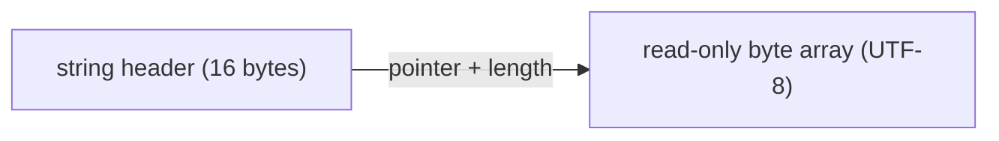
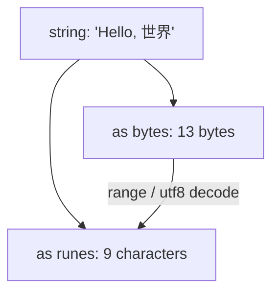

# Strings Deep Dive

A `string` in Go is an **immutable sequence of bytes** — not a sequence of characters. Understanding how strings, bytes, and runes interact is essential for writing correct Go programs. Most text-processing bugs come from confusing these three.

> 🔑 **Key idea:** A Go string is a sequence of bytes, not characters. `len` counts bytes; runes represent Unicode code points.

---

## String internals

### The string header

A Go string is a **read-only slice of bytes** — a 2-word header holding a pointer to the data and the length. There is **no capacity** and **no NUL terminator** (unlike C strings).

> 🧠 **Think of it as:** A string is a read-only `[]byte` with a pointer and a length — no capacity, no null terminator, and never mutated in place.

```go
type stringHeader struct {
    Data unsafe.Pointer // pointer to the byte array
    Len  int            // number of bytes
}
```

On 64-bit systems the header is 16 bytes. Copying a string copies 16 bytes; the underlying bytes are shared. This makes `string` a cheap-to-copy value type.



### Strings are immutable — three reasons

1. **Safety.** Functions pass strings freely without worrying about mutation from the caller or other goroutines.
2. **Performance.** The compiler knows the contents will not change, enabling read-only placement, substring sharing, and eliminated defensive copies.
3. **Sharing.** Two strings can share the same underlying byte array. `s[2:4]` does not copy bytes — it creates a new header pointing into the original. Immutability makes this safe.

```go
s := "hello"
s[0] = 'H'  // compile error: cannot assign to s[0]
```

---

## UTF-8 encoding

Go source code and string literals are UTF-8 encoded. UTF-8 is a variable-width encoding:

| Range (code points) | Bytes per rune | Byte pattern |
|---------------------|---------------|--------------|
| U+0000 – U+007F (ASCII) | 1 | `0xxxxxxx` |
| U+0080 – U+07FF | 2 | `110xxxxx 10xxxxxx` |
| U+0800 – U+FFFF (incl. CJK) | 3 | `1110xxxx 10xxxxxx 10xxxxxx` |
| U+10000 – U+10FFFF (emoji) | 4 | `11110xxx 10xxxxxx 10xxxxxx 10xxxxxx` |

**One character does not always equal one byte.** This is the central fact of string handling in Go.

> ⚠️ **Gotcha:** `len("世界")` is 6, not 2 — the length is measured in bytes. Each CJK character takes 3 bytes in UTF-8.

### What the bytes look like

```
String "Hi"          — 2 bytes
+--------+--------+
|   0x48 |   0x69 |
+--------+--------+
    'H'      'i'

String "Hi世界"      — 8 bytes (2 ASCII + 3 + 3)
+--------+--------+--------+--------+--------+--------+--------+--------+
|   0x48 |   0x69 | 0xE4  | 0xB8  | 0x96  | 0xE7  | 0x95  | 0x8C  |
+--------+--------+--------+--------+--------+--------+--------+--------+
    'H'      'i'    \xE4\xB8\x96      \xE7\x95\x8C
                       '世'                '界'

String "Hi🚀"        — 7 bytes (2 ASCII + 4 for emoji)
+--------+--------+--------+--------+--------+--------+--------+
|   0x48 |   0x69 | 0xF0  | 0x9F  | 0x9A  | 0x80  |        |
+--------+--------+--------+--------+--------+--------+--------+
    'H'      'i'    \xF0\x9F\x9A\x80 (4 bytes for rocket)
```

### len() returns bytes, not characters

```go
fmt.Println(len("hello"))      // 5  (5 ASCII characters, 5 bytes)
fmt.Println(len("世界"))       // 6  (2 characters, 6 bytes)
fmt.Println(len("Hi🚀"))      // 7  (3 characters, 7 bytes)
```

For character count, use `utf8.RuneCountInString()`:

```go
s := "Hello, 世界! 🚀"
fmt.Println(len(s))                      // 19 bytes
fmt.Println(utf8.RuneCountInString(s))   // 10 runes
```

Byte breakdown for `"Hello, 世界! 🚀"`:

```
H  e  l  l  o  ,  (space)  世     界     !  (space)  rocket
1  1  1  1  1  1    1       3      3     1    1       4
                                                       Total: 19 bytes
```

---

## Indexing and slicing

### Indexing returns bytes

```go
s := "Hello, 世界"
fmt.Printf("%c\n", s[0])  // H
fmt.Printf("%x\n", s[7])  // e4  (first byte of '世')
fmt.Println(s[7])          // 228 (decimal value of 0xe4)
```

Accessing `s[8]` or `s[9]` gives you the second and third bytes of `世` — not a valid character on its own. **This is the single most common source of bugs with non-ASCII strings.**

> ⚠️ **Watch out:** `s[i]` indexes by byte, not character. Indexing into a multi-byte rune gives you a partial byte — use `range` or `[]rune` for characters.

### Slicing yields a new string (by byte indices)

```go
s := "hello world"
sub := s[0:5]    // "hello"
sub2 := s[6:]    // "world"
sub3 := s[:5]    // "hello"
```

Slicing shares the backing byte array — it is O(1) and allocation-free.

> Slicing by byte index can break a multi-byte UTF-8 character. Prefer rune-aware operations for text.

---

## Runes and bytes

A **rune** is an alias for `int32` and represents a single Unicode code point. A **byte** is an alias for `uint8`.

> 🔑 **Remember:** `rune` = one Unicode code point (an `int32`); `byte` = one raw 8-bit value. `range` iterates runes; indexing iterates bytes.

```go
r := 'A'        // rune literal — numeric value 65
r2 := '😀'      // valid rune (emoji is a single code point)
fmt.Println(r)  // 65
fmt.Printf("%c\n", r)  // A
```

### Three ways to iterate a string

#### 1. By bytes (using index)

```go
s := "hi😀"
for i := 0; i < len(s); i++ {
    fmt.Printf("%d: %x\n", i, s[i])  // prints raw bytes
}
```

#### 2. By runes (using range) — the idiomatic way

```go
s := "Hi, 世界!"
for i, r := range s {
    fmt.Printf("byte index: %d, rune: %c (U+%04X)\n", i, r, r)
}
```

```
byte index: 0, rune: H (U+0048)
byte index: 1, rune: i (U+0069)
byte index: 2, rune: , (U+002C)
byte index: 3, rune:   (U+0020)
byte index: 4, rune: 世 (U+4E16)
byte index: 7, rune: 界 (U+754C)
byte index: 10, rune: ! (U+0021)
```

The byte index **jumps** (0, 1, 2, 3, 4, **7**, **10**) — the gaps are multi-byte characters. `for range` always gives you complete runes. A `for i := 0; i < len(s); i++` loop does not:

```go
s := "世界"
for _, r := range s {
    fmt.Printf("%c ", r)  // 世 界
}
for i := 0; i < len(s); i++ {
    fmt.Printf("%c ", s[i])  // garbage bytes as characters
}
```

#### 3. Explicitly decode runes

```go
import "unicode/utf8"

s := "héllo"
for len(s) > 0 {
    r, size := utf8.DecodeRuneInString(s)
    fmt.Printf("%c (size %d bytes)\n", r, size)
    s = s[size:]
}
```



---

## Converting between string, []byte, and []rune

```go
s := "hello"

// string -> []byte (bytes)
bytes := []byte(s)       // [104 101 108 108 111]

// []byte -> string
back := string(bytes)    // "hello"

// string -> []rune (characters)
runes := []rune(s)       // [104 101 108 108 111]

// []rune -> string
str := string(runes)     // "hello"
```

Converting between `string` and `[]byte` or `[]rune` **copies the data**. The compiler may elide the copy in specific cases, but the general rule is: conversion = copy.

> 🔑 **Key idea:** `[]rune(s)` decodes UTF-8 into individual characters so indexing works character-by-character; indexing a raw string gives bytes.

> `[]rune(s)` is very useful: indexing a `[]rune` gives characters, while indexing a string gives bytes.

---

## String concatenation

### + operator

```go
greeting := "Hello, " + "world"
```

### += in a loop — O(n²), avoid

```go
// Each iteration copies the entire accumulated string
result := ""
for i := 0; i < 10000; i++ {
    result += "a" // O(n²) — quadratic
}
```

### strings.Join — efficient for joining slices

```go
parts := []string{"a", "b", "c"}
joined := strings.Join(parts, ", ")   // "a, b, c"
```

### strings.Builder — most efficient for loops

```go
var builder strings.Builder
for i := 0; i < 10000; i++ {
    builder.WriteString("a")
}
result := builder.String()  // O(n)
```

`strings.Builder` allocates as needed and only copies once on `String()`. It implements `io.Writer`, `io.ByteWriter`, and `io.StringWriter`. Use `Grow(n)` to pre-allocate when the size is known.

> 💡 **Pro tip:** Prefer `strings.Builder` over `+` in loops. Naive `+=` concatenation repeatedly copies the whole string — O(n²) instead of O(n).

### fmt-based building

```go
name, age := "Sam", 25
s := fmt.Sprintf("%s is %d", name, age)
```

---

## The strings package

### Searching and matching

```go
s := "Hello, World!"

strings.Contains(s, "World")      // true
strings.HasPrefix(s, "Hello")     // true
strings.HasSuffix(s, "!")         // true
strings.Index(s, "World")         // 7 (byte index, not rune index)
strings.LastIndex(s, "o")         // index of last 'o'
strings.Count(s, "l")             // 2
strings.ContainsAny(s, "aeiou")   // true (any of the chars present)
```

### Splitting and joining

```go
parts := strings.Split("a,b,c", ",")           // ["a" "b" "c"]
kv := strings.SplitN("key=value=extra", "=", 2) // ["key" "value=extra"]
lines := strings.Split(s, "\n")
fields := strings.Fields("  a  b c ")          // ["a" "b" "c"]
joined := strings.Join(parts, "-")              // "a-b-c"
```

`Fields` splits on any whitespace and discards empty strings — ideal for word splitting. `SplitN` is useful when you only care about the first occurrence of a separator.

### Trimming

```go
strings.TrimSpace("  hi  ")            // "hi"
strings.Trim("##hello##", "#")         // "hello"
strings.TrimLeft("##hello##", "#")     // "hello##"
strings.TrimRight("helloxxx", "x")     // "hello"
strings.TrimPrefix(s, "Hello")         // remove prefix if present
strings.TrimSuffix(s, "world")         // remove suffix if present
```

`TrimPrefix` and `TrimSuffix` only remove the prefix/suffix if it matches exactly — safer than manual slice operations.

### Transforming

```go
strings.ToUpper("hello")              // "HELLO"
strings.ToLower("HELLO")              // "hello"
strings.ToTitle("hello world")        // "HELLO WORLD"
strings.Replace("aabbcc", "bb", "xx", -1)  // "aaxxcc"
strings.ReplaceAll("aabbcc", "bb", "xx")   // "aaxxcc"
```

For multiple replacements, use `strings.NewReplacer` — more efficient than calling `Replace` multiple times:

```go
r := strings.NewReplacer("cat", "dog", "mat", "rug")
fmt.Println(r.Replace("the cat sat on the mat"))
// "the dog sat on the rug"
```

### Comparison

```go
strings.Compare("abc", "abd")       // -1 (a < b)
strings.EqualFold("Go", "go")       // true (case-insensitive, Unicode-safe)
```

### strings.Cut (Go 1.18+)

Splits around the first occurrence of a separator — cleaner than `SplitN` for splitting into exactly two parts:

```go
key, value, found := strings.Cut("name=Alice", "=")
if found {
    fmt.Printf("key=%s value=%s\n", key, value)
}
```

### strings.Reader

Implements `io.Reader`, `io.ReadSeeker`, `io.ReaderAt`, and `io.RuneReader` — treat a string as an in-memory stream:

```go
reader := strings.NewReader("Hello, World!")
buf := make([]byte, 5)
n, _ := io.ReadFull(reader, buf)
fmt.Println(string(buf)) // Hello
```

---

## The bytes package

The `bytes` package provides the same functions operating on `[]byte`, plus `bytes.Buffer` for efficient byte-level manipulation:

```go
var buf bytes.Buffer
buf.WriteString("Hello")
buf.WriteString(", ")
buf.WriteString("World!")
result := buf.String()  // "Hello, World!"
```

**`strings.Builder` vs `bytes.Buffer`:**

| | `strings.Builder` | `bytes.Buffer` |
|---|---|---|
| Use when | Building a string to return/display | Need to read from buffer or work with binary data |
| Implements | `io.Writer`, `io.Stringer` | `io.Reader`, `io.Writer`, `io.Stringer` |
| Speed | Slightly faster (avoids internal copy) | Slightly slower (supports read) |

---

## The strconv package

`strconv` converts between strings and other primitive types. It is faster than `fmt.Sprintf` for single conversions (~5-10× faster, no reflection):

> 💡 **Note:** Use `strconv.Itoa`/`Atoi` for number-to-string and back — ~5-10× faster than `fmt` because it avoids reflection.

### Int conversions

```go
s := strconv.Itoa(42)          // "42"
s64 := strconv.FormatInt(42, 10) // "42" (any base)
hex := strconv.FormatInt(255, 16) // "ff"

n, err := strconv.Atoi("42")   // 42, nil
n64, err := strconv.ParseInt("-123", 10, 64)
```

### Float conversions

```go
f, _ := strconv.ParseFloat("3.14", 64)
sf := strconv.FormatFloat(3.14, 'f', 2, 64)  // "3.14"
// Format: 'f' for decimal, 'e' for scientific, 'g' for shortest
```

### Bool conversions

```go
b, _ := strconv.ParseBool("true")     // true
sb := strconv.FormatBool(false)       // "false"
```

### Quote and Unquote

```go
s := `Hello "World"`
fmt.Println(strconv.Quote(s))       // "Hello \"World\""
fmt.Println(strconv.QuoteToASCII("日本語")) // "\u65e5\u672c\u8a9e"
```

### CanParse (Go 1.20+)

```go
fmt.Println(strconv.CanParseInt("123", 10, 64))   // true
fmt.Println(strconv.CanParseInt("abc", 10, 64))   // false
```

---

## The unicode and unicode/utf8 packages

```go
import (
    "unicode"
    "unicode/utf8"
)

unicode.IsLetter('a')    // true
unicode.IsDigit('5')     // true
unicode.IsSpace(' ')     // true
unicode.IsUpper('A')     // true
unicode.IsLower('a')     // true
unicode.ToUpper('a')     // 'A'

utf8.RuneCountInString("héllo")  // 5
utf8.ValidString("héllo")        // true
utf8.Valid([]byte{0xff, 0xfe})   // false
```

---

## Common string tasks

### Reverse a string (rune-safe)

```go
func reverse(s string) string {
    runes := []rune(s)
    for i, j := 0, len(runes)-1; i < j; i, j = i+1, j-1 {
        runes[i], runes[j] = runes[j], runes[i]
    }
    return string(runes)
}
```

### Check palindrome (rune-safe)

```go
func isPalindrome(s string) bool {
    runes := []rune(s)
    for i := 0; i < len(runes)/2; i++ {
        if runes[i] != runes[len(runes)-1-i] {
            return false
        }
    }
    return true
}
```

### Safe truncation

> 💡 **Pro tip:** Truncate via `[]rune(s)` to avoid cutting a multi-byte character in half. Byte-based slicing on non-ASCII text can produce invalid UTF-8.

```go
func truncate(s string, maxRunes int) string {
    runes := []rune(s)
    if len(runes) <= maxRunes {
        return s
    }
    return string(runes[:maxRunes])
}
```

### Count vowels

```go
func countVowels(s string) int {
    count := 0
    for _, r := range s {
        switch unicode.ToLower(r) {
        case 'a', 'e', 'i', 'o', 'u':
            count++
        }
    }
    return count
}
```

### Word count

```go
func words(s string) int {
    return len(strings.Fields(s))
}
```

### Parse CSV data

```go
data := `name,age,city
Alice,30,New York
Bob,25,San Francisco`

lines := strings.Split(data, "\n")
headers := strings.Split(lines[0], ",")

for _, line := range lines[1:] {
    if line == "" { continue }
    fields := strings.Split(line, ",")
    record := make(map[string]string)
    for i, field := range fields {
        record[headers[i]] = field
    }
    fmt.Printf("Name: %s, Age: %s, City: %s\n",
        record["name"], record["age"], record["city"])
}
```

---

## Big-O for string operations

| Operation | Cost | Note |
|-----------|------|------|
| `s[i:j]` substring | O(1) | shares backing bytes |
| `len(s)` | O(1) | stored in header |
| `+` concatenation | O(n) each | new allocation & copy |
| `+=` in loop | O(n²) | quadratic — use Builder |
| `[]byte(s)` conversion | O(n) | copies (unless compiler optimizes) |
| `[]rune(s)` conversion | O(n) | copies and decodes |
| `utf8.RuneCountInString` | O(n) | walks all bytes |
| `strings.Contains` | O(n·m) worst | may use optimized search |
| `strings.Builder` in loop | O(n) amortized | buffer grows like a slice |
| `strings.Cut` | O(n) | finds first separator |
| `strings.EqualFold` | O(n) | Unicode-aware fold |

---

## Modern Practices

- Use `strings.Builder` for efficient string concatenation in loops — O(n) vs O(n²) with `+`
- Use `strings.Cut` instead of `SplitN` when splitting into exactly two parts
- Use `strings.EqualFold` for case-insensitive comparison — handles Unicode correctly
- Use `strings.NewReader` when you need to pass a string to a function that expects `io.Reader`
- Use the `strings` and `strconv` packages instead of manual parsing or formatting
- Use `range` to iterate over strings for rune-safe character access
- Convert to `[]rune` for character-level operations like reversing or random access
- Prefer `strconv.Itoa` / `strconv.Atoi` over `fmt.Sprintf` for simple conversions — 5-10× faster
- Treat strings as raw bytes and use the `utf8` package when character-level ops are needed
- Use `strings.NewReplacer` when performing multiple replacements on the same string
- Use `utf8.ValidString` to check if a string contains well-formed UTF-8

---

## Common Mistakes

1. **Assuming `len(s)` returns the character count** — it returns the byte count
2. **Indexing with `s[i]` on a multi-byte rune** — gives a partial, invalid byte
3. **Using `+` for concatenation inside a loop** — creates O(n²) performance; use `strings.Builder`
4. **Comparing strings with `==` when case-insensitive comparison is needed** — use `strings.EqualFold`
5. **Forgetting UTF-8 when slicing** — `s[i:j]` operates on bytes, not runes, and can break characters
6. **Iterating bytes instead of runes** — `for i := 0; i < len(s); i++` with `s[i]` gives bytes, not characters
7. **Truncating in the middle of a multi-byte character** — convert to `[]rune` first for safe truncation
8. **Comparing `string` to `[]byte` directly** — compile error: mismatched types; must convert explicitly
9. **Using `fmt.Sprintf` for simple type conversions** — `strconv.Itoa` / `strconv.Atoi` are much faster
10. **Using `path.Join` instead of `filepath.Join` for file system paths** — `path` uses forward slashes always; `filepath` uses OS separators

---

## Key Takeaways

1. Strings are **immutable sequences of bytes**; `len` counts bytes, not characters.
2. A Go string is a 2-word header (pointer + length); no NUL terminator, no capacity.
3. UTF-8 uses 1–4 bytes per rune; ASCII is 1 byte, CJK is 3, emoji is 4.
4. `s[i]` returns a **byte**; `for range` iterates **runes** — use range for character-level access.
5. `[]rune(s)` lets you work character-by-character with indexing.
6. Use the `strings` package for search, transform, split/join; `strings.Builder` for efficient concatenation.
7. Use `strconv` for number conversions — significantly faster than `fmt.Sprintf`.
8. Naive `+` concatenation in loops is O(n²); `strings.Builder` is O(n).

## Next

Continue to [04-data-structures.md](04-data-structures.md).
