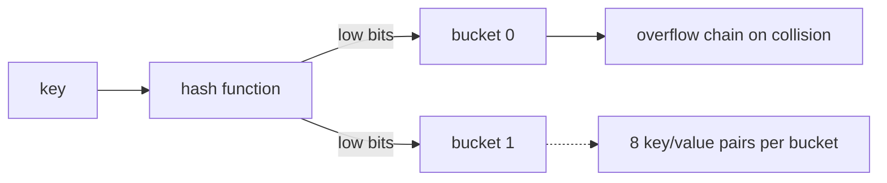
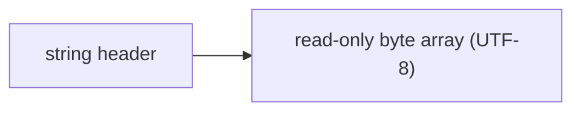
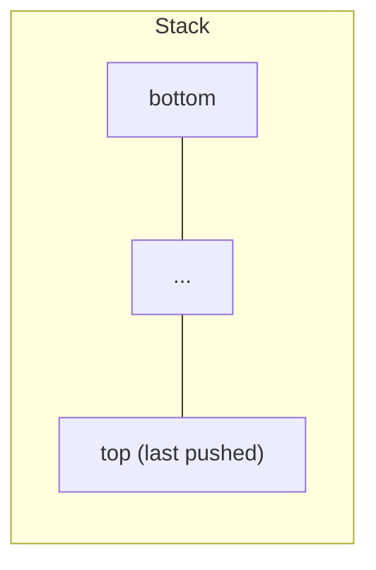
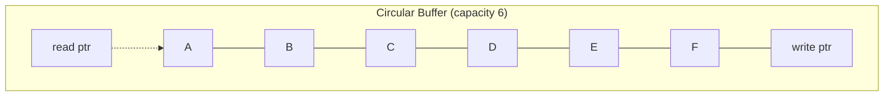
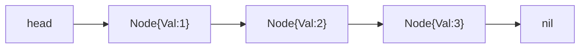
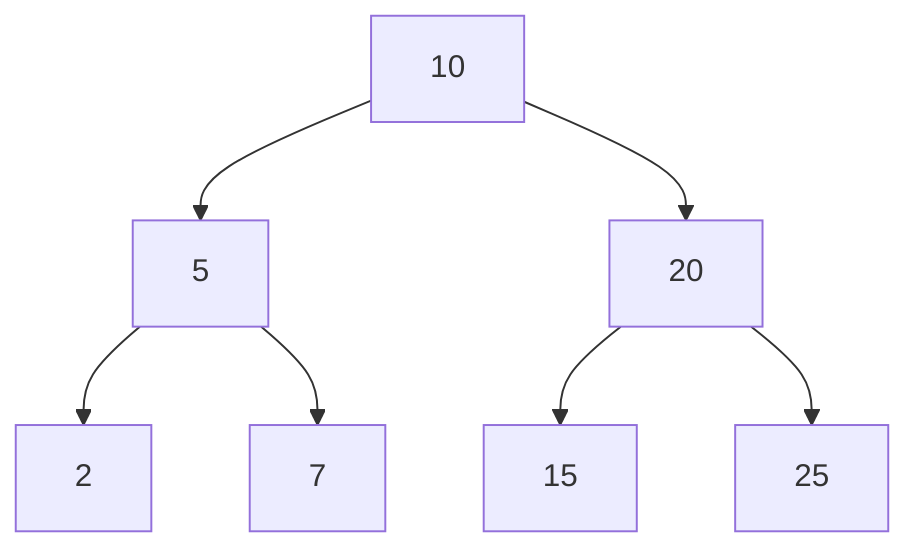
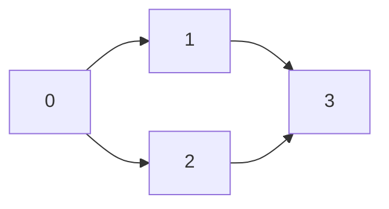

# Data Structures in Go

This chapter covers the data structures you can build and use in Go: the built-in collections, how they're implemented under the hood, and how to implement classic structures idiomatically in Go.

---

## Overview: Which structure when?

| Structure | Ordering | Duplicates | Access | Best for |
|-----------|----------|-----------|--------|----------|
| `[N]T` array | ordered | yes | by index | fixed-size, contiguous data |
| `[]T` slice | ordered | yes | by index | dynamic sequence, workhorse |
| `map[K]V` | unordered | keys unique | by key | lookups, counts, sets |
| `string` | ordered (bytes) | yes | by byte index | text (immutable) |
| `struct` | fixed fields | n/a | by field | grouping related data |
| interface | n/a | n/a | via methods | polymorphism |

### Big-O cheatsheet (built-ins)

| Operation | Array/Slice | Map |
|-----------|-------------|-----|
| Access by index/key | O(1) | O(1) average |
| Append (amortized) | O(1) | n/a |
| Insert at start | O(n) (shift) | n/a |
| Delete by key | n/a | O(1) average |
| Search for value (unsorted) | O(n) | O(1) by key |
| Search (sorted, binary) | O(log n) | O(1) by key |

---

## How the built-in structures are implemented

### The slice header

A slice is a **3-word descriptor**: pointer, length, capacity.

```go
type sliceHeader struct {
    Data unsafe.Pointer // pointer to first element
    Len  int            // number of elements
    Cap  int            // max without reallocation
}
```

Reslicing and `append` only manipulate these 3 values (plus resize the backing array when full). This is why slices are cheap to pass around — you copy 24 bytes of header, not the whole array.

### The map: a hash table

A Go map is a hash table with **buckets** (a bucket holds 8 key/value pairs plus an overflow pointer). The runtime:

1. Hashes the key.
2. Uses the low bits to pick a bucket, high bits to filter within it.
3. On collision, walks the bucket / overflow chain.

Iteration order over maps is **randomized** by design — never rely on it. Maps are also **non-addressable**: you cannot take `&m[k]`.



### The string: immutable byte slice

A string is a **read-only slice of bytes** (pointer + length). It is NOT a slice of runes. Characters are UTF-8 encoded (1–4 bytes per rune). See [03-strings-deep.md](03-strings-deep.md).



### Arrays vs slices vs pointers recap

| Aspect | Array `[N]T` | Slice `[]T` | Pointer `*T` |
|--------|--------------|-------------|--------------|
| Size fixed? | yes (in type) | no (dynamic) | n/a |
| Copied on assignment | yes (whole array) | header only (shares data) | address only |
| Can grow | no | yes (`append`) | n/a |
| Zero value | all zero elements | nil | nil |

---

## Stack (LIFO)

A stack is a last-in, first-out structure. The simplest implementation uses a slice.



```go
type Stack[T any] struct {
    data []T
}

func (s *Stack[T]) Push(v T)        { s.data = append(s.data, v) }
func (s *Stack[T]) Peek() (T, bool) {
    if len(s.data) == 0 {
        var zero T
        return zero, false
    }
    return s.data[len(s.data)-1], true
}
func (s *Stack[T]) Pop() (T, bool) {
    if len(s.data) == 0 {
        var zero T
        return zero, false
    }
    v := s.data[len(s.data)-1]
    s.data = s.data[:len(s.data)-1]
    return v, true
}
func (s *Stack[T]) IsEmpty() bool { return len(s.data) == 0 }
func (s *Stack[T]) Len() int      { return len(s.data) }
```

**Big-O:**

| Operation | Complexity |
|-----------|-----------|
| Push | O(1) amortized |
| Pop | O(1) |
| Peek | O(1) |
| Len | O(1) |

---

> 💡 **Pro tip:** These generic container patterns (stack, queue, ring) work with any type `T` — prefer them over hand-rolling a version per concrete type.

## Queue (FIFO)

A queue is a first-in, first-out structure. Removing from the **front** of a slice is O(n) because it shifts elements. The head-index trick gives amortized O(1) dequeue:

> 🔑 **Key idea:** Dequeueing from the front via `s = s[1:]` shifts everything — O(n). Keeping a `head` index makes it amortized O(1).

```go
type Queue[T any] struct {
    data []T
    head int
}

func (q *Queue[T]) Enqueue(v T) {
    q.data = append(q.data, v)
}
func (q *Queue[T]) Dequeue() (T, bool) {
    if q.head >= len(q.data) {
        var zero T
        return zero, false
    }
    v := q.data[q.head]
    q.head++
    // Compact when waste exceeds threshold
    if q.head > len(q.data)/2 {
        remaining := len(q.data) - q.head
        copy(q.data, q.data[q.head:])
        q.data = q.data[:remaining]
        q.head = 0
    }
    return v, true
}
func (q *Queue[T]) Len() int { return len(q.data) - q.head }
```

> For very high throughput, consider a ring buffer or `container/list`.

---

## Ring buffer (circular buffer)

A fixed-capacity buffer that overwrites the oldest element when full. Used in producer/consumer designs and sliding windows.

> 🧠 **Think of it as:** A circular buffer wraps around like a clock — the write pointer advances with `% len(buf)` and overwrites the oldest entry when the ring is full.



```go
type Ring[T any] struct {
    buf  []T
    r, w int
    full bool
}

func NewRing[T any](n int) *Ring[T] {
    return &Ring[T]{buf: make([]T, n)}
}

func (r *Ring[T]) Push(v T) {
    r.buf[r.w] = v
    r.w = (r.w + 1) % len(r.buf)
    if r.full {
        r.r = (r.r + 1) % len(r.buf) // overwrite oldest
    } else if r.w == r.r {
        r.full = true
    }
}

func (r *Ring[T]) Len() int {
    if r.full {
        return len(r.buf)
    }
    if r.w >= r.r {
        return r.w - r.r
    }
    return len(r.buf) - r.r + r.w
}
```

**Big-O:**

| Operation | Complexity |
|-----------|-----------|
| Push | O(1) |
| Len | O(1) |

---

## Singly linked list

Go's `container/list` provides a doubly linked list, but a simple singly linked list is easy to implement with pointers:

> ⚠️ **Watch out:** `Append` walks the whole list — O(n). Without a tail pointer, appending is slow; use `container/list` if you need it often.



```go
type Node struct {
    Val  int
    Next *Node
}

type SinglyList struct{ head *Node }

func (l *SinglyList) Prepend(v int) {
    l.head = &Node{Val: v, Next: l.head}
}

func (l *SinglyList) Append(v int) {
    n := &Node{Val: v}
    if l.head == nil {
        l.head = n
        return
    }
    cur := l.head
    for cur.Next != nil {
        cur = cur.Next
    }
    cur.Next = n
}

func (l *SinglyList) Contains(v int) bool {
    for n := l.head; n != nil; n = n.Next {
        if n.Val == v {
            return true
        }
    }
    return false
}

func (l *SinglyList) Remove(v int) bool {
    if l.head == nil {
        return false
    }
    if l.head.Val == v {
        l.head = l.head.Next
        return true
    }
    prev := l.head
    for prev.Next != nil {
        if prev.Next.Val == v {
            prev.Next = prev.Next.Next
            return true
        }
        prev = prev.Next
    }
    return false
}
```

**Big-O:**

| Operation | Complexity |
|-----------|-----------|
| Prepend | O(1) |
| Append | O(n) (no tail pointer) |
| Contains | O(n) |
| Remove | O(n) |

> Slices are usually more cache-friendly than linked lists for small datasets in Go due to contiguous memory.

---

## Binary search tree

A BST stores nodes such that for every node, all values in the left subtree are smaller and all values in the right subtree are larger.

> 🔑 **Remember:** BST lookups stay O(log n) only while the tree stays balanced — inserting sorted data degenerates it into a linked list.



```go
type BST struct {
    root *BSTNode
}

type BSTNode struct {
    Val         int
    Left, Right *BSTNode
}

func (t *BST) Insert(v int) {
    t.root = bstInsert(t.root, v)
}

func bstInsert(n *BSTNode, v int) *BSTNode {
    if n == nil {
        return &BSTNode{Val: v}
    }
    switch {
    case v < n.Val:
        n.Left = bstInsert(n.Left, v)
    case v > n.Val:
        n.Right = bstInsert(n.Right, v)
    }
    return n
}

func (t *BST) Search(v int) bool {
    n := t.root
    for n != nil {
        if v == n.Val {
            return true
        }
        if v < n.Val {
            n = n.Left
        } else {
            n = n.Right
        }
    }
    return false
}

func (t *BST) InOrder() []int {
    var result []int
    var inorder func(*BSTNode)
    inorder = func(n *BSTNode) {
        if n == nil {
            return
        }
        inorder(n.Left)
        result = append(result, n.Val)
        inorder(n.Right)
    }
    inorder(t.root)
    return result
}
```

**Big-O:**

| Operation | Balanced | Unbalanced |
|-----------|----------|-----------|
| Insert | O(log n) | O(n) worst |
| Search | O(log n) | O(n) worst |
| Delete | O(log n) | O(n) worst |

> Balanced search: O(log n). Unbalanced (e.g., sorted inserts) degrades to O(n) — consider a self-balancing structure (red-black, AVL) or a heap.

---

## Hash set (using `map[T]struct{}`)

Go has no built-in set, but an empty struct costs **0 bytes**, so `map[T]struct{}` is the idiomatic set.

> 💡 **Note:** `map[T]struct{}` gives you a zero-waste set — since `struct{}{}` takes no memory, the keys are all you pay for.

```go
type IntSet map[int]struct{}

func (s IntSet) Add(v int)              { s[v] = struct{}{} }
func (s IntSet) Contains(v int) bool    { _, ok := s[v]; return ok }
func (s IntSet) Remove(v int)           { delete(s, v) }
func (s IntSet) Len() int               { return len(s) }

// Union of two sets
func (s IntSet) Union(other IntSet) IntSet {
    result := make(IntSet, len(s)+len(other))
    for v := range s {
        result[v] = struct{}{}
    }
    for v := range other {
        result[v] = struct{}{}
    }
    return result
}

// Intersection
func (s IntSet) Intersect(other IntSet) IntSet {
    result := make(IntSet)
    for v := range s {
        if _, ok := other[v]; ok {
            result[v] = struct{}{}
        }
    }
    return result
}
```

> Why `struct{}`? An empty struct uses no memory, so a set of ints is just the keys — no wasted space on values.

**Big-O:**

| Operation | Complexity |
|-----------|-----------|
| Add | O(1) average |
| Contains | O(1) average |
| Remove | O(1) average |
| Union | O(n + m) |
| Intersect | O(min(n, m)) |

---

## Min-heap with container/heap

Go's `container/heap` expects you to implement `heap.Interface` (which embeds `sort.Interface`): `Len`, `Less`, `Swap`, `Push`, `Pop`. For a min-heap, `Less(i,j)` returns `h[i] < h[j]`.

```go
import "container/heap"

type MinHeap []int

func (h MinHeap) Len() int            { return len(h) }
func (h MinHeap) Less(i, j int) bool  { return h[i] < h[j] }
func (h MinHeap) Swap(i, j int)       { h[i], h[j] = h[j], h[i] }
func (h *MinHeap) Push(x any)         { *h = append(*h, x.(int)) }
func (h *MinHeap) Pop() any {
    old := *h
    n := len(old)
    x := old[n-1]
    *h = old[:n-1]
    return x
}

func main() {
    h := &MinHeap{3, 1, 2}
    heap.Init(h)
    heap.Push(h, 0)
    fmt.Println((*h)[0]) // 0 — the min

    for h.Len() > 0 {
        fmt.Println(heap.Pop(h)) // 0, 1, 2, 3
    }
}
```

For a **max-heap**, flip `Less`:

> 🧠 **Memory aid:** For a min-heap `Less(i, j)` says "i is less → i sits higher." Flip the comparison to `>` and you get a max-heap.

```go
func (h MaxHeap) Less(i, j int) bool { return h[i] > h[j] }
```

**Big-O:**

| Operation | Complexity |
|-----------|-----------|
| Push | O(log n) |
| Pop (extract min/max) | O(log n) |
| Peek (min/max) | O(1) |
| Init from slice | O(n) |
| Len | O(1) |

---

## Graph (adjacency list)

Represent with `map[Node][]Node` (or slice of slices for integer nodes):



```go
type Graph struct {
    adj map[int][]int
}

func NewGraph() *Graph {
    return &Graph{adj: make(map[int][]int)}
}

func (g *Graph) AddEdge(a, b int) {
    g.adj[a] = append(g.adj[a], b)
}

func (g *Graph) AddUndirectedEdge(a, b int) {
    g.adj[a] = append(g.adj[a], b)
    g.adj[b] = append(g.adj[b], a)
}

// BFS — breadth-first search
func (g *Graph) BFS(start int) []int {
    visited := map[int]bool{start: true}
    queue := []int{start}
    var order []int
    for len(queue) > 0 {
        v := queue[0]
        queue = queue[1:]
        order = append(order, v)
        for _, nb := range g.adj[v] {
            if !visited[nb] {
                visited[nb] = true
                queue = append(queue, nb)
            }
        }
    }
    return order
}

// DFS — depth-first search (iterative with a stack)
func (g *Graph) DFS(start int) []int {
    visited := map[int]bool{}
    stack := []int{start}
    var order []int
    for len(stack) > 0 {
        v := stack[len(stack)-1]
        stack = stack[:len(stack)-1]
        if visited[v] {
            continue
        }
        visited[v] = true
        order = append(order, v)
        for _, nb := range g.adj[v] {
            if !visited[nb] {
                stack = append(stack, nb)
            }
        }
    }
    return order
}

// DFS — recursive
func (g *Graph) DFSRecursive(start int) []int {
    visited := map[int]bool{}
    var order []int
    var dfs func(int)
    dfs = func(v int) {
        if visited[v] {
            return
        }
        visited[v] = true
        order = append(order, v)
        for _, nb := range g.adj[v] {
            dfs(nb)
        }
    }
    dfs(start)
    return order
}
```

**Big-O:**

| Operation | Complexity | Notes |
|-----------|-----------|-------|
| AddEdge | O(1) amortized | map insert + append |
| BFS | O(V + E) | V = vertices, E = edges |
| DFS | O(V + E) | Visits each vertex and edge once |
| HasPath | O(V + E) | Uses BFS or DFS |

---

## Choosing a representation: case studies

| Need | Best choice | Why |
|------|-------------|-----|
| Append-only log / dynamic list | `[]T` | fastest, cache-friendly |
| Key-value lookups | `map[K]V` | O(1) average |
| Unique items, membership test | `map[T]struct{}` | space-efficient set |
| FIFO processing | slice + head index (or ring) | amortized O(1) |
| LIFO (undo, call stack, DFS) | `[]T` as stack | O(1) push/pop/top |
| Priority scheduling | `container/heap` | O(log n) insert/extract-min |
| Hierarchical / tree data | struct with pointers | natural fit |
| Fixed-size sliding window | ring buffer | constant memory |
| Connections / routes | `map[Node][]Node` (adj list) | sparse graphs |

---

## Software design patterns for data

### Composition (embedded struct vs pointer)

> 💡 **Pro tip:** Embed values for small, cheap-to-copy structs; embed pointers when you need to share or mutate a large struct across copies.

Prefer embedding values for small structs, pointers to avoid copies:

```go
type Address struct{ City string }

type Person struct {
    Name    string
    Address // embedded — promotes fields
}
```

### Encapsulation via unexported fields

Keep the backing representation private so callers can't corrupt invariants:

```go
type Deque struct {
    data []int // unexported — only methods can change it
}
```

---

## Modern Practices

- Use the `slices` and `maps` stdlib packages (Go 1.21+) for common operations — they're generic, optimized, and avoid hand-rolled loops.
- Build type-safe containers with generics (Go 1.18+) instead of `any` to catch type errors at compile time.
- Use `map[T]struct{}` as the idiomatic set — the empty struct costs zero bytes per value.
- Use `container/heap` for priority queues rather than rolling your own heap logic.
- Choose data structures based on Big-O complexity *and* cache-friendliness; slices beat linked lists for small datasets due to contiguous memory.
- Consider `strings.Builder` (write-only, slightly faster) vs `bytes.Buffer` (read+write, more versatile) based on use case.

---

## Common Mistakes

1. Removing elements from the front of a slice with `s = s[1:]` in a loop, which is O(n) per operation and becomes O(n²) overall — use a head index instead.
2. Using a map where iteration order matters — map order is intentionally randomized and not stable between runs.
3. Allowing unbounded slice growth with repeated `append` without pre-allocating capacity, causing excessive copies and GC pressure.
4. Relying on map iteration order in tests or business logic, which will fail intermittently.
5. Building custom tree or list structures when a slice or `container/heap` from the stdlib already fits the use case.
6. Forgetting to handle the empty/nil case when popping from a stack or dequeuing from a queue.
7. Creating a linked list in Go when a slice would be faster due to cache locality — use linked lists only when you need O(1) insert/delete in the middle.

---

## Key Takeaways

1. **Slices** are the workhorse; their 3-word header is cheap to copy but the backing array is shared.
2. **Maps** are hash tables with randomized iteration order and O(1) average lookups; keys are unordered and not addressable.
3. Use **`map[T]struct{}`** as a space-efficient set.
4. Implement stacks with `[]T`, queues with a head-index slice or ring, trees and graphs with pointers, heaps with `container/heap`.
5. **Generics** (Go 1.18+) let you build type-safe reusable containers.
6. Consider **Big-O** and cache-friendliness when choosing a representation.

## Next

Review the previous chapters: [01-arrays-slices.md](01-arrays-slices.md) · [02-maps.md](02-maps.md) · [03-strings-deep.md](03-strings-deep.md)
