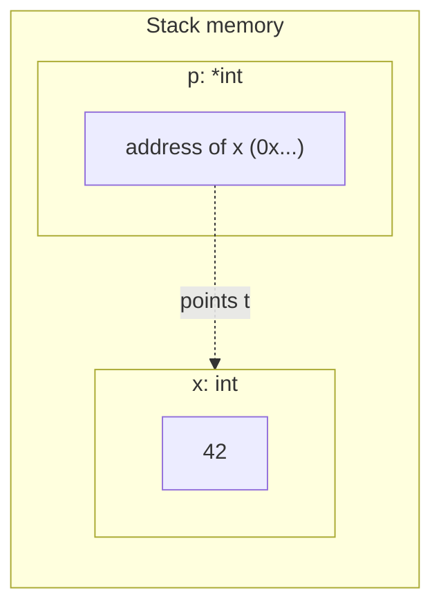
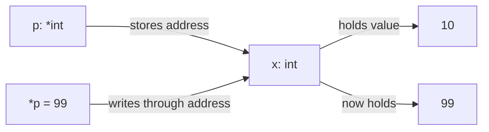
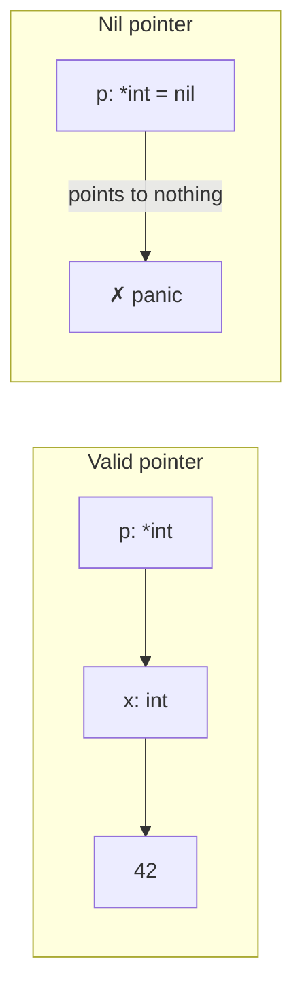
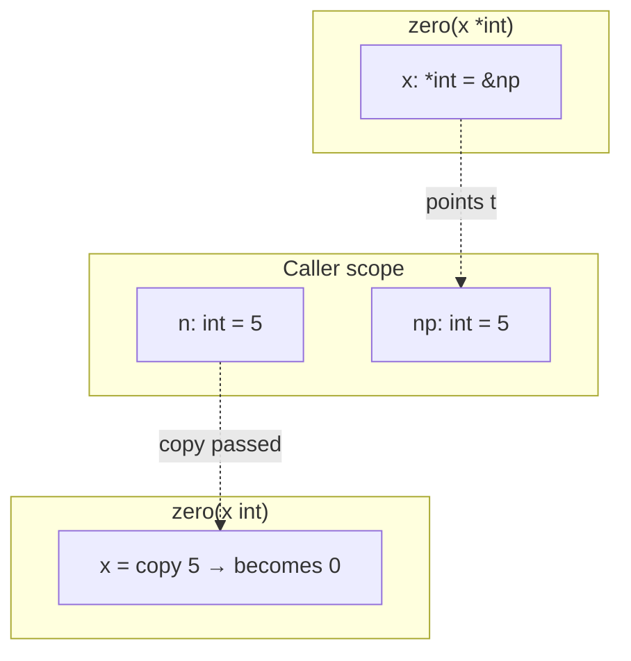
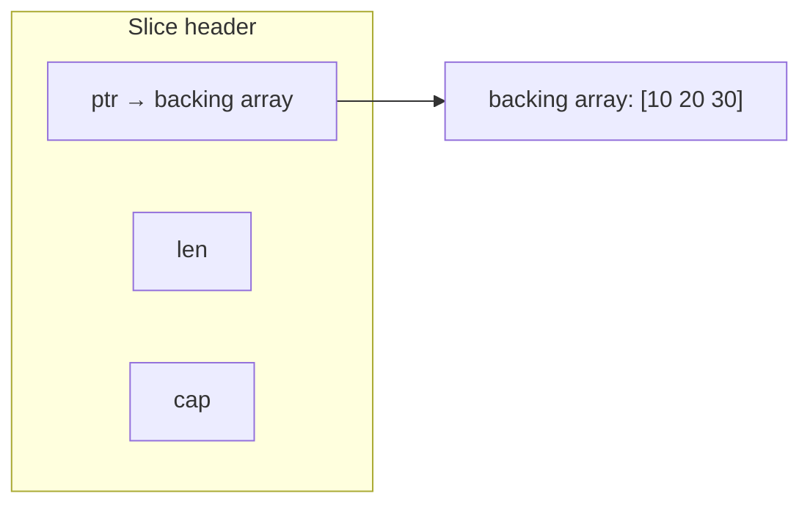
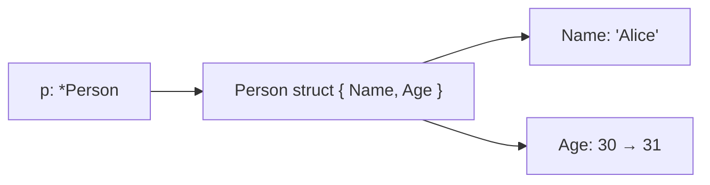
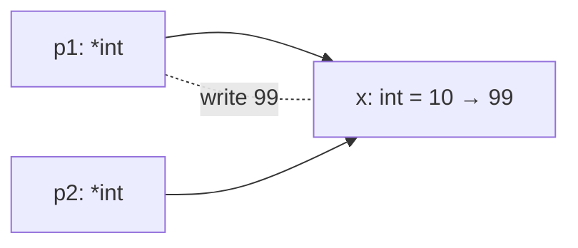
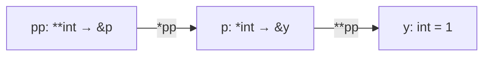
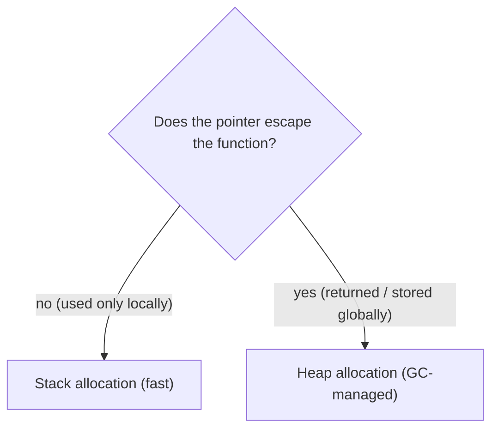
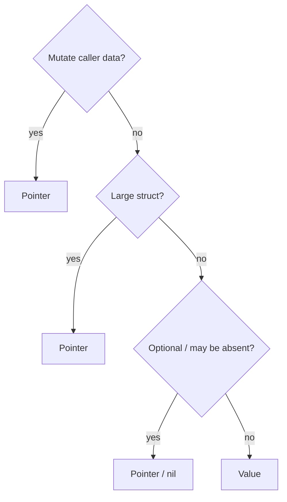

# Pointers

Pointers give you direct access to memory, allowing functions to modify caller data and avoid copying large structures. Go borrows pointers from C but removes the dangerous parts — no pointer arithmetic, no manual memory management.

---

## What Is a Pointer?

A **pointer** is a variable that stores the **memory address** of another variable. It does not hold the value itself — it holds *where* the value lives.

> 🔑 **Key idea:** A pointer is an address, not a value. `&x` gives the address; `*p` reads or writes through it.

```go
var x int = 42
var p *int = &x   // p = the address of x
```

- `x` is an `int` holding the value `42`
- `p` is a `*int` (pointer-to-int) holding the address where `42` is stored

### Memory Layout



> `p` is itself a variable that occupies memory; its value is the address of `x`.

---

## The `&` and `*` Operators

### `&` — Address-Of

The `&` operator returns the memory address of a variable:

```go
x := 42
p := &x
fmt.Println(p)   // something like 0xc0000b2008
fmt.Printf("address: %p\n", &x)
```

### `*` — Dereference

The `*` operator retrieves (or writes) the value at the address:

```go
fmt.Println(*p)   // 42 — read the value at address p
*p = 100          // write 99 into the location p points to
fmt.Println(x)    // 100 — x changed
```

### Reading and Writing Through a Pointer



### Quick Reference

| Code | Meaning |
|------|---------|
| `&x` | address of variable `x` (type `*int`) |
| `p` | the pointer (an address) |
| `*p` | the value at that address |
| `p.Field` | auto-deref field access (when `p` is `*struct`) |
| `(*p).Field` | explicit deref field access |

---

## Nil Pointers

The zero value of any pointer is **`nil`** — it points to nothing:

> ⚠️ **Watch out:** Dereferencing a nil pointer panics at runtime. When a pointer may be unset, guard it with `if p != nil` first.

```go
var p *int          // p == nil
fmt.Println(p)      // <nil>
// fmt.Println(*p)  // PANIC: nil pointer dereference
```

### Valid vs Nil Pointer



Always check `p != nil` before dereferencing when a pointer may be unset:

```go
func greet(name *string) {
    if name == nil {
        fmt.Println("Hello, stranger")
        return
    }
    fmt.Println("Hello,", *name)
}
```

---

## Creating Pointers

### Pattern 1: Declare and take address

```go
x := 0
p := &x
```

### Pattern 2: `&` with struct literal (idiomatic)

```go
p := &Person{Name: "Alice", Age: 30}
```

### Pattern 3: `new()` — allocate zero value, return pointer

```go
p := new(int)       // *int pointing to 0
*p = 7
```

`new(T)` is equivalent to `&zeroed`:

```go
var t T
p := &t             // same as new(T)
```

> In practice, `&T{...}` is far more common and readable than `new(T)`.

---

## Passing Data: Value vs Pointer

Go is **always pass-by-value**, but some types are **reference-like**.

> 🧠 **Memory aid:** Every argument is copied in Go — but for slices, maps, and channels, what's copied is the small header that points at the real data.

### By Value (Copy)

```go
func zero(x int) { x = 0 }

func main() {
    v := 10
    zero(v)
    fmt.Println(v)   // 10 — unchanged, only the copy was modified
}
```

### By Pointer (Shared Location)

```go
func zero(x *int) { *x = 0 }

func main() {
    v := 10
    zero(&v)
    fmt.Println(v)   // 0 — modified via pointer
}
```

### Value Copy vs Pointer Share



### Reference-Like Types

Go is pass-by-value, but slices, maps, and channels are implemented as small headers that contain pointers to backing data:



| Type | Behavior |
|------|----------|
| `int`, `string`, array, struct | Passed by value (copied, no sharing) |
| slice, map, channel | Headers/references share backing data |
| pointer | Address shared — writes visible to caller |
| interface | Two-word value (type + data pointer) |

When you pass a slice to a function, the **header** is copied but still points to the **same** backing array. A function can modify *elements* but not *grow* the caller's slice (unless you pass `*[]int`).

---

## Pointers to Structs

Go auto-dereferences: `p.Field` and `(*p).Field` are equivalent:

```go
type Person struct { Name string; Age int }

func birthday(p *Person) {
    p.Age++          // Go inserts (*p).Age++
}
```

### Pointer to a Struct in Memory



---

## Pointer Aliasing

**Aliasing** — two or more pointers refer to the same memory location:

> ⚠️ **Gotcha:** Aliased pointers see every mutation. That's handy for sharing — and a source of subtle bugs once goroutines are involved.

```go
x := 10
p1 := &x
p2 := &x
*p1 = 99
fmt.Println(*p2)   // 99 — p2 sees it through the same address
```



> Aliasing is powerful (shared state) but is the source of subtle bugs. This is why atomic/mutex synchronization is needed when multiple goroutines share data through pointers.

---

## Pointer to Pointer (Double Indirection)

```go
y := 1
p := &y       // *int  → address of y
pp := &p      // **int → address of p

fmt.Println(pp)    // address of p
fmt.Println(*pp)   // address of y
fmt.Println(**pp)  // 1
```



---

## Escape Analysis: Stack vs Heap

Go decides at **compile time** whether a value lives on the **stack** or the **heap**:

- **Stack**: Fast allocation (stack pointer movement). Reclaimed on function return.
- **Heap**: GC-managed. Necessary when a pointer escapes the function.

```go
func f() *int {
    x := 10
    return &x       // x escapes → heap (safe; GC tracks it)
}
```



Inspect with:

```sh
go build -gcflags="-m" .
# output: "x escapes to heap" or "x does not escape"
```

Returning a pointer to a local is **safe** — escape analysis moves it to the heap and the GC keeps it alive. But if you don't need sharing, return a value to avoid unnecessary heap allocation.

> 💡 **Pro tip:** Let the compiler choose: return values unless you truly need sharing. Check escape behavior with `go build -gcflags=-m`.

---

## The `new` Function

```go
p := new(int)       // *int to a zeroed int (0)
*p = 7

s := &Person{Name: "Alice"}   // more idiomatic
arr := new([3]int)             // pointer to a zeroed array
```

`new(T)` allocates a zeroed `T` and returns `*T`. Rarely used in practice — `&T{}` is preferred for clarity.

---

## Pointer Comparison

Pointers support `==`/`!=`. Equal if same address or both nil:

```go
x, y := 1, 1
fmt.Println(&x == &x)   // true (same address)
fmt.Println(&x == &y)   // false (different addresses, same value)
```

---

## No Pointer Arithmetic

Go does **not** support pointer arithmetic (unlike C):

```go
p := &x
// p++        // ERROR: not allowed
// p + 1      // ERROR: not allowed
```

This eliminates buffer overflows, simplifies GC, and makes escape analysis reliable. Use `unsafe.Pointer` only when absolutely necessary.

### Why No Arithmetic?

1. **Safety** — removes the largest category of C/C++ security vulnerabilities
2. **Simplicity** — easier to learn, reason about, and analyze
3. **Garbage collection** — arbitrary integer-to-pointer casts would break GC
4. **Escape analysis** — relies on predictable pointer flow

---

## When to Use Pointers vs Values

| Situation | Prefer |
|-----------|--------|
| Need to mutate the caller's data | pointer |
| Large struct to avoid copying | pointer |
| Represent "absent"/optional | pointer (nil) |
| Small immutable value | value |
| Zero value is meaningful | value |
| Store in a map as a flag | `struct{}` (no pointer) |
| Small read-only helper | value |



### Optional Fields with Pointers

```go
type Settings struct {
    Timeout *int   // nil means "not configured"
}

func applyDefaults(s *Settings) {
    if s.Timeout == nil {
        defaultTimeout := 30
        s.Timeout = &defaultTimeout
    }
}
```

A plain `int` cannot distinguish between "set to 0" and "not set."

> 💡 **Note:** A nil pointer is the idiomatic way to express "absent" or "not configured" — a bare `int` can't tell `0` from unset.

---

## Complete Example: Account with Pointers

```go
type Account struct {
    holder  string
    balance float64
}

func (a *Account) Deposit(amount float64) {
    a.balance += amount
}

func (a *Account) Withdraw(amount float64) bool {
    if a.balance >= amount {
        a.balance -= amount
        return true
    }
    return false
}

func main() {
    x := 5
    p := &x
    *p = 20
    fmt.Println(x)   // 20

    acct := &Account{holder: "Alice"}
    acct.Deposit(100)
    acct.Deposit(50)
    fmt.Printf("Balance: %.2f\n", acct.balance)     // 150.00
    fmt.Println("Withdraw 30?", acct.Withdraw(30))   // true
    fmt.Printf("Balance: %.2f\n", acct.balance)     // 120.00
}
```

---

## Comparison with Other Languages

| Feature | C | Go | Python/Java |
|---|---|---|---|
| Has pointers | Yes | Yes | No |
| Pointer arithmetic | Yes | No | No |
| Manual memory mgmt | Yes (malloc/free) | No (GC) | No (GC) |
| Nil/null pointer risk | Yes | Yes | N/A |

Go occupies the middle ground: pointers for what matters, safety for what causes bugs.

---

## Performance Notes

| Operation | Cost |
|-----------|------|
| Stack allocation | ~0.3 ns (stack pointer move) |
| Heap allocation | ~30–100 ns (GC-tracked) |
| Pointer dereference | ~1 ns (L1 cache hit) |
| Passing large struct by value | O(fields) copy cost |
| Passing pointer to large struct | ~1 ns (8-byte copy) |
| Escape to heap (returning &local) | +GC pressure per live object |
| `go build -gcflags="-m"` | Free — compiler reports escape decisions |

---

## Modern Practices

- Prefer value receivers for small, immutable structs to keep code simple
- Use pointer receivers when the method needs to modify the receiver or the struct is large
- Use `&` with struct literals `&Person{}` instead of `new` for clarity
- Let the compiler's escape analysis decide stack vs heap allocation
- Always check for `nil` before dereferencing a pointer that may be unset
- Rely on Go 1.22+ loop variable semantics to safely capture `&i` in goroutine closures
- Understand escape analysis — use `go build -gcflags=-m` to verify

## Common Mistakes

- Dereferencing a nil pointer without a guard check → runtime panic
- Copying a struct that contains a `sync.Mutex` — always pass by pointer
- Accidental aliasing: two pointers to the same data where mutation through one affects readers of the other
- Returning a pointer to a local when a value suffices — adds unnecessary GC pressure
- Storing pointers in maps when the values are small — wastes heap allocations
- Copying a struct containing a slice/map — shares the backing array unexpectedly
- Taking the address of a loop variable (pre-Go 1.22 bug)
- Overusing pointers when values would suffice — adds complexity without benefit

## Key Takeaways

1. `&` gets an address; `*` dereferences a pointer.
2. Pointer zero value is `nil`; dereferencing nil panics.
3. Use pointers to modify caller data and avoid copying large structs.
4. Go is always **pass-by-value**, but slices/maps/channels/pointers are **reference-like**.
5. **Escape analysis** determines stack vs heap allocation — it's transparent and safe.
6. Go does **not** support pointer arithmetic (safety).
7. **Aliasing** is powerful but needs synchronization when concurrent.
8. Prefer values for small, immutable data; pointers only when you need mutation or must avoid copying.

## Next

Continue to [03-interfaces.md](03-interfaces.md).
