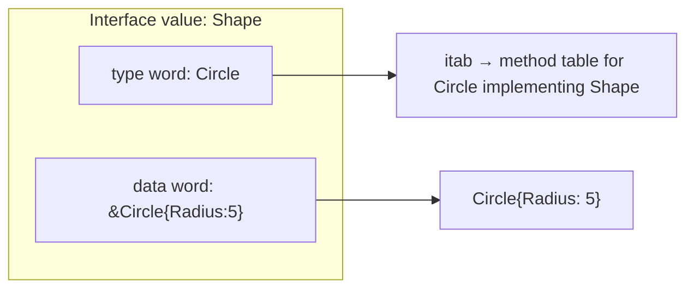

# Interfaces

Interfaces are Go's mechanism for **polymorphism**. They define a set of method signatures but do not implement them. A type **satisfies** an interface if it has all the required methods — implicitly, with no `implements` keyword.

> 🔑 **Key idea:** Interfaces say *what* a type can do, not *how*. Satisfaction is implicit — having the methods is enough, no `implements` clause.

---

## Interface Declaration

```go
type Shape interface {
    Area() float64
    Perimeter() float64
}
```

Any type that has both `Area() float64` and `Perimeter() float64` automatically satisfies `Shape`.

---

## Implicit Interface Satisfaction

Unlike languages with `implements`, Go implements interfaces **implicitly**:

```go
type Circle struct {
    Radius float64
}

func (c Circle) Area() float64 {
    return math.Pi * c.Radius * c.Radius
}

func (c Circle) Perimeter() float64 {
    return 2 * math.Pi * c.Radius
}
```

`Circle` now implements `Shape` — without ever declaring it.

```go
func printShapeInfo(s Shape) {
    fmt.Printf("Area: %.2f, Perimeter: %.2f\n", s.Area(), s.Perimeter())
}

func main() {
    c := Circle{Radius: 5}
    printShapeInfo(c)   // works: Circle implements Shape

    shapes := []Shape{Circle{Radius: 3}, Rectangle{3, 4}}
    for _, s := range shapes {
        printShapeInfo(s)
    }
}
```

**Why implicit interfaces?** They decouple the definition of an interface from its implementation:

- Testing with mocks without coupling test code to implementation
- Third-party types implementing your interfaces
- Evolving code without changing type declarations

> **Duck typing in Go**: "If it walks like a duck and quacks like a duck, it's a duck." A type is whatever interface provides the methods it has.

---

## Interface Values

An interface value holds two pieces of data:

1. The **dynamic type** — the actual type of the stored value
2. The **dynamic value** — the actual value

> 🧠 **Think of it as:** An interface value is a labeled box — the type word is the label, the data word is the content.

```go
var s Shape              // nil interface (no type, no value)
s = Rectangle{4, 5}      // s now holds a Rectangle
fmt.Println(s.Area())    // 20
```

### The Two-Word Layout

Under the hood, an interface value is a two-word structure:

```
interface value
┌────────────┬────────────┐
│  type word │  data word │
└────────────┴────────────┘
```

- **Type word**: references runtime type information (an `itab`/type descriptor)
- **Data word**: points to the actual stored value

This architecture explains several behaviors:

1. **Boxing**: storing a value type into `any` copies it into an allocated box
   ```go
   var v any = 42   // the int is boxed into the interface
   ```

2. **Typed nil**: an interface holding a nil pointer is NOT a nil interface

3. **Comparison**: two interface values compare equal only if both their type words and data words are equal (for comparable stored types)



### Interface as Function Parameters (Dependency Inversion)

Accept interfaces, return structs. This is a core Go idiom:

```go
func SaveData(w io.Writer, data []byte) error {
    _, err := w.Write(data)
    return err
}

func main() {
    var buf bytes.Buffer
    SaveData(&buf, []byte("hello"))
    // Works with any io.Writer — files, buffers, HTTP responses
}
```

---

## Type Assertion

A **type assertion** extracts the dynamic type out of an interface value.

### Comma-Ok Form (safe, recommended)

```go
var s Shape = Rectangle{4, 5}

r, ok := s.(Rectangle)
if ok {
    fmt.Println(r.Width)   // 4
}
```

### Without Comma-Ok (panics on failure)

> ⚠️ **Watch out:** A bare assertion `s.(Rectangle)` panics if the dynamic type doesn't match. Always use the comma-ok form when failure is possible.

```go
r := s.(Rectangle)   // panics if s is not a Rectangle
```

```go
func describe(v any) {
    if n, ok := v.(int); ok {
        fmt.Printf("int: %d\n", n)
        return
    }
    if str, ok := v.(string); ok {
        fmt.Printf("string: %s\n", str)
        return
    }
    fmt.Println("unknown type", v)
}
```

---

## Type Switch

A **type switch** dispatches on the dynamic type of an interface value:

```go
func classify(v any) string {
    switch t := v.(type) {
    case int:
        return fmt.Sprintf("int %d", t)
    case string:
        return fmt.Sprintf("string %q", t)
    case bool:
        return fmt.Sprintf("bool %v", t)
    case Rectangle:
        return fmt.Sprintf("rectangle %f", t.Area())
    default:
        return fmt.Sprintf("unknown %T", t)
    }
}

func main() {
    fmt.Println(classify(42))                    // int 42
    fmt.Println(classify("hello"))               // string "hello"
    fmt.Println(classify(Rectangle{2, 3}))       // rectangle 6.000000
}
```

---

## The Empty Interface (`any`)

The empty interface has **no methods**, so **every** type satisfies it:

> ⚠️ **Gotcha:** `any` accepts everything — which means the compiler can no longer check anything. Reach for it only when you truly accept unknown types.

```go
var anything any    // same as interface{} (Go 1.18+)
anything = 42
anything = "hello"
anything = Rectangle{4, 5}

func PrintAnything(v any) {
    fmt.Println(v)
}
```

### When to use `any`

- When you truly need to accept any type (like `fmt.Println`)
- For type-switch dispatch
- When the alternative is writing dozens of overloaded functions

### When NOT to use `any`

- When you know the types you need — use specific interfaces instead
- When you'd immediately type-assert — you probably want a specific interface
- When it obscures what a function actually accepts

```go
// Bad
func process(i any) { ... }

// Good
func process(r io.Reader) { ... }
```

> Use `any` sparingly — it defeats type safety. Prefer concrete types or well-defined interfaces.

---

## Multiple Interfaces

A type can satisfy many interfaces:

```go
type Stringer interface {
    String() string
}

func (r Rectangle) String() string {
    return fmt.Sprintf("Rectangle(%g x %g)", r.Width, r.Height)
}

// Rectangle now satisfies both Shape and Stringer
```

---

## Interface Embedding

Interfaces can embed other interfaces, combining their method sets:

```go
type ReadCloser interface {
    Reader
    Closer
}
```

This is exactly how the standard library composes `io.ReadCloser`, `io.ReadWriter`, etc.

---

## The Nil Interface Trap

### True nil interface

```go
var i any
fmt.Println(i == nil)   // true
```

### Typed nil inside an interface (the trap)

```go
func returnsNil() *Rectangle {
    return nil
}

var s Shape = returnsNil()
fmt.Println(s == nil)   // false — important gotcha!
```

Why? The interface stores the **type** (`*Rectangle`) even though the value is `nil`. An interface is `nil` only when both its type and value are `nil`.

> ⚠️ **Watch out:** The typed-nil trap: wrapping a nil pointer in an interface makes `if x == nil` fail — the interface now has a type, even though the value is nil.

```mermaid
flowchart LR
    subgraph NilInterface["Nil interface"]
        NI["type=nil, data=nil"]
    end
    subgraph TypedNil["Typed nil in interface"]
        TN["type=*Rectangle, data=nil ptr"]
    end
    NI ==>"truly nil" --> C1["i == nil → true"]
    TN ==>"NOT nil" --> C2["s == nil → false"]
```

### The Bug in Practice

```go
type Fetcher interface { Fetch() error }
type MyFetcher struct{}
func (m *MyFetcher) Fetch() error { return nil }

func getFetcher(debug bool) Fetcher {
    var f *MyFetcher          // nil pointer
    if debug { f = &MyFetcher{} }
    return f                   // non-nil interface holding nil ptr!
}

f := getFetcher(false)
if f == nil {                 // FALSE — never reached
    // ...
}
// f.Fetch() would panic on a nil-implementing type
```

**Fix:** Return a plain `nil` interface:

```go
func getFetcher(debug bool) Fetcher {
    if !debug {
        return nil          // clean nil interface
    }
    return &MyFetcher{}
}
```

### Same Trap in Error Returns

```go
func doSomething() error {
    var err *MyError = nil
    return err   // returns a non-nil error interface!
}

func main() {
    err := doSomething()
    if err != nil {
        fmt.Println("Error:", err)   // prints: Error: <nil>
    }
}
```

**Rule:** Always return `nil` directly, never through a typed variable of the concrete type.

---

## Standard Library Interfaces

| Interface | Method | Purpose |
|-----------|--------|---------|
| `error` | `Error() string` | Error values |
| `fmt.Stringer` | `String() string` | Default string representation |
| `io.Reader` | `Read([]byte) (int, error)` | Read streams |
| `io.Writer` | `Write([]byte) (int, error)` | Write streams |
| `io.Closer` | `Close() error` | Close resources |
| `sort.Interface` | `Len()`, `Less(i,j)`, `Swap(i,j)` | Sorting |
| `http.Handler` | `ServeHTTP(ResponseWriter, *Request)` | HTTP handlers |

### `fmt.Stringer`

```go
type Point struct{ X, Y int }

func (p Point) String() string {
    return fmt.Sprintf("(%d,%d)", p.X, p.Y)
}

func main() {
    p := Point{3, 4}
    fmt.Println(p)   // (3,4) — uses String()
}
```

---

## Method Set and Interface Satisfaction

This is where method sets, receiver types, and interfaces intersect:

| Type | Value-receiver methods | Pointer-receiver methods |
|------|------------------------|--------------------------|
| `T` | yes | no |
| `*T` | yes | yes |

```go
type Incrementer interface {
    Increment()
}

type Counter struct { n int }

func (c *Counter) Increment() { c.n++ }

func main() {
    var inc Incrementer

    c := Counter{}
    // inc = c     // compile error: Counter does not implement Incrementer

    inc = &c       // OK — *Counter has the method
    inc.Increment()
    fmt.Println(c.n)   // 1
}
```

> When you store a value in an interface variable, you copy that value. The copy is not addressable. A pointer-receiver method cannot be called on it.

### The Rule

If all methods use value receivers, both `T` and `*T` satisfy any interface that type implements. If any method uses a pointer receiver, only `*T` satisfies the interface.

### Interface Satisfaction with Embedded Types

When a struct embeds another type, the embedded methods may not be in the outer type's method set if the embedded value's methods use pointer receivers. Test with compile-time asserts:

```go
var _ Shape = Rect{}       // compile-time guarantee Rect satisfies Shape
var _ Shape = (*Rect)(nil)
```

---

## Dependency Injection with Interfaces

```go
type Logger struct {
    writer io.Writer
}

func NewLogger(w io.Writer) *Logger {
    return &Logger{writer: w}
}

func (l *Logger) Info(msg string) {
    fmt.Fprintf(l.writer, "[INFO] %s\n", msg)
}

func main() {
    logger := NewLogger(os.Stdout)
    logger.Info("server started")

    var buf strings.Builder
    logger = NewLogger(&buf)
    logger.Error("something went wrong")
    fmt.Println("Captured:", buf.String())
}
```

Because `Logger` accepts `io.Writer`, it works with files, connections, buffers, HTTP response writers — anything that implements `Write`.

---

## When to Define Interfaces

**At the consumer, not the provider:**

> 💡 **Pro tip:** Define interfaces where you consume them. Accept `io.Writer` where you need writes — don't make providers declare that they implement it.

```go
// In package "user" — defines what it needs
package user

type Finder interface {
    FindByID(id int64) (*User, error)
}

type Service struct {
    repo Finder
}

// In package "postgres" — provides the implementation
package postgres

type UserRepo struct { db *sql.DB }

func (r *UserRepo) FindByID(id int64) (*user.User, error) { ... }
```

The `user` package defines `Finder` because it's the consumer. The `postgres` package satisfies it without knowing the interface exists.

---

## Interface Comparison Gotcha

Comparing interface values with `==` when the underlying type is not comparable:

```go
var a, b Shape = Circle{5}, Circle{5}
// fmt.Println(a == b)   // panic if Circle contains a slice or map
```

---

## Performance Notes

| Operation | Cost |
|-----------|------|
| Interface method call (direct dispatch) | ~2 ns overhead (itab indirection) |
| Boxing a value type into `interface{}` | ~30 ns + heap allocation |
| Type assertion (comma-ok) | ~1 ns |
| Type switch (N cases) | O(N) linear scan |
| Interface equality check | O(1) type+data word compare |

Interface dispatch involves an extra indirection through the `itab` (interface table). In hot loops, prefer concrete types. The compiler can devirtualize when the concrete type is known.

---

## Modern Practices

- Use `any` instead of `interface{}` — standard alias since Go 1.18
- Define interfaces at the consumer side, not the producer side
- Embed interfaces to compose larger ones from small, focused pieces
- Prefer one- or two-method interfaces (model after `io.Reader`)
- Use compile-time checks (`var _ Interface = &MyType{}`) to catch method-set issues
- Let implicit satisfaction work — avoid `implements`-style boilerplate
- Return concrete types from constructors; reserve interface returns for genuinely polymorphic cases
- Use type switches and `errors.As` for safe, readable dispatch

## Common Mistakes

- Defining huge "kitchen-sink" interfaces that are hard to implement
- Returning interface types from functions — leaks abstraction
- Mixing pointer and value receivers causing a type to silently fail an interface
- Ignoring the typed-nil-in-interface trap
- Over-generalizing early — introducing interfaces before you have a second implementation
- Comparing errors with `==` instead of `errors.Is`
- Defining interfaces far from their use site, creating unnecessary coupling

## Key Takeaways

1. Interfaces define a **method contract**; implementation is **implicit**.
2. Types satisfy interfaces automatically — duck typing.
3. `any` matches every type; use sparingly.
4. **Type assertion** (`x.(T)`) extracts the concrete type; always use comma-ok.
5. **Type switch** (`switch v := x.(type)`) dispatches per dynamic type.
6. Interfaces compose by embedding.
7. Value vs pointer receivers determine which types satisfy the interface.
8. **Typed nil** inside an interface is NOT nil — a common source of bugs.
9. Prefer small interfaces; accept interfaces, return concretes.
10. Define interfaces where they are consumed, not where they are implemented.

## Next

Continue to [04-generics.md](04-generics.md).
