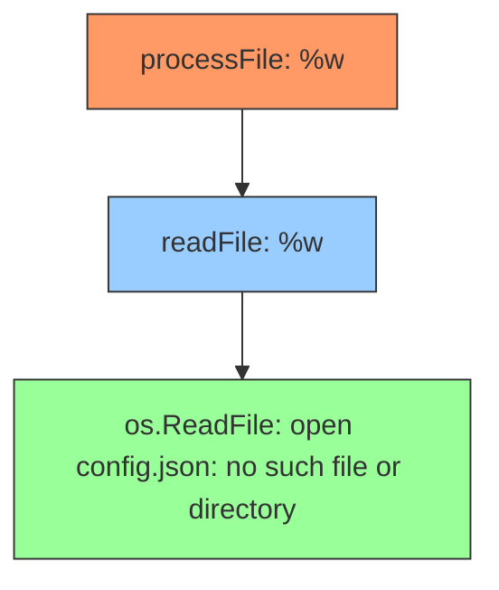
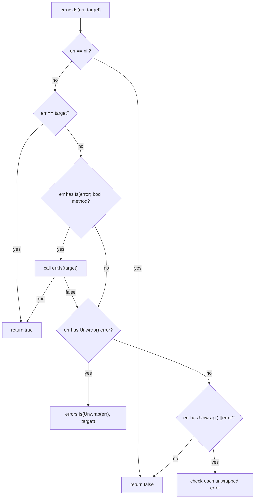

# Error Handling

Go **does not use exceptions** for normal control flow. Functions that can fail return an **error value** as their last return value. The caller must check and handle it explicitly. This makes error handling **visible** and **composable** — you always see where errors can occur.

> 🔑 **Key idea:** Errors are values. There's no magic `try/catch` — a failing function returns a value the caller must handle explicitly.

---

## The Go Error Philosophy

The Go proverb **"Errors are values"** means an error is ordinary data that flows through the program like any other value. There is no hidden exception machinery — no unwinding, no implicit propagation, no `catch`.

> 🧠 **Think of it as:** An error is just a return value — like `nil`/non-`nil`, it flows through your code instead of unwinding the call stack.

Consequences:

- **Explicit control flow**: you see every point where a function can fail
- **Composable**: errors can be wrapped, collected, passed, and transformed like any value
- **No "implicitly safe" code**: the burden is on you to respond to errors

### The `error` Interface

```go
type error interface {
    Error() string
}
```

Any type with an `Error() string` method satisfies it. Because it's an interface, an error value carries a **concrete type** and a **value** — this is why `errors.As` can recover typed errors.

### The Convention

- `nil` means success
- non-`nil` means failure
- Always return the zero value of the result type on error

```go
func divide(a, b float64) (float64, error) {
    if b == 0 {
        return 0, errors.New("cannot divide by zero")
    }
    return a / b, nil
}
```

---

## Creating Errors

### `errors.New` — Simple Error

```go
err := errors.New("file not found")
fmt.Println(err)           // file not found
fmt.Println(err.Error())   // file not found
```

Use it for static messages. It allocates once, so the same error value is returned every time — ideal for sentinel errors.

> 💡 **Note:** `errors.New` allocates a fresh identity on first use. For stable, comparable errors, define package-level sentinels once.

### `fmt.Errorf` — Formatted Error

```go
err := fmt.Errorf("user %d not found", 42)
```

### Custom Error Types — Structured Data

```go
type ValidationError struct {
    Field   string
    Message string
}

func (e *ValidationError) Error() string {
    return fmt.Sprintf("invalid %s: %s", e.Field, e.Message)
}
```

---

## Sentinel Errors

A **sentinel error** is a named package-level error value callers compare with `errors.Is`:

```go
var (
    ErrNotFound     = errors.New("not found")
    ErrUnauthorized = errors.New("unauthorized")
    ErrDBDown       = errors.New("database is down")
)

func GetUser(id int) (*User, error) {
    if id < 0 {
        return nil, ErrNotFound
    }
    return &User{ID: id}, nil
}

func main() {
    _, err := GetUser(-5)
    if errors.Is(err, ErrNotFound) {
        fmt.Println("User not found")
    }
}
```

> Naming convention: sentinel errors start with `Err` (e.g., `io.EOF`, `os.ErrNotExist`, `sql.ErrNoRows`).

### When to Use Sentinel Errors

When a fixed set of outcomes is expected, callers need to branch on specific conditions, and no additional structured data is needed.

---

## Error Wrapping (`%w`)

Use `%w` with `fmt.Errorf` to **wrap** an error, adding context while preserving the original:

> 💡 **Pro tip:** Wrap with `%w`, not `%v` — only `%w` keeps the chain intact so `errors.Is`/`errors.As` can find the original error underneath.

```go
func readFile(path string) ([]byte, error) {
    data, err := os.ReadFile(path)
    if err != nil {
        return nil, fmt.Errorf("reading file %s: %w", path, err)
    }
    return data, nil
}

func processFile(path string) error {
    data, err := readFile(path)
    if err != nil {
        return fmt.Errorf("processing file: %w", err)
    }
    // ...
    return nil
}
```

The final error chain:

```
processing file: reading file config.json: open config.json: no such file or directory
```

But `errors.Is(err, os.ErrNotExist)` still returns `true` because `%w` preserves the chain.

### What `%w` Enables

- `errors.Is(err, sentinel)` — walks the chain looking for a match
- `errors.As(err, &target)` — walks the chain looking for a type match
- `errors.Unwrap(err)` — returns the next error in the chain

### When NOT to Wrap

- When you don't want to expose the original error (security concerns)
- When translating an internal error to a domain error for external clients — use `fmt.Errorf("...: %v", err)` or a custom type that omits the cause

### Error Wrap Chain Diagram



`errors.Is`/`errors.As` walk from outermost to innermost.

---

## `errors.Is` — Unwrap and Compare

`errors.Is(err, target)` returns `true` if `err` (or any error wrapped inside it) matches the `target`:

```go
var ErrDatabase = errors.New("database connection failed")

dbErr := fmt.Errorf("query: %w", ErrDatabase)
wrapped := fmt.Errorf("main: %w", dbErr)

fmt.Println(errors.Is(wrapped, ErrDatabase))                                    // true
fmt.Println(errors.Is(wrapped, errors.New("database connection failed")))        // false (different identity)
```

> `errors.Is` compares by **value/identity** — good for sentinel errors. Never create new `errors.New` instances for comparison.

### How `errors.Is` Works



---

## `errors.As` — Unwrap and Type Match

`errors.As(err, &target)` looks for an error in the chain that matches a **type** and assigns it to the target pointer:

```go
if err != nil {
    var pathError *os.PathError
    if errors.As(err, &pathError) {
        fmt.Println("Path error:", pathError.Path)
    }
}
```

### Custom Typed Error

```go
type TimeoutError struct{ Seconds int }

func (e *TimeoutError) Error() string {
    return fmt.Sprintf("operation timed out after %d seconds", e.Seconds)
}

func fetch() error {
    return &TimeoutError{Seconds: 30}
}

func main() {
    err := fetch()
    var timeout *TimeoutError
    if errors.As(err, &timeout) {
        fmt.Printf("Retry: timed out %d s\n", timeout.Seconds)   // 30
    }
}
```

### `errors.Is` vs `errors.As`

> 🔑 **Remember:** `errors.Is` matches by identity (sentinel); `errors.As` matches by type and hands you the structured error. Use `%w` everywhere so both can reach the root cause.

| Function | Use For | How It Matches |
|----------|---------|----------------|
| `errors.Is` | Sentinel errors | Value/identity comparison |
| `errors.As` | Typed errors | Type match, extracts concrete error |

```go
// Sentinel check
if errors.Is(err, ErrNotFound) { ... }

// Typed check with data extraction
var httpErr *HTTPError
if errors.As(err, &httpErr) {
    fmt.Printf("HTTP %d: %s\n", httpErr.StatusCode, httpErr.Message)
}
```

---

## `errors.Unwrap`

`errors.Unwrap(err)` returns the underlying error if `err` has an `Unwrap()` method; otherwise `nil`. Usually you use `errors.Is`/`errors.As` instead — they walk the entire chain automatically.

---

## `errors.Join` (Go 1.20+)

Combines multiple errors into one:

```go
errA := errors.New("error A")
errB := errors.New("error B")
joined := errors.Join(errA, errB)

fmt.Println(errors.Is(joined, errA))   // true
fmt.Println(errors.Is(joined, errB))   // true
```

`errors.Join` returns an error whose `Error()` joins the messages and whose `Unwrap() []error` returns all of them. `errors.Is`/`As` check each.

> 💡 **Note:** Use `errors.Join` to collect every validation failure instead of bailing on the first — callers see all problems at once.

### Validation Pattern

```go
func validate(data map[string]interface{}) error {
    var errs []error
    if _, ok := data["name"]; !ok {
        errs = append(errs, errors.New("missing name"))
    }
    if _, ok := data["email"]; !ok {
        errs = append(errs, errors.New("missing email"))
    }
    if len(errs) > 0 {
        return errors.Join(errs...)
    }
    return nil
}
```

---

## Custom Error Types

### Simple Custom Error

```go
type ValidationError struct {
    Field   string
    Message string
}

func (e *ValidationError) Error() string {
    return fmt.Sprintf("validation: field %s — %s", e.Field, e.Message)
}
```

### Custom Error with Unwrap (Participate in Chain)

```go
type DatabaseError struct {
    Operation string
    Table     string
    Err       error
}

func (e *DatabaseError) Error() string {
    return fmt.Sprintf("database %s on %s: %v", e.Operation, e.Table, e.Err)
}

func (e *DatabaseError) Unwrap() error {
    return e.Err
}
```

Now `errors.Is(err, sql.ErrNoRows)` works through `DatabaseError`, and `errors.As(err, &dbErr)` extracts the structured data.

### Custom Error with `Is` Method

```go
type HTTPError struct {
    StatusCode int
    Message    string
    Err        error
}

func (e *HTTPError) Error() string {
    return fmt.Sprintf("HTTP %d: %s", e.StatusCode, e.Message)
}

func (e *HTTPError) Unwrap() error { return e.Err }

func (e *HTTPError) Is(target error) bool {
    t, ok := target.(*HTTPError)
    if !ok { return false }
    return e.StatusCode == t.StatusCode
}
```

Now `errors.Is(err, &HTTPError{StatusCode: 404})` matches any `HTTPError` with status 404, regardless of other fields.

### Error Type with Helper Methods

```go
type RetryableError struct {
    Operation string
    Attempts  int
}

func (e *RetryableError) Error() string {
    return fmt.Sprintf("%s failed after %d attempts", e.Operation, e.Attempts)
}

func (e *RetryableError) RetryAfter() time.Duration {
    return time.Duration(e.Attempts) * 100 * time.Millisecond
}
```

---

## The Nil Error vs Error with Nil Value Gotcha

One of the most subtle bugs in Go:

> ⚠️ **Watch out:** A `var err *MyError = nil` returned through an `error` interface becomes a non-nil error. Always return bare `nil`, never a typed nil variable.

```go
type MyError struct {
    Code    int
    Message string
}

func (e *MyError) Error() string {
    return fmt.Sprintf("error %d: %s", e.Code, e.Message)
}

func doSomething() error {
    var err *MyError = nil
    return err   // returns an error interface with a non-nil concrete value!
}

func main() {
    err := doSomething()
    if err != nil {
        fmt.Println("This WILL print")   // runs!
    }
}
```

The `error` interface holds a `*MyError` with a type (`*MyError`) and a value (`nil`). An interface is `nil` only when **both** its type and value are `nil`.

```mermaid
flowchart LR
    subgraph NilInterface["Nil interface"]
        NI["type=nil, data=nil"]
    end
    subgraph TypedNil["Typed nil in interface"]
        TN["type=*MyError, data=nil ptr"]
    end
    NI ==>"truly nil" --> C1["err == nil: true"]
    TN ==>"NOT nil" --> C2["err == nil: false"]
```

**Rule:** Always return `nil` directly, never through a typed variable.

```go
func doSomething() error {
    return nil   // always nil
}

// NOT:
func doSomething() error {
    var err *MyError = nil
    return err   // NOT nil as an error interface
}
```

---

## Error Taxonomy

Classify errors by predictability:

| Kind | Example | Handling |
|------|---------|----------|
| **Expected input** | bad data, file missing | Return `error`, handle gracefully |
| **Expected but typed** | not found, unauthorized, timeout | Return **typed** or **sentinel** error for branching |
| **Unexpected / programmer bug** | index out of range, nil deref | `panic` (let it crash in tests/dev) |

> If failure is a normal possibility → return an error. If something is truly broken → panic.

---

## The Standard Error Handling Pattern

```go
func processOrder(orderID string) error {
    order, err := db.GetOrder(orderID)
    if err != nil {
        return fmt.Errorf("getting order %s: %w", orderID, err)
    }
    if err := validateOrder(order); err != nil {
        return fmt.Errorf("validating order %s: %w", orderID, err)
    }
    if err := chargePayment(order); err != nil {
        return fmt.Errorf("charging payment for order %s: %w", orderID, err)
    }
    return nil
}
```

Go encourages early returns on error. Avoid nesting in `else` blocks.

> 🔑 **Key idea:** Check error first, return early. Flat code beats `else`-nested logic — the happy path stays readable.

### Logging Convention

**Log at the boundary once.** Don't log at every layer as an error bubbles up:

```go
// Inner: wrap, don't log
if err := repo.Find(id); err != nil {
    return fmt.Errorf("repo find %d: %w", id, err)
}

// Boundary: log once
if err := handleRequest(req); err != nil {
    log.Printf("handleRequest failed: %v", err)
    http.Error(w, "internal error", http.StatusInternalServerError)
}
```

Do not leak internal details to clients. For HTTP, return generic 500; log the real error server-side.

---

## Combining Both Patterns: Sentinel + Typed

```go
var ErrNotFound = errors.New("not found")

type NotFoundError struct {
    Resource string
    ID       interface{}
}

func (e *NotFoundError) Error() string {
    return fmt.Sprintf("%s with ID %v not found", e.Resource, e.ID)
}

func (e *NotFoundError) Is(target error) bool {
    return target == ErrNotFound
}
```

Now `errors.Is(err, ErrNotFound)` works for both sentinel and typed returns, and `errors.As(err, &nf)` extracts the structured data.

---

## Panic vs Error

| Use `error` when | Use `panic` when |
|-------------------|------------------|
| Expected, recoverable failure | Programmer error / invariant violation |
| Bad input, missing file, network timeout | Index out of range, nil dereference |
| Callers can handle it | Code is truly broken |

### Converting Panic to Error at API Boundary

```go
func Parse(input string) (out Struct, err error) {
    defer func() {
        if r := recover(); r != nil {
            err = fmt.Errorf("parse panic: %v", r)
        }
    }()
    return heavyParser(input), nil
}
```

---

## Standard Library Errors Worth Knowing

| Error | Meaning | Used with |
|-------|---------|-----------|
| `io.EOF` | end of input | readers |
| `io.ErrUnexpectedEOF` | premature EOF | readers |
| `os.ErrNotExist` | file missing | os.IsNotExist |
| `os.ErrPermission` | permission denied | os.IsPermission |
| `context.DeadlineExceeded` | deadline hit | context |
| `context.Canceled` | cancelled | context |
| `sql.ErrNoRows` | no result row | database/sql |

```go
if errors.Is(err, os.ErrNotExist) { ... }
if errors.Is(err, context.DeadlineExceeded) { ... }
```

---

## Complete Example

```go
package main

import (
    "errors"
    "fmt"
)

var ErrExists = errors.New("resource already exists")

type NotFoundError struct {
    Resource string
    ID       int
}

func (e *NotFoundError) Error() string {
    return fmt.Sprintf("%s with id %d not found", e.Resource, e.ID)
}

func find(id int) error {
    if id < 0 {
        return &NotFoundError{Resource: "user", ID: id}
    }
    return nil
}

func create(id int) error {
    if id < 0 {
        return fmt.Errorf("create %d: %w", id, ErrExists)
    }
    return nil
}

func main() {
    if err := find(-1); err != nil {
        var nf *NotFoundError
        if errors.As(err, &nf) {
            fmt.Printf("Recovered: %s (id %d)\n", nf.Resource, nf.ID)
        } else {
            fmt.Println("Other error:", err)
        }
    }

    if err := create(-2); err != nil {
        if errors.Is(err, ErrExists) {
            fmt.Println("Already exists — use a different id")
        } else {
            fmt.Println("Error:", err)
        }
    }
}
```

---

## Retry Pattern

```go
var ErrRetryable = errors.New("retryable")

func runWithRetry(ctx context.Context, fn func() error) error {
    var lastErr error
    for attempt := 0; attempt < 3; attempt++ {
        if err := fn(); err == nil {
            return nil
        } else {
            lastErr = err
        }
        select {
        case <-time.After(time.Duration(attempt+1) * 100 * time.Millisecond):
        case <-ctx.Err():
            return ctx.Err()
        }
    }
    return lastErr
}
```

---

## Performance Notes

| Operation | Cost |
|-----------|------|
| `errors.New("...")` | ~30 ns (once per sentinel) |
| `fmt.Errorf("...: %w", err)` | ~100 ns (allocates wrapper) |
| `errors.Is(err, target)` | O(chain depth) — linear unwrap |
| `errors.As(err, &target)` | O(chain depth) — type checks |
| `errors.Join(errs...)` | O(n) — allocates slice + wrapper |
| Panic/recover | ~1000 ns (heavy — reserve for truly exceptional cases) |

In hot error paths, prefer sentinel errors checked with `errors.Is` over deeply chained wrapped errors.

> ⚠️ **Gotcha:** Errors don't come free — wrapping allocates a new error per layer, and panic/recover is heavy. Reserve deep chains for places that need the context.

---

## Modern Practices

- Treat errors as values first — check, wrap, and propagate them explicitly
- Always use `%w` with `fmt.Errorf` to preserve the error chain; use `%v` only when you intentionally don't want unwrapping
- Wrap errors at every layer with contextual messages
- Use `errors.Is` for sentinel errors and `errors.As` for typed errors — never `==`
- Use `errors.Join` (Go 1.20+) to collect multiple validation or batch errors
- Define sentinel errors sparingly and only for conditions callers need to match programmatically
- Log errors once at the boundary with sufficient context
- Return `nil` directly for success — never wrap a typed nil

## Common Mistakes

- Silently discarding errors with `_ =` without an explicit comment
- Using `fmt.Errorf` with `%v` instead of `%w` — breaks unwrapping
- Comparing errors with `==` instead of `errors.Is` — fails on wrapped errors
- Swallowing an error and replacing it with a new one, losing the original type
- Panicking for expected input errors — use error returns instead
- Omitting context when wrapping — callers get an opaque "error"
- Wrapping the same error multiple times — noisy, confusing message chain
- Forgetting that `errors.As` mutates the target pointer — reuse can give stale results
- Not checking the error path at all — assuming an operation always succeeds
- Returning typed nil through an interface variable instead of bare `nil`

## Key Takeaways

1. Go uses **explicit error values**, not exceptions.
2. The `error` interface has one method: `Error() string`.
3. Create errors with `errors.New`, `fmt.Errorf`, or custom types.
4. Use **sentinel errors** (`ErrXxx`) with `errors.Is` for value comparison.
5. **Wrap** errors with `%w` to preserve the chain; use `errors.As` for type extraction.
6. Use `errors.Join` (Go 1.20+) to combine multiple errors.
7. Log once at the boundary; don't leak internal details to clients.
8. Return `nil` directly for success — never return a typed nil through an interface.
9. Classify: expected → error; typed/sentinel → error with branching; bug → panic.
10. Test error paths deliberately.

## Next

See the [index](../README.md) or continue to the next part of the course.
