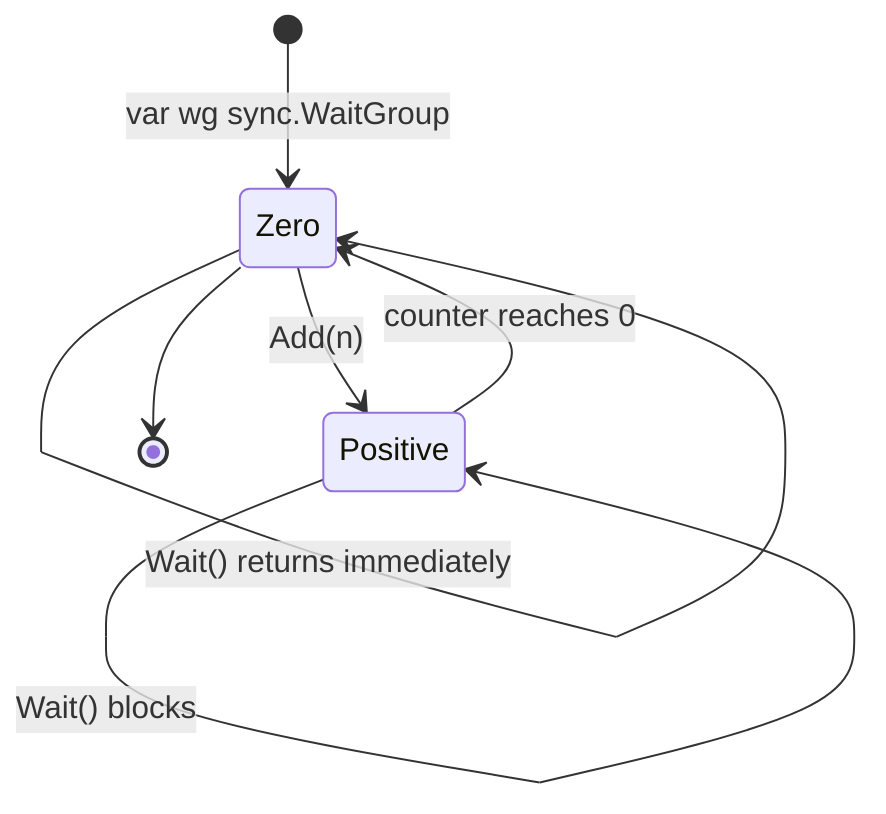
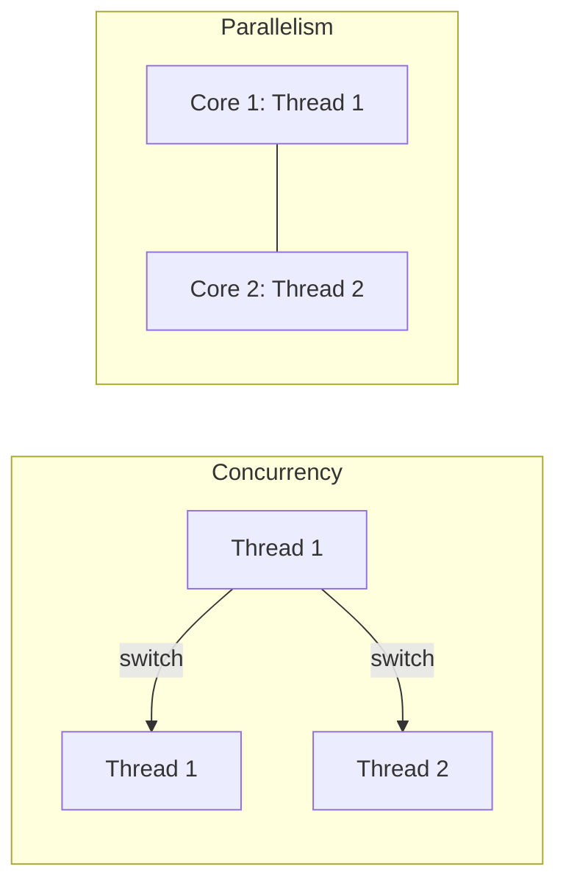
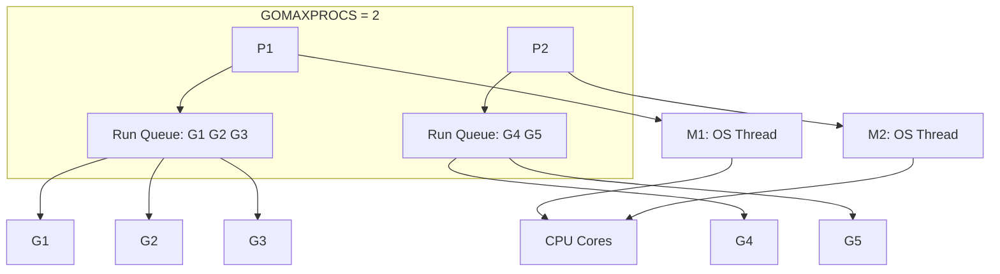

# 01 - Goroutines

## What Is a Goroutine?

A **goroutine** is a lightweight unit of concurrent execution managed by the Go runtime. It is not an OS thread. You launch one by prefixing a function call with the `go` keyword, and the Go scheduler runs it concurrently with the rest of your program, multiplexed across a small pool of OS threads.

```go
go someFunction()

go func() {
    // anonymous goroutine
}()
```

### Key Characteristics

- **Very lightweight** — a goroutine starts with a tiny stack (~2 KB) that grows and shrinks dynamically on demand. You can run tens of thousands or even millions.
- **Multiplexed** onto OS threads by the Go runtime's M:N scheduler.
- **Cheap to create** — creation is a user-space allocation, not an OS syscall.
- **Cheap to switch** — context switching costs nanoseconds (user-space only), versus microseconds for OS threads.
- **Communicate via channels** — Go's motto is "Do not communicate by sharing memory; instead, share memory by communicating."

| Feature | OS Thread | Goroutine |
|---------|-----------|-----------|
| Initial stack size | ~1 MB | ~2 KB |
| Stack growth | Fixed (or limited) | Dynamic (grows/shrinks) |
| Creation cost | High (system call) | Low (user space) |
| Context switch cost | High (~microsecond) | Low (~nanosecond) |
| Quantity limit | Thousands | Millions |

> 💡 **Pro tip:** Goroutines are the cheapest concurrency primitive in Go — millions are practical, so prefer spawning a goroutine over managing a thread pool.

---

## Your First Goroutine

```go
package main

import (
    "fmt"
    "time"
)

func hello() {
    fmt.Println("hello from goroutine")
}

func main() {
    go hello()
    time.Sleep(time.Second)
    fmt.Println("main function")
}
```

The output is non-deterministic. The key point: `hello()` runs concurrently with `main()`. Anonymous functions work too:

```go
go func() {
    fmt.Println("anonymous goroutine")
}()
```

---

## The Main Goroutine

Every Go program starts with a single goroutine: the **main goroutine**. When `main()` returns, the program exits immediately. It does not wait for any other goroutines.

```go
func main() {
    go func() {
        fmt.Println("this goroutine may or may not run")
    }()
    fmt.Println("main is done")
}
```

You will likely see only `main is done`. The program exits before the goroutine prints. **You must explicitly coordinate goroutine completion** using `sync.WaitGroup`, channels, or `context`.

> 🔑 **Key idea:** The main goroutine does not wait for other goroutines — when `main()` returns, the whole process exits. Synchronization is always your responsibility.

---

---

## Waiting for Goroutines

### Why `time.Sleep` Is Wrong

```go
// BAD
go doWork()
time.Sleep(time.Second) // hoping doWork finishes in 1 second
```

It is a guess. It is fragile. It does not scale. Never use `time.Sleep` for synchronization.

> ⚠️ **Gotcha:** `time.Sleep` is a race disguised as synchronization — it can pass even when work isn't done, or hang when it is. Always use `WaitGroup`, channels, or `context`.

---

### Using `sync.WaitGroup`

`sync.WaitGroup` is the standard way to wait for a fixed set of goroutines. It works like a counter:

| Method | Purpose |
|--------|---------|
| `Add(delta)` | Increase the counter by delta |
| `Done()` | Decrease counter by 1 (use `defer` in each goroutine) |
| `Wait()` | Block until counter reaches 0 |

```go
package main

import (
    "fmt"
    "sync"
)

func worker(id int, wg *sync.WaitGroup) {
    defer wg.Done()
    fmt.Printf("worker %d done\n", id)
}

func main() {
    var wg sync.WaitGroup
    for i := 1; i <= 5; i++ {
        wg.Add(1)
        go worker(i, &wg)
    }
    wg.Wait()
    fmt.Println("all workers finished")
}
```

> [!note] **Always pass `*sync.WaitGroup` by pointer** — a copy won't work, because A copy of a `sync.WaitGroup` does not work because copying duplicates its internal state counters and synchronization primitives, meaning the copy operates independently from the original and fails to track active goroutines.

### WaitGroup Lifecycle



### Correct Add Placement

**Always call `Add` before launching the goroutine, not inside it.**

```go
// GOOD: Add is called in the main goroutine before starting workers
for i := 0; i < 10; i++ {
    wg.Add(1)
    go func(i int) { defer wg.Done(); work(i) }(i)
}
wg.Wait()
```

```go
// BAD: calling wg.Add inside the goroutine can race with wg.Wait
for i := 0; i < 10; i++ {
    go func(i int) {
        wg.Add(1)    // may race with Wait in main
        defer wg.Done()
        work(i)
    }(i)
}
wg.Wait()
```

---

## Passing Arguments to Goroutines

Arguments are **evaluated immediately** at the `go` statement — a copy is passed.

```go
for i := 0; i < 5; i++ {
    wg.Add(1)
    go func(n int) {   // pass as parameter → each gets its own n
        defer wg.Done()
        fmt.Println(n)
    }(i)               // argument evaluated now (a copy)
}
wg.Wait()
```

> Passing `i` as an argument is the safe, idiomatic way to avoid the closure capture bug.

---

## Concurrency vs Parallelism

- **Concurrency** is *structure* — dealing with many things at once by interleaving. (Composition of independently executing computations.)
- **Parallelism** is *execution* — doing many things at once, simultaneously on multiple cores.

Goroutines give you **concurrency** in the language; whether they run in **parallel** depends on available cores and the scheduler. You control parallelism with `GOMAXPROCS`:

> 🧠 **Memory aid:** Think of concurrency as the *structure* of your program (many things in flight) and parallelism as the *hardware* actually running them at the same time.

---

```go
runtime.GOMAXPROCS(4)   // allow up to 4 OS threads to run goroutines
```

> **Rob Pike's quote**: "Concurrency is not parallelism." Concurrency enables parallelism.



In practice, you write concurrent code using channels and goroutines, and the runtime will run it in parallel when hardware allows. The one place the distinction matters is **correctness**: concurrent code must be correct whether or not it runs in parallel.

---

## The Go Scheduler

The Go runtime implements an **M:N scheduler**: M goroutines are multiplexed onto N OS threads.

### The Three Entities

```
G (goroutine)  ←— many, lightweight, cheap to create
M (machine / OS thread)  ←— the actual threads the OS runs
P (processor / scheduler context)  ←— holds a run queue of runnable G's
```

- **G** — a goroutine: small stack that grows on demand.
- **M** — an OS thread.
- **P** — a "logical processor"; there are `GOMAXPROCS` of them, each with a local run queue of goroutines ready to run.



### How Context Switching Works

The scheduler:
1. Picks a runnable G from a P's run queue.
2. Runs it on an M until it blocks (channel, lock, syscall) or yields.
3. Switches to another runnable G.

**Yielding points** include:
- Channel send/receive
- `time.Sleep`
- Mutex lock/unlock
- Function calls that the compiler instruments
- Garbage collection

Since Go 1.14, the runtime also does **asynchronous preemption** to reclaim long-running goroutines without an explicit yield — preventing one goroutine from starving the rest at safe points.

> Practical implication: a goroutine never blocks an M in a way that prevents other goroutines from running, as long as it doesn't hold a lock or occupy the P forever.

### GOMAXPROCS

```go
runtime.GOMAXPROCS(8)   // set explicitly
runtime.GOMAXPROCS(0)   // query current
fmt.Println("Logical CPUs:", runtime.NumCPU())
fmt.Println("GOMAXPROCS:", runtime.GOMAXPROCS(0))
```

The default is the number of logical CPUs. Setting GOMAXPROCS doesn't change the number of goroutines you can have — only how many run in parallel at once.

> **In containers**: GOMAXPROCS defaults to host CPU count, which may be far more than the container's quota. Use `automaxprocs` or set it explicitly to avoid over-parallelism.

---

## The Go Memory Model

The **Go Memory Model** defines the guarantees about when a write performed by one goroutine is *visible* to a read by another. ([Official docs](https://go.dev/ref/mem))

### Key Rules

- A plain read/write of a variable by goroutines is fine **only if** there is some **synchronization** between them.
- Synchronization primitives establish **happens-before** relationships:
  - The start of a goroutine happens-before the goroutine body.
  - Sending on a channel **happens-before** the corresponding receive.
  - Closing a channel **happens-before** any receive that returns zero.
  - `sync.Mutex.Unlock()` **happens-before** the matching `Lock()`.
  - `WaitGroup.Done()` **happens-before** a `Wait()` that returns after it.
  - `atomic` operations establish ordering for the specific location.

```go
// Correct ordering via channel
ch := make(chan int)
go func() {
    x = 42            // write
    ch <- 1           // send (happens-before receive)
}()
<-ch                  // receive happens-after send
fmt.Println(x)        // guaranteed to see 42
```

### What Is NOT Guaranteed

- Without synchronization, the compiler/runtime may reorder operations, and different goroutines may see different orderings.
- Reading and writing the same variable concurrently from two goroutines without synchronization is a **data race** — undefined behavior.

> This is exactly why `go test -race` and disciplined use of channels/mutexes/atomics are essential.

---

## Sharing Data Between Goroutines — The Race Problem

When multiple goroutines read/write the **same variable** without synchronization, you get **race conditions** — unpredictable results.

```go
var counter int

func main() {
    var wg sync.WaitGroup
    for i := 0; i < 1000; i++ {
        wg.Add(1)
        go func() {
            defer wg.Done()
            counter++   // NOT safe — race condition!
        }()
    }
    wg.Wait()
    fmt.Println(counter)  // unpredictable (often < 1000)
}
```

The `counter++` operation is actually three steps: read counter, add 1, write counter. Two goroutines can read the same value, both add 1, and both write the same result, losing an increment.

> 🔑 **Remember:** A data race is undefined behavior — even if it "looks fine," the compiler and CPU are free to reorder operations and give you wrong answers.

---

### Fixes

1. Use a **mutex** (`sync.Mutex`) — see [03-sync-package.md](03-sync-package.md).
2. Use **atomic operations** (`sync/atomic`) — same file.
3. Use **channels** to serialize access — see [02-channels.md](02-channels.md).
4. Have a **single goroutine own the state**, communicating through channels — the most idiomatic approach.

```go
// Channel-based ownership: single goroutine owns the state
func main() {
    ops := make(chan func(), 1000)
    counter := 0

    go func() {
        for op := range ops {
            op()
        }
    }()

    for i := 0; i < 1000; i++ {
        ops <- func() { counter++ }
    }
    close(ops)
    fmt.Println("Counter:", counter) // always 1000
}
```

### Map and Slice Races

Concurrent writes to a plain `map` cause a runtime panic: `fatal error: concurrent map writes`. Concurrent `append` calls corrupt the slice header. Always protect maps and slices with a mutex or use `sync.Map`.

---

## Detecting Data Races

Go has a built-in **race detector**. Build/test with `-race`:

```sh
go run -race main.go
go build -race myapp
go test -race ./...
```

It reports races with stack traces showing the exact interleaving that's unsafe. The race detector adds overhead (5-10x memory, 2-20x slower execution). Do not ship binaries with `-race`. But **always use it during development and CI**.

> ⚠️ **Watch out:** The race detector only catches races that actually happen during a run — a passing test with `-race` doesn't prove your code is race-free. Run it on high-traffic and CI paths.

---

---

## Goroutine Leaks

A **goroutine leak** is a goroutine blocked forever, unable to exit. Leaked goroutines consume at least 2 KB each. Over time, memory usage grows without bound.

### Common Causes

1. **Blocking on an unread channel** — a goroutine sends on an unbuffered channel with no receiver.
2. **Partial reads** — a goroutine sends N values but the receiver only reads some.
3. **Forgotten stop signal** — a goroutine waits on a stop channel that is never closed.
4. **Range over an unclosed channel** — blocks forever.
5. **Infinite loop without a termination condition**.

### Preventing Goroutine Leaks

- **Know how every goroutine stops** before you start it. Every `go` should have a termination path (receiver, done-channel, context, WaitGroup).
- Use **`context.Context`** for cancellation.
- **Close channels you own** when no more values will be sent.
- Use **`defer`** to ensure cleanup.

```go
// Good: context provides cancellation, defer close ensures channel cleanup
func worker(ctx context.Context, in <-chan int) <-chan int {
    out := make(chan int)
    go func() {
        defer close(out)
        for {
            select {
            case <-ctx.Done():
                return
            case v, ok := <-in:
                if !ok {
                    return
                }
                out <- v * 2
            }
        }
    }()
    return out
}
```

### Detecting Leaks in Tests

- Check `runtime.NumGoroutine()` before and after a test.
- Use `go.uber.org/goleak` to detect goroutine leaks automatically.
- Monitor goroutine count in production metrics.

> 💡 **Note:** Leaked goroutines each pin at least ~2 KB of stack you'll never get back until the process dies — in a long-running server, leaks are silent memory leaks.

---

## Best Practices for Using Goroutines

1. **Know how every goroutine stops** before you start it. Every `go` should have a termination path.
2. **Pass data as arguments, not captured variables**, when starting a goroutine in a loop.
3. **Use `sync.WaitGroup` to wait** for a fixed set; use channels/`errgroup` for more complex coordination.
4. **Bound concurrency** with worker pools or semaphores (`chan struct{}` of size N); don't spawn unbounded goroutines.
5. **Don't mutate shared state** without synchronization; prefer passing data via channels.
6. **Use `context.Context`** for goroutines that perform cancellable work.
7. **Never start goroutines in `init()`** — they may access uninitialized state.
8. **Document goroutine ownership** — make it clear which goroutine owns a resource and who cleans it up.
9. Keep goroutines **short-lived** when possible. Long-lived goroutines are harder to test and more prone to leaks.

---

## Modern Practices

- Use **worker pools** or **semaphore patterns** (`chan struct{}` of size N) to bound concurrency rather than spawning unbounded goroutines.
- Always pass a `context.Context` to goroutines that perform cancellable work (HTTP calls, DB queries, long loops).
- Prefer **`errgroup`** (`golang.org/x/sync/errgroup`) over raw `go` + WaitGroup when you need to collect errors from concurrent tasks.
- Run `go test -race ./...` in CI/CD to catch data races early.
- Use **atomic operations** (`sync/atomic`) or **channels** for counters shared across goroutines instead of mutex-guarded ints.
- Be deliberate about goroutine lifetimes — every `go` statement should have a clear termination path (context cancel, done channel, or WaitGroup).
- Since Go 1.22, the loop variable capture bug is fixed; but passing as an argument still communicates intent clearly.

---

## Common Mistakes

- **`main` returns before goroutines finish** — the program exits and goroutines die silently; always use WaitGroup, errgroup, or a done channel.
- **Using `time.Sleep` for synchronization** — fragile, doesn't scale, use WaitGroup or channels instead.
- **`wg.Add` inside the goroutine** — `Wait` may fire before `Add` is called, causing premature return.
- **Unbounded goroutine spawning** — launching millions of goroutines with no concurrency limit can exhaust memory and file descriptors.
- **Data races on shared maps/slices** — concurrent writes to a plain `map` or slice without synchronization cause undefined behavior and crash with `-race`.
- **Goroutine leaks** — a goroutine blocked on a channel send/receive with no counterpart will leak forever, consuming its stack and captured variables.
- **Capturing loop variables** — on Go < 1.22, `go func() { fmt.Println(i) }()` in a loop captures the same `i`; pass `i` as an argument.
- **Expecting mutation from value receivers** — passing a value to a goroutine gives a copy; changes inside the goroutine don't affect the original.
- **Ignoring errors from goroutines** — errors silently lost; propagate through channels or use `errgroup`.
- **Sending on a closed channel** — panics at runtime; only one goroutine should close, and only once.

---

## Practical Example: Concurrent URL Checker

```go
package main

import (
    "context"
    "fmt"
    "net/http"
    "sync"
    "time"
)

type Result struct {
    URL    string
    Status int
    Err    error
}

func checkURL(ctx context.Context, url string) Result {
    req, err := http.NewRequestWithContext(ctx, http.MethodGet, url, nil)
    if err != nil {
        return Result{URL: url, Err: err}
    }
    resp, err := http.DefaultClient.Do(req)
    if err != nil {
        return Result{URL: url, Err: err}
    }
    resp.Body.Close()
    return Result{URL: url, Status: resp.StatusCode}
}

func main() {
    urls := []string{
        "https://httpbin.org/status/200",
        "https://httpbin.org/status/404",
        "https://httpbin.org/delay/10",
        "https://nonexistent.invalid",
    }

    ctx, cancel := context.WithTimeout(context.Background(), 5*time.Second)
    defer cancel()

    var wg sync.WaitGroup
    results := make(chan Result, len(urls))

    for _, url := range urls {
        wg.Add(1)
        go func(u string) {
            defer wg.Done()
            results <- checkURL(ctx, u)
        }(url)
    }

    go func() {
        wg.Wait()
        close(results)
    }()

    for r := range results {
        if r.Err != nil {
            fmt.Printf("FAIL  %s: %v\n", r.URL, r.Err)
        } else {
            fmt.Printf("OK    %s: %d\n", r.URL, r.Status)
        }
    }
}
```

Key decisions: context with timeout for cancellation, buffered results channel to prevent blocking, WaitGroup for completion tracking, `defer wg.Done()` for safe cleanup.

---

## Concurrency Decision Guide

| Need | Tool |
|------|------|
| Wait for N goroutines | `sync.WaitGroup` |
| Collect errors from goroutines | `errgroup` |
| Cancel goroutines on demand | `context.Context` |
| Bound concurrency | Worker pool or semaphore (`chan struct{}`) |
| Share data between goroutines | Channels |
| Protect a shared struct | `sync.Mutex` or `sync.RWMutex` |
| Simple counter/flag across goroutines | `sync/atomic` |

---

## Key Takeaways

1. Start a goroutine with `go`; it runs concurrently with other goroutines.
2. `main` does **not** wait for goroutines — use `sync.WaitGroup`, channels, or `context`.
3. Goroutines are **lightweight** (~2 KB stack, millions possible).
4. Always `Add` before starting; use `defer Done()` in the goroutine.
5. Pass `*sync.WaitGroup` by pointer.
6. Pass loop variables as arguments to avoid closure capture bugs.
7. Beware **data races** when sharing variables — use mutexes/atomics/channels.
8. Use `go run -race` / `go test -race` to detect races.
9. Concurrency (`go`) != parallelism (multiple cores via `GOMAXPROCS`).
10. Know how every goroutine stops before you start it.
11. Understand the M:N scheduler (G, M, P) and yield points.
12. The memory model requires synchronization for cross-goroutine visibility.

## Next

Continue to [02-channels.md](02-channels.md) — Go's primary communication and synchronization tool.
