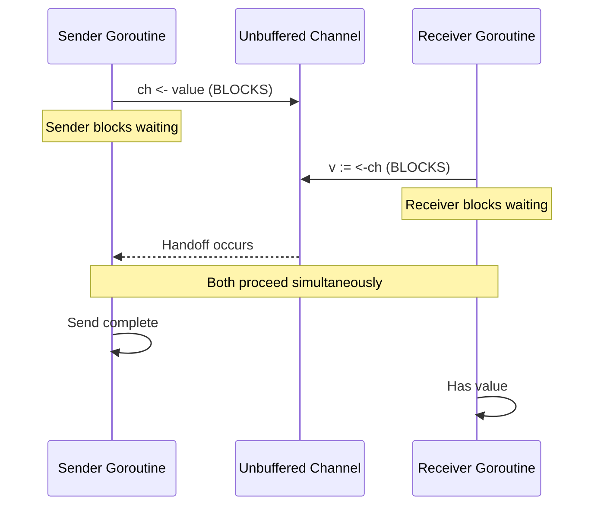
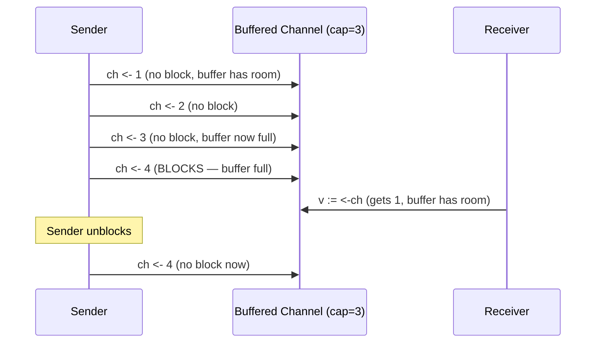
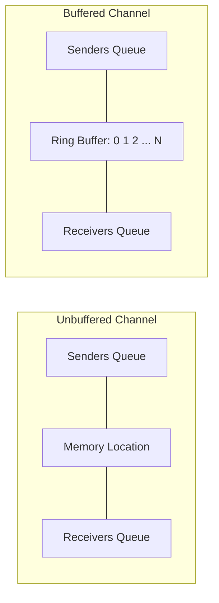
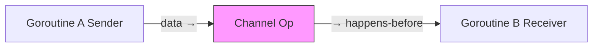
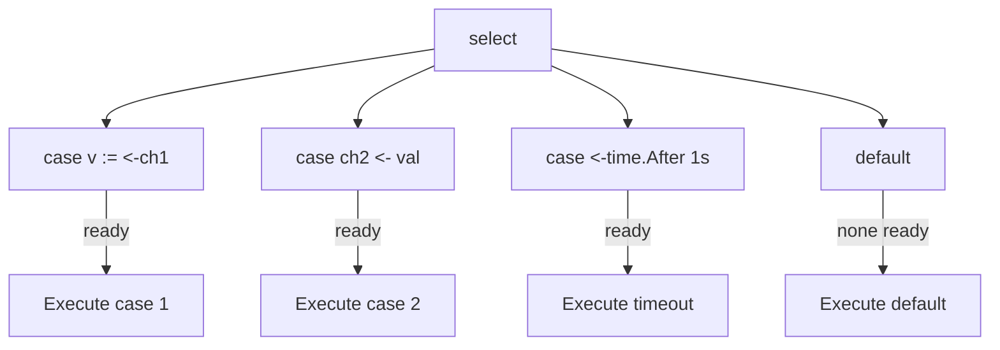

# 02 - Channels

## What Is a Channel?

A **channel** is a typed conduit through which goroutines communicate by sending and receiving values. It is Go's embodiment of the proverb: "Do not communicate by sharing memory; instead, share memory by communicating."

The channel manages synchronization and data transfer together. When you send on an unbuffered channel, the sending goroutine blocks until a receiver is ready. This blocking *is* the synchronization — no locks needed.

> 🔑 **Key idea:** Channels are for communication between goroutines — the blocking send/receive is itself the synchronization, so no locks are needed.

```go
ch := make(chan int)       // unbuffered channel of ints

go func() {
    ch <- 42               // send: push value into the channel
}()

value := <-ch              // receive: pull value out of the channel
fmt.Println(value)         // 42
```

### Reference Types

Channels are reference types. Like maps and slices, they are created with `make` and passed by value (which copies the pointer to the underlying data structure, not the channel itself).

```go
var ch chan int     // nil channel — not yet created with make
ch = make(chan int) // now it's usable
```

---

## Creating Channels

```go
ch := make(chan T)      // unbuffered channel of type T
ch := make(chan T, N)   // buffered channel of type T with capacity N
```

`T` can be any Go type:

```go
stringCh  := make(chan string)
pointCh   := make(chan Point)
sliceCh   := make(chan []int)
chanCh    := make(chan chan int) // channel of channels
```

An unbuffered channel has zero capacity. A buffered channel has capacity `N`, meaning it can hold up to `N` values before a send blocks.

---

## Sending and Receiving

The `<-` operator is used for both sending and receiving, distinguished by its position:

```go
ch <- value    // send: push value into the channel
v := <-ch      // receive: pull a value out of the channel
```

**Sending** pushes a value into the channel. With an unbuffered channel, the send blocks until another goroutine receives. With a buffered channel, the send blocks only when the buffer is full.

**Receiving** pulls a value out of the channel. With an unbuffered channel, the receive blocks until another goroutine sends. With a buffered channel, the receive blocks only when the buffer is empty.

You can receive and check whether the channel was closed in one expression:

```go
v, ok := <-ch
```

If `ok` is `false`, the channel is closed and `v` contains the zero value of the channel's type. If `ok` is `true`, `v` is a valid value received from the channel.

---

## Unbuffered Channels

An unbuffered channel requires both sender and receiver to be ready simultaneously. This is also called a **synchronous** or **rendezvous** channel.



```go
package main

import (
    "fmt"
    "time"
)

func main() {
    ch := make(chan string)

    go func() {
        fmt.Println("goroutine: about to send")
        ch <- "data"
        fmt.Println("goroutine: send completed")
    }()

    time.Sleep(2 * time.Second)

    fmt.Println("main: about to receive")
    v := <-ch
    fmt.Println("main: received", v)
}
```

The goroutine blocks on `ch <- "data"` for 2 seconds until main executes `<-ch`. Unbuffered channels guarantee that a send has been received before the sending goroutine continues.

---

## Buffered Channels

A buffered channel decouples the sender from the receiver. Values sit in the channel's internal buffer until a receiver collects them. A send only blocks when the buffer is full. A receive only blocks when the buffer is empty.

```go
package main

import "fmt"

func main() {
    ch := make(chan int, 3) // buffer capacity of 3

    ch <- 1   // no block — room available
    ch <- 2
    ch <- 3
    // ch <- 4  // would block: buffer is full

    fmt.Println(<-ch) // 1
    fmt.Println(<-ch) // 2
    fmt.Println(<-ch) // 3
}
```

Use `len(ch)` and `cap(ch)` to inspect the buffer:

```go
fmt.Println(len(ch))  // number of queued elements
fmt.Println(cap(ch))  // buffer capacity
```



==Buffered channels are useful when you want to decouple the rate of production from the rate of consumption, or when you want to collect a batch of results.==

> 🧠 **Think of it as:** An unbuffered channel is a phone call (both parties must be present); a buffered channel is a mailbox (you drop a letter and leave).

---

## Channel Directions

You can restrict a channel's usage by specifying its direction in function signatures. This is a compile-time guarantee.

```go
// send-only: the function can only send values into the channel
func producer(ch chan<- int) {
    for i := 0; i < 5; i++ {
        ch <- i
    }
    close(ch)
}

// receive-only: the function can only receive values from the channel
func consumer(ch <-chan int) {
    for v := range ch {
        fmt.Println(v)
    }
}

func main() {
    ch := make(chan int)
    go producer(ch)
    consumer(ch)
}
```

- `chan<- int` — send-only channel.
- `<-chan int` — receive-only channel.
- `chan int` — bidirectional channel.

Bidirectional channels are automatically usable where send-only or receive-only channels are expected. The reverse is not true. You cannot pass a send-only channel to a function expecting a bidirectional channel.

> Converting a bidirectional channel to a directional one is automatic. You cannot convert the other way.

---

## Closing Channels

Closing a channel signals that **no more values will be sent**. This is useful for broadcast notification to receivers.

```go
close(ch)
```

After closing, sending to the channel panics. Receiving from a closed channel returns the zero value immediately without blocking.

```go
func main() {
    ch := make(chan int, 3)
    ch <- 10
    ch <- 20
    close(ch)

    fmt.Println(<-ch) // 10
    fmt.Println(<-ch) // 20
    fmt.Println(<-ch) // 0 (zero value, channel closed)
}
```

### Rules for Closing

1. **Only the sender should close a channel.** The sender knows when no more values will be sent.
2. **Sending to a closed channel panics.** This is a runtime error.
3. **Receiving from a closed channel returns the zero value.** No blocking, no panic.
4. **Closing a nil channel panics.**
5. **Closing an already-closed channel panics.** Use `sync.Once` to guard against double close.
6. **A channel is not required to be closed.** If the sending goroutine will eventually exit and be GC'd, closing is only necessary when receivers need to know that no more values are coming.

> ⚠️ **Watch out:** Closing a channel is a promise — sending to a closed channel panics, and closing it twice panics. Only the sender should ever close, and only once.

---

```go
var closeOnce sync.Once
func stop() {
    closeOnce.Do(func() { close(done) })   // safe from many goroutines
}
```

---

## Range Over Channels

The `for range` loop reads values from a channel until the channel is closed:

```go
func main() {
    ch := make(chan int, 5)
    for i := 0; i < 5; i++ {
        ch <- i
    }
    close(ch)

    for v := range ch {
        fmt.Println(v) // 0 1 2 3 4
    }
    fmt.Println("done")
}
```

If the channel is never closed, the range loop blocks forever. Always close the sender channel when the stream is finite.

> 🔑 **Remember:** A `for range` over a channel only ends when the channel is closed — forgetting to close leaves the loop (and the consumer) blocked forever.

Range over a closed, empty channel iterates zero times and exits immediately:

```go
ch := make(chan int)
close(ch)
for v := range ch {
    // never executes
}
```

---

## The Nil Channel

A channel variable declared without initialization is nil:

```go
var ch chan int // ch is nil
```

- Sending to a nil channel **blocks forever**.
- Receiving from a nil channel **blocks forever**.
- Closing a nil channel **panics**.

> 💡 **Pro tip:** The nil channel's "block forever" is a feature, not just a bug — set a channel to nil in `select` to permanently disable that case.

This behavior enables elegant `select` patterns — a `case` on a nil channel is permanently disabled:

```go
var ch chan int // nil

select {
case v := <-ch:
    fmt.Println(v)
case ch <- 42:
    fmt.Println("sent")
default:
    fmt.Println("neither ready") // always hits this
}
```

You can dynamically enable or disable select cases by setting a channel variable to nil or to a real channel:

```go
var input <-chan int // nil — case disabled

for {
    select {
    case v, ok := <-input:
        if !ok {
            input = nil // disable this case after channel closes
            continue
        }
        fmt.Println(v)
    case <-time.After(1 * time.Second):
        fmt.Println("timeout")
    }
}
```

---

## Channel Behavior Summary

| Operation | Blocking behavior |
|-----------|-------------------|
| Send on unbuffered | Blocks until a receiver is ready |
| Send on full buffered | Blocks until space frees |
| Send on nil channel | Blocks forever |
| Receive on unbuffered | Blocks until a sender is ready |
| Receive on empty buffered | Blocks until a value arrives |
| Receive on closed channel | Returns zero value immediately, ok=false |
| Send on closed channel | **Panics!** |
| Close nil channel | **Panics!** |
| Close already-closed | **Panics!** |

---

## Channel Internals

Understanding what happens inside a channel helps debug performance issues.

**Unbuffered channel**: contains a single memory location. A send copies the value into the location and wakes the receiver. A receive copies the value out and wakes the sender. The runtime manages a queue of goroutines waiting to send and a queue waiting to receive.

**Buffered channel**: contains a ring buffer, a send index, and a receive index. Sends append to the buffer. Receives remove from the buffer. When the buffer is full, senders are queued. When the buffer is empty, receivers are queued.



Channels are not free. Creating many short-lived channels is more expensive than reusing a few long-lived ones.

---

## The Go Memory Model and Channels

Per the [Go memory model](https://go.dev/ref/mem), channel operations establish **happens-before** relationships:

- **A send happens-before the corresponding receive.**
- **A receive from an unbuffered channel happens-before the completion of the send.**
- **Closing a channel happens-before any receive that returns a zero value.**
- **A receive from an empty, closed channel returns zero immediately.**



This makes channels the idiomatic way to both communicate data **and** orchestrate ordering between goroutines.

---

## The `select` Statement

`select` lets a goroutine wait on **multiple** channel operations. It blocks until one of its cases is ready, then executes that case. If multiple cases are ready, one is chosen **at random** to prevent starvation.



### Basic Syntax

```go
select {
case msg := <-ch1:
    fmt.Println("from ch1:", msg)
case ch2 <- 42:
    fmt.Println("sent to ch2")
case v, ok := <-ch3:
    if ok {
        fmt.Println("from ch3:", v)
    }
case <-time.After(2 * time.Second):
    fmt.Println("timed out")
default:
    fmt.Println("no channel ready")
}
```

Key rules:
- Each `case` must contain exactly one channel operation (send or receive).
- Channel expressions are evaluated once, when the `select` begins.
- The `default` case is optional and runs immediately if no other case is ready.
- A `select` with only `default` never blocks.

> 🧠 **Memory aid:** When several `select` cases are ready at once, Go picks one **at random** — this is deliberate, to prevent one hot case from starving the others.

### Non-Blocking Send/Receive

```go
select {
case v := <-ch:
    fmt.Println("got", v)
default:
    fmt.Println("channel not ready — doing something else")
}

select {
case ch <- value:
    fmt.Println("sent")
default:
    fmt.Println("channel full or not ready; dropping value")
}
```

### Timeout Pattern

```go
ch := make(chan int)
select {
case v := <-ch:
    fmt.Println("received", v)
case <-time.After(2 * time.Second):
    fmt.Println("timed out waiting for ch")
}
```

### Done Channel Signal (Very Common)

```go
done := make(chan struct{})

go func() {
    // ... do work
    close(done)   // signal completion (closing broadcasts to all receivers)
}()

select {
case <-done:
    fmt.Println("done")
case <-time.After(3 * time.Second):
    fmt.Println("timeout")
}
```

### Empty Select Blocks Forever

```go
select {}
// blocks the current goroutine forever
// (sometimes used to keep main alive in server programs)
```

### Select with context.Done()

The idiomatic way to support cancellation:

```go
func worker(ctx context.Context, jobs <-chan Job, results chan<- Result) {
    for {
        select {
        case <-ctx.Done():
            return
        case job, ok := <-jobs:
            if !ok {
                return
            }
            results <- processJob(job)
        }
    }
}
```

### Timer Usage in Loops

Be careful using `time.After` in a loop — each call allocates a new timer that isn't GC'd until it fires. Prefer `time.NewTimer`:

> ⚠️ **Gotcha:** Calling `time.After` inside a loop leaks a timer on every iteration — each one stays alive until it fires. Use a single `time.NewTimer` and `Reset` it instead.

```go
timer := time.NewTimer(time.Second)
defer timer.Stop()

for {
    select {
    case msg := <-ch:
        timer.Reset(time.Second)
        fmt.Println("Received:", msg)
    case <-timer.C:
        fmt.Println("Timeout")
        return
    }
}
```

---

## Channel Patterns

### Generator

A function returning a read-only channel that produces values on demand:

```go
func fib() <-chan int {
    out := make(chan int)
    go func() {
        a, b := 0, 1
        for {
            out <- a
            a, b = b, a+b
        }
    }()
    return out
}

func main() {
    c := fib()
    for i := 0; i < 10; i++ {
        fmt.Println(<-c)   // 0 1 1 2 3 5 8 13 21 34
    }
}
```

### Pipeline

Each stage is a goroutine connected by channels:

```go
func generator(nums ...int) <-chan int {
    out := make(chan int)
    go func() {
        defer close(out)
        for _, n := range nums {
            out <- n
        }
    }()
    return out
}

func square(in <-chan int) <-chan int {
    out := make(chan int)
    go func() {
        defer close(out)
        for n := range in {
            out <- n * n
        }
    }()
    return out
}

func filter(in <-chan int, predicate func(int) bool) <-chan int {
    out := make(chan int)
    go func() {
        defer close(out)
        for n := range in {
            if predicate(n) {
                out <- n
            }
        }
    }()
    return out
}

func main() {
    pipeline := filter(
        square(generator(1, 2, 3, 4, 5)),
        func(n int) bool { return n > 4 },
    )
    for v := range pipeline {
        fmt.Println(v) // 9 16 25
    }
}
```

### Done Channel for Cancellation

Closing a channel broadcasts the stop signal to all goroutines listening on it:

```go
func worker(done <-chan struct{}, values <-chan int) {
    for {
        select {
        case <-done:
            fmt.Println("cancelled")
            return
        case v, ok := <-values:
            if !ok {
                return
            }
            fmt.Println("got", v)
        }
    }
}

func main() {
    values := make(chan int)
    done := make(chan struct{})

    go worker(done, values)
    go worker(done, values)

    values <- 1
    values <- 2
    close(done)   // broadcast cancel to all workers
}
```

### Signal Channel (No Data)

Use `chan struct{}` for signaling — it consumes zero bytes:

```go
done := make(chan struct{})

go func() {
    defer close(done)
    // do work
}()

<-done // blocks until work is complete
```

---

## Goroutine Leaks via Channels

Sending on an unbuffered channel with no receiver **blocks forever**, causing a goroutine leak:

> 🔑 **Key idea:** Every channel send must have a matching receive (or close) somewhere — otherwise the sender blocks forever and leaks.

```go
// LEAK: nobody receives
ch := make(chan int)
go func() { ch <- 1 }()   // blocks forever → goroutine leak
```

**Prevention**:
- Use a `select` with `done` channel or `ctx.Done()` to provide an exit path.
- Use buffered channels when the receiver may not be ready.
- Always ensure a matching send and receive, or a close and receive.

```go
func nonLeaky(done <-chan struct{}) <-chan int {
    ch := make(chan int)
    go func() {
        defer close(ch)
        result := expensiveComputation()
        select {
        case ch <- result:
        case <-done:
            // goroutine can exit
        }
    }()
    return ch
}
```

### Unbuffered Channel Deadlock

```go
func main() {
    ch := make(chan int)
    ch <- 1   // blocks forever: main sends but nobody receives
}
```

The runtime detects this and panics: `fatal error: all goroutines are asleep - deadlock!`

More subtle:

```go
func main() {
    ch := make(chan int)
    go func() {
        ch <- 1
        ch <- 2 // blocks: nobody is receiving anymore
    }()
    fmt.Println(<-ch) // receives 1
    // main exits; goroutine stuck trying to send 2 → leaked
}
```

---

## Best Practices for Channels

1. **Who creates a channel should be the sender.** Closing should be done by the sender (or a dedicated closer), never by receivers.
2. **`range` over receive-only channels** is the cleanest consumption idiom; always `close` when no more sends will happen.
3. **Use buffered channels to decouple** producers from consumers and to avoid blocking — but size the buffer thoughtfully.
4. **Prefer directional channels in signatures** (`chan<-` / `<-chan`) to encode intent.
5. **Use `select` for non-blocking or timeout behavior** — the `default` case makes sends/receives non-blocking.
6. **A single `done` channel (`chan struct{}`) broadcast with `close`** is the classic way to cancel many goroutines at once.
7. **Don't use a channel as a general queue** unless you also handle closing and backpressure; a mutex-guarded `[]T` is often simpler.
8. **Channels are not free** — creating many short-lived channels is more expensive than reusing a few long-lived ones.

---

## Modern Practices

- **"Share memory by communicating"** — move data through channels instead of protecting shared variables with locks.
- Use **directional channel types** (`<-chan T`, `chan<- T`) in function signatures to clearly document producer vs. consumer intent.
- Use **buffered channels** as bounded work queues between producers and consumers to avoid unnecessary blocking.
- Always **drain channels with `range`** and ensure the sender calls `close()` so the loop terminates cleanly.
- Guard one-time close with **`sync.Once`** when multiple goroutines might call the close path.
- Use **`select` with a `default` case** for non-blocking sends/receives, and `select` with `time.After` for timeouts.
- Prefer **`chan struct{}`** for done/cancellation signals — it carries no data and avoids allocation.
- In loops, prefer **`time.NewTimer`** over `time.After` to avoid timer leaks.

---

## Common Mistakes

- **Sending on a closed channel** — panics at runtime; only the sender should close, and only once.
- **Closing a channel with multiple senders** — any sender calling `close()` can race with another, causing a double-close panic.
- **Reading from a closed channel in a loop without checking `ok`** — `v := <-ch` returns zero values forever after close; use `v, ok := <-ch` or `range`.
- **Buffered channel used as a queue without draining** — if producers fill the buffer and consumers stop, senders block forever.
- **Deadlock from unbuffered channel with no receiver** — a goroutine sending on an unbuffered channel with no one listening causes a deadlock panic.
- **Forgetting that receive on a closed channel returns `ok=false`** — not checking `ok` means you silently process zero values as valid data.
- **Nil channel confusion** — passing an uninitialized channel to a goroutine causes it to block forever.
- **`time.After` in loops** — each call allocates a new timer; use `time.NewTimer` instead.
- **Unnecessary `default` case** — a `default` that does nothing causes busy-looping at full CPU usage.

---

## Channel Quick Reference

| Concept | Syntax | Behavior |
|---------|--------|----------|
| Create unbuffered | `make(chan T)` | Synchronous send/receive |
| Create buffered | `make(chan T, N)` | Async until buffer full |
| Send | `ch <- v` | Blocks until receiver (unbuffered) or buffer space |
| Receive | `v := <-ch` | Blocks until sender or data in buffer |
| Close | `close(ch)` | Signals no more sends; receivers get zero values |
| Check closed | `v, ok := <-ch` | `ok` is false when closed |
| Send-only | `func f(ch chan<- T)` | Compile-time enforced |
| Receive-only | `func f(ch <-chan T)` | Compile-time enforced |
| Range | `for v := range ch` | Iterates until channel closed |
| Nil channel | `var ch chan T` | Blocks forever; panics on close |
| Select | `select { case ... }` | Multiplexes across channel operations |

---

## Key Takeaways

1. Channels are **typed conduits** for goroutine communication.
2. Send `ch <- v`; receive `<-ch`; direction matters in signatures.
3. Unbuffered = synchronous; buffered = decoupled up to capacity.
4. `close(ch)` signals no-more-sends; `range` over a channel ends on close.
5. `select` handles many channels; use `default` for non-blocking.
6. Never send to or close an already-closed channel (panic).
7. Closing a channel broadcasts to all receivers.
8. Beware goroutine leaks from unread unbuffered channels.
9. A nil channel blocks forever on send/receive and is useful for disabling select cases.
10. Channel operations establish happens-before relationships (the memory model).

## Next

Continue to [03-sync-package.md](03-sync-package.md) — mutexes, atomics, and synchronization primitives.
