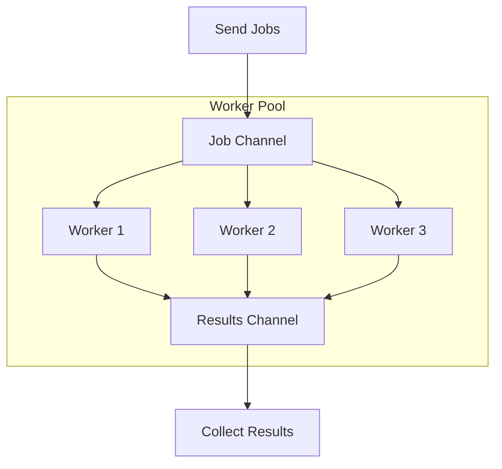
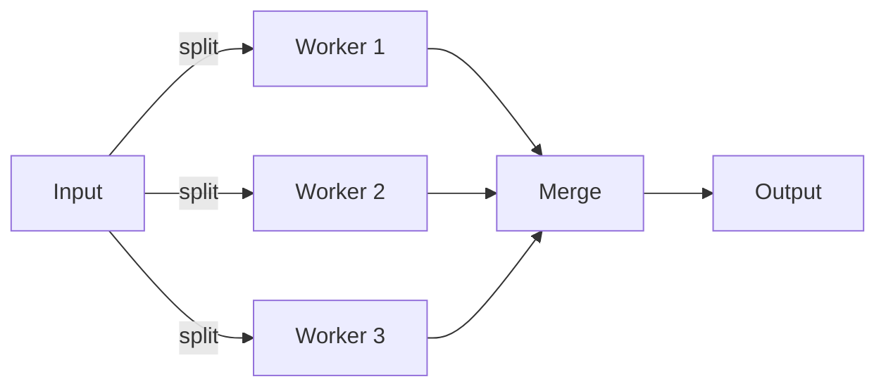
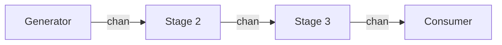
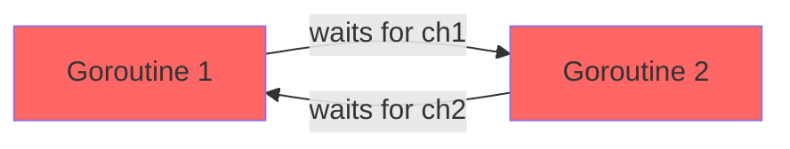

# 04 - Concurrency Patterns

## Introduction

Go provides concurrency primitives — goroutines, channels, select, and the sync package — but raw primitives alone do not produce correct programs. The difference between working concurrent code and broken concurrent code lies in how you compose these primitives. This file covers the established patterns that solve common coordination problems, plus cancellation, rate limiting, deadlock prevention, and error handling in concurrent code.

---

## When to Use Concurrency

Concurrency is not free. Every goroutine consumes stack memory (starting at a few KB, growing as needed), and every channel operation involves synchronization overhead. Before reaching for goroutines, ask whether the problem actually benefits from concurrent execution.

> 🔑 **Key idea:** Concurrency is a tool, not a default — measure or reason about the benefit before paying the coordination overhead.

### Use Concurrency When

- **Tasks are independent and can overlap in time.** Multiple HTTP requests, file reads, or database queries that do not depend on each other's results.
- **You need to respond to multiple event sources.** A server handling incoming requests, periodic timers, and shutdown signals.
- **You need to maintain responsiveness.** A GUI or interactive program that must stay responsive while doing background work.
- **The problem is naturally concurrent.** A web server, a chat system, a game server.

### Do NOT Use Concurrency When

- **The work is sequential by nature.** Processing a slice where each element depends on the previous one.
- **The overhead exceeds the benefit.** Fitting a goroutine and channel for a trivial operation that takes nanoseconds.
- **You do not need it yet.** Premature concurrency adds complexity. Start sequential, add concurrency when you have a measured need.
- **Shared state would require extensive locking.** If the concurrent tasks constantly need the same data and would block each other through locks, sequential execution is faster.

> A useful heuristic: if you cannot explain which specific operation overlaps with which other specific operation, you probably do not need concurrency.

---

## Pattern 1: Worker Pool

A fixed set of workers consumes jobs from a channel. This pattern limits concurrency to a fixed count, which is useful for controlling resource usage (database connections, API rate limits, file handles).



```go
package main

import (
    "fmt"
    "sync"
    "time"
)

type Job struct {
    ID   int
    Data string
}

type Result struct {
    JobID  int
    Output string
}

func worker(id int, jobs <-chan Job, results chan<- Result, wg *sync.WaitGroup) {
    defer wg.Done()
    for job := range jobs {
        fmt.Printf("Worker %d processing job %d\n", id, job.ID)
        time.Sleep(100 * time.Millisecond) // simulate work
        results <- Result{
            JobID:  job.ID,
            Output: fmt.Sprintf("processed-%s", job.Data),
        }
    }
}

func main() {
    const numWorkers = 3
    const numJobs = 10

    jobs := make(chan Job, numJobs)
    results := make(chan Result, numJobs)

    var wg sync.WaitGroup

    // Start workers
    for i := 1; i <= numWorkers; i++ {
        wg.Add(1)
        go worker(i, jobs, results, &wg)
    }

    // Send jobs
    for j := 1; j <= numJobs; j++ {
        jobs <- Job{ID: j, Data: fmt.Sprintf("data-%d", j)}
    }
    close(jobs) // no more jobs; workers exit after draining

    // Close results channel when all workers finish
    go func() {
        wg.Wait()
        close(results)
    }()

    // Collect results
    for r := range results {
        fmt.Printf("Job %d: %s\n", r.JobID, r.Output)
    }
}
```

Key design decisions:
- The `jobs` channel is buffered so sending does not block until all slots are full.
- Workers `range` over the channel, which automatically stops when the channel is closed.
- A `WaitGroup` tracks when all workers finish, allowing a goroutine to close the `results` channel.

> 💡 **Pro tip:** A worker pool caps resource usage (DB connections, API rate limits, file handles) — pick the worker count deliberately, not arbitrarily.

---

## Pattern 2: Fan-Out / Fan-In

- **Fan-out**: split work across multiple goroutines for parallel processing.
- **Fan-in**: combine results from multiple goroutines into a single channel.



### Fan-Out

```go
func fanOut(input []int, workers int) <-chan int {
    out := make(chan int)
    var wg sync.WaitGroup

    chunkSize := (len(input) + workers - 1) / workers

    for i := 0; i < workers; i++ {
        wg.Add(1)
        start := i * chunkSize
        end := start + chunkSize
        if end > len(input) {
            end = len(input)
        }
        go func(chunk []int) {
            defer wg.Done()
            for _, v := range chunk {
                out <- v * v
            }
        }(input[start:end])
    }

    go func() {
        wg.Wait()
        close(out)
    }()

    return out
}
```

### Fan-In (Merge)

```go
func fanIn(channels ...<-chan int) <-chan int {
    var wg sync.WaitGroup
    merged := make(chan int)

    for _, ch := range channels {
        wg.Add(1)
        go func(c <-chan int) {
            defer wg.Done()
            for v := range c {
                merged <- v
            }
        }(ch)
    }

    go func() {
        wg.Wait()
        close(merged)
    }()

    return merged
}
```

### Complete Example

```go
func main() {
    input := []int{1, 2, 3, 4, 5, 6, 7, 8, 9, 10}

    // Fan-out: distribute to 3 workers
    ch1 := fanOut(input[:4], 2)
    ch2 := fanOut(input[4:7], 2)
    ch3 := fanOut(input[7:], 2)

    // Fan-in: merge all results
    for result := range fanIn(ch1, ch2, ch3) {
        fmt.Println(result)
    }
}
```

The critical detail is the goroutine that waits for all workers to finish and then closes the merged channel. Without it, the consumer would block forever.

> 🔑 **Remember:** Whoever consumes a channel is at the mercy of whoever closes it — in fan-in, a dedicated goroutine closes the merged channel only after every producer's `WaitGroup` counts down.

---

## Pattern 3: Pipeline

A pipeline is a chain of processing stages connected by channels. Each stage is one or more goroutines that receive from an input channel, transform the data, and send to an output channel.



```go
func generate(words ...string) <-chan string {
    out := make(chan string)
    go func() {
        for _, w := range words {
            out <- w
        }
        close(out)
    }()
    return out
}

func upper(input <-chan string) <-chan string {
    out := make(chan string)
    go func() {
        for w := range input {
            out <- strings.ToUpper(w)
        }
        close(out)
    }()
    return out
}

func repeat(input <-chan string, count int) <-chan string {
    out := make(chan string)
    go func() {
        for w := range input {
            for i := 0; i < count; i++ {
                out <- w
            }
        }
        close(out)
    }()
    return out
}

func main() {
    stage1 := generate("hello", "world", "go")
    stage2 := upper(stage1)
    stage3 := repeat(stage2, 3)

    for v := range stage3 {
        fmt.Println(v)
    }
}
```

Each stage runs in its own goroutine. Channels provide the synchronization: a stage blocks on send until the next stage is ready to receive, and blocks on receive until the previous stage sends. No explicit coordination is needed between stages.

> 🧠 **Think of it as:** A pipeline is like an assembly line — each worker passes its output directly to the next, and the slowest station sets the pace (backpressure propagates automatically).

### Pipeline with Context Cancellation

```go
func generate(ctx context.Context, nums ...int) <-chan int {
    out := make(chan int)
    go func() {
        defer close(out)
        for _, n := range nums {
            select {
            case out <- n:
            case <-ctx.Done():
                return
            }
        }
    }()
    return out
}

func square(ctx context.Context, in <-chan int) <-chan int {
    out := make(chan int)
    go func() {
        defer close(out)
        for n := range in {
            select {
            case out <- n * n:
            case <-ctx.Done():
                return
            }
        }
    }()
    return out
}

func main() {
    ctx, cancel := context.WithCancel(context.Background())
    defer cancel()

    for v := range square(ctx, generate(ctx, 1, 2, 3, 4, 5)) {
        fmt.Println(v)
    }
}
```

---

## Pattern 4: Generator

A function that returns a channel and sends values into it from a goroutine:

```go
func countDown(start int) <-chan int {
    out := make(chan int)
    go func() {
        for i := start; i >= 0; i-- {
            out <- i
            time.Sleep(250 * time.Millisecond)
        }
        close(out)
    }()
    return out
}

func main() {
    for n := range countDown(5) {
        fmt.Println(n)
    }
    fmt.Println("Liftoff!")
}
```

---

## Pattern 5: Semaphore (Bounded Concurrency)

A buffered channel with capacity N acts as a counting semaphore: receiving from the channel acquires a slot, sending returns a slot.

```go
package main

import (
    "fmt"
    "sync"
    "time"
)

func main() {
    const maxConcurrent = 3
    sem := make(chan struct{}, maxConcurrent)

    var wg sync.WaitGroup
    urls := []string{
        "https://example.com/1",
        "https://example.com/2",
        "https://example.com/3",
        "https://example.com/4",
        "https://example.com/5",
    }

    for _, url := range urls {
        wg.Add(1)
        sem <- struct{}{} // acquire
        go func(u string) {
            defer wg.Done()
            defer func() { <-sem }() // release
            fetch(u)
        }(url)
    }

    wg.Wait()
}

func fetch(url string) {
    fmt.Printf("Fetching %s\n", url)
    time.Sleep(time.Second)
    fmt.Printf("Done %s\n", url)
}
```

At most 3 goroutines run `fetch` simultaneously. Additional goroutines block on `sem <- struct{}{}` until a slot is freed.

> 💡 **Note:** A `chan struct{}` semaphore is the simplest concurrency limiter — but never forget the matching `<-sem` release, or the pool silently drains to zero.

---

## Pattern 6: Cancellation with Context

### The context.Context Interface

```go
type Context interface {
    Deadline() (deadline time.Time, ok bool)
    Done() <-chan struct{}     // closed when the context is cancelled/expires
    Err() error                // why Done was closed
    Value(key any) any         // request-scoped value lookup
}
```

### Creating Contexts

```go
import "context"

// Background — the empty root context (never cancelled)
ctx := context.Background()

// TODO — placeholder when you don't know yet
ctx := context.TODO()

// With cancel
ctx, cancel := context.WithCancel(context.Background())
defer cancel()   // always call cancel to avoid leaks

// With deadline
ctx, cancel := context.WithDeadline(context.Background(), time.Now().Add(5*time.Second))
defer cancel()

// With timeout (shorthand for deadline in the future)
ctx, cancel := context.WithTimeout(context.Background(), 5*time.Second)
defer cancel()

// With value
ctx = context.WithValue(ctx, "userID", 42)
```

> **Always call `cancel()`** (often via `defer`) to release resources and avoid goroutine leaks.

### Listening for Cancellation

```go
ctx, cancel := context.WithTimeout(context.Background(), 3*time.Second)
defer cancel()

select {
case <-ctx.Done():
    fmt.Println("cancelled:", ctx.Err())   // context deadline exceeded
case result := <-someSlowOperation:
    fmt.Println(result)
}
```

### Checking Cancellation

```go
func doWork(ctx context.Context) error {
    if err := ctx.Err(); err != nil {
        return err
    }
    select {
    case <-ctx.Done():
        return ctx.Err()
    default:
        // continue
    }
    return nil
}
```

### Cancellation Propagation

Parent cancellation propagates to all derived children:

```go
parent, cancelParent := context.WithCancel(context.Background())
child, _ := context.WithCancel(parent)

cancelParent()      // child is also cancelled
```

> ⚠️ **Watch out:** Cancellation flows one way — parent to child. Cancelling a child never touches its parent or siblings, which is exactly what you want for isolated subtrees.

### Context with Values (Request-Scoped Data)

```go
type ctxKey string

const userIDKey ctxKey = "userID"

ctx := context.WithValue(context.Background(), userIDKey, 123)

if id, ok := ctx.Value(userIDKey).(int); ok {
    fmt.Println("user:", id)
}
```

> Prefer **typed keys**, not strings, to avoid collisions. `context.WithValue` is for request-scoped values only — not a general purpose bag.

### Real-World: Cancellable HTTP Request

```go
func fetch(ctx context.Context, url string) ([]byte, error) {
    req, _ := http.NewRequestWithContext(ctx, http.MethodGet, url, nil)
    resp, err := http.DefaultClient.Do(req)
    if err != nil {
        return nil, err
    }
    defer resp.Body.Close()
    return io.ReadAll(resp.Body)
}

func main() {
    ctx, cancel := context.WithTimeout(context.Background(), 2*time.Second)
    defer cancel()

    data, err := fetch(ctx, "https://example.com")
    if err != nil {
        fmt.Println("error:", err)
        return
    }
    fmt.Println(len(data))
}
```

### Done Channel vs Context

| Feature | `done` channel | `context.Context` |
|---------|---------------|-------------------|
| Cancellation signal | `close(done)` | `ctx.Done()` |
| Propagation | Manual | Automatic through call tree |
| Deadline/timeout | Manual with `time.After` | Built-in `WithTimeout`/`WithDeadline` |
| Request-scoped values | Not supported | `WithValue` |
| Error reporting | No | `ctx.Err()` returns reason |

Use `context.Context` for most real-world code. Use `done` channels for simple, self-contained goroutine coordination.

---

## Pattern 7: Rate Limiting

### Using time.Ticker

A `time.Ticker` produces ticks at a fixed interval:

```go
func main() {
    limiter := time.NewTicker(200 * time.Millisecond)
    defer limiter.Stop()

    requests := make(chan int, 5)
    for i := 1; i <= 10; i++ {
        requests <- i
    }
    close(requests)

    for req := range requests {
        <-limiter.C // wait for tick
        fmt.Printf("Processing request %d at %s\n", req, time.Now().Format("15:04:05.000"))
    }
}
```

### Burst Limiter

A burst buffer allows immediate handling of a burst, then enforces the rate:

```go
func burstLimiter(burst int, rate time.Duration) <-chan time.Time {
    ch := make(chan time.Time, burst)
    ticker := time.NewTicker(rate)
    go func() {
        for t := range ticker.C {
            select {
            case ch <- t:
            default:
                // buffer full, drop tick
            }
        }
    }()
    return ch
}
```

### Token Bucket Rate Limiter (using sync)

```go
type RateLimiter struct {
    mu     sync.Mutex
    tokens int64
    max    int64
}

func (rl *RateLimiter) Allow() bool {
    rl.mu.Lock()
    defer rl.mu.Unlock()
    if rl.tokens > 0 {
        rl.tokens--
        return true
    }
    return false
}
```

---

## Deadlocks

A deadlock occurs when goroutines are blocked forever, each waiting for another to do something that will never happen. Go's runtime detects some deadlocks (when all goroutines are blocked and none can proceed), but not all.

### Classic Deadlock: Circular Wait



```go
func main() {
    ch1 := make(chan int)
    ch2 := make(chan int)

    go func() {
        val := <-ch1 // waits for ch1
        ch2 <- val   // then sends to ch2
    }()

    go func() {
        val := <-ch2 // waits for ch2
        ch1 <- val   // then sends to ch1
    }()

    fmt.Println("Program finished")
    // Deadlock: both goroutines wait for each other
}
```

### Classic Deadlock: Unbuffered Channel with No Receiver

```go
func main() {
    ch := make(chan int)
    ch <- 42 // blocks forever: main sends but no one receives
}
```

The runtime detects this and panics: `fatal error: all goroutines are asleep - deadlock!`

> 🧠 **Memory aid:** Deadlock is a cycle of "I'm waiting for you, you're waiting for me." The runtime only catches the case where *all* goroutines are stuck — partial cycles leak silently instead of panicking.

### Prevention Strategies

1. Always have a matching send and receive, or a close and receive.
2. Use buffered channels to decouple senders and receivers when appropriate.
3. Use `select` with a timeout or context cancellation to avoid infinite blocking.
4. Design channels to have a single writer and a single reader when possible.
5. Use `go vet` and static analysis tools to catch obvious issues.
6. Run the race detector during testing.

---

## Goroutine Leaks and Prevention

A goroutine leak is a goroutine that never terminates. Leaked goroutines hold onto their stack memory and any resources they acquired. In a long-running server, leaks accumulate and eventually exhaust memory or file descriptors.

### Common Causes

1. **Blocked channel operation with no counterpart** — send with no receiver or vice versa.
2. **Blocked channel operation with no exit path** — no `select` with `ctx.Done()` or done channel.
3. **Infinite loop without a termination condition**.
4. **Range over an unclosed channel**.

### Prevention

- Always provide a cancellation mechanism (context, done channel, or close).
- Always close channels you own when no more values will be sent.
- Use `defer` to ensure cleanup.
- Test that goroutines terminate under all code paths, including error paths.

```go
// Good: context provides cancellation, defer close ensures channel cleanup
func worker(ctx context.Context, in <-chan int) <-chan int {
    out := make(chan int)
    go func() {
        defer close(out)
        for {
            select {
            case <-ctx.Done():
                return
            case v, ok := <-in:
                if !ok {
                    return
                }
                out <- v * 2
            }
        }
    }()
    return out
}
```

### Detection

- Check `runtime.NumGoroutine()` before and after a test.
- Use `go.uber.org/goleak` to detect goroutine leaks automatically.
- Monitor goroutine count in production metrics; a constantly increasing count indicates leaks.

---

## Error Handling in Concurrent Code

Errors in concurrent code are harder to collect than in sequential code because goroutines cannot return errors through normal return values.

> 🔑 **Key idea:** Goroutines can't `return` errors, so you must route errors back through the same channels you use for data.

### Pattern 1: Error Channel

```go
type Result struct {
    Value int
    Err   error
}

func worker(jobs <-chan int, results chan<- Result) {
    for job := range jobs {
        val, err := process(job)
        results <- Result{Value: val, Err: err}
    }
}
```

### Pattern 2: errgroup

The `golang.org/x/sync/errgroup` package simplifies concurrent error handling. It manages a group of goroutines and collects the first non-nil error. When an error occurs, you can cancel the context to stop remaining work.

```go
import "golang.org/x/sync/errgroup"

func main() {
    var g errgroup.Group
    urls := []string{
        "https://example.com/1",
        "https://example.com/2",
        "https://example.com/3",
    }

    for _, url := range urls {
        url := url // capture loop variable
        g.Go(func() error {
            resp, err := http.Get(url)
            if err != nil {
                return fmt.Errorf("fetching %s: %w", url, err)
            }
            resp.Body.Close()
            return nil
        })
    }

    if err := g.Wait(); err != nil {
        fmt.Println("Error:", err)
    }
}
```

### Pattern 3: Collecting All Errors with Context Cancellation

```go
func fetchAll(ctx context.Context, urls []string) ([]string, []error) {
    ctx, cancel := context.WithCancel(ctx)
    defer cancel()

    var (
        mu      sync.Mutex
        results []string
        errs    []error
    )

    var wg sync.WaitGroup
    sem := make(chan struct{}, 5) // limit concurrency

    for _, url := range urls {
        wg.Add(1)
        sem <- struct{}{}
        go func(u string) {
            defer wg.Done()
            defer func() { <-sem }()

            req, err := http.NewRequestWithContext(ctx, "GET", u, nil)
            if err != nil {
                mu.Lock()
                errs = append(errs, err)
                mu.Unlock()
                return
            }

            resp, err := http.DefaultClient.Do(req)
            if err != nil {
                mu.Lock()
                errs = append(errs, err)
                mu.Unlock()
                return
            }
            defer resp.Body.Close()

            body, err := io.ReadAll(resp.Body)
            if err != nil {
                mu.Lock()
                errs = append(errs, err)
                mu.Unlock()
                return
            }

            mu.Lock()
            results = append(results, string(body))
            mu.Unlock()
        }(url)
    }

    wg.Wait()
    return results, errs
}
```

---

## Practical Example: Concurrent Web Scraper

This example combines worker pools, error collection, rate limiting, and context cancellation:

```go
package main

import (
    "context"
    "fmt"
    "io"
    "net/http"
    "sync"
    "time"
)

type ScrapeResult struct {
    URL      string
    Size     int
    Duration time.Duration
    Err      error
}

func scrapeURL(ctx context.Context, url string) ScrapeResult {
    start := time.Now()

    req, err := http.NewRequestWithContext(ctx, "GET", url, nil)
    if err != nil {
        return ScrapeResult{URL: url, Err: err}
    }

    resp, err := http.DefaultClient.Do(req)
    if err != nil {
        return ScrapeResult{URL: url, Err: err, Duration: time.Since(start)}
    }
    defer resp.Body.Close()

    body, err := io.ReadAll(io.LimitReader(resp.Body, 1<<20))
    if err != nil {
        return ScrapeResult{URL: url, Err: err, Duration: time.Since(start)}
    }

    return ScrapeResult{
        URL:      url,
        Size:     len(body),
        Duration: time.Since(start),
    }
}

func scrapeAll(ctx context.Context, urls []string, workers int, rateLimit time.Duration) []ScrapeResult {
    results := make([]ScrapeResult, 0, len(urls))
    var mu sync.Mutex
    var wg sync.WaitGroup

    jobCh := make(chan string, len(urls))
    rateLimiter := time.NewTicker(rateLimit)
    defer rateLimiter.Stop()

    for i := 0; i < workers; i++ {
        wg.Add(1)
        go func() {
            defer wg.Done()
            for url := range jobCh {
                select {
                case <-ctx.Done():
                    return
                case <-rateLimiter.C:
                    result := scrapeURL(ctx, url)
                    mu.Lock()
                    results = append(results, result)
                    mu.Unlock()
                }
            }
        }()
    }

    for _, url := range urls {
        select {
        case <-ctx.Done():
            break
        case jobCh <- url:
        }
    }
    close(jobCh)

    wg.Wait()
    return results
}

func main() {
    ctx, cancel := context.WithTimeout(context.Background(), 30*time.Second)
    defer cancel()

    urls := []string{
        "https://httpbin.org/get",
        "https://httpbin.org/delay/1",
        "https://httpbin.org/status/404",
        "https://httpbin.org/bytes/1024",
    }

    results := scrapeAll(ctx, urls, 3, 100*time.Millisecond)

    for _, r := range results {
        if r.Err != nil {
            fmt.Printf("[ERROR] %s: %v (%s)\n", r.URL, r.Err, r.Duration)
        } else {
            fmt.Printf("[OK]    %s: %d bytes (%s)\n", r.URL, r.Size, r.Duration)
        }
    }
}
```

Demonstrates: worker pool, rate limiting with `time.Ticker`, context cancellation for timeout, mutex-protected shared result slice, error collection without stopping other work.

---

## Pattern Summary Table

| Pattern | When to Use | Key Mechanism |
|---------|------------|---------------|
| Worker Pool | Limit concurrent resource usage | Fixed goroutines + job channel |
| Fan-Out/Fan-In | Divide work, merge results | Multiple goroutines + merge channel |
| Pipeline | Data flows through transformations | Chain of goroutine stages via channels |
| Generator | Produce stream of values lazily | Function returning `<-chan T` |
| Semaphore | Bound concurrency without job queue | `chan struct{}` of capacity N |
| Done Channel | Simple shutdown signal | `close(done)` broadcasts |
| Context Cancellation | Request-scoped cancellation | `context.WithCancel/Timeout` |
| Rate Limiting | Control throughput | `time.Ticker` or token bucket |
| errgroup | Error collection from goroutines | `errgroup.Group` |

---

## Modern Practices

- Use `context` for cancellation, deadlines, and passing request-scoped values.
- Use bounded worker pools instead of spawning unbounded goroutines.
- Prefer channels for communication; avoid sharing memory between goroutines.
- Use `golang.org/x/sync/errgroup` for fan-out patterns that need error collection.
- Prefer `for range` over manual channel receives when draining channels.
- Always `defer cancel()` after creating a cancellable context.
- Run `go test -race` on every test.
- Monitor goroutine counts in production.
- Close channels you own. Always provide a cancellation path for long-running goroutines.

---

## Common Mistakes

- **Goroutine leaks from unclosed channels or missing cancellation checks** — always provide an exit path.
- **Spawning unbounded goroutines** — no concurrency cap leads to resource exhaustion.
- **Sending on a closed channel** — panics; only one goroutine should close.
- **Reading from a closed channel repeatedly without checking `ok`** — zero-value loop; use `range` or `v, ok := <-ch`.
- **Busy-wait / spin loops** — instead of using `select` or channel operations.
- **Sharing memory via shared variables instead of using channels** — race conditions.
- **Deadlocks from circular waits on channels** — ensure matching sends and receives.
- **Ignoring errors from goroutines** — propagate through channels or use `errgroup`.
- **Using `go` keyword for fire-and-forget without tracking** — untracked goroutines leak and make debugging impossible.
- **Overusing mutexes when channels are appropriate** — channels for communication, mutexes for data protection.
- **Forgetting `defer cancel()`** with `WithTimeout`/`WithCancel` — leaks goroutines internally.
- **Storing mutable data or nil in context values** — context is for immutable, request-scoped data only.

---

## Key Takeaways

1. **Worker pool**: fixed workers, jobs/results channels — caps concurrency.
2. **Fan-out/fan-in**: split work, merge results with a merge function.
3. **Pipeline**: chain stages connected by channels; each stage runs concurrently.
4. **Generator**: returns a channel of lazily-produced values.
5. **Semaphore**: `chan struct{}` of capacity N bounds concurrency without a pool.
6. **Done channel / context** signal cancellation; context is the standard for real-world code.
7. `context` propagates cancellation, deadlines, and values through the call tree.
8. Always `defer cancel()` after `WithCancel/WithTimeout/WithDeadline`.
9. Check `ctx.Done()` in loops; return `ctx.Err()` on cancellation.
10. Deadlocks arise from circular waits; goroutine leaks accumulate silently.
11. `errgroup` simplifies concurrent error collection.
12. Rate limiting with `time.Ticker` controls throughput.
13. Every goroutine needs a termination condition and a way to be tracked.

## Next

See [01-goroutines.md](01-goroutines.md) to review goroutine fundamentals, or explore the rest of the Go Complete Notes.
