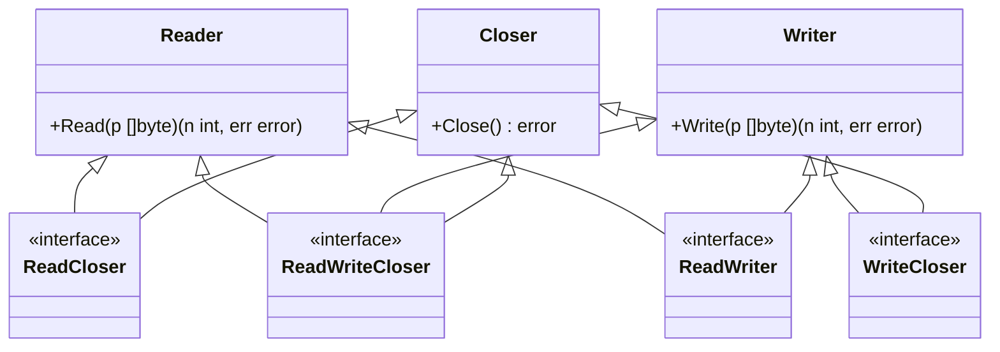
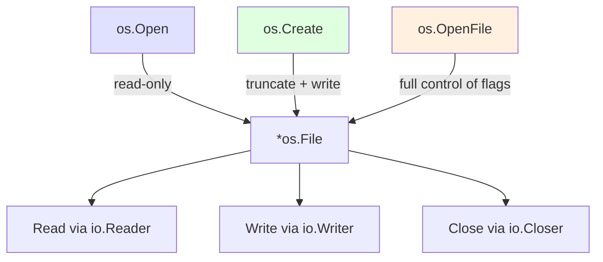
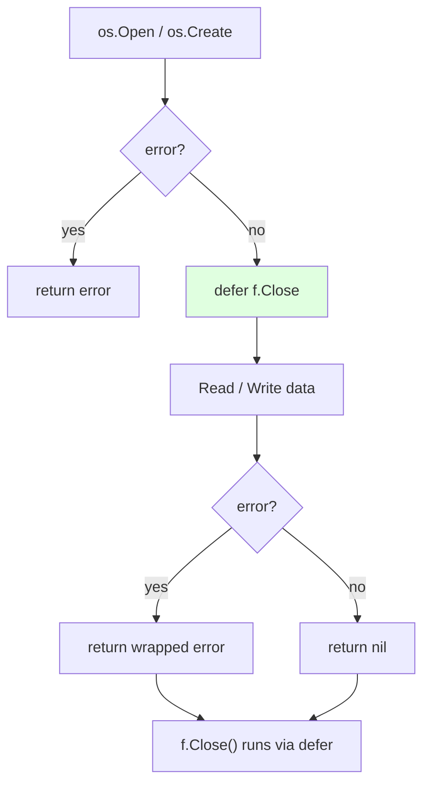

# Part 5.1 — io, os, Files, and Command Execution

The `io` package defines the interfaces for byte streams that power nearly all I/O in Go — network connections, files, buffers, HTTP bodies. The `os` package provides the bridge to the operating system: files, directories, environment variables, processes, and command execution. Together they form the backbone of any Go program that touches the outside world.

---

## Table of Contents

- [The io.Reader Interface](#the-ioreader-interface)
- [The io.Writer Interface](#the-iowriter-interface)
- [The io.Interface Hierarchy](#the-io-interface-hierarchy)
- [Standard Types Implementing Reader/Writer](#standard-types-implementing-readerwriter)
- [io Utility Functions](#io-utility-functions)
- [io.TeeReader, io.Pipe, io.MultiReader, io.LimitReader](#ioteereader-iopipe-iomultireader-iolimitreader)
- [bytes and strings Readers](#bytes-and-strings-readers)
- [fmt.Fprint / fmt.Sprint — Writing to and Reading from Streams](#fmtfprint--fmtsprint--writing-to-and-reading-from-streams)
- [bufio — Buffered I/O](#bufio--buffered-io)
- [The os Package: Files](#the-os-package-files)
- [The os Package: Directories](#the-os-package-directories)
- [os.Stat — File Information](#osstat--file-information)
- [os.Args, os.Getenv, os.Exit](#osargs-osgetenv-osexit)
- [os/exec: Running External Commands](#osexec-running-external-commands)
- [Temporary Files and Directories](#temporary-files-and-directories)
- [File Permissions](#file-permissions)
- [Error Handling with os](#error-handling-with-os)
- [Deferred File Close Patterns](#deferred-file-close-patterns)
- [Practical Example: File Copy with Progress](#practical-example-file-copy-with-progress)
- [Modern Practices](#modern-practices)
- [Common Mistakes](#common-mistakes)
- [Key Takeaways](#key-takeaways)
- [Exercises](#exercises)
- [Next](#next)

---

## The io.Reader Interface

`io.Reader` is the most important interface in Go:

```go
type Reader interface {
    Read(p []byte) (n int, err error)
}
```

`Read` reads up to `len(p)` bytes into `p`, returning the number of bytes read and any error. When it reaches the end of data, it returns `io.EOF`. Its power is that it lets you write functions that work with any source of bytes — a file, a network socket, an HTTP response body, a gzip decoder, or a buffer:

```go
func CountBytes(r io.Reader) (int, error) {
    buf := make([]byte, 4096)
    total := 0
    for {
        n, err := r.Read(buf)
        total += n
        if err == io.EOF {
            break
        }
        if err != nil {
            return total, err
        }
    }
    return total, nil
}
```

This function works with files, network connections, strings — anything that implements `Read`.

> 🔑 **Key idea:** `io.Reader` and `io.Writer` are Go's universal data-stream interfaces — code written against them works with files, sockets, buffers, and HTTP bodies alike.

### The io.EOF handling pattern

```go
for {
    var buf [128]byte
    n, err := r.Read(buf[:])
    if err == io.EOF {
        break
    }
    if err != nil {
        log.Fatal(err)
    }
    fmt.Printf("read %d bytes: %s\n", n, buf[:n])
}
```

> `Read` may return fewer bytes than requested even when more data is available. Use `io.ReadFull` for exactly `n` bytes, or `io.ReadAll` for everything.

---

## The io.Writer Interface

```go
type Writer interface {
    Write(p []byte) (n int, err error)
}
```

`Write` writes `len(p)` bytes from `p` to the underlying data stream. Returns the number of bytes written; must be `n == len(p)` or return an error.

```go
func Greet(w io.Writer, name string) {
    fmt.Fprintf(w, "Hello, %s\n", name)
}
```

`Greet` can write to a file, a network connection, a buffer, `os.Stdout` — anything that implements `Write`.

> 💡 **Pro tip:** Accept `io.Writer`/`io.Reader` parameters in your own functions — callers can then pass anything (buffers, files, network) and testing with `bytes.Buffer` becomes trivial.

---

## The io.Interface Hierarchy

Go composes `Reader`, `Writer`, and `Closer` into compound interfaces:

```go
type Closer interface {
    Close() error
}

type ReadCloser interface {
    Reader
    Closer
}

type WriteCloser interface {
    Writer
    Closer
}

type ReadWriteCloser interface {
    Reader
    Writer
    Closer
}

type ReadWriter interface {
    Reader
    Writer
}
```

An `*os.File` implements `ReadWriteCloser`. An `*http.Response.Body` implements `ReadCloser`. A `*bytes.Buffer` implements `ReadWriter`. Knowing which interfaces a type satisfies tells you what you can do with it.



---

## Standard Types Implementing Reader/Writer

| Type | Implements | Notes |
|------|-----------|-------|
| `os.File` | Reader, Writer, Closer | files on disk |
| `net.Conn` | Reader, Writer, Closer | network connections |
| `bytes.Buffer` | Reader, Writer | in-memory growable buffer |
| `bytes.Reader` | Reader | read-only over a byte slice |
| `strings.Reader` | Reader | read-only over a string |
| `http.Response.Body` | Reader, Closer | HTTP response body |
| `http.Request.Body` | Reader, Closer | HTTP request body |
| `bufio.Reader` / `Writer` | Reader / Writer | buffered wrappers |
| `gzip.Reader` / `Writer` | Reader, Writer | compressed streams |
| `crypto/...` | Reader, Writer | encryption streams |
| `os.Stdin` / `os.Stdout` / `os.Stderr` | Reader / Writer | standard streams |

The elegance: **everything is a Reader/Writer.** Files, network connections, buffers, HTTP response bodies, compressed streams, and more all implement `io.Reader` / `io.Writer`. This means a function written against `io.Reader` works with **any** data source.

> 🧠 **Memory aid:** "Everything is a Reader/Writer" is Go's metaphor for Unix's "everything is a file" — one interface, infinite data sources, including `gzip` and `crypto` streams layered on top.

---

## io Utility Functions

```go
import "io"

// Copy all from r to w (streaming, memory-efficient)
n, err := io.Copy(w, r)

// Copy up to a limit
n, err := io.CopyN(w, r, 1024)

// Read everything from r (convenient but loads all into memory)
data, err := io.ReadAll(r)     // replaces ioutil.ReadAll

// Create a new reader from a string
r := strings.NewReader("hello")

// Create a reader from a []byte
r := bytes.NewReader([]byte("hello"))

// Discard / drop writes (e.g., to measure reads)
n, _ := io.Copy(io.Discard, r_Buffer)
```

### io.Copy example — stream a file to stdout

```go
func main() {
    file, err := os.Open("data.txt")
    if err != nil {
        log.Fatal(err)
    }
    defer file.Close()

    // Copy file contents to stdout, streaming (memory-efficient)
    io.Copy(os.Stdout, file)
}
```

`io.Copy` copies from a `Reader` to a `Writer` until EOF, using an internal buffer. For copying exactly `n` bytes, use `io.CopyN(dst, src, n)`.

> ⚠️ **Watch out:** `io.ReadAll` loads everything into memory — fine for config files, a foot-gun for multi-GB streams. Prefer `io.Copy` or chunked reads when size is unknown.

---

## io.TeeReader, io.Pipe, io.MultiReader, io.LimitReader

### io.TeeReader

Returns a `Reader` that writes every byte it reads to a `Writer` as well:

```go
reader := strings.NewReader("Hello, world!")
var buf bytes.Buffer

tee := io.TeeReader(reader, &buf)
data, err := io.ReadAll(tee)
// data == "Hello, world!", buf == "Hello, world!"
```

Useful for logging or caching data as it passes through a pipeline.

### io.Pipe

Creates an in-memory pipe: a `Reader` and `Writer` connected to each other. There is no internal buffer — writes block until consumed:

```go
pr, pw := io.Pipe()

go func() {
    fmt.Fprint(pw, "hello from goroutine")
    pw.Close()
}()

data, _ := io.ReadAll(pr)
fmt.Println(string(data))
```

### io.MultiReader

Combines multiple `Readers` into one. It reads from the first until EOF, then the second, and so on:

```go
r1 := strings.NewReader("hello ")
r2 := strings.NewReader("world!")
multi := io.MultiReader(r1, r2)

data, _ := io.ReadAll(multi)
fmt.Println(string(data)) // hello world!
```

### io.MultiWriter

Write to multiple destinations at once:

```go
file1, _ := os.Create("a.txt")
file2, _ := os.Create("b.txt")
mw := io.MultiWriter(file1, file2)
fmt.Fprintf(mw, "same content to both\n")
file1.Close()
file2.Close()
```

### io.LimitReader

Wraps a `Reader` and limits it to reading at most `n` bytes:

```go
r := strings.NewReader("abcdefghijklmnopqrstuvwxyz")
limited := io.LimitReader(r, 5)

data, _ := io.ReadAll(limited)
fmt.Println(string(data)) // abcde
```

---

## bytes and strings Readers

### bytes.Buffer (writable, growable)

```go
var buf bytes.Buffer

buf.WriteString("Hello, ")
buf.Write([]byte("world"))
fmt.Println(buf.String())      // Hello, world
fmt.Println(buf.Len())         // 13
```

Use a `bytes.Buffer` when you need both a writer and later read its contents.

### bytes.Reader (read-only over a byte slice)

```go
data := []byte("hello")
r := bytes.NewReader(data)
content, _ := io.ReadAll(r)
fmt.Println(string(content))   // hello
```

### strings.Reader

```go
r := strings.NewReader("abc")
b, _ := io.ReadAll(r)
fmt.Println(string(b))  // abc
```

### strings.Builder

`strings.Builder` is the most efficient way to build strings incrementally. Unlike concatenating with `+`, which allocates a new string on every operation, `strings.Builder` uses an internal byte buffer:

```go
var b strings.Builder
b.WriteString("Hello")
b.WriteString(", ")
b.WriteString("World!")
result := b.String() // "Hello, World!"
```

Always prefer `strings.Builder` over `+` concatenation in loops. The `Grow` method lets you pre-allocate memory when you know the approximate size, avoiding reallocations.

> 💡 **Pro tip:** Never build strings with `+` inside a loop — each operation allocates a new string. `strings.Builder` builds in-place and `Grow` pre-allocates when you know the size.

---

## fmt.Fprint / fmt.Sprint — Writing to and Reading from Streams

`fmt` has `F`-prefixed variants that write to a `Writer`:

```go
var buf bytes.Buffer
fmt.Fprintf(&buf, "Value: %d\n", 42)
fmt.Fprintln(&buf, "another line")

// Common: log to a file-like destination
fmt.Fprintf(os.Stdout, "hello %s\n", "world")
```

And `S`-prefixed variants that work on strings:

```go
// Format into a string
s := fmt.Sprintf("%d-%s", 1, "a")   // "1-a"

// Scan from a string
var n int
var word string
fmt.Sscanf("42 hello", "%d %s", &n, &word)   // n=42, word="hello"
```

---

## bufio — Buffered I/O

`bufio` wraps a `Reader` / `Writer` to improve performance via buffering and adds convenience methods.

### Buffered reading with Scanner

```go
import "bufio"

file, _ := os.Open("data.txt")
defer file.Close()

scanner := bufio.NewScanner(file)
for scanner.Scan() {
    fmt.Println(scanner.Text())   // read line by line
}
if err := scanner.Err(); err != nil {
    log.Fatal(err)
}
```

> `scanner.Scan()` reads the next line (default split on newlines). Always check `scanner.Err()` after the loop.

### Scanner split functions and buffer size

```go
scanner := bufio.NewScanner(file)
scanner.Buffer(make([]byte, 1024), 1024*1024)   // increase max token size
scanner.Split(bufio.ScanWords)   // scan by words instead of lines
// others: bufio.ScanLines, ScanBytes, ScanRunes
```

### Buffered writing

```go
buf := bufio.NewWriter(os.Stdout)
buf.WriteString("hello\n")
buf.Flush()   // force the buffer to be written
```

### Custom Writer/Reader (example)

```go
// A custom Writer that uppercases input
type UpperWriter struct {
    w strings.Builder
}

func (u *UpperWriter) Write(p []byte) (int, error) {
    upper := strings.ToUpper(string(p))
    return u.w.WriteString(upper)
}

func main() {
    uw := &UpperWriter{}
    fmt.Fprint(uw, "hello world")   // uses Writer interface
}
```

---

## The os Package: Files

### os.Open

`os.Open` opens an existing file for reading:

```go
f, err := os.Open("config.txt")
if err != nil {
    log.Fatal(err)
}
defer f.Close()
```

`os.Open` returns an `*os.File`, which implements `io.Reader`, `io.Writer`, `io.Seeker`, and `io.Closer`.

### os.Create

`os.Create` creates a new file for writing, truncating if it already exists:

```go
f, err := os.Create("output.txt")
if err != nil {
    log.Fatal(err)
}
defer f.Close()
```

### os.OpenFile

`os.OpenFile` gives full control over how a file is opened:

```go
f, err := os.OpenFile("log.txt", os.O_APPEND|os.O_CREATE|os.O_WRONLY, 0644)
if err != nil {
    log.Fatal(err)
}
defer f.Close()
```

Common flags: `os.O_RDONLY`, `os.O_WRONLY`, `os.O_RDWR`, `os.O_APPEND`, `os.O_CREATE`, `os.O_TRUNC`, `os.O_EXCL`. Combine them with `|`.



### os.ReadFile and os.WriteFile

Convenience functions that read or write an entire file in one call:

```go
data, err := os.ReadFile("config.json")
if err != nil {
    log.Fatal(err)
}

err = os.WriteFile("output.txt", data, 0644)
if err != nil {
    log.Fatal(err)
}
```

Use them when the file fits in memory and you do not need streaming.

> ⚠️ **Gotcha:** `os.WriteFile` truncates the file by default — use `os.OpenFile` with `O_APPEND` if you need to append, not `WriteFile`.

### Reading files — multiple approaches

| Method | Best For |
|--------|----------|
| `os.ReadFile` | Small-to-medium files that fit in memory |
| `os.Open` + `io.ReadAll` | When you need the `*os.File` handle too |
| `os.Open` + `bufio.Scanner` | Line-by-line reading |
| `os.Open` + chunked `Read` | Large files; streaming memory-efficient |

---

## The os Package: Directories

```go
os.MkdirAll("/tmp/myapp/logs", 0755) // mkdir -p
os.RemoveAll("/tmp/myapp")           // rm -rf

entries, err := os.ReadDir(".")
if err != nil {
    log.Fatal(err)
}
for _, e := range entries {
    fmt.Printf("%-20s  dir=%v\n", e.Name(), e.IsDir())
}
```

`os.ReadDir` returns `[]os.DirEntry` without reading file metadata, making it efficient for directory listing.

> 💡 **Note:** Prefer `os.ReadDir` over the deprecated `ioutil.ReadDir` — it streams `DirEntry` values instead of loading full `FileInfo` for every file.

### Walking a directory tree

```go
import "path/filepath"

filepath.WalkDir(".", func(path string, d os.DirEntry, err error) error {
    if err != nil {
        return err
    }
    fmt.Println(path)
    return nil
})
```

### Path manipulation with path/filepath

```go
filepath.Join("a", "b", "c")              // "a/b/c" (OS-aware)
filepath.Base("/a/b.txt")                 // "b.txt"
filepath.Dir("/a/b.txt")                  // "/a"
filepath.Ext("file.go")                   // ".go"
filepath.Clean("/a/./b/../c")            // "/a/c"
abs, _ := filepath.Abs("file.txt")
```

> Use `path/filepath` (not `path` or string concatenation) for cross-platform file paths. `path.Join` always uses forward slashes, which breaks on Windows.

---

## os.Stat — File Information

`os.Stat` returns information about a file:

```go
info, err := os.Stat("file.txt")
if err != nil {
    log.Fatal(err)
}
fmt.Println("name:", info.Name(), "size:", info.Size(), "is dir:", info.IsDir())
```

Use `os.Stat` to check if a file exists, get its size, or inspect permissions before operating on it.

---

## os.Args, os.Getenv, os.Exit

```go
func main() {
    // os.Args[0] is the program name
    if len(os.Args) < 2 {
        fmt.Fprintf(os.Stderr, "usage: %s <filename>\n", os.Args[0])
        os.Exit(1)
    }

    port := os.Getenv("PORT")
    if port == "" {
        port = "8080"
    }
}
```

`os.Getenv` returns empty string if not set. Use `os.LookupEnv(key)` to distinguish "not set" from "set to empty":

```go
port, ok := os.LookupEnv("PORT")
if !ok {
    port = "8080"
}
```

For serious argument parsing, use the `flag` package.

**Important:** `defer` functions do **not** run when `os.Exit` is called. Deferred file closes and cleanup will be skipped.

> ⚠️ **Watch out:** `os.Exit` skips all deferred cleanup and buffered writes — return an error from `main` instead when you need clean shutdown.

---

## os/exec: Running External Commands

```go
import "os/exec"

cmd := exec.Command("ls", "-la")
output, err := cmd.CombinedOutput()
if err != nil {
    log.Fatal(err)
}
fmt.Println(string(output))
```

### Capturing stdout and stderr separately

```go
cmd := exec.Command("ls", "-la")
var stdout, stderr bytes.Buffer
cmd.Stdout = &stdout
cmd.Stderr = &stderr

err := cmd.Run()
if err != nil {
    fmt.Fprintf(os.Stderr, "stderr: %s\n", stderr.String())
    log.Fatal(err)
}
```

### Running with a timeout (using context)

```go
ctx, cancel := context.WithTimeout(context.Background(), 5*time.Second)
defer cancel()

cmd := exec.CommandContext(ctx, "sleep", "10")
err := cmd.Run()
```

### Checking if a command exists

```go
path, err := exec.LookPath("git")
if err != nil {
    fmt.Println("git not found")
}
```

---

## Temporary Files and Directories

```go
tmpFile, err := os.CreateTemp("", "myapp-*.log")
if err != nil {
    log.Fatal(err)
}
defer os.Remove(tmpFile.Name())
defer tmpFile.Close()

tmpDir, err := os.MkdirTemp("", "myapp-*")
if err != nil {
    log.Fatal(err)
}
defer os.RemoveAll(tmpDir)
```

The `*` in the pattern is replaced with a random string. Always clean up temporary files and directories with `defer`.

---

## File Permissions

File permissions use octal notation:

| Mode | Meaning |
|------|---------|
| `0644` | Owner read/write, group and others read |
| `0755` | Owner r/w/x, group and others r/x |
| `0700` | Owner r/w/x only |
| `0600` | Owner read/write only |

The leading zero is critical. Without it, `0644` is decimal 644, not octal 0644.

> 🧠 **Memory aid:** `0644` = owner read/write, everyone else read; `0755` = also executable; `0600` = private. The leading `0` tells Go this is octal.

---

## Error Handling with os

### os.ErrNotExist / sentinel errors

```go
_, err := os.Stat("nonexistent.txt")
if errors.Is(err, os.ErrNotExist) {
    fmt.Println("file does not exist")
} else if err != nil {
    log.Fatal(err)
}
```

Other sentinel errors: `os.ErrExist`, `os.ErrPermission`, `os.ErrClosed`.

The older `os.IsNotExist(err)` still works but `errors.Is(err, os.ErrNotExist)` is preferred because it works with wrapped errors.

### os.PathError

`os` functions often return `*os.PathError`, which wraps the underlying error with the file path:

```go
_, err := os.Open("/nonexistent/file")
if err != nil {
    var pathErr *os.PathError
    if errors.As(err, &pathErr) {
        fmt.Printf("failed on path %s: %v\n", pathErr.Path, pathErr.Err)
    }
}
```

### Wrapping errors with context

```go
func readFileSafely(path string) ([]byte, error) {
    data, err := os.ReadFile(path)
    if err != nil {
        return nil, fmt.Errorf("reading %s: %w", path, err)
    }
    return data, nil
}
```

---

## Deferred File Close Patterns

The idiomatic pattern:

```go
func readFile(path string) ([]byte, error) {
    f, err := os.Open(path)
    if err != nil {
        return nil, fmt.Errorf("opening %s: %w", path, err)
    }
    defer f.Close()

    data, err := io.ReadAll(f)
    if err != nil {
        return nil, fmt.Errorf("reading %s: %w", path, err)
    }
    return data, nil
}
```

Place `defer` immediately after the successful open. If you defer before the error check, you risk closing a nil file:

```go
// Wrong
f, _ := os.Open("file.txt")
defer f.Close() // potential nil pointer panic

// Right
f, err := os.Open("file.txt")
if err != nil {
    log.Fatal(err)
}
defer f.Close()
```

> 💡 **Pro tip:** Check the error *before* `defer f.Close()` — deferring on a nil `*os.File` from a failed open is a guaranteed panic later.

Handling close errors with named return values:

```go
func writeFile(path string, data []byte) (retErr error) {
    f, err := os.Create(path)
    if err != nil {
        return err
    }
    defer func() {
        if cerr := f.Close(); cerr != nil && retErr == nil {
            retErr = cerr
        }
    }()

    _, err = f.Write(data)
    return err
}
```



---

## Practical Example: File Copy with Progress

```go
package main

import (
    "fmt"
    "io"
    "log"
    "os"
)

type progressReader struct {
    r        io.Reader
    total    int64
    read     int64
    filename string
}

func (pr *progressReader) Read(p []byte) (int, error) {
    n, err := pr.r.Read(p)
    pr.read += int64(n)
    if pr.total > 0 {
        pct := float64(pr.read) / float64(pr.total) * 100
        fmt.Fprintf(os.Stderr, "\r%s: %.1f%% (%d/%d bytes)",
            pr.filename, pct, pr.read, pr.total)
    } else {
        fmt.Fprintf(os.Stderr, "\r%s: %d bytes", pr.filename, pr.read)
    }
    return n, err
}

func copyWithProgress(src, dst string) error {
    srcFile, err := os.Open(src)
    if err != nil {
        return fmt.Errorf("opening source: %w", err)
    }
    defer srcFile.Close()

    srcInfo, err := srcFile.Stat()
    if err != nil {
        return fmt.Errorf("stating source: %w", err)
    }

    dstFile, err := os.Create(dst)
    if err != nil {
        return fmt.Errorf("creating destination: %w", err)
    }
    defer func() {
        if cerr := dstFile.Close(); cerr != nil {
            log.Printf("closing destination: %v", cerr)
        }
    }()

    reader := &progressReader{
        r:        srcFile,
        total:    srcInfo.Size(),
        filename: srcInfo.Name(),
    }

    _, err = io.Copy(dstFile, reader)
    fmt.Fprintln(os.Stderr)
    return err
}

func main() {
    if len(os.Args) != 3 {
        fmt.Fprintf(os.Stderr, "usage: %s <src> <dst>\n", os.Args[0])
        os.Exit(1)
    }
    if err := copyWithProgress(os.Args[1], os.Args[2]); err != nil {
        fmt.Fprintf(os.Stderr, "error: %v\n", err)
        os.Exit(1)
    }
}
```

Key points: we wrap `io.Reader` with a custom type that intercepts `Read` calls. The original `srcFile` is passed as an `io.Reader` — the progress wrapper does not know or care about the file. Error messages are descriptive, using `fmt.Errorf` with `%w` for wrapping.

---

## Modern Practices

- Program to interfaces (`io.Reader`, `io.Writer`) — accept interfaces, return concrete types.
- Keep interfaces small (one or two methods) for maximum flexibility.
- Use `os.ReadFile` / `os.WriteFile` for simple whole-file operations.
- Always `defer f.Close()` immediately after opening a file.
- Use `io.Copy` for streaming large files instead of reading everything into memory.
- Use `io.CopyN` when you need to transfer exactly `n` bytes.
- Use `bufio.Scanner` or `bufio.Reader` for buffered/streaming reads.
- Use `path/filepath` (not string concatenation or `path.Join`) for cross-platform file paths.
- Use `os.CreateTemp` / `os.MkdirTemp` for temporary files instead of hard-coded paths.
- Use `errors.Is(err, os.ErrNotExist)` over the older `os.IsNotExist(err)`.
- Use `exec.CommandContext` with a `context.WithTimeout` for bounded external commands.
- Leverage `bytes.Buffer`, `bytes.Reader`, `strings.Reader` for in-memory streams.

---

## Common Mistakes

- **Not closing files** — an unclosed file leaks a file descriptor. Open many in a loop and you hit "too many open files."
- **Ignoring the error returned by `f.Close()`** — data loss on flush failure is silent.
- **Deferring close before the error check** — `defer f.Close()` after `f, _ := os.Open(...)` risks a nil pointer panic.
- **Concatenating paths with `+`** — breaks on Windows; always use `filepath.Join`.
- **Reading entire huge files into memory** — use streaming (`io.Copy`, `bufio.Scanner`, chunked reads) instead.
- **Using wrong file permissions** — e.g., `0777` instead of `0644` for files, or forgetting the leading `0` (decimal 644 instead of octal).
- **Not checking file existence before operations** — `os.Stat` + `errors.Is` is the right pattern.
- **Using `os.Exit` in library code** — libraries should return errors. `os.Exit` skips all `defer` functions.
- **Hardcoding paths** — use `os.UserHomeDir()`, environment variables, or flags instead.
- **Not cleaning up temp files** — always `defer os.Remove(f.Name())` after `os.CreateTemp`.
- **Using `path.Join` for file system paths** — use `filepath.Join` to get OS-appropriate separators.
- **Using `fmt.Sprintf` for simple type conversions** — `strconv.Itoa` is 5-10x faster for performance-critical code.

---

## Key Takeaways

1. `io.Reader`, `io.Writer`, `io.Closer` are the foundation of Go I/O.
2. Everything is a Reader/Writer → functions operate on any data source.
3. `io.Copy`, `io.ReadAll`, `io.Discard` are core utilities.
4. `bufio.Scanner` is ideal for line-based reading; always check `scanner.Err()`.
5. `fmt.Fprint*` writes to Writers; `Sprintf`/`Sscanf` work on strings.
6. Compose with `io.MultiReader`, `io.MultiWriter`, `io.TeeReader`, `io.LimitReader`.
7. `os.ReadFile`/`os.WriteFile` for simple whole-file operations.
8. `os.Open` + `defer Close()` and streaming for large files.
9. `os.OpenFile` for full control over flags and permissions.
10. `os/exec` for running external commands; `exec.CommandContext` for bounded execution.
11. Always close resources with `defer`; always handle and wrap errors (with `%w`).
12. Use `path/filepath` for cross-platform file paths.

---

## Exercises

1. Write a function `Exists(path string) (bool, error)` that checks whether a file or directory exists. Handle the case where the path exists but you lack permissions.

2. Write a function `LineCount(path string) (int, error)` that returns the number of lines in a file. Use `bufio.Scanner` for efficiency on large files.

3. Implement a `TeeWriter` that wraps an `io.Writer` and copies all written data to a second `io.Writer`. It should satisfy `io.Writer`.

4. Write a program that takes a directory path as a command-line argument and prints the total size of all `.go` files recursively. Use `os.ReadDir` and `filepath.WalkDir`.

5. Write a function `CopyDir(src, dst string) error` that copies an entire directory tree using `os.ReadDir`, `os.MkdirAll`, `os.ReadFile`, and `os.WriteFile`. Handle the case where the source is a single file versus a directory.

6. Write a program that reads a file line-by-line and writes only lines containing a given substring to a new file. The function should accept `io.Reader` and `io.Writer`, not file paths, so it can be tested with strings and buffers.

---

## Next

Continue to [02-time-json.md](02-time-json.md) for time handling and JSON encoding/decoding.
