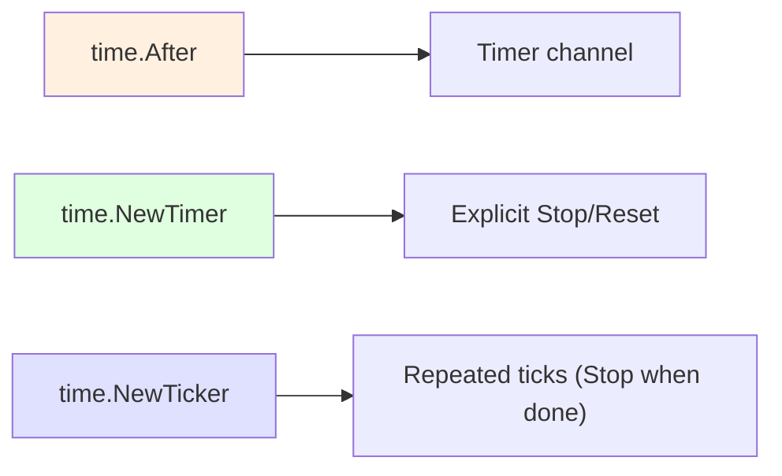
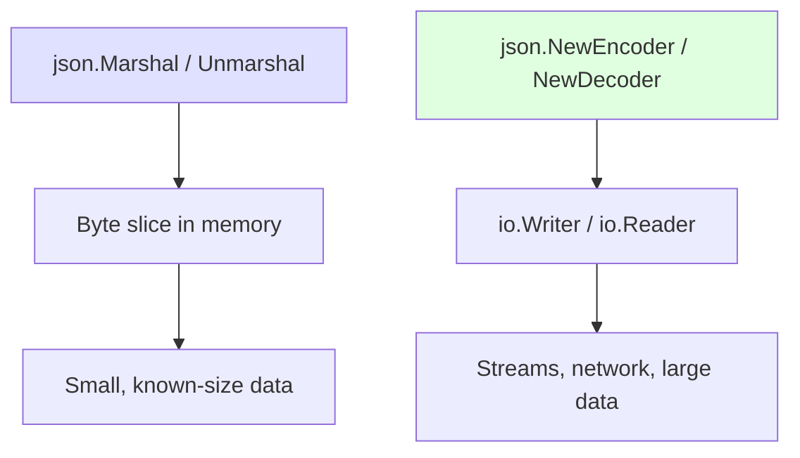

# Part 5.2 — Time Handling and JSON Encoding/Decoding

Go's standard library ships with two packages you will reach for in almost every non-trivial program: `time` for a production-grade representation of wall-clock and monotonic time, and `encoding/json` for converting Go values to and from JSON, the de facto data-exchange format of modern services.

---

## Table of Contents

- [Part 1: The time Package](#part-1-the-time-package)
  - [The time.Time Struct](#the-timetime-struct)
  - [Creating Times](#creating-times)
  - [Time Formatting and Layout Strings](#time-formatting-and-layout-strings)
  - [Comparing Times](#comparing-times)
  - [The Duration Type](#the-duration-type)
  - [Scheduling with After, Timer, and Ticker](#scheduling-with-after-timer-and-ticker)
  - [Time Zones](#time-zones)
  - [Common Formatting Patterns](#common-formatting-patterns)
- [Part 2: The encoding/json Package](#part-2-the-encodingjson-package)
  - [json.Marshal and json.Unmarshal](#jsonmarshal-and-jsonunmarshal)
  - [JSON Struct Tags](#json-struct-tags)
  - [Encoding and Decoding io](#encoding-and-decoding-io)
  - [Streaming JSON](#streaming-json)
  - [Handling JSON Numbers](#handling-json-numbers)
  - [Handling Unknown Fields with json.RawMessage](#handling-unknown-fields-with-jsonrawmessage)
  - [Custom Marshalers and Unmarshalers](#custom-marshalers-and-unmarshalers)
  - [Indent Output](#indent-output)
- [Part 3: Practical Example — JSON Configuration Reader](#part-3-practical-example--json-configuration-reader)
- [Modern Practices](#modern-practices)
- [Common Mistakes](#common-mistakes)
- [Key Takeaways](#key-takeaways)
- [Exercises](#exercises)
- [Next](#next)

---

## Part 1: The time Package

### The time.Time Struct

At the heart of the package is `time.Time`, a struct that represents an instant in time with nanosecond precision. It also carries location (time zone) information.

```go
now := time.Now()
fmt.Println(now)               // 2026-09-04 14:30:05.123456789 -0400 EDT
fmt.Println(now.Year())        // 2026
fmt.Println(now.Month())       // September
fmt.Println(now.Day())         // 4
fmt.Println(now.Hour())        // 14
fmt.Println(now.Weekday())     // Friday
```

`time.Time` also contains a hidden **monotonic clock** reading (available only when the value was obtained from `time.Now`). The monotonic reading makes comparisons and subtractions immune to wall-clock jumps caused by NTP adjustments.

> 🧠 **Memory aid:** Wall-clock time is for display, monotonic time is for measuring — Go keeps both inside `time.Time`, so durations stay correct even if the clock is adjusted.

### Creating Times

There are several ways to construct a `time.Time` value.

**time.Now()** returns the current local time:

```go
now := time.Now()
```

**time.Date()** constructs a time from individual components:

```go
t := time.Date(2026, time.September, 4, 14, 30, 0, 0, time.UTC)
fmt.Println(t) // 2026-09-04 14:30:00 +0000 UTC
```

Values that are out of range are normalized. For example, `time.Date(2026, time.February, 30, ...)` becomes March 2 (non-leap) or March 1 (leap year) because February does not have 30 days.

**time.Parse()** parses a time string according to a layout:

```go
t, err := time.Parse("2006-01-02", "2026-09-04")
if err != nil {
    log.Fatal(err)
}
fmt.Println(t) // 2026-09-04 00:00:00 +0000 UTC
```

The returned time has UTC location because no location was specified.

**time.ParseInLocation()** parses and assigns a specific location:

```go
loc, _ := time.LoadLocation("America/New_York")
t, err := time.ParseInLocation("2006-01-02 15:04", "2026-09-04 14:30", loc)
if err != nil {
    log.Fatal(err)
}
fmt.Println(t) // 2026-09-04 14:30:00 -0400 EDT
```

### Time Formatting and Layout Strings

Go does not use format specifiers like `YYYY-MM-DD`. Instead, it uses a **reference time** that encodes all the pieces in a memorable order:

```
Mon Jan 2 15:04:05 MST 2006
```

You build your format string by rearranging these reference components:

```go
t := time.Date(2026, time.September, 4, 14, 30, 0, 0, time.UTC)

fmt.Println(t.Format("2006-01-02"))                       // 2026-09-04
fmt.Println(t.Format("Monday, January 2, 2006"))          // Friday, September 4, 2026
fmt.Println(t.Format("15:04:05"))                          // 14:30:00
fmt.Println(t.Format("03:04:05 PM"))                       // 02:30:00 PM
fmt.Println(t.Format("2006-01-02T15:04:05Z07:00"))         // 2026-09-04T14:30:00Z
```

**Why a reference time instead of format patterns?** Three reasons:

1. **Locality.** The reference time is January 2, 3:04:05 PM, 2006 — numbers 1 through 12 and the full year in sequence. Once you see it, you never forget.
2. **Unambiguity.** `01` is always month, `15` is always hour. No confusion between "is 1 January or 1 o'clock?"
3. **Extensibility.** New components (like microsecond) can be added without breaking existing formats.

> 🧠 **Memory aid:** The reference time `Mon Jan 2 15:04:05 MST 2006` encodes `1 2 3 4 5 6 7` — month, day, hour, minute, second, year, zone. If a layout looks wrong, re-derive it from this one line.

The package also provides predefined constants for common formats: `time.RFC3339`, `time.RFC822`, `time.RFC1123`, `time.Kitchen`, and others.

### Comparing Times

`time.Time` values are compared with `Before`, `After`, and `Equal`:

```go
t1 := time.Date(2026, time.January, 1, 0, 0, 0, 0, time.UTC)
t2 := time.Date(2026, time.December, 31, 23, 59, 59, 0, time.UTC)

fmt.Println(t1.Before(t2))  // true
fmt.Println(t2.After(t1))   // true
fmt.Println(t1.Equal(t1))   // true
```

Do **not** use the `==` operator on `time.Time` values when monotonic clock data is involved. Two values that represent the same instant may differ in their monotonic reading. `Equal` handles this correctly.

> ⚠️ **Watch out:** Comparing `time.Time` with `==` can return `false` for the same instant due to the hidden monotonic reading — always use `t1.Equal(t2)`.

You can subtract two times to get a `time.Duration`:

```go
elapsed := t2.Sub(t1)
fmt.Println(elapsed)              // 8759h59m59s
fmt.Println(elapsed.Hours() / 24) // 365
```

### The Duration Type

`time.Duration` is an `int64` representing nanoseconds. The package defines constants for common units: `time.Nanosecond`, `time.Microsecond`, `time.Millisecond`, `time.Second`, `time.Minute`, and `time.Hour`.

Duration arithmetic works with standard operators:

```go
d := 2*time.Hour + 30*time.Minute
fmt.Println(d)                // 2h30m0s
fmt.Println(d.Minutes())      // 150
fmt.Println(d > time.Hour)    // true

sleepTime := d / 2
fmt.Println(sleepTime)        // 1h15m0s
```

Be careful when adding a `time.Duration` to a `time.Time`. The `Add` method is used, not the `+` operator:

```go
future := time.Now().Add(24 * time.Hour)
```

> `time.Duration` implements `json.Unmarshaler` directly, parsing strings like `"10s"`, `"5m"`, `"24h"`. This means durations can be serialized and deserialized in JSON config files out of the box.

### Scheduling with After, Timer, and Ticker

**time.After** returns a channel that sends a value after a specified duration:

```go
fmt.Println("waiting...")
<-time.After(2 * time.Second)
fmt.Println("done")
```

Under the hood, `time.After` creates a `time.Timer` that is never stopped. In hot loops, prefer `time.NewTimer` with an explicit `Stop`.

**time.NewTimer** creates a timer you can stop or reset:

```go
timer := time.NewTimer(5 * time.Second)

select {
case <-timer.C:
    fmt.Println("timer fired")
case <-done:
    timer.Stop()
    fmt.Println("timer stopped")
}
```

**time.NewTicker** creates a ticker that fires repeatedly at a fixed interval:

```go
ticker := time.NewTicker(500 * time.Millisecond)
defer ticker.Stop()

for i := 0; i < 5; i++ {
    <-ticker.C
    fmt.Println("tick", time.Now())
}
```

Always call `ticker.Stop()` when done. A common mistake is creating a ticker inside a loop; each iteration leaks the previous ticker.

> ⚠️ **Gotcha:** Tickers and timers hold resources until stopped or fired — in a loop, create one outside and `Stop` it explicitly, or you'll accumulate timer leaks.

**time.Sleep** blocks the current goroutine for the given duration. Prefer timers and channels for coordination in production code.



### Time Zones

Time zone information is stored as a `*time.Location`. The package provides built-in locations `time.UTC` and `time.Local`.

**time.LoadLocation** loads a location from the IANA Time Zone database:

```go
loc, _ := time.LoadLocation("America/New_York")
tokyo, _ := time.LoadLocation("Asia/Tokyo")

now := time.Now()
fmt.Println(now.Format(time.RFC3339))            // 2026-09-04T14:30:00-04:00
fmt.Println(now.In(loc).Format(time.RFC3339))    // 2026-09-04T14:30:00-04:00
fmt.Println(now.In(tokyo).Format(time.RFC3339))  // 2026-09-05T03:30:00+09:00
```

To convert between zones, use `.In`:

```go
eastern, _ := time.LoadLocation("America/New_York")
pacific, _ := time.LoadLocation("America/Los_Angeles")

t := time.Date(2026, time.September, 4, 14, 30, 0, 0, eastern)
fmt.Println(t.In(pacific).Format("15:04 MST")) // 11:30 PDT
```

### Common Formatting Patterns

| Pattern | Example Output |
|---------|---------------|
| `2006-01-02` | `2026-09-04` |
| `2006-01-02 15:04:05` | `2026-09-04 14:30:05` |
| `15:04` | `14:30` |
| `03:04:05 PM` | `02:30:05 PM` |
| `Mon Jan 2 15:04:05 2006` | `Fri Sep 4 14:30:05 2026` |
| `2006-01-02T15:04:05Z07:00` | `2026-09-04T14:30:00-04:00` |

### Time Gotchas

1. **Trailing zeros are removed.** `time.Date(2026, 9, 4, 14, 0, 0, 0, time.UTC)` formats as `14:00`, not `14:00:00`. Use a layout that includes `:05` or `:00` if you need the trailing component.

2. **Parse is strict about the reference time.** Every character in the layout that is not part of a reference component is treated as a literal. The layout `"02/01/2006"` parses `"04/09/2026"` (day before month).

3. **`time.Parse` returns UTC unless you use `ParseInLocation`.** This is a common source of bugs when parsing times that include a zone abbreviation but not an offset.

4. **Durations lose precision when formatted.** `time.Duration` truncates to the lowest non-zero unit when printed. `2*time.Hour + 30*time.Minute` prints as `2h30m0s`, not `2.5h`.

5. **Wrong formatting layout** is the single most common time mistake. Remember: `1-2-3-4-5-6-7` maps to `January-02-03:04:05-2006`.

---

## Part 2: The encoding/json Package

### json.Marshal and json.Unmarshal

`json.Marshal` converts a Go value to a JSON byte slice:

```go
type User struct {
    Name  string `json:"name"`
    Email string `json:"email"`
    Age   int    `json:"age"`
}

u := User{Name: "Alice", Email: "alice@example.com", Age: 30}
data, err := json.Marshal(u)
// {"name":"Alice","email":"alice@example.com","age":30}
```

`json.Unmarshal` does the reverse:

```go
input := `{"name":"Bob","email":"bob@example.com","age":25}`
var u User
err := json.Unmarshal([]byte(input), &u)
// u = {Name:Bob Email:bob@example.com Age:25}
```

Unmarshal is lenient about missing fields — it silently ignores them. It returns an error only if the JSON is malformed or a value cannot be converted to the target type.

> 🔑 **Key idea:** Missing JSON fields leave struct fields at their zero value and errors are only raised for malformed input — so validate thoroughly, or typos in the payload silently produce zero values.

### Marshal arbitrary types

```go
// Marshal a map
mapData, _ := json.Marshal(map[string]any{"x": 1, "y": 2})

// Marshal a slice
sliceData, _ := json.Marshal([]int{1, 2, 3})

// Pretty-print
pretty, _ := json.MarshalIndent(u, "", "  ")
```

### Unmarshal into a generic map

```go
var obj map[string]any
json.Unmarshal([]byte(`{"a":1,"b":"two","c":[1,2,3]}`), &obj)
fmt.Println(obj["a"], obj["b"])   // 1 two
```

> Numbers unmarshal into `float64` by default when using `map[string]any`. This loses precision for large integers — see [Handling JSON Numbers](#handling-json-numbers) below.

### JSON Struct Tags

Struct tags control how fields are named in JSON and what happens when a field is empty or absent:

```go
type Config struct {
    Host     string `json:"host"`
    Port     int    `json:"port"`
    Debug    bool   `json:"debug,omitempty"`
    Password string `json:"-"`                    // excluded from JSON
    Label    string `json:"label,omitempty"`      // omitted if empty
}
```

Key rules:

| Tag | Behavior |
|-----|----------|
| `json:"name"` | Renames the field to `name` in JSON output |
| `json:",omitempty"` | Omits the field when it is the zero value (`""`, `0`, `false`, `nil`, empty slice/map, zero time) |
| `json:"-"` | Skips the field entirely by both Marshal and Unmarshal |
| `json:",string"` | Encodes numeric and boolean fields as JSON strings; accepts string-encoded values on unmarshal |

#### The string tag option

```go
type Price struct {
    Amount float64 `json:"amount,string"`
}

p := Price{Amount: 19.99}
data, _ := json.Marshal(p)
fmt.Println(string(data)) // {"amount":"19.99"}

input := `{"amount":"29.50"}`
var p2 Price
json.Unmarshal([]byte(input), &p2)
fmt.Println(p2.Amount) // 29.5
```

### Encoding and Decoding io

For streaming data, use `json.NewEncoder` and `json.NewDecoder`:

```go
// Encoding to an io.Writer
var buf bytes.Buffer
enc := json.NewEncoder(&buf)
enc.SetIndent("", "  ")   // pretty-print
enc.Encode(u)             // writes JSON followed by a newline to buf

// Decoding from an io.Reader
dec := json.NewDecoder(resp.Body)
var result User
err := dec.Decode(&result)
```

`Encode` appends a trailing newline, which `Marshal` does not. `Decode` reads exactly one JSON value from the stream; extra data after the value causes an error.

### Streaming JSON

To decode a stream of newline-delimited JSON objects (JSON Lines / NDJSON):

```go
dec := json.NewDecoder(reader)
for {
    var msg Message
    err := dec.Decode(&msg)
    if err == io.EOF {
        break
    }
    if err != nil {
        log.Fatal(err)
    }
    process(msg)
}
```

This pattern is essential for reading JSON from network connections, log files, or command output where multiple objects arrive one after another.

#### Streaming Decode from a slice (dec.More)

```go
dec := json.NewDecoder(resp.Body)
for dec.More() {
    var p Product
    if err := dec.Decode(&p); err != nil {
        log.Fatal(err)
    }
    fmt.Println(p.Name)
}
```



### Handling JSON Numbers

By default, `json.Unmarshal` converts all JSON numbers to `float64`:

```go
input := `{"id": 42, "price": 9.99}`
var obj map[string]interface{}
json.Unmarshal([]byte(input), &obj)
fmt.Printf("%T %v\n", obj["id"], obj["id"])     // float64 42
```

This loses precision for large integers. Two alternatives exist.

**json.Number** preserves the original JSON representation:

```go
dec := json.NewDecoder(strings.NewReader(input))
dec.UseNumber()
var obj map[string]json.Number
dec.Decode(&obj)

id, _ := obj["id"].Int64()
fmt.Println(id) // 42
```

**Typed struct fields** avoid the problem entirely:

```go
type Item struct {
    ID    json.Number `json:"id"`
    Price json.Number `json:"price"`
}
```

### Handling Unknown Fields with json.RawMessage

`json.RawMessage` is a `[]byte` alias that holds raw JSON for later decoding:

```go
type Event struct {
    Type    string          `json:"type"`
    Payload json.RawMessage `json:"payload"`
}

input := `{
    "type": "login",
    "payload": {"user": "alice", "timestamp": 1693848000}
}`

var event Event
json.Unmarshal([]byte(input), &event)

switch event.Type {
case "login":
    var login LoginPayload
    json.Unmarshal(event.Payload, &login)
    fmt.Println(login.User)
default:
    fmt.Println("unknown event type")
}
```

This pattern is common in event-driven systems and webhook handlers.

### Custom Marshalers and Unmarshalers

Implement the `json.Marshaler` and `json.Unmarshaler` interfaces for full control over JSON encoding:

```go
type Timestamp struct {
    time.Time
}

func (t Timestamp) MarshalJSON() ([]byte, error) {
    return []byte(`"` + t.Format(time.RFC3339) + `"`), nil
}

func (t *Timestamp) UnmarshalJSON(data []byte) error {
    str := strings.Trim(string(data), `"`)
    parsed, err := time.Parse(time.RFC3339, str)
    if err != nil {
        return err
    }
    t.Time = parsed
    return nil
}
```

Now `Timestamp` serializes as a quoted RFC 3339 string instead of the default `time.Time` encoding:

```go
type Session struct {
    User string    `json:"user"`
    When Timestamp `json:"when"`
}

s := Session{
    User: "bob",
    When: Timestamp{time.Date(2026, 9, 4, 14, 30, 0, 0, time.UTC)},
}
data, _ := json.Marshal(s)
// {"user":"bob","when":"2026-09-04T14:30:00Z"}
```

The methods must have the exact signatures shown. A common mistake is using a **value receiver** on `UnmarshalJSON` — this silently does nothing because Go unmarshals into a copy.

> ⚠️ **Watch out:** `UnmarshalJSON` must use a pointer receiver — with a value receiver it compiles but silently discards the parsed value.

### Strict JSON: Disallow Unknown Fields

```go
dec := json.NewDecoder(strings.NewReader(jsonStr))
dec.DisallowUnknownFields()
// errors on fields present in JSON but not in the struct
```

### Indent Output

`json.Marshal` produces compact output. Use `json.MarshalIndent` for human-readable output:

```go
data, err := json.MarshalIndent(u, "", "  ")
if err != nil {
    log.Fatal(err)
}
fmt.Println(string(data))
```

Output:

```json
{
  "name": "Alice",
  "email": "alice@example.com",
  "age": 30
}
```

The second argument is the line prefix and the third is the indent string. For configuration files, you almost always want indented output.

> 💡 **Pro tip:** Wire struct tags (`json:"..."`) to enforce a stable API contract — `json:",omitempty"` for optional fields and `json:"-"` to keep secrets out of payloads.

---

## Part 3: Practical Example — JSON Configuration Reader

The following example reads a JSON configuration file with time durations, demonstrating both packages together:

```go
package main

import (
    "encoding/json"
    "fmt"
    "log"
    "os"
    "time"
)

type Config struct {
    Server struct {
        Host         string        `json:"host"`
        Port         int           `json:"port"`
        ReadTimeout  time.Duration `json:"read_timeout"`
        WriteTimeout time.Duration `json:"write_timeout"`
    } `json:"server"`
    Database struct {
        DSN             string        `json:"dsn"`
        MaxOpenConns    int           `json:"max_open_conns"`
        ConnMaxLifetime time.Duration `json:"conn_max_lifetime"`
    } `json:"database"`
    Cache struct {
        TTL    time.Duration `json:"ttl"`
        MaxAge time.Duration `json:"max_age"`
    } `json:"cache"`
    Debug bool `json:"debug"`
}

func loadConfig(path string) (*Config, error) {
    data, err := os.ReadFile(path)
    if err != nil {
        return nil, fmt.Errorf("reading config: %w", err)
    }

    var cfg Config
    if err := json.Unmarshal(data, &cfg); err != nil {
        return nil, fmt.Errorf("parsing config: %w", err)
    }

    if cfg.Server.Port == 0 {
        cfg.Server.Port = 8080
    }
    if cfg.Server.ReadTimeout == 0 {
        cfg.Server.ReadTimeout = 15 * time.Second
    }
    if cfg.Server.WriteTimeout == 0 {
        cfg.Server.WriteTimeout = 15 * time.Second
    }
    if cfg.Cache.TTL == 0 {
        cfg.Cache.TTL = 1 * time.Hour
    }

    return &cfg, nil
}

func main() {
    cfg, err := loadConfig("config.json")
    if err != nil {
        log.Fatal(err)
    }

    fmt.Printf("Server: %s:%d\n", cfg.Server.Host, cfg.Server.Port)
    fmt.Printf("Read timeout: %v\n", cfg.Server.ReadTimeout)
    fmt.Printf("Cache TTL: %v\n", cfg.Cache.TTL)
}
```

The corresponding `config.json`:

```json
{
    "server": {
        "host": "localhost",
        "port": 9090,
        "read_timeout": "10s",
        "write_timeout": "10s"
    },
    "database": {
        "dsn": "postgres://localhost/mydb?sslmode=disable",
        "max_open_conns": 25,
        "conn_max_lifetime": "10m"
    },
    "cache": {
        "ttl": "30m",
        "max_age": "24h"
    },
    "debug": true
}
```

`time.Duration` implements `json.Unmarshaler` directly, parsing strings like `"10s"`, `"5m"`, `"24h"`. This is one of the standard library types that works out of the box with JSON.

---

## Modern Practices

- Use `time.Duration` for timeouts and intervals, not raw integers.
- Remember the reference time `Mon Jan 2 15:04:05 MST 2006` for formatting. A common mnemonic: the date is 1/2/3 4:5:6 2007.
- Prefer `Equal` over `==` for comparing `time.Time` values.
- Use `time.NewTimer` with explicit `Stop` in hot loops instead of `time.After`.
- Always `defer ticker.Stop()` after creating a ticker.
- Use `time.ParseInLocation` when parsing times that include zone abbreviations but not numeric offsets.
- Use `json.NewDecoder` / `json.NewEncoder` for streaming JSON without buffering.
- Use struct tags (`json:"name"`, `json:",omitempty"`, `json:"-"`) to control JSON mapping.
- Use `json.Number` or typed struct fields when precision matters for large numbers.
- Use `json.RawMessage` for deferred parsing of specific fields in polymorphic payloads.
- Always implement `UnmarshalJSON` with a **pointer receiver**.
- Marshal slices, maps, and arbitrary types directly — `encoding/json` handles them.

---

## Common Mistakes

- **Wrong time formatting layout** — the single most common time mistake. Remember the reference time `2006-01-02 15:04:05`.
- **Using `==` to compare `time.Time`** — prefer `Equal` to handle monotonic clock data correctly.
- **Unmarshaling into a nil pointer** — `json.Unmarshal(data, nil)` panics. Allocate the struct first.
- **Ignoring errors from Unmarshal** — a partial unmarshal may leave the struct in an inconsistent state. Always check the error.
- **Wrong struct tag syntax** — `` `json:port` `` (without inner quotes) is a common typo. The compiler may accept it, but `encoding/json` ignores tags that do not match the `json:"..."` pattern.
- **Unexported fields are invisible to encoding/json** — only exported fields (uppercase first letter) are encoded.
- **All JSON numbers become `float64`** — if you use `map[string]interface{}` without `UseNumber()`, a large integer silently loses precision.
- **Value receiver on `UnmarshalJSON`** — silently does nothing because Go unmarshals into a copy. Always use a pointer receiver.
- **Using `fmt.Sprintf` for simple type conversions** — `strconv.Itoa` is 5-10x faster for performance-sensitive code.
- **Creating a ticker inside a loop** — each iteration leaks the previous ticker. Create once, use repeatedly.
- **JSON struct tag errors** — missing commas, wrong field names, or typos in tags cause silent data mapping failures.

---

## Key Takeaways

1. `time.Time` carries both wall-clock and monotonic time. Prefer `Equal` over `==` for comparison.
2. Go uses a reference time (`Mon Jan 2 15:04:05 MST 2006`) for formatting, not format patterns. Once you internalize the sequence 1-2-3-4-5-6-7, layouts become second nature.
3. `time.Duration` is an `int64` of nanoseconds. Use the predefined constants (`time.Second`, `time.Minute`, etc.) for clarity.
4. `time.After`, `time.NewTimer`, and `time.NewTicker` are the building blocks for time-based concurrency. Always stop timers and tickers you create.
5. `time.LoadLocation` retrieves IANA time zones. Use `.In(loc)` to convert between zones.
6. `json.Marshal` and `json.Unmarshal` are the workhorses. Struct tags control field mapping.
7. For streaming, use `json.NewEncoder` / `json.NewDecoder`. Decode in a loop for newline-delimited streams.
8. `json.Number` and `UseNumber()` prevent float64 precision loss for large integers.
9. `json.RawMessage` lets you defer parsing of specific fields.
10. Custom `MarshalJSON` / `UnmarshalJSON` methods give full control over encoding. Use pointer receivers on `UnmarshalJSON`.
11. Always handle errors from `json.Unmarshal`. Partial results are unreliable.

---

## Exercises

1. Write a function that takes a `time.Time` and returns a string in `MM/DD/YYYY HH:MM AM/PM` format (e.g., `09/04/2026 02:30 PM`).

2. Write a function that returns the number of business days (Monday through Friday) between two dates. Ignore holidays.

3. Write a function that accepts an arbitrary JSON string and returns a `map[string]interface{}` using `json.Decoder` with `UseNumber()`. Then write a helper that extracts a value by a dot-separated key path like `"server.port"`.

4. Create a `Date` type (wrapping `time.Time`) that serializes as `"2006-01-02"` in JSON. Implement both `MarshalJSON` and `UnmarshalJSON`.

5. Given a file containing one JSON object per line (NDJSON format), write a program that decodes each line into a struct and prints the count of successfully decoded records and the count of malformed lines.

6. Write a program that starts two goroutines, each producing a value after a random delay (1-3 seconds). Use `time.After` for a 4-second deadline. Print whichever value arrives first, or a timeout message if neither arrives in time.

---

## Next

Continue to [03-context-slog.md](03-context-slog.md) for context management and structured logging.
