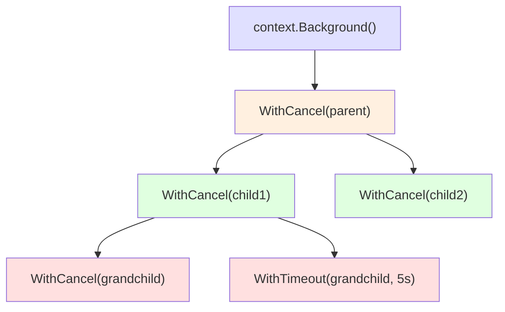
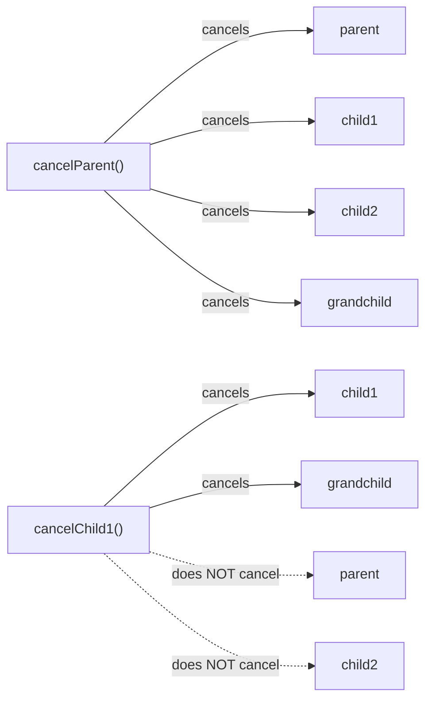
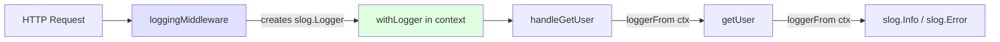

# Part 5.3 — Context and Structured Logging

When building production-grade Go applications, two standard library packages are indispensable: `context` carries deadlines, cancellation signals, and request-scoped values across API and goroutine boundaries. `log/slog` provides machine-readable, queryable structured logging. Together, they form the backbone of observable, cancellable, and maintainable server-side Go programs.

---

## Table of Contents

- [Part 1: The Context Package](#part-1-the-context-package)
  - [What Context Is](#what-context-is)
  - [context.Background() and context.TODO()](#contextbackground-and-contexttodo)
  - [context.WithCancel](#contextwithcancel)
  - [context.WithTimeout and context.WithDeadline](#contextwithtimeout-and-contextwithdeadline)
  - [context.WithValue](#contextwithvalue)
  - [Passing Context as the First Parameter](#passing-context-as-the-first-parameter)
  - [Checking context.Done() and context.Err()](#checking-contextdone-and-contexterr)
  - [Context Lifecycle and Cancellation Propagation](#context-lifecycle-and-cancellation-propagation)
  - [Why context.Context Appears in Standard Library Functions](#why-contextcontext-appears-in-standard-library-functions)
  - [Common Patterns](#common-patterns)
- [Part 2: Structured Logging with log/slog](#part-2-structured-logging-with-logslog)
  - [Why Structured Logging Matters](#why-structured-logging-matters)
  - [Basic slog Usage](#basic-slog-usage)
  - [slog.Logger vs slog.Default()](#slogger-vs-slogdefault)
  - [Creating a Logger with slog.New()](#creating-a-logger-with-slognew)
  - [slog.With() for Adding Context](#slogwith-for-adding-context)
  - [slog.Group() for Grouping Attributes](#sloggroup-for-grouping-attributes)
  - [Handler Options](#handler-options)
  - [Custom slog.Handler](#custom-sloghandler)
- [Part 3: Combining Context and Structured Logging](#part-3-combining-context-and-structured-logging)
- [Modern Practices](#modern-practices)
- [Common Mistakes](#common-mistakes)
- [Key Takeaways](#key-takeaways)
- [Exercises](#exercises)
- [Next](#next)

---

## Part 1: The Context Package

### What Context Is

A `context.Context` is a value that carries request-scoped data across a call chain. It propagates:

> 🔑 **Key idea:** A context is a bundle of cancellation signal, deadline, and request-scoped values that flows down a call chain — created at the request's origin, threaded through every function that handles it.

- **Cancellation signals** — telling downstream work to stop
- **Deadlines** — telling downstream work to stop after a time limit
- **Request-scoped values** — passing metadata like request IDs or authentication tokens

The context is created at the origin of a request (usually an HTTP handler or gRPC method) and threaded through every function that participates in handling that request.

### context.Background() and context.TODO()

```go
ctx := context.Background() // used in main, tests, or top-level initialization
ctx := context.TODO()      // used when you intend to fill in a proper context later
```

`context.Background()` is the root context. It is never cancelled, has no deadline, and carries no values. Use it in `main`, tests, and top-level initialization.

`context.TODO()` is a placeholder signaling "I know I need a context here, but I haven't wired one up yet." Useful during refactoring when threading context through a codebase. Both return an empty `context.Context`; the difference is semantic intent, not behavior.

> 🧠 **Memory aid:** `Background()` says "no cancellation here," `TODO()` says "I owe this a real context later" — both are empty, but they document intent for future readers.

### context.WithCancel

`context.WithCancel` creates a new context that can be cancelled. When cancelled, all contexts derived from it are also cancelled.

```go
ctx, cancel := context.WithCancel(context.Background())
defer cancel()

go func() {
    cancel() // signal completion
}()

select {
case <-ctx.Done():
    fmt.Println("cancelled:", ctx.Err())
}
```

The returned `cancel` function must be called exactly once. The `defer cancel()` pattern ensures cleanup. If the parent context is cancelled, the child is automatically cancelled without an explicit call.

> ⚠️ **Watch out:** Forgetting `defer cancel()` leaks the context's timer and resources until the parent is done — treat every `WithCancel`/`WithTimeout` as needing a paired `cancel`.

```go
func worker(ctx context.Context, name string) {
    for {
        select {
        case <-ctx.Done():
            fmt.Printf("%s: stopping, reason: %v\n", name, ctx.Err())
            return
        default:
            fmt.Printf("%s: working...\n", name)
            time.Sleep(500 * time.Millisecond)
        }
    }
}

func main() {
    ctx, cancel := context.WithCancel(context.Background())
    go worker(ctx, "worker-1")
    go worker(ctx, "worker-2")
    time.Sleep(2 * time.Second)
    cancel()
}
```

### context.WithTimeout and context.WithDeadline

`context.WithTimeout` creates a context that is automatically cancelled after a duration. `context.WithDeadline` creates a context that is cancelled at a specific point in time.

```go
// WithTimeout cancels after the specified duration from now.
ctx, cancel := context.WithTimeout(context.Background(), 5*time.Second)
defer cancel()

// WithDeadline cancels at the specified absolute time.
deadline := time.Now().Add(5 * time.Second)
ctx, cancel := context.WithDeadline(context.Background(), deadline)
defer cancel()
```

You must still call `defer cancel()` even when the timeout will fire automatically. This releases timer resources early when the parent context completes before the deadline. The `cancel` function is idempotent — calling it multiple times is safe.

> 💡 **Pro tip:** `cancel()` is idempotent and safe to call multiple times — so `defer cancel()` everywhere is harmless and always correct.

```go
func fetchWithTimeout(ctx context.Context) error {
    ctx, cancel := context.WithTimeout(ctx, 3*time.Second)
    defer cancel()

    req, err := http.NewRequestWithContext(ctx, "GET", "https://api.example.com/data", nil)
    if err != nil {
        return err
    }
    resp, err := http.DefaultClient.Do(req)
    if err != nil {
        return err
    }
    defer resp.Body.Close()
    return nil
}
```

### context.WithValue

`context.WithValue` attaches a key-value pair to a context:

```go
type contextKey string
const requestIDKey contextKey = "requestID"

func withRequestID(ctx context.Context, id string) context.Context {
    return context.WithValue(ctx, requestIDKey, id)
}

func getRequestID(ctx context.Context) string {
    id, ok := ctx.Value(requestIDKey).(string)
    if !ok { return "" }
    return id
}
```

The key type should be an unexported type to avoid collisions. Never use a bare string or an exported type as a key. Use `context.WithValue` sparingly and only for request-scoped data — not as a general-purpose dependency injection mechanism.

> ⚠️ **Gotcha:** Never use a plain string as a context key — any package keyed on `"userID"` collides. An unexported type alias is collision-proof.

### Passing Context as the First Parameter

The convention in Go is to pass `context.Context` as the first parameter:

```go
func GetUser(ctx context.Context, id int64) (*User, error) { ... }
func SendEmail(ctx context.Context, to, subject, body string) error { ... }
```

This makes the dependency on context explicit at every call site and enables tools and linters to verify that context is being propagated correctly.

> 🔑 **Remember:** Context as the first parameter is a Go convention linter-checked across codebases — it makes interruption support visible at every call site.

### Checking context.Done() and context.Err()

`context.Done()` returns a channel that is closed when the context is cancelled or its deadline expires:

```go
func longRunningTask(ctx context.Context) error {
    for i := 0; i < 100; i++ {
        select {
        case <-ctx.Done():
            return ctx.Err() // context.Canceled or context.DeadlineExceeded
        default:
            doWork(i)
        }
    }
    return nil
}
```

`context.Err()` returns the reason the context ended: `context.Canceled` (explicitly cancelled) or `context.DeadlineExceeded` (deadline passed). Always check `ctx.Err()` in long-running loops — without it, goroutines continue running after their parent request has been cancelled.

### Context Lifecycle and Cancellation Propagation

Cancellation propagates downward through the context tree. Cancelling a parent cancels all descendants. Cancelling a child does **not** cancel the parent or siblings:

```go
parent, cancelParent := context.WithCancel(context.Background())
child1, _ := context.WithCancel(parent)
child2, _ := context.WithCancel(parent)
grandchild, _ := context.WithCancel(child1)

cancelParent() // cancels parent, child1, child2, and grandchild

fmt.Println(parent.Err())      // context.Canceled
fmt.Println(grandchild.Err())  // context.Canceled
```

This one-way propagation allows isolated cancellation within a subtree while keeping the broader request alive.





### Why context.Context Appears in Standard Library Functions

The standard library uses context as the first parameter in many functions because it enables cancellation of I/O operations, timeout enforcement, and passing of request-scoped metadata:

```go
http.NewRequestWithContext(ctx, method, url, body)
db.QueryContext(ctx, query, args...)
exec.CommandContext(ctx, name, arg...)
tls.Dialer.DialContext(ctx, network, addr)
```

When you see a function accepting `context.Context`, it signals that the function may block and needs a way to be interrupted.

### Common Patterns

**Context in HTTP Handlers:**

```go
func handleGetUser(w http.ResponseWriter, r *http.Request) {
    ctx := r.Context() // the server creates a context per request

    user, err := db.GetUser(ctx, userID)
    if err != nil {
        if ctx.Err() == context.Canceled {
            http.Error(w, "request cancelled", 499)
            return
        }
        http.Error(w, "internal error", 500)
        return
    }
    json.NewEncoder(w).Encode(user)
}
```

**Context in Database Queries:**

```go
func (r *UserRepository) FindByEmail(ctx context.Context, email string) (*User, error) {
    row := r.db.QueryRowContext(ctx, "SELECT id, name, email FROM users WHERE email = $1", email)
    var u User
    err := row.Scan(&u.ID, &u.Name, &u.Email)
    if err != nil { return nil, err }
    return &u, nil
}
```

**Context in Goroutines:**

```go
func fanOut(ctx context.Context, items []Item) []Result {
    ctx, cancel := context.WithCancel(ctx)
    defer cancel()

    ch := make(chan Result, len(items))
    for _, item := range items {
        go func(it Item) { ch <- process(ctx, it) }(item)
    }

    results := make([]Result, 0, len(items))
    for range len(items) {
        results = append(results, <-ch)
    }
    return results
}
```

---

## Part 2: Structured Logging with log/slog

### Why Structured Logging Matters

Traditional log messages are free-form strings:

```
2025-01-15 10:30:00 ERROR Failed to fetch user 1234 from database
```

Structured logs encode data as key-value pairs:

```json
{"time":"2025-01-15T10:30:00Z","level":"ERROR","msg":"Failed to fetch user","user_id":1234,"error":"connection refused"}
```

Structured logs are machine-readable, queryable, and consistent. Log aggregators (ELK, Datadog, Loki) can parse and index them. You can filter by field: "show me all errors where `user_id=1234`." `log/slog` was introduced in Go 1.21 as the standard library's structured logging solution.

> 🔑 **Key idea:** Structured logging turns free-form text into key-value pairs — queryable by field and parseable by log aggregators, instead of string-grepping across servers.

### Basic slog Usage

```go
package main

import "log/slog"

func main() {
    slog.Info("server started", "port", 8080)
    slog.Warn("disk usage high", "percent", 87)
    slog.Error("request failed", "error", err)
    slog.Debug("processing item", "id", 42)
}
```

The function signature is always `slog.Level(string, ...any)`. The first argument is the message; subsequent arguments are key-value pairs.

### slog.Logger vs slog.Default()

`slog.Info()`, `slog.Error()`, etc. operate on the default logger. `slog.Default()` returns the default logger. You can replace the default:

```go
slog.SetDefault(slog.New(slog.NewJSONHandler(os.Stdout, nil)))
```

### Creating a Logger with slog.New()

```go
// Text output (human-readable, key=value format)
logger := slog.New(slog.NewTextHandler(os.Stdout, nil))

// JSON output (machine-readable)
logger := slog.New(slog.NewJSONHandler(os.Stdout, nil))

logger.Info("server started", "port", 8080)
```

The choice between JSON and text output is a single constructor argument. Switch between them without changing any logging calls in application code.

### slog.With() for Adding Context

`slog.With()` creates a new logger with pre-attached attributes. These attributes appear in every subsequent log entry:

```go
logger := slog.New(slog.NewJSONHandler(os.Stdout, nil))
reqLogger := logger.With("request_id", "abc-123", "user_id", 42)

reqLogger.Info("processing request")    // includes request_id and user_id
reqLogger.Error("request failed", "error", "timeout")  // also includes both
```

This eliminates repetitive attribute passing across a call chain:

> 💡 **Pro tip:** Build a per-request logger with `logger.With(...)` once at the handler boundary — every downstream `Info`/`Error` then carries request IDs and routing data for free.

```go
func handleRequest(logger *slog.Logger, r *http.Request) {
    logger = logger.With(
        "method", r.Method,
        "path", r.URL.Path,
        "remote", r.RemoteAddr,
    )
    logger.Info("request received")

    user, err := getUser(r.Context())
    if err != nil {
        logger.Error("failed to get user", "error", err)
        return
    }
    logger.Info("request completed", "user_id", user.ID)
}
```

### slog.Group() for Grouping Attributes

`slog.Group()` nests attributes under a common key:

```go
logger.Info("request processed",
    slog.Group("http",
        "method", "GET",
        "path", "/api/users",
        "status", 200,
    ),
    slog.Group("db",
        "query_time_ms", 12,
        "rows", 1,
    ),
)
```

Output:

```json
{
  "time": "2025-01-15T10:30:00Z",
  "level": "INFO",
  "msg": "request processed",
  "http": {"method": "GET", "path": "/api/users", "status": 200},
  "db": {"query_time_ms": 12, "rows": 1}
}
```

Groups are useful for avoiding flat, unprefixed attribute names in complex log entries.

> 🧠 **Memory aid:** `slog.With` attaches attributes to every entry; `slog.Group` nests them under a key — think "request->id" instead of "request_id" scattered flat fields.

### Handler Options

`NewTextHandler` and `NewJSONHandler` accept options that control output:

```go
opts := &slog.HandlerOptions{
    Level:     slog.LevelDebug, // minimum log level
    AddSource: true,            // add file and line number to each entry
}
logger := slog.New(slog.NewJSONHandler(os.Stdout, opts))
```

The level hierarchy from lowest to highest: `slog.LevelDebug` (-4), `slog.LevelInfo` (0), `slog.LevelWarn` (4), `slog.LevelError` (8).

### Custom slog.Handler

For advanced use cases, you can implement the `slog.Handler` interface:

```go
type Handler interface {
    Enabled(context.Context, Level) bool
    Handle(context.Context, Record) error
    WithAttrs([]Attr) Handler
    WithGroup(string) Handler
}
```

This is useful for sending logs to external systems, filtering entries, or adding context that cannot be expressed as attributes. For most applications, `NewJSONHandler` or `NewTextHandler` with options is sufficient.

---

## Part 3: Combining Context and Structured Logging

The natural intersection of context and structured logging is request-scoped logging:

```go
package main

import (
    "context"
    "encoding/json"
    "errors"
    "log/slog"
    "net/http"
    "os"
    "time"
)

type contextKey string
const loggerKey contextKey = "logger"

func withLogger(ctx context.Context, logger *slog.Logger) context.Context {
    return context.WithValue(ctx, loggerKey, logger)
}

func loggerFrom(ctx context.Context) *slog.Logger {
    if l, ok := ctx.Value(loggerKey).(*slog.Logger); ok { return l }
    return slog.Default()
}

func loggingMiddleware(next http.Handler) http.Handler {
    return http.HandlerFunc(func(w http.ResponseWriter, r *http.Request) {
        start := time.Now()
        logger := slog.With(
            "method", r.Method, "path", r.URL.Path,
            "remote", r.RemoteAddr,
            "request_id", time.Now().Format("20060102150405.000000"),
        )
        ctx := withLogger(r.Context(), logger)
        rw := &responseWriter{ResponseWriter: w, statusCode: http.StatusOK}
        next.ServeHTTP(rw, r.WithContext(ctx))
        logger.Info("request completed", "status", rw.statusCode,
            "duration_ms", time.Since(start).Milliseconds())
    })
}

type responseWriter struct {
    http.ResponseWriter
    statusCode int
}

func (rw *responseWriter) WriteHeader(code int) {
    rw.statusCode = code
    rw.ResponseWriter.WriteHeader(code)
}

type User struct {
    ID   int64  `json:"id"`
    Name string `json:"name"`
}

func getUser(ctx context.Context, id int64) (*User, error) {
    logger := loggerFrom(ctx)
    logger.Info("fetching user", "user_id", id)
    time.Sleep(50 * time.Millisecond)
    if id == 0 { return nil, errors.New("user not found") }
    return &User{ID: id, Name: "Alice"}, nil
}

func handleGetUser(w http.ResponseWriter, r *http.Request) {
    logger := loggerFrom(r.Context())
    user, err := getUser(r.Context(), 123)
    if err != nil {
        logger.Error("failed to get user", "error", err)
        http.Error(w, "internal error", http.StatusInternalServerError)
        return
    }
    w.Header().Set("Content-Type", "application/json")
    json.NewEncoder(w).Encode(user)
}

func main() {
    logger := slog.New(slog.NewJSONHandler(os.Stdout,
        &slog.HandlerOptions{Level: slog.LevelDebug}))
    slog.SetDefault(logger)

    mux := http.NewServeMux()
    mux.HandleFunc("GET /users/{id}", handleGetUser)

    slog.Info("server starting", "addr", ":8080")
    if err := http.ListenAndServe(":8080", loggingMiddleware(mux)); err != nil {
        slog.Error("server failed", "error", err)
        os.Exit(1)
    }
}
```

This demonstrates:

- A `loggingMiddleware` creating a per-request logger
- A context key carrying the logger through the request chain
- JSON-structured output with method, path, status, and duration
- Logger propagation from middleware to handler to service function



---

## Modern Practices

- Always pass `context.Context` as the first parameter to functions that may block.
- Use `context.WithTimeout` or `context.WithDeadline` to bound I/O operations.
- Always call `defer cancel()` after creating a derived context, even with timeout/deadline.
- Use `context.WithValue` sparingly and only for request-scoped data (request IDs, trace IDs, loggers).
- Use unexported typed keys for context values to avoid collisions.
- Check `ctx.Err()` in long-running loops and goroutines.
- Use `log/slog` (Go 1.21+) for structured, leveled logging in production.
- Prefer `slog.Info("message", "key", value)` with key-value pairs over `fmt.Sprintf` in log calls.
- Use `slog.With()` to pre-attach common attributes (request ID, component name) and avoid repetition.
- Use `slog.Group()` to organize related attributes into nested objects.
- Set `HandlerOptions.AddSource: true` in development for file/line information.
- Store loggers in context using unexported typed keys, not string keys.
- Never store context in a struct — always pass it as a function parameter.
- Use `slog.NewJSONHandler` for production and `slog.NewTextHandler` for development.

---

## Common Mistakes

### Context Mistakes

- **Storing non-request-scoped values in context:**

  ```go
  // BAD: database connection is not request-scoped
  ctx = context.WithValue(ctx, "db", db)

  // GOOD: use dependency injection or a struct field instead
  type UserService struct { db *sql.DB }
  ```

- **Not checking context cancellation in long loops:**

  ```go
  // BAD
  func processAll(ctx context.Context, items []Item) {
      for _, item := range items { process(ctx, item) }
  }

  // GOOD
  func processAll(ctx context.Context, items []Item) error {
      for _, item := range items {
          if ctx.Err() != nil { return ctx.Err() }
          process(ctx, item)
      }
      return nil
  }
  ```

- **Passing context via struct fields:**

  ```go
  // BAD — context is not meant to live in a struct
  type RequestHandler struct { ctx context.Context }

  // GOOD
  func (h *RequestHandler) Handle(ctx context.Context) { ... }
  ```

- **Forgetting to call cancel:**

  ```go
  // BAD: resources leak until the parent is cancelled
  ctx, _ := context.WithTimeout(parent, 5*time.Second)

  // GOOD
  ctx, cancel := context.WithTimeout(parent, 5*time.Second)
  defer cancel()
  ```

- **Using string keys for context values:**

  ```go
  // BAD: keys may collide with other packages
  ctx = context.WithValue(ctx, "userID", 42)

  // GOOD: use unexported typed keys
  type contextKey string
  const userIDKey contextKey = "userID"
  ctx = context.WithValue(ctx, userIDKey, 42)
  ```

### Logging Mistakes

- **Logging in a loop without level checks:**

  ```go
  // BAD: debug message is always formatted even if debug is disabled
  for _, item := range items {
      slog.Debug("processing", "id", item.ID)
  }

  // BETTER: check the level first
  logger := slog.Default()
  if logger.Enabled(context.Background(), slog.LevelDebug) {
      for _, item := range items {
          slog.Debug("processing", "id", item.ID)
      }
  }
  ```

- **Using string formatting in log messages:**

  ```go
  // BAD
  slog.Info(fmt.Sprintf("user %d created", userID))

  // GOOD
  slog.Info("user created", "user_id", userID)
  ```

- **Logging sensitive data:**

  ```go
  // BAD
  slog.Info("login attempt", "email", email, "password", password)

  // GOOD
  slog.Info("login attempt", "email", email, "success", true)
  ```

- **Creating a new logger on every call:**

  ```go
  // BAD: repeated allocation
  for i := 0; i < 1000; i++ {
      slog.With("iteration", i).Info("processing")
  }

  // GOOD: create once, reuse
  logger := slog.Default().With("component", "worker")
  for i := 0; i < 1000; i++ {
      logger.Info("processing", "iteration", i)
  }
  ```

- **Using `log.Fatal` in library code** — calls `os.Exit`, prevents cleanup of deferred functions. Return errors instead.

---

## Key Takeaways

| Concept | Key Point |
|---|---|
| `context.Background()` | Root context for top-level code |
| `context.TODO()` | Placeholder during refactoring |
| `context.WithCancel` | Explicit cancellation signal |
| `context.WithTimeout` | Auto-cancel after duration |
| `context.WithDeadline` | Auto-cancel at absolute time |
| `context.WithValue` | Request-scoped values (use sparingly) |
| `context.Done()` | Channel closed on cancellation |
| `context.Err()` | `Canceled` or `DeadlineExceeded` |
| Context propagation | One-way, parent to child |
| `slog.Info/Warn/Error/Debug` | Log at appropriate level |
| `slog.With()` | Pre-attach attributes to a logger |
| `slog.Group()` | Nest attributes under a key |
| `slog.NewJSONHandler` | Machine-readable output |
| `slog.NewTextHandler` | Human-readable output |
| `HandlerOptions.Level` | Filter messages by severity |
| Never store context in a struct | Always pass as first parameter |
| Never use bare strings as context keys | Use unexported typed keys |
| Always call `defer cancel()` | Even with timeout/deadline |

Context and structured logging are foundational to writing observable, maintainable Go services. Context gives you control over the lifecycle of operations. Structured logging gives you the ability to understand what those operations are doing. Together, they make debugging production systems tractable.

---

## Exercises

### Exercise 1: Cancellable Worker Pool

Implement a worker pool that accepts a context and processes items. The pool should stop all workers when the context is cancelled.

```go
func workerPool(ctx context.Context, jobs []int) []int {
    // 1. Create a buffered results channel
    // 2. Launch N worker goroutines that check ctx.Done()
    // 3. Send jobs to workers
    // 4. Collect and return results
}
```

### Exercise 2: Request-Scoped Logger

Write a function that extracts a user ID from a URL query parameter and logs the extraction using a structured logger stored in the context.

```go
func extractUserID(r *http.Request) (int64, error) {
    // 1. Get the logger from r.Context()
    // 2. Log "extracting user_id" with the query parameter
    // 3. Parse the query parameter to int64
    // 4. Log "user_id extracted" with the parsed value
}
```

### Exercise 3: Timeout Logger

Write a function that logs a warning if a database query takes longer than 100ms and an error if it exceeds 1s.

```go
func queryWithTimeout(ctx context.Context, query string) error {
    // 1. Create a context with 1 second timeout
    // 2. Record the start time
    // 3. Simulate a query with random duration (50-200ms)
    // 4. Log the duration using slog with appropriate level
}
```

### Exercise 4: Panic Recovery Middleware

Implement a middleware that catches panics in HTTP handlers and logs them with a stack trace and request context.

```go
func panicRecoveryMiddleware(next http.Handler) http.Handler {
    return http.HandlerFunc(func(w http.ResponseWriter, r *http.Request) {
        // 1. Use defer to catch panics
        // 2. Extract the logger from the request context
        // 3. Log the panic value, stack trace, method, path, and remote addr
        // 4. Return 500 Internal Server Error
        next.ServeHTTP(w, r)
    })
}
```

---

## Next

Continue to [04-packages-modules-project.md](04-packages-modules-project.md) for packages, modules, and project structure.
