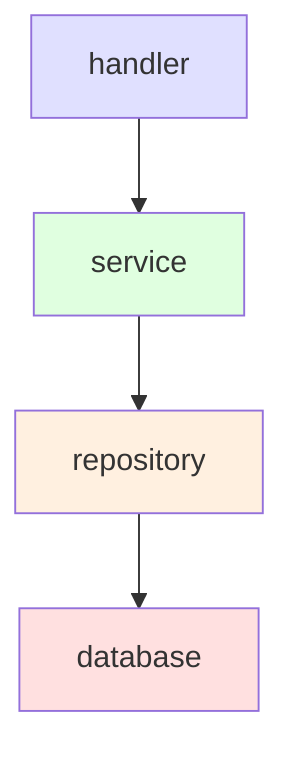
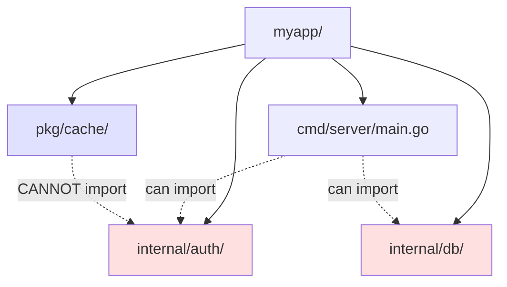

# Part 5.4 — Packages, Modules, and Project Structure

A Go program is a collection of packages. The quality of those packages — how they are named, what they expose, how they depend on each other — determines whether the codebase is maintainable or a liability. This chapter covers package design, the module system, project layout conventions, and setting up your development environment.

---

## Table of Contents

- [What is a Package?](#what-is-a-package)
- [Package Declaration](#package-declaration)
- [Exported vs Unexported Identifiers](#exported-vs-unexported-identifiers)
- [Importing Packages](#importing-packages)
- [The main Package and Executables](#the-main-package-and-executables)
- [The init Function](#the-init-function)
- [Package Naming Conventions](#package-naming-conventions)
- [Package Boundaries and Dependency Direction](#package-boundaries-and-dependency-direction)
- [Avoiding Circular Dependencies](#avoiding-circular-dependencies)
- [Modules](#modules)
- [go.sum](#gosum)
- [Working with Dependencies](#working-with-dependencies)
- [Vendor Directory](#vendor-directory)
- [The import Resolution Order](#the-import-resolution-order)
- [Internal Packages](#internal-packages)
- [Project Layout](#project-layout)
- [Idiomatic Go Best Practices](#idiomatic-go-best-practices)
- [Doc Comments](#doc-comments)
- [Package-Level State and Init](#package-level-state-and-init)
- [GoLand Setup for Go Development](#goland-setup-for-go-development)
- [Modern Practices](#modern-practices)
- [Common Mistakes](#common-mistakes)
- [Key Takeaways](#key-takeaways)
- [Exercises](#exercises)
- [Next](#next)

---

## What is a Package?

A **package** is a directory of one or more `.go` files that are compiled together. Every Go file belongs to a package, and everything in a package is accessible to other files in the same package.

```
myproject/
├── go.mod
├── main.go              (package main)
├── math/
│   ├── math.go          (package math)
│   └── math_test.go
└── utils/
    └── helpers.go       (package utils)
```

---

## Package Declaration

Every `.go` file begins with:

```go
// this file is part of package main
package main
```

- `package main` creates an **executable** program (must have `func main()`).
- Any other package name creates a **library** (reusable code).

### Package naming rules

- Package names are **lowercase**, single words (no underscores usually).
- Should be simple and meaningful (e.g., `strings`, `net/http`).
- The package name usually matches the last element of the import path.

---

## Exported vs Unexported Identifiers

Go's visibility is controlled by **capitalization** — there is no `public` / `private` keyword:

- **Uppercase first letter** → **exported** (visible outside the package).
- **Lowercase first letter** → **unexported** (only visible within package).

```go
package mypkg

func Exported() {}     // accessible from other packages
func unexported() {}   // only within this package

var PublicVar = 1      // exported
var privateVar = 2     // unexported

type PublicType struct{}   // exported
type privateType struct{}  // unexported
```

Key implications:

1. **Unexported identifiers** are invisible to importers — they are the package's internal implementation.
2. **Exported functions that return unexported types** create problems — callers receive the value but cannot name the type.
3. **Exported structs can have unexported fields** — callers access the struct but not those fields directly.

> 🔑 **Key idea:** In Go, capitalization *is* access control — uppercase means exported to the world, lowercase means private to the package. There's no `public`/`private` keyword.

```go
package config

type Config struct {
    Host string  // accessible to callers
    port int     // only accessible within config package
}

func (c *Config) Port() int {
    return c.port
}
```

The capitalization rule is Go's only access-control mechanism. Use it deliberately.

### Creating a Package (library)

```go
package greetings

import "fmt"

// Hello returns a greeting for the given name.
func Hello(name string) string {
    return fmt.Sprintf("Hello, %s!", name)
}

// helper is NOT exported (lowercase)
func helper() string {
    return "internal helper"
}

var version = "1.0.0"   // not exported
```

---

## Importing Packages

```go
// Standard library
import "fmt"
import "os"

// Multiple imports
import (
    "fmt"
    "os"
    "math/rand"
)

// Third-party (by module path)
import "github.com/gin-gonic/gin"

// Local module packages
import "myproject/math"

// Alias (rename the package)
import m "myproject/math"

// Blank import — runs init, no name bound
import _ "myproject/sideeffect"

// Custom name (avoids conflicts)
import f "fmt"
f.Println("aliased")
```

Import aliases are useful when two packages have the same name.

### Blank Import (`_`)

Use `_` to import a package **only for its side effects** (init functions):

> 💡 **Pro tip:** Blank imports (`_`) are for registration side effects like SQL drivers and image decoders — if the import has no `init`, it's noise; drop it.

```go
import (
    // Register the SQLite driver
    _ "github.com/mattn/go-sqlite3"

    // Register the PNG decoder
    _ "image/png"
)
```

Common uses: database drivers, image format decoders, and plugin registration.

---

## The main Package and Executables

```go
package main

func main() {
    // entry point
}
```

- Only the `main` package becomes a runnable binary.
- Every program needs exactly one `main` package containing `main()`.
- `main()` packages should be **thin** — they build dependencies and kick things off. Business logic lives in packages under `internal/` or `pkg/`.

> 🔑 **Remember:** `package main` is special — only it builds an executable, and it should stay thin: wire dependencies, call into real packages, and get out of the way.

---

## The init Function

Each package can have one or more `init()` functions that run automatically **once**, before `main`, when the package is first used.

```go
package config

var settings map[string]string

func init() {
    // runs automatically on import
    settings = loadFromEnv()
}
```

### init order

1. Initialize package-level variables.
2. Run `init()` functions (in dependency order, then file order).
3. Then `main()` runs.

> Use `init` sparingly. Prefer explicit initialization in constructors. `init` makes testing and reasoning about dependency order harder.

### When to use init

Use `init()` for registering drivers or plugins — the standard library does this with blank imports:

```go
import (
    _ "image/png"
    _ "image/jpeg"
)
```

Avoid `init()` for almost everything else. It executes implicitly, makes testing harder, cannot return errors, and creates hidden ordering dependencies.

```go
// BAD: silent startup dependency
func init() {
    db, _ = sql.Open("postgres", os.Getenv("DATABASE_URL"))
}

// GOOD: caller decides when to initialize, errors are explicit
func Connect(dsn string) (*sql.DB, error) {
    return sql.Open("postgres", dsn)
}
```

---

## Package Naming Conventions

Package names should be short, lowercase, single words. They identify what the package provides, not what it contains.

```go
package cache      // good
package cacheddata // bad
package httputil   // good
package httputilities // bad
```

Rules of thumb:

- **Lowercase, no underscores or camelCase.** Use `bufio`, not `buf_io`.
- **Single word when possible.** The standard library does this consistently: `fmt`, `sync`, `sort`, `math`, `time`.
- **Avoid generic names** like `common`, `util`, `base`. These tell the reader nothing.
- **Avoid stuttering.** A package under `github.com/user/myapp/cache` should not export `CacheCache`. Types should be `cache.Get()`, not `cache.CacheGet()`.

> 🧠 **Memory aid:** A package name says *what it provides*, not *what it contains* — `strings`, not `stringutilities`; `http`, not `httphelpers`.

---

## Package Boundaries and Dependency Direction

A well-designed package has a clear, focused responsibility. The key discipline is **minimizing what you export.**

Every exported identifier is a commitment. It becomes part of the package's public API, and changing it later breaks callers. Start with everything unexported. Export something only when you have a reason.

> 💡 **Pro tip:** Start private, export deliberately — every exported identifier is a public API commitment you'll have to support.

A package should do one thing. If a package handles both HTTP routing and database access, it should be two packages.

### Dependency flows downward

Dependencies should flow in one direction: **from higher-level code toward lower-level code.**



```go
// handler/handler.go — depends on service
package handler

import "github.com/user/myapp/service"

type Handler struct {
    svc *service.Service
}

// service/service.go — depends on repository
package service

import "github.com/user/myapp/repository"

type Service struct {
    repo repository.OrderRepo
}

// repository/repo.go — defines what it needs, does not import upward
package repository

type OrderRepo interface {
    Save(ctx context.Context, o Order) error
    FindByID(ctx context.Context, id string) (Order, error)
}
```

This layering enables testability (mock the repository to test the service), independence (handlers do not know about SQL), and replaceability (swap databases without touching business logic).

> 🔑 **Key idea:** Dependencies flow downward — handlers depend on services, services on repositories, repositories on the database. No layer ever imports upward.

---

## Avoiding Circular Dependencies

Go does not allow import cycles. Here are three techniques to resolve them:

### Solution 1: Extract shared types into a separate package

```go
// package model — no dependencies
package model

type Order struct {
    ID    string
    Total float64
}

// Both order and invoice import model, neither imports the other
```

### Solution 2: Define interfaces in the consumer, not the provider

```go
// package order — defines what it needs
package order

type InvoiceGenerator interface {
    Generate(o Order) error
}

type Service struct {
    invoice InvoiceGenerator
}

// package invoice — implements the interface without importing order
```

### Solution 3: Move the wiring upward

```go
package main

import (
    "github.com/user/myapp/order"
    "github.com/user/myapp/invoice"
)

func main() {
    svc := order.NewService(invoice.Generate)
}
```

---

## Modules

A **module** is a collection of packages with a shared version and identity. The `go.mod` file defines the module root.

### go.mod structure

```
module example.com/myapp        # module path

go 1.22                         # Go version

require (
    github.com/gin-gonic/gin v1.9.1
)

replace (                        # optional: local/override
    example.com/foo => ../foo
    example.com/bar => github.com/x/bar v0.1.0
)

exclude (
    github.com/old/dep v0.3.0    # optional: exclude versions
)
```

### Module path conventions

- Public modules: hostname/path (`github.com/user/repo`).
- Local/early dev: anything works (`myapp`, `example.com/mod`).
- `go mod init <path>` sets it.

> 💡 **Note:** Use a real `hostname/path` module path even for private code — it makes later publishing and tooling (Go proxy, `internal/` rules) work without a rename.

---

## go.sum

- Records **checksums** of modules' content for integrity.
- Generated automatically by `go mod tidy`, `go get`, etc.
- Should be committed to version control.

---

## Working with Dependencies

```sh
# Add a specific dependency
go get example.com/foo@v1.2.3

# Upgrade to latest
go get example.com/foo@latest

# Remove unused / sync go.mod with imports
go mod tidy

# Show all modules in build
go list -m all

# Show why a package is required
go why example.com/foo

# Verify checksums
go mod verify

# Update a specific module to a newer minor/bugfix
go get -u=patch
```

---

## Vendor Directory

Copies all dependencies into a local `vendor/` folder:

```sh
go mod vendor
go build -mod=vendor   # build using vendored deps
```

Vendoring is common in environments with restricted network access, or for reproducible builds where dependency availability is a concern.

---

## The import Resolution Order

When you `import "x/y"`:
1. Standard library (`GOROOT/src`).
2. Module dependencies (from `go.mod`).
3. Local module-relative paths.

---

## Internal Packages

Packages under a directory named `internal/` are only importable by code in the same subtree rooted at the directory **containing** `internal`.



```
project/
├── internal/
│   └── auth/          # only importable within project/
│       └── auth.go
└── main.go            # can import internal/auth
```

`internal/` is Go's built-in way to enforce that some code is private to a module (not a public API). Use it for private business logic, implementation details, and security-sensitive code.

> ⚠️ **Watch out:** `internal/` privacy is enforced by the compiler at import time — outside code literally cannot import it, so keep secrets and private logic behind it.

---

## Project Layout

There is no single mandated layout — Go's philosophy is that the package structure matters more than a prescribed folder tree. However, a common, widely-adopted layout (promoted by the community and github.com/golang-standards/project-layout) looks like this:

```
myapp/
├── go.mod                  # module definition
├── go.sum                  # dependency checksums
├── cmd/                    # executables (main packages)
│   ├── server/
│   │   └── main.go         # package main (binary "server")
│   └── cli/
│       └── main.go         # package main (binary "cli")
├── internal/               # private packages (not importable outside)
│   ├── auth/
│   │   └── auth.go
│   ├── config/
│   ├── handler/
│   ├── service/
│   └── repository/
├── pkg/                    # public reusable packages
│   └── validate/
│       └── validate.go
├── api/                    # API definitions (OpenAPI, proto, etc.)
├── configs/                # config files
├── scripts/                # build/CI scripts
├── test/                   # external test helpers/data
├── assets/                 # static assets
└── docs/                   # documentation
```

### The `cmd/` convention

Put each executable's `main` package under `cmd/<name>/`:

```
cmd/
├── server/
│   └── main.go       # package main (binary "server")
└── cli/
    └── main.go       # package main (binary "cli")
```

### The `pkg/` directory

Public code you intentionally expose to other projects lives in `pkg/`. Many Go projects keep everything in the repo root or use `internal/` only — that's fine. Use `pkg/` when you have clearly reusable, exported code.

### Simple project layout

For small programs, a flat structure is fine. Add directories when complexity demands it:

```
hello/
├── go.mod
├── main.go            # thin main
└── internal/
    └── greeting/
        ├── greeting.go
        └── greeting_test.go
```

### Putting it together — a complete multi-file project

```
myapp/
├── go.mod                      # module myapp
├── main.go                     # package main
├── internal/
│   └── cache/
│       └── cache.go            # package cache (internal only)
├── services/
│   └── user/
│       ├── user.go             # package user
│       └── user_test.go        # tests
└── pkg/                        # optional: reusable public code
    └── validate/
        └── validate.go         # package validate
```

**internal/cache/cache.go:**

```go
package cache

var m = map[string]string{}

func Set(k, v string) { m[k] = v }
func Get(k string) (string, bool) { v, ok := m[k]; return v, ok }
```

**services/user/user.go:**

```go
package user

import "myapp/internal/cache"

type User struct {
    ID   int
    Name string
}

func (u User) Save() {
    cache.Set(u.Name, u.Name)
}
```

**main.go:**

```go
package main

import (
    "fmt"
    "myapp/services/user"
)

func main() {
    u := user.User{ID: 1, Name: "Alice"}
    u.Save()
    fmt.Println("saved", u.Name)
}
```

### Greeter example — small well-structured project

```
greeter/
├── go.mod
├── cmd/
│   └── greeter/
│       └── main.go
└── internal/
    └── greeting/
        ├── greeting.go
        └── greeting_test.go
```

```go
// internal/greeting/greeting.go
package greeting

import "fmt"

// Hello returns a greeting for name.
func Hello(name string) string {
    return fmt.Sprintf("Hello, %s!", name)
}

// Shout returns an uppercase greeting.
func Shout(name string) string {
    return fmt.Sprintf("HELLO, %s!", name)
}
```

```go
// cmd/greeter/main.go
package main

import (
    "flag"
    "fmt"
    "greeter/internal/greeting"
)

func main() {
    name := flag.String("name", "world", "who to greet")
    shout := flag.Bool("shout", false, "uppercase greeting")
    flag.Parse()

    if *shout {
        fmt.Println(greeting.Shout(*name))
    } else {
        fmt.Println(greeting.Hello(*name))
    }
}
```

Run: `go run ./cmd/greeter -name Alice -shout`

---

## Idiomatic Go Best Practices

### 1. Naming

- **Packages**: lowercase, short, no underscores (`http`, `strings`).
- **Variables**: `camelCase`; use short names for short scopes (`i`, `n`).
- **Exported identifiers**: `CamelCase` (uppercase first letter).
- **Avoid** `getFoo()` for getters — use `Foo()` directly.
- **Avoid** abbreviations except well-known ones (`id`, `msg`, `buf`).

```go
// Getter idiom — just name the field/method Foo, not getFoo
func (u *User) Name() string { return u.name }
```

### 2. Error handling is explicit

- Check errors immediately; use `defer` for cleanups.
- Use `%w` to wrap errors for context.
- Don't ignore errors (or be explicit with `_ =`).

```go
if err := doThing(); err != nil {
    return fmt.Errorf("doThing: %w", err)
}
```

### 3. Avoid unnecessary nesting / handle errors first

```go
// Good: handle error, then proceed at top level
f, err := os.Open(path)
if err != nil {
    return err
}
defer f.Close()

// (avoid deep nesting of if-blocks)
```

### 4. Use `go vet`, `gofmt`, and tests

Always format and vet. Write tests for public behavior. Use table-driven tests and the race detector for concurrency.

### 5. Composition over inheritance

Use **struct embedding** and **interfaces**, not class inheritance.

### 6. Prefer `:=` for short local declarations

But be mindful of scope and shadowing.

### 7. The zero value should be useful

Design types so the zero value is meaningful (no manual init needed):

> 💡 **Pro tip:** Design types whose zero value "just works" — `bytes.Buffer`, `sync.Mutex`, `sync.WaitGroup` all do, and so should yours.

```go
// bytes.Buffer, sync.WaitGroup, sync.Mutex are zero-value ready
var buf bytes.Buffer   // no init — just use it
buf.WriteString("hi")
```

### 8. Interfaces: accept interfaces, return concrete types

```go
// Accept io.Writer (interface), return concrete struct
func SaveFile(w io.Writer, data []byte) error
```

### 9. Separate data from behavior

Keep types/data simple and small.

### 10. Don't over-engineer

- Start with the stdlib before adding frameworks.
- Only add generics/interfaces when they reduce real duplication.
- YAGNI — you ain't gonna need it.

### Common anti-patterns to avoid

| Anti-pattern | Better approach |
|--------------|-----------------|
| Package named `utils`/`common`/`helpers` | Name by responsibility (`strings`, `http`) |
| Returning `interface{}` liberally | Return concrete types or well-defined interfaces |
| Global mutable state | Pass data, use constructors, use DI where useful |
| Nested `if err != nil` deep chains | Return early / flatten |
| Ignoring errors (`_ = err`) silently | Handle or clearly discard |
| Using `init()` for core logic | Explicit constructors |
| Mixing value and pointer receivers | Be consistent per type |
| Copying a `sync.Mutex`/`WaitGroup` | Pass pointers |
| Storing large mutable structs by value | Consider pointers |
| Over-engineering project structure | Flat layout with a thin `main.go` for small apps |

---

## Doc Comments

Every exported package, function, type, and method should have a doc comment.

Package comments start with the package name:

```go
// Package greeting provides utilities for generating friendly greetings.
package greeting
```

Function and method comments start with the function name:

```go
// Hello returns a greeting for the given name.
func Hello(name string) string {
    return "Hello, " + name
}

// New creates a Cache with the specified maximum number of entries.
func New(maxSize int) *Cache { /* ... */ }
```

Do not restate the function signature in prose. Do not explain how the code works — explain what it does and why it exists.

```go
// Bad
// Add takes two ints and returns their sum
func Add(a, b int) int { return a + b }

// Good
// Add returns the sum of a and b.
func Add(a, b int) int { return a + b }
```

Use clear comments on **exported** identifiers (they show up in `go doc`). Examples (`ExampleFoo` + `// Output:`) serve as runnable docs.

---

## Package-Level State and Init

Mutable package-level state is one of the most common sources of bugs. Global variables have implicit initialization order, are not goroutine-safe without synchronization, make testing harder, and create hidden dependencies.

> ⚠️ **Gotcha:** Package-level mutable state is a hidden test-order and race hazard — prefer injecting dependencies through constructors.

```go
// Bad
var GlobalConfig Config

func Init() {
    GlobalConfig = loadConfig()
}
```

The fix: pass dependencies explicitly through constructors:

```go
// Good
type Handler struct {
    cfg *config.Config
}

func New(cfg *config.Config) *Handler {
    return &Handler{cfg: cfg}
}
```

Package-level state is acceptable when it is immutable after initialization, such as using `sync.Once` for lazy initialization of a database connection.

---

## GoLand Setup for Go Development

**JetBrains GoLand** is a dedicated IDE for Go with intelligent code completion, debugging (Delve integration), test runner, database tools, and module support.

### Prerequisites

- A Go toolchain installed. Confirm with `go version`.
- Git for version control (optional).
- A JetBrains account/license (commercial; 30-day trial available).

### Creating a New Go Project

1. **File → New → Project** → select **Go Modules**.
2. Set the **Location** and **Module name** (e.g., `example.com/myapp`).
3. Set the **Go SDK** to your installed Go version.
4. Click **Create**.

> Always open the directory **containing `go.mod`** as the project root so GoLand resolves packages correctly.

### Configuring the Go SDK (most important step)

1. **Settings → Go → GOROOT** (`Ctrl+Alt+S`).
2. Add the path to your Go installation (verify with `go env GOROOT`).
3. GoLand auto-detects `GOROOT` but setting it explicitly avoids confusion.

### Essential settings

| Setting | Where | Recommendation |
|---------|-------|----------------|
| GOROOT | Settings → Go → GOROOT | Set to your Go install dir |
| Go Modules | Settings → Go → Go Modules | Enable `go mod` integration |
| Go tools | Settings → Go → Go Tools | Install `dlv`, `gofmt`, `govulncheck` |
| Reformat on save | Settings → Tools | Keep code formatted automatically |
| File Watchers | Settings → Tools → File Watchers | Add `gofmt`/`goimports` |
| Inspections | Settings → Editor → Inspections | Enable Go-specific checks |

### Debugging with GoLand

GoLand integrates the **Delve** debugger:

1. Set a **breakpoint** by clicking the gutter next to a line.
2. Click **Debug** (bug icon) on a run configuration.
3. Use: **Step Over**, **Step Into**, **Step Out**, **Resume**, **Stop**.
4. Features: **Variables** and **Watches** panels, **Evaluate expression**, **Conditional breakpoints**.

Install Delve if missing:
```sh
go install github.com/go-delve/delve/cmd/dlv@latest
```

### Useful keyboard shortcuts (Windows/Linux)

| Action | Shortcut |
|--------|----------|
| Run | `Shift+F10` |
| Debug | `Shift+F9` |
| Navigate to definition | `Ctrl+B` |
| Find usages | `Alt+F7` |
| Search everywhere | `Double Shift` |
| Refactor / Rename | `Shift+F6` |
| Format code | `Ctrl+Alt+L` |

### Common GoLand pitfalls

1. **Wrong project root** — opened a subfolder instead of the `go.mod` dir → "cannot find package". Reopen the module root.
2. **Wrong GOROOT** — points at a different Go version → version mismatches, missing stdlib.
3. **Missing Delve** — debugging fails if `dlv` can't be found. Install it manually.
4. **Auto-download toolchain confusion** — if `go.mod` says a newer Go than installed (Go 1.21+ toolchains), GoLand may trigger downloads. Set `GOTOOLCHAIN=local` or update Go.
5. **Indexing a huge/`vendor` tree** — exclude `vendor`/big dirs from indexing (Settings → Project Structure → Excluded) to keep the IDE fast.

---

## Modern Practices

- Use Go modules (`go mod init`, `go.mod`) for all projects.
- Stick to one module per repository as the default convention.
- Use `internal/` directories for private packages not meant for external import.
- Use semantic import versioning (`module/v2`) for major version bumps.
- Run `go mod tidy` regularly to clean up unused dependencies.
- Use `go work` (Go 1.18+) for developing across multiple modules locally.
- Use the `cmd/` + `internal/` + `pkg/` layout for medium to large applications.
- Keep project structure simple for small apps — flat layout with a thin `main.go` is perfectly fine.
- Load configuration from environment variables or flags, not hardcoded values.
- Separate domain logic from transport layer (HTTP handlers, gRPC, CLI parsing).
- Keep packages small and focused — avoid "god packages" that do everything.
- Place private implementation code in `internal/` to enforce import boundaries.
- Configure project-local `GOROOT` and `GOPATH` so different projects can use different Go versions.
- Enable `gofmt` on save (File Watchers or built-in Reformat on Save) so code stays consistently formatted.
- Use GoLand's built-in HTTP client (`Tools → HTTP Client`) for quick API testing.
- Enable Go inspections and `go vet` integration to surface common mistakes at edit time.

---

## Common Mistakes

- **Ignoring or not committing `go.sum`** — breaks dependency verification.
- **Forgetting to run `go mod tidy`** after adding/removing imports.
- **Cyclic imports** between packages — compile error; extract shared types, define interfaces in consumers, or move wiring upward.
- **Mismatched package names vs. directory names** — confuses imports and readers.
- **Exporting everything** instead of keeping internals unexported for encapsulation.
- **Overusing blank imports (`_`)** without understanding init side effects.
- **Vendoring dependencies without a specific need** — adds maintenance burden.
- **The `utils` / `helpers` package** — indicates code does not have a clear home.
- **Global mutable state** — passing dependencies through constructors makes code testable and goroutine-safe.
- **Over-engineering project structure** for a small codebase that only needs a `main.go`.
- **Writing a giant `main.go`** that handles config, routing, business logic, and persistence all in one file.
- **Building god packages** that mix too many responsibilities into a single package.
- **Mixing business logic directly with HTTP handlers** or CLI argument parsing.
- **Hardcoding configuration values** instead of reading from env, flags, or config files.
- **Pointing the project at the wrong Go SDK version** in GoLand, leading to missing stdlib symbols.
- **Forgetting to configure `GOPROXY` settings**, causing module downloads to fail behind corporate firewalls.

---

## Key Takeaways

1. **Packages**: directories of `.go` files; `package main` makes executables.
2. **Visibility**: Uppercase = exported, lowercase = unexported. This is Go's only access-control mechanism.
3. **Imports**: stdlib, modules, local, aliases, blank imports. Resolution order: stdlib → go.mod → local.
4. **`init()`** runs once per package; minimize its use. Prefer explicit constructors.
5. **Modules** (`go.mod`) manage dependencies and versions. Run `go mod tidy` regularly.
6. `internal/` enforces package privacy within a module subtree.
7. No cyclic imports — resolve with extracted types, consumer interfaces, or upward wiring.
8. Keep `main` packages thin; put logic in packages.
9. Use `cmd/`, `internal/`, `pkg/` layout conventions where appropriate.
10. Write idiomatic, readable code: short names, explicit errors, `defer`, zero-value-ready types.
11. Accept interfaces, return concrete types.
12. Always `gofmt`, `go vet`, `go test`, and `-race`.
13. Document exported identifiers; provide examples.
14. GoLand needs a correctly configured **GOROOT** and must open the **module root**.

---

## Exercises

### Exercise 1: Package Audit

Take an existing Go project. List every exported identifier in each package. For each one, ask: "Does an external consumer actually need this?" Make unnecessary exports unexported.

### Exercise 2: Break a Cycle

Create two packages that import each other. Refactor to eliminate the cycle using at least two of the three techniques: extracted types, consumer-defined interfaces, upward wiring.

### Exercise 3: Redesign a Utils Package

Create a `utils` package with five unrelated helper functions. Split it into domain-specific packages, ensuring each function ends up where it belongs.

### Exercise 4: Build a Cache Package

Implement a thread-safe in-memory cache package with `New` constructor, `Set`, `Get`, `Delete`, `Len`, and `SetWithTTL` methods. Keep internal helpers unexported. Write tests for TTL expiration and benchmark concurrent access.

### Exercise 5: Project Scaffolding

Create a new Go module following the `cmd/` + `internal/` + `pkg/` layout. Implement a simple CLI tool that reads a JSON file, filters entries by a flag, and writes output. Place the entry point in `cmd/myapp/main.go`, the filtering logic in `internal/filter/filter.go`, and any reusable JSON utilities in `pkg/jsonutil/jsonutil.go`.

### Exercise 6: GoLand Walkthrough

Set up GoLand with the correct GOROOT and module root. Create a run configuration for `go run ./cmd/myapp`, a test configuration for `go test -race ./...`, and configure `gofmt` on save. Verify the debugger works with a breakpoint.

---

## Next

This completes Part 5 (Standard Library + Packages). Return to the [README](../README.md) for the full index, or continue to the next section of the course.
