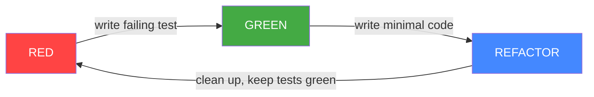
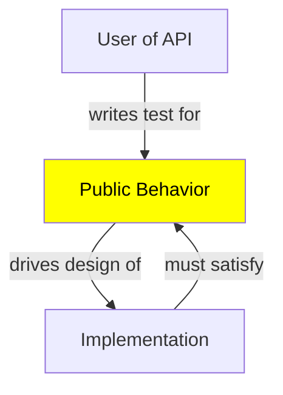
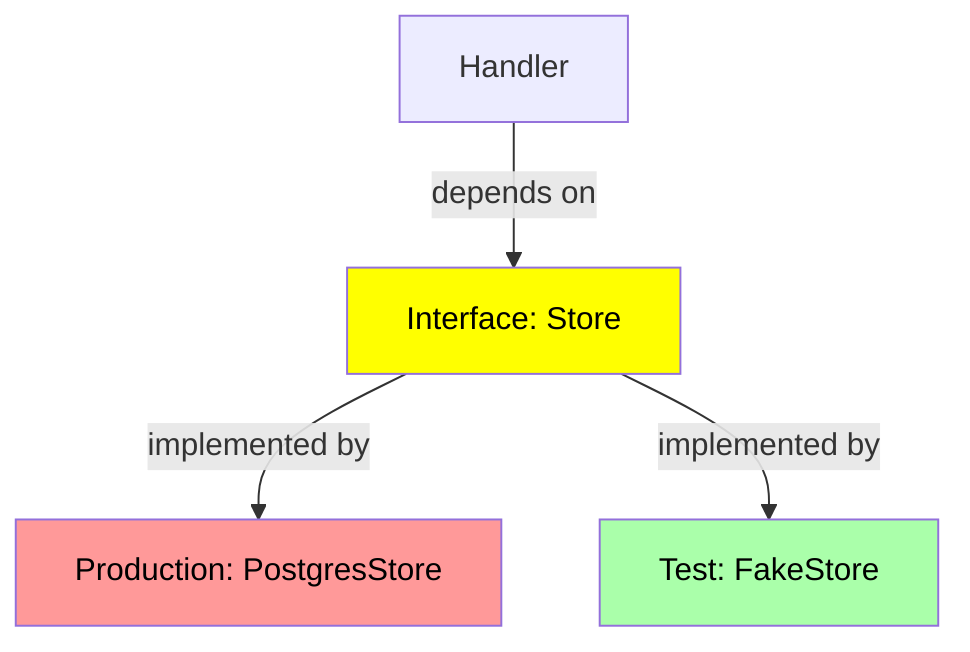
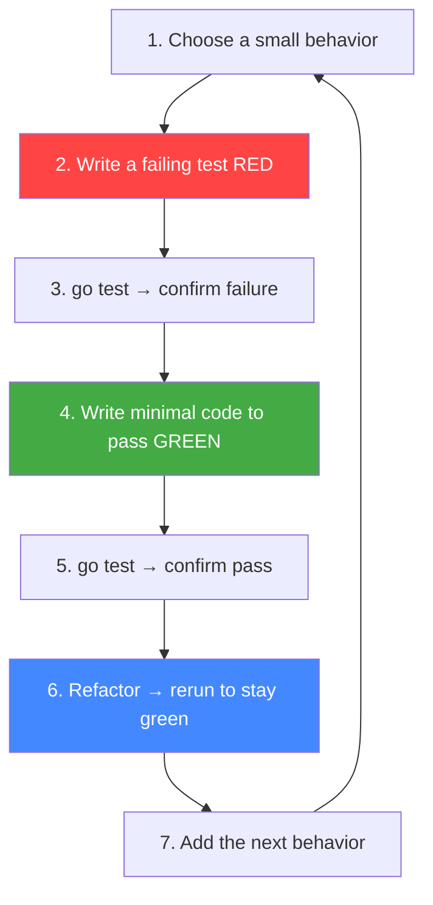

# Test-Driven Development (TDD) in Go

Test-Driven Development (TDD) is a development workflow where you write a
**failing test first**, then write the **minimum code** to make it pass, then
**refactor**. This complements [unit testing fundamentals](01-unit-testing.md)
and leads naturally into [backend testing patterns](03-backend-testing.md).

> **Red → Green → Refactor**

---

## The Cycle



1. **RED**: Write a test that fails (for behavior that doesn't exist yet).
2. **GREEN**: Write the smallest amount of code to make the test pass.
3. **REFACTOR**: Clean up the code while keeping tests green.

The tests define and lock in the behavior, driving the design from the outside
in.

> 🔑 **Key idea:** RED is not a failure state — it's proof that your test can
> actually catch the bug. If a new test goes green instantly, you've skipped the
> most important step.

---

## Why TDD Fits Go

- Go's built-in test framework (`go test`, no external framework needed) makes
  test-first natural.
- Go's simplicity makes small, focused tests easy to write and run fast.
- Go's compiler catches type errors early, so tests focus on **behavior**.
- `go test` is fast, encouraging a tight red-green loop.

---

## The Cycle in Practice

### Step 1 — RED: Write a Failing Test

Given a package `greet` we want to add a `Shout` function:

```go
// greet_test.go
package greet

import "testing"

func TestShout(t *testing.T) {
    got := Shout("hello")
    want := "HELLO!"
    if got != want {
        t.Errorf("Shout(%q) = %q; want %q", "hello", got, want)
    }
}
```

Run it — it **fails** because `Shout` doesn't exist yet (compile error), which
is the "red" state:

```sh
go test ./...
# ./greet_test.go:6:2: undefined: Shout
```

### Step 2 — GREEN: Write the Minimum Code

```go
// greet.go
package greet

import "strings"

func Shout(s string) string {
    return strings.ToUpper(s) + "!"
}
```

```sh
go test ./...   # ok
```

### Step 3 — REFACTOR

Improve the code while keeping the test green. E.g., add more cases to the
test, extract helpers, rename, etc. Re-run tests after each refactor:

```sh
go test -v ./...
```

---

## Behavior-First, Not Implementation-First

You test the **public behavior** (what the function should do), not how it's
implemented. This is why TDD encourages good API design: you write the test as a
*user* of your API before writing the implementation.



---

## A Complete Worked Example

Let's TDD a `calc` package function `AddCSV` that handles a CSV string like
`"1,2,3"`.

### 1. RED — Write the Test First

```go
// calc_test.go
package calc

import "testing"

func TestAddCSV(t *testing.T) {
    tests := []struct {
        input string
        want  int
    }{
        {"", 0},
        {"1", 1},
        {"1,2", 3},
        {"1,2,3", 6},
    }
    for _, tt := range tests {
        if got := AddCSV(tt.input); got != tt.want {
            t.Errorf("AddCSV(%q) = %d; want %d", tt.input, got, tt.want)
        }
    }
}
```

Run (red): `AddCSV is undefined`.

### 2. GREEN — Minimal Implementation

```go
// calc.go
package calc

import (
    "strconv"
    "strings"
)

func AddCSV(input string) int {
    total := 0
    for _, part := range strings.Split(input, ",") {
        if part == "" {
            continue
        }
        n, _ := strconv.Atoi(strings.TrimSpace(part))
        total += n
    }
    return total
}
```

### 3. REFACTOR — Extract and Improve

Extract the parsing into a helper and add more subtest cases. The refactor
keeps tests green and improves readability.

```go
func parseItem(s string) int {
    n, _ := strconv.Atoi(strings.TrimSpace(s))
    return n
}

func AddCSV(input string) int {
    total := 0
    for _, part := range strings.Split(input, ",") {
        if part == "" {
            continue
        }
        total += parseItem(part)
    }
    return total
}
```

---

## TDD for Error Paths

Write tests for failures *before* implementing error handling:

```go
func TestAddCSVWithError(t *testing.T) {
    _, err := AddCSVWithError("1,x,3")
    if err == nil {
        t.Fatal("expected an error for invalid input")
    }
}
```

Then implement the error path, then refactor. Don't forget: write tests for
error cases too, not just happy paths.

---

## TDD Triangulation

When you're not sure a rule is implemented right, **triangulate** by adding
more distinguishing tests that force the implementation to be more general:

```go
func TestAddCSVTriangulate(t *testing.T) {
    if got := AddCSV("1,2"); got != 3 {
        t.Errorf("want 3, got %d", got)
    }
    if got := AddCSV("10,20,30"); got != 60 {
        t.Errorf("want 60, got %d", got)
    }
    if got := AddCSV("-1,5"); got != 4 {
        t.Errorf("want 4, got %d", got)
    }
}
```

Each test forces the implementation to be more general. Start with the simplest
implementation that passes the current tests; add tests that demand more
sophistication, and let the implementation evolve.

> 🧠 **Think of it as:** Triangulation is like narrowing a location on a map — each
> additional test is another bearing that pins the implementation down until only
> one behavior fits.

---

## Dependency Injection for Testability

TDD naturally leads you to **inject dependencies** so you can test in
isolation. If a function talks to a database, define an interface and pass it in
— then you can test with a fake.



> 🔑 **Remember:** Write the test the way a *caller* would use the API. The test is
> the first consumer, so it pulls the design toward clean, ergonomic function
> signatures — not the other way around.

### Define the Interface at the Consumer

```go
type Store interface {
    Get(id string) (User, error)
}

func GetUserName(s Store, id string) (string, error) {
    u, err := s.Get(id)
    if err != nil {
        return "", err
    }
    return u.Name, nil
}
```

### The TDD Test Uses a Fake

```go
type fakeStore struct{ users map[string]User }

func (f fakeStore) Get(id string) (User, error) {
    if u, ok := f.users[id]; ok {
        return u, nil
    }
    return User{}, ErrNotFound
}

func TestGetUserName(t *testing.T) {
    s := fakeStore{users: map[string]User{"1": {Name: "Alice"}}}
    name, err := GetUserName(s, "1")
    if err != nil {
        t.Fatal(err)
    }
    if name != "Alice" {
        t.Errorf("want Alice, got %s", name)
    }
}
```

### Constructor Injection

Pass dependencies through the constructor. The struct never creates its own
collaborators.

```go
type NotificationService struct {
    mailer Mailer
    logger Logger
}

func NewNotificationService(mailer Mailer, logger Logger) *NotificationService {
    return &NotificationService{mailer: mailer, logger: logger}
}
```

In production: `NewNotificationService(realMailer, realLogger)`.
In tests: `NewNotificationService(fakeMailer, fakeLogger)`.

> 💡 **Pro tip:** "Accept interfaces, return structs" keeps dependencies swappable.
> Build fakes for the interface in tests; the production struct never knows the
> difference.

### Interface Injection (Small Interfaces)

Define small interfaces for each dependency. The consumer only depends on the
methods it actually calls. This follows the Go proverb: "Accept interfaces,
return structs."

```go
type Mailer interface {
    Send(to, subject, body string) error
}

type Logger interface {
    Info(msg string, args ...any)
    Error(msg string, args ...any)
}
```

### Functional Options for Optional Dependencies

```go
type Server struct {
    handler http.Handler
    auth    Authenticator
}

type Option func(*Server)

func WithAuth(a Authenticator) Option {
    return func(s *Server) { s.auth = a }
}

func NewServer(handler http.Handler, opts ...Option) *Server {
    s := &Server{handler: handler}
    for _, opt := range opts {
        opt(s)
    }
    return s
}
```

In tests, omit `WithAuth` when you don't need it, or provide a test double.

> ⚠️ **Watch out:** Optional injected dependencies default to zero-value `nil`. If the
> server code calls `s.auth` without a guard, omitting `WithAuth` in a test produces
> a nil-pointer panic instead of a clean test failure.

> This dependency-injection pattern is the bridge from TDD fundamentals to
> [backend testing](03-backend-testing.md).

---

## TDD for Concurrency

Test-first a function that squares numbers concurrently. First write the test
that asserts correctness and race-freedom:

```go
func TestParallelSquares(t *testing.T) {
    got := parallelSumSquares([]int{1, 2, 3, 4})
    if got != 30 {   // 1+4+9+16
        t.Errorf("got %d, want 30", got)
    }
}
```

Run with `-race`. Then implement:

```go
func parallelSumSquares(nums []int) int {
    ch := make(chan int, len(nums))
    var wg sync.WaitGroup
    for _, n := range nums {
        wg.Add(1)
        go func(v int) {
            defer wg.Done()
            ch <- v * v
        }(n)
    }
    wg.Wait()
    close(ch)
    sum := 0
    for s := range ch {
        sum += s
    }
    return sum
}
```

The `-race` run validates the concurrency.

> ⚠️ **Gotcha:** `-race` only proves the code you exercised is race-free. Gate your
> concurrency TDD on `go test -race ./...` in CI so new races can't sneak past the
> green state.

---

## TDD Workflow Summary



Run with `-race` and `-cover` as appropriate.

### TDD and `go test` Features You'll Rely On

| Feature | TDD Role |
|---------|----------|
| `go test` | run all tests (red/green check) |
| `go test -run TestX` | run one test during red phase |
| `-race` | catch concurrency bugs in behavior |
| `go test -cover` | see how much behavior is tested |
| table-driven tests | grow behavior case-by-case |
| `t.Run` subtests | isolate failing scenarios |
| `t.Fatal` vs `t.Error` | stop vs continue on failure |

---

## Exercises

### Exercise 1: TDD a String Processor

TDD a `Normalize(s string) string` function that lowercases a string, trims
whitespace, and collapses multiple spaces into one. Start with the test, observe
the red, implement minimally, then refactor.

### Exercise 2: TDD with Error Paths

TDD a `ParseEmail(s string) (string, error)` that validates email format.
Write the error test first (`errors.Is` with a sentinel), then implement the
error path.

### Exercise 3: TDD with DI

TDD a `NotificationService` that sends messages. Define a `Mailer` interface,
test with a fake, then implement the real version.

### Exercise 4: TDD Triangulation

TDD a `FizzBuzz(n int) string` using triangulation. Start with the simplest
case (return the number as a string), then add tests for multiples of 3, 5,
and both. Each test forces the implementation to become more general.

---

## Modern Practices

- Follow the Red-Green-Refactor cycle strictly; **observe the red** before
  writing implementation.
- Write **behavior-first tests**, not implementation-detail tests.
- Use table-driven tests to grow coverage case-by-case without duplicating
  structure.
- Always run `go test -race` to catch concurrency bugs in behavior.
- Use fuzzing (`testing.F`) to discover edge cases you did not anticipate.
- Inject dependencies via interfaces to make code testable in isolation.
- Write example tests that double as documentation in `go doc` output.
- Keep the red-green loop tight: small tests, small implementations, fast
  feedback.

---

## Common Mistakes

- **Writing the implementation before the test** — if it's green immediately
  (RED not observed), you haven't actually driven behavior from the test.
- **Testing implementation details** (private functions, internals) rather than
  behavior — tests break on refactor for no reason.
- **Skipping the refactor step** — TDD is three steps; skipping the third leaves
  duplicated/messy code.
- **Writing tests that don't actually assert** (no `t.Fatal`/`t.Error`).
- **Over-testing trivial code** — don't TDD everything; focus on logic worth
  locking in.
- **Over-mocking** everything instead of using simple fakes or real objects.
  Mock external I/O boundaries (network, disk, time). Test pure logic directly.
- **Leaving global state uncontrolled**, making tests non-deterministic.
- **Writing timing-dependent tests** that are flaky across machines.
- **Coupling tests to execution order** or shared mutable state.

---

## Key Takeaways

1. TDD = **Red → Green → Refactor**; write the failing test first.
2. Test **behavior**, not implementation, so refactors keep tests green.
3. Use `go test` (and `-run`, `-race`, `-cover`) as the TDD loop.
4. **Triangulate** with more cases to force generality.
5. Write tests for **error paths** too, not just happy paths.
6. TDD promotes **dependency injection** and good API design.
7. TDD is a practice, not a tool — consistency matters.

---

## Next

Continue to [03-backend-testing.md](03-backend-testing.md) for testing Go HTTP
servers, databases, and integration flows.
