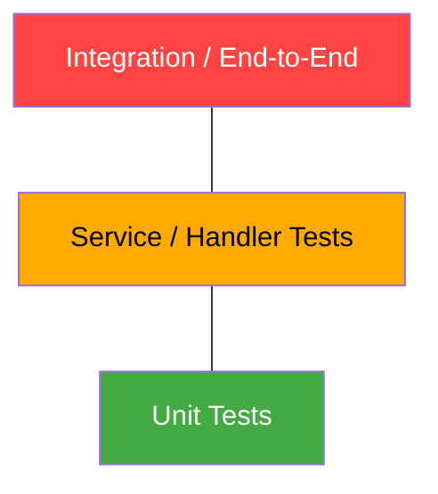
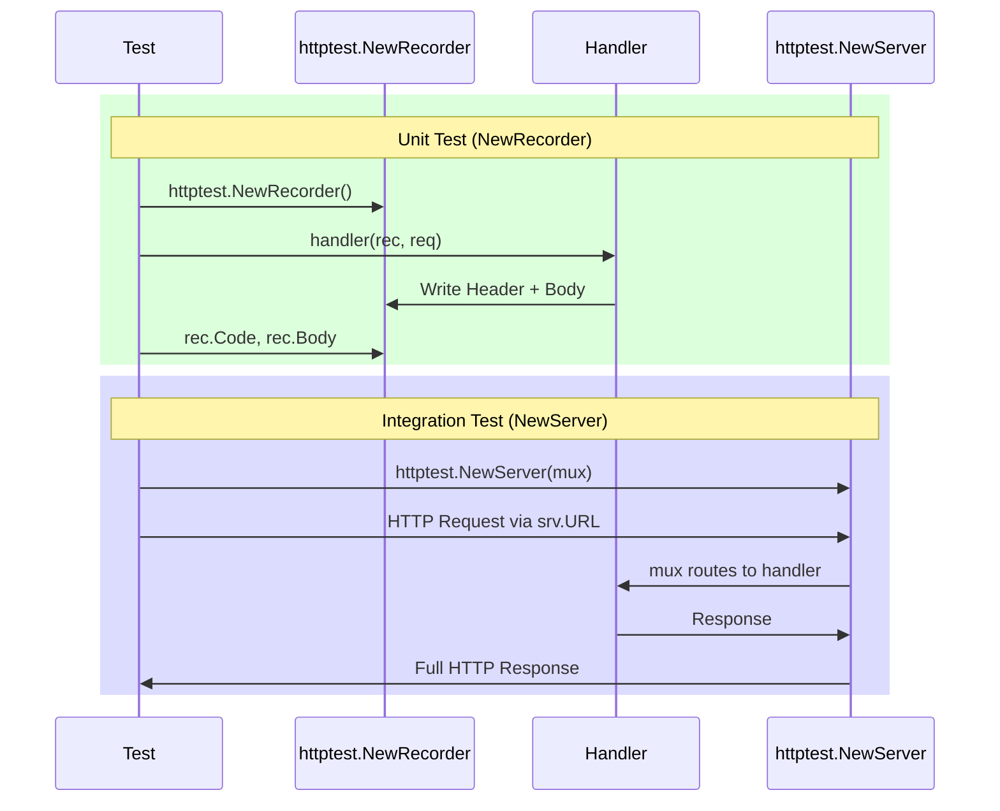
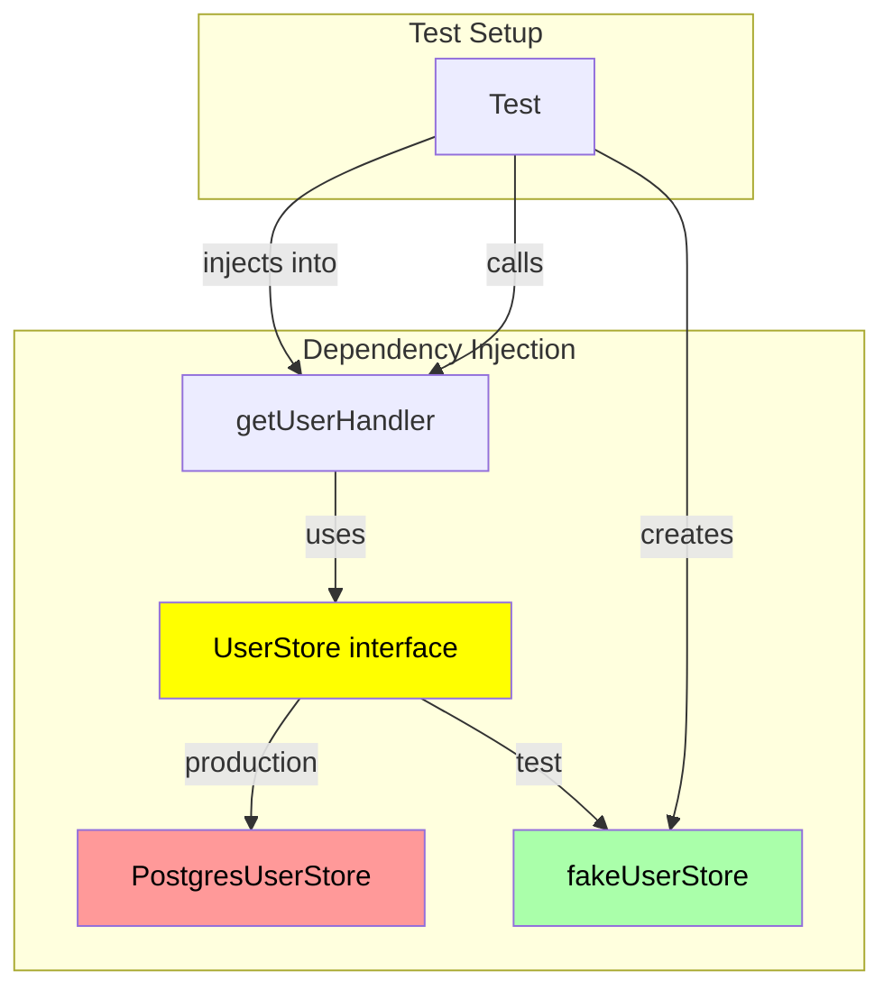
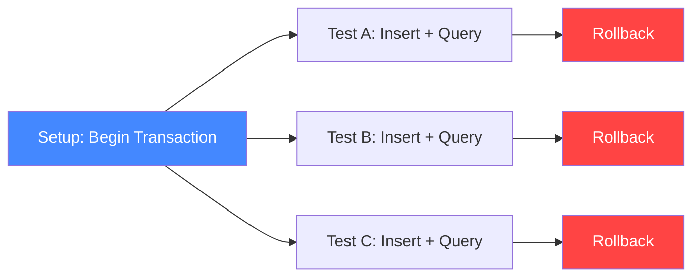

# Backend Testing in Go

Testing Go backend services requires specific strategies for HTTP
handlers/middleware, database layers, mocks, and integration flows. This builds
on [unit testing fundamentals](01-unit-testing.md) and the
[dependency-injection mindset from TDD](02-tdd.md).

---

## The Backend Test Pyramid



```
          (few)        Integration / end-to-end
         (some)        Service / handler tests (httptest)
        (many)         Unit tests (functions, logic, pure functions)
```

- **Unit tests**: pure logic — parsers, validators, business rules. Fast, many.
- **Handler tests**: use `net/http/httptest` to exercise HTTP handlers with
  fake dependencies.
- **Integration tests**: real database/subsystem interactions (often gated
  behind build tags or env vars).

> 🔑 **Key idea:** The pyramid is a ratio, not a rulebook. Write lots of fast unit
> tests, a moderate layer of handler tests, and only a few slow integration tests —
> and keep the whole thing green before you stand up a real database.

---

## Testing HTTP Handlers with `httptest`

Go's standard library provides `net/http/httptest` for testing HTTP code
without starting a real server. Two primary tools:

- `httptest.NewRecorder` — records an HTTP response in memory.
- `httptest.NewServer` — spins up a temporary HTTP server on a random port.

### Request Flow



### `httptest.NewRecorder` — Unit Testing Handlers

```go
func GreetingHandler(w http.ResponseWriter, r *http.Request) {
    name := r.URL.Query().Get("name")
    if name == "" {
        http.Error(w, "missing name parameter", http.StatusBadRequest)
        return
    }
    w.Header().Set("Content-Type", "application/json")
    w.WriteHeader(http.StatusOK)
    json.NewEncoder(w).Encode(Message{Text: "Hello, " + name})
}
```

```go
package handler

import (
    "encoding/json"
    "net/http"
    "net/http/httptest"
    "testing"
)

func TestGreetingHandler(t *testing.T) {
    tests := []struct {
        name     string
        query    string
        wantCode int
        wantBody Message
    }{
        {
            name:     "valid name",
            query:    "name=Alice",
            wantCode: http.StatusOK,
            wantBody: Message{Text: "Hello, Alice"},
        },
        {
            name:     "missing name",
            query:    "",
            wantCode: http.StatusBadRequest,
        },
    }

    for _, tt := range tests {
        t.Run(tt.name, func(t *testing.T) {
            req := httptest.NewRequest(http.MethodGet, "/greet?"+tt.query, nil)
            rec := httptest.NewRecorder()

            GreetingHandler(rec, req)

            if rec.Code != tt.wantCode {
                t.Errorf("status = %d, want %d", rec.Code, tt.wantCode)
            }

            if tt.wantCode == http.StatusOK {
                var msg Message
                if err := json.NewDecoder(rec.Body).Decode(&msg); err != nil {
                    t.Fatalf("decode body: %v", err)
                }
                if msg != tt.wantBody {
                    t.Errorf("body = %+v, want %+v", msg, tt.wantBody)
                }
            }
        })
    }
}
```

Key points:

- `httptest.NewRequest` builds a request with the correct method, URL, headers,
  and body.
- `httptest.NewRecorder` captures the status code, headers, and body.
- No server is started, no ports are bound, no network calls are made. The
  handler is invoked as a plain function.

> 💡 **Pro tip:** `httptest.NewRecorder` makes handler tests run at function-call
> speed — no sockets, no ports, no cleanup. Reach for it first; promote to
> `NewServer` only when you need real round-trips.

### Reading the Request Body in Tests

```go
func TestCreateHandler(t *testing.T) {
    req := httptest.NewRequest(http.MethodPost, "/create",
        strings.NewReader(`{"name":"Alice"}`))
    req.Header.Set("Content-Type", "application/json")

    rec := httptest.NewRecorder()
    createHandler(rec, req)

    if rec.Code != http.StatusCreated {
        t.Fatalf("code = %d; want 201", rec.Code)
    }
}
```

### `httptest.NewServer` — Full Round-Trip Tests

When you need to test code that makes HTTP requests (client libraries, full
server setups), spin up a real HTTP server on localhost:

```go
func TestServerEndToEnd(t *testing.T) {
    mux := http.NewServeMux()
    mux.HandleFunc("/hello", helloHandler)

    server := httptest.NewServer(mux)
    defer server.Close()

    resp, err := http.Get(server.URL + "/hello?name=Alice")
    if err != nil {
        t.Fatal(err)
    }
    defer resp.Body.Close()

    body, _ := io.ReadAll(resp.Body)
    if string(body) != "Hello, Alice!" {
        t.Fatalf("got %q", string(body))
    }
}
```

`srv.URL` contains the base URL (e.g., `http://127.0.0.1:54321`). Always
`defer srv.Close()` to release the port.

> ⚠️ **Watch out:** Not closing `resp.Body` or `srv` leaks ports and goroutines
> across tests. Use `t.Cleanup`/`defer` religiously — a leaked server is a flaky
> suite.

---

## Testing HTTP Middleware

Middleware wraps a handler. Test it by wrapping a known handler and checking
behavior.

```go
func requireAuth(next http.Handler) http.Handler {
    return http.HandlerFunc(func(w http.ResponseWriter, r *http.Request) {
        token := r.Header.Get("Authorization")
        if token != "secret" {
            http.Error(w, "unauthorized", http.StatusUnauthorized)
            return
        }
        next.ServeHTTP(w, r)
    })
}

func TestRequireAuth(t *testing.T) {
    var called bool
    wrapped := requireAuth(http.HandlerFunc(func(w http.ResponseWriter, r *http.Request) {
        called = true
        w.WriteHeader(http.StatusOK)
    }))

    // Without token → 401, handler not called
    req := httptest.NewRequest(http.MethodGet, "/", nil)
    rec := httptest.NewRecorder()
    wrapped.ServeHTTP(rec, req)
    if rec.Code != http.StatusUnauthorized {
        t.Fatalf("want 401, got %d", rec.Code)
    }
    if called {
        t.Fatal("handler should not run without auth")
    }

    // With token → 200, handler called
    called = false
    req2 := httptest.NewRequest(http.MethodGet, "/", nil)
    req2.Header.Set("Authorization", "secret")
    rec2 := httptest.NewRecorder()
    wrapped.ServeHTTP(rec2, req2)
    if rec2.Code != http.StatusOK {
        t.Fatalf("want 200, got %d", rec2.Code)
    }
    if !called {
        t.Fatal("handler should have run")
    }
}
```

### Testing a Logging Middleware

```go
func TestLoggingMiddleware(t *testing.T) {
    var logged string
    logger := http.HandlerFunc(func(w http.ResponseWriter, r *http.Request) {})
    mid := func(next http.Handler) http.Handler {
        return http.HandlerFunc(func(w http.ResponseWriter, r *http.Request) {
            logged = r.URL.Path
            next.ServeHTTP(w, r)
        })
    }
    mid(logger).ServeHTTP(httptest.NewRecorder(),
        httptest.NewRequest(http.MethodGet, "/foo", nil))
    if logged != "/foo" {
        t.Fatalf("logged = %q; want /foo", logged)
    }
}
```

> 🧠 **Think of it as:** A middleware test is like a bouncer test — wrap a stub that
> flips a "was I called?" flag, then poke the wrapper with requests and assert on
> both the status code AND the flag.

---

## Fake Store Injection

Real backends talk to databases/caches/external APIs. To test handlers in
isolation, **inject dependencies** behind interfaces and use fakes.



### Define the Interface at the Consumer

```go
type UserStore interface {
    Get(id string) (User, error)
}

type getUserHandler struct {
    store UserStore
}

func (h *getUserHandler) ServeHTTP(w http.ResponseWriter, r *http.Request) {
    id := r.PathValue("id")
    u, err := h.store.Get(id)
    if err != nil {
        http.Error(w, "not found", http.StatusNotFound)
        return
    }
    json.NewEncoder(w).Encode(u)
}
```

### Test with a Fake

```go
type fakeUserStore struct {
    users map[string]User
}

func (f *fakeUserStore) Get(id string) (User, error) {
    if u, ok := f.users[id]; ok {
        return u, nil
    }
    return User{}, ErrNotFound
}

func TestGetUserHandler(t *testing.T) {
    h := &getUserHandler{store: &fakeUserStore{users: map[string]User{
        "1": {ID: "1", Name: "Alice"},
    }}}

    req := httptest.NewRequest(http.MethodGet, "/users/1", nil)
    req.SetPathValue("id", "1")
    rec := httptest.NewRecorder()
    h.ServeHTTP(rec, req)

    if rec.Code != http.StatusOK {
        t.Fatalf("want 200, got %d", rec.Code)
    }
    var u User
    if err := json.Unmarshal(rec.Body.Bytes(), &u); err != nil {
        t.Fatal(err)
    }
    if u.Name != "Alice" {
        t.Fatalf("got %s", u.Name)
    }
}
```

### Mock vs Fake vs Stub

| Type | Purpose |
|------|---------|
| **Stub** | Returns predetermined data. No assertions on how it was called. |
| **Mock** | Records calls and verifies they happened as expected. |
| **Fake** | A lightweight working implementation (e.g., in-memory DB). |

Prefer the simplest fake that works. Introduce a mock framework (testify/mock,
gomock) only when fakes get unwieldy.

> 🔑 **Remember:** A stub returns canned data, a mock also verifies *how* it was
> called, and a fake is a real (in-memory) implementation. Start with the simplest
> thing that makes your test honest.

```go
// Manual fake — simplest, often enough
type retryingStore struct{ fails int }
func (f *retryingStore) Get(id string) (User, error) {
    if f.fails > 0 {
        f.fails--
        return User{}, ErrDBDown
    }
    return User{ID: id}, nil
}
```

```go
// testify/mock example
type MockStore struct {
    mock.Mock
}
func (m *MockStore) Get(id string) (User, error) {
    args := m.Called(id)
    return args.Get(0).(User), args.Error(1)
}

// Usage in test:
m := new(MockStore)
m.On("Get", "1").Return(User{Name: "Alice"}, nil)
// ... run code that calls Get
m.AssertExpectations(t)
```

---

## Database Testing

### In-Memory Database (Fast Unit Tests)

```go
func setupTestDB(t *testing.T) *sql.DB {
    t.Helper()
    db, err := sql.Open("sqlite3", ":memory:")
    if err != nil {
        t.Fatalf("open: %v", err)
    }

    schema := `
        CREATE TABLE users (
            id INTEGER PRIMARY KEY AUTOINCREMENT,
            name TEXT NOT NULL,
            email TEXT NOT NULL UNIQUE
        );
    `
    if _, err := db.Exec(schema); err != nil {
        t.Fatalf("create schema: %v", err)
    }
    t.Cleanup(func() { db.Close() })
    return db
}
```

- `:memory:` gives a fresh DB per test — isolated and fast.
- `t.Cleanup` closes the DB when the test finishes.

> 💡 **Pro tip:** SQLite `:memory:` is the fastest way to test SQL logic without
> mocks. Beware one gotcha: each connection gets its OWN in-memory database —
> share a single `*sql.DB` (not fresh connections) or your tables will vanish.

### Transactional Test Isolation

For tests that mutate state, wrap each test in a transaction and roll back so
tests are independent.



```go
func withTx(t *testing.T, db *sql.DB) *sql.Tx {
    t.Helper()
    tx, err := db.Begin()
    if err != nil {
        t.Fatal(err)
    }
    t.Cleanup(func() { tx.Rollback() }) // undo mutations
    return tx
}

func TestCreateAndGetUser(t *testing.T) {
    db := setupTestDB(t)
    ctx := context.Background()

    tx, err := db.BeginTx(ctx, nil)
    if err != nil {
        t.Fatalf("begin tx: %v", err)
    }
    defer tx.Rollback()

    store := &UserStore{db: tx}

    if err := store.CreateUser(ctx, "Alice", "alice@example.com"); err != nil {
        t.Fatalf("CreateUser: %v", err)
    }

    name, err := store.GetUser(ctx, "alice@example.com")
    if err != nil {
        t.Fatalf("GetUser: %v", err)
    }
    if name != "Alice" {
        t.Errorf("name = %q, want %q", name, "Alice")
    }
}
```

Each test gets a fresh in-memory database (SQLite) or a rolled-back transaction
(Postgres/MySQL). Tests never interfere with each other.

> ⚠️ **Watch out:** If a test commits its transaction, the rollback-on-cleanup
> trick silently stops isolating tests. Keep the transaction uncommitted so each
> test honestly starts from a clean slate.

### Integration Tests with Build Tags

Integration tests that need a real DB (Postgres/MySQL) are gated with a build
tag so they don't run in casual `go test`:

```go
//go:build integration

package store

import (
    "database/sql"
    "os"
    "testing"

    _ "github.com/lib/pq"
)

func TestCreateUser(t *testing.T) {
    dsn := os.Getenv("TEST_DB_DSN")
    if dsn == "" {
        t.Skip("TEST_DB_DSN not set")
    }
    db, err := sql.Open("postgres", dsn)
    if err != nil {
        t.Fatalf("open db: %v", err)
    }
    defer db.Close()
    // ... actual test against a real database
}
```

Run only integration tests:

```sh
go test -tags=integration ./...
```

> 💡 **Note:** The `//go:build integration` tag must be followed by a blank line
> before the `package` clause — otherwise it's treated as a doc comment and the
> gate won't work. Same trick gates `testcontainers-go` suites.

### Testcontainers-Go

For tests that need a real Postgres, MySQL, Redis, or Kafka instance, the
`testcontainers-go` library starts a Docker container:

```go
//go:build integration

package store

import (
    "context"
    "testing"
    "time"

    "github.com/testcontainers/testcontainers-go"
    "github.com/testcontainers/testcontainers-go/wait"
)

func TestWithRealPostgres(t *testing.T) {
    ctx := context.Background()

    req := testcontainers.ContainerRequest{
        Image:        "postgres:16",
        ExposedPorts: []string{"5432/tcp"},
        Env: map[string]string{
            "POSTGRES_DB":       "testdb",
            "POSTGRES_USER":     "test",
            "POSTGRES_PASSWORD": "test",
        },
        WaitingFor: wait.ForListeningPort("5432/tcp").WithStartupTimeout(30 * time.Second),
    }

    container, err := testcontainers.GenericContainer(ctx, testcontainers.GenericContainerRequest{
        ContainerRequest: req,
        Started:          true,
    })
    if err != nil {
        t.Fatalf("start container: %v", err)
    }
    defer container.Terminate(ctx)

    host, _ := container.Host(ctx)
    port, _ := container.MappedPort(ctx, "5432")

    dsn := "postgres://test:test@" + host + ":" + port.Port() + "/testdb?sslmode=disable"
    // use dsn to connect and run tests...
}
```

---

## Testing JSON APIs End-to-End

Combine `httptest.NewServer` with the real mux and a fake store for an
integration-style test of the HTTP layer with deterministic behavior:

```go
func TestUserAPI(t *testing.T) {
    store := &fakeUserStore{users: map[string]User{}}

    mux := http.NewServeMux()
    uh := &userHandler{store: store}
    mux.HandleFunc("POST /users", uh.Create)
    mux.HandleFunc("GET /users/{id}", uh.Get)
    mux.HandleFunc("DELETE /users/{id}", uh.Delete)

    srv := httptest.NewServer(mux)
    defer srv.Close()

    // Create
    createResp, err := http.Post(srv.URL+"/users", "application/json",
        strings.NewReader(`{"name":"Alice"}`))
    if err != nil {
        t.Fatal(err)
    }
    if createResp.StatusCode != http.StatusCreated {
        t.Fatalf("want 201, got %d", createResp.StatusCode)
    }

    // Get
    getResp, err := http.Get(srv.URL + "/users/1")
    if err != nil {
        t.Fatal(err)
    }
    // ... assert body
}
```

> 🔑 **Key idea:** End-to-end JSON tests glue the real `ServeMux` to a fake store —
> you exercise routing, middleware, and serialization without ever touching a
> database.

---

## Mocking External Services

When your code calls a third-party API, use `httptest.NewServer` to simulate it:

```go
func TestGetTemperature(t *testing.T) {
    tests := []struct {
        name     string
        city     string
        response WeatherResponse
        status   int
        wantTemp float64
        wantErr  bool
    }{
        {
            name:     "success",
            city:     "London",
            response: WeatherResponse{TempC: 15.3},
            status:   http.StatusOK,
            wantTemp: 15.3,
        },
        {
            name:    "city not found",
            city:    "Atlantis",
            status:  http.StatusNotFound,
            wantErr: true,
        },
    }

    for _, tt := range tests {
        t.Run(tt.name, func(t *testing.T) {
            srv := httptest.NewServer(http.HandlerFunc(func(w http.ResponseWriter, r *http.Request) {
                w.WriteHeader(tt.status)
                if tt.status == http.StatusOK {
                    json.NewEncoder(w).Encode(tt.response)
                }
            }))
            defer srv.Close()

            temp, err := GetTemperature(srv.URL, tt.city)
            if (err != nil) != tt.wantErr {
                t.Errorf("error = %v, wantErr %v", err, tt.wantErr)
                return
            }
            if temp != tt.wantTemp {
                t.Errorf("temp = %f, want %f", temp, tt.wantTemp)
            }
        })
    }
}
```

---

## Testing with `t.Parallel()`

Mark independent tests as parallel to speed up the suite:

```go
func TestHello(t *testing.T) {
    t.Parallel()
    // ...
}
```

Caveat: tests that share mutable state (same fake store) must NOT run in
parallel — they would race. Use separate fakes per parallel test.

> ⚠️ **Gotcha:** `t.Parallel()` pauses the test until its parent returns, then runs
> siblings concurrently. That's exactly when two tests sharing a fake store start
> stomping on each other — give each parallel test its own fresh state.

---

## Setting Up and Tearing Down Resources

```go
func TestSuite(t *testing.T) {
    store := newTestDB(t)   // registers t.Cleanup
    t.Run("insert", func(t *testing.T) {
        // uses store
    })
    t.Run("query", func(t *testing.T) {
        // uses store
    })
}
```

Use `t.Cleanup` instead of `defer` — cleanup runs even if the test fails and
works correctly from helpers and subtests.

---

## Strategy: Which Tests to Write

| Layer | Testing Approach |
|-------|------------------|
| Pure logic / validators | table-driven unit tests |
| Repository/DB layer | in-memory DB or real DB behind build tag |
| Handlers | `httptest.NewRecorder` + injected fake store |
| Middleware | wrap a stub handler, assert behavior |
| Full HTTP flow | `httptest.NewServer` + real mux |
| Client code | `httptest.NewServer` for a fake remote |
| External API calls | fake/mock the client interface |

> 🧠 **Memory aid:** "Recorder → Server → Container" is the escalation ladder.
> Start pure with `NewRecorder`, go up to `NewServer` for round-trips, and reach
> for `testcontainers` only when you genuinely need a real dependency.

---

## Exercises

### Exercise 1: HTTP Handler Test

Write an HTTP handler `SearchHandler` that accepts a `GET` request with a `q`
query parameter. Return a JSON response `{"query": "<q>", "count": <len>}`.
Return 400 if `q` is empty.

Write tests using `httptest.NewRecorder` that cover: a valid query, a missing
query parameter, and an empty query parameter.

### Exercise 2: Test Double with Interface

Define a `TempReader` interface: `ReadTemperature(city string) (float64, error)`.
Write a `WeatherAlert` struct that takes a `TempReader` and a threshold. Create
a test stub that returns a fixed temperature, and write tests for temperatures
above, below, and exactly at the threshold.

### Exercise 3: Integration Test with Build Tag

Write a test file with `//go:build integration`. Connect to a real SQLite
in-memory database, create a `users` table, insert a row, query it back and
verify. Run with `go test -tags=integration -run TestSQLite`.

### Exercise 4: Concurrent Code Test

Write a `SafeMap` struct backed by `sync.RWMutex` with `Set` and `Get` methods.
Write a test that launches 100 goroutines each doing 500 `Set` calls, then
verifies all 50000 keys exist. Run with `-race`.

### Exercise 5: `httptest.NewServer` API Mock

Write `GetPrice(apiBase, symbol string) (float64, error)` that calls
`GET /price?symbol=<symbol>`. Use `httptest.NewServer` to mock the API. Write
table-driven tests covering: success, unknown symbol (404), malformed JSON, and
server unreachable.

### Exercise 6: Test Fixture Loading

Create `testdata/users.json` with an array of user objects. Write
`LoadUsers(path string) ([]User, error)` and a test that loads the fixture and
verifies the count and field values.

### Exercise 7: Time-Based Code Testing

Write `IsBusinessHours(loc *time.Location) bool`. Refactor to accept a
`time.Time` parameter instead of calling `time.Now()` directly. Write tests
with specific times for boundary conditions (8:59, 9:00, 16:59, 17:00).

---

## Best Practices for Backend Tests

1. **Inject dependencies via interfaces** so you can fake I/O.
2. **Use `httptest.NewRecorder`** for handler unit tests; `NewServer` for
   integration-style flows.
3. **Test status codes, headers, and response bodies** — not just "no error".
4. **Use `t.Cleanup`** for cleanup (runs on failure too).
5. **Keep tests deterministic** — no real network, fix time, isolate DB state.
6. **Test both happy paths and error paths** (401, 404, validation errors).
7. **Use `-race`** when tests exercise goroutines.
8. **Gate real-DB integration tests** with build tags.
9. **Prefer in-memory DB** (`:memory:` SQLite) for speed in unit tests.
10. **Avoid testing implementation details** — test behavior via the API.

---

## Modern Practices

- Use `httptest.NewRecorder` for unit-testing handlers and `httptest.NewServer`
  for full round-trip tests.
- Inject fake stores via interfaces so handler tests never touch a real database.
- Use transactional test isolation: begin a transaction in setup, roll back in
  cleanup.
- Mark independent tests with `t.Parallel()` to speed up the suite safely.
- Test JSON APIs end-to-end by asserting status codes, headers, and response
  bodies.
- Use simple fakes over mock frameworks until fakes get unwieldy.
- Use `testcontainers-go` for real-database integration tests in CI.
- Use build tags to separate fast unit tests from slow integration tests.

---

## Common Mistakes

- **Testing only the happy path** and missing 401, 404, and validation-error
  branches.
- **Running unit tests against a real database**, making them slow and flaky.
- **Not isolating transactions between tests**, causing state leakage.
- **Asserting on exact error strings** instead of sentinel or typed error checks.
- **Running parallel tests that share mutable state**, creating race conditions.
- **Ignoring middleware behavior** by testing handlers in isolation without
  wrapping them.
- **Over-mocking** — mocking everything creates a suite that only verifies your
  mocks, not your code.
- **Flaky tests from timing** — use channels or context deadlines, not
  `time.Sleep`.

---

## Key Takeaways

1. Test **HTTP handlers** with `httptest.NewRecorder` + `NewRequest`.
2. Use **`httptest.NewServer`** for full round-trip tests.
3. **Inject dependencies** (fake stores/interfaces) to isolate handlers.
4. Test **middleware** by wrapping a stub handler and asserting behavior.
5. Test DB layers with an **in-memory DB** or gate **real-DB tests** behind
   build tags.
6. Use **transaction rollback** for test isolation.
7. Prefer **simple fakes** over mock frameworks until fakes get unwieldy.
8. Cover error paths and use `-race` for concurrency.

---

## Next

Return to the [06-testing README](../README.md) for the full Part 6 index, or
go back to [01-unit-testing.md](01-unit-testing.md) to review the fundamentals.
