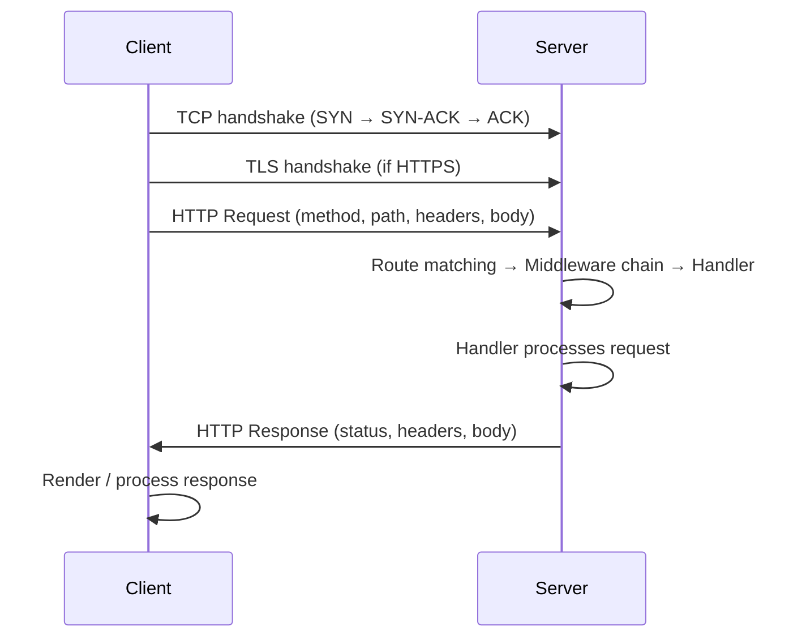

# HTTP Fundamentals

HTTP is the foundation of web communication. Before writing Go code, you need a
solid grasp of the protocol itself: how requests and responses flow, what
methods and status codes mean, and how headers carry metadata between client
and server.

---

## Table of Contents

1. [The HTTP Request/Response Lifecycle](#1-the-http-requestresponse-lifecycle)
2. [HTTP Methods](#2-http-methods)
3. [Status Codes](#3-status-codes)
4. [Headers and Content Types](#4-headers-and-content-types)

---

## 1. The HTTP Request/Response Lifecycle

HTTP is a stateless, text-based, request-response protocol. Every interaction
follows the same sequence: client establishes a TCP connection (optionally with
TLS), sends an HTTP request, the server processes it through routing and
middleware into a handler, and returns an HTTP response.



### Anatomy of a Request

A **request** has four parts:

```
GET /users?page=2 HTTP/1.1          <- Request line (method, path, version)
Host: api.example.com               <- Headers (key: value pairs)
Accept: application/json            <- Another header
                                     <- Empty line (separates headers from body)
                                     <- Body (optional, for POST/PUT)
```

### Anatomy of a Response

A **response** mirrors the structure:

```
HTTP/1.1 200 OK                     <- Status line
Content-Type: application/json      <- Headers
Content-Length: 128

{"id": 1, "name": "Alice"}          <- Body
```

### Connection Behavior

- HTTP/1.1 uses **persistent connections** by default — multiple requests share
  one TCP connection.
- Responses may use **chunked transfer encoding** for streaming, or
  **Content-Length** when the total size is known upfront.

> 🔑 **Key idea:** HTTP is "stateless with a memory-friendly transport" — the server
> keeps no memory of past requests, but a single TCP connection can carry many
> back-and-forth exchanges, which is why keep-alive matters for performance.

---

## 2. HTTP Methods

Each method has a defined semantic meaning. Choosing the wrong method makes your
API confusing.

| Method   | Idempotent | Safe | Purpose                              |
|----------|------------|------|--------------------------------------|
| `GET`    | Yes        | Yes  | Retrieve a resource                  |
| `POST`   | No         | No   | Create a resource or trigger action  |
| `PUT`    | Yes        | No   | Replace a resource entirely          |
| `PATCH`  | No         | No   | Partially update a resource          |
| `DELETE` | Yes        | No   | Remove a resource                    |

### Idempotent vs Safe

- **Idempotent** means repeating the same request N times produces the same
  result as one request. `GET`, `PUT`, and `DELETE` are idempotent.
- **Safe** means the request does not modify server state. Only `GET` is safe.

### PUT vs PATCH

`PUT` replaces a resource entirely — fields you omit get zeroed out. `PATCH`
updates only the fields you send. Be explicit in your documentation about which
semantics you follow.

> 🧠 **Think of it as:** PUT is "replace the whole file," PATCH is "apply a diff."
> POST a new document, PUT overwrite it wholesale, PATCH touch just the changed
> fields.

---

## 3. Status Codes

Status codes communicate the result of server processing. Picking the right
code is part of your API contract.

| Range | Category      | Meaning                        |
|-------|---------------|--------------------------------|
| 1xx   | Informational | Request received, processing   |
| 2xx   | Success       | Request processed successfully |
| 3xx   | Redirection   | Further action needed          |
| 4xx   | Client Error  | Client sent a bad request      |
| 5xx   | Server Error  | Server failed to fulfill       |

### Codes You Will Use Daily

| Code | Name               | When to use                                      |
|------|--------------------|--------------------------------------------------|
| 200  | OK                 | Successful GET, PUT, PATCH, or general success    |
| 201  | Created            | Resource successfully created via POST            |
| 204  | No Content         | Successful DELETE, nothing to return              |
| 301  | Moved Permanently  | Resource has a new permanent URL                  |
| 302  | Found              | Temporary redirect                                |
| 400  | Bad Request        | Malformed JSON, missing required fields           |
| 401  | Unauthorized       | Missing or invalid authentication                 |
| 403  | Forbidden          | Authenticated but not allowed                     |
| 404  | Not Found          | Resource does not exist                           |
| 405  | Method Not Allowed | Valid path but wrong HTTP method                  |
| 409  | Conflict           | Duplicate resource, version conflict              |
| 422  | Unprocessable      | Valid JSON but semantically incorrect              |
| 500  | Internal Error     | Unexpected server failure                         |
| 502  | Bad Gateway        | Upstream service returned invalid response        |
| 503  | Unavailable        | Server overloaded or under maintenance            |

> **Tip**: Many developers default to 400 for everything. Pick the most specific
> code: client forgot their token (401), has no permission (403), sent invalid
> email format (422), sent XML when you expect JSON (415).

---

## 4. Headers and Content Types

Headers carry metadata as key-value pairs where the value is always a string
(even when representing a list).

### Common Request Headers

```
Content-Type: application/json      <- Body format (POST/PUT)
Accept: application/json            <- Desired response format
Authorization: Bearer <token>       <- Authentication credential
```

### Common Response Headers

```
Content-Type: application/json
Content-Length: 256
Location: /users/42                 <- Where a newly created resource lives
Cache-Control: max-age=3600
```

### Content-Type Values

| Type                                | Use case                      |
|-------------------------------------|-------------------------------|
| `application/json`                  | JSON API responses            |
| `text/html`                         | HTML pages                    |
| `text/plain`                        | Plain text                    |
| `application/octet-stream`          | Binary downloads              |
| `multipart/form-data`               | File uploads                  |
| `application/x-www-form-urlencoded` | HTML form submissions         |

> ⚠️ **Watch out:** 400 and 422 are not interchangeable. 400 means the JSON/XML
> itself is malformed; 422 means the JSON parsed fine but the values are
> semantically wrong (e.g., empty required field). Pick precisely — your clients
> branch on this.

---

## Modern Practices

- **Use structured status codes** — don't default to 200 or 400 for everything.
  The right status code is part of your API contract.
- **Set `Content-Type` explicitly** on every response. Don't rely on Go's
  content sniffing — it's unreliable and slow.
- **Use `Accept` header** for content negotiation in public APIs. For internal
  APIs, returning JSON everywhere is usually sufficient.
- **Return `Location` header** with `201 Created` to tell clients where the
  new resource lives.
- **Use `Cache-Control` headers** on read-heavy endpoints to reduce load.
- **Prefer `application/json`** over `application/x-www-form-urlencoded` for
  APIs — it's more expressive and avoids encoding ambiguities.

---

## Common Mistakes

- **Confusing idempotent and safe methods.** `DELETE` is idempotent (repeating
  it produces the same result), but it is NOT safe (it modifies server state).
  `GET` is the only safe method.
- **Using POST for reads.** If a request doesn't modify state, use GET. It's
  cacheable, bookmarkable, and clearly communicates intent.
- **Returning 200 for errors.** Use 4xx for client errors and 5xx for server
  errors. Clients rely on status codes for retry logic and error handling.
- **Ignoring `Content-Length`.** Without it, clients can't tell when a response
  is complete without closing the connection. Go sets it automatically for
  small responses.
- **Using PUT for partial updates.** PUT replaces the entire resource. If
  you only want to update some fields, use PATCH.
- **Leaving `Allow` header empty on 405 responses.** When returning
  "Method Not Allowed", include the `Allow` header listing which methods are
  valid for that resource.

---

## Key Takeaways

1. HTTP is a stateless request-response protocol — client sends a request,
   server returns a response.
2. **HTTP methods** have defined semantics: `GET`/`PUT`/`DELETE` are idempotent;
   only `GET` is safe.
3. **Status codes** communicate result category: 2xx success, 4xx client error,
   5xx server error. Use the most specific code available.
4. **Headers** carry metadata — `Content-Type`, `Accept`, `Authorization`,
   `Cache-Control` are essential for APIs.
5. **Content-Type** tells the client (and server) how to interpret the body.
   Always set it explicitly.

---

## Next

Continue to [02-net-http.md](02-net-http.md) for Go's `net/http` package —
server creation, routing, handlers, request/response, JSON APIs, and HTTP
clients.
