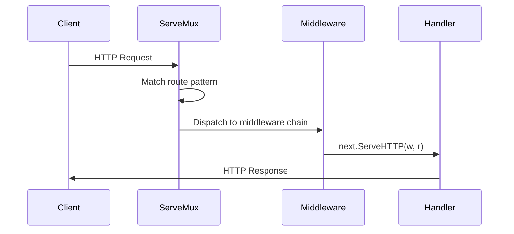
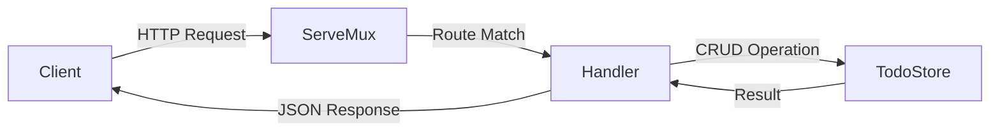

# The net/http Package

Go's `net/http` package is production-grade and built into the standard library.
It provides an HTTP server with routing, the `http.Handler` interface, an HTTP
client, file serving, cookie handling, and TLS support — all without third-party
dependencies.

---

## Table of Contents

1. [net/http Package Overview](#1-nethttp-package-overview)
2. [http.Handler and http.HandlerFunc](#2-httphandler-and-httphandlerfunc)
3. [http.Request in Detail](#3-httprequest-in-detail)
4. [http.ResponseWriter in Detail](#4-httpresponsewriter-in-detail)
5. [Path Parameters (Go 1.22+)](#5-path-parameters-go-122)
6. [Query Parameters](#6-query-parameters)
7. [Serving Static Files](#7-serving-static-files)
8. [JSON API Responses](#8-json-api-responses)
9. [Request Body Parsing](#9-request-body-parsing)
10. [Content Negotiation](#10-content-negotiation)
11. [HTTP Clients](#11-http-clients)
12. [Building a Complete REST API](#12-building-a-complete-rest-api)
13. [Testing HTTP Handlers with httptest](#13-testing-http-handlers-with-httptest)

---

## 1. net/http Package Overview

### Minimal Server

```go
package main

import (
    "fmt"
    "net/http"
)

func main() {
    http.HandleFunc("GET /hello", func(w http.ResponseWriter, r *http.Request) {
        fmt.Fprintf(w, "Hello, %s!", r.PathValue("name"))
    })
    fmt.Println("listening on :8080")
    http.ListenAndServe(":8080", nil)
}
```

Starting in Go 1.22, `HandleFunc` accepts method-prefixed patterns like
`"GET /hello"`, eliminating the need for an external router in many cases.

### Using an Explicit Mux

Always create your own mux in production to avoid accidental route conflicts:

```go
mux := http.NewServeMux()
mux.HandleFunc("GET /users", listUsers)
mux.HandleFunc("POST /users", createUser)
mux.HandleFunc("GET /users/{id}", getUser)

server := &http.Server{Addr: ":8080", Handler: mux}
server.ListenAndServe()
```

### Request Flow



> 🔑 **Key idea:** Everything in `net/http` is a `Handler`. A mux is a handler that
> routes, middleware is a handler that wraps another — learn the interface once and
> every piece composes.

---

## 2. http.Handler and http.HandlerFunc

The `http.Handler` interface is the central abstraction in Go's HTTP ecosystem:

```go
type Handler interface {
    ServeHTTP(ResponseWriter, *Request)
}
```

Any type with a `ServeHTTP` method is an HTTP handler — middleware, loggers,
auth checkers, and more.

### http.HandlerFunc — The Type Adapter

```go
type HandlerFunc func(ResponseWriter, *Request)

func (f HandlerFunc) ServeHTTP(w ResponseWriter, r *Request) {
    f(w, r)
}
```

This adapter lets you pass any function with the signature
`func(ResponseWriter, *Request)` where an `http.Handler` is expected:

```go
func withLogging(next http.Handler) http.Handler {
    return http.HandlerFunc(func(w http.ResponseWriter, r *http.Request) {
        log.Printf("%s %s", r.Method, r.URL.Path)
        next.ServeHTTP(w, r)
    })
}
```

> 🧠 **Think of it as:** `http.HandlerFunc` is a plug adapter — it converts a plain
> function into the `Handler` interface. Almost every handler handler you write
> goes through this adapter somewhere.

---

## 3. http.Request in Detail

### Key Fields

```go
type Request struct {
    Method     string          // "GET", "POST", etc.
    URL        *url.URL        // Parsed URL (path, query, host, scheme)
    Header     http.Header     // Map of header name -> []string values
    Body       io.ReadCloser   // Request body (must be closed)
    Host       string          // Host header value
    RemoteAddr string          // Client IP:port
}
```

### Method

Use the constants rather than string literals:

```go
switch r.Method {
case http.MethodGet:
    // handle GET
case http.MethodPost:
    // handle POST
default:
    http.Error(w, "not allowed", http.StatusMethodNotAllowed)
}
```

### URL and Header

```go
r.URL.Path        // "/users/42"
r.URL.RawQuery    // "page=2&limit=10"
r.Header.Get("Authorization")    // single value
r.Header.Values("Accept")        // all values (comma-separated)
```

### Body

```go
defer r.Body.Close()
body, err := io.ReadAll(r.Body)
if err != nil {
    http.Error(w, "failed to read body", http.StatusInternalServerError)
    return
}
```

Always close the body. Always check for read errors.

> ⚠️ **Watch out:** Forgetting `r.Body.Close()` may not crash your test, but under
> load it leaks connections and file descriptors. Always close the body, always
> check the read error.

### FormValue and URL.Query()

```go
name := r.FormValue("name")      // first value (parses query + form body)

params := r.URL.Query()           // url.Values (map[string][]string)
page := params.Get("page")        // "2"
tags := params["tag"]             // []string{"go", "http"} for ?tag=go&tag=http
```

---

## 4. http.ResponseWriter in Detail

In Go, **`http.ResponseWriter`** is an **interface** used by an HTTP handler to construct and send an HTTP response back to the client (like a browser or an API consumer).

```go
type ResponseWriter interface {
    Header() Header                // Get the response headers map
    Write([]byte) (int, error)     // Write bytes to the response body
    WriteHeader(statusCode int)    // Set the status code
}
```

Call `WriteHeader` **before** `Write`. Calling `Write` first implicitly sets
status 200. Once writing begins, headers are flushed and cannot be modified:

```go
w.Header().Set("Content-Type", "application/json")
w.WriteHeader(http.StatusCreated)
w.Write([]byte("resource created"))
```

The `http.Error` helper sets `Content-Type: text/plain`, writes the status code,
and writes the message in one call:

```go
http.Error(w, "not found", http.StatusNotFound)
```

> ⚠️ **Gotcha:** Writing the body implicitly sends status 200, and any later
> `WriteHeader` call is silently ignored. Set headers, then `WriteHeader`, then
> `Write` — in that order — or your status codes will lie.

---

## 5. Path Parameters (Go 1.22+)

Go 1.22 introduced method-based routing and path parameters in the standard
library:

```go
mux.HandleFunc("GET /users/{id}", getUser)
mux.HandleFunc("GET /users/{id}/posts/{postId}", getPost)
mux.HandleFunc("GET /files/{path...}", serveFile)    // wildcard (catch-all)
```

Extract values with `r.PathValue`:

```go
func getUser(w http.ResponseWriter, r *http.Request) {
    id, err := strconv.Atoi(r.PathValue("id"))
    if err != nil {
        http.Error(w, "invalid id", http.StatusBadRequest)
        return
    }
    // use id ...
}
```

> 💡 **Pro tip:** `{path...}` is a catch-all wildcard — perfect for static asset
> or file-serving routes. Remember it returns raw path segments like `/a/b`.
> Prefer typed `{id}` segments everywhere else so `PathValue` gives you clean
> parts.

---

## 6. Query Parameters

```
GET /users?page=2&limit=10&tag=go&tag=http
```

### Basic Usage

```go
func listUsers(w http.ResponseWriter, r *http.Request) {
    page := r.URL.Query().Get("page")      // "2"
    limit := r.URL.Query().Get("limit")    // "10"
    if page == "" {
        page = "1"
    }
    pageNum, err := strconv.Atoi(page)
    if err != nil {
        http.Error(w, "invalid page", http.StatusBadRequest)
        return
    }
    // use pageNum, limit ...
}
```

### Multiple Values and Building Query Strings

```go
tags := r.URL.Query()["tag"]   // []string{"go", "http"} for ?tag=go&tag=http

params := url.Values{}
params.Add("page", "2")
params.Add("tag", "go")
params.Add("tag", "http")
reqURL := "https://api.example.com/users?" + params.Encode()
```

---

## 7. Serving Static Files

```go
func main() {
    fs := http.FileServer(http.Dir("./static"))
    http.Handle("GET /static/", http.StripPrefix("/static/", fs))
    http.ListenAndServe(":8080", nil)
}
```

`http.FileServer` serves files from a directory. `http.StripPrefix` removes the
URL prefix before looking up the file — without it, the server would look for
`./static/static/style.css`.

To serve a single file:

```go
http.HandleFunc("GET /", func(w http.ResponseWriter, r *http.Request) {
    http.ServeFile(w, r, "./static/index.html")
})
```

**Security**: never serve files from the project root. Go's file server
prevents path traversal (`../`) automatically.

> ⚠️ **Watch out:** `http.FileServer` blocks `../` traversal, but it serves
> whatever directory you point it at. Serve a dedicated static folder, not the
> repo root — especially if it contains `go.mod`, configs, or `.env`.

---

## 8. JSON API Responses

### Writing JSON into a ResponseWriter

```go
func listUsers(w http.ResponseWriter, r *http.Request) {
    users := []User{
        {ID: 1, Name: "Alice"},
        {ID: 2, Name: "Bob"},
    }
    w.Header().Set("Content-Type", "application/json")
    json.NewEncoder(w).Encode(users)
}
```

`json.NewEncoder(w).Encode(v)` streams JSON directly to the `ResponseWriter`
without an intermediate `[]byte` allocation.

### Struct Tags

```go
type User struct {
    ID    int    `json:"id"`
    Name  string `json:"name"`
    Email string `json:"email,omitempty"`
}
```

- `json:"name"` — the key in JSON output.
- `omitempty` — omit the field if it is the zero value for its type.
- `json:"-"` — always omit this field.

> 💡 **Pro tip:** `omitempty` can silently swallow `0` or `""` values in responses.
> In request structs, use pointer fields (`*string`, `*bool`) to distinguish
> "absent" from "explicitly zero" — the same pattern the REST sample uses for
> updates.

---

## 9. Request Body Parsing

### JSON Bodies

```go
func createUser(w http.ResponseWriter, r *http.Request) {
    var user User
    if err := json.NewDecoder(r.Body).Decode(&user); err != nil {
        http.Error(w, "invalid JSON", http.StatusBadRequest)
        return
    }
    defer r.Body.Close()
    // use user ...
}
```

`json.NewDecoder` reads from `r.Body` directly — streaming and
memory-efficient. Do not use `io.ReadAll` + `json.Unmarshal`.

### Limiting Body Size

```go
r.Body = http.MaxBytesReader(w, r.Body, 1<<20) // 1 MB limit

var user User
if err := json.NewDecoder(r.Body).Decode(&user); err != nil {
    var maxErr *http.MaxBytesError
    if errors.As(err, &maxErr) {
        http.Error(w, "request body too large", http.StatusRequestEntityTooLarge)
        return
    }
    http.Error(w, "invalid JSON", http.StatusBadRequest)
    return
}
```

> ⚠️ **Gotcha:** After `MaxBytesReader` trips its limit, further reads return an
> error — and the server closes the connection so the client can't keep uploading.
> Distinguish this with `errors.As(err, &http.MaxBytesError{})` so users get a
> 413, not a mystery 400.

---

## 10. Content Negotiation

Content negotiation lets clients specify what format they want via the `Accept`
header:

```go
func getResource(w http.ResponseWriter, r *http.Request) {
    data := fetchData()
    switch r.Header.Get("Accept") {
    case "application/xml":
        w.Header().Set("Content-Type", "application/xml")
        xml.NewEncoder(w).Encode(data)
    case "text/plain":
        w.Header().Set("Content-Type", "text/plain")
        fmt.Fprintf(w, "%v", data)
    default:
        w.Header().Set("Content-Type", "application/json")
        json.NewEncoder(w).Encode(data)
    }
}
```

For most APIs, returning JSON everywhere is sufficient. The `Accept` header
supports quality factors (`application/json;q=0.9`) but Go does not parse them
automatically.

---

## 11. HTTP Clients

### Simple GET

```go
resp, err := http.Get("https://api.example.com/users")
if err != nil {
    log.Fatal(err)
}
defer resp.Body.Close()

var users []User
json.NewDecoder(resp.Body).Decode(&users)
```

### Custom Client with Timeout

```go
client := &http.Client{Timeout: 10 * time.Second}

req, err := http.NewRequest(http.MethodGet, "https://api.example.com/users", nil)
if err != nil {
    log.Fatal(err)
}
req.Header.Set("Accept", "application/json")
req.Header.Set("Authorization", "Bearer "+token)

resp, err := client.Do(req)
if err != nil {
    log.Fatal(err)
}
defer resp.Body.Close()
```

### POST with JSON Body

```go
payload := User{Name: "Charlie", Email: "charlie@example.com"}
body, _ := json.Marshal(payload)

req, _ := http.NewRequest(http.MethodPost,
    "https://api.example.com/users", bytes.NewReader(body))
req.Header.Set("Content-Type", "application/json")

resp, err := client.Do(req)
if err != nil {
    log.Fatal(err)
}
defer resp.Body.Close()

if resp.StatusCode != http.StatusCreated {
    errBody, _ := io.ReadAll(resp.Body)
    log.Fatalf("unexpected status %d: %s", resp.StatusCode, errBody)
}
```

### Context for Fine-Grained Control

```go
ctx, cancel := context.WithTimeout(context.Background(), 5*time.Second)
defer cancel()
req, _ := http.NewRequestWithContext(ctx, http.MethodGet, url, nil)
```

### The Default Client Has No Timeout

```go
// BAD — can hang forever
resp, err := http.Get(url)

// GOOD — bounded
client := &http.Client{Timeout: 10 * time.Second}
resp, err := client.Get(url)
```

The HTTP client does **not** return an error for 4xx/5xx status codes. Always
check `resp.StatusCode` yourself.

> ⚠️ **Watch out:** `http.Get` with the default client has no timeout — a stuck
> server holds your goroutine hostage forever. Always build `&http.Client{Timeout:
> ...}` and check `resp.StatusCode` manually; 404s and 500s are not errors to the
> client.

---

## 12. Building a Complete REST API

Below is a working CRUD API for a `Todo` resource using only the standard
library. Four files, no third-party imports.

### todo.go — Domain Types

```go
package main

import (
    "encoding/json"
    "errors"
    "net/http"
    "strconv"
    "sync"
    "time"
)

type Todo struct {
    ID        int       `json:"id"`
    Title     string    `json:"title"`
    Completed bool      `json:"completed"`
    CreatedAt time.Time `json:"created_at"`
}

type createTodoRequest struct {
    Title string `json:"title"`
}

type updateTodoRequest struct {
    Title     *string `json:"title,omitempty"`
    Completed *bool   `json:"completed,omitempty"`
}

var (
    ErrNotFound      = errors.New("todo not found")
    ErrTitleRequired = errors.New("title is required")
)

func (r *createTodoRequest) validate() error {
    if r.Title == "" {
        return ErrTitleRequired
    }
    return nil
}
```

### store.go — Thread-Safe In-Memory Storage

```go
type TodoStore struct {
    mu     sync.RWMutex
    nextID int
    todos  map[int]*Todo
}

func NewTodoStore() *TodoStore {
    return &TodoStore{nextID: 1, todos: make(map[int]*Todo)}
}

func (s *TodoStore) List() []Todo {
    s.mu.RLock()
    defer s.mu.RUnlock()
    result := make([]Todo, 0, len(s.todos))
    for _, t := range s.todos {
        result = append(result, *t)
    }
    return result
}

func (s *TodoStore) Get(id int) (*Todo, error) {
    s.mu.RLock()
    defer s.mu.RUnlock()
    t, ok := s.todos[id]
    if !ok {
        return nil, ErrNotFound
    }
    copy := *t
    return &copy, nil
}

func (s *TodoStore) Create(title string) (*Todo, error) {
    s.mu.Lock()
    defer s.mu.Unlock()
    t := &Todo{ID: s.nextID, Title: title, CreatedAt: time.Now()}
    s.todos[s.nextID] = t
    s.nextID++
    copy := *t
    return &copy, nil
}

func (s *TodoStore) Update(id int, req updateTodoRequest) (*Todo, error) {
    s.mu.Lock()
    defer s.mu.Unlock()
    t, ok := s.todos[id]
    if !ok {
        return nil, ErrNotFound
    }
    if req.Title != nil {
        t.Title = *req.Title
    }
    if req.Completed != nil {
        t.Completed = *req.Completed
    }
    copy := *t
    return &copy, nil
}

func (s *TodoStore) Delete(id int) error {
    s.mu.Lock()
    defer s.mu.Unlock()
    if _, ok := s.todos[id]; !ok {
        return ErrNotFound
    }
    delete(s.todos, id)
    return nil
}
```

### Client → Mux → Handler → Store Flow



### handlers.go — HTTP Layer

```go
func writeJSON(w http.ResponseWriter, status int, v any) {
    w.Header().Set("Content-Type", "application/json")
    w.WriteHeader(status)
    json.NewEncoder(w).Encode(v)
}

func writeError(w http.ResponseWriter, status int, msg string) {
    writeJSON(w, status, map[string]string{"error": msg})
}

type TodoHandler struct {
    store *TodoStore
}

func (h *TodoHandler) list(w http.ResponseWriter, r *http.Request) {
    writeJSON(w, http.StatusOK, h.store.List())
}

func (h *TodoHandler) create(w http.ResponseWriter, r *http.Request) {
    var req createTodoRequest
    if err := json.NewDecoder(r.Body).Decode(&req); err != nil {
        writeError(w, http.StatusBadRequest, "invalid JSON")
        return
    }
    if err := req.validate(); err != nil {
        writeError(w, http.StatusUnprocessableEntity, err.Error())
        return
    }
    todo, err := h.store.Create(req.Title)
    if err != nil {
        writeError(w, http.StatusInternalServerError, "failed to create todo")
        return
    }
    writeJSON(w, http.StatusCreated, todo)
}

func (h *TodoHandler) get(w http.ResponseWriter, r *http.Request) {
    id, err := strconv.Atoi(r.PathValue("id"))
    if err != nil {
        writeError(w, http.StatusBadRequest, "invalid id")
        return
    }
    todo, err := h.store.Get(id)
    if err != nil {
        if errors.Is(err, ErrNotFound) {
            writeError(w, http.StatusNotFound, "todo not found")
            return
        }
        writeError(w, http.StatusInternalServerError, "internal error")
        return
    }
    writeJSON(w, http.StatusOK, todo)
}

func (h *TodoHandler) update(w http.ResponseWriter, r *http.Request) {
    id, err := strconv.Atoi(r.PathValue("id"))
    if err != nil {
        writeError(w, http.StatusBadRequest, "invalid id")
        return
    }
    var req updateTodoRequest
    if err := json.NewDecoder(r.Body).Decode(&req); err != nil {
        writeError(w, http.StatusBadRequest, "invalid JSON")
        return
    }
    todo, err := h.store.Update(id, req)
    if err != nil {
        if errors.Is(err, ErrNotFound) {
            writeError(w, http.StatusNotFound, "todo not found")
            return
        }
        writeError(w, http.StatusInternalServerError, "failed to update")
        return
    }
    writeJSON(w, http.StatusOK, todo)
}

func (h *TodoHandler) delete(w http.ResponseWriter, r *http.Request) {
    id, err := strconv.Atoi(r.PathValue("id"))
    if err != nil {
        writeError(w, http.StatusBadRequest, "invalid id")
        return
    }
    if err := h.store.Delete(id); err != nil {
        if errors.Is(err, ErrNotFound) {
            writeError(w, http.StatusNotFound, "todo not found")
            return
        }
        writeError(w, http.StatusInternalServerError, "failed to delete")
        return
    }
    w.WriteHeader(http.StatusNoContent)
}
```

### main.go — Wiring

```go
package main

import (
    "fmt"
    "log"
    "net/http"
)

func main() {
    store := NewTodoStore()
    h := &TodoHandler{store: store}
    mux := http.NewServeMux()
    mux.HandleFunc("GET /todos", h.list)
    mux.HandleFunc("POST /todos", h.create)
    mux.HandleFunc("GET /todos/{id}", h.get)
    mux.HandleFunc("PUT /todos/{id}", h.update)
    mux.HandleFunc("DELETE /todos/{id}", h.delete)
    fmt.Println("listening on :8080")
    log.Fatal(http.ListenAndServe(":8080", mux))
}
```

### Test It

```bash
curl http://localhost:8080/todos
curl -X POST http://localhost:8080/todos \
  -H "Content-Type: application/json" -d '{"title":"Learn Go HTTP"}'
curl http://localhost:8080/todos/1
curl -X PUT http://localhost:8080/todos/1 \
  -H "Content-Type: application/json" -d '{"completed":true}'
curl -X DELETE http://localhost:8080/todos/1
```

> 🔑 **Remember:** The `writeJSON`/`writeError` helpers encode the HTTP contract
> in one place — status line, `Content-Type`, and body. Centralize those three and
> your handlers stay tiny and consistent.

---

## 13. Testing HTTP Handlers with httptest

Go's standard library provides `net/http/httptest` for testing HTTP code
without starting a real server. Two primary tools:

- `httptest.NewRecorder` — records an HTTP response in memory.
- `httptest.NewServer` — spins up a temporary HTTP server on a random port.

### Testing with httptest.NewRecorder

```go
package main

import (
    "io"
    "net/http"
    "net/http/httptest"
    "testing"
)

func TestHelloHandler(t *testing.T) {
    req := httptest.NewRequest(http.MethodGet, "/hello?name=Alice", nil)
    rec := httptest.NewRecorder()

    helloHandler(rec, req)

    res := rec.Result()
    if res.StatusCode != http.StatusOK {
        t.Fatalf("status = %d; want 200", res.StatusCode)
    }

    body, _ := io.ReadAll(res.Body)
    if string(body) != "Hello, Alice!" {
        t.Fatalf("body = %q; want %q", string(body), "Hello, Alice!")
    }
}
```

### Table-Driven Handler Test

```go
func TestHelloHandlerTable(t *testing.T) {
    tests := []struct {
        name  string
        query string
        want  string
        code  int
    }{
        {"with name", "?name=Bob", "Hello, Bob!", 200},
        {"no name", "", "Hello, world!", 200},
    }
    for _, tt := range tests {
        t.Run(tt.name, func(t *testing.T) {
            req := httptest.NewRequest(http.MethodGet, "/hello"+tt.query, nil)
            rec := httptest.NewRecorder()
            helloHandler(rec, req)

            if rec.Code != tt.code {
                t.Fatalf("code = %d; want %d", rec.Code, tt.code)
            }
            if rec.Body.String() != tt.want {
                t.Fatalf("body = %q; want %q", rec.Body.String(), tt.want)
            }
        })
    }
}
```

### Using httptest.NewServer

Instead of calling handlers directly, spin up a real HTTP server that listens
on a random port — useful for testing clients or full server setups.

```go
func TestServerEndToEnd(t *testing.T) {
    mux := http.NewServeMux()
    mux.HandleFunc("/hello", helloHandler)

    server := httptest.NewServer(mux)
    defer server.Close()

    resp, err := http.Get(server.URL + "/hello?name=Alice")
    if err != nil {
        t.Fatal(err)
    }
    defer resp.Body.Close()

    body, _ := io.ReadAll(resp.Body)
    if string(body) != "Hello, Alice!" {
        t.Fatalf("got %q", string(body))
    }
}
```

### Testing with Injected Dependencies

```go
type UserStore interface {
    Get(id string) (User, error)
}

type fakeUserStore struct {
    users map[string]User
}

func (f *fakeUserStore) Get(id string) (User, error) {
    if u, ok := f.users[id]; ok {
        return u, nil
    }
    return User{}, ErrNotFound
}

func TestGetUserHandler(t *testing.T) {
    h := &getUserHandler{store: &fakeUserStore{users: map[string]User{
        "1": {ID: "1", Name: "Alice"},
    }}}

    req := httptest.NewRequest(http.MethodGet, "/users/1", nil)
    req.SetPathValue("id", "1")
    rec := httptest.NewRecorder()
    h.ServeHTTP(rec, req)

    if rec.Code != http.StatusOK {
        t.Fatalf("want 200, got %d", rec.Code)
    }
    var u User
    if err := json.Unmarshal(rec.Body.Bytes(), &u); err != nil {
        t.Fatal(err)
    }
    if u.Name != "Alice" {
        t.Fatalf("got %s", u.Name)
    }
}
```

---

## Modern Practices

- **Use Go 1.22+ method+path routing** — `"GET /users/{id}"` eliminates the
  need for external routers like gorilla/mux in most projects.
- **Always use `http.NewServeMux()`** explicitly. The default mux (`http.DefaultServeMux`)
  is shared across the process and can cause route conflicts.
- **Set `ReadTimeout`, `WriteTimeout`, and `IdleTimeout`** on `http.Server`
  to prevent slow clients from holding connections indefinitely.
- **Use `json.NewEncoder(w).Encode()`** instead of `json.Marshal` + `w.Write()`
  — it streams directly without allocating an intermediate `[]byte`.
- **Use `json.NewDecoder(r.Body).Decode()`** instead of `io.ReadAll` + `json.Unmarshal`
  — it's streaming and memory-efficient.
- **Wrap `r.Body` with `http.MaxBytesReader`** in public-facing handlers to
  prevent denial-of-service attacks via oversized request bodies.
- **Use `httptest.NewRecorder`** for unit tests and `httptest.NewServer` for
  integration-style tests — never start a real server in tests.
- **Always check `resp.StatusCode`** on HTTP client responses — the client does
  not return errors for 4xx/5xx.

---

## Common Mistakes

- **Not closing the response body** — leaks TCP connections and exhausts file
  descriptors. Always `defer resp.Body.Close()`.
- **Not checking decode errors** — `json.NewDecoder(r.Body).Decode(&user)`
  without error checking leaves the struct at zero values on malformed JSON.
- **Not setting `Content-Type`** — Go guesses from body content, which is
  unreliable. Always set it explicitly.
- **Writing body before setting status code** — `Write()` implicitly sets 200;
  `WriteHeader()` is ignored after writing begins. Call `WriteHeader` first.
- **Using `http.DefaultClient` in production** — has zero timeout. A slow
  server blocks the goroutine forever. Always create a client with an explicit
  timeout.
- **Not limiting request body size** — an attacker can send a gigabyte body to
  exhaust memory. Wrap `r.Body` with `http.MaxBytesReader`.
- **Ignoring the response status code** — the HTTP client does not error on
  4xx/5xx. Always check `resp.StatusCode` yourself.

---

## Summary

| Concept            | Go type / function                        |
|--------------------|-------------------------------------------|
| Server             | `http.ListenAndServe`, `http.Server`       |
| Router             | `http.NewServeMux`, `HandleFunc`           |
| Handler            | `http.Handler` interface                   |
| Handler function   | `http.HandlerFunc` adapter                 |
| Request            | `http.Request`                             |
| Response writer    | `http.ResponseWriter`                      |
| Path parameters    | `r.PathValue("name")` (Go 1.22+)          |
| Query parameters   | `r.URL.Query().Get("key")`                |
| JSON encoding      | `json.NewEncoder(w).Encode(v)`            |
| JSON decoding      | `json.NewDecoder(r.Body).Decode(&v)`      |
| Static files       | `http.FileServer`, `http.ServeFile`       |
| HTTP client        | `http.Client`, `http.NewRequest`           |
| Test server        | `httptest.NewServer`                       |
| Body size limit    | `http.MaxBytesReader`                      |

---

## Key Takeaways

1. `net/http` is production-grade — start with the standard library, add a
   framework only when you have a genuine reason.
2. `http.Handler` interface and `http.HandlerFunc` adapter are the core
   abstractions — understand them deeply.
3. Go 1.22+ method+path routing (`"GET /users/{id}"`) eliminates the need for
   external routers in most cases.
4. Use `json.NewEncoder`/`json.NewDecoder` for streaming — never allocate
   intermediate `[]byte` buffers for JSON.
5. Always set timeouts on `http.Server`, always check status codes from
   `http.Client`, and always close response bodies.

---

## Next

Continue to [03-middleware.md](03-middleware.md) for middleware patterns —
logging, CORS, recovery, authentication, rate limiting, and chaining.
