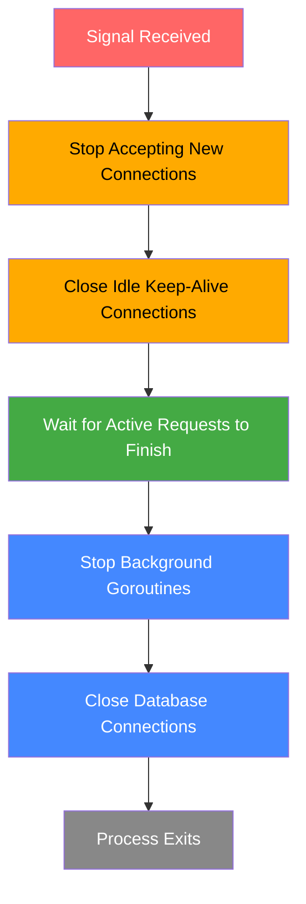
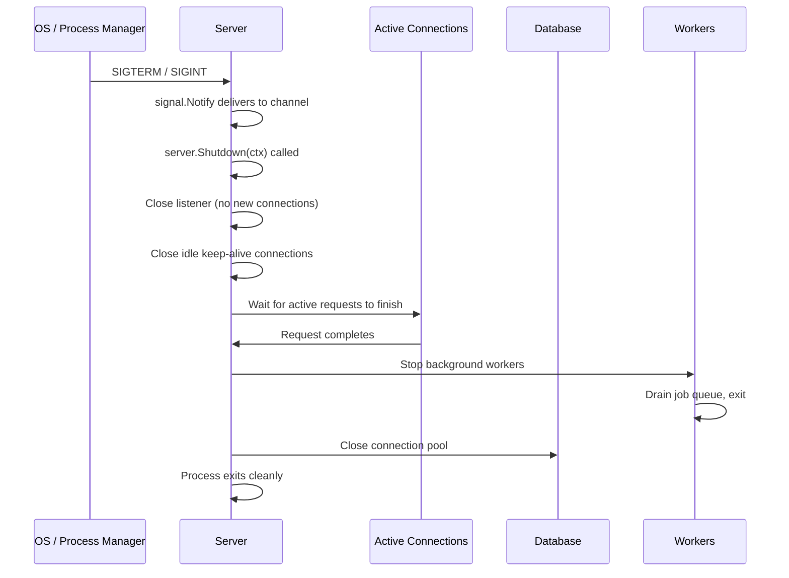
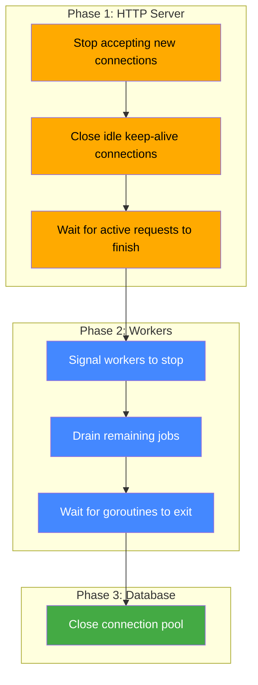

# Graceful Shutdown and REST API

When you stop a Go HTTP server with `ctrl+C` or a process manager sends
`SIGTERM`, the default behavior is brutal: the process exits immediately, all
open connections are severed mid-flight, in-progress requests lose their
responses, and database transactions may be left hanging. Graceful shutdown
fixes this by giving the server time to finish what it is doing before exiting.

---

## Table of Contents

1. [Why Graceful Shutdown Matters](#1-why-graceful-shutdown-matters)
2. [os.Signal Handling](#2-ossignal-handling)
3. [http.Server.Shutdown](#3-httpservershutdown)
4. [The Shutdown Lifecycle](#4-the-shutdown-lifecycle)
5. [Combining Signal Handling with http.Server](#5-combining-signal-handling-with-httpserver)
6. [Database Connection Cleanup on Shutdown](#6-database-connection-cleanup-on-shutdown)
7. [Background Goroutine Cleanup](#7-background-goroutine-cleanup)
8. [Context Cancellation for Shutdown Propagation](#8-context-cancellation-for-shutdown-propagation)
9. [Practical Example: Complete Server with Graceful Shutdown](#9-practical-example-complete-server-with-graceful-shutdown)
10. [Server Timeouts](#10-server-timeouts)

---

## 1. Why Graceful Shutdown Matters

Without graceful shutdown, three things go wrong:

1. **Dropped connections.** Clients receiving an in-progress response get a
   broken pipe or connection reset error.
2. **Lost data.** A handler mid-way through a database write may leave the
   database in an inconsistent state if the transaction is not committed or
   rolled back.
3. **Corrupted state.** Background goroutines, open file handles, and buffered
   writers may not flush their data before the process dies.

Graceful shutdown solves all three by coordinating the shutdown sequence:
stop accepting new connections, wait for existing work to finish, clean up
resources, then exit.



> 🔑 **Key idea:** Graceful shutdown is a choreographed sequence, not a single
> call. The goal is simple: stop letting new work in, let the in-flight work
> finish, then tear down resources in dependency order.

---

## 2. os.Signal Handling

The `os/signal` package lets you listen for operating system signals. The two
signals relevant to server shutdown are `SIGINT` (ctrl+C) and `SIGTERM` (sent
by most process managers).

```go
package main

import (
    "fmt"
    "log"
    "net/http"
    "os"
    "os/signal"
    "syscall"
)

func main() {
    mux := http.NewServeMux()
    mux.HandleFunc("/", func(w http.ResponseWriter, r *http.Request) {
        fmt.Fprintln(w, "hello")
    })

    server := &http.Server{
        Addr:    ":8080",
        Handler: mux,
    }

    errs := make(chan error, 1)
    quit := make(chan os.Signal, 1)
    signal.Notify(quit, syscall.SIGINT, syscall.SIGTERM)

    go func() {
        errs <- server.ListenAndServe()
    }()

    select {
    case err := <-errs:
        log.Fatalf("server error: %v", err)
    case sig := <-quit:
        log.Printf("received signal: %v, shutting down...", sig)
    }
}
```

`signal.Notify` tells the Go runtime to send `SIGINT` and `SIGTERM` values
into the `quit` channel instead of running the default handler (which is to
terminate the process). The `ListenAndServe` call runs in a goroutine so it
does not block the `select` that waits for signals.

This code handles the signal but does not yet perform a graceful shutdown. That
requires `http.Server.Shutdown`.

> ⚠️ **Watch out:** Receiving a signal is not the same as shutting down. Without
> `Shutdown`, your process still dies immediately — the signal handler just ran a
> log line on the way out.

---

## 3. http.Server.Shutdown

The `Shutdown` method tells the server to stop accepting new connections and
wait for existing connections to finish.

```go
err := server.Shutdown(context.Background())
if err != nil {
    log.Fatalf("shutdown error: %v", err)
}
```

When you call `Shutdown`:

1. The server immediately closes its listener. No new TCP connections are
   accepted.
2. The server closes all idle connections (keep-alive connections with no
   active requests).
3. The server waits for all active connections to complete their current
   requests.
4. When all connections are done (or the context is cancelled), `Shutdown`
   returns.

The context parameter controls the timeout. If you pass `context.Background()`,
the server waits forever for active connections to finish. In practice, you
always want a deadline:

```go
ctx, cancel := context.WithTimeout(context.Background(), 30*time.Second)
defer cancel()

err := server.Shutdown(ctx)
```

This gives active requests 30 seconds to complete. If they do not finish in
time, the context expires and `Shutdown` returns with `context.DeadlineExceeded`.

> ⚠️ **Gotcha:** `Shutdown(context.Background())` waits forever — a stuck handler
> hangs the process indefinitely. Always give the shutdown context a timeout so
> you can force-close stragglers instead of blocking a deploy forever.

---

## 4. The Shutdown Lifecycle

Here is the full lifecycle of a graceful shutdown:



Each step depends on the previous one. You cannot close database connections
before the server stops accepting new requests, because a new request might
try to use those connections. You cannot exit before closing connections, or
you get the data loss problems described at the start of this article.

> 🧠 **Memory aid:** "No new work, then finish work, then clean up." If a step
> could receive work from the step before it, don't tear it down yet — the
> ordering is a dependency graph, not a wish list.

---

## 5. Combining Signal Handling with http.Server

Putting it all together into a working server:

```go
package main

import (
    "context"
    "fmt"
    "log"
    "net/http"
    "os"
    "os/signal"
    "syscall"
    "time"
)

func main() {
    mux := http.NewServeMux()
    mux.HandleFunc("/", func(w http.ResponseWriter, r *http.Request) {
        fmt.Fprintln(w, "hello, world")
    })

    server := &http.Server{
        Addr:         ":8080",
        Handler:      mux,
        ReadTimeout:  10 * time.Second,
        WriteTimeout: 15 * time.Second,
        IdleTimeout:  60 * time.Second,
    }

    errs := make(chan error, 1)
    go func() {
        log.Printf("server listening on %s", server.Addr)
        errs <- server.ListenAndServe()
    }()

    quit := make(chan os.Signal, 1)
    signal.Notify(quit, syscall.SIGINT, syscall.SIGTERM)

    select {
    case err := <-errs:
        if err != nil && err != http.ErrServerClosed {
            log.Fatalf("server error: %v", err)
        }
    case sig := <-quit:
        log.Printf("signal %v received, shutting down", sig)
    }

    ctx, cancel := context.WithTimeout(context.Background(), 30*time.Second)
    defer cancel()

    log.Println("shutting down gracefully...")
    if err := server.Shutdown(ctx); err != nil {
        log.Fatalf("forced shutdown: %v", err)
    }

    log.Println("server stopped")
}
```

`ListenAndServe` returns `http.ErrServerClosed` when `Shutdown` is called.
This is expected and not a real error. The `select` handles both cases: a
real server error (which is fatal) or a signal (which triggers graceful
shutdown).

> 💡 **Pro tip:** Treat `http.ErrServerClosed` as a normal return value, not a
> failure. If you `log.Fatal` on every `ListenAndServe` error, every clean deploy
> will print a scary-but-fake crash line.

---

## 6. Database Connection Cleanup on Shutdown

A web server that uses a database must close the connection pool after the
server stops accepting requests. The sequence matters: shut down the HTTP
server first, then close the database.

```go
// After receiving signal:
ctx, cancel := context.WithTimeout(context.Background(), 30*time.Second)
defer cancel()
server.Shutdown(ctx)

if err := db.Close(); err != nil {
    log.Printf("database close error: %v", err)
}
```

Pass `r.Context()` to all database calls so that queries are cancelled when the
client disconnects or when the server shuts down. The `Shutdown` method
cancels all active request contexts, which propagates to any database queries
running in those requests.

> ⚠️ **Watch out:** `Shutdown` only knows about HTTP connections — your database
> pool must be closed separately, and only after the HTTP server has drained.
> Skipping `db.Close()` silently leaks the pool.

---

## 7. Background Goroutine Cleanup

Many servers spawn background goroutines for processing queues, running
periodic jobs, or maintaining caches. These goroutines need a way to know when
to stop.

The standard approach is to pass a context to the goroutine and check
`ctx.Done()` in the loop:

```go
func startWorker(ctx context.Context) {
    for {
        select {
        case <-ctx.Done():
            log.Println("worker stopping")
            return
        default:
            time.Sleep(1 * time.Second)
        }
    }
}
```

Call `cancel()` after `Shutdown` returns. The context cancellation is
immediate — all goroutines watching the context will exit on their next
iteration. For goroutines that need to flush buffers before exiting, give
them their own timeout (e.g., 5 seconds) instead of returning immediately.

> 💡 **Pro tip:** Context cancellation makes goroutines stop, but "stopped" and
> "flushed" are different things. If a worker buffered work, give it a short grace
> period (or drain its queue, like the sample's worker) before the process exits.

---

## 8. Context Cancellation for Shutdown Propagation

Context cancellation is the mechanism that ties shutdown to request handling.
When `Shutdown` is called, it cancels the context of every active request.
Handlers that respect their context will stop processing and clean up:

```go
mux.HandleFunc("/api/process", func(w http.ResponseWriter, r *http.Request) {
    ctx := r.Context()

    result, err := expensiveOperation(ctx)
    if err != nil {
        if ctx.Err() != nil {
            http.Error(w, "server is shutting down", http.StatusServiceUnavailable)
            return
        }
        http.Error(w, "operation failed", http.StatusInternalServerError)
        return
    }

    fmt.Fprintf(w, "result: %s", result)
})

func expensiveOperation(ctx context.Context) (string, error) {
    for i := 0; i < 100; i++ {
        select {
        case <-ctx.Done():
            return "", ctx.Err()
        default:
            time.Sleep(100 * time.Millisecond)
        }
    }
    return "done", nil
}
```

Always pass `r.Context()` (not `context.Background()`) when making database
queries, HTTP calls, or any I/O operation from a handler.

> 🔑 **Remember:** Cancellation only works if code *listens* for it. Handlers that
> ignore `r.Context()` can't be interrupted by shutdown — they keep running until
> your shutdown timeout expires. Thread the context through every I/O call.

---

## 9. Practical Example: Complete Server with Graceful Shutdown

Here is a production-style server with all shutdown concerns handled:

```go
package main

import (
    "context"
    "database/sql"
    "encoding/json"
    "fmt"
    "log"
    "net/http"
    "os"
    "os/signal"
    "sync"
    "syscall"
    "time"

    _ "github.com/lib/pq"
)

type App struct {
    db     *sql.DB
    server *http.Server
    worker *Worker
}

type Worker struct {
    jobs chan string
    quit chan struct{}
    wg   sync.WaitGroup
}

func NewWorker(bufferSize int) *Worker {
    return &Worker{jobs: make(chan string, bufferSize), quit: make(chan struct{})}
}

func (w *Worker) Start(ctx context.Context) {
    w.wg.Add(1)
    go func() {
        defer w.wg.Done()
        for {
            select {
            case job := <-w.jobs:
                processJob(ctx, job)
            case <-w.quit:
                for {
                    select {
                    case job := <-w.jobs:
                        processJob(ctx, job)
                    default:
                        return
                    }
                }
            }
        }
    }()
}

func (w *Worker) Stop() {
    close(w.quit)
    w.wg.Wait()
}

func processJob(ctx context.Context, job string) {
    select {
    case <-ctx.Done():
    default:
        time.Sleep(100 * time.Millisecond)
        log.Printf("processed job: %s", job)
    }
}

func NewApp(db *sql.DB) *App {
    app := &App{db: db, worker: NewWorker(100)}

    mux := http.NewServeMux()
    mux.HandleFunc("/health", app.healthHandler)
    mux.HandleFunc("/api/orders", app.ordersHandler)
    mux.HandleFunc("/api/submit", app.submitHandler)

    app.server = &http.Server{
        Addr: ":8080", Handler: mux,
        ReadTimeout: 10 * time.Second, WriteTimeout: 15 * time.Second, IdleTimeout: 60 * time.Second,
    }
    return app
}

func (a *App) healthHandler(w http.ResponseWriter, r *http.Request) {
    if err := a.db.PingContext(r.Context()); err != nil {
        http.Error(w, "unhealthy", http.StatusServiceUnavailable)
        return
    }
    fmt.Fprintln(w, "ok")
}

func (a *App) ordersHandler(w http.ResponseWriter, r *http.Request) {
    rows, err := a.db.QueryContext(r.Context(), "SELECT id, name FROM orders LIMIT 10")
    if err != nil {
        http.Error(w, "query failed", http.StatusInternalServerError)
        return
    }
    defer rows.Close()

    type order struct {
        ID   int    `json:"id"`
        Name string `json:"name"`
    }
    var orders []order
    for rows.Next() {
        var o order
        if err := rows.Scan(&o.ID, &o.Name); err != nil {
            http.Error(w, "scan failed", http.StatusInternalServerError)
            return
        }
        orders = append(orders, o)
    }
    w.Header().Set("Content-Type", "application/json")
    json.NewEncoder(w).Encode(orders)
}

func (a *App) submitHandler(w http.ResponseWriter, r *http.Request) {
    if r.Method != http.MethodPost {
        http.Error(w, "method not allowed", http.StatusMethodNotAllowed)
        return
    }
    a.worker.Submit("new-order")
    fmt.Fprintln(w, "submitted")
}

func (a *App) Run() {
    ctx, cancel := context.WithCancel(context.Background())
    defer cancel()
    a.worker.Start(ctx)

    errs := make(chan error, 1)
    go func() {
        log.Printf("server listening on %s", a.server.Addr)
        errs <- a.server.ListenAndServe()
    }()

    quit := make(chan os.Signal, 1)
    signal.Notify(quit, syscall.SIGINT, syscall.SIGTERM)

    select {
    case err := <-errs:
        if err != nil && err != http.ErrServerClosed {
            log.Fatalf("server error: %v", err)
        }
    case sig := <-quit:
        log.Printf("signal %v received", sig)
    }

    log.Println("phase 1: stopping HTTP server...")
    shutdownCtx, shutdownCancel := context.WithTimeout(context.Background(), 30*time.Second)
    defer shutdownCancel()
    if err := a.server.Shutdown(shutdownCtx); err != nil {
        log.Printf("HTTP shutdown error: %v", err)
    }

    log.Println("phase 2: stopping workers...")
    a.worker.Stop()

    log.Println("phase 3: closing database...")
    a.db.Close()

    log.Println("shutdown complete")
}

func main() {
    db, err := sql.Open("postgres", os.Getenv("DATABASE_URL"))
    if err != nil {
        log.Fatal(err)
    }
    db.SetMaxOpenConns(25)
    db.SetMaxIdleConns(5)
    if err := db.Ping(); err != nil {
        log.Fatal(err)
    }

    app := NewApp(db)
    app.Run()
}
```

### Three-Phase Shutdown



The three-phase shutdown pattern:

1. **Phase 1** stops the HTTP server. `Shutdown` closes the listener and waits
   for active requests to finish.
2. **Phase 2** stops background workers. The worker drains its job queue before
   exiting so no submitted jobs are lost.
3. **Phase 3** closes the database. By this point, no new queries will arrive,
   so closing the connection pool is safe.

> 🧠 **Think of it as:** "HTTP → Workers → DB" is a dependency chain: HTTP gates
> all new work, workers drain the queue it accepted, and the database is only
> safe to close once nothing can ask for it. Shut down in that order every time.

---

## 10. Server Timeouts

The three timeouts on `http.Server` are important for normal operation and
complement the shutdown process:

```go
server := &http.Server{
    Addr:         ":8080",
    Handler:      mux,
    ReadTimeout:  10 * time.Second,   // time to read entire request (incl. body)
    WriteTimeout: 15 * time.Second,   // time to write response
    IdleTimeout:  60 * time.Second,   // keep-alive idle timeout
}
```

- **`ReadTimeout`** limits how long the server waits to read the entire request
  (including the body). This prevents slow clients from holding connections
  indefinitely.
- **`WriteTimeout`** limits how long the server has to write the response. If a
  handler takes longer than this, the connection is closed.
- **`IdleTimeout`** controls how long a keep-alive connection stays open when no
  requests are in flight.

> ⚠️ **Watch out:** `ReadTimeout` only covers reading the request, not the whole
> exchange — a slow-loris attack stalls mid-body and `WriteTimeout` won't help.
> Keep timeouts tight and always set all three.

---

## Modern Practices

- **Always use `http.Server`** with explicit timeouts instead of
  `http.ListenAndServe` — the latter has zero timeouts and is vulnerable to
  slow loris attacks.
- **Set `ReadTimeout` and `WriteTimeout`** based on your slowest handler. 10s
  read / 15s write is a reasonable default for most APIs.
- **Use 15–30 seconds** for the shutdown timeout. Too short (5s) drops
  requests; too long (5min) keeps the process alive unnecessarily.
- **Pass `r.Context()`** to all database and HTTP calls from handlers — this
  propagates cancellation on shutdown.
- **Use `sync.WaitGroup`** to track active requests and background goroutines
  during shutdown. Log counts to verify clean exit.
- **Set the shutdown flag** (`atomic.Bool`) before calling `Shutdown` so that
  new requests during the shutdown window get a fast 503 instead of waiting for
  the full timeout.
- **Use `http.ErrServerClosed`** to distinguish graceful shutdown from real
  errors when handling `ListenAndServe` return values.
- **Close database connections** after `Shutdown` returns — `Shutdown` only
  handles HTTP connections, not your database pool.

---

## Common Mistakes

- **Not using `http.ErrServerClosed` as an expected error.** When `Shutdown` is
  called, `ListenAndServe` returns `http.ErrServerClosed`. This is not a real
  error. If you `log.Fatal` on every error from `ListenAndServe`, the server
  will print a misleading error message during every graceful shutdown.
- **Calling `os.Exit` instead of `Shutdown`.** Using `os.Exit(0)` in a signal
  handler terminates the process immediately without running deferred functions,
  closing database connections, or flushing buffers. Always call
  `server.Shutdown` and let the process exit naturally.
- **Setting the shutdown timeout too low.** A 5-second timeout might not be
  enough for handlers that do long-running work. But a timeout that is too high
  (like 5 minutes) keeps the process alive unnecessarily. A reasonable default
  is 15 to 30 seconds.
- **Forgetting to close database connections.** `Shutdown` closes HTTP
  connections but has no knowledge of your database pool. If you forget to call
  `db.Close()`, the database connection pool will leak.
- **Not draining background goroutines.** If you start goroutines that hold
  resources, they must be told to stop before the process exits. Use a context
  or a quit channel, and optionally a `sync.WaitGroup` to wait for them to
  finish.
- **Racing between shutdown and new requests.** There is a small window between
  receiving a signal and calling `Shutdown` during which new requests can still
  arrive. This is usually fine because `Shutdown` handles them, but be aware
  that your handler logic should work correctly even if the context is already
  cancelled.

---

## Exercises

1. **Shutdown with a custom timeout handler.** Write a middleware that checks
   whether the server is shutting down (using an `atomic.Bool` flag) and
   returns a 503 "Service Unavailable" response immediately. Set this flag
   before calling `Shutdown` so that new requests during the shutdown window
   are rejected quickly instead of waiting for the full timeout.

2. **Shutdown metrics.** Modify the complete server example to track the
   number of active requests using `sync.WaitGroup`. Log the count of active
   requests when shutdown starts and when it completes. This helps you verify
   that all requests finished before the process exited.

3. **Database connection pool tuning.** Write a program that opens a database
   connection pool, runs a server, and on shutdown prints the pool statistics
   (`db.Stats()`) before closing the pool. Observe how `MaxOpenConns`,
   `MaxIdleConns`, and `InUse` change under load. Tune the pool settings based
   on what you observe.

4. **Multi-server shutdown.** Write a program that starts two HTTP servers on
   different ports (one for public traffic, one for an admin interface). Both
   servers must shut down gracefully when a signal is received. Ensure that
   both `Shutdown` calls run concurrently so neither one blocks the other.

---

## Key Takeaways

1. **Graceful shutdown** coordinates: stop accepting → wait for active requests
   → clean up resources → exit. Without it, connections are severed and data
   can be lost.
2. **`signal.Notify`** captures `SIGINT`/`SIGTERM` and delivers them to a
   channel. **`server.Shutdown(ctx)`** stops the listener, closes idle
   connections, and waits for active requests.
3. **Always check for `http.ErrServerClosed`** when handling `ListenAndServe`
   errors — it's the expected return value during graceful shutdown.
4. **Three-phase shutdown**: HTTP server first, then background workers, then
   database. Each phase depends on the previous one completing.
5. **Set `ReadTimeout`, `WriteTimeout`, and `IdleTimeout`** on `http.Server`
  to prevent slow clients from holding connections indefinitely.

---

## Next

This completes Part 7 — HTTP Backend. Continue to
[08-grpc-protobuf/01-grpc-intro.md](../08-grpc-protobuf/01-grpc-intro.md) for
gRPC and Protocol Buffers, or return to the
[README.md](../README.md) for the full index.
